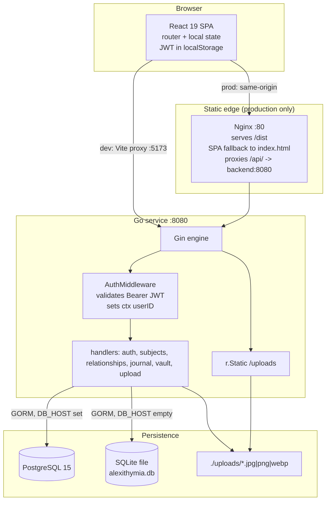
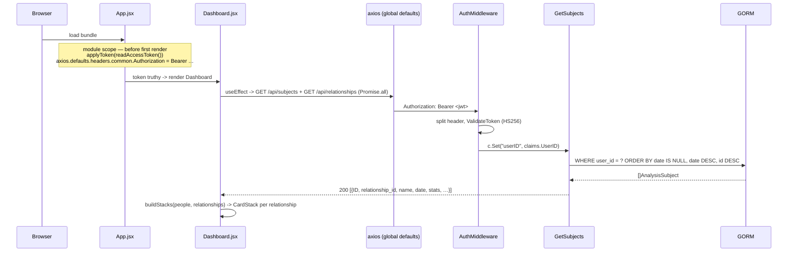
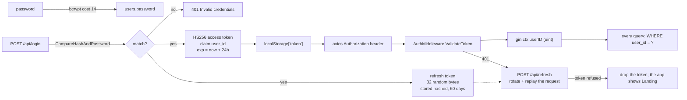

# 02 — System Architecture

---

## 1. Shape of the system

Three processes, no message queues, no caches, no background workers.



**Deliberate simplicity.** State lives in exactly two places: one relational table set and one
uploads directory. The API is stateless apart from refresh tokens, so the Go process can be
restarted or replaced at any moment without invalidating logins.

---

## 2. Layering

### Backend — a flat three-layer service

```
cmd/server/main.go          Composition root: connect DB, register routes, listen.
        │
internal/handlers/          HTTP layer. Binds JSON, reads ctx "userID", calls GORM
        │                   directly, writes JSON. No service layer by design.
        │
internal/database/          Package-global *gorm.DB + driver selection + AutoMigrate.
internal/models/            GORM structs; the schema.
internal/domain/            Id allowlists shared by validation.
internal/auth/              bcrypt + JWT primitives. HTTP-agnostic.
```

There is intentionally **no repository or service layer**: handlers talk to `database.DB`
directly. The trade-off is that persistence cannot be swapped without touching handlers, which
is why the handler tests use `sqlmock` at the SQL level rather than a mocked interface. That
`database.DB` is a package-level variable is exactly what lets tests substitute a mock by
assignment.

### Frontend — router shell plus self-contained screens

```
main.jsx            React root, StrictMode, imports Tailwind entry CSS.
        │
App.jsx             BrowserRouter, token state, route guards, the two providers.
        │
context/            SubjectsContext (people + relationships), and JournalContext
        │           mounted inside it.
components/         One file per screen; each owns its own local state.
```

There is **no state library**. Two contexts hold the only cross-screen data — the subject list
and the journal's entries — and `token` lives in `App.jsx`. Everything else is local `useState`
in the screen that renders it. `Dashboard`'s sub-components (`Card`, `LoveChart`, `CardStack`,
`AboutModal`, `PersonForm`) are declared inside `Dashboard.jsx` rather than extracted;
`AnalysisTimeline` is separate because Recharts is a heavy import worth isolating.

---

## 3. Request lifecycle, end to end

### 3.1 Authenticated read — loading the dashboard



The header assignment happens at **module evaluation time**, not in an effect. That ordering is
load-bearing: the provider's fetch is a child effect and commits before `App`'s own, so an
effect-only assignment lets the very first `GET /api/subjects` go out anonymous and 401. Both
axios interceptors are installed at module scope for the same reason — see
[Frontend §2a](06-frontend.md#2a-authsessionjs--why-an-expired-token-is-no-longer-an-event). Do
not "clean it up" into an effect.

### 3.2 Write path — creating a subject

1. `PersonForm.handleSubmit` guards on a non-empty trimmed name and calls `onSave` with the
   whole snapshot, context capsule and scoring confidence included. Skipped categories are
   omitted from `stats` entirely.
2. `handleSavePerson` branches on `editingPerson && !isNewVersionMode`: `PUT /api/subjects/:ID`
   for a true edit, otherwise `POST /api/subjects`.
3. `CreateSubject` binds its input, reads `userID` from context, trims `name`, validates `stats`
   keys and ranges and the tag limits, parses `date` strictly with layout `2006-01-02`, then —
   in one transaction — **finds or creates the relationship** for that trimmed name and inserts
   the row pointing at it. Any validation failure is a `400` naming the offending field.
4. The response body — the full created row including its server-assigned `ID` — is spliced into
   shared state. **No refetch.**
5. On failure nothing is spliced: the modal stays open with the user's input and a `role="alert"`
   banner carries the server's message.
6. On success, if the new row lands in a stack that already had members, `WhatChanged` opens with
   the deltas. Its "add a note" action is a second, **partial** `PUT` carrying only `description`
   and `tags`.

This "echo the row, splice it into state" pattern is used uniformly by create, update and delete.
Add a field the server derives and it appears without extra work; add a field the server
*ignores* and the UI will silently show stale data until reload.

`PUT` follows the same path through `UpdateSubjectInput`, whose fields are **pointers** — fields
absent from the body are left as stored rather than overwritten with zero values.

### 3.3 Upload path

`Profile.jsx` posts `multipart/form-data` with field name `image` to `/api/upload`. The handler
validates the *client-declared* `Content-Type`, writes `./uploads/profile_<UnixNano><ext>`, and
returns `{ url: "/uploads/<file>" }`. The component stores that string into
`formData.profile_picture` **but does not persist it** — `PUT /api/me` is what attaches the URL,
which is why the success banner says "Remember to save changes".

Serving is a separate concern: `r.Static("/uploads", "./uploads")` is registered **outside** the
protected group, so avatars are public to anyone who knows the filename.

---

## 4. Authentication architecture



- **Stateless request path, stateful renewal.** Verifying a request touches nothing but the
  signing key. The one piece of session state is `refresh_tokens`, read only when a client asks
  for a new access token; it is what makes logout and revocation possible at all. An
  already-issued *access* token stays valid until its 24-hour expiry — the price of the stateless
  path, and the reason that number is small.
- **Expiry is renewed through, not surfaced.** The client stores `expires_in` and renews ahead of
  it; a `401` that still arrives triggers one shared refresh and a replay. Every screen calls
  through the global `axios`, so the interceptor sees them all.
- **Rotation is the compensation for a long-lived credential.** Every refresh consumes its token
  and issues a new one, so presenting a spent token means a replay or a theft — and every token
  that user holds is revoked. The client-side consequence is a hard rule: never two refreshes at
  once.
- **A signature is not an account.** `AuthMiddleware` also confirms the user row still exists,
  because a token outlives the account it names — a dropped volume leaves a browser holding a
  token that verifies perfectly against a user id that is gone. That case is a `401`.
- **Ownership is enforced per query, not per resource.** There is no ACL layer; every query
  carries `AND user_id = ?`, so a mismatched id yields *not found* rather than *forbidden*.
  Preserve that pattern in any new endpoint.
- **The signing key is captured once, at package init** —
  `var jwtKey = []byte(os.Getenv("JWT_SECRET"))` — so it cannot be reconfigured later. **An unset
  variable is fatal:** `main()` calls `auth.LoadSecret()` first and exits with an explanatory
  message. Before Phase 5 the key silently became the empty byte slice — tokens still signed and
  verified, so the application worked normally while every token was forgeable by anyone. That is
  the failure the fail-fast removes, and the reason the Vault page can claim what it does.

---

## 5. Where state lives

| State | Location | Lifetime | Notes |
| :---- | :------- | :------- | :---- |
| Users, subjects, relationships, journal | Postgres or SQLite, via GORM | Durable | Soft-deleted, never hard-deleted by the app |
| Avatars | `./uploads` on the backend's working directory | Durable on host, **ephemeral in Docker** (no volume) | Served publicly |
| Access token | `localStorage['token']` | 24 h, renewed silently | Also mirrored into `axios.defaults` |
| Refresh token | `localStorage['alq:refresh-token']` | 60 days, rotated on every use | Hashed copy in `refresh_tokens`; revoked on logout |
| Access token expiry | `localStorage['alq:token-expires-at']` | With the token | Enables renewal *before* a request fails |
| Last email address | `localStorage['alq:last-email']` | Until logout replaces it | **The password is never stored** |
| Subject + relationship lists | `SubjectsProvider` | Per session | Fetched once; mutated locally afterwards |
| Journal entries, days, triggers, outbox | `JournalProvider`, mounted inside it | Per session | Reads relationships from `SubjectsContext`, never a second copy |
| Journal per-device settings | `localStorage`, nine `alq:journal-*` keys | Per device | Never sent anywhere |
| Embedding index | IndexedDB, per device | Until sign-out | No server endpoint exists for it |
| Active card index per stack | `useState` in each `CardStack` | Per mount | Reset to 0 whenever `versions.length` changes |
| Which stack dialog is open | `stackDialog` in `Dashboard` | Until closed | Stores the relationship **id**, not the stack, so it re-reads live state |
| Hidden chart lines | `useState(new Set())` in `AnalysisTimeline` | Per mount | Lost when navigating back |

### The subject list is shared, and the timeline is a route

`people` lives in `SubjectsProvider`
([`src/context/SubjectsContext.jsx`](../src/context/SubjectsContext.jsx)), mounted around the
whole route table, so a mutation made on one screen is visible on the other with no refetch.

`AnalysisTimeline` is reached by URL — `/relationships/:id/timeline` — so it is linkable,
bookmarkable and correct under the back button, and it renders from the same shared context.

> The route is keyed by the relationship **id**, so a bookmark survives a rename. The
> pre-Phase-4 `/timeline/:name` form still resolves via `LegacyTimelineRedirect`, best-effort by
> construction — a stack renamed since the link was made cannot be found by name, which is the
> fragility the id route ends.

---

## 6. Network topology per environment

| | Frontend origin | How `/api` reaches Go | How `/uploads` reaches Go |
| :- | :-------------- | :-------------------- | :------------------------ |
| **Local dev** (`npm run dev` + `go run`) | `http://localhost:5173` | Vite dev-server proxy → `http://localhost:8080` | Vite proxy, explicitly configured |
| **Docker Compose** | `http://localhost:8082` (host → Nginx :80) | Nginx `location /api/` → `backend:8080` ([`nginx.conf`](../nginx.conf)) | Nginx `location /uploads/` → `backend:8080`, under a `sandbox` CSP |
| **Direct backend** | — | `http://127.0.0.1:8081` (loopback-bound; this machine only) | same |

Under Compose the proxy is the only route in: `8081` is bound to loopback and Postgres is not
published at all, so the body-size cap, the login rate limit and the security headers in
`nginx.conf` are the limits everything on the network actually hits. The upstream is resolved per
request through Docker's DNS rather than once at startup, so recreating the backend container no
longer strands Nginx on a dead IP.

Because both environments make the SPA and the API **same-origin**, the Go service ships **no
CORS middleware at all**. Any deployment that serves the SPA from a different origin must add
CORS handling; nothing in the current code will hint at this until requests start failing.

---

## 7. Extension seams

| Want to… | Touch |
| :------- | :---- |
| Add a persisted field to a subject | `models.go` → `CreateSubjectInput` → both handlers → `PersonForm` → card render. [Recipe](10-agent-guide.md#recipe-2-add-a-field-to-analysissubject) |
| Add an eighth category | `CATEGORIES` in `src/constants/categories.js` **and** `domain.CategoryIDs`. [Recipe](10-agent-guide.md#recipe-1-add-or-change-a-love-category) |
| Introduce a service layer | Insert between `handlers/` and `database.DB`; the handler tests would move from `sqlmock` to interface mocks |
| Attach anything to a relationship as a whole | The `Relationship` model, plus `summaryQuery`'s select list in [`relationships.go`](../backend/internal/handlers/relationships.go). This is the seam per-relationship cadence and coherent export hang off |
| Drop the denormalized `AnalysisSubject.Name` | Remove the field, delete the sync in rename and merge, and have every reader take the name from the relationship. Deliberately deferred so rollback stays trivial |
| Add server-side validation of stats | Already done — `validateStats` and friends in [`subjects.go`](../backend/internal/handlers/subjects.go) |
