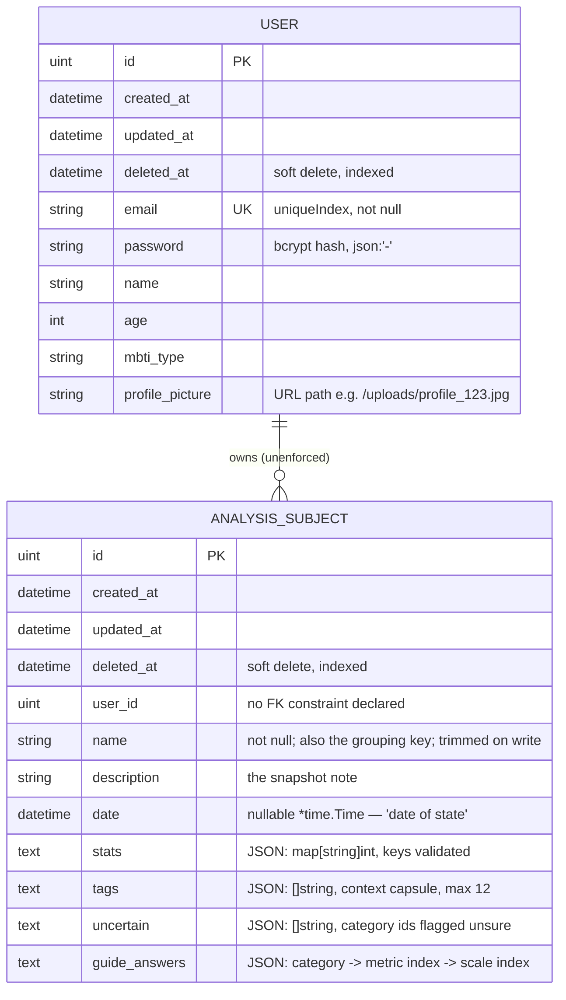

# 03 — Data Model & Persistence

Canonical source: [`backend/internal/models/models.go`](../backend/internal/models/models.go)
(the entire schema, in 27 lines).

---

## 1. Entities



### `User`

```go
type User struct {
	gorm.Model
	Email          string `gorm:"uniqueIndex;not null" json:"email"`
	Password       string `gorm:"not null" json:"-"`
	Name           string `json:"name"`
	Age            int    `json:"age"`
	MBTIType       string `json:"mbti_type"`
	ProfilePicture string `json:"profile_picture"`
}
```

- `Password` holds a bcrypt hash and is `json:"-"`, so it can never leak through
  `GET /api/me`, which serialises the whole struct.
- `MBTIType` is free-form on the server; the 16 valid values are enforced only by the
  frontend `<select>` ([`Profile.jsx:215-238`](../src/components/Profile.jsx#L215-L238)).
- `ProfilePicture` stores a **relative URL path**, not a filesystem path.

### `AnalysisSubject`

```go
type AnalysisSubject struct {
	gorm.Model
	UserID      uint           `json:"user_id"`
	Name        string         `gorm:"not null" json:"name"`
	Description string         `json:"description"` // the snapshot note
	Date        *time.Time     `json:"date"`
	Stats       map[string]int `gorm:"serializer:json" json:"stats"`
	Tags        []string       `gorm:"serializer:json" json:"tags"` // context chips

	Uncertain    []string                  `gorm:"serializer:json" json:"uncertain"`
	GuideAnswers map[string]map[string]int `gorm:"serializer:json" json:"guide_answers"`
}
```

- `Date` is a **pointer** precisely so "no date recorded" is representable as `null`.
  Every consumer must handle nil/null: the card falls back to the literal string
  `'No Date'`, the timeline to `'Unknown'`, and both sorts coerce with `new Date(x || 0)`.
- `Description` is the **snapshot note** — free text about the period, written in
  `PersonForm`'s "What's been happening?" step. It is unconstrained server-side.
- `Tags` is the **context capsule**, stored through the same `serializer:json` mechanism
  as `Stats` but as a `[]string`. It is nullable: rows written before this column existed
  read back as `nil`, which the UI renders as no chips. Handlers cap it at 12 entries of
  ≤ 40 characters each and trim every entry.
- `Uncertain` holds the category ids the user scored but does not trust. Its invariant —
  **every id must also be a key in `Stats`** — is enforced by the handlers against the
  row's final state, not just the request body.
- `GuideAnswers` is a nested map: category id → metric index → scale index `0..3`. The
  metric index is a **stringified int** because JSON object keys are strings; the number of
  metrics per category is frontend-owned, so the server only checks that the key parses as
  a non-negative integer. Storing the answers rather than the derived band is deliberate —
  the band is arithmetic that can be recomputed and shown, the answers are what the user
  actually said.
- `UserID` is a plain `uint`. There is **no `gorm` foreign-key tag and no
  `belongs_to`/`has_many` association**, so no referential integrity is enforced by the
  database and deleting a user orphans their subjects.

---

## 2. `gorm.Model` and the `ID` casing trap

`gorm.Model` embeds:

```go
type Model struct {
	ID        uint           `gorm:"primarykey"`
	CreatedAt time.Time
	UpdatedAt time.Time
	DeletedAt gorm.DeletedAt `gorm:"index"`
}
```

Those fields carry **no `json` tags**, so Go's encoder uses the field names verbatim.
Every API response therefore mixes casing:

```json
{
  "ID": 7,
  "CreatedAt": "2026-02-20T09:14:02.114Z",
  "UpdatedAt": "2026-02-20T09:14:02.114Z",
  "DeletedAt": null,
  "user_id": 1,
  "name": "Alex",
  "description": "",
  "date": "2026-02-20T00:00:00Z",
  "stats": { "eros": 85, "ludus": 20, "storge": 40, "pragma": 10, "mania": 60, "agape": 55, "selflessness": 5 },
  "tags": ["conflict", "distance"]
}
```

> ⚠️ **This is the single most common source of frontend bugs in this codebase.**
> The primary key is `person.ID` (uppercase). The frontend relies on it in at least four
> places: the React `key` on each card, `onDelete(person.ID)`, the PUT URL, and the
> `p.ID === editingPerson.ID` splice in `handleSavePerson`. Writing `person.id` yields
> `undefined` silently — the request goes to `/api/subjects/undefined` and 404s.

If you ever want consistent snake_case, do not add tags to `gorm.Model` (you cannot);
replace the embed with explicit fields — and then fix every `.ID` reference.

---

## 3. `Stats` and `Tags`: JSON columns typed as Go values

`gorm:"serializer:json"` makes GORM marshal the value to JSON on write and unmarshal on
read, so each column is `text`/`jsonb`-ish while Go code sees `map[string]int` (stats) or
`[]string` (tags).

Verified end-to-end by
[`database_test.go`](../backend/internal/database/database_test.go), which round-trips
both a stats map and a tags slice through a real in-memory SQLite database.

### `Stats` is validated against the seven ids

The database column is still schemaless — the constraint lives in the handlers:

- The ids are duplicated into Go as
  [`domain.CategoryIDs`](../backend/internal/domain/categories.go); the labels, colours,
  and prose remain frontend-only.
- `validateStats` rejects any key outside that list with
  `400 {"error":"unknown stats key: <k>"}` and any value outside `0..100` with
  `400 {"error":"stats.<k> must be between 0 and 100"}`.
- **A missing key is legal and means "not scored".** Nothing zero-fills, and the UI honours
  it end to end: the card renders `—` for an absent key and the timeline leaves a gap.
- Validation applies to `POST` and to any `PUT` that carries a `stats` key. Rows written
  before this existed are untouched: a legacy `{"love": -999}` still reads back as-is and
  is only rejected if someone tries to write it again.

Because `Stats` is a map, `binding:"dive"`-style tags cannot cover key names — hence the
explicit loop in
[`subjects.go`](../backend/internal/handlers/subjects.go).

### `Tags` limits

`validateTags` trims every entry and rejects: more than 12 tags, an entry that is empty
after trimming, or an entry longer than 40 characters. The stored value is the **trimmed**
one, so `"  conflict "` and `"conflict"` are the same tag. Duplicates are not de-duplicated
server-side (the form prevents them client-side).

### `Uncertain` and `GuideAnswers` limits

`validateUncertain` rejects unknown category ids and any id with no matching key in the
row's `Stats`. `validateGuideAnswers` rejects unknown category ids, non-integer metric-index
keys, and answers outside `0..3`.

The uncertain check runs against the **resulting** row, which has one consequence worth
knowing: a `PUT` that sends `stats` without the categories the row is still unsure about is
rejected rather than silently storing a contradiction.

### Querying inside `stats`

Because the column is opaque JSON to GORM, you cannot filter or aggregate on individual
categories through the ORM. Any "show me everyone whose `mania` exceeds 70" feature must
either use raw driver-specific JSON SQL (`stats->>'mania'` on Postgres — unavailable on
the SQLite fallback) or filter in Go/JS after loading. Today, all such work is
client-side.

---

## 4. Soft deletes

`gorm.DeletedAt` makes every delete a soft delete: `DELETE /api/subjects/:id` issues
`UPDATE analysis_subjects SET deleted_at = <now> WHERE …`, and all subsequent reads are
implicitly scoped to `deleted_at IS NULL`.

Implications:

- The database grows monotonically; nothing is ever reclaimed by the application.
- Recovery is possible but only manually — `DB.Unscoped()` is not used anywhere in
  application code, only in a test assertion
  ([`database_test.go:132-135`](../backend/internal/database/database_test.go#L132-L135)).
- `users.email` has a **plain `uniqueIndex`, not a partial one**, so a soft-deleted user's
  email remains permanently reserved. There is no user-deletion endpoint today, so this
  is latent rather than active.
- Handler tests assert the soft-delete shape explicitly, expecting an `UPDATE`, not a
  `DELETE` ([`subjects_test.go`](../backend/internal/handlers/subjects_test.go)).
  A change to hard deletes will fail those tests.
- `DeleteSubject` inspects `RowsAffected` and returns `404` when nothing matched, so a
  delete of an unknown or unowned id is no longer reported as success.

---

## 5. Driver selection and migration

[`database.Connect()`](../backend/internal/database/database.go#L17-L49) runs before any
route is registered and does three things:

**1. Chooses a driver from one environment variable:**

```go
if os.Getenv("DB_HOST") == "" {
    // pure-Go SQLite: github.com/glebarez/sqlite, file "alexithymia.db" in the CWD
} else {
    // gorm.io/driver/postgres, DSN: host user password dbname port sslmode=disable TimeZone=UTC
}
```

The SQLite driver is `glebarez/sqlite` (backed by `modernc.org/sqlite`), which is
**CGO-free**. That is what allows the backend Dockerfile to build with
`CGO_ENABLED=0` and still keep the fallback path compiling.

**2. Fails hard.** Both branches use `log.Fatalf` on connection error, so an unreachable
database exits the process rather than degrading. This is the actual mechanism behind the
root README's "restart the backend container" advice — the backend does **not** retry or
wait for Postgres; see [Deployment](09-deployment.md#no-readiness-gate-for-postgres).

**3. Auto-migrates on every boot:**

```go
err = DB.AutoMigrate(&models.User{}, &models.AnalysisSubject{})
```

There are **no migration files and no version table.** `AutoMigrate` creates tables,
adds missing columns, and adds missing indexes. It deliberately does **not**:

- drop or rename columns,
- narrow types,
- change or remove constraints.

So additive schema changes need no ceremony — add the field to the struct and restart.
`Tags`, `Uncertain`, and `GuideAnswers` were all added exactly this way; a pre-existing
database gains the nullable columns on the next boot with no data touched, which
[`TestAutoMigrateAddsNewColumns`](../backend/internal/database/database_test.go) asserts by
dropping all three, seeding a legacy row, and re-migrating. Add any future additive column
to that test's `additiveColumns` list.

Destructive or renaming changes require manual SQL against each environment. Plan for
this before proposing a rename.

Table names are GORM's pluralised snake_case defaults: `users`, `analysis_subjects`.
Those literal names appear in test expectations, so renaming a model breaks
`subjects_test.go`.

---

## 6. There is no "person" entity

Worth stating plainly, because it is unusual and it is load-bearing:

**Identity is a string.** Multiple `AnalysisSubject` rows sharing a `name` are the
versions of one person, and that grouping is computed in the browser
([`Dashboard.jsx:509-518`](../src/components/Dashboard.jsx#L509-L518)) — there is no
`subject_id`, no parent row, and no server-side notion of a version chain.

| Consequence | Detail |
| :---------- | :----- |
| Rename is a split | Editing `name` on one row detaches it into its own stack. Nothing renames the group. |
| Collisions merge silently | Two different real people named "Alex" become one stack with interleaved dates. |
| Case still matters | Grouping is exact `===` on the stored string. `name` is now trimmed by both the form and the server, so `"Alex "` no longer splits off — but `"alex"` and `"Alex"` remain two stacks, and rows written before the trim landed keep their whitespace until a backfill. |
| Ordering is client-side | `GET /api/subjects` has no `ORDER BY`; cards sort descending by date, the timeline ascending. |
| No pagination | Every subject for the user is returned in one array on every dashboard mount. |

If subjects must become durable entities — for renaming, merging, or server-side
timeline queries — that is a schema migration (`subjects` + `analysis_versions`), an API
change, and a rewrite of `groupedPeople`. Treat it as a project, not a patch.

---

## 7. Files on disk

| Path | Written by | Notes |
| :--- | :--------- | :---- |
| `backend/alexithymia.db` | SQLite fallback | **Committed to git** and not in `.gitignore`. It contains real dev users and their bcrypt hashes. See [Known Issues](11-known-issues.md#the-development-sqlite-database-is-committed-to-git). |
| `backend/uploads/profile_<nanos>.<ext>` | `UploadProfilePicture` when run from `backend/` | The path is relative to the process working directory. |
| `backend/internal/handlers/uploads/profile_<nanos>.<ext>` | the same handler when run by `go test ./...` | Test artefacts, created because the working directory during tests is the package directory. Four such files are currently committed. |

Both upload directories are byproducts of `uploadDir := "./uploads"` being
CWD-relative ([`upload.go:36`](../backend/internal/handlers/upload.go#L36)) — the
strongest argument for making the directory configurable.
