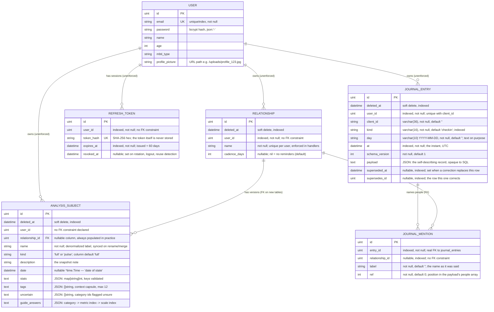

# 03 — Data Model & Persistence

Canonical source: [`backend/internal/models/models.go`](../backend/internal/models/models.go)
— the entire schema, in one file.

---

## 1. Entities



### `User`

`Password` holds a bcrypt hash and is `json:"-"`, so it can never leak through `GET /api/me`,
which serialises the whole struct. `MBTIType` is free-form on the server; the 16 valid values
are enforced only by the frontend `<select>`. `ProfilePicture` stores a **relative URL path**,
not a filesystem path.

### `RefreshToken`

The long-lived half of a session, written only by
[`issueSession`](../backend/internal/handlers/session.go) and read only by `Refresh` and
`Logout`. Never serialised to a client. Three properties are load-bearing:

- **`TokenHash`, not the token.** A refresh token is a bearer credential with a two-month life,
  so a leaked table would otherwise be every account named in it. There is nothing to reverse —
  the input is 32 uniformly random bytes rather than a password — which is why a plain unsalted
  SHA-256 is right here and bcrypt would be wrong: bcrypt would also turn an indexed equality
  lookup into a scan comparing every row on every refresh.
- **`RevokedAt` rather than a delete.** A revoked row is what makes a *replay* detectable at
  all. Presenting an already-revoked token revokes every token the user holds; see
  [API §3.1](04-api-reference.md#31-session-renewal).
- **Rows are swept, not scheduled.** The table only grows through `issueSession`, so that is
  where expired rows for the user are deleted. No cron, no cleanup command, nothing to forget.

### `Relationship`

```go
type Relationship struct {
	gorm.Model
	UserID      uint   `gorm:"index;not null" json:"user_id"`
	Name        string `gorm:"not null" json:"name"`
	CadenceDays *int   `json:"cadence_days"`
}
```

- **Uniqueness of `(user_id, name)` is enforced in the handlers, not the database.** Soft
  deletes would require a *partial* unique index, and those are spelled differently on SQLite
  and Postgres. `UpdateRelationship` counts collisions inside its transaction and answers `409`;
  `FindOrCreateRelationship` looks up before inserting. The gap is a race between two
  simultaneous creates of the same new name — acceptable for a single-user self-hosted tool, and
  the worst outcome is two stacks that can be merged.
- **`CadenceDays` is inert on the server.** Nothing reads it except to store and return it:
  there is no scheduler, no job, no email. Due-ness is computed in the browser. Allowed values
  are nil (the default) or 7–365; the bounds live in `handlers.minCadenceDays`/`maxCadenceDays`.
- **Comparison is exact after `strings.TrimSpace`.** `"Alex "` and `"Alex"` are the same
  relationship; `"alex"` and `"Alex"` are two.

### `AnalysisSubject`

```go
type AnalysisSubject struct {
	gorm.Model
	UserID         uint          `json:"user_id"`
	RelationshipID *uint         `gorm:"index" json:"relationship_id"`
	Relationship   *Relationship `gorm:"foreignKey:RelationshipID" json:"-"`
	Name           string        `gorm:"not null" json:"name"`
	Kind           string        `gorm:"default:'full'" json:"kind"`
	Description    string        `json:"description"` // the snapshot note
	Date           *time.Time    `json:"date"`
	Stats          map[string]int            `gorm:"serializer:json" json:"stats"`
	Tags           []string                  `gorm:"serializer:json" json:"tags"`
	Uncertain      []string                  `gorm:"serializer:json" json:"uncertain"`
	GuideAnswers   map[string]map[string]int `gorm:"serializer:json" json:"guide_answers"`
}
```

- `Date` is a **pointer** precisely so "no date recorded" is representable as `null`. Every
  consumer must handle nil: the card falls back to `'No Date'`, the timeline to `'Unknown'`, and
  both sorts coerce with `new Date(x || 0)`.
- `Tags` is nullable: rows written before the column existed read back as `nil`, which the UI
  renders as no chips. Handlers cap it at 12 entries of ≤ 40 characters, each trimmed.
- `Uncertain`'s invariant — **every id must also be a key in `Stats`** — is enforced against the
  row's *final state*, not just the request body.
- `GuideAnswers` maps category id → metric index → scale index `0..3`. The metric index is a
  **stringified int** because JSON object keys are strings; the number of metrics per category is
  frontend-owned, so the server only checks the key parses as a non-negative integer. Storing the
  answers rather than the derived band is deliberate — the band can be recomputed, the answers
  are what the user actually said.
- `RelationshipID` is a **pointer** only so `AutoMigrate` can add the column to an existing
  table. Treat it as required: the startup backfill populates every legacy row and find-or-create
  sets it on every write, so a row reaching a client without one is a server bug.
- `Relationship` exists **solely so GORM emits a real foreign key**. It is always nil and
  `json:"-"` keeps the wire shape unchanged. Postgres gets the constraint; SQLite cannot retrofit
  a foreign key onto an existing table, so on an upgraded SQLite database enforcement is
  **handler-level only**. A related consequence: SQLite refuses to *drop* a column a foreign key
  references, which is why `relationship_id` is not in `database_test.go`'s `additiveColumns`.
- `Name` stays **denormalized** on every snapshot: it keeps rollback trivial and pre-Phase-4
  clients working, and rename and merge sync it in the same transaction.
- `Kind` carries a **column default rather than being nullable**. That matters more than it
  looks: without the default, every pre-Phase-5 row would read back NULL, and scanning NULL into
  a Go `string` fails outright — every read would break, not merely look odd. Both engines
  backfill existing rows when a column is added with a default (SQLite always; Postgres since
  11), and `TestAutoMigrateAddsNewColumns` asserts it.
- `UserID` is a plain `uint`. There is **no foreign-key tag and no association**, so deleting a
  user would orphan their subjects — latent, since no user-delete endpoint exists.

### `JournalEntry`

```go
type JournalEntry struct {
	gorm.Model
	UserID        uint                   `gorm:"index;not null;uniqueIndex:idx_journal_user_client,priority:1;index:idx_journal_user_day,priority:1" json:"user_id"`
	ClientID      string                 `gorm:"type:varchar(36);not null;default:'';uniqueIndex:idx_journal_user_client,priority:2" json:"client_id"`
	Kind          string                 `gorm:"type:varchar(16);not null;default:'checkin';index" json:"kind"`
	Day           string                 `gorm:"type:varchar(10);not null;default:'';index:idx_journal_user_day,priority:2" json:"day"`
	At            time.Time              `gorm:"index;not null" json:"at"`
	SchemaVersion int                    `gorm:"not null;default:1" json:"schema_version"`
	Payload       map[string]interface{} `gorm:"serializer:json" json:"payload"`
	SupersededAt  *time.Time             `gorm:"index" json:"superseded_at"`
	SupersedesID  *uint                  `gorm:"index" json:"supersedes_id"`

	Mentions []JournalMention `gorm:"foreignKey:EntryID" json:"mentions"`
}
```

One event in the emotional journal.

- **Rows are append-only.** A correction is a *new* row carrying `supersedes_id`, and the row it
  replaces gets `superseded_at` stamped. Readers wanting the current state filter on one indexed
  column instead of walking a chain; readers wanting the history do not filter at all. Nothing a
  user said is ever rewritten by something they said later — which is also why there is no `PUT`.
- **`ClientID` is the idempotency key.** The client mints it before the first write, so a retried
  POST — from the offline queue, or a phone that lost the response — collides with the row it
  already wrote instead of writing a second one. Unique **per user**:
  `idx_journal_user_client` is `(user_id, client_id)` in that order. It is a plain unique index
  rather than a partial one, so a soft-deleted entry keeps its `client_id` reserved on purpose —
  a retry after a delete should collide, not resurrect the row.
- **`Kind` is `"checkin"`, `"ritual"`, `"person_fact"` or `"trigger"`**, validated against
  [`domain.JournalKinds`](../backend/internal/domain/journal.go). The column default is what
  stops a row ever scanning as an empty kind.
- **`Day` is text, not a date, and that is the point.** It is the local civil day the entry
  belongs to (`YYYY-MM-DD`, with the client's rollover hour applied, so a 02:00 note belongs to
  the day before) — a partition key rather than a timestamp. A real date column would put
  `MIN`/`MAX` back into the typing trap `aggregateTime` exists to absorb
  ([trap 10a](10-agent-guide.md#3-traps-that-fail-silently)); as `varchar(10)` those aggregates
  are strings on both engines and still sort correctly.
- **`At` is a value, not a pointer, and is a documented exception** to the `YYYY-MM-DD` rule
  (invariant 8). That rule governs a snapshot's *date of state*; a check-in is an instant, and a
  date would lose what the day graph draws. The client sends RFC 3339 with an offset, the server
  stores UTC, and the offset is kept inside the payload.
- **`Payload` is the JSON-in-text pattern** again — a `map[string]interface{}` in Go, opaque to
  SQL. Its shapes are versioned by `SchemaVersion` on the row and by a `v` inside the payload, so
  a reader never has to know *when* a row was written to know how to read it. Two consequences:
  JSON has one number type, so an int written here reads back as a `float64`; and keys the server
  does not recognise are **kept**, because a newer client may write a field an older server has
  never heard of and dropping it silently is the description-wipe mistake in a new form.
- **The vocabularies are server-side ids only.** `domain.FeelingIDs`, `domain.RitualQuestionIDs`
  and `domain.JournalKinds` mirror `domain.CategoryIDs`; labels, the two axes the day graph draws
  on, and colours are frontend-owned. The ids are permanent — adding one is two edits in two
  languages and no schema change, and **removing one is forbidden**, because an id that stops
  validating orphans every entry that used it. A retired id is marked `retired: true` in the
  frontend constant, so the UI stops offering it while the server keeps accepting it for old rows.

### `JournalMention`

Who an entry was about. It is a **table rather than an array inside `payload`** for the same
reason `relationship_id` is a column and not a key inside `stats`: a merge has to move it with
one `UPDATE`, and a relationship has to be able to count its mentions.

- **`RelationshipID` is nullable and means what it says.** A person can be mentioned before they
  are anyone in the database. Where a name *does* become a relationship it does so through
  `database.FindOrCreateRelationship`, the same function the snapshot path and the backfill use.
- **`Label` is denormalized like `AnalysisSubject.Name`**, and for a stronger reason: it is the
  name as it was said that day, so it survives a rename — it is a quotation — and it survives the
  relationship being deleted.
- **`Ref` is the position in the payload's people array**, so a feeling's `about` can point at a
  mention without repeating the name.
- **`EntryID` carries a real foreign key**; `RelationshipID` does **not** — it is an indexed id,
  checked in the handlers like every other ownership question. The foreign key has the SQLite
  consequence the Phase 4 one had: the column cannot be dropped, which is why
  `TestAutoMigrateAddsJournalTables` drops whole tables rather than columns.
- There is **no `gorm.Model`**: no soft delete and no timestamps. A mention has no life of its
  own — it belongs to an append-only row that carries its own instant.

**What merging and deleting a person do to mentions** — the difference is the whole argument for
`Relationship` being the one register of people:

| Action | Mentions |
| :----- | :------- |
| `PATCH /api/relationships/:id` (rename) | **Nothing.** A mention points at the id, and its `label` is a quotation of what was said that day — rewriting it would put words in the user's mouth |
| `POST /api/relationships/:id/merge` | **Moved**, in the same transaction as the snapshots. No `Unscoped()` is needed — a mention has no soft delete, so this already covers mentions on soft-deleted *entries*, which matters because the entry is recoverable and a mention left behind would come back pointing at a relationship that no longer exists. Reported as `mentions_moved` |
| `DELETE /api/relationships/:id` | **Counted and left alone.** The rows stay, the labels stay, and `relationship_id` keeps pointing at the now soft-deleted relationship, so every join through it drops out on its own. Deleting a person must not rewrite the user's own record of a day. Reported as `mentions_detached` |
| `DELETE /api/journal/entries/:id` | **Nothing.** The entry is soft-deleted and its mentions stay attached; every read that counts them joins through the entry, so they stop counting without a row being destroyed, and restoring the entry restores them intact |

Only the merge writes to `journal_mentions`, and it writes one statement. That was the test the
design set for putting people in one table rather than two.

---

## 2. `gorm.Model` and the `ID` casing trap

`gorm.Model` embeds `ID`, `CreatedAt`, `UpdatedAt` and `DeletedAt` with **no `json` tags**, so
Go's encoder uses the field names verbatim. Every API response therefore mixes casing:

```json
{
  "ID": 7,
  "CreatedAt": "2026-02-20T09:14:02.114Z",
  "user_id": 1,
  "name": "Alex",
  "date": "2026-02-20T00:00:00Z",
  "stats": { "eros": 85, "ludus": 20 },
  "tags": ["conflict", "distance"]
}
```

> ⚠️ **The single most common source of frontend bugs in this codebase.** The primary key is
> `person.ID` (uppercase). The frontend relies on it in at least four places: the React `key`,
> `onDelete(person.ID)`, the PUT URL, and the `p.ID === editingPerson.ID` splice. Writing
> `person.id` yields `undefined` silently — the request goes to `/api/subjects/undefined` and
> 404s.

If you ever want consistent snake_case, do not add tags to `gorm.Model` (you cannot); replace the
embed with explicit fields — and then fix every `.ID` reference.

---

## 3. `Stats` and `Tags`: JSON columns typed as Go values

`gorm:"serializer:json"` makes GORM marshal on write and unmarshal on read, so each column is
`text`/`jsonb`-ish while Go sees `map[string]int` or `[]string`. Round-tripped end-to-end by
[`database_test.go`](../backend/internal/database/database_test.go) against real SQLite.

### `Stats` is validated against the seven ids

The database column is schemaless — the constraint lives in the handlers:

- The ids are duplicated into Go as
  [`domain.CategoryIDs`](../backend/internal/domain/categories.go); labels, colours and prose
  stay frontend-only.
- `validateStats` rejects any key outside that list with `400 {"error":"unknown stats key: <k>"}`
  and any value outside `0..100` with `400 {"error":"stats.<k> must be between 0 and 100"}`.
- **A missing key is legal and means "not scored".** Nothing zero-fills, and the UI honours it
  end to end.
- Validation applies to `POST` and to any `PUT` carrying a `stats` key. Rows written before this
  existed are untouched: a legacy `{"love": -999}` still reads back as-is and is only rejected if
  someone tries to write it again.

Because `Stats` is a map, `binding:"dive"`-style tags cannot cover key names — hence the explicit
loop in [`subjects.go`](../backend/internal/handlers/subjects.go).

### `Tags`, `Uncertain` and `GuideAnswers` limits

`validateTags` trims every entry and rejects more than 12 tags, an entry empty after trimming, or
one longer than 40 characters. The stored value is the **trimmed** one. Duplicates are not
de-duplicated server-side (the form prevents them).

`validateUncertain` rejects unknown category ids and any id with no matching key in the row's
`Stats`. `validateGuideAnswers` rejects unknown ids, non-integer metric-index keys, and answers
outside `0..3`. The uncertain check runs against the **resulting** row, so a `PUT` that sends
`stats` without the categories the row is still unsure about is rejected rather than silently
storing a contradiction.

### Querying inside `stats`

Because the column is opaque JSON to GORM, you cannot filter or aggregate on individual
categories through the ORM. Any "show me everyone whose `mania` exceeds 70" feature must use raw
driver-specific JSON SQL (`stats->>'mania'` on Postgres, unavailable on the SQLite fallback) or
filter after loading. Today all such work is client-side.

---

## 4. Soft deletes

`gorm.DeletedAt` makes every delete a soft delete, and all subsequent reads are implicitly scoped
to `deleted_at IS NULL`.

- The database grows monotonically; nothing is ever reclaimed by the application.
- Recovery is possible but only manually — `DB.Unscoped()` is not used anywhere in application
  code, only in test assertions.
- `users.email` has a **plain `uniqueIndex`, not a partial one**, so a soft-deleted user's email
  stays permanently reserved. Latent, since there is no user-deletion endpoint.
- Handler tests assert the soft-delete shape explicitly, expecting an `UPDATE`, not a `DELETE`. A
  change to hard deletes will fail them.
- `DeleteSubject` inspects `RowsAffected` and returns `404` when nothing matched.

---

## 5. Driver selection and migration

[`database.Connect()`](../backend/internal/database/database.go#L17-L49) runs before any route is
registered and does four things.

**1. Chooses a driver from one environment variable:** `DB_HOST` empty → pure-Go SQLite
(`github.com/glebarez/sqlite`, file `alexithymia.db` in the CWD); otherwise
`gorm.io/driver/postgres`. The SQLite driver is **CGO-free**, which is what allows the backend
Dockerfile to build with `CGO_ENABLED=0` and still keep the fallback compiling.

**2. Fails hard.** Both branches use `log.Fatalf` on connection error, so an unreachable database
exits the process rather than degrading. The backend does **not** retry or wait for Postgres —
see [Deployment](09-deployment.md#postgres-readiness-gate).

**3. Auto-migrates on every boot** over `database.Models()` — `{User, Relationship,
AnalysisSubject, RefreshToken, JournalEntry, JournalMention}`, in dependency order. There are
**no migration files and no version table.** `AutoMigrate` creates tables, adds missing columns
and adds missing indexes; it deliberately does **not** drop or rename columns, narrow types, or
change constraints.

So additive changes need no ceremony — add the field to the struct and restart. `Tags`,
`Uncertain`, `GuideAnswers` and `Kind` were all added this way, and
`TestAutoMigrateAddsNewColumns` asserts it by dropping all four, seeding a legacy row and
re-migrating. **Add any future additive column to that test's `additiveColumns` list.**

A whole new table is the same story one level up: the two journal tables arrived by being added
to `Models()`, and `TestAutoMigrateAddsJournalTables` asserts it by dropping both from a database
carrying rows and re-migrating — tables rather than columns, because SQLite will not drop a
column a foreign key references. It checks the columns *and* the composite indexes: a unique
index that came back as `client_id` alone rather than `(user_id, client_id)` would still satisfy
`HasIndex`, and would reserve every client id across every user.

Destructive or renaming changes require manual SQL against each environment. Table names are
GORM's pluralised snake_case defaults, and those literal names appear in test expectations, so
renaming a model breaks `subjects_test.go`.

**4. Backfills relationships, idempotently.** The one structural migration the project has
([`backfill.go`](../backend/internal/database/backfill.go)): it reproduces the grouping the
browser used to compute — one relationship per `(user_id, TRIM(name))` — and links every snapshot
to it, normalizing the stored name to the trimmed form on the way.

| Property | How |
| :------- | :-- |
| Idempotent | Only rows `WHERE relationship_id IS NULL` are considered, so a second pass reports `0, 0` — what makes it safe on every boot |
| Coherent with soft deletes | Runs `Unscoped()`, so a soft-deleted snapshot is linked alongside its siblings rather than stranded |
| Bounded failure | One transaction per user; a partial run leaves the rest untouched and the next boot picks them up |
| Non-disruptive | Uses `UpdateColumns`, so `updated_at` is not bumped — a mechanical backfill should not make every snapshot look freshly edited |

> ⚠️ **Back up the database before the first boot on this version.** Adding a foreign-keyed
> column makes GORM's SQLite migrator *recreate* `analysis_subjects` (create temp → copy → drop →
> rename). It works — verified against a real pre-Phase-1 database
> ([Deployment §5](09-deployment.md#5-the-phase-4-relationship-migration)) — but a table rebuild
> plus a data backfill is the one moment in this project's history where a backup is not optional.

One divergence worth knowing: SQL `TRIM` removes spaces, while the handlers use Go's
`strings.TrimSpace`, which also removes tabs and newlines. Every name written since Phase 1 is
already trimmed, so the two only disagree on a pre-Phase-1 row whose name contained a tab.

---

## 6. The `Relationship` entity

Until Phase 4, identity was a string: rows sharing a `name` were the versions of one person, and
the grouping was computed in the browser. A stack could not be renamed, two different people
called Alex merged silently, and nothing could be attached to a relationship as a whole.

**Identity is now a row.** `relationships` is the person; `analysis_subjects.relationship_id` is
the version chain.

| Behaviour | How it works now |
| :-------- | :--------------- |
| Rename the stack | `PATCH /api/relationships/:id` renames the relationship and syncs the denormalized `name` onto every snapshot in the same transaction. A collision → `409`. The same endpoint carries `cadence_days` |
| Rename one version | `PUT /api/subjects/:id` with a changed `name` re-resolves find-or-create, so that version detaches to the relationship of the new name |
| Merge stacks | `POST /api/relationships/:id/merge` moves every snapshot (soft-deleted ones included) to the target, syncs their names, and soft-deletes the source. One-way |
| Two people, one name | Two relationships, two stacks. The name is a label, not a key |
| Case and whitespace | Find-or-create trims and compares exactly, so `"Alex "` joins the existing stack; `"alex"` is separate |
| Ordering | `GET /api/subjects` is `ORDER BY date IS NULL, date DESC, id DESC`; `GET /api/relationships` is most-recently-dated first. Undated rows sort last on both |
| No pagination | Every row per request, **deliberately** — a dashboard would need ~500 snapshots before the payload mattered |

### Compatibility by find-or-create

`POST /api/subjects` resolves the relationship from the trimmed name and creates it if new, so a
client that knows nothing about relationships — including any script posting `{name, stats}` —
still lands its snapshot in the right stack and populates the foreign key on the way through.

The backfill and the write path deliberately share one resolution function. Two different rules
for "which relationship is this name?" would split a stack in half.

### An emptied relationship survives

Deleting the last *version* of a stack leaves the relationship row behind with
`snapshot_count: 0`. This is intentional: the dashboard renders stacks from snapshots, so the
stack disappears from the grid — but posting that name again finds the same relationship, so the
stack comes back with its identity, and its timeline URL, intact.

---

## 7. Files on disk

| Path | Written by | Notes |
| :--- | :--------- | :---- |
| `backend/alexithymia.db` | SQLite fallback | **No longer tracked** (last committed at `2e4d71c`). It is also **not** in `.gitignore`, so a fresh one created by running the server locally shows up in `git status` and is one `git add .` away from being committed again with real users and their bcrypt hashes in it. Delete it when you are done. See [Known Issues](11-known-issues.md#the-development-sqlite-database-is-not-gitignored) |
| `backend/uploads/profile_<nanos>.<ext>` | `UploadProfilePicture` run from `backend/` | The path is relative to the process working directory |
| `backend/internal/handlers/uploads/profile_<nanos>.<ext>` | the same handler under `go test ./...` | Test artefacts, because the working directory during tests is the package directory. **Six** are committed, and `backend/**/uploads/` *is* in `.gitignore`, so the ~20 more that `go test` drops there never appear in `git status`. Do not delete the six |

Both upload directories are byproducts of `uploadDir := "./uploads"` being CWD-relative
([`upload.go:36`](../backend/internal/handlers/upload.go#L36)) — the strongest argument for making
the directory configurable.
