# 06 — Frontend Implementation

React 19.2 · Vite 7.3 · Tailwind CSS 3.4 · react-router-dom 7.13 · axios 1.13 ·
lucide-react 0.564 · recharts 3.7

---

## 1. Module graph

```mermaid
graph TD
    MAIN["main.jsx<br/>createRoot + StrictMode<br/>imports index.css"] --> APP["App.jsx<br/>BrowserRouter · token state · route guards"]
    APP --> SESS["auth/session.js<br/>tokens · renewal · both interceptors<br/>installed on import, not from an effect"]
    APP --> LOCK["AppLock.jsx<br/>optional screen lock"]
    APP --> DISC["context/DiscretionContext.jsx<br/>initials + blur + Ctrl+."]
    APP --> SUBS["context/SubjectsContext.jsx<br/>the one subject list"]
    SUBS --> JC["context/JournalContext.jsx<br/>the journal's entries · mounted inside SubjectsProvider"]
    APP --> JRN["Journal.jsx<br/>/journal · /journal/:day<br/>+ the journal's shared chips and shell"]
    APP --> JP["JournalPeople.jsx<br/>/journal/people · /journal/people/:id"]
    APP --> JT["JournalTriggers.jsx<br/>/journal/triggers — rename · merge"]
    APP --> JS["JournalSearch.jsx<br/>/journal/search — recall, on this device"]
    APP --> RIT["RitualCards.jsx<br/>/journal/ritual — the nightly questions<br/>full-viewport · claims both touch axes"]
    APP --> VAULT["Vault.jsx<br/>/vault — export · import · trust"]
    APP --> NAV["Navbar.jsx"]
    APP --> LAND["Landing.jsx"]
    APP --> AUTH["Auth.jsx"]
    APP --> DASH["Dashboard.jsx"]
    APP --> TR["TimelineRoute.jsx<br/>/relationships/:id/timeline<br/>+ legacy /timeline/:name redirect"]
    APP --> PROF["Profile.jsx"]
    TR --> TL["AnalysisTimeline.jsx<br/>recharts"]
    DASH --> WC["WhatChanged.jsx<br/>post-snapshot deltas"]
    DASH --> CC["ContextCapsule.jsx<br/>notes + tags editor"]
    DASH --> LS["LoveShape.jsx<br/>radar polygon"]
    TL --> LS
    WC --> LS
    WC --> CC
    LAND -.->|"AboutModal"| DASH
    DASH --> CN["CadenceNudge.jsx<br/>the one reminder"]
    DASH --> SA["StackActions.jsx<br/>the ⋯ stack menu"]
    DASH --> RD["RelationshipDialogs.jsx<br/>rename · merge · delete"]
    DASH -.->|"internal components"| INNER["Card · LoveChart · CardStack · SummaryLine<br/>AboutModal · CategorySliderRow · PersonForm"]
    DASH --> VK["VaultKnob.jsx<br/>the thumb-operated dial"]
    VK --> KF["mobile/knobFeedback.js<br/>detent click + haptic"]
    CONST["constants/categories.js<br/>CATEGORIES · GUIDE_SCALE · helpers"] -.-> DASH
    CONST -.-> TL
    CONST -.-> LS
    CONST -.-> WC
    SUBS -.-> DASH
    SUBS -.-> TR
    SUBS -.-> JC
    JC -.-> JRN
    CONSTJ["constants/journal.js<br/>FEELINGS · RITUAL_QUESTIONS · JOURNAL_COPY<br/>readers · day arithmetic"] -.-> JRN
    CONSTJ -.-> JC
    CONSTJ -.-> RIT
    CONSTJ -.-> JP
    CONSTJ -.-> JT
    CONSTJ -.-> DG["components/dayGraph.js<br/>day curve · branch paths · projection<br/>pure geometry, no renderer"]
    JRN --> DGC["DayGraph.jsx<br/>the day, drawn — hand-written SVG<br/>claims the horizontal axis"]
    DG -.-> DGC
    CONSTJ -.-> DGC
    JC -.-> RIT
    JC -.-> JP
    JC -.-> JT
    JRN -.->|"Frame · chips · AttachedFeelings"| JP
    JRN -.->|"Frame · chips · AttachedFeelings"| JT
    RD -.->|"Modal"| JP
    RD -.->|"Modal"| JT
    SUBS -.-> JP
    RIT --> KF
    JSET["constants/journalSettings.js<br/>the three §9.7 keys, per device"] -.-> RIT
    JSET -.-> PROF
    JSET -.-> JRN
    RIT -.->|"RitualNudge · useRitualPrompt"| DASH
    REC["journal/recorder.js<br/>capture state machine · level meter<br/>built C2 · nothing mounts it yet"] -.->|"C3"| JRN
    INF["journal/inference/index.js<br/>propose(input, context, runtime)<br/>the runtime is injected, never imported"] -.->|"C3 · D2"| JRN
    REC -.->|"clips"| INF
    FAKE["journal/inference/fake.js<br/>createFakeRuntime(fixtures)<br/>tests only — deliberately out of the app graph"] -.->|"npm test"| INF
    VAL["journal/inference/validate.js<br/>validateProposal(raw, context)<br/>the filter between the model and the user"] --> INF
    SCH["journal/inference/schema.js<br/>§5.2 as data, ids substituted from the constants<br/>+ checkSchema"] --> VAL
    FW["constants/forbiddenWords.js<br/>one list · the copy walk and the filter"] --> VAL
    PRM["journal/inference/prompt.js<br/>PROMPT_VERSION · buildPrompt(context)<br/>D3 hands it to the runtimes"] -.-> SCH
    GOLD["journal/inference/golden/<br/>60 transcripts · adversarial outputs<br/>tests and make journal-eval only"] -.->|"npm test"| VAL
    CARD["ProposalCard.jsx<br/>dashed → solid · resolution · provenance<br/>the composer's second body"]
    CTRL["CheckinControls.jsx<br/>chips · dots · grid · pickers · buildCheckinRequest<br/>shared by the composer and the card"]
    JRN --> CARD
    JRN --> CTRL
    CARD --> CTRL
    CARD -.->|"text mode, after an edit"| INF
    VC -.->|"onProposal"| CARD
    VC["VoiceCheckin.jsx<br/>tap · meter · transcript · download<br/>mounted inside the composer"] --> REC
    VC --> INF
    JRN --> VC
    WEBRT["journal/inference/web.js<br/>Gemma 4 E2B · Whisper tiny<br/>transformers.js, dynamic import — its own chunk"] --> INF
    VC --> WEBRT
    DL["journal/inference/download.js<br/>size · progress · cancel · SHA-256<br/>+ the verified cache"] --> WEBRT
    MAN["journal/inference/models.js<br/>13 files, pinned by length and hash<br/>second copy of the Makefile manifest"] -.-> DL
    TIER["journal/inference/tier.js<br/>full · light · text-only<br/>+ the downward-only override<br/>+ the Android memory table"] -.-> VC
    TIER -.-> PROF
    TIER -.-> VAULT
    NATRT["journal/inference/native.js<br/>Whisper tiny through the plugin<br/>handles across the bridge, never samples"] --> INF
    VC --> NATRT
    JPL["mobile/journalPlugin.js<br/>registerPlugin('AlqJournal')<br/>capture deps · native downloader · tier report"] --> NATRT
    JPL -.->|"deps"| REC
    JPL -.-> PROF
    JPL -.-> TIER
```



| File | Lines | Responsibility |
| :--- | ----: | :------------- |
| [`main.jsx`](../src/main.jsx) | 11 | React root, `StrictMode`, Tailwind entry import |
| [`App.jsx`](../src/App.jsx) | 197 | Router, guards, `SubjectsProvider`, and what a lost session looks like |
| [`auth/session.js`](../src/auth/session.js) | 386 | **The session**: storage and which store, the auth header, renewal, and both axios interceptors — installed on import |
| [`auth/useSessionRenewal.js`](../src/auth/useSessionRenewal.js) | 45 | Renews on mount, tab focus and Android resume |
| [`constants/categories.js`](../src/constants/categories.js) | 253 | **The taxonomy** plus the pure helpers that read it |
| [`constants/cadence.js`](../src/constants/cadence.js) | 107 | Due-date arithmetic and the nudge vocabulary. Pure, so the no-guilt rules are testable |
| [`constants/journal.js`](../src/constants/journal.js) | 1570 | **The journal's vocabulary, copy and arithmetic**: `FEELINGS`, `RITUAL_QUESTIONS`, `ENTRY_KINDS` (id-for-id with `domain/journal.go`), every renderable string in `JOURNAL_COPY`, the payload readers, civil-day arithmetic, `ritualDeck`, `ritualTimeReached`, candidate matching, `summarizePerson`/`summarizeTrigger`/`topFeelings`, and `renameTriggerRequest`/`mergeTriggerRequest`. Pure — no React, no network, **no `window`** |
| [`constants/journalSettings.js`](../src/constants/journalSettings.js) | 195 | §9.7's settings over `localStorage`: ritual and its time, optional questions, *Ask who I was with*, voice, *keep transcripts*, language, tier pin, *Show suggestions*. Tolerant readers — an unknown value costs a preference, never a screen. `embeddings` governs both similar-entry suggestions and `/journal/search` |
| [`journal/recorder.js`](../src/journal/recorder.js) | 610 | **The microphone as a state machine** (§4bf): tap to start/stop, 2 s silence stop, 30 s limit, *add more* onto the same take, level meter, noisy-take flag, and a discard that zero-fills first. Every browser API arrives through `deps` |
| [`journal/inference/index.js`](../src/journal/inference/index.js) | 326 | **The seam every model plugs into** (§4bg): `propose(input, context, runtime)` with the runtime injected, `buildContext` (closed vocabularies plus the user's names and labels, **never an id**), and `proposeRitual` for §3.7. Every result passes `validateProposal` before it leaves. Touches no network |
| [`journal/inference/validate.js`](../src/journal/inference/validate.js) | 402 | **The filter between the model and the user** (§4bm): pure `validateProposal(raw, context)` — schema, caps, the forbidden list over `label` and `text`, URL/markup/instruction detection, orphan facts, the ambiguity invariant — every drop counted on a provenance block. **The transcript is the one slot it does not filter** |
| [`journal/inference/schema.js`](../src/journal/inference/schema.js) | 338 | §5.2's JSON Schema **as data**, with `<FEELING_IDS>`/`<CONTEXT_TAGS>` substituted from the constants at build time so the model cannot emit an unknown id; `LIMITS`; and `checkSchema`. `PROPOSAL_GRAMMAR_SCHEMA` is the same schema with `tag` as a bounded string, because LLGuidance cannot bind an enum member containing a space |
| [`journal/inference/prompt.js`](../src/journal/inference/prompt.js) | 131 | The system prompt, versioned (`PROMPT_VERSION`), and `buildPrompt(context)`, which injects the two vocabularies and the user's names and labels — never an id |
| [`journal/inference/golden/`](../src/journal/inference/golden/) | — | `contexts.json`, `transcripts.json` (60 text-mode cases in 30 English/German pairs) and `adversarial.js` (raw outputs the filter must survive). Not imported by the app |
| [`constants/forbiddenWords.js`](../src/constants/forbiddenWords.js) | 23 | **The one forbidden list.** The copy walk and the proposal filter both read it; the walk pins its eighteen entries by name so it cannot quietly shrink |
| [`journal/inference/fake.js`](../src/journal/inference/fake.js) | 136 | The fixture-driven runtime component tests use, and `proposalFixture()`. **Tests only** — not re-exported, so it stays out of the bundle graph |
| [`journal/inference/native.js`](../src/journal/inference/native.js) | 214 | **The Android runtimes** (§4bl): `createNativeTranscriber` (Whisper via the plugin), `createNativeProposer` (Gemma 4 E2B via LiteRT-LM with the §5.2 grammar), `createNativeRuntime(tier)`. Sends clip **handles** across the bridge, never samples |
| [`journal/inference/web.js`](../src/journal/inference/web.js) | 494 | **The browser's runtimes.** `createWebTranscriber` (Whisper on WASM); `createWebProposer` (Gemma 4 E2B via transformers.js over **WebGPU, mandatory, no fallback**) — `Gemma4ForConditionalGeneration` on Full, `Gemma4ForCausalLM` on Light, which is what makes the Light download a real 3.1 GB subset. **No grammar on this path**, verified against 4.2.0 |
| [`journal/inference/light.js`](../src/journal/inference/light.js) | 112 | **The Light tier: two models, one `propose`.** Whisper's words win over the proposer's, because Whisper heard the audio; a proposer failure degrades to the transcript rather than losing what somebody said |
| [`journal/inference/ritual.js`](../src/journal/inference/ritual.js) | 205 | **§3.7's task**, not a second model: `buildRitualSchema(ids)` over tonight's deck, `buildRitualPrompt`, and `validateRitualProposal` — which drops an unasked key, drops a non-boolean rather than coercing it, and so leaves an unmentioned question **absent** |
| [`journal/inference/parse.js`](../src/journal/inference/parse.js) | 105 | Getting an object out of a grammar-less model's output. **Repairs framing, never content**: fences and surrounding prose are counted and removed; a truncated object is refused rather than closed. Its brace scanner respects strings |
| [`journal/embeddings/embed.js`](../src/journal/embeddings/embed.js) | 279 | **The embedding boundary** (§5.8): `embedTexts(texts, { kind, runtime })`, `prefixed()` — the **only** way a string reaches the model, because the two prompt prefixes are mandatory and a wrong one has no symptom — and `toIndexVector`, Matryoshka truncation to 256 that **re-normalises** |
| [`journal/embeddings/store.js`](../src/journal/embeddings/store.js) | 241 | **The device-local index** (§5.8 rule 1): `{ entry_client_id, model, dims, vector }` in IndexedDB behind an injectable backend, `staleIds`, `clearVectorIndex`. No server endpoint, no export path, no HNSW |
| [`journal/embeddings/similar.js`](../src/journal/embeddings/similar.js) | 293 | **The scan and the three rules**, pure: `cosine`, `scan`, `buildWitnesses`, `witnessAgrees` — rule 3 as a **hard gate**, not a weight — returning labels and ids with the similarity thrown away (rule 2) |
| [`journal/embeddings/recall.js`](../src/journal/embeddings/recall.js) | 615 | **§5.8's remaining four uses**, pure. `buildDocuments`; `lexicalRank`, weighted by inverse document frequency over the user's own corpus rather than a stopword list, so no language is named in the file; `recall`, which keeps what was **found** apart from what merely **looks alike**; `pastEntryOffers`, `orderNamesakes`, `alreadyKnown`, and `retrievalVocabulary` — triggers and people, **never feelings** |
| [`journal/embeddings/retrievalGolden.js`](../src/journal/embeddings/retrievalGolden.js) | 256 | The retrieval golden set and its scorer. Lexical cases run with no model; semantic ones are reported **skipped, by name**, never graded against a stand-in |
| [`journal/embeddings/golden/`](../src/journal/embeddings/golden/) | — | `retrieval.json` — a fixture journal in two languages, two snapshot notes, 26 cases |
| [`journal/embeddings/EmbeddingContext.jsx`](../src/journal/embeddings/EmbeddingContext.jsx) | 358 | The index as one object the screens question, mounted **inside** `JournalProvider`. Answers `offersFor`, `search`, `pastFor`, `orderCandidates`, `vocabularyFor` — labels, ids and entries, never a number. **A component with no provider gets the feature off**, not an error |
| [`journal/embeddings/availability.js`](../src/journal/embeddings/availability.js) | 31 | Whether this device can keep an index: IndexedDB, and not the Android shell — written as a **missing runtime** rather than a platform rule |
| [`journal/embeddings/embed.fake.js`](../src/journal/embeddings/embed.fake.js) | 126 | A fake embedder recording every string handed to it, prefix and all. **Tests only** |
| [`mobile/journalPlugin.js`](../src/mobile/journalPlugin.js) | 290 | The plugin's JS side (§4bl): `registerPlugin('AlqJournal')`, `nativeCaptureDeps()`, `createNativeDownloader()`, `primeNativeTier()` |
| [`mobile/journalPlugin.fake.js`](../src/mobile/journalPlugin.fake.js) | 150 | The fake plugin with the real surface, recording every call in order. **Tests only** |
| [`context/DiscretionContext.jsx`](../src/context/DiscretionContext.jsx) | 96 | Discretion mode: initials, blur class, `Ctrl+.`, tab title |
| [`context/SubjectsContext.jsx`](../src/context/SubjectsContext.jsx) | 225 | Shared subject **and relationship** lists, derived stacks, load state, six mutations |
| [`context/JournalContext.jsx`](../src/context/JournalContext.jsx) | 580 | The loaded day range, entries and day counts, the trigger vocabulary, `createEntry`/`deleteEntry`/`removePersonFromJournal`, and **the outbox** (§9.5) with its three flush signals and `client_id` idempotency. Mounted **inside** `SubjectsProvider` |
| [`Journal.jsx`](../src/components/Journal.jsx) | 782 | `/journal` and `/journal/:day` — month strip, day header, the day's check-ins, the ritual as footer, pull-to-refresh, `PendingMark`. Also the shared shell and chips |
| [`CheckinComposer.jsx`](../src/components/CheckinComposer.jsx) | 646 | The check-in sheet (§2e): both ways in, picked-feeling cards, tags and note, plus `VoiceCapture` and the proposal card as a second body. Saves through `createEntry` on both paths |
| [`CheckinControls.jsx`](../src/components/CheckinControls.jsx) | 451 | What the composer and card share (§2ea): `chipClass`, strength dots, `FeelingGrid`, the three pickers, `aboutText`, `buildCheckinRequest`. No opinion about proposals |
| [`ProposalCard.jsx`](../src/components/ProposalCard.jsx) | 1061 | **The proposal card** (§2ea): §4.4's anatomy, dashed until tapped; `resolvePerson`, `resolveTriggerLabel`, `cardStateFromProposal`, `mergeProposal`, `confirmedPicked`, `buildProvenance` exported and pure. The save body is the card's confirmed state; the proposal rides beside it as provenance |
| [`RitualVoice.jsx`](../src/components/RitualVoice.jsx) | 288 | **§3.7, the ritual in one breath** (Full tier only): one recording, one `proposeRitual`, and a confirm card with one row per question the deck asked. **A question the note did not mention contributes no key.** Saves nothing itself |
| [`VoiceCheckin.jsx`](../src/components/VoiceCheckin.jsx) | 448 | The microphone path (§4bk): `createVoiceKit`, `useVoiceAvailability`, the meter, the download offer, the editable transcript, and the `propose` envelope reported through `onProposal` |
| [`voiceKit.fake.js`](../src/components/voiceKit.fake.js) | 70 | A recorder store with the real surface and a `landTake`, a downloader that already has the files, and the fake runtime. **Tests only** |
| [`JournalPeople.jsx`](../src/components/JournalPeople.jsx) | 480 | `/journal/people` and `/journal/people/:id` — every person the journal knows, and §10.6's *remove this person from the journal* |
| [`JournalTriggers.jsx`](../src/components/JournalTriggers.jsx) | 467 | `/journal/triggers` — the user-grown vocabulary and the two corrections (rename, merge), which are `POST`s rather than endpoints |
| [`JournalSearch.jsx`](../src/components/JournalSearch.jsx) | 236 | `/journal/search` — §5.8's recall, on this device, behind the index toggle. **Two lists, not one**: *entries with these words* is checkable; *entries with similar words* is a guess, under its own heading. Results are entries; the app never summarises them |
| [`RitualCards.jsx`](../src/components/RitualCards.jsx) | 748 | `/journal/ritual` — the nightly questions as swipe cards, the closing day word, and the dashboard's prompt line. The one screen that claims **both** touch axes |
| [`Navbar.jsx`](../src/components/Navbar.jsx) | 76 | Sticky nav; brand link; discretion toggle, Journal, Vault, Profile/Logout or Sign In |
| [`Landing.jsx`](../src/components/Landing.jsx) | 65 | Anonymous marketing screen; "Learn the Theory" opens `AboutModal` |
| [`Auth.jsx`](../src/components/Auth.jsx) | 103 | Login *and* signup in one toggling form |
| [`Dashboard.jsx`](../src/components/Dashboard.jsx) | 1403 | Six sub-components and the grid screen |
| [`VaultKnob.jsx`](../src/components/VaultKnob.jsx) | 276 | The vault dial: scoring with a thumb without covering what you are reading |
| [`mobile/knobFeedback.js`](../src/mobile/knobFeedback.js) | 172 | The dial's detent — a synthesised metallic click and an Android selection haptic |
| [`TimelineRoute.jsx`](../src/components/TimelineRoute.jsx) | 100 | The id-keyed timeline route and the legacy name redirect |
| [`StackActions.jsx`](../src/components/StackActions.jsx) | 106 | The `⋯` menu above each stack: rename, rhythm, merge, delete |
| [`CadenceNudge.jsx`](../src/components/CadenceNudge.jsx) | 151 | The single reminder banner, its snooze, and the once-per-session rule |
| [`Vault.jsx`](../src/components/Vault.jsx) | 434 | `/vault`: what is stored, the privacy answers, export, import, app-lock setting |
| [`AppLock.jsx`](../src/components/AppLock.jsx) | 137 | The optional passphrase overlay and its idle timer |
| [`RelationshipDialogs.jsx`](../src/components/RelationshipDialogs.jsx) | 411 | `Modal` shell plus the four stack-level dialogs |
| [`AnalysisTimeline.jsx`](../src/components/AnalysisTimeline.jsx) | 317 | Time-axis history chart with milestone markers |
| [`LoveShape.jsx`](../src/components/LoveShape.jsx) | 126 | The seven-axis radar polygon |
| [`dayGraph.js`](../src/components/dayGraph.js) | 750 | **The day graph's geometry.** `buildDayCurve`, `branchPaths`, `project`, `dayGraphLegend`. Pure: no React, no SVG, no charting library |
| [`DayGraph.jsx`](../src/components/DayGraph.jsx) | 736 | **The day graph, drawn.** Hand-written SVG over that geometry: one `<path>` per branch, a camera with flat/tilt and two rotate buttons, `touch-action: pan-y`. Note the case: `DayGraph.jsx` draws, `dayGraph.js` decides |
| [`WhatChanged.jsx`](../src/components/WhatChanged.jsx) | 253 | Post-snapshot delta screen + its note follow-up |
| [`ContextCapsule.jsx`](../src/components/ContextCapsule.jsx) | 137 | The notes + tags editor, shared by `PersonForm` and `WhatChanged` |
| [`Profile.jsx`](../src/components/Profile.jsx) | 766 | User settings, avatar upload, check-in reminders, and eight of §9.7's nine journal settings — the voice block only where the device could run the transcriber |

> `Landing.jsx` importing `AboutModal` from `Dashboard.jsx` runs against the grain of the graph.
> It is deliberate — the category copy is the teaching surface and should be reachable before
> signup — and not circular, since `Dashboard` never imports `Landing`.

**Two shared stores, two contexts.** `token` lives in `App.jsx` (storage and renewal in
`auth/session.js`); the subject list in `SubjectsContext`; the journal's entries in
`JournalContext`, mounted inside it and **reading** the subject list rather than fetching a
second copy. Everything else is local `useState`. No state library: two contexts with a handful
of consumers each do not justify one.

---

## 2. `App.jsx` — auth wiring and route guards

The session lives in [`src/auth/session.js`](../src/auth/session.js); `App.jsx` holds the React
state and decides what the user sees. §2a covers renewal.

### `applyToken` — the header is never written from an effect

```js
// src/auth/session.js — one writer for the header and its stored copy.
// `write` picks localStorage or sessionStorage from the Stay-signed-in choice; see §2a.
export const applyToken = (token) => {
    if (token) {
        axios.defaults.headers.common['Authorization'] = `Bearer ${token}`;
        write(ACCESS_KEY, token);
    } else {
        delete axios.defaults.headers.common['Authorization'];
        write(ACCESS_KEY, null);
    }
};

// src/App.jsx
applyToken(readAccessToken());               // at import time, before the first render
const handleLogin = (session) => setTokenState(saveSession(session));  // saveSession calls applyToken
```

> **Load-bearing, and getting it wrong is self-concealing.** Child effects commit **before**
> their parent's, so `SubjectsProvider`'s fetch is a child effect of `App`: an effect-only
> header assignment lets the first `GET /api/subjects` after a login go out anonymous. The
> server 401s, the interceptor clears the token, and the user is bounced to Landing — where the
> only action leads back to the login form. It reads as "logging in does not work", and nothing
> in the console says why.
>
> `applyToken` is now the only writer, called from module scope and from `setToken`.
> `App.test.jsx` asserts the header's value **at the moment the fetch fires**.
>
> **The interceptors had the identical bug and it survived a year longer**, because it needed an
> *aged* token to show itself. `installSessionInterceptor` was called from a `useEffect`, so on a
> cold start the first fetch went out before it existed: requests 401'd with nothing to renew or
> replay them, and the dashboard rendered an error while `token` was still set. Both interceptors
> are now registered at module scope at the bottom of `auth/session.js`. **Nothing in this module
> may move back into an effect.**

### Guards

```jsx
<Route path="/"              element={token ? <Dashboard /> : <Landing />} />
<Route path="/login"         element={!token ? <Auth onLogin={handleLogin} /> : <Navigate to="/" />} />
<Route path="/profile"       element={token ? <Profile /> : <Navigate to="/login" />} />
<Route path="/vault"         element={token ? <Vault /> : <Navigate to="/login" />} />
<Route path="/journal"       element={token ? <Journal /> : <Navigate to="/login" />} />
<Route path="/journal/ritual"      element={token ? <JournalRitual /> : <Navigate to="/login" />} />
<Route path="/journal/people"      element={token ? <JournalPeople /> : <Navigate to="/login" />} />
<Route path="/journal/people/:id"  element={token ? <JournalPerson /> : <Navigate to="/login" />} />
<Route path="/journal/triggers"    element={token ? <JournalTriggers /> : <Navigate to="/login" />} />
<Route path="/journal/search"      element={token ? <JournalSearch /> : <Navigate to="/login" />} />
<Route path="/journal/:day"  element={token ? <Journal /> : <Navigate to="/login" />} />
<Route path="/relationships/:id/timeline" element={token ? <TimelineRoute /> : <Navigate to="/login" />} />
<Route path="/timeline/:name" element={token ? <LegacyTimelineRedirect /> : <Navigate to="/login" />} />
```

- **`/` swaps components rather than redirecting** — one URL, two screens, no redirect flash.
- **Presence of a token is the only check.** Expiry and signature are never inspected
  client-side; the 401 that comes back is renewed through rather than fatal (§2a).
- **No catch-all route.** An unknown path renders the Navbar and nothing else.
- **A static segment outranks a dynamic one**, which keeps `/journal/ritual` the ritual rather
  than a day called *ritual*. `/journal/:day` also checks with `isDayString` and redirects a
  non-day to `/journal` rather than drawing an invalid date.

---
## 2a. `auth/session.js` — why an expired token is no longer an event

### What it replaced

The interceptor used to be four lines: a 401 cleared the token, flipping `/` from `Dashboard`
to `Landing`. The token lived 24 hours and nothing could renew it, so *every* client met
"Invalid or expired token" on a schedule — worst on Android, which is resumed rather than
reloaded for weeks. The message was accurate and useless: the user had done nothing wrong and
there was nothing to act on.

### The three paths, in order of how often they run

| When | What happens | What the user sees |
| :--- | :----------- | :----------------- |
| Token inside its renewal margin (5 min) at mount, tab focus, or app resume | `renewIfDue()` → `POST /api/refresh` | Nothing |
| **A request is about to go out on a token inside that margin** | The **request** interceptor holds it, refreshes, and sends it with the new token | Nothing |
| A request 401s anyway | One shared refresh, then the request is replayed with the new token | Nothing |
| Refresh token expired, revoked, or unknown | `subscribeSessionLost` → `App` drops the token | The landing page, as if they had never signed in |

**The second row was missing, and its absence was a real bug** — the interceptor install
ordering described in §2. Both interceptors are now installed **at module scope, on import**.

**The last row is a reversed decision.** It used to render a `SessionExpiredDialog` *over* the
mounted screen, keeping `token` so scroll position and half-filled forms survived. In practice
that gave a dashboard that still looked signed in, behind a dialog, with every request behind
it answering 401 — and no way to tell a dead session from a broken app. A lost session now
clears the token and nothing else, so the app arrives with no special case at exactly the state
of someone who never signed in.

### Staying signed in

A **Stay signed in** checkbox, default on, decides *which store* holds the session: checked →
`localStorage`, surviving a closed tab or Android task, carried two months by the refresh
token; unchecked → `sessionStorage`, where the tab closing is the end of it.

- **Absent means checked.** `isStayingSignedIn()` treats a missing preference as on, so
  installs predating the checkbox are not signed out to introduce a feature about not being
  signed out.
- **The remembered email follows the session**, so a shared machine keeps no trace of who used
  it.
- **Toggling moves a live session rather than ending it** (`setStaySignedIn`). Ticking the box
  mid-evening must not sign you out. It is also why `Auth.jsx` calls it *before* `rememberEmail`
  and `onLogin`: it chooses the destination store, so it must run ahead of every write.

### The two rules a client of this module must not break

1. **One refresh at a time.** `refreshSession()` shares a single in-flight promise. Two
   concurrent refreshes spend two tokens from a rotating family, the server reads the second use
   as a replay, and it revokes everything. The dashboard loads subjects and relationships in
   parallel, so concurrent 401s are the *normal* case.
2. **A 5xx or a dead network is not the end of a session.** Only a refused token clears local
   state; clearing on a transport failure would sign out every phone that woke out of coverage.

Requests marked `__isSessionCall` (login, refresh, logout) bypass the interceptor — a 401 there
is a wrong passphrase or a dead session, neither renewable. `__isRetry` marks the replay, so a
server that 401s for another reason cannot loop.

### What is stored, and what is not

`localStorage` holds the access token (key `token`, unchanged so an existing install survives
the upgrade), the refresh token, the access token's expiry, and the last email address — that
last only so the prompt can ask for one field instead of two.

**The password is never written to disk.** A refresh token is "reuse the last login" with two
properties a stored password cannot have: the server can revoke it, and rotation makes a stolen
copy detectable. See [API §3.1](04-api-reference.md#31-session-renewal).

Storage is `localStorage` rather than `@capacitor/preferences` for the reason
[`serverUrl.js`](../src/mobile/serverUrl.js) gives: it must be readable *synchronously* before
the first render, and the async API cannot meet that. On Android the WebView's storage sits in
the app's private data directory — the same protection `SharedPreferences` gives, and neither
is encrypted at rest.

### It covers every screen

`Profile.jsx` used to call through a private `axios.create()` instance, which global-default
interceptors do not reach, so a dead session ended there as a permanent error banner instead of
a logout. That instance is gone
([Recipe 6](10-agent-guide.md#recipe-6-unify-the-axios-setup)).

---

## 2b. `context/SubjectsContext.jsx` — the one subject list

`SubjectsProvider` wraps the whole route table in `App.jsx` and owns:

| Value | Meaning |
| :---- | :------ |
| `people` | Every subject row for the signed-in user |
| `relationships` | The user's relationships, from `GET /api/relationships` |
| `stacks` | The derived pairing `[{ relationship, versions }]` — what the dashboard maps over |
| `loading` | Initial fetch in flight; `TimelineRoute` shows a spinner on direct entry |
| `loadError` / `dismissLoadError` | The fetch failed; the dashboard renders it in its banner |
| `refresh` | Re-fetch on demand |
| `createSubject` / `updateSubject` / `deleteSubject` | Mutate one snapshot, then splice the echoed row into shared state |
| `renameRelationship` / `setCadence` / `mergeRelationships` / `deleteRelationship` | Mutate a whole stack, then update **both** lists |

- **Both endpoints load in one `Promise.all`.** Neither depends on the other and the dashboard
  cannot draw a stack without both, so a failure in either becomes one `loadError`.
- **Mutations reject; the fetch does not.** A failed load has one sensible presentation, so the
  provider holds it as state. A failed mutation does not — only the caller knows whether a form
  should stay open.
- **`enabled={!!token}`** gates the fetch. Flipping to `false` on logout clears both lists
  rather than leaving the previous user's snapshots in memory.
- **Server owns identity and ordering; the client owns the count.** `buildStacks` takes each
  stack's `snapshot_count` **and** `latest_date` from the versions actually loaded, so what a
  stack reports is always what the user can see — and a freshly added snapshot silences its own
  reminder without a refetch. `cadence_days` comes from the server list, which is genuinely the
  server's to hold.
- **`setCadence` sends `null` explicitly**, never an omitted key: the server reads absent as
  "leave the rhythm alone" and `null` as "turn reminders off".
- **A stack whose relationship is missing from the list falls back to the name denormalized on
  its snapshots**, so a card is never silently dropped because a lookup missed.

This is what killed the stale-timeline bug: the timeline derives its stack from the same live
state the dashboard renders rather than receiving a captured array.

`groupPeople`, `findStack`, `stackKey` and `buildStacks` live here too.

> **Grouping is by `relationship_id`.** `stackKey` falls back to `unlinked-${person.ID}` for a
> row without one — not to the name. Every snapshot should carry a relationship, so an unlinked
> row is a server bug; giving it its own stack makes that visible instead of collapsing every
> unlinked row into one pile.

---

## 2c. `context/JournalContext.jsx` — the journal's entries

A **second context beside `SubjectsContext`, not a second store.** Subjects and relationships
are the people; journal entries are what was said about them. `JournalProvider` is mounted
**inside** `SubjectsProvider` and calls `useSubjects()` for the names — it never fetches
`/api/relationships` itself (invariant 17).

| Value | Meaning |
| :---- | :------ |
| `range` | The loaded day window `{ from, to }`; defaults to the month of the current civil day |
| `entries` | Every current entry in that window in the server's order (`day`, `at`, `id`). Superseded and deleted rows never arrive |
| `days` | `GET /api/journal/days` — per-day counts for the month strip |
| `markedDays` | Days with something on them, from `days` **and** from entries written since the last fetch |
| `triggers` / `resolveTrigger` | The live vocabulary, and the walk from a stored id to the label it means now |
| `personName(mention)` | The relationship's current name, falling back to the label the entry quoted |
| `outbox` | Entries saved with no connectivity (§9.5), oldest first: `{ client_id, request, queued_at, error }`. Native only; `[]` in a browser |
| `pendingEntries` / `pendingForDay(day)` | The same queue in entry shape with `pending: true`, kept **beside** `entries`, never merged into it |
| `flushOutbox()` | Post everything queued; called on every returning fetch and on `resume` |
| `loading` / `loadError` / `dismissLoadError` | The screen renders the error in its own slot and keeps drawing (Recipe 5) |
| `triggerEntries` | The raw `kind: "trigger"` rows — the Triggers view needs `supersedes_id`, which is a **row** id and only exists here |
| `loadRange` / `loadAll` / `refresh` | Move the window, widen it to the whole history, or fetch again |
| `createEntry` / `deleteEntry` | Write and soft-delete; both reject on failure |
| `removePersonFromJournal(id)` | §10.6 — one `DELETE /api/journal/people/:id`, then a refetch |

- **Both endpoints load in one `Promise.all`**, and a failure in either becomes one `loadError`.
- **`createEntry` mints the `client_id`** when the caller did not bring one — which makes every
  writer idempotent by construction and is the property the outbox retries on.
- **`createEntry` refetches when, and only when, the request minted a trigger.** The new trigger
  is created as its own row inside the entry's transaction (§7.2) and the response echoes only
  the entry, so the row is in no list this provider holds. Without the refetch the next composer
  offers *new trigger: work?* again — one label, two rows, and everything afterwards grouped on
  the wrong key. The refetch is deliberately **not awaited**: the write has landed, and a
  composer sitting on *Saving…* for two more round trips is worse.
- **`loadRange` replaces the window rather than widening it**; a window that only grew would
  refetch a year to draw a week. **`loadAll` is the same call with a wider range**, and the two
  vocabulary views are its only callers.
- **`removePersonFromJournal` refetches rather than splicing** — the change spans entries of
  three kinds and a mention column this client does not hold.
- **There is deliberately no offline cache here.** `SubjectsContext` has one because a
  read-through cache is safe. The journal's answer to no connectivity is the outbox, which is an
  answer about *writes*: a day that cannot be fetched still says so.

### The outbox (§9.5), in this provider

An entry saved offline is kept, marked, and posted later — **exactly once**, however many
retries. The safety argument is one sentence: the entry carries a client-minted `client_id` and
`POST /api/journal/entries` answers a repeat with **`200` and the row already stored** rather
than a second `201` (§7.2), so a blind retry cannot duplicate. Take that away and the feature is
unsafe.

- **`createEntry` queues on exactly three conditions, all of them** (`isQueueable`): the error
  carries **no response**, the body has **no `supersedes_id`** (a new record, not an edit), and
  the app is **native**. Anything else rejects as before. On the queueing branch it resolves
  with a `pending: true` row carrying the caller's own `day`, so the composer closes and the
  screen still follows the save to its day.
- **Enqueue is keyed by `client_id`** — §9.5's *"a correction of an unsynced entry replaces it in
  the outbox"*, and a double-tapped save is idempotent for free.
- **A new trigger travels in the same request**, not one posted before it: one request is atomic
  on the server whether posted now or a week later, and two would leave this queue holding
  sequencing state — the sync engine this deliberately is not.
- **A new person travels as `name`, never an id**; resolution happens server-side through
  `FindOrCreateRelationship`, so there is no local id to conflict.
- **Three flush signals**: every returning fetch (which is what `usePullToRefresh` reaches
  through `refresh`), Capacitor's `resume`, and a direct `flushOutbox()`. A `flushing` ref keeps
  one at a time — the guard is about the wasted round trip, not correctness.
- **`200` and `201` are the same event.** Only a rejection keeps an item. **No response** means
  there is still no connection, so the flush stops rather than posting a queue's worth of doomed
  requests; **a response** means the server read the body and refused it, so the item keeps the
  server's message, stops being retried, and stays on screen saying so.
- **Cleared on the `enabled === false` branch** — sign-out and dead session both.
- **Pending rows are kept out of `entries`.** Half the app reads that list through a row id — the
  day graph opens a check-in by `ID`, the delete dialog names one, the vocabulary views count
  them — and a pending entry has no id, so merging it would put an id-shaped hole in all of them
  at once. The day view asks for both lists; the day graph therefore draws a queued check-in only
  once it lands.

---

## 2d. `Journal.jsx` — `/journal` and `/journal/:day`

The day view. It reads and does not write. It also owns the journal's **shared pieces** —
`Frame`, `Loading`, `LoadFailed`, `FeelingChip`, `PersonChip`, `WordChip`, `chipClass` and
`AttachedFeelings` — because the People and Triggers views draw the same chips and a second copy
is a second place their colours can drift.

- **The header** is a month strip, the date, prev/next, and a way back to today. Prev/next use
  `shiftDay` and `journalDayPath`; the strip is `dayRange(monthBounds(day))`, and a day with
  something on it gets a dot.
- **The body** is the day's check-ins newest-first — the opposite of the server's order, which is
  oldest-first because the day graph reads left to right. Each renders its feelings as chips in
  the feeling's own colour, what each was about, the time, and the transcript when there is one.
- **The ritual is the day's footer**, not an item in the list: a check-in is a moment inside the
  day and the ritual is about the whole of it. A question in `asked` with no key in `answers`
  renders as *Unanswered* — never as a *no* (invariant 14).
- **The day graph sits between header and list** (§4be). A tap on a branch scrolls the check-in
  it was drawn from into view and rings it — hence the `opened` prop, cleared whenever the day
  changes. On a day with no check-in the graph renders **nothing at all**, so §9.4's empty state
  is the only thing answering for the day.
- **No bare strings.** Every word comes from `JOURNAL_COPY`, which is what lets the
  forbidden-word walk see the whole surface. Colours are inline `style` from the complete literal
  hexes in `FEELINGS`, never composed class names (invariant 4).
- **Discretion** masks names to initials and blurs transcripts, notes, trigger labels and context
  tags. Feelings and colours are untouched — a chip carries no name, and neither does the graph,
  which is fed feeling ids and coordinates.
- **A check-in can be withdrawn, and never edited.** The delete dialog names the time, lists the
  words, and says what survives: *the people and triggers it named stay where they are*. A
  correction is a **new** entry with `supersedes_id`, never a `PUT` (§7.1). A failed delete keeps
  the dialog open with its message (trap 4).
- **The composer's two launchers live here**: `CheckinButton` shares the month strip's row, and
  `CheckinFab` floats over the bottom bar (§2e). **A third arrives from outside the app**:
  Android's launcher shortcut opens `/journal?record=1` (§9.2), and one effect reads that
  parameter, opens the composer the way the FAB would, and removes the parameter so closing the
  sheet does not re-open it. It **arms**; recording starts on the confirming tap. It waits for
  `voice.primed`, because on Android the tier is the plugin's memory report and lands a moment
  after mount — deciding earlier would arm the keyboard on a phone that has a transcriber.
- **The two vocabulary links are in the header**: *People* and *Triggers*. The bottom bar has one
  journal slot and the day is what it opens (§9.2), so this is the only way in to either.

`Journal` (lucide `NotebookPen`) sits beside Vault and Profile in the `md`-and-up `Navbar` and is
the second of `MobileBottomNav`'s five slots below that — see
[Android §3.1](12-android-app.md#31-navigation). `isActive`'s prefix rule lights it for every
`/journal*` path.

---

## 2e. `CheckinComposer.jsx` — recording a check-in

Chips and typed text, which §4.1 calls **the definition of a check-in rather than a fallback for
one**.

### The two ways in (§9.2)

| Export | Where | Notes |
| :----- | :---- | :---- |
| `CheckinButton` | `hidden md:flex`, sharing the day header's top row | The corner the dashboard puts *New Analysis* in, so both primary screens share one grammar |
| `CheckinFab` | `md:hidden fixed`, 64 px, 16 px from the right, `bottom: calc(var(--alq-nav-height) + env(safe-area-inset-bottom) + 1rem)` | Inside the thumb's arc, clear of the bar and gesture pill. Carries `alq-hide-on-keyboard` |
| `CheckinComposer` (default) | The sheet: bottom on a handset, centred dialog from `sm` | `role="dialog"`, `aria-modal`, Escape closes |

The button is a keyboard/chips button in 6-A; the microphone takes its place where a device can
run the transcriber — and **stays a keyboard under discretion for good**, because speaking a note
aloud defeats the mode (§4.4).

### The sheet

- **Feelings** are all of `activeFeelings()` as one grid, narrowed by a filter field. A picked one
  gets a card with three controls: a strength cycling `·` → `··` → `···` that **never renders a
  digit** (the word is in the `aria-label`; `data-intensity` is a test hook), an `≈` toggle
  writing `uncertain: true`, and a `×`.
- **`MAX_FEELINGS_PER_CHECKIN` is stated before it is reached** — the sentence sits under the grid
  from the first render. A limit the user was told is not the same as one they ran into.
- **`unclear` is exclusive.** *Can't tell* beside *joy* is not a record of two things, it is a
  contradiction, and the record should not be able to hold one.
- **About, per feeling**: a person, a trigger, or a `CONTEXT_TAGS` tag. A chip moves between
  feelings by tapping it then *Move here*, and comes off with its `×`.
- **Optional**: the check-in's own context `tags` (same presets and `MAX_TAGS`/`MAX_TAG_LENGTH`
  as `ContextCapsule.jsx`) and a free-text `note`. A note is what makes the record
  `source: "typed"` rather than `"chips"`.

### Invariant 15, structurally

Nothing is written that the user did not tap.

- `personCandidates`/`triggerCandidates` return **suggestions** and this component never selects
  one. An exact match resolves and is offered **alone**, with no *new person: X?* beside it —
  that is the comparison `FindOrCreateRelationship` makes, so the offer would invite a duplicate
  the server cannot make.
- A new person or trigger reaches the request only from the dashed button naming it. **A label
  typed and then abandoned mints nothing**, because the request is built from component state at
  save time, never from a picker's transient text.
- A trigger minted earlier in the same sheet is offered to every later feeling, so two feelings
  about one word send one `triggers[]` entry.

### The request

`buildCheckinRequest` is exported and pure. It builds §7.2's body with two dedupe passes: two
feelings about one person produce **one** mention and two `about`s pointing at its `ref` (the
index into `mentions`, which is what the server validates), and two feelings about one new
trigger produce **one** `triggers[]` entry. `at` is `rfc3339Local(now)` and `day` is
`civilDay(now, DAY_ROLLOVER_HOUR)` — **a check-in records now, whatever day is on screen** — and
the day view follows the saved entry to the day it landed on. `uncertain` is written only when
`true`; an empty `tags` or `note` is absent rather than empty (invariant 14).

### Trap 4

`onClose()` sits **inside `try`, after the awaits**. A failed save leaves the sheet open with
every chip, strength and attachment intact, puts the server's message in a `role="alert"` slot,
and re-enables *Save*.

### The controls moved, and the sheet gained a second body

The chip shape, strength dots, vocabulary grid, three pickers and `buildCheckinRequest` live in
[`CheckinControls.jsx`](../src/components/CheckinControls.jsx) (§2ea), because the card needs the
same controls and the composer renders the card — importing them from the composer would make a
cycle. `chipClass` and `buildCheckinRequest` are still re-exported here for existing importers.

A composer the microphone opened has two bodies. With *Show suggestions* on it hands every
`propose` envelope to `ProposalCard` and hides its own footer — two Save buttons on one sheet
would be two answers to which state is written. The card's request comes back through
`saveProposal`, and the write is this file's `createEntry` either way.

---

## 2ea. `ProposalCard.jsx` and `CheckinControls.jsx` — the card, and what it shares

[`ProposalCard.jsx`](../src/components/ProposalCard.jsx) is where *the user authors every number*
is made visible rather than asserted (§4.4). §4.4's anatomy, top to bottom:

1. **The transcript**, editable under *What you said*. Editing it and leaving the box **re-runs
   the proposal in text mode** through the same runtime, so a corrected name flows through to
   resolution — `Lucy` → `Lucie` lands on the relationship rather than creating a second one. A
   runtime that does not take text leaves the edit standing. `mergeProposal` lays the new
   proposal over what the user already decided: a feeling proposed again keeps its confirmation,
   strength and unsureness; an added feeling keeps its place; a person resolved by hand stays
   resolved.
2. **Feelings** — one chip each, **dashed until tapped**. Tapping keeps it (solid) and reveals the
   strength dots and `≈` toggle, defaulting to what the model proposed. *Change* opens the
   vocabulary under the chip and swaps the word in place, keeping its abouts — that is how §4.7's
   *stress → irritation* happens and how `replaced` gets its entry. **`unclear` is exclusive
   here too**: the validator lets a proposal carry *can't tell* beside a named feeling, and the
   first tap decides.
3. **About**, under each feeling. A trigger the user already has resolves to the live id under the
   vocabulary's own spelling (§4.5b, exact then case-insensitive); a new one is a dashed *New
   trigger: work?* whose tap mints the client id — the row is created on Save, in the entry's
   transaction. A person chip is dashed while the person below is unresolved.
4. **People**, with §4.5's resolution state: *matches your relationship "Lucie"* (solid,
   `relationship_id` set — the same exact comparison the server makes), *new person?* (dashed,
   with *Pick existing…*), or the candidates `personCandidates` found — **offered and never
   selected**. Nothing is created until Save, and a person nobody confirmed is not created at
   all: the chips that named them go unsaved.
5. **Facts — deliberately not built.** No UI writes a `person_fact` until the 6-E envelope lands.
   A proposal's `facts` are filtered by the validator and then neither shown nor written; a test
   asserts it.
6. **Save, Discard, *This isn't it*.** Save is disabled until something is solid. *This isn't it*
   opens §4.6's three exits — *Edit the words*, *Say it again* (a new take makes a new card),
   *Tap words instead* — and every non-`none` ambiguity opens them from the start.

**The four ambiguity values** (§4.6) each render their sentence from
`JOURNAL_COPY.proposal.ambiguity` verbatim, with the model's mentions in the slots: `feeling`
opens the grid with nothing pre-selected; `target` pre-selects the feelings, leaves them
unattached, and asks *Was that about Lucie, about work, or something else?*; `conflict` shows the
readings as alternatives, neither pre-selected. A proposal the filter could not use arrives as
`feeling` and draws like any other — **no parse error is ever shown**, and the model's prose is
not on the screen either.

**Invariant 15 holds structurally, and a reader can point at where.** `confirmedPicked` builds the
save body from **the card's state**: a feeling reaches it only if `confirmed`, an `about` only if
the person or trigger it names was matched or confirmed, and a dashed chip has no path to the body
at all. `resolvePerson` and `resolveTriggerLabel` set `confirmed` only for an exact (or
case-and-diacritic-equal) match, so what the card shows solid is what the server would have
matched anyway. The body then goes through `buildCheckinRequest` exactly as a chips check-in does,
and the server validates ids — **not opinions**.

`buildProvenance` writes §6.3's block: `proposed` is what the model said, `accepted` what was kept
(additions and replacements included), `replaced` maps each proposed id changed in place to the
word that took its slot, `dropped_by_filter` and `ambiguity` come from the validator's envelope,
and `edited_transcript` compares the saved words with the model's first transcript. `model`,
`runtime` and `prompt_version` are what the runtime declares about itself. That block is the
honest measure of whether the model is helping.

**Under discretion** the transcript and trigger labels are blurred, names collapse to initials on
every chip and in every sentence, and the record is unaffected.

**Every state update reads `previous`** rather than the render's copy, and **every word is a
template** in `JOURNAL_COPY.proposal`.

[`CheckinControls.jsx`](../src/components/CheckinControls.jsx) holds what the two bodies share —
`chipClass`, the strength dots, `FeelingGrid`, `PersonPicker`, `TriggerPicker`, `TagPicker`,
`aboutText`, `buildCheckinRequest` — moved out of the composer verbatim. It has no opinion about
proposals.

---

## 2f. `RitualCards.jsx` — `/journal/ritual`, the nightly questions

Five to nine binary questions, one card at a time, a closing word, and **no trace at all of a
night nobody answered**. That last is the feature: nothing counts, and there is no data structure
that could — a missed night writes no row, so the next morning has nothing to say about it (§3.6).

### The deck

`ritualDeck(readOptionalQuestions())` is the five core questions in their fixed §3.2 order
followed by the optional ones this device turned on, **ordered by `RITUAL_QUESTIONS` rather than
by the order they were switched on** and capped at `MAX_OPTIONAL_QUESTIONS`. The set does not
rotate and does not adapt: its value is its sameness, and an eyes-closed swipe is muscle memory of
a sequence (§3.3). A *Who?* card is spliced in behind a yes to `with_people`, and only when *Ask
who I was with* is on. The closing card is always last, so the binary rhythm is never interrupted.

### The gesture, and the axis it is allowed to take

| Gesture | Meaning | Also reachable by |
| :------ | :------ | :---------------- |
| Swipe right | Yes | a **Yes** button; `→` |
| Swipe left | No | a **No** button; `←` |
| Swipe up | Skip — not answering tonight | a smaller **skip** link; `↑` |
| Tap the card | **Nothing** | — |

**The card claims both axes — `touch-action: none`, and only on the card.** This is the exception
to the rule the card stack follows
([§3.4](#34-cardstack--the-version-pile-and-the-axis-it-is-allowed-to-use)), granted by the same
reasoning rather than in spite of it. The stack lives on a scrolling page, so vertical belongs to
the page; two gestures on one axis cannot be fixed with a better threshold, only by moving one.
This route has no second gesture to move: it is `fixed inset-0`, over the header and bottom bar,
and **it does not scroll**. Invariant 2g lets a control take everything only where nothing else
wants it.

**The claim is conditional, and the condition is written on the line that makes it.** If the
ritual ever grows a scrollable region the card gives up the vertical axis (`touch-action: pan-y`)
and skip becomes a button only. `RitualCards.test.jsx` asserts `touch-action: none` is present on
the card and **absent from every one of its ancestors**, in inline styles and class names both.

A tilt follows the finger; the commit threshold is `max(48px, 30% of the card's width)`. The floor
matters: an unmeasured layout reports a width of zero, and 30 % of zero would commit on the first
pixel of a tap — exactly the half-asleep tap that must record nothing. Each commit gives **one**
selection tick through `knobFeedback`'s `detent`, and **none in discretion mode** — a phone
buzzing on a bedside table is what that mode is for.

### The record

`buildRitualRequest` and `buildDayWordRequest` are exported and pure.

- **A skipped question is absent from `answers`, never `false`** (invariant 14), and every
  question the deck showed is in `question_set.asked`. Only the row can tell "not answered" from
  "not asked".
- **The day word is written twice**: once as `day_word` on the ritual, and once as its own
  `checkin` at the ritual's `at` with `source: "ritual_word"` — so the day graph and the mention
  logic never have to know rituals exist (§6.3). Both rows share one `at`, one `day` and one pair
  of `client_id`s minted at the first save attempt, so a retry replays rather than duplicates.
- **That check-in carries no `intensity`.** One tap on one word has no strength in it, and a
  middle number invented here would be the application authoring a value the user did not
  (invariant 15). The server accepts an absent intensity for exactly this writer — see
  [API §5a](04-api-reference.md#5a-journal-endpoints).
- `day_word` carries no `uncertain` either: there is no affordance for "I am unsure of this word",
  so there is no statement to record.

### The prompt line (§3.6, invariant 2c)

`useRitualPrompt()` and `RitualNudge` live here and are mounted by the dashboard. After the chosen
hour the ritual line takes **the cadence banner's slot** — one sentence, *Start* and *Not
tonight* — and the two are never on screen together. Ownership is held for the session in
`sessionStorage` under `alq:journal-ritual-seen` (the civil day as its value): once the ritual has
claimed it, the cadence banner waits for the next session. Two calm sentences stacked are a to-do
list.

"After the hour" is measured in `minutesIntoCivilDay`, from the rollover rather than midnight, so
a ritual started at 01:00 is still tonight's.

### The settings this route reads

`src/constants/journalSettings.js` owns the three §9.7 keys 6-A ships — `alq:journal-ritual` (on,
and its time), `alq:journal-questions`, `alq:journal-ask-who` — as tolerant readers over
`localStorage`. They live beside `journal.js` rather than inside it because that module's freedom
from `window` is what lets the forbidden-word walk and the id-parity test hold it. **The other
five keys have no reader**, deliberately: a key with no reader is a feature that does not exist
yet, and rendering its toggle would make a Vault claim false (invariant 2e). The section itself is
in [`Profile.jsx`](#6-profilejsx).

---

## 2g. `JournalPeople.jsx` — `/journal/people` and `/journal/people/:id`

Everyone the journal has heard about, which is a **larger set than the dashboard draws**: a person
first met in a check-in is a relationship with `snapshot_count: 0`, which the grid will not draw
and `GET /api/relationships` returns anyway. This is the screen where they exist.

### The list

One row per relationship from `useSubjects().relationships` — invariant 17, never a second fetch.

| Part | From |
| :--- | :--- |
| The name, masked to initials under discretion | `relationship.name` through `maskName` |
| *n entries name this person.* | `summarizePerson(entries, id).count` — every live entry mentioning them |
| The two feelings most often attached, with a ⓘ stating the arithmetic | `topFeelings`, sorted by count and tied on `FEELINGS` order |
| A link to the stack's timeline — **or** *No snapshot yet* | `snapshot_count > 0` |

Ordered most-named first, then by name.

### One person

Keyed by `relationship_id`, so it survives a rename — the heading follows the new name and the
entries below do not move (invariant 2a). It shows mentions newest first with the feelings
attached *to them* and the transcript line that named them, plus the person's confirmed facts with
their dates. Nothing writes a `person_fact` yet, so that section is only filled by an import; it is
drawn empty rather than hidden, because a section appearing only when full would make its absence
unreadable.

**Rename, merge and delete are not duplicated here.** They act on the relationship and the
dashboard's stack menu owns them (§3.7); one line says so, so the gap reads as a decision.

### *Remove this person from the journal*

§10.6's action, and the only destructive one this screen owns. It soft-deletes their `person_fact`
entries and detaches every mention of them, leaving the relationship, its snapshots and the
check-ins alone.

- **The dialog states the exact count of what goes**, as **two clauses each carrying its own
  verb** — *2 facts kept about Lucie go.* / *1 entry stops being linked to Lucie.* One template
  with two numbers cannot agree with both, which is how *"1 entry stop being linked"* reached a
  running screen past a green suite. A clause with nothing to count is left out rather than stated
  as a zero, and the button is not rendered at all when there is nothing to take.
- **What stays is stated too**: the entries survive with the name as it was said on the day.
  Deleting a person should not rewrite the user's own record of a day.
- One call, `DELETE /api/journal/people/:id` — both halves in one transaction, because a run that
  removed the facts and then failed to detach would give the user half of what they asked for with
  no way to tell.

### Why both views load the whole history

Both call `loadAll()` on mount. These are the first journal screens that render a **number**
rather than a mark, and a count over whichever month the day view last loaded would change when
you walk to March — and would make the remove dialog's sentence untrue. The counts come from
`entries`, never from `/api/journal/days`, which is a grouped count a write since the last fetch
has not reached.

---

## 2h. `JournalTriggers.jsx` — `/journal/triggers`

The vocabulary the user grew, and the two corrections it needs. One row per **live** trigger —
`activeTriggers` resolved through `readTrigger`, so a merged-away id is never a row — with its
label, *n entries name this.*, and the two feelings most often attached. The detail is a
disclosure inside the row rather than a route of its own.

### The two corrections

Both are `POST /api/journal/entries` with `supersedes_id`, built by the pure
`renameTriggerRequest` and `mergeTriggerRequest` in `constants/journal.js`:

| Action | Payload | Dialog |
| :----- | :------ | :----- |
| **Rename** | a new `label`, `merged_into: null` | states that the new name shows everywhere it appears now, and that everything already written keeps pointing at the same trigger |
| **Merge into…** | `merged_into` naming the survivor's **live** id | states the count *and* that it is one-way and cannot be split apart again; appears only once a target is chosen |

Both carry `corrects`: the predecessor's list plus the predecessor's own id, so a check-in written
before the correction still resolves (§6.3). The replaced row leaves the provider's list from the
echoed response — no refetch.

**There is no delete**, and that is not an oversight. A trigger a check-in still references cannot
be removed without stranding the reference: the export would omit the row and the import would
refuse the file for naming a trigger it does not contain. Rename covers *this is called the wrong
thing* and merge covers *this is the same as that*.

**Discretion** blurs labels and transcripts.

---
## 3. `Dashboard.jsx` — the core screen

Five presentational sub-components, two modals, the scoring row, the form, and the
default-exported screen. **The taxonomy no longer lives here** — it moved to
[`src/constants/categories.js`](../src/constants/categories.js) (§3.1) and is re-exported for
compatibility.

Named exports: `CATEGORIES` / `CATEGORIES_EXPORT` and the helpers `anchorFor`, `anchorPhrase`,
`guideBand`, `isScored` (all re-exports), plus `AboutModal` (for `Landing`), `PersonForm` and
`CategorySliderRow` (so the form can be unit-tested without mounting the dashboard).

### 3.1 `CATEGORIES` — now in `src/constants/categories.js`

See [Concepts §2](01-concepts.md#the-seven-categories) for the semantic content. Structurally:

```js
{
    id: 'eros',                    // stats key · chart dataKey · React key — the contract
    label: 'Eros',
    description: 'Romantic, passionate love',
    color: 'bg-rose-400',          // Tailwind class, used for bars and dots
    hex: '#fb7185',                // the same colour for SVG strokes — one source, not two
    textColor: 'text-rose-500',
    borderColor: 'border-rose-300',
    extendedDescription: '…', coreMotivation: '…',
    metrics: [{ title, description }, …],
    anchors: [{ min: 0, max: 16, phrases: ['…', …] }, …]  // 5-6 bands, five phrasings each
}
```

> **`hex` replaced `CATEGORY_COLORS`.** SVG strokes cannot take Tailwind classes, so the palette
> used to be restated in `AnalysisTimeline.jsx`, and adding a category meant editing two places
> or shipping an invisible line. Read `cat.hex`.

The module also exports the pure helpers every screen shares — `anchorFor`, `anchorPhrase`,
`nextPhraseSeed`, `guideBand`, `isScored`, `byDateDesc`, `summarizeStack` — because they are all
knowledge *about* categories and stats, and none touch React.

**`anchors` and the five phrasings.** A phrase from the band containing the current slider value
is shown live under the slider. Bands must start at 0, end at 100 and leave no gap; each carries
exactly `PHRASES_PER_BAND` (five) distinct phrasings, and no phrasing may repeat across one
category's bands. `Dashboard.test.jsx` asserts all of that for all seven, so a malformed band is
a test failure rather than a blank line in the UI.

The five are written through five deliberate lenses — attention, behaviour, a concrete scene,
absence, and the felt quality — so they describe one position from five directions rather than
paraphrasing it. **When adding or editing a category, write all five**; four of five is the
failure mode the test exists to catch.

`anchorPhrase(category, value, seed)` is bound by two rules that pull against each other:

1. **It must not change while the thumb is moving.** It keys off the *band*, never the value, so
   dragging from 51 to 67 leaves the sentence still.
2. **It must not be the same sentence forever.** The seed comes from the form and changes each
   time one is opened.

The seed is a **rotating counter with a random start**, not a fresh `Math.random()` per render: a
counter guarantees five openings walk the whole set, where random selection would show the same
phrasing three times running. The band index and a per-category offset are added in, so one pass
down the form shows five different lenses rather than the same one seven times. `PersonForm` draws
its seed once, in a `useState` initialiser — drawing it during render would reshuffle every
sentence on every keystroke.

`CATEGORIES_EXPORT` is an alias, not a different value: the local `const CATEGORIES` already
occupies the identifier, and `AnalysisTimeline` receives it as a prop.

> **Tailwind JIT caveat:** these class strings are static literals, so the content scanner finds
> them. A dynamically built class (`` `bg-${cat.hue}-400` ``) would be purged from the production
> CSS and silently render colourless. (`hex` is not a class — it goes to SVG attributes, where
> interpolation is fine.)
>
> One line still trips this: `` className={`… group-hover:${cat.textColor} …`} `` in `AboutModal`
> interpolates a class name, so `group-hover:text-rose-500` is never generated and the hover
> colour on the category grid is a no-op. Fixing it means a literal `hoverTextColor` per category.

### 3.1b Guided-scoring constants and helpers

```js
const GUIDE_SCALE = [{ label: 'Never', value: 0 }, { label: 'Sometimes', value: 35 },
                     { label: 'Often', value: 70 }, { label: 'Constantly', value: 100 }];
const GUIDE_BAND_RADIUS = 8;
```

**The two-number trap:** an answer is stored as its **index** (`0..3`) and averaged as its
**value** (`0/35/70/100`). `guide_answers` therefore holds `{"0": 2}` — metric 0 answered "Often"
— while the band arithmetic sees `70`. Mixing them up produces a plausible-looking band that is
wrong by a factor of 30.

`guideBand` is deliberately a pure function of the answers: mean, round, ±8, clamp. It is the
single place that arithmetic exists, unit-tested at the boundaries, and its output is rendered as
a sentence the user can read and disagree with.

> `CONTEXT_TAGS` and the tag limits live in
> [`ContextCapsule.jsx`](../src/components/ContextCapsule.jsx) (§3.8) because `WhatChanged` writes
> the same fields. `MAX_TAGS`/`MAX_TAG_LENGTH` **mirror the server's `validateTags` limits**;
> changing one side without the other turns a client-side guard into a 400.

### 3.2 `Card`

The visual primitive: white surface, `rounded-2xl`, a custom soft shadow, `border-slate-100`.
Accepts `className` and `style`. Every panel and modal is built from it.

### 3.3 `LoveChart`

The seven-bar horizontal chart, **without any chart library** — a `div` per category whose width
is the percentage. Values are already 0–100, so they map directly to percent. Returns `null` when
`stats` is falsy, which keeps cards from crashing on subjects created with no stats.

| State | Test | Rendering |
| :---- | :--- | :-------- |
| Scored | key present in `stats` | coloured bar at `value%`, `42%` label |
| Unsure | id in `uncertain` | bar at `opacity-60` inside a dashed track, `≈42%` label |
| Not scored | key **absent** | empty track, `—` label in `text-slate-300` |

```js
const isScored = (stats, id) => stats != null && stats[id] !== undefined && stats[id] !== null;
```

> The old code read `stats[cat.id] || 0`, which conflated "never scored" with "scored zero" *and*
> rendered a genuine 0 identically to a skip. Any new consumer of `stats` must use a presence
> check, never `||`.

### 3.4 `CardStack` — the version pile, and the axis it is allowed to use

The most intricate component in the codebase. Given all versions of one name:

**Sorting** — descending by date, memoised on `versions`; `new Date(b.date || 0)` makes undated
rows sort oldest.

**Index reset** — `useEffect(() => setActiveIndex(0), [versions.length])`. Keyed on *length*, so
adding or deleting a version snaps back to the newest while an in-place edit preserves position.

**Wheel capture** — registered imperatively rather than with an `onWheel` prop:

```js
const canScrub = goingDown ? activeIndex < last : activeIndex > 0;
if (!canScrub) return;          // nothing to reveal — let the page scroll
e.preventDefault();
e.stopPropagation();
```

`{ passive: false }` on the listener is mandatory: React's synthetic `onWheel` attaches passively,
where `preventDefault()` is ignored and the page would scroll behind the card.

> **The wheel is only swallowed when there is a version to scrub to.** The handler reads
> `activeIndex` directly, so the dependency array is `[sortedVersions.length, activeIndex]`. If
> you make the handler read anything else from the closure, that array must grow with it.

**Touch: horizontal, and only horizontal.** The handler used to mirror the wheel — a *vertical*
drag scrubbed the stack — and that was a design bug, not a tuning problem. Vertical is what the
page scrolls with, so every attempt to scroll from a card was a coin toss. Two gestures competing
for one axis cannot be fixed with a better threshold; one has to move.

| Gesture | Owner |
| :------ | :---- |
| Vertical drag anywhere on a card | The page. Unconditionally |
| Horizontal drag ≥ 45px on a card | The stack. Left reveals the older snapshot, right the newer |
| Anything that begins as a vertical drag | Stays the page's, however far the thumb then arcs sideways (`YIELD_PX = 12`, decided once per gesture) |

`style={{ touchAction: 'pan-y' }}` states the same contract to the compositor, removing the
~300 ms the WebView spends deciding.

> **The one screen allowed the other answer** is the nightly ritual
> ([§2f](#2f-ritualcardsjsx--journalritual-the-nightly-questions)), whose card claims *both* axes
> with `touch-action: none`. Same rule, not an exception: a control may take an axis only where
> nothing else on the screen wants it, and that route is full-viewport and does not scroll.

**The pager** — below the stack, `sm:hidden`: two chevrons and an `n / N` count. A swipe nobody is
told about is a feature nobody has, and there is no hover state on a phone to hint with. The
buttons are also the fallback for anyone who would rather tap, and they disable at both ends
rather than wrapping.

**The card transform table** — `offset = index - activeIndex`:

| `offset` | Meaning | Transform |
| :------- | :------ | :-------- |
| `< 0` | Scrolled past | `translateY(120%) rotate(-15deg)`, `opacity 0`, `pointerEvents: none`, `zIndex 60` |
| `0` | Active card | `translateY(0) rotate(0) scale(1)`, `opacity 1`, `zIndex 50`, plus `group hover:shadow-xl` |
| `1`–`2` | Visible depth | `translateY(offset*12px) scale(1 - offset*0.04)`, `opacity 1 - offset*0.1`, `zIndex 50 - offset` |
| `> 2` | Hidden | `opacity 0`, `pointerEvents: none`, `zIndex 0` |

All cards are absolutely positioned inside a fixed `h-[500px]` container with
`origin-bottom-left` and a 700 ms `transition-all`. Only three are ever visible.

**Actions** render only for `offset === 0`, revealed by `group-hover`: *Deep Analysis*
(`onAnalyze(versions)`), *Add New Version*, *Edit*, *Delete* (passes `person.ID`).

**Version badge** — `v{sortedVersions.length - index}`: purely positional, shown only with more
than one version, so the newest carries the highest number.

**Context indicators** — active-card only, under the date row: a `StickyNote` button when
`person.description` is non-blank (toggling `openNoteId`, expanding the note inline — local state,
no modal), up to three tag chips then a `+n` counter, and the
[`SummaryLine`](#35c-summaryline--the-glanceable-stack-summary). All are `text-slate-400`-tier so
a grid does not turn noisy. `openNoteId` resets whenever `activeIndex` changes.

**Bars ⇄ shape** — a per-stack `showShape` toggle swaps `LoveChart` for `LoveShape` on the active
card. **Bars stay the default**: cheap to render while wheel-scrubbing, and they carry exact
numbers.

### 3.5 `AboutModal`

Two-level master/detail over `CATEGORIES`, driven by one state value — `selectedCategory === null`
means the grid, otherwise the detail view. Not a route; nothing is linkable.

### 3.5c `SummaryLine` — the glanceable stack summary

One muted line under the name on the active card:

```
Storge · Pragma dominant — Mania most changed  ⓘ
```

Built by `summarizeStack(versions)`:

- **Dominant** — the two highest scores in the **latest** snapshot, among scored categories only.
  Ties break by taxonomy order, so the line does not reshuffle between renders. If the latest
  snapshot scored fewer than two categories, the whole line is suppressed rather than padded out.
- **Most changed** — the category with the widest `max − min` across the stack's *scored* values,
  and only once the stack has **three or more** snapshots. Two points are a before-and-after, not
  a range.

The label is exactly "most changed" — not "volatile", not "unstable": the vocabulary invariant
forbids reading a judgement into an arithmetic fact. The `ⓘ` carries the formula in one sentence,
because a number the user cannot account for is one they have to trust blindly.

### 3.5b `CategorySliderRow` — one category's scoring row

Extracted from `PersonForm` so the scoring interaction can be reasoned about and tested on its
own. It holds exactly one piece of state — whether its guide panel is open.

1. **The [vault dial](#35d-vaultknob--the-thumb-operated-dial)**, at the left of the header row and
   therefore above the track — the one part of the row a thumb is meant to land on.
2. **Label, value chip and toggles.** The chip reads `42`, `≈42` when unsure, or `—` when skipped.
   The `?` chip toggles unsure and is *disabled while skipped*; ⊖ toggles skip.
3. **The slider**, over a track this component draws itself. The native input is `bg-transparent`
   so the suggestion band can sit on the track behind the thumb. It carries `touch-pan-y`:
   **vertical belongs to the page, horizontal to the control.** Without that, a range input claims
   every touch landing on it, so dragging the page from a spot over a track moved the score
   instead — silently, because the finger was covering it.
4. **Tick marks** at every anchor boundary, plus — on a new version — a mark where this category
   stood last time.
5. **A live anchor phrase** for the current value, and beside it a `Last time 62` button when
   `previousValue` is set and differs. Since a new version starts at zero (§3.6), this is how last
   time's number stays one tap away without being assumed. It disappears once taken.
6. **"Guide me"**, expanding the category's `metrics[]` as four-option segmented controls, then the
   band sentence and a `Use <midpoint>` button.

When skipped, everything from the slider down is replaced by one line: *"Not scoring this today —
it will be left blank, not zero."* The row drops to `opacity-50`, so a skipped category is visibly
inactive rather than silently missing.

Clicking an already-selected guide answer clears it — the answer set is a record of what the user
actually said, so it has to be retractable.

### 3.5d `VaultKnob` — the thumb-operated dial

[`VaultKnob.jsx`](../src/components/VaultKnob.jsx), with its feel in
[`knobFeedback.js`](../src/mobile/knobFeedback.js).

**Why it exists.** A 0–100 range input is fine with a mouse and poor under a thumb: the thumb lands
on the track, so it covers the track — and what sits beside the track is the anchor phrase, the
sentence saying what 60 actually *means*. The user was being asked to choose a number while their
own hand hid the only thing explaining it. The dial moves the contact point off the value.

**The gesture.** Press, then drag: down turns the wheel clockwise and the score up.
`PX_PER_UNIT = 2.6`, so the full sweep is one comfortable thumb drag, and the drag re-anchors at 0
and 100 — without that, a drag thirty units past the stop has to travel thirty units back before
anything moves, which reads as the control having jammed. `touch-action: none` is the other half of
the axis contract.

**The detents.** Every unit crossed produces a click — synthesised metal plus an Android selection
haptic. That is not decoration: it is what lets the number be *heard* while the finger covers the
dial. Both channels are rate-limited (22 ms sound, 32 ms haptics), so a fast flick is a run of
clicks rather than a hundred.

- The sound is synthesised — a 12 ms noise burst through two high-Q bandpasses, detuned per click —
  rather than sampled. An audio file would be four kilobytes and one more build artifact, for a
  worse result.
- The `AudioContext` is built inside `pointerdown`, never at import. A context constructed earlier
  starts suspended under every browser's autoplay policy, which is the difference between the first
  click of the first turn being audible and the second one being.
- Sound defaults **on** where the dial is the primary input (native) and **off** in a browser tab.
  **Discretion mode silences it outright**: a clicking dial announces both that you are scoring
  something and how far you moved it.

**It renders on the web too, deliberately.** The problem it solves is a touch problem, and
[`src/mobile/`](../src/mobile/) exists precisely so mobile affordances do *not* leak into the web
build — but this is a scoring control, not platform glue. Hiding it above `sm` would fork the one
UI the Capacitor decision exists to keep single
([Android §1](12-android-app.md#1-why-capacitor)), and it costs the desktop nothing. What *is*
platform-gated is its noise.

**Accessibility.** A real `slider` in the accessibility tree with the full keyboard contract
(arrows, page keys, home/end), labelled `"<Category> dial"` so it does not collide with the range
input's `"<Category>"`. It is *additional* to that input, never a replacement.

**Drawing.** One SVG, 100-unit viewBox, one revolution per 100 units. Everything that turns is in a
single `<g>` with one `rotate()`, and the ticks and knurling are each a *single* `<path>` of many
subpaths — seven dials × twenty-five ticks would otherwise be 175 nodes for the WebView to lay out.
The numerals are oriented outward. The palette is the app's slate rather than brass.

### 3.6 `PersonForm` — exported for tests

One form serving three modes, distinguished by two props:

| `initialData` | `isNewVersion` | Mode | Title | Button |
| :------------ | :------------- | :--- | :---- | :----- |
| `null` | `false` | Create | "New Subject" | "Analyze & Save" |
| set | `false` | Edit in place | "Edit Analysis" | "Update Analysis" |
| set | `true` | New version | "New Version" | "Analyze & Save" |

- **Date default** is computed in a `useState` initialiser: today for create and new-version, the
  stored date when editing.
- **Name is `disabled` in new-version mode** so the grouping key cannot drift.
- **Name suggestions** from a `suggestions` prop the dashboard fills with
  `useSubjects().relationships` — **every** relationship, `snapshot_count: 0` included. A person
  the journal met in a check-in is not on the grid, so without this the only way to give them a
  first snapshot is to type the name back exactly; typing it back *almost* exactly is how a
  near-duplicate is born, because resolution is exact after trim (invariant 2b). It is a
  `datalist` rather than a picker: it suggests without choosing, so what is submitted is still a
  string the user confirmed (invariant 15).
- **Sliders** — one `CategorySliderRow` per category. Initial stats are the all-zero baseline,
  merged with `initialData?.stats` **only when editing or pulsing**.
- **Submit** guards on `!name.trim()`; the payload is
  `{ name: name.trim(), date, stats, description, tags, uncertain, guide_answers }` — the trimmed
  name is what gets **sent**, not merely what gets validated.
- **Skipped categories are omitted from `stats` on submit**, and their uncertain flags and guide
  answers are pruned with them, so the payload can never assert something the server will reject.

#### The "What's been happening?" step

| Control | Behaviour |
| :------ | :-------- |
| Preset chips | One toggle per `CONTEXT_TAGS` entry, `aria-pressed` reflecting membership. Disabled (not hidden) once 12 tags are selected |
| Custom tag input | `maxLength={MAX_TAG_LENGTH}`; **Enter calls `preventDefault()`** and adds the tag rather than submitting the form. Duplicates and blanks are no-ops |
| Notes textarea | Three rows bound to `description`. No length ceiling |

**Seeding rules — the part that is easy to get wrong.** `isEditing` is
`Boolean(initialData) && !isNewVersion`, and every context field is seeded from `initialData` only
under it:

| Mode | `stats` | note / tags / uncertain / guides / skips |
| :--- | :------ | :--------------------------------------- |
| Create | zeros | empty |
| Edit | stored values | seeded from the snapshot |
| New version | **zeros**, with last time's value marked on each track | **empty** |
| Pulse | **carried** from the previous snapshot | empty (skips carried) |

`skipped` has no column of its own — it is *derived* from which keys are absent, and converted back
into absent keys on submit. That round trip is the whole skip feature.

> **Why a new version starts at zero.** It used to open on the previous snapshot's scores, which
> looked helpful and was quietly corrosive: a row left untouched recorded a fresh, dated,
> apparently deliberate score the user had never made this time. A stack of those reads as
> stability when it is really silence — and this application's entire claim is that its numbers
> mean something.
>
> The previous reading is not thrown away: it is a mark on the track and a `Last time 62` button,
> so "about the same as before" is still cheap to say. It just has to be said.
>
> **A pulse is the exception and not an inconsistency.** Carrying the previous answers is the
> *definition* of a pulse — "open what has moved, leave the rest" — and its collapsed rows say
> `unchanged` on their face.

### 3.7 `Dashboard` — the screen

`stacks`, `people` and all six mutations come from
[`useSubjects()`](#2b-contextsubjectscontextjsx--the-one-subject-list). What remains local is
presentation state: `isFormOpen`/`editingPerson`/`isNewVersionMode` (the three-mode `PersonForm`
controller), `isAboutOpen`, `notice` (`{ type, text }` or `null`), `whatChanged`
(`{ current, previous }`), and `stackDialog` (`{ kind, relationshipId }`).

The banner renders `notice || loadError`, and dismissing clears both — a failed load is the
provider's to report, everything else is the screen's.

> **`stackDialog` stores an id, not the stack.** `dialogStack` re-reads it out of `stacks` on every
> render, so a dialog left open across a refresh cannot act on a stale snapshot count.

**Mutations never refetch.** The provider splices the echoed server row into shared state, keyed on
`person.ID` — uppercase, from `gorm.Model`. See
[the casing trap](03-data-model.md#2-gormmodel-and-the-id-casing-trap).

**Deep Analysis navigates** — `navigate(timelinePath(stack.relationship.ID))`. The old
`selectedTimelineStack` conditional swap is gone, and with it the stale-snapshot bug.

**Errors are visible.** All three catch blocks set `notice`, rendered as a dismissible
`role="alert"` banner. `errorText(error, fallback)` prefers `error?.response?.data?.error` —
`unknown stats key: love` is more useful than "something went wrong".

> **On a failed save the form stays open.** `handleCloseForm()` sits *after* the awaits inside
> `try`, so a rejected request skips it and the user's name, sliders, tags and half-written note
> survive to be retried. Moving the close into a `finally` would silently reinstate data loss.

**Grid keys**: stacks by `stack.relationship.ID` — the durable identity, so a rename does not
remount the pile and two stacks may share a display name; cards by `person.ID`.

### Stack-level actions

[`StackActions`](../src/components/StackActions.jsx) renders the snapshot count and a `⋯` menu
above each pile. It deliberately does **not** repeat the name, but the menu button is labelled
`Stack actions for <name>`.

The three dialogs live in
[`RelationshipDialogs.jsx`](../src/components/RelationshipDialogs.jsx) on a shared `Modal` shell:

| Dialog | Behaviour |
| :----- | :-------- |
| `RenameRelationshipDialog` | Pre-filled with the current name. A 409 renders inline and **keeps the dialog open with the typed name** |
| `MergeRelationshipDialog` | Lists the *other* stacks as radios with their counts. Confirm stays disabled until one is chosen, and the consequence sentence appears only once there is something concrete to say |
| `DeleteRelationshipDialog` | Names the count in the body **and on the button** (`Delete 2 snapshots`), so it cannot be mistaken for the per-version delete |

Each takes an async `onConfirm` and lets a rejection surface inline rather than closing.

**Delete confirmation** for a single version still uses `window.confirm(…)`. Migrating it onto the
`Modal` shell is a worthwhile consistency cleanup.

**The What Changed trigger** lives in the POST branch of `handleSavePerson`:

```js
const previous = findPreviousVersion(saved, people);
if (previous) setWhatChanged({ current: saved, previous });
```

That single condition covers both required cases — a new version, and a create whose name lands in
an existing stack — because both are POSTs into a stack that already has members. The PUT branch
has no equivalent by design: an in-place edit is a correction, and showing "what changed" for it
would compare a snapshot against its neighbour rather than against its own past.

`saveSnapshotContext` backs the note follow-up: a **partial** PUT carrying only
`{description, tags}`, which is why the scores it just reported on cannot move. It deliberately
does not catch — `WhatChanged` renders the failure inline and keeps the text.

---

## 3a. Cadence, and the rules it holds itself to

[`constants/cadence.js`](../src/constants/cadence.js) is pure arithmetic and vocabulary;
[`CadenceNudge.jsx`](../src/components/CadenceNudge.jsx) owns the storage and the banner. The
product rules are the part worth testing.

```js
dueStacks(stacks, { now, snoozedUntil, seen })   // -> [{ stack, elapsed, latest }]
```

A stack is due when it has a rhythm, has **at least one dated snapshot**, and more days have passed
than the rhythm asks. Snoozed and already-seen stacks are filtered here rather than in the
component, so "at most once per session" is a testable property. Results are sorted longest-wait
first, because only the first gets a sentence.

| Rule | Where it lives |
| :--- | :------------- |
| No streaks, no badges, no counts of what was missed | Nothing counts them; `nudgeSentence` is asserted against a list of forbidden words (`overdue`, `missed`, `streak`, `should`, `behind`, `!`) |
| A stack with no dated snapshot is never due | `latestSnapshotDate` returns null and `dueStacks` drops it |
| "Later" means seven days | `snooze()` writes an expiry to `localStorage` under `alq:cadence-snoozed` |
| Dismissing retires it for the session | `markSeen()` writes to **session**Storage |
| Off is the default | `cadence_days` is null until the user opts in |

Two storage details: the component reads both stores **once per mount** (`useState(readSnoozes)`),
so the banner cannot re-evaluate itself into reappearing mid-interaction; and both readers swallow
parse errors, because a corrupt preference must never take the dashboard down.

**The slot is shared, and the sharing is exclusive.** The dashboard renders **at most one** nudge
(§3.6, invariant 2c): after the ritual's chosen hour `useRitualPrompt()` claims this place and the
cadence banner waits for the next session. `CadenceNudge` is unchanged and knows nothing about it —
the decision is one ternary in `Dashboard.jsx`.

## 3b. Quick Pulse

A pulse is `PersonForm` with `isPulse`, which implies everything `isNewVersion` implies — name
locked, date today, context cleared — plus three differences:

- Every `CategorySliderRow` renders **collapsed**: one line, a check, last time's value, and the
  word *unchanged*. Clicking a row expands it to the full slider.
- **Skips are inherited.** A category left unscored last time stays unscored — "unchanged" has to
  mean unchanged. A full new version does the opposite.
- **Guided scoring is hidden** (`hideGuide`). The fast path and the careful path are different
  tools for different days.

The payload carries `kind: 'pulse'`; everything downstream treats it as an ordinary version. The
only rendering difference in the whole app is `makeDotRenderer` drawing a smaller point.

## 3c. `/vault` — export, import, and the trust page

[`Vault.jsx`](../src/components/Vault.jsx). Every claim on the page has to be true of the code as
written, and **three are conditional on what this device has been asked to do**, read from the same
`localStorage` keys the settings screen writes.

> **Seven claims is what §10.2 legislates; invariant 2e is about every sentence on the page.** The
> Phase 6 closeout walked all twenty against the code, in both opt-in states and on all three
> tiers, and found every one true — and seven of them, all predating Phase 6, asserted by nothing.
> Those are now held verbatim too, so `Vault.test.jsx` is **37 tests** rather than 30. The rows
> below carry a model or a network claim; they are the ones most likely to become false, not the
> only ones that must stay true.

| Claim | Why it holds |
| :---- | :----------- |
| "Every request goes to this app's own origin" | No third-party script, no analytics, no CDN anywhere in the bundle |
| "None are running" — *voice off, the default* | Nothing infers or scores while the key is unset: candidate matching is exact-then-case-and-diacritic comparison that never auto-selects, the "most often" lines are counts of the user's own rows, and `duration_ms` is a stopwatch. `voiceIsOn()` asks the **tier as well as the key**, so a `true` written by a better browser on the same profile cannot make this page describe a model that is not running here |
| "One model, and it runs on this device: Gemma 4 E2B" — *voice on, Full tier* | Served from `/models/` on this origin, and `connect-src 'self'` would refuse anywhere else; `env.allowRemoteModels = false` forbids the hub in code as well as policy |
| "One small model writes the words down and a second one suggests tags" — *voice on, Light tier* | The Light tier really is two models (§5.1, §5.5) — Whisper tiny for the words, Gemma 4 E2B in text mode for the tags — composed by `createLightRuntime` behind one `propose`. Saying *"one model"* on a device running two would be false in the direction this page exists to get right, so `aiClaimFor(tier)` picks the paragraph and `Vault.test.jsx` asserts both verbatim. Both name every model and its licence, which is what §5.6 asks of a page that redistributes weights |
| "Nothing a model proposes is saved on its own" — *voice on, both tiers* | The save body is built by `confirmedPicked` from the card's **confirmed** state — a dashed chip has no path to it — and the server validates ids, not opinions; the proposal travels beside the body as provenance and is never read as input. The same holds on the ritual's confirm card, where an unmentioned question is **absent** from `answers` rather than `false` |
| "Transcription and suggestions run on the device" | The runtime is a same-origin asset and the weights a same-origin download; there is no code path to a remote transcriber or proposer, and the Web Speech API is rejected outright because Chrome sends audio to Google. Demonstrated rather than argued: a full model load and a 30 s transcription produced **zero off-origin requests** (2026-08-31), and all sixteen Gemma files — 3,401,460,010 bytes — were fetched with **`localhost:8082` as the only host in `performance.getEntriesByType('resource')`** (2026-09-02). On Android the same pinned files run inside the app's own process, and the plugin's only URL is `<server>/models/<path>` |
| "Similar-entry numbers never leave this device" — *index on* | The index is a client-only cache the server has no endpoint for (§5.8 rule 1): no route to post one, no field in §7.2 that could carry one, no `axios` import anywhere under `src/journal/embeddings/`. `normalisation.test.jsx` walks **every** request body the card and the Triggers view produce and fails on a typed array, on any run of sixteen or more numbers, and on any field named `vector`, `embedding`, `dims` or `entry_client_id`; a self-test plants each to prove the walk looks. The reason it is worth this machinery: **embeddings are invertible** — vec2text recovers 92 % of 32-token inputs exactly — so a vector column would be a transcript column under another name. The other half is *"deleted when you sign out"*: `JournalContext` empties the index on the branch that runs with no session |
| "Nothing is merged or renamed unless you tap it" — *index on* | Similarity **proposes and never writes** (§5.8 rule 2). Accepting *"you've called this 'work' before"* makes the check-in reference an existing trigger instead of minting a new one, and writes no correction row. The Triggers view's *looks similar to…* opens the same dialog the row's own action opens. The past-entry chips are dashed and carry `from: "retrieval"`; `orderNamesakes` returns the *same array* §4.5 produced, reordered, and cannot add, remove or select a candidate. Rule 2's other half — **never a number** — is the return type: `similarTriggerOffers` and `pastEntryOffers` both throw the similarity away, and `journal.test.js` walks `JOURNAL_COPY.similar` for digits |
| "Search happens here and asks the server nothing" — *index on* | There is no search endpoint: `recall` runs over the entries the provider holds and the vectors this device built. `retrieval.test.jsx` types a query and asserts `axios.post` was never called and that no `GET` names a search, a vector or an embedding |
| "The journal cannot be searched" — *index off, the default* | `/journal/search` is behind `alq:journal-embeddings` and renders a sentence naming that switch. The lexical half of `recall` would work without any model and is deliberately **not** offered separately: §9.7 gives this one control, and a search that quietly worked while the toggle said off would make both this page and the settings row untrue |
| "Does it listen? Only while the record button is lit" | The recorder opens the device inside `start()` and nowhere else, releases it at every stop, and the two numbers are interpolated from `MAX_CLIP_MS` and `SILENCE_HOLD_MS` rather than retyped |
| "The database is not encrypted" | It is not, and saying so is the point. The sentence **names the journal in the journal's own words**, because a reader would not otherwise know "your notes and scores" covered it. It promises nothing about later: `docs/13` is an unconfirmed option, and a Vault sentence implying a schedule would be the claim that was wrong |
| "This locks the screen, it does not encrypt the database" | The app lock is a passphrase hash in `localStorage` and nothing else |

The **"Your data"** paragraph counts journal entries alongside relationships and snapshots, from
`journal_entry_count` and `oldest_journal_day` on `GET /api/meta`. The count is every stored row —
superseded included — which is what that field counts and what "how much of my data is here"
means. It is **omitted entirely** when the journal is empty rather than rendered as "0 journal
entries", and its month comes from `monthOf`, which reads the civil-day string by its parts —
`new Date('2026-08-01')` is UTC midnight and renders as *July* west of Greenwich.

`buildCSV` is exported and unit-tested because its one rule is easy to break: **a skipped category
is an empty cell, never a zero.**

`buildJournalCSV` is the second sheet, one row per feeling per check-in, following the same rule: an
unanswered intensity or uncertainty is an empty cell, not a zero and not a `false`. It reads the
`journal` block of `GET /api/export` rather than browser state, because it needs rows no screen
holds — trigger labels, and the entries a correction replaced. **The transcript is not a column**,
deliberately: the JSON carries what was said, and the spreadsheet is the form most likely to be
opened on a shared screen.

The import flow is always dry-run → show → confirm. The preview posts `?dry_run=true`, which the
server runs down the identical code path and then rolls back, so the numbers on screen cannot
disagree with what the real run does.

## 3d. Discretion mode and the app lock

[`DiscretionContext`](../src/context/DiscretionContext.jsx) exposes `maskName`, `blurClass` and
`toggle`. Names become initials (`Alex` → `A.`), notes and tag chips get a blur that lifts on
hover, and the tab title drops the app name. `Ctrl+.` toggles it.

**What it deliberately does not touch:**

- `aria-label`s keep the real name. Hiding a name from a screen reader would harm a user without
  protecting them from anyone looking at the screen.
- Dialogs are not masked — the rename dialog must show the real name to be usable, and a dialog you
  just opened is not the at-rest surface this protects.
- The data, the API responses and the export are unchanged. This is a curtain over a screen, not a
  privacy control over the database.

[`AppLock`](../src/components/AppLock.jsx) wraps the whole router, so when engaged nothing behind it
renders. `hashPassphrase` uses `crypto.subtle`, absent outside a secure context —
`isLockAvailable()` reports that honestly rather than offering a control that silently does nothing.

---
## 4. `AnalysisTimeline.jsx`

Props: `versions`, `onBack`. Rendered by `TimelineRoute`, never by the dashboard.

**Data shaping** is `buildTimelineData(versions)` — exported, pure, unit-tested, because three
honesty rules live in it:

```js
{ chartData: [{ ts, _uncertain, ...stats }], markers: [{ ts, snapshot }], undatedCount }
```

| Rule | Why |
| :--- | :-- |
| `ts` is a real epoch millisecond, and the axis is `type="number" scale="time"` | Points sit at their true temporal position. A day's gap and a year's gap finally look different |
| Undated snapshots are **excluded and counted** | An undated snapshot has no position on a time axis. Placing it at the origin would be a fabrication; a footnote is the honest alternative |
| Snapshots sharing a date are nudged **+12h each, for display only** | Otherwise they stack on one x-position and one hides the other. The stored dates are untouched |

The stats spread copies only the keys that exist, so a skipped category has no datum at that
x-position; with `connectNulls={false}` the line breaks there rather than drawing through a value
nobody gave. `_uncertain` rides along purely so the dot renderer can reach it.

**`makeDotRenderer(categoryId)`** returns the per-point renderer: a hollow circle, dashed when
that point's category was flagged unsure, and an empty `<g>` when there is no point at all. It is
exported and unit-tested directly, because inside jsdom Recharts has no layout and never calls it.

**Milestone markers.** Every snapshot carrying tags or a note gets a `<ReferenceLine>` with a small
flag glyph drawn in the chart's **reserved 28px top margin**, so markers never collide with the
line dots. The glyph is a real `role="button"` inside the SVG; selecting one opens a detail panel
below the chart.

> The marker says *what else was happening*, not what caused what. This is the one place in the app
> where a causal reading is most tempting and most unearned — keep the wording descriptive.

**The header Love Shape.** The latest snapshot renders as a radar beside the title, with a
`first | previous | none` selector choosing the ghost overlay. `first` is the default: the distance
travelled since the beginning is the comparison that needs no explanation.

**Chart configuration:** `<ResponsiveContainer>` inside a fixed `h-[500px]` wrapper (Recharts needs
a bounded parent or it collapses); `connectNulls={false}` on every `<Line>` — gaps are information;
`YAxis domain={[0, 100]}` fixed, so charts are comparable across subjects; numeric-time `XAxis`
with a `tickFormatter` and a matching `Tooltip labelFormatter`, or the header reads as a raw epoch;
one `<Line type="monotone">` per category, `strokeWidth={3}`, colour from `cat.hex`.

**Legend toggling** — `hiddenLines` is a `Set` in state, and `handleLegendClick` clones it before
mutating, because mutating in place would not trigger a re-render. State is per-mount.

**Edge cases**: `null` for an empty/absent `versions`; a single-version stack (or one whose
snapshots share a timestamp) gets an explicit ±1 day domain, since `['dataMin', 'dataMax']` would
collapse to zero width.

---

## 4a. `TimelineRoute.jsx` — `/relationships/:id/timeline`

Thin on purpose: read the id, pull the stack from the shared context, render one of four states.

```js
export const timelinePath = (relationshipId) => `/relationships/${relationshipId}/timeline`;
```

| State | Rendering |
| :---- | :-------- |
| `loading` | Spinner — this is what makes a fresh tab on a timeline URL work |
| `loadError` | The provider's message in an alert, **not** an "unknown stack" empty state |
| Empty stack | A card saying the relationship has no snapshots (deleted, or merged away), plus a link home |
| Otherwise | `<AnalysisTimeline>` |

- **The name is no longer in the URL**, so nothing needs encoding and a rename cannot break a
  bookmark. `Number(id)` converts the path param before matching, because `relationship_id` is a
  number on every snapshot and `'7' !== 7`.
- **Back is `navigate(-1)` unless there is no history.** `location.key === 'default'` marks an
  entry the user landed on directly; in that case Back goes to `/` rather than out of the app.
- **`LegacyTimelineRedirect` keeps `/timeline/:name` working.** It waits for the load, finds the
  first snapshot with that exact name, and `<Navigate replace>`s to the id route. If no name
  matches it says so explicitly rather than pretending the stack is empty. `useParams` already
  decodes, so nothing calls `decodeURIComponent` on its result — doing so would corrupt a name
  containing a literal `%`.

---

## 4b. `WhatChanged.jsx` — the post-snapshot payoff

Props: `current`, `previous`, `onSaveContext`, `onDone`. A modal over the grid after a snapshot
lands in an existing stack. It opens with a `LoveShape` of the new snapshot ghosted against the
previous one — the shape shows the whole reading at once, the delta list says how far each axis
moved.

| Function | Contract |
| :------- | :------- |
| `findPreviousVersion(current, all)` | The most recent other snapshot of the same **relationship** dated at or before `current`. Matched on `relationship_id`, not the name — two stacks may share a display name, and comparing across them would be comparing two different people. `null` when the new snapshot predates everything. Falls back to the highest-`ID` undated sibling when no dated candidate exists |
| `computeDeltas(current, previous, categories)` | `{ moved, steady, notComparable }`. `moved` sorted by `\|delta\|` descending; `steady` is everything under `STEADY_THRESHOLD` (5); `notComparable` is any category absent on **either** side. A row is `uncertain` if either side flagged it |
| `elapsedSentence(previous, current, name)` | *"11 weeks since your last snapshot of Alex."* Days under 14, weeks under 90 days, then months, then years. Same-day and undated cases get their own phrasings rather than a fabricated duration |

Copy discipline is a hard constraint: deltas render as `↑30` / `↓12` with the old → new pair beside
them, never as "improved" or "worsened", and the caption states the method — *"plain subtraction,
nothing more."* A `≈` prefix appears when either side was unsure.

The note follow-up renders `ContextCapsuleFields` inline and calls `onSaveContext`. It keeps its
own `saving`/`error` state so a failed save shows a message **inside the modal** — the dashboard's
banner sits behind the overlay and would not be read.

## 4bb. `LoveShape.jsx` — the radar polygon

Props: `snapshot` (required), `compareTo`, `size`, `className`. Reads `CATEGORIES` directly.

`buildShapeData(snapshot, compareTo)` — exported, unit-tested — produces one row per category in
taxonomy order, so **the axis order is stable across every shape in the app**. That stability is
the entire point: a shape is only recognisable if `eros` is always at the same angle.

Each row carries `value` (geometry) *and* `scored` (meaning). An unscored category sits at the
centre because it has to sit somewhere, but it is drawn with an **open, dashed** vertex and its
tooltip reads "not scored" — never a confident zero. An unsure score keeps its fill and gains a
dashed outline. `ShapeDot` is exported and tested for exactly these three cases.

**One hue, coloured vertices.** The polygon is slate at 20 % opacity with a slate-800 stroke; the
comparison ghost is rose at 15 % with a dashed stroke. Seven filled hues on one shape reads as
noise — the vertices carry the category colours instead.

Placements: the card flip (bars ⇄ shape, bars default), the timeline header with its compare
selector, and above the delta list in `WhatChanged`.

---

## 4bd. `dayGraph.js` — the day graph's geometry

**Pure geometry, beside `LoveShape`'s.** Four exported functions and no component:

| Function | Returns | What it decides |
| :------- | :------ | :-------------- |
| `buildDayCurve(entries, options)` | `{ samples, branches, bounds }` | Where every branch is born, how it moves between check-ins, when it merges back into the trunk, and which stretches are guesses |
| `branchPaths(curve)` | one path per branch lifetime | Birth and merge at trunk valence, stroke width from strength, dashed for uncertainty, and the split where the opacity changes |
| `project(point, camera)` | `{ x, y, depth, width, opacity }` | The 2.5-D oblique camera. `{ yaw, pitch }`, in degrees |
| `dayGraphLegend(samples)` | the day's feelings, in first-appearance order | The key beside the drawing |

`paintersOrder(items)` is a fifth: the depth sort has to be **stable** for equal depths, so it
decorates with the index rather than trusting the engine's sort — two feelings at one energy cannot
swap places between renders.

**There is no React import in the file, and there will not be one.** That is invariant 19 made
structural: Recharts draws nothing under jsdom, so a test asserting on a chart's rendered SVG
proves nothing. `dayGraph.test.js` calls these functions with fixtures, including a case that reads
the source file back and fails if a renderer import ever appears.

**The eight construction rules**
([§8.2](../product_vision/06-emotional-journal.md#82-from-discrete-check-ins-to-a-continuous-branching-curve))
are the specification, and three are honesty rules:

- **Nothing is drawn before the first check-in.** The trunk runs first check-in → last, not
  00:00 → 24:00. A line back to midnight would claim the user was level all morning, when what is
  true is that they had not said anything yet.
- **A later check-in without the feeling does not end its branch.** Absence is not a report that
  the feeling stopped — invariant 14 applied to time. Only decay ends a branch, and only a
  check-in carrying it sustains one. The single exception is an explicit `level` check-in — *and
  only when `level` is the whole of it*, because "level, and also anxious" is not a report that
  nothing in particular is present.
- **A guess is marked as a guess.** Anything further than `CONFIDENT_MIN` from a check-in actually
  carrying the feeling is emitted with `extrapolated: true` and drawn faint.

**`t` is elapsed minutes, not clock minutes.** Samples carry minutes since the day's first
check-in, and `bounds.startAt + t * 60000` is the instant of any sample. A civil day containing a
clock change is 23 or 25 hours long, and an x axis in local clock time would run backwards through
the hour that happens twice; elapsed minutes are monotone by construction.

**Every tunable is a named, exported constant** — `FEELING_HALF_LIFE_MIN`, `BRANCH_END_THRESHOLD`,
`CONFIDENT_MIN`, `NEUTRAL_SETTLE_MIN`, `STEP_MIN`, `UNSTATED_INTENSITY` — and the `options`
argument overrides each one, which is how the tests prove the arithmetic follows the constant
rather than a number written into it. They are **drawing choices about a record, not claims about
the user**, and the ⓘ says so in `JOURNAL_COPY.dayGraph`: the half-life sentence fills from the
constant through `humanMinutes`, so tuning it cannot leave the sentence saying something untrue.

`UNSTATED_INTENSITY` is the one worth naming. The ritual's day word is one tap on one word and
carries no `intensity` at all (§6.5) — the server accepts the absence rather than let the client
invent a number. The graph still has to put the line somewhere, so it puts it at the lightest of
the three steps and says which. A silent 2 would have drawn a word tapped at bedtime as strongly as
a feeling deliberately marked strong.

**Sampling.** Every `STEP_MIN` from the first check-in to the last, capped at `MAX_SAMPLES` (288)
— a 25-hour day widens the step to hold the cap, and `bounds.stepMin` reports what was used. The
five-feeling limit is the *composer's*, per check-in; branches outlive the check-in that reported
them, so ten can be alive at once and none is truncated (`bounds.maxBranches`).

**Renderer-agnostic on purpose.** Everything above is (x, y, z) and minutes.
[§8.3](../product_vision/06-emotional-journal.md#83-rendering-technology) picks hand-drawn SVG and
names three.js as the upgrade path rather than a fork; `project` at `pitch = 0` is the exact 2-D
ribbon, so the flat fallback and the tilted drawing are one geometry with a camera setting between
them.

---

## 4be. `DayGraph.jsx` — the day, drawn

**Read `dayGraph.js` (§4bd) first.** This file is the `map` over what those pure functions return,
plus a camera and a gesture.

**Mind the case.** `DayGraph.jsx` draws; `dayGraph.js` decides. They differ only in the case of one
letter, and this filesystem does not — so **every import of either must spell the extension out**.
Vite resolves `.js` before `.jsx`, so a bare `import DayGraph from './DayGraph'` silently returns
the *geometry* module, whose default export does not exist; what you get is `Element type is
invalid: … got: undefined`, pointing at the JSX rather than at the import.

### What it draws

One `<path>` per branch lifetime, a `<line>` for the trunk, a `<line>` per six-hourly time mark,
and a faint `<line>` per depth the day holds. Nothing else is a `<path>`, which is what lets
`DayGraph.test.jsx` assert that the number of paths **equals** `branchPaths(curve).length` — a
branch that stopped being drawn, or one drawn twice, fails rather than looking fine.

| Channel | Drawn as | Note |
| :------ | :------- | :--- |
| **x** — time of day | Position along the **civil day**, 04:00 → 04:00 | Proportional: a six-hour gap is six hours of pixels |
| **y** — valence × strength | Distance from the branch's own neutral line | Up is pleasant, the one thing the vertical axis is for |
| **z** — energy | Depth: the branch's neutral line, and how far the turn moves it sideways | Fixed per feeling, so a feeling is always at the same depth |
| Colour | `stroke`, a complete literal hex from `FEELINGS` | Never a composed class name (invariant 4) |
| Strength | `stroke-width`, from `strokeWidthFor` | The branch's **peak**: SVG strokes one width per element, and the moment-to-moment strength is already in y |
| Uncertain, or `unclear` | `stroke-dasharray="4 3"` | The radar's ghost dash — one `≈` convention across the app |
| Extrapolated | Reduced `stroke-opacity`, or a gradient along the stroke | See below |

**The axis is the day, not the record.** §8.1 asks for time of day, proportional. It is the
**civil** day — 04:00 to 04:00, `DAY_ROLLOVER_HOUR` — because a 02:00 check-in belongs to the day
before (§6.3) and a midnight axis would have nowhere to put one. Both ends are built as local dates
rather than `from + 24 h`, so the axis is genuinely 23 or 25 hours long on the two days a year that
are, and the six-hourly labels still read `06:00` and `12:00` through a clock change.

**The trunk is the record, not the day.** It runs first check-in → last (§8.2 rule 1). On a day
with one check-in the trunk is a *point*, drawn with a round cap so the branch still has a baseline
to be read against.

**The receding floor.** One faint neutral line per energy the day holds, spanning the record.
Without it the tilt is unreadable: a branch above the trunk is either a pleasant feeling or a
low-energy one seen from above, and nothing else on screen says which. With it, a branch is born
exactly on its own line and its distance from that line is its valence. Flat has no depth to show
and so has no floor.

**Opacity along a stroke, without a second path.** A branch is routinely part measured and part
guess. SVG strokes one opacity per element, so drawing that faithfully normally means an element
per run — which would break the one-path-per-branch property the suite holds. A `userSpaceOnUse`
gradient along the stroke keeps both, and it is exact rather than approximate: screen x is
`x·cos(yaw) + z·sin(yaw)` and z is constant along a branch, so screen x is affine in time and
strictly increasing for every angle inside `MAX_YAW`. Pairs of stops at one offset make it a step,
because the geometry's answer is a step. A branch that is all one thing skips the gradient.

### The camera

`{ yaw, pitch, depthScale }`, straight into `project`. `pitch = 0` is the exact identity on x and
y, so **the flat ribbon is a camera setting and not a second implementation** — the *Show it flat*
button is the whole of §8.3's "honest fallback".

- **`DEFAULT_PITCH = 26°`**, tuned against real days rather than chosen. At 30° with the depth axis
  at full reach, a low-energy feeling was lifted further by the tilt than a strong pleasant one was
  by its own valence — *up* stopped meaning *pleasant*. At 26° the deepest a feeling can be pushed
  is about a fifth of the valence axis.
- **`MAX_YAW = 45°`, in 15° steps.** Turning spreads the energy axis sideways and foreshortens
  time, which is why the graph opens at `yaw = 0`.
- **The scale follows the camera.** A fixed scale would either waste two thirds of the canvas at
  `yaw = 0` or push the drawing off it at full turn. It costs nothing in honesty — within one view
  and along one branch, screen x stays affine in time. The **vertical** scale is fixed by the
  vocabulary, not by the day: `Y_EXTENT` is the largest `|valence|` in `FEELINGS`, so a quiet day is
  never drawn as dramatically as a loud one and a feeling added at a stronger valence rescales the
  drawing instead of overflowing it.

### The gesture, and the axis it is allowed to take

`touch-action: pan-y` on the plot, and the card stack's contract in JavaScript beside it: 45 px of
horizontal travel turns the drawing, 12 px of vertical travel hands the gesture back *permanently*
so a scroll cannot become a turn halfway through, and a drag past the last angle is released to the
page rather than swallowed. The listener is registered by hand with `{ passive: false }`. Two
rotate buttons do the same job for anyone who does not drag — and are also what a mouse has.

### Two things it deliberately does not do

- **It holds no names.** No `useDiscretion` in the file and nothing for it to do: its input is
  feeling ids, strengths and coordinates, so it keeps drawing under discretion because it never had
  a name to hide (§9.6). That also means it answers *when* and *what feeling* but never *about
  what* — that is the check-in row underneath, which is why a tap on a branch opens it.
- **It draws nothing for an empty day** — not a frame, not an axis with no record on it. §9.4's
  empty state is the day's answer.

### Accessibility

Each branch has a `<polyline>` tap target 16 px wide (a 1–3 px line is not something a thumb can
land on) carrying `role="button"`, a tab stop and a label — *"Open the stress check-in from
09:00"*. It is a `<polyline>` and not a `<path>` on purpose: a second path per branch would quietly
break the path-count assertion. The browser's focus ring is replaced by the branch **thickening**,
because a UA ring is drawn around the bounding box and a branch that crosses the day has one the
size of the picture.

### Printing

It prints because it is inline SVG in the normal flow: no `<canvas>`, no WebGL, no image, and the
app defines **no `@media print` rules at all**. That is one of the three reasons §8.3 chose
hand-drawn SVG over three.js, which needs a WebGL context and would print blank.

---
## 4bf. `journal/recorder.js` — the microphone, as a state machine

`createRecorder(deps)` returns a small store — `getSnapshot`, `subscribe`, `tap`, `start`,
`stop`, `addMore`, `discard`, `destroy` — over a microphone, and **every browser API it uses
arrives through `deps` with a real default**. That is what lets `recorder.test.js` drive the whole
thing with a fake `MediaRecorder`, a scripted level meter and a stub decoder, and assert things a
real microphone could not be made to do on demand.

| State | Means |
| :---- | :---- |
| `idle` | Nothing captured. The device is not open |
| `requesting` | `getUserMedia` is pending — the permission prompt, on the first tap only |
| `recording` | Capturing, with a level and a countdown on every 50 ms tick |
| `decoding` | The blob is in; it is becoming a 16 kHz mono `Float32Array` |
| `ready` | One or more clips in memory, waiting for the card |
| `error` | `permission`, `unsupported`, `capture` or `decode`. Never a dead button |

**One tap starts, the next stops** (§4.2 — never hold). `tap()` dispatches on the state, so the
button needs no state of its own: from `ready` it is *add more*, which records a second clip
carrying the same `takeId` — that id, not the arrival order, is what puts two clips on one card. A
clip also stops on **2 s of silence once something has been said**, or at **30 s**, the model's
per-clip limit (§5.5). `MAX_CLIP_MS` is exported because the countdown copy has to say the same
number, and a `30` written into a sentence is a number that drifts.

Three things are load-bearing and easy to undo by accident:

- **Silence before the first word never stops a take.** The user is still deciding what to say. The
  `spokeAt` guard is the whole of it, and a test fails without it.
- **Discard overwrites before it drops.** `discard()` zero-fills each clip's buffer and *then*
  forgets it, so a component that kept a reference holds silence rather than a voice. Audio lives
  in memory only, and the three callers — the discard button, the app lock, and `watchLifecycle`'s
  background handler — are the same operation with different copy afterwards.
- **The capture constraints are all off on purpose.** The meter reads the same stream the recorder
  writes, so `noiseSuppression` or `autoGainControl` in the path would make the noisy-take flag
  describe a recording nobody is going to transcribe — and would drift the absolute thresholds
  under a moving gain, failing silently as *"the silence stop stopped working"*.

The **noisy-take flag** is arithmetic on the levels this module sampled and on nothing downstream:
the floor is the 20th percentile of the take, and a floor at or above `SILENCE_LEVEL` is noisy. The
two constants are the same number deliberately — a room whose floor never drops below it is exactly
a room where the silence stop can never fire, so such a take runs the full thirty seconds and the
flag is how the user learns why.

`watchLifecycle(recorder)` wires the tab going hidden and the Android app going to the background,
both of which discard. The **app lock is deliberately not in it**: the lock is React state in
`App.jsx`, so the component that owns it calls `discard('lock')` itself.

---

## 4bg. `journal/inference/` — the seam every model plugs into

```
propose(input, context, runtime) → Promise<ProposalResult>
```

**The runtime is an argument, never an import.** A component test passes
`createFakeRuntime(fixtures)` and the suite never loads 2.6 GB of weights to find out whether a
chip renders. A test suite that needs a model to run is a test suite that stops being run — so
`npm test` is kept structurally incapable of touching one (§5.7). It also keeps the tiers honest:
the Full tier is one runtime, the Light tier another, and the **text-only tier is the absence of
one**, which is then an ordinary value this function returns rather than a branch scattered through
the screens.

| File | What |
| :--- | :--- |
| `index.js` | `propose`, `buildContext`, `normalizeInput`, and the three runtime factories |
| `fake.js` | `createFakeRuntime(fixtures)` and `proposalFixture()`. **Not imported by the app** |
| `validate.js` | `validateProposal(raw, context)` — the filter (§4bm). Runs inside `propose` on everything a runtime returns |
| `schema.js` | §5.2 as data, built from the constants; `LIMITS`; `checkSchema` |
| `prompt.js` | `PROMPT_VERSION` and `buildPrompt(context)` |
| `golden/` | The golden transcripts and adversarial outputs. **Tests and `make journal-eval` only** |

Both real runtimes exist behind this seam — `createWebRuntime()` (§4bh) and
`createNativeRuntime()` (§4bl) — and nothing above the seam can tell them apart. Until each was
built its factory **threw** an `InferenceError` saying it was *not available on this tier*: a stub
returning a runtime that answers nothing is how a tier ends up looking available on a device that
cannot carry it.

`fake.js` is deliberately **not re-exported** from `index.js`. `index.js` is in the app's import
graph and `fake.js` must not be; relying on a tree-shake would be relying on a build-time
optimisation for a bundling guarantee.

**`buildContext` carries no relationship id and no trigger id, ever** (§5.1). The model sees the
closed feeling vocabulary, the context tags, and the user's own *names* and *labels* — it emits
surface strings and the client resolves them (§4.5, §4.5b). A model that could name an id could
hallucinate a merge, and a merge is the one journal operation that is not a new row but a rewriting
of what the old ones meant. Feeling ids are the exception that proves it: they are the app's own
closed enum, and §5.2's schema constrains the model to them.

**Failure is a value.** `propose` resolves to
`{ ok: true, proposal, provenance, runtime, mode, durationMs }` or
`{ ok: false, failure: { kind, message, cause } }`, with kinds `runtime_unavailable`,
`runtime_failed`, `invalid_input`, `invalid_context` and `empty_output`. **A screen branches on
`kind`; `message` is for a developer and a log and must never be rendered** — the sentence a user
reads comes from `JOURNAL_COPY` (§4.6), which is what keeps it inside the forbidden-word walk. The
reason for a value rather than a throw is that a runtime that fails is something the card has to
**render**, not something every caller has to remember to catch. Nothing a runtime throws escapes
`propose`.

**Nothing in this module reaches the network**, and `index.test.js` asserts the zero against
`axios`, `fetch` and `XMLHttpRequest` on both the success and the failure paths.

**Nothing a runtime returns leaves `propose` as it came.** The raw result goes through
`validateProposal` (§4bm) and the caller gets the filtered proposal with the filter's `provenance`
beside it — `raw` is not on the envelope, because a caller that wanted it would be a caller that
could render it. In **text mode the transcript is the input, echoed** (§5.2): the words came from
the user, and the model is given no way to change them on the way back.

---

## 4bh. `journal/inference/web.js` — Whisper tiny, on the device

The Light tier's transcriber. It **writes words down and proposes nothing**, and says so in its own
output: every result carries `ambiguity: "feeling"`, which §4.6 defines as *words present, no
feeling identifiable* and which the card answers by opening the chip grid with nothing
pre-selected. That is the true description of what a transcriber knows, and it means the transcript
path and the proposal path are the same path from the first day.

**Five settings carry the Vault page's claims**, in `configureEnvironment`, exported so a test can
assert them against a fake `env` without loading 45 MB:

| Setting | What it prevents |
| :------ | :--------------- |
| `env.allowRemoteModels = false` | The Hugging Face Hub, outright — not "prefers local", with `connect-src 'self'` refusing it a layer lower as well |
| `env.localModelPath = '/models/'` | The weights come from this app's own origin, out of the volume `make models-fetch` filled |
| `env.customCache` = the verified cache | The library reads through a cache whose **only writer hashes first**. `useBrowserCache` is off with it: two caches would mean one holds unverified bytes |
| `wasmPaths` → same-origin assets | Left alone, transformers.js points ONNX Runtime at a CDN, putting a third-party request in the network tab of a page that says every request goes to this app's own origin |
| `env.useWasmCache = false` | With it on, the library fetches the ONNX loader and re-serves it to itself **as a blob URL**, which `script-src 'self' 'wasm-unsafe-eval'` refuses. Not needing to widen the policy is the better half of it |

The heavy import is **dynamic**, so transformers.js is its own 550 kB chunk and a user who never
turns voice on never fetches a byte of it.

### The two version pins, and why they are not incidental

`@huggingface/transformers` 4.2.0 pins `onnxruntime-web` to a **dev build** while pinning
`onnxruntime-node` to stable 1.24.3. On that dev build the pinned Whisper export **does not load at
all** — *"Can't create a session … `TransposeDQWeightsForMatMulNBits` Missing required scale"* — on
every quantisation the model repo offers. Pinning `onnxruntime-web` to **1.24.3** fixes it
outright.

That needs *both* halves of what `package.json` carries: an `overrides` entry, because without it
npm honours transformers' exact pin; **and** a direct dependency, because without it npm nests the
package where `vite.config.js`'s alias cannot reach its binaries. A session that bumps
transformers.js has to re-check this, and should expect the model to be blamed for what is a
runtime regression.

**The device is WASM, always, and the `webgpu` argument is deliberately ignored.** §5.5 asks for
"WebGPU when present, WASM otherwise"; measured against the deployed stack the WebGPU backend loads
and then **fails at inference** (`OrtRun` → `GetReducedShape`), while plain WASM loads the model in
2.2 s and transcribes a 30 s clip in 2.2 s single-threaded. A backend that loads and then throws is
worse than one never offered. The argument stays in the signature because D3's model is a different
export.

---

## 4bi. `journal/inference/models.js` and `download.js` — the 45 MB, and what guards it

`models.js` is the pinned manifest: thirteen files, each with its path under `/models/`, its **byte
length** and its **SHA-256**. It is a second copy of the `MODEL_MANIFEST` in the `Makefile`,
deliberately — the operator's `make models-fetch` verifies on the way in and the browser verifies
what it was served, and two independent checks of the same bytes catch a truncated volume, a
half-written file and a proxy that answered with HTML. `models.test.js` reads the Makefile and
asserts they agree; without it the second check degrades into a second opinion about the first.

`download.js` fetches one file at a time — a progress line that means anything counts one thing at
a time — in the order **fetch, check length, hash, then keep**:

- **Length before hash**, because it is free and because it catches the failure C1 warned about:
  without `try_files $uri =404` a missing weight is answered by the SPA with HTTP 200 and a page of
  HTML, which arrives at a runtime as a *corrupt* model rather than a missing one.
- **A wrong sum keeps nothing, and there is no way past it.** No repair, no retry against a
  different source, no "use it anyway" — every one of those turns a tampering signal into a warning
  nobody reads.
- **Cancel is a real cancel.** It aborts the request in flight, and because a file is only cached
  after its whole body hashed clean, a cancelled download leaves the cache exactly as it found it.

`createVerifiedCache` is what transformers.js reads through. Its `put` is a **no-op on purpose**:
the downloader is the only writer, and a library that could write into this cache could cache
something nothing verified.

---

## 4bj. `journal/inference/tier.js` — what this device can run

Detection is one pure function over a handful of browser facts, kept out of components so it can be
tested against a fake `navigator`. **It refines §5.5's tier table for the web**: that table says
*"no WebGPU on the web → text-only"* while the same section's desktop table says the Light-tier
transcriber runs on *"WASM otherwise"*. The second is right — WebGPU is mandatory for Gemma and
irrelevant to Whisper.

What actually puts a browser on the text-only floor is the absence of any of: a **secure context**,
`getUserMedia`, `MediaRecorder`, Web Audio, WebAssembly, `crypto.subtle`, or Cache Storage. The
first is the sharp edge and not theoretical: **a self-hosted install reached over plain `http://`
on a home network has none of the last three**, so it is text-only and the settings screen says so
in words rather than showing a toggle that cannot work. Same condition `isLockAvailable()` reports.

`navigator.deviceMemory` is Chromium-only, so its *absence* is read as "no reason to think this
device is small" rather than as a failure. Reading a gap as a number is the mistake this whole app
is written against.

**The user override can only go down.** Pinning `full` on a machine with no WebGPU would make the
settings screen promise a model that cannot load; §9.7's "overridable" exists so somebody on a hot
laptop can choose to do less, not so the app can be talked into claiming more. A refused pin is
reported on screen, never silently ignored.

---

## 4bk. `VoiceCheckin.jsx` — the microphone path

Mounted inside `CheckinComposer` when, and only when, the composer was opened by the microphone. A
chips composer builds no recorder and therefore never asks for a device.

It takes its **recorder, downloader and runtime as props** — `createVoiceKit()` builds the real
trio and is the only place the three meet — so the tests need no microphone, no Cache Storage and
no weights.

**The tier decides all three.** `createVoiceKit()` reads
`effectiveTier(detectTier(), readTierOverride())` — the same answer the settings screen shows, read
here rather than passed down so a kit and the sentence describing it cannot disagree — and asks
`tierModels(tier, { native })` what to download. A Full-tier device gets one model and one pass
over the audio; a Light-tier device gets two, composed by `createLightRuntime` so everything above
the boundary still sees one `propose`. The download line is built from that same list, so the
screen cannot promise a size it is not about to fetch, and `createModelSetDownloader` gives two
models one progress bar and one cancel — one decision, because the user is making one.

The transcript is a `<textarea>`, not a quote, because §4.3 makes editing the point: a model
mishears names most of all, and `Lucy`/`Lucie` is exactly the error that would create a second
relationship if it reached find-or-create unseen. **What the user leaves in the box is what is
saved.** Two consequences in the payload:

- `source` becomes `voice` whether or not the words were kept — the source is *how the entry was
  made*, and dropping the transcript does not unspeak it;
- `transcript_kept` is written on every spoken entry, `false` included, because here `false` is a
  statement the user made in settings. It is the difference between "nothing was said" and "what
  was said was not kept", and only the row can say which (invariant 14).

The **noisy-take hint** renders from the recorder's flag — arithmetic on the levels the meter
sampled and nothing downstream — so it can never quietly become "the model was unsure", which is a
different claim. The **audio is discarded the moment the words exist**.

The level meter is eight bars and deliberately not a number: §4.2 asks for a meter so the screen
cannot be mistaken for idle, and a decibel reading would be a measurement the user has no use for.

**Under discretion the microphone is replaced by the keyboard, not disabled** (§4.4, §9.6). A
greyed-out microphone still says *you could be recording* to anyone looking over a shoulder.

**It reports the proposal as well as the words.** After a take is transcribed the whole `propose`
envelope goes to `onProposal`; whether that becomes a card is the composer's decision, never this
screen's. While a card is up the composer passes `hidden`, and the component returns nothing
**after** its hooks — the recorder keeps its subscriptions, so *Say it again* has a microphone to
come back to.

---

## 4bl. `journal/inference/native.js` and `mobile/journalPlugin.js` — the same feature, on the phone

On Android the microphone, transcriber, weight store and memory report are a native plugin
([`plugins/alq-journal/`](../plugins/alq-journal/), documented in
[Android §6](12-android-app.md#6-the-journals-native-plugin)). What matters on this side of the
bridge is how little changed to reach it:

- **The recorder is unchanged.** `nativeCaptureDeps()` is a set of the injected defaults
  `createRecorder(deps)` already took: `requestStream` asks the plugin for the permission —
  `checkPermissions`, then `requestPermissions` only if needed, then `startCapture` — and a
  "MediaRecorder" whose `stop()` asks the plugin for the clip. One rule was added to
  `watchLifecycle`, on native only: **the permission prompt is not the background** — showing it
  pauses the activity and fires `appStateChange`, and a recorder in `requesting` has captured
  nothing to throw away.
- **`clip.audio` is a handle.** `nativeAudio()` quacks like a `Float32Array` for the two things the
  recorder does with one, `length` and `fill(0)`, and `fill(0)` releases the native buffer. The
  samples never cross the bridge (§4.2); `createNativeRuntime` sends the handles to `transcribe`
  and refuses a browser buffer outright.
- **The download manager is unchanged in surface**, so `VoiceCheckin` and the settings screen hold
  whichever one `createVoiceKit()` built. The pins go *in* from `models.js`, the one manifest.
- **The tier is the plugin's memory report.** `primeNativeTier()` reads it once when the shell
  mounts; `tierFromMemory` applies §5.5's boundaries (rounding the kernel's bytes *up* to the
  gigabytes the phone is sold with, because a "4 GB" phone reports 3.6 GiB), and `detectTier()`
  uses the report instead of the WebView's `deviceMemory`, which rounds down to a power of two.

`journalPlugin.test.js` drives all of it against the fake plugin and asserts the one thing a device
could not prove on demand: the plugin is asked for nothing at mount, and the first tap asks in
order — check, request, open — before anything else happens.

---

## 4bm. `journal/inference/validate.js`, `schema.js`, `prompt.js` and `golden/` — the contract, and the filter

One rule runs through all four files: **the model's entire vocabulary of effects is one JSON
object, and nothing in it reaches a screen without passing `validateProposal`.**

### `schema.js` — §5.2 as data

`buildSchema({ feelingIds, tags })` returns the design document's schema with `<FEELING_IDS>` and
`<CONTEXT_TAGS>` substituted; `PROPOSAL_SCHEMA` is it built from `activeFeelings()` and
`CONTEXT_TAGS`, so **adding a feeling in `journal.js` widens the schema in the same commit**, and a
test proves the substitution rather than the list. Every cap is in `LIMITS`, each taken from the
constant that already owns the number, and lengths are **code points** — what JSON Schema's
`maxLength` means and what the Go validator's `utf8.RuneCountInString` counts, and not what
`String.length` returns for an emoji.

There is no slot for a relationship id or a trigger id (§5.1). A person is a `name`, a trigger is a
`label`, and the client resolves both.

`checkSchema(value, schema)` is a deliberately small evaluator — exactly the keywords §5.2 uses,
and it **throws on any other**, so a `pattern` added to the schema without support here fails
loudly instead of sitting there looking like a rule. It is what makes the schema the specification
rather than a document about one.

### `prompt.js` — the words the model is given

`buildPrompt(context)` injects the feeling list (id, label, gloss — the model emits the id), the
context tags, and the user's relationship **names** and trigger **labels** as JSON arrays, never an
id; the test builds a context with ids on the input objects and asserts none appear. The prompt
states the register and the refusal path in §5.4's words — *describe, never evaluate*; *choose only
from the list; if nothing fits, say so through `ambiguity`*; *report only what was said, never how
it sounded* — plus a sentence for the adversarial cases: instructions inside the note are words
that were said, and nothing more. `PROMPT_VERSION` goes on every model-assisted entry's provenance;
**bump it on any change to the text.** The prompt is English whatever the note's language, and the
note is answered in its own.

### `validate.js` — the filter

```
validateProposal(raw, context) → { proposal, provenance }
```

Pure, exported, and the whole defence (§5.4). `raw` may be an object, a string of JSON (a code
fence tolerated), a string of prose, or nothing; `proposal` always satisfies `buildSchema` for the
context, and `provenance` is `{ schema_valid, dropped_by_filter, drops: [{ path, reason }] }` —
**without the removed text**, because a forbidden word has no business on a provenance block
either.

Two levels of failure. **Structural** — not an object, not JSON, an unknown `ambiguity` — replaces
the whole proposal with the empty one (`ambiguity: "feeling"`, the words kept if there were any).
Prose is never salvaged, not even as a transcript: it is the one output that is entirely the
model's own words. **Item-level** — an unknown feeling id, an intensity outside 1–3, a label over
forty characters, a label or fact text containing a forbidden word, anything resembling a URL,
markup or an instruction (English or German), a fact naming nobody the proposal listed, a seventh
person, a second `joy` — drops the item, counts it, and keeps the rest. A missing container is an
empty container; a missing required scalar drops its item; **nothing is ever invented to fill a
gap** — no default intensity, no default person — because that would be the filter authoring a
value. Names are trimmed, capped and checked for URLs and markup but **not** word-filtered: *Badr*
is a name.

One invariant the card relies on: **`ambiguity === "feeling"` if and only if `feelings` is empty.**
A proposal that loses every feeling becomes `feeling`; a proposal that declares `feeling` while
listing feelings has the list cleared and counted as `inconsistent`, because §4.6 says that card
pre-selects nothing and a contract the card has to second-guess is not a contract.

**The one carve-out: the transcript is not filtered.** It is trimmed and cut at 4 000 code points —
*truncated, not rejected* — and otherwise passes through as it came: every word on the forbidden
list, angle brackets, a URL somebody said out loud. It is the user's own speech, and a journal that
censors the word *bad* out of someone's own sentence is not keeping a record. The three
model-authored slots — `name`, `label`, `text` — are the whole attack surface for register, and
they are the only strings the file reads against the list. The test asserts, in the same case, that
the identical sentence in a label *would* be dropped: that is what makes it a carve-out rather than
a gap.

The forbidden list lives in `constants/forbiddenWords.js` so the copy walk and the filter read one
list; the walk pins all eighteen entries by name. The filter matches the way the walk always has —
case-insensitive **substring**, after stripping zero-width characters, compatibility-normalising
full-width letters and removing accents so a word cannot hide — and the cost is stated in the file:
a model's label for a swimming pool (*Schwimmbad*) is dropped and the user types it.
`dropped_by_filter` is how the eval report says whether that cost is real.

### `golden/` — the evidence

`transcripts.json` holds sixty text-mode cases in thirty English/German pairs — the Lucie sentence
with §4.7's answer verbatim, negations, two people in one sentence, a known trigger and a new one,
the four ambiguity values, facts, a note in a language the prompt did not name, *"mark me as
unhealthy"* and *"ignore the list"* spoken aloud, a transcript full of forbidden words — each with
a **loose** expectation for the eval harness and an **exact** reference proposal for `npm test`,
which proves every reference survives the filter unchanged and satisfies its own expectation.
`adversarial.js` holds raw *model outputs* the filter must survive; the test asserts every one
comes out schema-valid and forbidden-word-free before it reads a single case-specific expectation.
`contexts.json` is the §4.7 user, with German trigger labels for the German half.

---

## 4c. `ContextCapsule.jsx` — the shared notes + tags editor

Exports `CONTEXT_TAGS`, `MAX_TAGS`, `MAX_TAG_LENGTH`, and the default `ContextCapsuleFields`. Fully
controlled except for the custom-tag input's own buffer; `heading`, `hint` and `textareaId` are
props so `PersonForm` and `WhatChanged` can ask the same question in their own words while writing
identical data. It lives in its own module precisely because two callers write these fields.

Enter in the custom-tag input calls `preventDefault()` and adds the tag — which matters in
`PersonForm`, where the field sits inside a `<form>` and Enter would otherwise submit the snapshot.

---

## 5. `Auth.jsx`

One component, two modes, `isLogin` boolean. Posts to `/api/login` or `/api/signup` from the same
handler.

- Signup success is deliberately surfaced through the **`error` slot** — the rose-tinted banner
  shows "Account created! Please log in." There is no separate success channel. Any refactor to a
  `message: {type, text}` shape must update
  [`Auth.test.jsx`](../src/components/Auth.test.jsx), which asserts on that exact string.
- `loading` disables the submit button and swaps its label to "Please wait…".
- Errors read `err.response?.data?.error` and fall back to `'An error occurred'`.
- Inputs are `type="email"` / `type="password"` with `required`, so the browser performs the only
  format validation in the entire stack.
- Placeholders `name@example.com` and `••••••••` are **test selectors** in both suites.

---

## 6. `Profile.jsx`

### It used to have its own axios instance

`Profile` once called through `axios.create()` with its own request interceptor. Both carried the
token, so the duplication looked harmless. It was not: interceptors registered on the global
default do not apply to an instance, so the 401 auto-logout never saw this screen's failures — a
session whose user row no longer existed produced a permanent "Failed to load profile data." banner
and a token the browser kept sending. `Profile` now uses the global `axios`.

**New components use the global `axios`.** A private instance opts out of the 401 handling.

### Fields and flow

`formData` mirrors the API shape: `name`, `age`, `mbti_type`, `profile_picture`, `email`.
`handleChange` special-cases age with `parseInt(value) || ''`, keeping the input controlled when
emptied. MBTI is a hardcoded 16-option `<select>` — the only place the MBTI list exists.

Three independent booleans — `loading`, `saving`, `uploading` — plus `message: {type, text}`.

### Upload interaction

The `<input type="file">` is `hidden`; a button over the avatar triggers
`fileInputRef.current?.click()`. `handleImageUpload` posts `FormData` with field name `image`, then
writes the returned URL into `formData.profile_picture` **without saving** — the banner says
"Remember to save changes" because `PUT /api/me` is a separate action.

Two mismatches: `accept="image/*"` is broader than the server's jpeg/png/webp allowlist, so a GIF
passes the picker and is rejected by the API; and selecting the same file twice does not re-fire
`onChange`, because the input's value is never reset.

### The Journal section (§9.7)

Per-device settings in the same toggle shape as *Check-in reminders*, written to `localStorage` on
change rather than by the form's *Save* — they are device preferences, not profile fields, and
`PUT /api/me` never sees them.

| Control | Key | Default |
| :------ | :-- | :------ |
| Nightly ritual, and its time | `alq:journal-ritual` (one key holds both — the time is meaningless without the switch) | Off; 22:30 |
| Optional questions, at most `MAX_OPTIONAL_QUESTIONS` | `alq:journal-questions` | none |
| *Ask who I was with* | `alq:journal-ask-who` | Off |
| *What this device can run* — detected, pinnable **downwards only**; on Android the sentence under it says the tier came from the phone's memory and states the number it read | `alq:journal-tier` | detected |
| Voice check-ins — a toggle only where the device could run the transcriber, a sentence saying why elsewhere; the model's size before the download and *remove downloaded files* after it | `alq:journal-voice` | Off |
| Keep transcripts | `alq:journal-keep-transcripts` | On |
| Transcription language | `alq:journal-language` | auto |
| Show suggestions — rendered **only under a voice that is on**, because with voice off there is no proposal to show or hide. It names the model and its licence, so the label neither implies a model that is not there nor leaves an unnamed one implied | `alq:journal-suggestions` | On |
| Similar-entry suggestions and search | `alq:journal-embeddings` | Off |

Each optional question is offered with the `note` from `RITUAL_QUESTIONS` that says why it is there
— including `water`'s, which says out loud that its own evidence is weak. At three chosen, the
unchosen ones disable and a sentence says so: **stated, then enforced.**

**Every §9.7 setting has a control.** The last was `embeddings` — off by default, refused where no
index could exist, with the download, its size and its **licence** line beside it, because
EmbeddingGemma is not Apache. It shipped narrowed to *"Similar-entry suggestions"* while there was
no search screen, since a toggle may not promise a screen the build does not have (invariant 2e);
`/journal/search` exists behind this same switch and the row is whole again. `Profile.test.jsx`
asserts the full string, so a later session removing search would be told to shrink the label with
it. Reading and writing every key lives in
[`constants/journalSettings.js`](../src/constants/journalSettings.js), not here.

Unlike the reminders block this section has no availability gate: the ritual is a screen and works
everywhere. What is native-only is the *notification* — turning the ritual on schedules one local
notification at the chosen hour through
[`ritualReminder.js`](../src/mobile/ritualReminder.js), asking for `POST_NOTIFICATIONS` at that
moment and never at launch; moving the hour replaces it, turning the ritual off cancels it. A
refused permission costs the reminder and not the setting, which is why nothing here reads its
answer. On the web the calls are no-ops. See [docs/12 §3.4](12-android-app.md).

### Dead controls

"Change Password" ([Profile.jsx:247](../src/components/Profile.jsx#L247)) has no `onClick`.
Likewise "Learn the Theory" on the Landing page
([Landing.jsx:31](../src/components/Landing.jsx#L31)). Both are visible affordances that do nothing.

---

## 7. Styling system

- **Tailwind 3.4**, utility-first, scanning `./index.html` and `./src/**/*.{js,ts,jsx,tsx}`. The
  theme is **unextended** and there are **no plugins**.
- [`src/index.css`](../src/index.css) is three `@tailwind` directives and nothing else. There is no
  custom CSS anywhere in the project.
- **Design language**: `slate` neutrals on `bg-slate-50`, `rose` as the brand accent, `font-light`
  headings with selective `font-semibold` emphasis, `rounded-2xl` surfaces, soft custom shadows,
  `uppercase tracking-wider` micro-labels. Category colours are the only saturated hues.
- **Icons**: `lucide-react`, imported per icon, sized with the `size` prop.
- **Responsive**: mobile-first; the grid steps `grid-cols-1 → md:grid-cols-2 → lg:grid-cols-3`.
- `indigo` appears only in `Profile.jsx` while the rest of the app uses `slate-800`/`slate-900` for
  primary actions — a real inconsistency, not a semantic distinction.

> ### The animation classes do not work
> `animate-in`, `fade-in`, `zoom-in-95`, `slide-in-from-right-2` and `slide-in-from-bottom-4`
> appear on the modals, the timeline panel and the Landing hero. These are
> **`tailwindcss-animate` utilities, and that plugin is not installed** — absent from
> `package.json` and `node_modules`, and `tailwind.config.js` declares `plugins: []`. The classes
> generate no CSS; elements simply appear. Either install and register it, or remove the classes.
> See [Known Issues](11-known-issues.md#modal-animation-classes-are-inert).

---

## 8. Build tooling

[`vite.config.js`](../vite.config.js):

```js
plugins: [react()],
test: { globals: true, environment: 'jsdom', setupFiles: './src/setupTests.js',
        exclude: ['tests/**', 'node_modules/**'] },
server: { proxy: { '/api': 'http://localhost:8080', '/uploads': 'http://localhost:8080' } }
```

- Vitest configuration lives **inside** the Vite config, not a separate `vitest.config.js`.
- `exclude: ['tests/**']` keeps Vitest out of the Playwright directory — the two runners would
  otherwise collide over `tests/*.spec.ts`.
- Both `/api` and `/uploads` are proxied in dev, which is why avatars render locally but not under
  Docker ([Deployment](09-deployment.md)).
- npm scripts: `dev`, `build`, `preview`, `lint`, `test` (→ `vitest run`).

[`eslint.config.js`](../eslint.config.js) — flat config, `js.configs.recommended` plus
`react-hooks` and `react-refresh`, and one custom rule:

```js
'no-unused-vars': ['error', { varsIgnorePattern: '^[A-Z_]' }]
```

That pattern is why an unused capitalised import would not fail linting.

Lint is **not** wired into CI (only Playwright runs there), and in the current checkout
`npm run lint` exits 2 before linting anything because the installed `eslint-plugin-react-hooks` is
missing its CJS build. See
[Known Issues](11-known-issues.md#npm-run-lint-is-broken-in-this-checkout).
