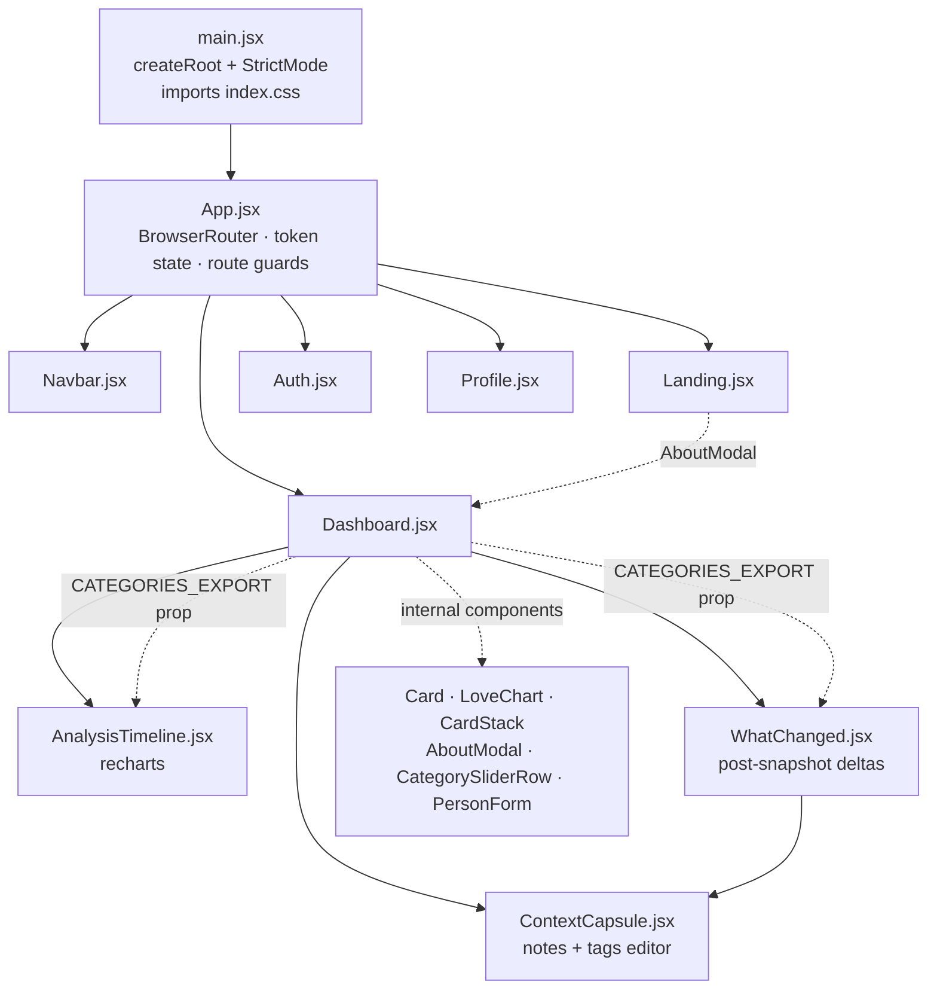

# 06 — Frontend Implementation

React 19.2 · Vite 7.3 · Tailwind CSS 3.4 · react-router-dom 7.13 · axios 1.13 ·
lucide-react 0.564 · recharts 3.7

---

## 1. Module graph



| File | Lines | Responsibility |
| :--- | ----: | :------------- |
| [`main.jsx`](../src/main.jsx) | 11 | React root, `StrictMode`, Tailwind entry import. |
| [`App.jsx`](../src/App.jsx) | 73 | Router, token lifecycle, axios auth header + 401 interceptor, guards. |
| [`Navbar.jsx`](../src/components/Navbar.jsx) | 57 | Sticky nav; brand link; Profile/Logout or Sign In. |
| [`Landing.jsx`](../src/components/Landing.jsx) | 65 | Anonymous marketing screen; "Learn the Theory" opens `AboutModal`. |
| [`Auth.jsx`](../src/components/Auth.jsx) | 103 | Login *and* signup in one toggling form. |
| [`Dashboard.jsx`](../src/components/Dashboard.jsx) | 1070 | Taxonomy + guided-scoring constants, six sub-components, the main screen. |
| [`AnalysisTimeline.jsx`](../src/components/AnalysisTimeline.jsx) | 158 | Recharts multi-line history chart. |
| [`WhatChanged.jsx`](../src/components/WhatChanged.jsx) | 244 | Post-snapshot delta screen + its note follow-up. |
| [`ContextCapsule.jsx`](../src/components/ContextCapsule.jsx) | 137 | The notes + tags editor, shared by `PersonForm` and `WhatChanged`. |
| [`Profile.jsx`](../src/components/Profile.jsx) | 256 | User settings + avatar upload. |

> `Landing.jsx` importing `AboutModal` from `Dashboard.jsx` is the one import that runs
> against the grain of the graph. It is deliberate — the category copy is the teaching
> surface and should be reachable before signup — and it is not circular, since `Dashboard`
> never imports `Landing`.

**No global state library.** `token` in `App.jsx` is the only shared state; everything
else is local `useState` in the screen that renders it.

---

## 2. `App.jsx` — auth wiring and route guards

### The module-scope header assignment

```js
// src/App.jsx:11-15 — runs at import time, BEFORE the first render
const initialToken = localStorage.getItem('token');
if (initialToken) {
    axios.defaults.headers.common['Authorization'] = `Bearer ${initialToken}`;
}
```

`useState(initialToken)` then seeds component state from the same value, and an effect
keeps the two in sync afterwards:

```js
useEffect(() => {
    if (token) {
        axios.defaults.headers.common['Authorization'] = `Bearer ${token}`;
        localStorage.setItem('token', token);
    } else {
        delete axios.defaults.headers.common['Authorization'];
        localStorage.removeItem('token');
    }
}, [token]);
```

> **Do not move the module-scope block into the effect.** `Dashboard`'s data-fetching
> effect fires on its first mount, and child effects run *before* the parent's in React's
> commit order — so an effect-only assignment would let the first
> `GET /api/subjects` leave without an `Authorization` header and return 401. The
> comment on line 11 records this; it is load-bearing.

### Guards

```jsx
<Route path="/"        element={token ? <Dashboard /> : <Landing />} />
<Route path="/login"   element={!token ? <Auth onLogin={handleLogin} /> : <Navigate to="/" />} />
<Route path="/profile" element={token ? <Profile /> : <Navigate to="/login" />} />
```

Three characteristics:

- **`/` swaps components rather than redirecting** — one URL, two screens, no flash of
  redirect.
- **Presence of a token is the only check.** Expiry and signature are never inspected
  client-side, so an expired token still renders the dashboard for one request cycle. The
  401 that comes back is what ends the session — see below.
- **No catch-all route.** An unknown path renders the Navbar and nothing else.

### The 401 response interceptor

```js
// src/App.jsx — registered once, ejected on unmount
axios.interceptors.response.use(
    (response) => response,
    (error) => {
        if (error?.response?.status === 401) setToken(null);
        return Promise.reject(error);
    }
);
```

Clearing the token flips `/` from `Dashboard` to `Landing`, which replaces the old failure
mode: an empty grid with no explanation and no way to recover but clearing `localStorage`.

Two things to know:

- **The error is re-rejected**, so each caller still sees its own failure — `Auth.jsx`
  keeps showing "Invalid credentials" on a bad login (a 401 that clears an already-absent
  token, harmlessly).
- **It does not cover `Profile.jsx`**, which uses a private `axios.create()` instance;
  interceptors registered on the global default do not apply to it. Unifying the two
  ([Recipe 6](10-agent-guide.md#recipe-6-unify-the-axios-setup)) would close that gap.

Auth callbacks are trivial: `handleLogin(newToken)` → `setToken`, `handleLogout()` →
`setToken(null)`. Logout is purely client-side; the token remains valid server-side until
it expires.

---

## 3. `Dashboard.jsx` — the core screen

1070 lines containing, in order: the `CATEGORIES` taxonomy, the guided-scoring constants and
helpers, four presentational sub-components, two modals, the scoring row, the form, and the
default-exported screen.

Named exports: `CATEGORIES_EXPORT` (for `AnalysisTimeline` and `WhatChanged`), `AboutModal`
(for `Landing`), `PersonForm` and `CategorySliderRow` (so the form can be unit-tested
without mounting the whole dashboard), and the two pure helpers `anchorFor` / `guideBand`.

### 3.1 `CATEGORIES` (lines 6–117)

The taxonomy. See [Concepts §2](01-concepts.md#the-seven-categories) for the semantic
content. Structurally, each entry is:

```js
{
    id: 'eros',                    // stats key · chart dataKey · React key — the contract
    label: 'Eros',
    description: 'Romantic, passionate love',
    color: 'bg-rose-400',          // Tailwind class, used for bars and dots
    textColor: 'text-rose-500',
    borderColor: 'border-rose-300',
    extendedDescription: '…',      // AboutModal detail paragraph
    coreMotivation: '…',
    metrics: [{ title, description }, …],
    anchors: [{ min: 0, max: 20, phrase: '…' }, …]   // 3-4 contiguous bands covering 0-100
}
```

`anchors` is the Phase 2 addition: the phrase for the band containing the current slider
value is shown live under the slider. Bands must start at 0, end at 100, and leave no gap —
`Dashboard.test.jsx` asserts exactly that for all seven categories, so a malformed band is a
test failure rather than a blank line in the UI.

Re-exported as `CATEGORIES_EXPORT` (line 147) purely so `AnalysisTimeline` can receive it
as a prop. The odd name exists because the local `const CATEGORIES` already occupies the
identifier — an alias, not a different value.

> **Tailwind JIT caveat:** these class strings are static literals, so Tailwind's content
> scanner finds them. A dynamically built class (`` `bg-${cat.hue}-400` ``) would be
> purged from the production CSS and silently render colourless. Keep colours as complete
> literal strings.
>
> One existing line already trips a related limitation:
> `` className={`… group-hover:${cat.textColor} …`} ``
> ([line 341](../src/components/Dashboard.jsx#L341)) interpolates a class name, so
> `group-hover:text-rose-500` is never generated. The hover colour on the category grid
> is a no-op. Fixing it means adding a literal `hoverTextColor` field per category.

### 3.1b Guided-scoring constants and helpers

```js
const GUIDE_SCALE = [{ label: 'Never', value: 0 }, { label: 'Sometimes', value: 35 },
                     { label: 'Often', value: 70 }, { label: 'Constantly', value: 100 }];
const GUIDE_BAND_RADIUS = 8;

export const anchorFor = (category, value) => …   // the band containing value
export const guideBand = (answers) => …           // { count, midpoint, min, max } | null
```

**The two-number trap:** an answer is stored as its **index** (`0..3`) and averaged as its
**value** (`0/35/70/100`). `guide_answers` therefore holds `{"0": 2}` — metric 0 answered
"Often" — while the band arithmetic sees `70`. Mixing the two up produces a plausible-looking
band that is wrong by a factor of 30.

`guideBand` is deliberately a pure function of the answers: mean, round, ±8, clamp. It is the
single place that arithmetic exists, it is unit-tested at the boundaries, and its output is
rendered as a sentence the user can read and disagree with.

> The preset context tags (`CONTEXT_TAGS`) and the tag limits now live in
> [`ContextCapsule.jsx`](../src/components/ContextCapsule.jsx) — see §3.8 — because
> `WhatChanged` writes the same fields. `MAX_TAGS`/`MAX_TAG_LENGTH` **mirror the server's
> `validateTags` limits**; changing one side without the other turns a client-side guard
> into a 400.

### 3.2 `Card` (119–123)

The visual primitive: white surface, `rounded-2xl`, a custom soft shadow, `border-slate-100`.
Accepts `className` and `style` so callers can position and animate it. Every panel and
modal in the app is built from it.

### 3.3 `LoveChart`

The seven-bar horizontal chart, implemented **without any chart library** — a `div` per
category whose width is the percentage. Because values are already 0–100 they map directly
to percent, no scaling. Returns `null` when `stats` is falsy, which is what keeps cards from
crashing on subjects created with no stats.

It renders three distinct states, and the distinction is the point:

| State | Test | Rendering |
| :---- | :--- | :-------- |
| Scored | key present in `stats` | coloured bar at `value%`, `42%` label |
| Unsure | id in `uncertain` | bar at `opacity-60` inside a dashed track, `≈42%` label |
| Not scored | key **absent** | empty track, `—` label in `text-slate-300` |

```js
const isScored = (stats, id) => stats != null && stats[id] !== undefined && stats[id] !== null;
```

> The old code read `stats[cat.id] || 0`, which conflated "never scored" with "scored zero"
> *and* would have rendered a genuine 0 identically to a skip. Any new consumer of `stats`
> must use a presence check, never `||`.

### 3.4 `CardStack` (149–296) — the wheel-scrubbed version pile

The most intricate component in the codebase. Given all versions of one name:

**Sorting** — descending by date, memoised on `versions`; `new Date(b.date || 0)` makes
undated rows sort oldest.

**Index reset** — `useEffect(() => setActiveIndex(0), [versions.length])`. Keyed on
*length*, so adding or deleting a version snaps back to the newest, while an in-place edit
(length unchanged) preserves the user's position.

**Wheel capture** — registered imperatively rather than with an `onWheel` prop:

```js
container.addEventListener('wheel', handleWheel, { passive: false });
```

`{ passive: false }` is mandatory: React's synthetic `onWheel` attaches passively, where
`preventDefault()` is ignored and the page would scroll behind the card. The handler calls
both `preventDefault()` and `stopPropagation()`, then clamps the index at both ends.

> Consequence: **while the pointer is over a stack, the page cannot be scrolled by wheel**,
> even for a single-version stack. Trackpad users on long dashboards feel this.
>
> The effect's dependency array is `[sortedVersions.length]`, while the handler closes
> over `sortedVersions.length` — consistent today. If the handler is ever changed to read
> other values from the closure, that array must grow too.

**The card transform table** — `offset = index - activeIndex`:

| `offset` | Meaning | Transform |
| :------- | :------ | :-------- |
| `< 0` | Scrolled past (newer, being discarded) | `translateY(120%) rotate(-15deg)`, `opacity 0`, `pointerEvents: none`, `zIndex 60` |
| `0` | Active card | `translateY(0) rotate(0) scale(1)`, `opacity 1`, `zIndex 50`, plus `group hover:shadow-xl` |
| `1`–`2` | Visible depth | `translateY(offset*12px) scale(1 - offset*0.04)`, `opacity 1 - offset*0.1`, `zIndex 50 - offset` |
| `> 2` | Hidden | `opacity 0`, `pointerEvents: none`, `zIndex 0` |

All cards are absolutely positioned inside a fixed `h-[500px]` container with
`origin-bottom-left` and a 700 ms `transition-all`, which produces the "deal a card away
to the lower-left" motion. Only three cards are ever visible regardless of history depth.

**Actions** are rendered only for `offset === 0` and revealed by the `group-hover`
utility: *Deep Analysis* (`onAnalyze(versions)` — passes the whole array), *Add New
Version*, *Edit*, *Delete* (passes `person.ID`).

**Version badge** — `v{sortedVersions.length - index}`: purely positional, shown only when
more than one version exists, so the newest always carries the highest number.

**Context indicators** — also active-card only, sitting directly under the date row:

- a `StickyNote` button when `person.description` is non-blank; clicking it toggles
  `openNoteId` and expands the note inline above the chart (local state, no modal),
- up to three tag chips, then a `+n` counter for the remainder.

Both are deliberately `text-slate-400`-tier secondary text so a grid of cards does not turn
noisy. `openNoteId` resets whenever `activeIndex` changes, so scrubbing the wheel never
leaves another version's note open. Snapshots with no context render nothing extra, which
is what keeps pre-Phase-1 rows looking exactly as before.

### 3.5 `AboutModal` (299–385)

Two-level master/detail over `CATEGORIES`, driven by one state value —
`selectedCategory === null` means the grid, otherwise the detail view. Uses
`cat.borderColor` for the accent bar and `cat.textColor` for the "Core Motivation" label.
The chevron sets state back to `null`. Not a route; nothing is linkable.

### 3.5b `CategorySliderRow` — one category's scoring row

Extracted from `PersonForm` so the scoring interaction can be reasoned about (and tested)
on its own. It holds exactly one piece of state — whether its guide panel is open — and
sends everything else back through callbacks.

What it renders, top to bottom:

1. **Label, value chip and toggles.** The chip reads `42`, `≈42` when unsure, or `—` when
   skipped. The `?` chip toggles unsure and is *disabled while skipped*; the ⊖ button
   toggles skip.
2. **The slider**, over a track this component draws itself. The native input is
   `bg-transparent` so the suggestion band can sit on the track behind the thumb — the one
   piece of styling here that depends on the browser not painting its own track.
3. **Tick marks** at every anchor boundary.
4. **The live anchor phrase** for the current value.
5. **"Guide me"**, which expands the category's `metrics[]` as rows of four-option
   segmented controls, then the band sentence and a `Use <midpoint>` button.

When skipped, everything from the slider down is replaced by one line: *"Not scoring this
today — it will be left blank, not zero."* The row also drops to `opacity-50`, so a skipped
category is visibly inactive rather than silently missing.

Clicking an already-selected guide answer clears it — the answer set is a record of what the
user actually said, so it has to be retractable.

### 3.6 `PersonForm` — exported for tests

One form serving three modes, distinguished by two props:

| `initialData` | `isNewVersion` | Mode | Title | Button |
| :------------ | :------------- | :--- | :---- | :----- |
| `null` | `false` | Create | "New Subject" | "Analyze & Save" |
| set | `false` | Edit in place | "Edit Analysis" | "Update Analysis" |
| set | `true` | New version | "New Version" | "Analyze & Save" |

- **Date default** is computed in a `useState` initialiser: today for create and
  new-version, the stored date when editing.
- **Name is `disabled` in new-version mode** (plus `opacity-50 cursor-not-allowed`) so the
  grouping key cannot drift.
- **Sliders** — one `CategorySliderRow` per category. Initial stats are the all-zero
  baseline **merged with** `initialData?.stats`, so a snapshot that skipped a category still
  gives every slider a controlled value.
- **Submit** guards on `!name.trim()` and the button is `disabled` on the same condition.
  The payload is
  `{ name: name.trim(), date, stats, description, tags, uncertain, guide_answers }` — the
  trimmed name is what gets **sent**, not merely what gets validated.
- **Skipped categories are omitted from `stats` on submit**, and their uncertain flags and
  guide answers are pruned with them, so the payload can never assert something the server
  will reject.

#### The "What's been happening?" step

Below the sliders, three controls write the context capsule:

| Control | Behaviour |
| :------ | :-------- |
| Preset chips | One toggle button per `CONTEXT_TAGS` entry, `aria-pressed` reflecting membership. Disabled (not hidden) once 12 tags are selected. |
| Custom tag input | `maxLength={MAX_TAG_LENGTH}`; **Enter calls `preventDefault()`** and adds the tag rather than submitting the form. Duplicates and blanks are no-ops. Custom tags render as their own removable chip row. |
| Notes textarea | Three rows bound to `description`, placeholder *"Anything future-you should know about this period?"*. No length ceiling. |

**Seeding rules — the part that is easy to get wrong:**

```js
const isEditing = Boolean(initialData) && !isNewVersion;
const [description, setDescription]   = useState(isEditing ? (initialData.description || '') : '');
const [tags, setTags]                 = useState(isEditing ? (initialData.tags || []) : []);
const [uncertain, setUncertain]       = useState(isEditing ? (initialData.uncertain || []) : []);
const [guideAnswers, setGuideAnswers] = useState(isEditing ? (initialData.guide_answers || {}) : {});
const [skipped, setSkipped]           = useState(() => (isEditing
    ? CATEGORIES.filter(cat => !isScored(initialData.stats, cat.id)).map(cat => cat.id)
    : []));
```

| Mode | `stats` | note / tags / uncertain / guides / skips |
| :--- | :------ | :--------------------------------------- |
| Create | zeros | empty |
| Edit | stored values | seeded from the snapshot |
| New version | **inherited** from the previous snapshot | **empty** |

`skipped` has no column of its own — it is *derived* from which keys are absent, and
converted back into absent keys on submit. That round trip is the whole skip feature.

Editing seeds everything so a slider tweak cannot lose it. A new version inherits the scores
(the last reading is the sensible starting point) but nothing else: context describes a
period, and last time's doubt is not this time's.

### 3.7 `Dashboard` — the screen

State:

| Variable | Purpose |
| :------- | :------ |
| `people` | Flat array from `GET /api/subjects`. |
| `isFormOpen`, `editingPerson`, `isNewVersionMode` | The three-mode `PersonForm` controller. |
| `isAboutOpen` | `AboutModal` visibility. |
| `selectedTimelineStack` | Non-null replaces the entire grid with the timeline. |
| `notice` | `{ type: 'error' \| 'success', text }` or `null` — the banner above the grid. |
| `whatChanged` | `{ current, previous }` or `null` — the post-snapshot payoff modal. |

`groupedPeople` — the name-grouping `useMemo` described in
[Concepts](01-concepts.md#the-stack-abstraction).

**Mutations never refetch.** Each handler splices the echoed server row into `people`:

```js
// update
setPeople(people.map(p => p.ID === editingPerson.ID ? response.data : p));
// create / new version
setPeople([...people, response.data]);
// delete
setPeople(people.filter(p => p.ID !== id));
```

All three use `person.ID` — uppercase, from `gorm.Model`. See
[the casing trap](03-data-model.md#2-gormmodel-and-the-id-casing-trap).

**Errors are visible.** All three catch blocks — `fetchSubjects`, `handleSavePerson`,
`deletePerson` — still `console.error`, but they also set `notice`, rendered as a
dismissible `role="alert"` banner above the grid in the same visual language as
`Profile.jsx`'s message banner (emerald for success, red for error).

```js
const errorText = (error, fallback) => error?.response?.data?.error || fallback;
```

The server's message wins when there is one (`unknown stats key: love` is more useful than
"something went wrong"); otherwise a written fallback explains what to do.

> **On a failed save the form stays open.** `handleCloseForm()` sits *after* the awaits
> inside `try`, so a rejected request skips it and the user's name, sliders, tags, and
> half-written note survive to be retried. Preserve that ordering — moving the close into a
> `finally` would silently reinstate data loss.

**Grid keys**: stacks are keyed by `versions[0].name` — stable because the name *is* the
group identity; individual cards are keyed by `person.ID`.

**Delete confirmation** uses `window.confirm("Are you sure you want to delete this
specific version?")`. The E2E suite does not exercise deletion, so a native dialog is
still viable; replacing it with a custom modal would be a UX-consistency win.

**The What Changed trigger** lives in the POST branch of `handleSavePerson`:

```js
const previous = findPreviousVersion(saved, people);
if (previous) setWhatChanged({ current: saved, previous });
```

That single condition covers both required cases — a new version, and a create whose name
lands in an existing stack — because both are POSTs into a stack that already has members.
The PUT branch has no equivalent, by design: an in-place edit is a correction, and showing
"what changed" for it would be comparing a snapshot against its neighbour rather than
against its own past.

`saveSnapshotContext` backs the screen's note follow-up: a **partial** PUT carrying only
`{description, tags}`, which is why the scores it just reported on cannot move. It
deliberately does not catch — `WhatChanged` renders the failure inline and keeps the text.

---

## 4. `AnalysisTimeline.jsx`

The only Recharts consumer. Props: `versions` (array), `onBack`, `categories`.

**Data shaping** — sorted **ascending** (opposite of the card stack) and flattened, since
Recharts wants one flat object per x-position:

```js
[...versions]
  .sort((a, b) => new Date(a.date || 0) - new Date(b.date || 0))
  .map(v => ({ date: v.date ? new Date(v.date).toLocaleDateString() : 'Unknown',
               _uncertain: v.uncertain || [], ...v.stats }))
```

The spread copies only the keys that exist, so a skipped category has no datum at that
x-position; with `connectNulls={false}` the line breaks there rather than drawing through a
value nobody gave. `_uncertain` rides along on the data point purely so the dot renderer can
reach it — Recharts hands the whole payload to `dot`.

**`makeDotRenderer(categoryId)`** returns the per-point renderer: a hollow circle, dashed
when that point's category was flagged unsure, and an empty `<g>` when there is no point at
all. It is exported and unit-tested directly, because inside jsdom Recharts has no layout
and never calls it.

**Chart configuration:**
- `<ResponsiveContainer>` inside a fixed `h-[500px]` wrapper — Recharts needs a bounded
  parent or it collapses to zero height.
- `connectNulls={false}` on every `<Line>` — gaps are information, not a rendering glitch.
- `YAxis domain={[0, 100]}` — fixed, so charts are visually comparable across subjects.
- `XAxis dataKey="date"` using locale-formatted strings, i.e. **categorical, not
  temporal**: points are evenly spaced regardless of the real interval between dates. Two
  assessments a day apart and two a year apart look identical. Switching to a time scale
  means `type="number"`, epoch values, and a tick formatter.
- One `<Line type="monotone">` per category, `strokeWidth={3}`, hollow dots, colour from
  `CATEGORY_COLORS[cat.id]`.

**Legend toggling** — `hiddenLines` is a `Set` in state, and `handleLegendClick` clones it
before mutating (`new Set(hiddenLines)`), because mutating in place would not trigger a
re-render. Each `<Line>` receives `hide={hiddenLines.has(cat.id)}`, and the legend
`formatter` greys the label of a hidden series. The state is per-mount, so it resets on
every entry into the timeline.

**`CATEGORY_COLORS`** (lines 15–23) is the hex mirror of the Tailwind palette, needed
because SVG strokes cannot take utility classes. It is the second place a new category
must be registered.

**Edge cases**: returns `null` for an empty/absent `versions`; a single-version stack
renders one dot per series with no connecting line; duplicate dates in a stack produce two
x-positions with the same label.

---

## 4b. `WhatChanged.jsx` — the post-snapshot payoff

Props: `current`, `previous`, `categories`, `onSaveContext`, `onDone`. Rendered as a modal
over the grid after a snapshot lands in an existing stack.

Three pure functions do the work, all exported and unit-tested:

| Function | Contract |
| :------- | :------- |
| `findPreviousVersion(current, all)` | The most recent other snapshot of the same **name** dated at or before `current`. Returns `null` when the new snapshot predates everything — there is no "before" to report. Falls back to the highest-`ID` undated sibling when no dated candidate exists. |
| `computeDeltas(current, previous, categories)` | `{ moved, steady, notComparable }`. `moved` is sorted by `\|delta\|` descending; `steady` is everything under `STEADY_THRESHOLD` (5); `notComparable` is any category absent on **either** side. A row is `uncertain` if either side flagged it. |
| `elapsedSentence(previous, current, name)` | *"11 weeks since your last snapshot of Alex."* Days under 14, weeks under 90 days, then months, then years. Same-day and undated cases get their own phrasings rather than a fabricated duration. |

Copy discipline is a hard constraint here, not a preference: deltas are rendered as
`↑30` / `↓12` with the old → new pair beside them, never as "improved" or "worsened", and
the caption states the method — *"Differences between your last two snapshots — plain
subtraction, nothing more."* A `≈` prefix appears when either side was unsure, and the
caption gains a sentence explaining it only when at least one row has it.

The note follow-up renders `ContextCapsuleFields` inline and calls `onSaveContext`. It keeps
its own `saving`/`error` state so a failed save shows a message **inside the modal** — the
dashboard's banner sits behind the overlay and would not be read.

## 4c. `ContextCapsule.jsx` — the shared notes + tags editor

Exports `CONTEXT_TAGS`, `MAX_TAGS`, `MAX_TAG_LENGTH`, and the default
`ContextCapsuleFields` component. Fully controlled except for the custom-tag input's own
buffer; `heading`, `hint`, and `textareaId` are props so `PersonForm` and `WhatChanged` can
ask the same question in their own words while writing identical data.

It lives in its own module precisely because two callers write these fields — the limits and
the tag vocabulary must not drift between them.

Enter in the custom-tag input calls `preventDefault()` and adds the tag. That matters in
`PersonForm`, where the field sits inside a `<form>` and Enter would otherwise submit the
whole snapshot.

---

## 5. `Auth.jsx`

One component, two modes, `isLogin` boolean. Posts to `/api/login` or `/api/signup` from
the same handler:

```js
const endpoint = isLogin ? '/api/login' : '/api/signup';
const response = await axios.post(endpoint, { email, password });
if (isLogin) onLogin(response.data.token);
else { setIsLogin(true); setError('Account created! Please log in.'); }
```

- Signup success is deliberately surfaced through the **`error` slot** — the rose-tinted
  banner shows "Account created! Please log in." There is no separate success channel.
  Any refactor to a `message: {type, text}` shape (as `Profile.jsx` uses) must update
  [`Auth.test.jsx`](../src/components/Auth.test.jsx), which asserts on that exact string.
- `loading` disables the submit button and swaps its label to "Please wait…" — an
  assertion in the unit tests.
- Errors read `err.response?.data?.error` and fall back to `'An error occurred'`.
- Inputs are `type="email"` / `type="password"` with `required`, so the browser performs
  the only format validation in the entire stack.
- Placeholders `name@example.com` and `••••••••` are **test selectors** in both the unit
  and E2E suites — changing them breaks tests.

---

## 6. `Profile.jsx`

### Its own axios instance — an inconsistency worth knowing

```js
// src/components/Profile.jsx:6-14
const api = axios.create();
api.interceptors.request.use((config) => {
    const token = localStorage.getItem('token');
    if (token) config.headers.Authorization = `Bearer ${token}`;
    return config;
});
```

Every other component uses the global `axios` with the default header set by `App.jsx`.
`Profile` re-reads `localStorage` per request instead. Both work; the duplication is
accidental. The interceptor pattern is arguably the better one — a single
`axios.interceptors.request.use` in `App.jsx` would remove the module-scope
initialisation described in §2 — but until that refactor happens, **new components should
follow the majority convention** (global `axios`) so behaviour stays uniform.

### Fields and flow

`formData` mirrors the API shape: `name`, `age`, `mbti_type`, `profile_picture`, `email`.
`handleChange` special-cases age: `parseInt(value) || ''`, keeping the input controlled
when emptied. MBTI is a hardcoded 16-option `<select>` — the only place the MBTI list
exists.

Three independent booleans — `loading` (initial fetch, full-screen spinner), `saving`,
`uploading` — plus `message: {type, text}` rendered as a green or red banner.

### Upload interaction

The `<input type="file">` is `hidden`; a button over the avatar triggers
`fileInputRef.current?.click()`. `handleImageUpload` posts `FormData` with field name
`image` and `Content-Type: multipart/form-data`, then writes the returned URL into
`formData.profile_picture` **without saving**. The banner says "Remember to save changes"
because `PUT /api/me` is a separate action.

Two mismatches to be aware of:

- `accept="image/*"` on the input is broader than the server's
  jpeg/png/webp allowlist, so a GIF passes the picker and is rejected by the API.
- Selecting the same file twice in a row does not re-fire `onChange` (the input's value is
  never reset) — a known browser behaviour, unhandled here.

### Dead controls

The "Change Password" button ([line 247](../src/components/Profile.jsx#L247)) has no
`onClick`. Likewise "Learn the Theory" on the Landing page
([line 31](../src/components/Landing.jsx#L31)). Both are visible affordances that do
nothing.

---

## 7. Styling system

- **Tailwind 3.4**, utility-first, configured to scan `./index.html` and
  `./src/**/*.{js,ts,jsx,tsx}` ([`tailwind.config.js`](../tailwind.config.js)). The theme
  is **unextended** — no custom colours, spacing, or fonts — and there are **no plugins**.
- [`src/index.css`](../src/index.css) is three `@tailwind` directives and nothing else.
  There is no custom CSS anywhere in the project; `App.css` was deleted per the
  [Setup Guide](../Setup%20Guide.md).
- **Design language**: `slate` neutrals on `bg-slate-50`, `rose` as the brand accent,
  `font-light` headings with selective `font-semibold` emphasis, `rounded-2xl` surfaces,
  soft custom shadows, `uppercase tracking-wider` micro-labels. Category colours are the
  only saturated hues.
- **Icons**: `lucide-react`, imported per icon, sized with the `size` prop.
- **Responsive**: mobile-first; the grid steps `grid-cols-1 → md:grid-cols-2 →
  lg:grid-cols-3`.
- `indigo` appears only in `Profile.jsx` (save button, upload button, focus rings) while
  the rest of the app uses `slate-800`/`slate-900` for primary actions — a real
  inconsistency, not a semantic distinction.

> ### The animation classes do not work
> `animate-in`, `fade-in`, `zoom-in-95`, `slide-in-from-right-2`, and
> `slide-in-from-bottom-4` appear on the modals, the timeline panel, and the Landing hero.
> These are **`tailwindcss-animate` utilities, and that plugin is not installed** — it is
> absent from `package.json` and from `node_modules`, and `tailwind.config.js` declares
> `plugins: []`. The classes generate no CSS; elements simply appear. Either
> `npm i -D tailwindcss-animate` and register it, or remove the classes. See
> [Known Issues](11-known-issues.md#modal-animation-classes-are-inert).

---

## 8. Build tooling

[`vite.config.js`](../vite.config.js):

```js
plugins: [react()],
test: { globals: true, environment: 'jsdom', setupFiles: './src/setupTests.js',
        exclude: ['tests/**', 'node_modules/**'] },
server: { proxy: { '/api': 'http://localhost:8080', '/uploads': 'http://localhost:8080' } }
```

- Vitest configuration lives **inside** the Vite config, not a separate `vitest.config.js`.
- `exclude: ['tests/**']` keeps Vitest out of the Playwright directory — the two runners
  would otherwise collide over `tests/*.spec.ts`.
- Both `/api` and `/uploads` are proxied in dev, which is why avatars render locally but
  not under Docker ([Deployment](09-deployment.md)).
- `npm scripts`: `dev`, `build`, `preview`, `lint`, `test` (→ `vitest run`).

[`eslint.config.js`](../eslint.config.js) — flat config, `js.configs.recommended` plus
`react-hooks` and `react-refresh`, and one custom rule:

```js
'no-unused-vars': ['error', { varsIgnorePattern: '^[A-Z_]' }]
```

That pattern is why the unused `Layers` import in `Dashboard.jsx` would not fail linting —
capitalised identifiers are exempt.

Lint is **not** wired into CI (only Playwright runs there), and in the current checkout
`npm run lint` exits 2 before linting anything because the installed
`eslint-plugin-react-hooks` is missing its CJS build. See
[Known Issues](11-known-issues.md#npm-run-lint-is-broken-in-this-checkout).
