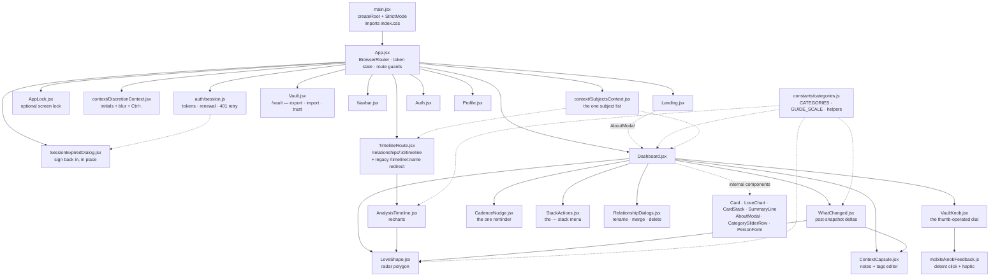

# 06 — Frontend Implementation

React 19.2 · Vite 7.3 · Tailwind CSS 3.4 · react-router-dom 7.13 · axios 1.13 ·
lucide-react 0.564 · recharts 3.7

---

## 1. Module graph



| File | Lines | Responsibility |
| :--- | ----: | :------------- |
| [`main.jsx`](../src/main.jsx) | 11 | React root, `StrictMode`, Tailwind entry import. |
| [`App.jsx`](../src/App.jsx) | 175 | Router, guards, `SubjectsProvider`, and the decision of what a lost session looks like. |
| [`auth/session.js`](../src/auth/session.js) | 240 | **The session**: storage, the auth header, renewal, and the 401-renew-retry interceptor. |
| [`auth/useSessionRenewal.js`](../src/auth/useSessionRenewal.js) | 45 | Renews on mount, tab focus, and Android resume — the reason the prompt is rare. |
| [`SessionExpiredDialog.jsx`](../src/components/SessionExpiredDialog.jsx) | 135 | Signing back in over the current screen, rather than being evicted to Landing. |
| [`constants/categories.js`](../src/constants/categories.js) | 253 | **The taxonomy** plus the pure helpers that read it. |
| [`constants/cadence.js`](../src/constants/cadence.js) | 107 | Due-date arithmetic and the nudge vocabulary. Pure, so the no-guilt rules are testable. |
| [`context/DiscretionContext.jsx`](../src/context/DiscretionContext.jsx) | 96 | Discretion mode: initials, blur class, `Ctrl+.`, tab title. |
| [`context/SubjectsContext.jsx`](../src/context/SubjectsContext.jsx) | 225 | Shared subject **and relationship** lists, the derived stacks, load state, and six mutations. |
| [`Navbar.jsx`](../src/components/Navbar.jsx) | 76 | Sticky nav; brand link; discretion toggle, Vault, Profile/Logout or Sign In. |
| [`Landing.jsx`](../src/components/Landing.jsx) | 65 | Anonymous marketing screen; "Learn the Theory" opens `AboutModal`. |
| [`Auth.jsx`](../src/components/Auth.jsx) | 103 | Login *and* signup in one toggling form. |
| [`Dashboard.jsx`](../src/components/Dashboard.jsx) | 1346 | Six sub-components and the grid screen. |
| [`VaultKnob.jsx`](../src/components/VaultKnob.jsx) | 276 | The vault dial: scoring with a thumb without covering what you are reading. |
| [`mobile/knobFeedback.js`](../src/mobile/knobFeedback.js) | 172 | The dial's detent — a synthesised metallic click and an Android selection haptic. |
| [`TimelineRoute.jsx`](../src/components/TimelineRoute.jsx) | 100 | The id-keyed timeline route and the legacy name redirect: loading, empty and error states. |
| [`StackActions.jsx`](../src/components/StackActions.jsx) | 106 | The `⋯` menu above each stack: rename, check-in rhythm, merge, delete. |
| [`CadenceNudge.jsx`](../src/components/CadenceNudge.jsx) | 151 | The single reminder banner, its snooze, and the once-per-session rule. |
| [`Vault.jsx`](../src/components/Vault.jsx) | 434 | `/vault`: what is stored, the privacy answers, export, import, app-lock setting. |
| [`AppLock.jsx`](../src/components/AppLock.jsx) | 137 | The optional passphrase overlay and its idle timer. |
| [`RelationshipDialogs.jsx`](../src/components/RelationshipDialogs.jsx) | 411 | `Modal` shell plus the four stack-level dialogs (rename, cadence, merge, delete). |
| [`AnalysisTimeline.jsx`](../src/components/AnalysisTimeline.jsx) | 317 | Time-axis history chart with milestone markers. |
| [`LoveShape.jsx`](../src/components/LoveShape.jsx) | 126 | The seven-axis radar polygon. |
| [`WhatChanged.jsx`](../src/components/WhatChanged.jsx) | 253 | Post-snapshot delta screen + its note follow-up. |
| [`ContextCapsule.jsx`](../src/components/ContextCapsule.jsx) | 137 | The notes + tags editor, shared by `PersonForm` and `WhatChanged`. |
| [`Profile.jsx`](../src/components/Profile.jsx) | 256 | User settings + avatar upload. |

> `Landing.jsx` importing `AboutModal` from `Dashboard.jsx` is the one import that runs
> against the grain of the graph. It is deliberate — the category copy is the teaching
> surface and should be reachable before signup — and it is not circular, since `Dashboard`
> never imports `Landing`.

**One shared store, one context.** `token` lives in `App.jsx` (its storage and renewal in
`auth/session.js`); the subject list lives in `SubjectsContext`. Everything else is local
`useState` in the screen that renders it. There is still no state library, and two consumers
do not justify one.

---

## 2. `App.jsx` — auth wiring and route guards

The session itself now lives in [`src/auth/session.js`](../src/auth/session.js); `App.jsx`
holds the React state and decides what the user sees. Read §2a for renewal — this section
is about the token as a value.

### `applyToken` — the header is never written from an effect

```js
// src/auth/session.js — one writer for the header and its localStorage copy
export const applyToken = (token) => {
    if (token) {
        axios.defaults.headers.common['Authorization'] = `Bearer ${token}`;
        localStorage.setItem('token', token);
    } else {
        delete axios.defaults.headers.common['Authorization'];
        localStorage.removeItem('token');
    }
};

// src/App.jsx
applyToken(readAccessToken());               // at import time, before the first render

const handleLogin = (session) => {           // and synchronously on every transition
    setTokenState(saveSession(session));     // saveSession calls applyToken
};
```

> **This is load-bearing, and getting it wrong is self-concealing.** Child effects commit
> **before** their parent's. `SubjectsProvider`'s fetch is a child effect of `App`, so an
> effect-only header assignment lets the first `GET /api/subjects` after a login go out
> anonymous. The server returns 401, the interceptor below clears the token, and the user is
> bounced to Landing — where the only visible action is "Start Analyzing", which leads back
> to the login form. It reads as "logging in does not work", and nothing in the console says
> why.
>
> The token used to be reconciled by `useEffect(…, [token])`, which covered a page reload
> (the module-scope block ran first) but *not* a fresh login. `applyToken` is now the only
> writer, called from module scope and from `setToken`. There is no effect to get wrong.
> `App.test.jsx` guards it by asserting the header's value **at the moment the fetch fires**.

### Guards

```jsx
<Route path="/"              element={token ? <Dashboard /> : <Landing />} />
<Route path="/login"         element={!token ? <Auth onLogin={handleLogin} /> : <Navigate to="/" />} />
<Route path="/profile"       element={token ? <Profile /> : <Navigate to="/login" />} />
<Route path="/vault"         element={token ? <Vault /> : <Navigate to="/login" />} />
<Route path="/relationships/:id/timeline" element={token ? <TimelineRoute /> : <Navigate to="/login" />} />
<Route path="/timeline/:name" element={token ? <LegacyTimelineRedirect /> : <Navigate to="/login" />} />
```

Three characteristics:

- **`/` swaps components rather than redirecting** — one URL, two screens, no flash of
  redirect.
- **Presence of a token is the only check.** Expiry and signature are never inspected
  client-side. An expired token still renders the dashboard, and the 401 that comes back is
  now *renewed through* rather than fatal — see §2a.
- **No catch-all route.** An unknown path renders the Navbar and nothing else.

---

## 2a. `auth/session.js` — why an expired token is no longer an event

### What it replaced

The interceptor used to be four lines: a 401 cleared the token, which flipped `/` from
`Dashboard` to `Landing`. That was an improvement on the failure it replaced (an empty grid
with no explanation) and it was still bad. The token lived 24 hours and nothing could renew
it, so *every* client met "Invalid or expired token" on a schedule — the web app dropped to
the landing page mid-task, and the Android app, which is resumed rather than reloaded for
weeks at a time, met it almost every session. The message was accurate and useless: the user
had done nothing wrong, and there was nothing in it to act on.

### The three paths, in order of how often they run

| When | What happens | What the user sees |
| :--- | :----------- | :----------------- |
| Token inside its renewal margin (5 min) at mount, tab focus, or app resume | `renewIfDue()` → `POST /api/refresh` | Nothing |
| A request 401s | One shared refresh, then the request is replayed with the new token | Nothing |
| Refresh token expired, revoked, or unknown | `onSessionLost()` → `SessionExpiredDialog` over the current screen | A passphrase prompt, in place |

The last row is the design decision worth defending: **losing a session is not a navigation
event.** The dialog renders *over* the mounted screen, so scroll position and half-filled
forms survive it, and `App` keeps `token` in state while `sessionLost` is true rather than
clearing it. Signing back in bumps `sessionEpoch`, which `SubjectsProvider` takes as a
`reloadKey` and refetches — the failed requests are not individually replayed, the list is
simply fetched again.

### The two rules a client of this module must not break

1. **One refresh at a time.** `refreshSession()` shares a single in-flight promise. Two
   concurrent refreshes spend two tokens from a rotating family, the server reads the second
   use as a replay, and it revokes everything. The dashboard loads subjects and relationships
   in parallel, so concurrent 401s are the *normal* case, not an edge one.
2. **A 5xx or a dead network is not the end of a session.** Only a refused token clears
   local state. Clearing on a transport failure would sign out every phone that woke up out
   of coverage.

Requests marked `__isSessionCall` (login, refresh, logout) bypass the interceptor — a 401
there is a wrong passphrase or a dead session, neither of which is renewable. `__isRetry`
marks the replay, so a server that 401s for some other reason cannot loop.

### What is stored, and what is not

`localStorage`, holding the access token (key `token`, unchanged so an existing install
survives the upgrade), the refresh token, the access token's expiry, and the last email
address — that last one only so the prompt can ask for one field instead of two.

**The password is never written to disk.** The literal request behind this feature was to
"reuse the last login data"; a refresh token is that idea with two properties a stored
password cannot have — the server can revoke it, and rotation makes a stolen copy
detectable. See [API §3.1](04-api-reference.md#31-session-renewal).

Storage is `localStorage` rather than `@capacitor/preferences` for the reason
[`serverUrl.js`](../src/mobile/serverUrl.js) gives: it must be readable *synchronously*
before the first render, and the async API cannot meet that constraint. On Android the
WebView's storage is in the app's private data directory, which is the same protection
`SharedPreferences` gives — neither is encrypted at rest.

### It covers every screen

`Profile.jsx` used to call through a private `axios.create()` instance, which interceptors
on the global default do not reach, so a dead session ended there as a permanent error
banner instead of a logout. That instance is gone
([Recipe 6](10-agent-guide.md#recipe-6-unify-the-axios-setup), first half).

---

## 2b. `context/SubjectsContext.jsx` — the one subject list

`SubjectsProvider` wraps the whole route table in `App.jsx` and owns:

| Value | Meaning |
| :---- | :------ |
| `people` | Every subject row for the signed-in user. |
| `relationships` | The user's relationships, as returned by `GET /api/relationships`. |
| `stacks` | The derived pairing: `[{ relationship, versions }]`. What the dashboard maps over. |
| `loading` | The initial fetch is in flight — `TimelineRoute` shows a spinner on direct entry. |
| `loadError` / `dismissLoadError` | The fetch failed; the dashboard renders it in its banner. |
| `refresh` | Re-fetch on demand. |
| `createSubject` / `updateSubject` / `deleteSubject` | Mutate one snapshot, then splice the echoed row into shared state. |
| `renameRelationship` / `setCadence` / `mergeRelationships` / `deleteRelationship` | Mutate a whole stack, then update **both** lists. |

Decisions worth knowing before changing it:

- **Both endpoints load in one `Promise.all`.** Neither depends on the other and the
  dashboard cannot draw a stack without both, so a failure in either becomes one `loadError`.
- **Mutations reject; the fetch does not.** A failed load has one sensible presentation, so
  the provider holds it as state. A failed mutation does not — only the caller knows whether
  a form should stay open — so `createSubject` and friends let the error through.
- **`enabled={!!token}`** gates the fetch. An anonymous visitor has nothing to load, and
  flipping to `false` on logout clears both lists rather than leaving the previous user's
  snapshots in memory. Flipping back to `true` after login triggers the fetch.
- **Server owns identity and ordering; the client owns the count.** `buildStacks` takes each
  stack's `snapshot_count` **and** `latest_date` from the versions actually loaded, not from
  the server's numbers, so what a stack reports is always what the user can see — and a
  freshly added snapshot silences its own reminder without a refetch. `cadence_days` comes
  from the server list, because that one is genuinely the server's to hold.
- **`setCadence` sends `null` explicitly**, never an omitted key. The server reads absent as
  "leave the rhythm alone" and `null` as "turn reminders off"; sending nothing would be a
  silent no-op.
- **A stack whose relationship is missing from the list falls back to the name denormalized
  on its snapshots.** A card is never silently dropped because a lookup missed.

This is what killed the stale-timeline bug: the timeline no longer receives a captured
array, it derives its stack from the same live state the dashboard renders.

`groupPeople(people)`, `findStack(people, relationshipId)`, `stackKey(person)` and
`buildStacks(people, relationships)` live here too — the grouping logic that the dashboard
and the timeline route both need, in one place.

> **Grouping is by `relationship_id`.** `stackKey` falls back to `unlinked-${person.ID}` for
> a row without one — not to the name. Every snapshot should carry a relationship (the
> server's backfill and find-or-create see to it), so an unlinked row is a server bug; giving
> it a stack of its own makes that visible instead of collapsing every unlinked row into one
> pile.

---

## 3. `Dashboard.jsx` — the core screen

888 lines containing, in order: five presentational sub-components, two modals, the scoring
row, the form, and the default-exported screen. **The taxonomy no longer lives here** — it
moved to [`src/constants/categories.js`](../src/constants/categories.js) (§3.1) and is
re-exported for compatibility.

Named exports: `CATEGORIES` / `CATEGORIES_EXPORT` and the helpers `anchorFor`,
`anchorPhrase`, `guideBand`, `isScored` (all re-exports), plus `AboutModal` (for `Landing`), `PersonForm` and
`CategorySliderRow` (so the form can be unit-tested without mounting the whole dashboard).

### 3.1 `CATEGORIES` — now in `src/constants/categories.js`

The taxonomy. See [Concepts §2](01-concepts.md#the-seven-categories) for the semantic
content. Structurally, each entry is:

```js
{
    id: 'eros',                    // stats key · chart dataKey · React key — the contract
    label: 'Eros',
    description: 'Romantic, passionate love',
    color: 'bg-rose-400',          // Tailwind class, used for bars and dots
    hex: '#fb7185',                // the same colour for SVG strokes — one source, not two
    textColor: 'text-rose-500',
    borderColor: 'border-rose-300',
    extendedDescription: '…',      // AboutModal detail paragraph
    coreMotivation: '…',
    metrics: [{ title, description }, …],
    anchors: [{ min: 0, max: 16, phrases: ['…', …] }, …]  // 5-6 bands, five phrasings each
}
```

> **`hex` replaced `CATEGORY_COLORS`.** SVG strokes cannot take Tailwind classes, so the
> palette used to be restated in `AnalysisTimeline.jsx`, and adding a category meant editing
> two places or shipping an invisible line. There is now one entry per category and one
> place to edit. `CATEGORY_COLORS` is gone — read `cat.hex`.

The module also exports the pure helpers every screen shares: `anchorFor`, `anchorPhrase`,
`nextPhraseSeed`, `guideBand`, `isScored`, `byDateDesc`, and `summarizeStack`. They live
beside the taxonomy because they are all knowledge *about* categories and stats, and none of
them touch React.

**`anchors` and the five phrasings.** A phrase from the band containing the current slider
value is shown live under the slider. Bands must start at 0, end at 100, and leave no gap;
each must carry exactly `PHRASES_PER_BAND` (five) distinct phrasings, and no phrasing may
repeat across the bands of one category. `Dashboard.test.jsx` asserts all of that for all
seven categories, so a malformed band is a test failure rather than a blank line in the UI.

Each band used to hold one sentence, which meant a category's whole scale was four sentences
and re-reading them taught nothing. The five are written through five deliberate lenses —
attention, behaviour, a concrete scene, absence, and the felt quality — so they describe one
position from five directions rather than paraphrasing it. **When adding or editing a
category, write all five**; four of five is the failure mode the test exists to catch.

```js
export const anchorPhrase = (category, value, seed = 0) => …   // one of the band's five
export const nextPhraseSeed = () => …                          // one per form opened
```

`anchorPhrase` is bound by two rules that pull against each other:

1. **It must not change while the thumb is moving.** It keys off the *band*, never the value,
   so dragging from 51 to 67 leaves the sentence still. A phrase reshuffling under a moving
   dial is unreadable, and reads as a bug.
2. **It must not be the same sentence forever.** The seed comes from the form and changes
   each time one is opened, so the second scoring session says something the first did not.

The seed is a **rotating counter with a random start**, not a fresh `Math.random()` per
render: a counter guarantees five openings walk the whole set, where random selection would
happily show the same phrasing three times running. The band index and a per-category offset
are added in, so one pass down the form shows five different lenses rather than the same one
seven times. `PersonForm` draws its seed once, in a `useState` initialiser — drawing it
during render would reshuffle every sentence on every keystroke.

Re-exported as `CATEGORIES_EXPORT` (line 147) purely so `AnalysisTimeline` can receive it
as a prop. The odd name exists because the local `const CATEGORIES` already occupies the
identifier — an alias, not a different value.

> **Tailwind JIT caveat:** these class strings are static literals, so Tailwind's content
> scanner finds them. A dynamically built class (`` `bg-${cat.hue}-400` ``) would be
> purged from the production CSS and silently render colourless. Keep colours as complete
> literal strings. (`hex` is not a class — it is passed to SVG attributes, where
> interpolation is fine.)
>
> One existing line still trips a related limitation:
> `` className={`… group-hover:${cat.textColor} …`} `` in `AboutModal` interpolates a class
> name, so `group-hover:text-rose-500` is never generated. The hover colour on the category
> grid is a no-op. Fixing it means adding a literal `hoverTextColor` field per category.

### 3.1b Guided-scoring constants and helpers

```js
const GUIDE_SCALE = [{ label: 'Never', value: 0 }, { label: 'Sometimes', value: 35 },
                     { label: 'Often', value: 70 }, { label: 'Constantly', value: 100 }];
const GUIDE_BAND_RADIUS = 8;

export const anchorFor = (category, value) => …          // the band containing value
export const anchorPhrase = (category, value, seed) => … // one of that band's five phrasings
export const guideBand = (answers) => …                  // { count, midpoint, min, max } | null
```

**The two-number trap:** an answer is stored as its **index** (`0..3`) and averaged as its
**value** (`0/35/70/100`). `guide_answers` therefore holds `{"0": 2}` — metric 0 answered
"Often" — while the band arithmetic sees `70`. Mixing the two up produces a plausible-looking
band that is wrong by a factor of 30.

`guideBand` is deliberately a pure function of the answers: mean, round, ±8, clamp. It is the
single place that arithmetic exists, it is unit-tested at the boundaries, and its output is
rendered as a sentence the user can read and disagree with.

> The preset context tags (`CONTEXT_TAGS`) and the tag limits now live in
> [`ContextCapsule.jsx`](../src/components/ContextCapsule.jsx) — see §3.8 — because
> `WhatChanged` writes the same fields. `MAX_TAGS`/`MAX_TAG_LENGTH` **mirror the server's
> `validateTags` limits**; changing one side without the other turns a client-side guard
> into a 400.

### 3.2 `Card` (119–123)

The visual primitive: white surface, `rounded-2xl`, a custom soft shadow, `border-slate-100`.
Accepts `className` and `style` so callers can position and animate it. Every panel and
modal in the app is built from it.

### 3.3 `LoveChart`

The seven-bar horizontal chart, implemented **without any chart library** — a `div` per
category whose width is the percentage. Because values are already 0–100 they map directly
to percent, no scaling. Returns `null` when `stats` is falsy, which is what keeps cards from
crashing on subjects created with no stats.

It renders three distinct states, and the distinction is the point:

| State | Test | Rendering |
| :---- | :--- | :-------- |
| Scored | key present in `stats` | coloured bar at `value%`, `42%` label |
| Unsure | id in `uncertain` | bar at `opacity-60` inside a dashed track, `≈42%` label |
| Not scored | key **absent** | empty track, `—` label in `text-slate-300` |

```js
const isScored = (stats, id) => stats != null && stats[id] !== undefined && stats[id] !== null;
```

> The old code read `stats[cat.id] || 0`, which conflated "never scored" with "scored zero"
> *and* would have rendered a genuine 0 identically to a skip. Any new consumer of `stats`
> must use a presence check, never `||`.

### 3.4 `CardStack` — the version pile, and the axis it is allowed to use

The most intricate component in the codebase. Given all versions of one name:

**Sorting** — descending by date, memoised on `versions`; `new Date(b.date || 0)` makes
undated rows sort oldest.

**Index reset** — `useEffect(() => setActiveIndex(0), [versions.length])`. Keyed on
*length*, so adding or deleting a version snaps back to the newest, while an in-place edit
(length unchanged) preserves the user's position.

**Wheel capture** — registered imperatively rather than with an `onWheel` prop:

```js
const canScrub = goingDown ? activeIndex < last : activeIndex > 0;
if (!canScrub) return;          // nothing to reveal — let the page scroll
e.preventDefault();
e.stopPropagation();
```

`{ passive: false }` on the listener is mandatory: React's synthetic `onWheel` attaches
passively, where `preventDefault()` is ignored and the page would scroll behind the card.

> **The wheel is only swallowed when there is a version to scrub to.** A single-version
> stack, or a stack already clamped at the end the user is scrolling towards, lets the event
> through — otherwise the page stopped scrolling whenever the pointer crossed a card.
>
> The handler reads `activeIndex` directly, so the effect's dependency array is
> `[sortedVersions.length, activeIndex]` and the listener is re-registered when the index
> moves. If you make the handler read anything else from the closure, that array must grow
> with it.

**Touch: horizontal, and only horizontal.**

The touch handler used to mirror the wheel — a *vertical* drag scrubbed the stack — and that
was a design bug, not a tuning problem. Vertical is what the page scrolls with, so every
attempt to scroll from a card was a coin toss: sometimes the page moved, sometimes the stack
riffled, and which one you got depended on where a finger happened to land. Two gestures
competing for one axis cannot be fixed with a better threshold; one of them has to move.

So the stack takes the horizontal axis, which nothing else on this screen wants:

| Gesture | Owner |
| :------ | :---- |
| Vertical drag anywhere on a card | The page. Unconditionally. |
| Horizontal drag ≥ 45px on a card | The stack. Left reveals the older snapshot, right the newer. |
| Anything that begins as a vertical drag | Stays the page's, however far the thumb then arcs sideways (`YIELD_PX = 12`, decided once per gesture). |

`style={{ touchAction: 'pan-y' }}` on the container states the same contract to the
compositor, which both removes the ~300 ms the WebView spends deciding and keeps scrolling
smooth while the JS handler is still making up its mind.

**The pager** — below the stack, `sm:hidden`: two chevrons and an `n / N` count. A swipe
nobody is told about is a feature nobody has, and there is no hover state on a phone to hint
with (the "Scroll ↓ for history" line inside the card is `hidden sm:block` for exactly that
reason). The buttons are also the fallback for anyone who would rather tap than swipe, and
they disable at both ends rather than wrapping.

**The card transform table** — `offset = index - activeIndex`:

| `offset` | Meaning | Transform |
| :------- | :------ | :-------- |
| `< 0` | Scrolled past (newer, being discarded) | `translateY(120%) rotate(-15deg)`, `opacity 0`, `pointerEvents: none`, `zIndex 60` |
| `0` | Active card | `translateY(0) rotate(0) scale(1)`, `opacity 1`, `zIndex 50`, plus `group hover:shadow-xl` |
| `1`–`2` | Visible depth | `translateY(offset*12px) scale(1 - offset*0.04)`, `opacity 1 - offset*0.1`, `zIndex 50 - offset` |
| `> 2` | Hidden | `opacity 0`, `pointerEvents: none`, `zIndex 0` |

All cards are absolutely positioned inside a fixed `h-[500px]` container with
`origin-bottom-left` and a 700 ms `transition-all`, which produces the "deal a card away
to the lower-left" motion. Only three cards are ever visible regardless of history depth.

**Actions** are rendered only for `offset === 0` and revealed by the `group-hover`
utility: *Deep Analysis* (`onAnalyze(versions)` — passes the whole array), *Add New
Version*, *Edit*, *Delete* (passes `person.ID`).

**Version badge** — `v{sortedVersions.length - index}`: purely positional, shown only when
more than one version exists, so the newest always carries the highest number.

**Context indicators** — also active-card only, sitting directly under the date row:

- a `StickyNote` button when `person.description` is non-blank; clicking it toggles
  `openNoteId` and expands the note inline above the chart (local state, no modal),
- up to three tag chips, then a `+n` counter for the remainder,
- the [`SummaryLine`](#35c-summaryline--the-glanceable-stack-summary).

All are deliberately `text-slate-400`-tier secondary text so a grid of cards does not turn
noisy. `openNoteId` resets whenever `activeIndex` changes, so scrubbing the wheel never
leaves another version's note open. Snapshots with no context render nothing extra, which
is what keeps pre-Phase-1 rows looking exactly as before.

**Bars ⇄ shape** — a per-stack `showShape` toggle in the action row swaps `LoveChart` for
`LoveShape` on the active card. **Bars stay the default**: they are cheap to render while
wheel-scrubbing and they carry exact numbers.

### 3.5 `AboutModal` (299–385)

Two-level master/detail over `CATEGORIES`, driven by one state value —
`selectedCategory === null` means the grid, otherwise the detail view. Uses
`cat.borderColor` for the accent bar and `cat.textColor` for the "Core Motivation" label.
The chevron sets state back to `null`. Not a route; nothing is linkable.

### 3.5c `SummaryLine` — the glanceable stack summary

One muted line under the name on the active card:

```
Storge · Pragma dominant — Mania most changed  ⓘ
```

Built by `summarizeStack(versions)` in the constants module:

- **Dominant** — the two highest scores in the **latest** snapshot, among scored categories
  only. Ties break by taxonomy order, so the line does not reshuffle between renders. If the
  latest snapshot scored fewer than two categories, the whole line is suppressed rather than
  padded out.
- **Most changed** — the category with the widest `max − min` across the stack's *scored*
  values, and only once the stack has **three or more** snapshots. Two points are a
  before-and-after, not a range.

The label is exactly "most changed". Not "volatile", not "unstable" — the vocabulary
invariant forbids reading a judgement into an arithmetic fact. The `ⓘ` carries the formula
in one sentence, because a number on screen the user cannot account for is a number they
have to trust blindly.

### 3.5b `CategorySliderRow` — one category's scoring row

Extracted from `PersonForm` so the scoring interaction can be reasoned about (and tested)
on its own. It holds exactly one piece of state — whether its guide panel is open — and
sends everything else back through callbacks.

What it renders, top to bottom:

1. **The [vault dial](#35d-vaultknob--the-thumb-operated-dial)**, at the left of the header
   row and therefore above the track — the one part of the row a thumb is meant to land on.
2. **Label, value chip and toggles.** The chip reads `42`, `≈42` when unsure, or `—` when
   skipped. The `?` chip toggles unsure and is *disabled while skipped*; the ⊖ button
   toggles skip.
3. **The slider**, over a track this component draws itself. The native input is
   `bg-transparent` so the suggestion band can sit on the track behind the thumb — the one
   piece of styling here that depends on the browser not painting its own track. It carries
   `touch-pan-y`: **vertical belongs to the page, horizontal to the control.** Without that,
   a range input claims every touch that lands on it, so dragging the page from a spot that
   happened to be over a track moved the score instead — silently, because the finger was
   covering it.
4. **Tick marks** at every anchor boundary, plus — on a new version — a mark showing where
   this category stood last time.
5. **A live anchor phrase** for the current value — one of the band's five, held steady
   while the dial turns and re-drawn from a different lens the next time the form is opened
   — and beside it a `Last time 62` button
   when `previousValue` is set and differs from the current one. Since a new version now
   starts at zero (§3.6), this is how last time's number stays one tap away without being
   assumed. It disappears once taken, because an offer already accepted is noise.
6. **"Guide me"**, which expands the category's `metrics[]` as rows of four-option
   segmented controls, then the band sentence and a `Use <midpoint>` button.

When skipped, everything from the slider down is replaced by one line: *"Not scoring this
today — it will be left blank, not zero."* The row also drops to `opacity-50`, so a skipped
category is visibly inactive rather than silently missing.

Clicking an already-selected guide answer clears it — the answer set is a record of what the
user actually said, so it has to be retractable.

### 3.5d `VaultKnob` — the thumb-operated dial

[`src/components/VaultKnob.jsx`](../src/components/VaultKnob.jsx), with its feel in
[`src/mobile/knobFeedback.js`](../src/mobile/knobFeedback.js).

**Why it exists.** A 0–100 range input is fine with a mouse and poor under a thumb. The thumb
lands on the track, so it covers the track — and what sits beside the track on this form is
the anchor phrase, the sentence that says what 60 actually *means* for this category. The
user was being asked to choose a number while their own hand hid the only thing explaining
it. The dial moves the contact point off the value entirely.

**The gesture.** Press, then drag: down turns the wheel clockwise and the score up, up turns
it back. `PX_PER_UNIT = 2.6`, so the full sweep is one comfortable thumb drag, and the drag
re-anchors at 0 and 100 — without that, a drag that ran thirty units past the stop has to
travel thirty units back before anything moves, which reads as the control having jammed.
`touch-action: none` on the dial is the other half of the axis contract: the page never
takes a gesture that started here, and the dial never takes one that did not.

**The detents.** Every unit crossed produces a click — synthesised metal, plus an Android
selection haptic. That is not decoration: it is what lets the number be *heard* while the
finger covers the dial, and it is why the control is pleasant rather than merely usable.
Both channels are rate-limited (22 ms for sound, 32 ms for haptics), so a fast flick is a
run of clicks rather than a hundred of them.

- The sound is synthesised — a 12 ms noise burst through two high-Q bandpasses, detuned per
  click — rather than sampled. An audio file would be four kilobytes and one more thing in
  the build, for a worse result.
- The `AudioContext` is built inside `pointerdown`, never at import. A context constructed
  earlier starts suspended under every browser's autoplay policy, which is the difference
  between the first click of the first turn being audible and the second one being.
- Sound defaults **on** where the dial is the primary input (native) and **off** in a browser
  tab, with a toggle in the form's Metrics header. **Discretion mode silences it outright**:
  that mode exists because someone may be sitting next to you, and a clicking dial announces
  both that you are scoring something and how far you moved it.

**It renders on the web too, deliberately.** The problem it solves is a touch problem, and
[`src/mobile/`](../src/mobile/) exists precisely so mobile affordances do *not* leak into the
web build — but this is a scoring control, not platform glue. Hiding it above `sm` would fork
the one UI that the Capacitor decision exists to keep single
([Android §1](12-android-app.md#1-why-capacitor)), and it costs the desktop nothing: the range
input is untouched, and the dial answers a mouse drag and the keyboard as readily as a thumb.
What *is* platform-gated is its noise — sound defaults off in a browser.

**Accessibility.** It is a real `slider` in the accessibility tree with the full keyboard
contract (arrows, page keys, home/end), labelled `"<Category> dial"` so it does not collide
with the range input's `"<Category>"`. It is *additional* to that input, never a replacement:
neither the pointer path nor the keyboard path is anyone's only way in.

**Drawing.** One SVG, 100-unit viewBox, one full revolution per 100 units exactly as a
hundred-number dial is laid out. Everything that turns is in a single `<g>` with one
`rotate()`, and the ticks and knurling are each a *single* `<path>` of many subpaths — seven
dials × twenty-five ticks would otherwise be 175 nodes for the WebView to lay out. The
numerals are oriented outward, so the one at the index reads upright at every position, the
way a physical dial's do. The palette is the app's slate rather than brass: a vault wheel
drawn in this form's own colours, not a skeuomorphic ornament dropped into it.

### 3.6 `PersonForm` — exported for tests

One form serving three modes, distinguished by two props:

| `initialData` | `isNewVersion` | Mode | Title | Button |
| :------------ | :------------- | :--- | :---- | :----- |
| `null` | `false` | Create | "New Subject" | "Analyze & Save" |
| set | `false` | Edit in place | "Edit Analysis" | "Update Analysis" |
| set | `true` | New version | "New Version" | "Analyze & Save" |

- **Date default** is computed in a `useState` initialiser: today for create and
  new-version, the stored date when editing.
- **Name is `disabled` in new-version mode** (plus `opacity-50 cursor-not-allowed`) so the
  grouping key cannot drift.
- **Sliders** — one `CategorySliderRow` per category. Initial stats are the all-zero
  baseline, merged with `initialData?.stats` **only when editing or pulsing** — see the
  seeding table below for why a new version no longer inherits.
- **Submit** guards on `!name.trim()` and the button is `disabled` on the same condition.
  The payload is
  `{ name: name.trim(), date, stats, description, tags, uncertain, guide_answers }` — the
  trimmed name is what gets **sent**, not merely what gets validated.
- **Skipped categories are omitted from `stats` on submit**, and their uncertain flags and
  guide answers are pruned with them, so the payload can never assert something the server
  will reject.

#### The "What's been happening?" step

Below the sliders, three controls write the context capsule:

| Control | Behaviour |
| :------ | :-------- |
| Preset chips | One toggle button per `CONTEXT_TAGS` entry, `aria-pressed` reflecting membership. Disabled (not hidden) once 12 tags are selected. |
| Custom tag input | `maxLength={MAX_TAG_LENGTH}`; **Enter calls `preventDefault()`** and adds the tag rather than submitting the form. Duplicates and blanks are no-ops. Custom tags render as their own removable chip row. |
| Notes textarea | Three rows bound to `description`, placeholder *"Anything future-you should know about this period?"*. No length ceiling. |

**Seeding rules — the part that is easy to get wrong:**

```js
const isEditing = Boolean(initialData) && !isNewVersion;
const [description, setDescription]   = useState(isEditing ? (initialData.description || '') : '');
const [tags, setTags]                 = useState(isEditing ? (initialData.tags || []) : []);
const [uncertain, setUncertain]       = useState(isEditing ? (initialData.uncertain || []) : []);
const [guideAnswers, setGuideAnswers] = useState(isEditing ? (initialData.guide_answers || {}) : {});
const [skipped, setSkipped]           = useState(() => (isEditing
    ? CATEGORIES.filter(cat => !isScored(initialData.stats, cat.id)).map(cat => cat.id)
    : []));
```

| Mode | `stats` | note / tags / uncertain / guides / skips |
| :--- | :------ | :--------------------------------------- |
| Create | zeros | empty |
| Edit | stored values | seeded from the snapshot |
| New version | **zeros**, with last time's value marked on each track | **empty** |
| Pulse | **carried** from the previous snapshot | empty (skips carried) |

`skipped` has no column of its own — it is *derived* from which keys are absent, and
converted back into absent keys on submit. That round trip is the whole skip feature.

Editing seeds everything so a slider tweak cannot lose it. A new version seeds *nothing*:
context describes a period, last time's doubt is not this time's — and, since this change,
last time's numbers are not this time's either.

> **Why a new version starts at zero.** It used to open on the previous snapshot's scores,
> which looked helpful and was quietly corrosive: a row left untouched recorded a fresh,
> dated, apparently deliberate score that the user had never actually made this time. A stack
> of those reads as stability when it is really silence — and this application's entire claim
> is that its numbers mean something. Every score in a snapshot should now be one somebody
> decided.
>
> The previous reading is not thrown away: it is a mark on the track and a `Last time 62`
> button, so "about the same as before" is still cheap to say. It just has to be said.
>
> **A pulse is the exception and not an inconsistency.** Carrying the previous answers is the
> *definition* of a pulse — "open what has moved, leave the rest" — and its collapsed rows
> say `unchanged` on their face, so nothing is claimed that the user did not see.

### 3.7 `Dashboard` — the screen

`stacks`, `people` and all six mutations come from
[`useSubjects()`](#2b-contextsubjectscontextjsx--the-one-subject-list). What remains local is
presentation state:

| Variable | Purpose |
| :------- | :------ |
| `isFormOpen`, `editingPerson`, `isNewVersionMode` | The three-mode `PersonForm` controller. |
| `isAboutOpen` | `AboutModal` visibility. |
| `notice` | `{ type: 'error' \| 'success', text }` or `null` — this screen's own messages. |
| `whatChanged` | `{ current, previous }` or `null` — the post-snapshot payoff modal. |
| `stackDialog` | `{ kind, relationshipId }` or `null` — which stack-level dialog is open. |

The banner renders `notice || loadError`, and dismissing clears both — a failed load is the
provider's to report, everything else is the screen's.

The grid maps over `stacks` from the context; there is no local grouping memo any more — see
[Concepts](01-concepts.md#the-stack-abstraction).

> **`stackDialog` stores an id, not the stack.** `dialogStack` re-reads it out of `stacks`
> on every render, so a dialog left open across a refresh cannot act on a stale snapshot
> count.

**Mutations never refetch.** The provider splices the echoed server row into shared state,
keyed on `person.ID` — uppercase, from `gorm.Model`. See
[the casing trap](03-data-model.md#2-gormmodel-and-the-id-casing-trap).

**Deep Analysis navigates.** `onAnalyze={() => navigate(timelinePath(stack.relationship.ID))}`
— the old `selectedTimelineStack` conditional swap is gone, and with it the stale-snapshot
bug. `CardStack` no longer knows the name, because the route no longer needs it.

**Errors are visible.** All three catch blocks — `fetchSubjects`, `handleSavePerson`,
`deletePerson` — still `console.error`, but they also set `notice`, rendered as a
dismissible `role="alert"` banner above the grid in the same visual language as
`Profile.jsx`'s message banner (emerald for success, red for error).

```js
const errorText = (error, fallback) => error?.response?.data?.error || fallback;
```

The server's message wins when there is one (`unknown stats key: love` is more useful than
"something went wrong"); otherwise a written fallback explains what to do.

> **On a failed save the form stays open.** `handleCloseForm()` sits *after* the awaits
> inside `try`, so a rejected request skips it and the user's name, sliders, tags, and
> half-written note survive to be retried. Preserve that ordering — moving the close into a
> `finally` would silently reinstate data loss.

**Grid keys**: stacks are keyed by `stack.relationship.ID` — the durable identity, so a
rename does not remount the pile and two stacks may share a display name; individual cards
are keyed by `person.ID`.

### Stack-level actions

Above each pile, [`StackActions`](../src/components/StackActions.jsx) renders the snapshot
count and a `⋯` menu. It deliberately does **not** repeat the name — the card below already
shows it in full — but the menu button is labelled `Stack actions for <name>`, which is what
screen readers and the test suite address it by.

The three dialogs live in
[`RelationshipDialogs.jsx`](../src/components/RelationshipDialogs.jsx) on a shared `Modal`
shell (Escape closes, `role="dialog"`, `aria-modal`, labelled by its title):

| Dialog | Behaviour |
| :----- | :-------- |
| `RenameRelationshipDialog` | Pre-filled with the current name. A 409 renders inline and **keeps the dialog open with the typed name** — the same rule the save form follows. |
| `MergeRelationshipDialog` | Lists the *other* stacks as radios with their counts. Confirm stays disabled until one is chosen, and the consequence sentence only appears once there is something concrete to say: *"All 2 snapshots of Alex will move into Alex M. This cannot be split apart automatically."* |
| `DeleteRelationshipDialog` | Names the count in the body **and on the button** (`Delete 2 snapshots`), so it cannot be mistaken for the per-version delete. |

Each takes an async `onConfirm` and lets a rejection surface inline rather than closing.
`Dashboard` passes handlers that add a success `notice` and otherwise stay out of the way.

**Delete confirmation** for a single version still uses `window.confirm("Are you sure you
want to delete this specific version?")`. Migrating it onto the `Modal` shell above is a
worthwhile consistency cleanup; the wording distinction between the two deletes is now
carried by the dialogs, not by that string alone.

**The What Changed trigger** lives in the POST branch of `handleSavePerson`:

```js
const previous = findPreviousVersion(saved, people);
if (previous) setWhatChanged({ current: saved, previous });
```

That single condition covers both required cases — a new version, and a create whose name
lands in an existing stack — because both are POSTs into a stack that already has members.
The PUT branch has no equivalent, by design: an in-place edit is a correction, and showing
"what changed" for it would be comparing a snapshot against its neighbour rather than
against its own past.

`saveSnapshotContext` backs the screen's note follow-up: a **partial** PUT carrying only
`{description, tags}`, which is why the scores it just reported on cannot move. It
deliberately does not catch — `WhatChanged` renders the failure inline and keeps the text.


---

## 3a. Cadence, and the rules it holds itself to

[`constants/cadence.js`](../src/constants/cadence.js) is pure arithmetic and vocabulary;
[`CadenceNudge.jsx`](../src/components/CadenceNudge.jsx) owns the storage and the banner.
The split is deliberate: the product rules are the part worth testing.

```js
dueStacks(stacks, { now, snoozedUntil, seen })   // -> [{ stack, elapsed, latest }]
```

A stack is due when it has a rhythm, has **at least one dated snapshot**, and more days have
passed than the rhythm asks. Snoozed and already-seen stacks are filtered here rather than in
the component, so "at most once per session" is a testable property rather than a rendering
accident. Results are sorted longest-wait first, because only the first one gets a sentence.

| Rule | Where it lives |
| :--- | :------------- |
| No streaks, no badges, no counts of what was missed | Nothing counts them; `nudgeSentence` is asserted against a list of forbidden words (`overdue`, `missed`, `streak`, `should`, `behind`, `!`) |
| A stack with no dated snapshot is never due | `latestSnapshotDate` returns null and `dueStacks` drops it — an undated snapshot has no position in time |
| "Later" means seven days | `snooze()` writes an expiry to `localStorage` under `alq:cadence-snoozed` |
| Dismissing retires it for the session | `markSeen()` writes to **session**Storage — tomorrow it may say its one sentence again |
| Off is the default | `cadence_days` is null until the user opts in |

Two storage details worth knowing before editing: the component reads both stores **once per
mount** (`useState(readSnoozes)`), so the banner cannot re-evaluate itself into reappearing
mid-interaction; and both readers swallow parse errors, because a corrupt preference must
never take the dashboard down with it.

## 3b. Quick Pulse

A pulse is `PersonForm` with `isPulse`, which implies everything `isNewVersion` implies —
name locked, date today, context cleared — plus three differences:

- Every `CategorySliderRow` renders **collapsed**: one line, a check, last time's value, and
  the word *unchanged*. Clicking a row (`Adjust <Category>`) expands it to the full slider.
  `expanded` is a `Set` in `PersonForm`; nothing else changes.
- **Skips are inherited.** A category left unscored last time stays unscored — "unchanged"
  has to mean unchanged. A full new version does the opposite and makes everything scorable
  again.
- **Guided scoring is hidden** (`hideGuide`). The fast path and the careful path are
  different tools for different days.

The payload carries `kind: 'pulse'`; everything downstream treats it as an ordinary version,
including the What Changed screen. The only rendering difference in the whole app is
`makeDotRenderer` drawing a smaller point — a quieter mark, not a lesser one.

## 3c. `/vault` — export, import, and the trust page

[`Vault.jsx`](../src/components/Vault.jsx). The page has four claims on it and each one has
to be true of the code as written:

| Claim | Why it holds |
| :---- | :----------- |
| "Every request goes to this app's own origin" | There is no third-party script, no analytics, no CDN anywhere in the bundle |
| "There are no AI features, by design" | Nothing in this codebase infers or scores |
| "The database is not encrypted" | It is not, and saying so is the point |
| "This locks the screen, it does not encrypt the database" | The app lock is a passphrase hash in `localStorage` and nothing else |

`buildCSV` is exported and unit-tested because its one rule is easy to break: **a skipped
category is an empty cell, never a zero.** The distinction the whole app is built on has to
survive the export too.

The import flow is always dry-run → show → confirm. The preview posts `?dry_run=true`, which
the server runs down the identical code path and then rolls back, so the numbers on screen
cannot disagree with what the real run does.

## 3d. Discretion mode and the app lock

[`DiscretionContext`](../src/context/DiscretionContext.jsx) exposes `maskName`, `blurClass`
and `toggle`. Names become initials (`Alex` → `A.`), notes and tag chips get a blur that
lifts on hover, and the tab title drops the app name. `Ctrl+.` toggles it without reaching
for the mouse.

**What it deliberately does not touch**, and why:

- `aria-label`s and assistive-technology labels keep the real name. Hiding a name from a
  screen reader would harm a user without protecting them from anyone looking at the screen.
- Dialogs are not masked. The rename dialog must show the real name to be usable, and a
  dialog you just opened is not the at-rest surface this protects.
- The data, the API responses, and the export are unchanged. This is a curtain over a
  screen, not a privacy control over the database.

[`AppLock`](../src/components/AppLock.jsx) wraps the whole router, so when it is engaged
nothing behind it renders at all. `hashPassphrase` uses `crypto.subtle`, which is absent
outside a secure context — `isLockAvailable()` reports that honestly rather than offering a
control that silently does nothing.

---

## 4. `AnalysisTimeline.jsx`

Props: `versions` (array), `onBack`. Rendered by `TimelineRoute`, never by the dashboard.

**Data shaping** is `buildTimelineData(versions)` — exported, pure, and unit-tested, because
three separate honesty rules live in it:

```js
{ chartData: [{ ts, _uncertain, ...stats }], markers: [{ ts, snapshot }], undatedCount }
```

| Rule | Why |
| :--- | :-- |
| `ts` is a real epoch millisecond, and the axis is `type="number" scale="time"` | Points sit at their true temporal position. A day's gap and a year's gap finally look different — the old categorical axis spaced them identically. |
| Undated snapshots are **excluded and counted** | An undated snapshot has no position on a time axis. Placing it at the origin would be a fabrication; a footnote is the honest alternative. |
| Snapshots sharing a date are nudged **+12h each, for display only** | Otherwise they stack on one x-position and one hides the other. The stored dates are untouched. |

The stats spread copies only the keys that exist, so a skipped category has no datum at that
x-position; with `connectNulls={false}` the line breaks there rather than drawing through a
value nobody gave. `_uncertain` rides along on the data point purely so the dot renderer can
reach it — Recharts hands the whole payload to `dot`.

**`makeDotRenderer(categoryId)`** returns the per-point renderer: a hollow circle, dashed
when that point's category was flagged unsure, and an empty `<g>` when there is no point at
all. It is exported and unit-tested directly, because inside jsdom Recharts has no layout
and never calls it.

**Milestone markers.** Every snapshot that carries tags or a note (`hasMilestone`) gets a
`<ReferenceLine>` with a small flag glyph drawn in the chart's **reserved 28px top margin**,
so markers never collide with the line dots. The glyph is a real `role="button"` inside the
SVG; selecting one opens a detail panel below the chart with the date, the tag chips and the
note.

> The marker says *what else was happening*, not what caused what. The panel's own copy says
> so. This is the one place in the app where a causal reading is most tempting and most
> unearned — keep the wording descriptive if you touch it.

**The header Love Shape.** The latest snapshot renders as a radar beside the title, with a
`first | previous | none` selector choosing the ghost overlay. `first` is the default: the
distance travelled since the beginning is the comparison that needs no explanation.

**Chart configuration:**
- `<ResponsiveContainer>` inside a fixed `h-[500px]` wrapper — Recharts needs a bounded
  parent or it collapses to zero height.
- `connectNulls={false}` on every `<Line>` — gaps are information, not a rendering glitch.
- `YAxis domain={[0, 100]}` — fixed, so charts are visually comparable across subjects.
- `XAxis` is numeric time with a `tickFormatter`; the `Tooltip` gets the matching
  `labelFormatter`, or the header would read as a raw epoch integer.
- One `<Line type="monotone">` per category, `strokeWidth={3}`, colour from `cat.hex`.

**Legend toggling** — `hiddenLines` is a `Set` in state, and `handleLegendClick` clones it
before mutating (`new Set(hiddenLines)`), because mutating in place would not trigger a
re-render. Each `<Line>` receives `hide={hiddenLines.has(cat.id)}`, and the legend
`formatter` greys the label of a hidden series. The state is per-mount, so it resets on
every entry into the timeline.

**Edge cases**: returns `null` for an empty/absent `versions`; a single-version stack (or a
stack whose snapshots all share one timestamp) gets an explicit ±1 day domain, since
`['dataMin', 'dataMax']` would collapse to zero width.

---

## 4a. `TimelineRoute.jsx` — `/relationships/:id/timeline`

The route is thin on purpose: read the id, pull the stack from the shared context, render
one of four states.

```js
export const timelinePath = (relationshipId) => `/relationships/${relationshipId}/timeline`;
```

| State | Rendering |
| :---- | :-------- |
| `loading` | Spinner — this is what makes a fresh tab on a timeline URL work. |
| `loadError` | The provider's message in an alert, **not** an "unknown stack" empty state. |
| Empty stack | A card saying the relationship has no snapshots (deleted, or merged away), plus a link home. |
| Otherwise | `<AnalysisTimeline>`. |

Three things worth naming:

- **The name is no longer in the URL**, so nothing needs encoding and a rename cannot break
  a bookmark. `Number(id)` converts the path param before matching, because `relationship_id`
  is a number on every snapshot and `'7' !== 7`.
- **Back is `navigate(-1)` unless there is no history.** `location.key === 'default'` is
  React Router's marker for an entry the user landed on directly; in that case Back goes to
  `/` rather than out of the app.
- **`LegacyTimelineRedirect` keeps `/timeline/:name` working.** It waits for the load, finds
  the first snapshot with that exact name, and `<Navigate replace>`s to the id route. If no
  name matches it says so explicitly — *"This is an older link, which finds a stack by its
  name. The name may have changed since"* — rather than pretending the stack is empty.
  `useParams` already decodes, so nothing calls `decodeURIComponent` on its result; doing so
  would corrupt a name containing a literal `%`.

---

## 4b. `WhatChanged.jsx` — the post-snapshot payoff

Props: `current`, `previous`, `onSaveContext`, `onDone`. Rendered as a modal over the grid
after a snapshot lands in an existing stack. It opens with a `LoveShape` of the new snapshot
ghosted against the previous one — the shape shows the whole reading at once, the delta list
below says exactly how far each axis moved.

Three pure functions do the work, all exported and unit-tested:

| Function | Contract |
| :------- | :------- |
| `findPreviousVersion(current, all)` | The most recent other snapshot of the same **relationship** dated at or before `current`. Matched on `relationship_id`, not the name — two stacks may share a display name, and comparing across them would be comparing two different people. Returns `null` when the new snapshot predates everything — there is no "before" to report. Falls back to the highest-`ID` undated sibling when no dated candidate exists. |
| `computeDeltas(current, previous, categories)` | `{ moved, steady, notComparable }`. `moved` is sorted by `\|delta\|` descending; `steady` is everything under `STEADY_THRESHOLD` (5); `notComparable` is any category absent on **either** side. A row is `uncertain` if either side flagged it. |
| `elapsedSentence(previous, current, name)` | *"11 weeks since your last snapshot of Alex."* Days under 14, weeks under 90 days, then months, then years. Same-day and undated cases get their own phrasings rather than a fabricated duration. |

Copy discipline is a hard constraint here, not a preference: deltas are rendered as
`↑30` / `↓12` with the old → new pair beside them, never as "improved" or "worsened", and
the caption states the method — *"Differences between your last two snapshots — plain
subtraction, nothing more."* A `≈` prefix appears when either side was unsure, and the
caption gains a sentence explaining it only when at least one row has it.

The note follow-up renders `ContextCapsuleFields` inline and calls `onSaveContext`. It keeps
its own `saving`/`error` state so a failed save shows a message **inside the modal** — the
dashboard's banner sits behind the overlay and would not be read.

## 4bb. `LoveShape.jsx` — the radar polygon

Props: `snapshot` (required), `compareTo` (optional), `size`, `className`. Reads `CATEGORIES`
directly; there is no `categories` prop to thread.

`buildShapeData(snapshot, compareTo)` — exported and unit-tested — produces one row per
category in taxonomy order, so **the axis order is stable across every shape in the app**.
That stability is the entire point: a shape is only recognisable if `eros` is always at the
same angle.

Each row carries `value` (geometry) *and* `scored` (meaning). An unscored category sits at
the centre because it has to sit somewhere, but it is drawn with an **open, dashed** vertex
and its tooltip reads "not scored" — never a confident zero. An unsure score keeps its fill
and gains a dashed outline. `ShapeDot` is exported and tested for exactly these three cases.

**One hue, coloured vertices.** The polygon is slate at 20% opacity with a slate-800 stroke;
the comparison ghost is rose at 15% with a dashed stroke. Seven filled hues on one shape
reads as noise — the vertices carry the category colours instead.

Placements: the card flip (bars ⇄ shape, bars default), the timeline header with its compare
selector, and above the delta list in `WhatChanged`.

---

## 4c. `ContextCapsule.jsx` — the shared notes + tags editor

Exports `CONTEXT_TAGS`, `MAX_TAGS`, `MAX_TAG_LENGTH`, and the default
`ContextCapsuleFields` component. Fully controlled except for the custom-tag input's own
buffer; `heading`, `hint`, and `textareaId` are props so `PersonForm` and `WhatChanged` can
ask the same question in their own words while writing identical data.

It lives in its own module precisely because two callers write these fields — the limits and
the tag vocabulary must not drift between them.

Enter in the custom-tag input calls `preventDefault()` and adds the tag. That matters in
`PersonForm`, where the field sits inside a `<form>` and Enter would otherwise submit the
whole snapshot.

---

## 5. `Auth.jsx`

One component, two modes, `isLogin` boolean. Posts to `/api/login` or `/api/signup` from
the same handler:

```js
const endpoint = isLogin ? '/api/login' : '/api/signup';
const response = await axios.post(endpoint, { email, password });
if (isLogin) onLogin(response.data.token);
else { setIsLogin(true); setError('Account created! Please log in.'); }
```

- Signup success is deliberately surfaced through the **`error` slot** — the rose-tinted
  banner shows "Account created! Please log in." There is no separate success channel.
  Any refactor to a `message: {type, text}` shape (as `Profile.jsx` uses) must update
  [`Auth.test.jsx`](../src/components/Auth.test.jsx), which asserts on that exact string.
- `loading` disables the submit button and swaps its label to "Please wait…" — an
  assertion in the unit tests.
- Errors read `err.response?.data?.error` and fall back to `'An error occurred'`.
- Inputs are `type="email"` / `type="password"` with `required`, so the browser performs
  the only format validation in the entire stack.
- Placeholders `name@example.com` and `••••••••` are **test selectors** in both the unit
  and E2E suites — changing them breaks tests.

---

## 6. `Profile.jsx`

### It used to have its own axios instance

`Profile` once called through `const api = axios.create()` with a request interceptor that
re-read `localStorage`, while every other component used the global `axios` and the default
header set by `App.jsx`. Both carried the token, so the duplication looked harmless.

It was not. Interceptors registered on the global default do not apply to an instance, so
the 401 auto-logout in `App.jsx` never saw this screen's failures: a session whose user row
no longer existed produced a permanent "Failed to load profile data." banner and a token the
browser kept sending. `Profile` now uses the global `axios` like everything else.

`axios.interceptors.request.use` in `App.jsx` would still be the better shape — it would
remove the module-scope initialisation described in §2 — but that is a separate change.
**New components use the global `axios`.** A private instance opts out of the 401 handling.

### Fields and flow

`formData` mirrors the API shape: `name`, `age`, `mbti_type`, `profile_picture`, `email`.
`handleChange` special-cases age: `parseInt(value) || ''`, keeping the input controlled
when emptied. MBTI is a hardcoded 16-option `<select>` — the only place the MBTI list
exists.

Three independent booleans — `loading` (initial fetch, full-screen spinner), `saving`,
`uploading` — plus `message: {type, text}` rendered as a green or red banner.

### Upload interaction

The `<input type="file">` is `hidden`; a button over the avatar triggers
`fileInputRef.current?.click()`. `handleImageUpload` posts `FormData` with field name
`image` and `Content-Type: multipart/form-data`, then writes the returned URL into
`formData.profile_picture` **without saving**. The banner says "Remember to save changes"
because `PUT /api/me` is a separate action.

Two mismatches to be aware of:

- `accept="image/*"` on the input is broader than the server's
  jpeg/png/webp allowlist, so a GIF passes the picker and is rejected by the API.
- Selecting the same file twice in a row does not re-fire `onChange` (the input's value is
  never reset) — a known browser behaviour, unhandled here.

### Dead controls

The "Change Password" button ([line 247](../src/components/Profile.jsx#L247)) has no
`onClick`. Likewise "Learn the Theory" on the Landing page
([line 31](../src/components/Landing.jsx#L31)). Both are visible affordances that do
nothing.

---

## 7. Styling system

- **Tailwind 3.4**, utility-first, configured to scan `./index.html` and
  `./src/**/*.{js,ts,jsx,tsx}` ([`tailwind.config.js`](../tailwind.config.js)). The theme
  is **unextended** — no custom colours, spacing, or fonts — and there are **no plugins**.
- [`src/index.css`](../src/index.css) is three `@tailwind` directives and nothing else.
  There is no custom CSS anywhere in the project; `App.css` was deleted per the
  [Setup Guide](../Setup%20Guide.md).
- **Design language**: `slate` neutrals on `bg-slate-50`, `rose` as the brand accent,
  `font-light` headings with selective `font-semibold` emphasis, `rounded-2xl` surfaces,
  soft custom shadows, `uppercase tracking-wider` micro-labels. Category colours are the
  only saturated hues.
- **Icons**: `lucide-react`, imported per icon, sized with the `size` prop.
- **Responsive**: mobile-first; the grid steps `grid-cols-1 → md:grid-cols-2 →
  lg:grid-cols-3`.
- `indigo` appears only in `Profile.jsx` (save button, upload button, focus rings) while
  the rest of the app uses `slate-800`/`slate-900` for primary actions — a real
  inconsistency, not a semantic distinction.

> ### The animation classes do not work
> `animate-in`, `fade-in`, `zoom-in-95`, `slide-in-from-right-2`, and
> `slide-in-from-bottom-4` appear on the modals, the timeline panel, and the Landing hero.
> These are **`tailwindcss-animate` utilities, and that plugin is not installed** — it is
> absent from `package.json` and from `node_modules`, and `tailwind.config.js` declares
> `plugins: []`. The classes generate no CSS; elements simply appear. Either
> `npm i -D tailwindcss-animate` and register it, or remove the classes. See
> [Known Issues](11-known-issues.md#modal-animation-classes-are-inert).

---

## 8. Build tooling

[`vite.config.js`](../vite.config.js):

```js
plugins: [react()],
test: { globals: true, environment: 'jsdom', setupFiles: './src/setupTests.js',
        exclude: ['tests/**', 'node_modules/**'] },
server: { proxy: { '/api': 'http://localhost:8080', '/uploads': 'http://localhost:8080' } }
```

- Vitest configuration lives **inside** the Vite config, not a separate `vitest.config.js`.
- `exclude: ['tests/**']` keeps Vitest out of the Playwright directory — the two runners
  would otherwise collide over `tests/*.spec.ts`.
- Both `/api` and `/uploads` are proxied in dev, which is why avatars render locally but
  not under Docker ([Deployment](09-deployment.md)).
- `npm scripts`: `dev`, `build`, `preview`, `lint`, `test` (→ `vitest run`).

[`eslint.config.js`](../eslint.config.js) — flat config, `js.configs.recommended` plus
`react-hooks` and `react-refresh`, and one custom rule:

```js
'no-unused-vars': ['error', { varsIgnorePattern: '^[A-Z_]' }]
```

That pattern is why the unused `Layers` import in `Dashboard.jsx` would not fail linting —
capitalised identifiers are exempt.

Lint is **not** wired into CI (only Playwright runs there), and in the current checkout
`npm run lint` exits 2 before linting anything because the installed
`eslint-plugin-react-hooks` is missing its CJS build. See
[Known Issues](11-known-issues.md#npm-run-lint-is-broken-in-this-checkout).
