# 06 — Frontend Implementation

React 19.2 · Vite 7.3 · Tailwind CSS 3.4 · react-router-dom 7.13 · axios 1.13 ·
lucide-react 0.564 · recharts 3.7

---

## 1. Module graph

```mermaid
graph TD
    MAIN["main.jsx<br/>createRoot + StrictMode<br/>imports index.css"] --> APP["App.jsx<br/>BrowserRouter · token state · route guards"]
    APP --> SESS["auth/session.js<br/>tokens · renewal · 401 retry"]
    APP --> SXD["SessionExpiredDialog.jsx<br/>sign back in, in place"]
    SESS -.-> SXD
    APP --> LOCK["AppLock.jsx<br/>optional screen lock"]
    APP --> DISC["context/DiscretionContext.jsx<br/>initials + blur + Ctrl+."]
    APP --> SUBS["context/SubjectsContext.jsx<br/>the one subject list"]
    SUBS --> JC["context/JournalContext.jsx<br/>the journal's entries · mounted inside SubjectsProvider"]
    APP --> JRN["Journal.jsx<br/>/journal · /journal/:day<br/>+ the journal's shared chips and shell"]
    APP --> JP["JournalPeople.jsx<br/>/journal/people · /journal/people/:id"]
    APP --> JT["JournalTriggers.jsx<br/>/journal/triggers — rename · merge"]
    APP --> RIT["RitualCards.jsx<br/>/journal/ritual — the nightly questions<br/>full-viewport · claims both touch axes"]
    APP --> VAULT["Vault.jsx<br/>/vault — export · import · trust"]
    APP --> NAV["Navbar.jsx"]
    APP --> LAND["Landing.jsx"]
    APP --> AUTH["Auth.jsx"]
    APP --> DASH["Dashboard.jsx"]
    APP --> TR["TimelineRoute.jsx<br/>/relationships/:id/timeline<br/>+ legacy /timeline/:name redirect"]
    APP --> PROF["Profile.jsx"]
    TR --> TL["AnalysisTimeline.jsx<br/>recharts"]
    DASH --> WC["WhatChanged.jsx<br/>post-snapshot deltas"]
    DASH --> CC["ContextCapsule.jsx<br/>notes + tags editor"]
    DASH --> LS["LoveShape.jsx<br/>radar polygon"]
    TL --> LS
    WC --> LS
    WC --> CC
    LAND -.->|"AboutModal"| DASH
    DASH --> CN["CadenceNudge.jsx<br/>the one reminder"]
    DASH --> SA["StackActions.jsx<br/>the ⋯ stack menu"]
    DASH --> RD["RelationshipDialogs.jsx<br/>rename · merge · delete"]
    DASH -.->|"internal components"| INNER["Card · LoveChart · CardStack · SummaryLine<br/>AboutModal · CategorySliderRow · PersonForm"]
    DASH --> VK["VaultKnob.jsx<br/>the thumb-operated dial"]
    VK --> KF["mobile/knobFeedback.js<br/>detent click + haptic"]
    CONST["constants/categories.js<br/>CATEGORIES · GUIDE_SCALE · helpers"] -.-> DASH
    CONST -.-> TL
    CONST -.-> LS
    CONST -.-> WC
    SUBS -.-> DASH
    SUBS -.-> TR
    SUBS -.-> JC
    JC -.-> JRN
    CONSTJ["constants/journal.js<br/>FEELINGS · RITUAL_QUESTIONS · JOURNAL_COPY<br/>readers · day arithmetic"] -.-> JRN
    CONSTJ -.-> JC
    CONSTJ -.-> RIT
    CONSTJ -.-> JP
    CONSTJ -.-> JT
    CONSTJ -.-> DG["components/dayGraph.js<br/>day curve · branch paths · projection<br/>pure geometry, no renderer"]
    JRN --> DGC["DayGraph.jsx<br/>the day, drawn — hand-written SVG<br/>claims the horizontal axis"]
    DG -.-> DGC
    CONSTJ -.-> DGC
    JC -.-> RIT
    JC -.-> JP
    JC -.-> JT
    JRN -.->|"Frame · chips · AttachedFeelings"| JP
    JRN -.->|"Frame · chips · AttachedFeelings"| JT
    RD -.->|"Modal"| JP
    RD -.->|"Modal"| JT
    SUBS -.-> JP
    RIT --> KF
    JSET["constants/journalSettings.js<br/>the three §9.7 keys, per device"] -.-> RIT
    JSET -.-> PROF
    JSET -.-> JRN
    RIT -.->|"RitualNudge · useRitualPrompt"| DASH
```



| File | Lines | Responsibility |
| :--- | ----: | :------------- |
| [`main.jsx`](../src/main.jsx) | 11 | React root, `StrictMode`, Tailwind entry import. |
| [`App.jsx`](../src/App.jsx) | 175 | Router, guards, `SubjectsProvider`, and the decision of what a lost session looks like. |
| [`auth/session.js`](../src/auth/session.js) | 240 | **The session**: storage, the auth header, renewal, and the 401-renew-retry interceptor. |
| [`auth/useSessionRenewal.js`](../src/auth/useSessionRenewal.js) | 45 | Renews on mount, tab focus, and Android resume — the reason the prompt is rare. |
| [`SessionExpiredDialog.jsx`](../src/components/SessionExpiredDialog.jsx) | 135 | Signing back in over the current screen, rather than being evicted to Landing. |
| [`constants/categories.js`](../src/constants/categories.js) | 253 | **The taxonomy** plus the pure helpers that read it. |
| [`constants/cadence.js`](../src/constants/cadence.js) | 107 | Due-date arithmetic and the nudge vocabulary. Pure, so the no-guilt rules are testable. |
| [`constants/journal.js`](../src/constants/journal.js) | 1570 | **The journal's vocabulary, copy and arithmetic**: `FEELINGS`, `RITUAL_QUESTIONS`, `ENTRY_KINDS` (id-for-id with `domain/journal.go`), every string it can render in `JOURNAL_COPY`, the payload readers, civil-day arithmetic, `ritualDeck`, `ritualTimeReached`, candidate matching, the two vocabulary summaries (`summarizePerson`, `summarizeTrigger`, `topFeelings`) and the two correction builders (`renameTriggerRequest`, `mergeTriggerRequest`). Pure — no React, no network, **no `window`**. |
| [`constants/journalSettings.js`](../src/constants/journalSettings.js) | 107 | The three §9.7 settings 6-A ships, over `localStorage`: the ritual and its time, the optional questions, *Ask who I was with*. Tolerant readers — a value it did not write costs a preference, never a screen. |
| [`context/DiscretionContext.jsx`](../src/context/DiscretionContext.jsx) | 96 | Discretion mode: initials, blur class, `Ctrl+.`, tab title. |
| [`context/SubjectsContext.jsx`](../src/context/SubjectsContext.jsx) | 225 | Shared subject **and relationship** lists, the derived stacks, load state, and six mutations. |
| [`context/JournalContext.jsx`](../src/context/JournalContext.jsx) | 314 | The journal's loaded day range, its entries and day counts, the trigger vocabulary, `createEntry`/`deleteEntry`/`removePersonFromJournal`, and F1's outbox seam. Mounted **inside** `SubjectsProvider` and reads relationships from it. |
| [`Journal.jsx`](../src/components/Journal.jsx) | 644 | `/journal` and `/journal/:day` — the month strip, the day header, the day's check-ins, and the ritual as its footer. Also the journal's shared shell and chips, exported for the two vocabulary views. |
| [`JournalPeople.jsx`](../src/components/JournalPeople.jsx) | 480 | `/journal/people` and `/journal/people/:id` — every person the journal knows, snapshot or none, and §10.6's *remove this person from the journal*. |
| [`JournalTriggers.jsx`](../src/components/JournalTriggers.jsx) | 467 | `/journal/triggers` — the user-grown vocabulary, and the two corrections (rename, merge) that are `POST`s rather than endpoints. |
| [`RitualCards.jsx`](../src/components/RitualCards.jsx) | 748 | `/journal/ritual` — the nightly questions as swipe cards, the closing day word, and the dashboard's ritual prompt line. The one screen in the app that claims **both** touch axes. |
| [`Navbar.jsx`](../src/components/Navbar.jsx) | 76 | Sticky nav; brand link; discretion toggle, Journal, Vault, Profile/Logout or Sign In. |
| [`Landing.jsx`](../src/components/Landing.jsx) | 65 | Anonymous marketing screen; "Learn the Theory" opens `AboutModal`. |
| [`Auth.jsx`](../src/components/Auth.jsx) | 103 | Login *and* signup in one toggling form. |
| [`Dashboard.jsx`](../src/components/Dashboard.jsx) | 1403 | Six sub-components and the grid screen. |
| [`VaultKnob.jsx`](../src/components/VaultKnob.jsx) | 276 | The vault dial: scoring with a thumb without covering what you are reading. |
| [`mobile/knobFeedback.js`](../src/mobile/knobFeedback.js) | 172 | The dial's detent — a synthesised metallic click and an Android selection haptic. |
| [`TimelineRoute.jsx`](../src/components/TimelineRoute.jsx) | 100 | The id-keyed timeline route and the legacy name redirect: loading, empty and error states. |
| [`StackActions.jsx`](../src/components/StackActions.jsx) | 106 | The `⋯` menu above each stack: rename, check-in rhythm, merge, delete. |
| [`CadenceNudge.jsx`](../src/components/CadenceNudge.jsx) | 151 | The single reminder banner, its snooze, and the once-per-session rule. |
| [`Vault.jsx`](../src/components/Vault.jsx) | 434 | `/vault`: what is stored, the privacy answers, export, import, app-lock setting. |
| [`AppLock.jsx`](../src/components/AppLock.jsx) | 137 | The optional passphrase overlay and its idle timer. |
| [`RelationshipDialogs.jsx`](../src/components/RelationshipDialogs.jsx) | 411 | `Modal` shell plus the four stack-level dialogs (rename, cadence, merge, delete). |
| [`AnalysisTimeline.jsx`](../src/components/AnalysisTimeline.jsx) | 317 | Time-axis history chart with milestone markers. |
| [`LoveShape.jsx`](../src/components/LoveShape.jsx) | 126 | The seven-axis radar polygon. |
| [`dayGraph.js`](../src/components/dayGraph.js) | 750 | **The day graph's geometry.** `buildDayCurve`, `branchPaths`, `project`, `dayGraphLegend` — a day of check-ins as samples, paths and a 2.5-D camera. Pure, like `buildShapeData`: no React, no SVG, no charting library. |
| [`DayGraph.jsx`](../src/components/DayGraph.jsx) | 736 | **The day graph, drawn.** Hand-written SVG over the geometry above: one `<path>` per branch, a camera with a flat/tilt toggle and two rotate buttons, `touch-action: pan-y`. Note the case: `DayGraph.jsx` draws, `dayGraph.js` decides. |
| [`WhatChanged.jsx`](../src/components/WhatChanged.jsx) | 253 | Post-snapshot delta screen + its note follow-up. |
| [`ContextCapsule.jsx`](../src/components/ContextCapsule.jsx) | 137 | The notes + tags editor, shared by `PersonForm` and `WhatChanged`. |
| [`Profile.jsx`](../src/components/Profile.jsx) | 495 | User settings, avatar upload, check-in reminders, and the journal's three per-device settings. |

> `Landing.jsx` importing `AboutModal` from `Dashboard.jsx` is the one import that runs
> against the grain of the graph. It is deliberate — the category copy is the teaching
> surface and should be reachable before signup — and it is not circular, since `Dashboard`
> never imports `Landing`.

**Two shared stores, two contexts.** `token` lives in `App.jsx` (its storage and renewal in
`auth/session.js`); the subject list lives in `SubjectsContext`; the journal's entries live in
`JournalContext`, which is mounted inside it and **reads** the subject list rather than
fetching a second copy. Everything else is local `useState` in the screen that renders it.
There is still no state library: two contexts with a handful of consumers each do not justify
one, and the day the answer changes will be the day a third one appears.

---

## 2. `App.jsx` — auth wiring and route guards

The session itself now lives in [`src/auth/session.js`](../src/auth/session.js); `App.jsx`
holds the React state and decides what the user sees. Read §2a for renewal — this section
is about the token as a value.

### `applyToken` — the header is never written from an effect

```js
// src/auth/session.js — one writer for the header and its localStorage copy
export const applyToken = (token) => {
    if (token) {
        axios.defaults.headers.common['Authorization'] = `Bearer ${token}`;
        localStorage.setItem('token', token);
    } else {
        delete axios.defaults.headers.common['Authorization'];
        localStorage.removeItem('token');
    }
};

// src/App.jsx
applyToken(readAccessToken());               // at import time, before the first render

const handleLogin = (session) => {           // and synchronously on every transition
    setTokenState(saveSession(session));     // saveSession calls applyToken
};
```

> **This is load-bearing, and getting it wrong is self-concealing.** Child effects commit
> **before** their parent's. `SubjectsProvider`'s fetch is a child effect of `App`, so an
> effect-only header assignment lets the first `GET /api/subjects` after a login go out
> anonymous. The server returns 401, the interceptor below clears the token, and the user is
> bounced to Landing — where the only visible action is "Start Analyzing", which leads back
> to the login form. It reads as "logging in does not work", and nothing in the console says
> why.
>
> The token used to be reconciled by `useEffect(…, [token])`, which covered a page reload
> (the module-scope block ran first) but *not* a fresh login. `applyToken` is now the only
> writer, called from module scope and from `setToken`. There is no effect to get wrong.
> `App.test.jsx` guards it by asserting the header's value **at the moment the fetch fires**.

### Guards

```jsx
<Route path="/"              element={token ? <Dashboard /> : <Landing />} />
<Route path="/login"         element={!token ? <Auth onLogin={handleLogin} /> : <Navigate to="/" />} />
<Route path="/profile"       element={token ? <Profile /> : <Navigate to="/login" />} />
<Route path="/vault"         element={token ? <Vault /> : <Navigate to="/login" />} />
<Route path="/journal"       element={token ? <Journal /> : <Navigate to="/login" />} />
<Route path="/journal/ritual"      element={token ? <JournalRitual /> : <Navigate to="/login" />} />
<Route path="/journal/people"      element={token ? <JournalPeople /> : <Navigate to="/login" />} />
<Route path="/journal/people/:id"  element={token ? <JournalPerson /> : <Navigate to="/login" />} />
<Route path="/journal/triggers"    element={token ? <JournalTriggers /> : <Navigate to="/login" />} />
<Route path="/journal/:day"  element={token ? <Journal /> : <Navigate to="/login" />} />
<Route path="/relationships/:id/timeline" element={token ? <TimelineRoute /> : <Navigate to="/login" />} />
<Route path="/timeline/:name" element={token ? <LegacyTimelineRedirect /> : <Navigate to="/login" />} />
```

Four characteristics:

- **`/` swaps components rather than redirecting** — one URL, two screens, no flash of
  redirect.
- **Presence of a token is the only check.** Expiry and signature are never inspected
  client-side. An expired token still renders the dashboard, and the 401 that comes back is
  now *renewed through* rather than fatal — see §2a.
- **No catch-all route.** An unknown path renders the Navbar and nothing else.
- **A static segment outranks a dynamic one**, which is what keeps `/journal/ritual` the
  ritual rather than a day called *ritual*. The order above is for reading; React Router
  ranks the routes itself. `/journal/:day` also checks the parameter with `isDayString` and
  redirects a path that is not a day to `/journal`, rather than drawing an invalid date.

---

## 2a. `auth/session.js` — why an expired token is no longer an event

### What it replaced

The interceptor used to be four lines: a 401 cleared the token, which flipped `/` from
`Dashboard` to `Landing`. That was an improvement on the failure it replaced (an empty grid
with no explanation) and it was still bad. The token lived 24 hours and nothing could renew
it, so *every* client met "Invalid or expired token" on a schedule — the web app dropped to
the landing page mid-task, and the Android app, which is resumed rather than reloaded for
weeks at a time, met it almost every session. The message was accurate and useless: the user
had done nothing wrong, and there was nothing in it to act on.

### The three paths, in order of how often they run

| When | What happens | What the user sees |
| :--- | :----------- | :----------------- |
| Token inside its renewal margin (5 min) at mount, tab focus, or app resume | `renewIfDue()` → `POST /api/refresh` | Nothing |
| A request 401s | One shared refresh, then the request is replayed with the new token | Nothing |
| Refresh token expired, revoked, or unknown | `onSessionLost()` → `SessionExpiredDialog` over the current screen | A passphrase prompt, in place |

The last row is the design decision worth defending: **losing a session is not a navigation
event.** The dialog renders *over* the mounted screen, so scroll position and half-filled
forms survive it, and `App` keeps `token` in state while `sessionLost` is true rather than
clearing it. Signing back in bumps `sessionEpoch`, which `SubjectsProvider` takes as a
`reloadKey` and refetches — the failed requests are not individually replayed, the list is
simply fetched again.

### The two rules a client of this module must not break

1. **One refresh at a time.** `refreshSession()` shares a single in-flight promise. Two
   concurrent refreshes spend two tokens from a rotating family, the server reads the second
   use as a replay, and it revokes everything. The dashboard loads subjects and relationships
   in parallel, so concurrent 401s are the *normal* case, not an edge one.
2. **A 5xx or a dead network is not the end of a session.** Only a refused token clears
   local state. Clearing on a transport failure would sign out every phone that woke up out
   of coverage.

Requests marked `__isSessionCall` (login, refresh, logout) bypass the interceptor — a 401
there is a wrong passphrase or a dead session, neither of which is renewable. `__isRetry`
marks the replay, so a server that 401s for some other reason cannot loop.

### What is stored, and what is not

`localStorage`, holding the access token (key `token`, unchanged so an existing install
survives the upgrade), the refresh token, the access token's expiry, and the last email
address — that last one only so the prompt can ask for one field instead of two.

**The password is never written to disk.** The literal request behind this feature was to
"reuse the last login data"; a refresh token is that idea with two properties a stored
password cannot have — the server can revoke it, and rotation makes a stolen copy
detectable. See [API §3.1](04-api-reference.md#31-session-renewal).

Storage is `localStorage` rather than `@capacitor/preferences` for the reason
[`serverUrl.js`](../src/mobile/serverUrl.js) gives: it must be readable *synchronously*
before the first render, and the async API cannot meet that constraint. On Android the
WebView's storage is in the app's private data directory, which is the same protection
`SharedPreferences` gives — neither is encrypted at rest.

### It covers every screen

`Profile.jsx` used to call through a private `axios.create()` instance, which interceptors
on the global default do not reach, so a dead session ended there as a permanent error
banner instead of a logout. That instance is gone
([Recipe 6](10-agent-guide.md#recipe-6-unify-the-axios-setup), first half).

---

## 2b. `context/SubjectsContext.jsx` — the one subject list

`SubjectsProvider` wraps the whole route table in `App.jsx` and owns:

| Value | Meaning |
| :---- | :------ |
| `people` | Every subject row for the signed-in user. |
| `relationships` | The user's relationships, as returned by `GET /api/relationships`. |
| `stacks` | The derived pairing: `[{ relationship, versions }]`. What the dashboard maps over. |
| `loading` | The initial fetch is in flight — `TimelineRoute` shows a spinner on direct entry. |
| `loadError` / `dismissLoadError` | The fetch failed; the dashboard renders it in its banner. |
| `refresh` | Re-fetch on demand. |
| `createSubject` / `updateSubject` / `deleteSubject` | Mutate one snapshot, then splice the echoed row into shared state. |
| `renameRelationship` / `setCadence` / `mergeRelationships` / `deleteRelationship` | Mutate a whole stack, then update **both** lists. |

Decisions worth knowing before changing it:

- **Both endpoints load in one `Promise.all`.** Neither depends on the other and the
  dashboard cannot draw a stack without both, so a failure in either becomes one `loadError`.
- **Mutations reject; the fetch does not.** A failed load has one sensible presentation, so
  the provider holds it as state. A failed mutation does not — only the caller knows whether
  a form should stay open — so `createSubject` and friends let the error through.
- **`enabled={!!token}`** gates the fetch. An anonymous visitor has nothing to load, and
  flipping to `false` on logout clears both lists rather than leaving the previous user's
  snapshots in memory. Flipping back to `true` after login triggers the fetch.
- **Server owns identity and ordering; the client owns the count.** `buildStacks` takes each
  stack's `snapshot_count` **and** `latest_date` from the versions actually loaded, not from
  the server's numbers, so what a stack reports is always what the user can see — and a
  freshly added snapshot silences its own reminder without a refetch. `cadence_days` comes
  from the server list, because that one is genuinely the server's to hold.
- **`setCadence` sends `null` explicitly**, never an omitted key. The server reads absent as
  "leave the rhythm alone" and `null` as "turn reminders off"; sending nothing would be a
  silent no-op.
- **A stack whose relationship is missing from the list falls back to the name denormalized
  on its snapshots.** A card is never silently dropped because a lookup missed.

This is what killed the stale-timeline bug: the timeline no longer receives a captured
array, it derives its stack from the same live state the dashboard renders.

`groupPeople(people)`, `findStack(people, relationshipId)`, `stackKey(person)` and
`buildStacks(people, relationships)` live here too — the grouping logic that the dashboard
and the timeline route both need, in one place.

> **Grouping is by `relationship_id`.** `stackKey` falls back to `unlinked-${person.ID}` for
> a row without one — not to the name. Every snapshot should carry a relationship (the
> server's backfill and find-or-create see to it), so an unlinked row is a server bug; giving
> it a stack of its own makes that visible instead of collapsing every unlinked row into one
> pile.

---

## 2c. `context/JournalContext.jsx` — the journal's entries

A **second context beside `SubjectsContext`, not a second store.** The two hold different
things and neither derives from the other: subjects and relationships are the people, journal
entries are what was said about them. `JournalProvider` is mounted **inside** `SubjectsProvider`
in `App.jsx` and calls `useSubjects()` for the names — it never fetches `/api/relationships`
itself, which is invariant 17 applied to the newer half of the app.

| Value | Meaning |
| :---- | :------ |
| `range` | The loaded day window, `{ from, to }`. Defaults to the month the current civil day falls in. |
| `entries` | Every current entry in that window, in the server's order (`day`, `at`, `id`). Superseded and deleted rows never arrive. |
| `days` | `GET /api/journal/days` — per-day counts for the month strip. |
| `markedDays` | The `Set` of days with something on them, from `days` **and** from entries written since the last fetch. |
| `triggers` / `resolveTrigger` | The live trigger vocabulary, and the walk from an id a check-in stored to the label it means now. |
| `personName(mention)` | The relationship's current name, falling back to the label the entry quoted. |
| `outbox` | Empty, and F1's. It is in the value now so a screen can be written against a shape that will not change under it. |
| `loading` / `loadError` / `dismissLoadError` | The screen renders the error in its own slot and keeps drawing (Recipe 5). |
| `triggerEntries` | The raw `kind: "trigger"` rows. The Triggers view needs them and `triggers` is not enough: a correction carries `supersedes_id`, which is the **row** id and only exists here. |
| `loadRange` / `loadAll` / `refresh` | Move the window, widen it to the whole history, or fetch it again. |
| `createEntry` / `deleteEntry` | Write and soft-delete. Both reject on failure, like `createSubject`. |
| `removePersonFromJournal(id)` | §10.6 — one `DELETE /api/journal/people/:id`, then a refetch. |

Decisions worth knowing before changing it:

- **Both endpoints load in one `Promise.all`**, as `SubjectsProvider` does, and a failure in
  either becomes one `loadError`.
- **`createEntry` mints the `client_id`** with `clientId()` when the caller did not bring one.
  That is what makes every writer in the app idempotent by construction — the same entry
  posted twice is one row — and it is the property F1's outbox needs to retry safely.
- **`createEntry` refetches when, and only when, the request minted a trigger.** A new
  trigger is created as its own row inside the entry's transaction (§7.2) and the response
  echoes only the entry that named it, so the row is in no list this provider holds. Without
  the refetch the next composer offers *new trigger: work?* a second time — one label, two
  rows, and every question asked afterwards grouped on the wrong key. The refetch is
  deliberately **not awaited**: the write has landed, and a composer sitting on *Saving…* for
  two more round trips is worse than a vocabulary that catches up a moment later.
- **`loadRange` replaces the window rather than widening it.** A window that only ever grew
  would refetch a year to draw a week. **`loadAll` is the same call with a wider range**, and
  the two vocabulary views are its only callers: they render counts rather than marks, and a
  count of whichever month the day view last loaded would change when you walk to March.
- **`removePersonFromJournal` refetches rather than splicing.** The change is spread across
  entries of three kinds and a mention column this client does not hold; the range is the one
  the screen already asked for, so asking for it again is the honest answer.
- **There is no offline cache here.** `SubjectsContext` has one because a read-through cache
  is safe; the journal's answer to no connectivity is the outbox in §9.5 of the design, and
  half of one now would be a promise the code cannot keep.
- **A day is marked from two sources.** `days` is the cheap grouped count the strip is built
  on; the entries in state carry a check-in saved a moment ago, so its day marks itself
  without waiting for a refetch.

---

## 2d. `Journal.jsx` — `/journal` and `/journal/:day`

The day view. It reads and does not write. It is also where the journal's **shared pieces**
live and are exported from —
`Frame`, `Loading`, `LoadFailed`, `FeelingChip`, `PersonChip`, `WordChip`, `chipClass` and
`AttachedFeelings` — because the People and Triggers views draw the same chips over different
subjects and a second copy of a chip is a second place its colours can drift.

- **The header** is a month strip for orientation, the date, prev/next, and a way back to
  today when the day being read is not today. Prev/next walk with `shiftDay` and link through
  `journalDayPath`, both in [`constants/journal.js`](../src/constants/journal.js); the strip
  is `dayRange(monthBounds(day))`, and a day with something on it gets a dot.
- **The body** is the day's check-ins newest-first — the opposite of the server's order, which
  is oldest-first because the day graph will read it left to right. Each renders its feelings
  as chips in the feeling's own colour, what each was about (a person, a trigger, or a context
  tag), the time, and the transcript when there is one.
- **The ritual is the day's footer**, not an item in the list: a check-in is a moment inside
  the day and the ritual is about the whole of it. A question in `asked` with no key in
  `answers` renders as *Unanswered* — never as a *no* (invariant 14).
- **The day graph sits between the header and the list** — see §4be. A tap on a branch
  scrolls the check-in it was drawn from into view and rings it, which is why the rows take an
  `opened` prop; the state is cleared whenever the day changes, because a row id from
  yesterday is not on this screen. On a day with no check-in in it the graph renders **nothing
  at all**, so §9.4's empty state is the only thing that answers for the day.
- **No bare strings.** Every word the screen says comes from `JOURNAL_COPY`, which is what
  lets the forbidden-word walk in `journal.test.js` see the whole surface of the feature. The
  colours are inline `style` from the complete literal hexes in `FEELINGS`, never composed
  class names (invariant 4).
- **Discretion** masks names to initials and blurs transcripts, notes, trigger labels and
  context tags. Feelings and their colours are untouched — a chip carries no name, and neither
  does the graph: it is fed feeling ids and coordinates, so it keeps drawing without a
  `useDiscretion` anywhere in it.

- **A check-in can be withdrawn, and never edited.** Each card carries a delete affordance
  whose dialog names the time, lists the words, and says what survives: *the people and
  triggers it named stay where they are*. There is no edit beside it, by design — a journal
  row is a statement made at a moment, so a correction is a **new** entry with
  `supersedes_id` and never a `PUT` (§7.1). The dialog reuses `Modal` from
  [`RelationshipDialogs.jsx`](../src/components/RelationshipDialogs.jsx), and a failed delete
  keeps it open with its message (trap 4 applied to a dialog).
- **The composer's two launchers live here**: `CheckinButton` shares the month strip's row so
  it lands where the dashboard puts *New Analysis*, and `CheckinFab` floats over the bottom
  bar. See §2e.
- **The two vocabulary links are in the header**, under the day nav: *People* and *Triggers*.
  The bottom bar has one journal slot and the day is what it opens (§9.2), so this is the
  only way in to either screen.

The **navigation** gained a slot for it in both directions: `Journal` (lucide `NotebookPen`)
sits beside Vault and Profile in the `md`-and-up `Navbar`, and is the second of
`MobileBottomNav`'s five slots below that — see [Android §3.1](12-android-app.md#31-navigation)
for the width arithmetic. `isActive`'s prefix rule lights it for every `/journal*` path.

---

## 2e. `CheckinComposer.jsx` — recording a check-in

Chips and typed text, which §4.1 of the design calls **the definition of a check-in rather
than a fallback for one**. Voice and the model arrive in 6-C and 6-D and land on this same
record; nothing here waits for them.

### The two ways in (§9.2)

| Export | Where | Notes |
| :----- | :---- | :---- |
| `CheckinButton` | `hidden md:flex`, sharing the day header's top row | The corner the dashboard puts *New Analysis* in, so the app's two primary screens share one grammar |
| `CheckinFab` | `md:hidden fixed`, 64 px, 16 px from the right, `bottom: calc(var(--alq-nav-height) + env(safe-area-inset-bottom) + 1rem)` | Inside the thumb's arc and clear of the bar and the gesture pill. Carries `alq-hide-on-keyboard`, so it goes away with the bar when the soft keyboard is up |
| `CheckinComposer` (default) | The sheet: bottom on a handset, centred dialog from `sm` | `role="dialog"`, `aria-modal`, Escape closes |

The button is a **keyboard/chips** button in 6-A. The microphone takes its place in 6-C where
a device can run the transcriber — and stays a keyboard under discretion for good, because
speaking a note aloud defeats the mode (§4.4).

### The sheet

- **Feelings** are the whole of `activeFeelings()` as one grid of coloured buttons, narrowed
  by a filter field. A picked one gets its own card carrying three controls: a strength that
  cycles `·` → `··` → `···` and **never renders a digit** (the word is in the `aria-label`;
  `data-intensity` is a test hook, not a rendering), an `≈` toggle writing `uncertain: true`
  — the same mark the snapshot sliders use — and a `×`.
- **`MAX_FEELINGS_PER_CHECKIN` is stated before it is reached.** The sentence sits under the
  grid from the first render; at the cap the unpicked chips disable. A limit the user was
  told is not the same thing as one they ran into.
- **`unclear` is exclusive**, and the sentence beside the cap says so. *Can't tell* beside
  *joy* is not a record of two things, it is a contradiction, and the record should not be
  able to hold one. Picking it puts the others down; picking another puts it down.
- **About, per feeling**: a person, a trigger, or a context tag from `CONTEXT_TAGS`. A chip
  moves between feelings by tapping it and then *Move here* on the other, and comes off with
  its `×`.
- **Optional**: the check-in's own context `tags` (the same seven presets and the same
  `MAX_TAGS` / `MAX_TAG_LENGTH` as [`ContextCapsule.jsx`](../src/components/ContextCapsule.jsx))
  and a free-text `note`. A note is what makes the record `source: "typed"` rather than
  `"chips"` — §4.1's two paths, told apart by the only thing that distinguishes them here.

### Invariant 15, structurally

Nothing is written that the user did not tap.

- `personCandidates` and `triggerCandidates` return **suggestions**, and this component never
  selects one. An exact match resolves and is offered **alone**, with no *new person: X?*
  beside it — that comparison is the one `FindOrCreateRelationship` makes, so the offer would
  invite a duplicate the server cannot make.
- A new person or a new trigger reaches the request only from the dashed button that names
  it. **A label typed and then abandoned mints nothing**, because the request is built from
  the component's state at save time and never from a picker's transient text.
- A trigger minted earlier in the same sheet is offered to every later feeling, so two
  feelings about one word send one `triggers[]` entry rather than two rows sharing a label.

### The request

`buildCheckinRequest` is exported and pure. It builds §7.2's body with two dedupe passes that
both matter: two feelings about one person produce **one** mention and two `about`s pointing
at its `ref` (the index into `mentions`, which is what the server validates against), and two
feelings about one new trigger produce **one** `triggers[]` entry. `at` is `rfc3339Local(now)`
and `day` is `civilDay(now, DAY_ROLLOVER_HOUR)` — **a check-in records now, whatever day is
on screen**, and the day view follows the saved entry to the day it landed on rather than
writing into a day the reader cannot see. `uncertain` is written only when `true`; an empty
`tags` or `note` is absent rather than empty (invariant 14).

### Trap 4

`onClose()` sits **inside `try`, after the awaits**. A failed save leaves the sheet open with
every chip, strength and attachment intact, puts the server's own message in a `role="alert"`
slot, and re-enables *Save*.

---

## 2f. `RitualCards.jsx` — `/journal/ritual`, the nightly questions

Five to nine binary questions, one card at a time, a closing word, and **no trace at all of a
night nobody answered**. The last of those is the feature: nothing here counts, and there is
no data structure that could — a missed night writes no row, so the next morning has nothing
to say about it (§3.6).

### The deck

`ritualDeck(readOptionalQuestions())` is the five core questions in their fixed §3.2 order
followed by the optional ones this device turned on, **ordered by `RITUAL_QUESTIONS` rather
than by the order they were switched on** and capped at `MAX_OPTIONAL_QUESTIONS`. The set does
not rotate and does not adapt: its value is its sameness, and an eyes-closed swipe is muscle
memory of a sequence (§3.3). A *Who?* card is spliced in behind a yes to `with_people`, and
only when *Ask who I was with* is on. The closing card is always last, so the binary rhythm is
never interrupted.

### The gesture, and the axis it is allowed to take

| Gesture | Meaning | Also reachable by |
| :------ | :------ | :---------------- |
| Swipe right | Yes | a **Yes** button; `→` |
| Swipe left | No | a **No** button; `←` |
| Swipe up | Skip — not answering tonight | a smaller **skip** link; `↑` |
| Tap the card | **Nothing** | — |

**The card claims both axes — `touch-action: none`, and only on the card.** This is the
exception to the rule the card stack follows ([§3.4](#34-cardstack--the-version-pile-and-the-axis-it-is-allowed-to-use)),
and it is granted by the same reasoning rather than in spite of it. The stack lives on a
scrolling page, so vertical belongs to the page and the stack takes horizontal; two gestures
on one axis cannot be fixed with a better threshold, only by moving one of them. This route
has no second gesture to move: it is `fixed inset-0`, over the header and the bottom bar, and
**it does not scroll**. Invariant 2g lets a control take everything only where nothing else
wants it, and here nothing else does.

**The claim is conditional, and the condition is written on the line that makes it.** If the
ritual ever grows a scrollable region — a longer word grid, a settings panel, anything — the
card gives up the vertical axis (`touch-action: pan-y`) and skip becomes a button only. A
swipe-up that fights the page is worse than no swipe-up. `RitualCards.test.jsx` asserts that
`touch-action: none` is present on the card and **absent from every one of its ancestors**,
in inline styles and in class names both.

A tilt follows the finger; the commit threshold is `max(48px, 30% of the card's width)`. The
floor matters: an unmeasured layout reports a width of zero, and 30 % of zero would commit on
the first pixel of a tap — which is exactly the half-asleep tap that must record nothing. Each
commit gives **one** selection tick through `knobFeedback`'s existing `detent`, and **none in
discretion mode** (§3.4) — a phone buzzing on a bedside table is the thing that mode is for.

### The record

`buildRitualRequest` and `buildDayWordRequest` are exported and pure.

- **A skipped question is absent from `answers`, never `false`** (invariant 14), and every
  question the deck showed is in `question_set.asked`. Only the row can tell "not answered"
  from "not asked", which is the whole reason `asked` is stored.
- **The day word is written twice.** Once as `day_word` on the ritual, and once as its own
  `checkin` at the ritual's `at` with `source: "ritual_word"` — so the day graph and the
  mention logic never have to know that rituals exist (§6.3). Both rows share one `at`, one
  `day` and one pair of `client_id`s minted at the first save attempt, so a retry replays
  rather than duplicates.
- **That check-in carries no `intensity`.** The closing card is one tap on one word; there is
  no strength in it to record, and a middle number invented here would be the application
  authoring a value the user did not (invariant 15). The server accepts an absent intensity
  for exactly this writer — see [API §5a](04-api-reference.md#5a-journal-endpoints).
- `day_word` carries no `uncertain` either. There is no affordance for "I am unsure of this
  word", so there is no statement to record.

### The prompt line (§3.6, invariant 2c)

`useRitualPrompt()` and `RitualNudge` live in this file and are mounted by the dashboard.
After the chosen hour the ritual line takes **the cadence banner's slot** — one sentence,
*Start* and *Not tonight* — and the two are never on screen together. Ownership of the slot
is one decision, held for the session in `sessionStorage` under `alq:journal-ritual-seen`
(the same mechanism as `CadenceNudge`'s `SEEN_KEY`, with the civil day as its value): once
the ritual has claimed it, the cadence banner waits for the next session. Two calm sentences
stacked are a to-do list.

"After the hour" is measured in `minutesIntoCivilDay`, from the rollover rather than from
midnight, so a ritual started at 01:00 is still tonight's (§3.6).

### The settings this route reads

`src/constants/journalSettings.js` owns the three §9.7 keys 6-A ships —
`alq:journal-ritual` (on, and its time), `alq:journal-questions`, `alq:journal-ask-who` — as
tolerant readers and writers over `localStorage`. They live beside `journal.js` rather than
inside it because that module's freedom from `window` is what lets the forbidden-word walk and
the id-parity test hold it. **The other five keys have no reader**, deliberately: a key with
no reader is a feature that does not exist yet, and rendering its toggle would make a Vault
claim false (invariant 2e). The section itself is in [`Profile.jsx`](#6-profilejsx).

---

## 2g. `JournalPeople.jsx` — `/journal/people` and `/journal/people/:id`

Everyone the journal has heard about, which is a **larger set than the dashboard draws**. The
dashboard is snapshot-driven; a person first met in a check-in is a relationship with
`snapshot_count: 0`, which the grid will not draw and `GET /api/relationships` returns anyway
([§2.2](../product_vision/06-emotional-journal.md)). This is the screen where they exist.

### The list

One row per relationship from `useSubjects().relationships` — invariant 17, never a second
fetch. Each row carries:

| Part | From |
| :--- | :--- |
| The name, masked to initials under discretion | `relationship.name` through `maskName` |
| *n entries name this person.* | `summarizePerson(entries, id).count` — every live entry with a mention of them, check-in, ritual or fact |
| The two feelings most often attached, with a ⓘ stating the arithmetic | `topFeelings`, sorted by count and tied on `FEELINGS` order |
| A link to the stack's timeline — **or** *No snapshot yet* | `snapshot_count > 0` |

Ordered most-named first, then by name: the count is what the screen is about and the name
keeps two equal rows still.

### One person

Keyed by `relationship_id`, so it survives a rename — the heading follows the new name and
the entries below it do not move (invariant 2a). It shows the mentions newest first with the
feelings that were attached *to them* and the transcript line that named them, and the
person's confirmed facts with their dates. Nothing in the app writes a `person_fact` yet, so
that section is only ever filled by an import; it is drawn empty rather than hidden, because a
section that appeared only when full would make its absence unreadable.

**Rename, merge and delete are not duplicated here.** They act on the relationship and the
dashboard's stack menu already owns them (§3.7); one line says so, so the gap reads as a
decision rather than as something missing.

### *Remove this person from the journal*

§10.6's action, and the only destructive one this screen owns. It is the journal's rather
than the relationship's: it soft-deletes their `person_fact` entries and detaches every
mention of them, and leaves the relationship, its snapshots and the check-ins alone.

- **The dialog states the exact count of what goes**, as **two clauses each carrying its own
  verb** — *2 facts kept about Lucie go.* / *1 entry stops being linked to Lucie.* One
  template with two numbers dropped into it cannot agree with both, which is how *"1 entry
  stop being linked"* reached a running screen past a green suite. A clause with nothing to
  count is left out rather than stated as a zero, and the button is not rendered at all when
  there is nothing to take.
- **What stays is stated too**: the entries survive with the name as it was said on the day.
  Deleting a person should not rewrite the user's own record of a day, which is the rule
  [`DeleteRelationship`](05-backend.md) already follows for its own mentions.
- One call, `DELETE /api/journal/people/:id` — both halves in one transaction, because a run
  that removed the facts and then failed to detach would give the user half of what they
  asked for with no way to tell.

### Why both views load the whole history

Both call `loadAll()` on mount, which replaces the provider's range with
`JOURNAL_HISTORY_FROM … today`. These are the first journal screens that render a **number**
rather than a mark, and a count over whichever month the day view last loaded would change
when you walk to March — and would make the remove dialog's sentence untrue. The counts come
from `entries`, never from `/api/journal/days`, which is a grouped count a write since the
last fetch has not reached.

---

## 2h. `JournalTriggers.jsx` — `/journal/triggers`

The vocabulary the user grew, and the two corrections it needs. One row per **live** trigger
— `activeTriggers` resolved through `readTrigger`, so a merged-away id is never a row — with
its label, *n entries name this.*, and the two feelings most often attached. The detail is a
disclosure inside the row rather than a route of its own: §9.1 gives the vocabulary one
screen, and the entries that name a trigger are what that screen is for.

### The two corrections

Both are `POST /api/journal/entries` with `supersedes_id`, built by the pure
`renameTriggerRequest` and `mergeTriggerRequest` in `constants/journal.js`:

| Action | Payload | Dialog |
| :----- | :------ | :----- |
| **Rename** | a new `label`, `merged_into: null` | states that the new name shows everywhere it appears now, and that everything already written keeps pointing at the same trigger |
| **Merge into…** | `merged_into` naming the survivor's **live** id | states the count *and* that it is one-way and cannot be split apart again — the same shape `MergeRelationshipDialog` uses, and it appears only once a target is chosen |

Both carry `corrects`: the predecessor's list plus the predecessor's own id, so a check-in
written before the correction still resolves (§6.3). The row it replaces leaves the provider's
list from the echoed response alone — no refetch of `/api/subjects`, which could only return
the same thing.

**There is no delete**, and that is not an oversight. A trigger a check-in still references
cannot be removed without stranding the reference: the export would omit the row and the
import would refuse the file for naming a trigger it does not contain. Rename covers *this is
called the wrong thing* and merge covers *this is the same as that*, which is every reason a
user has to reach for one here.

**Discretion** blurs labels and transcripts. A trigger label is a word about the user's life
and is treated as one.

---

## 3. `Dashboard.jsx` — the core screen

888 lines containing, in order: five presentational sub-components, two modals, the scoring
row, the form, and the default-exported screen. **The taxonomy no longer lives here** — it
moved to [`src/constants/categories.js`](../src/constants/categories.js) (§3.1) and is
re-exported for compatibility.

Named exports: `CATEGORIES` / `CATEGORIES_EXPORT` and the helpers `anchorFor`,
`anchorPhrase`, `guideBand`, `isScored` (all re-exports), plus `AboutModal` (for `Landing`), `PersonForm` and
`CategorySliderRow` (so the form can be unit-tested without mounting the whole dashboard).

### 3.1 `CATEGORIES` — now in `src/constants/categories.js`

The taxonomy. See [Concepts §2](01-concepts.md#the-seven-categories) for the semantic
content. Structurally, each entry is:

```js
{
    id: 'eros',                    // stats key · chart dataKey · React key — the contract
    label: 'Eros',
    description: 'Romantic, passionate love',
    color: 'bg-rose-400',          // Tailwind class, used for bars and dots
    hex: '#fb7185',                // the same colour for SVG strokes — one source, not two
    textColor: 'text-rose-500',
    borderColor: 'border-rose-300',
    extendedDescription: '…',      // AboutModal detail paragraph
    coreMotivation: '…',
    metrics: [{ title, description }, …],
    anchors: [{ min: 0, max: 16, phrases: ['…', …] }, …]  // 5-6 bands, five phrasings each
}
```

> **`hex` replaced `CATEGORY_COLORS`.** SVG strokes cannot take Tailwind classes, so the
> palette used to be restated in `AnalysisTimeline.jsx`, and adding a category meant editing
> two places or shipping an invisible line. There is now one entry per category and one
> place to edit. `CATEGORY_COLORS` is gone — read `cat.hex`.

The module also exports the pure helpers every screen shares: `anchorFor`, `anchorPhrase`,
`nextPhraseSeed`, `guideBand`, `isScored`, `byDateDesc`, and `summarizeStack`. They live
beside the taxonomy because they are all knowledge *about* categories and stats, and none of
them touch React.

**`anchors` and the five phrasings.** A phrase from the band containing the current slider
value is shown live under the slider. Bands must start at 0, end at 100, and leave no gap;
each must carry exactly `PHRASES_PER_BAND` (five) distinct phrasings, and no phrasing may
repeat across the bands of one category. `Dashboard.test.jsx` asserts all of that for all
seven categories, so a malformed band is a test failure rather than a blank line in the UI.

Each band used to hold one sentence, which meant a category's whole scale was four sentences
and re-reading them taught nothing. The five are written through five deliberate lenses —
attention, behaviour, a concrete scene, absence, and the felt quality — so they describe one
position from five directions rather than paraphrasing it. **When adding or editing a
category, write all five**; four of five is the failure mode the test exists to catch.

```js
export const anchorPhrase = (category, value, seed = 0) => …   // one of the band's five
export const nextPhraseSeed = () => …                          // one per form opened
```

`anchorPhrase` is bound by two rules that pull against each other:

1. **It must not change while the thumb is moving.** It keys off the *band*, never the value,
   so dragging from 51 to 67 leaves the sentence still. A phrase reshuffling under a moving
   dial is unreadable, and reads as a bug.
2. **It must not be the same sentence forever.** The seed comes from the form and changes
   each time one is opened, so the second scoring session says something the first did not.

The seed is a **rotating counter with a random start**, not a fresh `Math.random()` per
render: a counter guarantees five openings walk the whole set, where random selection would
happily show the same phrasing three times running. The band index and a per-category offset
are added in, so one pass down the form shows five different lenses rather than the same one
seven times. `PersonForm` draws its seed once, in a `useState` initialiser — drawing it
during render would reshuffle every sentence on every keystroke.

Re-exported as `CATEGORIES_EXPORT` (line 147) purely so `AnalysisTimeline` can receive it
as a prop. The odd name exists because the local `const CATEGORIES` already occupies the
identifier — an alias, not a different value.

> **Tailwind JIT caveat:** these class strings are static literals, so Tailwind's content
> scanner finds them. A dynamically built class (`` `bg-${cat.hue}-400` ``) would be
> purged from the production CSS and silently render colourless. Keep colours as complete
> literal strings. (`hex` is not a class — it is passed to SVG attributes, where
> interpolation is fine.)
>
> One existing line still trips a related limitation:
> `` className={`… group-hover:${cat.textColor} …`} `` in `AboutModal` interpolates a class
> name, so `group-hover:text-rose-500` is never generated. The hover colour on the category
> grid is a no-op. Fixing it means adding a literal `hoverTextColor` field per category.

### 3.1b Guided-scoring constants and helpers

```js
const GUIDE_SCALE = [{ label: 'Never', value: 0 }, { label: 'Sometimes', value: 35 },
                     { label: 'Often', value: 70 }, { label: 'Constantly', value: 100 }];
const GUIDE_BAND_RADIUS = 8;

export const anchorFor = (category, value) => …          // the band containing value
export const anchorPhrase = (category, value, seed) => … // one of that band's five phrasings
export const guideBand = (answers) => …                  // { count, midpoint, min, max } | null
```

**The two-number trap:** an answer is stored as its **index** (`0..3`) and averaged as its
**value** (`0/35/70/100`). `guide_answers` therefore holds `{"0": 2}` — metric 0 answered
"Often" — while the band arithmetic sees `70`. Mixing the two up produces a plausible-looking
band that is wrong by a factor of 30.

`guideBand` is deliberately a pure function of the answers: mean, round, ±8, clamp. It is the
single place that arithmetic exists, it is unit-tested at the boundaries, and its output is
rendered as a sentence the user can read and disagree with.

> The preset context tags (`CONTEXT_TAGS`) and the tag limits now live in
> [`ContextCapsule.jsx`](../src/components/ContextCapsule.jsx) — see §3.8 — because
> `WhatChanged` writes the same fields. `MAX_TAGS`/`MAX_TAG_LENGTH` **mirror the server's
> `validateTags` limits**; changing one side without the other turns a client-side guard
> into a 400.

### 3.2 `Card` (119–123)

The visual primitive: white surface, `rounded-2xl`, a custom soft shadow, `border-slate-100`.
Accepts `className` and `style` so callers can position and animate it. Every panel and
modal in the app is built from it.

### 3.3 `LoveChart`

The seven-bar horizontal chart, implemented **without any chart library** — a `div` per
category whose width is the percentage. Because values are already 0–100 they map directly
to percent, no scaling. Returns `null` when `stats` is falsy, which is what keeps cards from
crashing on subjects created with no stats.

It renders three distinct states, and the distinction is the point:

| State | Test | Rendering |
| :---- | :--- | :-------- |
| Scored | key present in `stats` | coloured bar at `value%`, `42%` label |
| Unsure | id in `uncertain` | bar at `opacity-60` inside a dashed track, `≈42%` label |
| Not scored | key **absent** | empty track, `—` label in `text-slate-300` |

```js
const isScored = (stats, id) => stats != null && stats[id] !== undefined && stats[id] !== null;
```

> The old code read `stats[cat.id] || 0`, which conflated "never scored" with "scored zero"
> *and* would have rendered a genuine 0 identically to a skip. Any new consumer of `stats`
> must use a presence check, never `||`.

### 3.4 `CardStack` — the version pile, and the axis it is allowed to use

The most intricate component in the codebase. Given all versions of one name:

**Sorting** — descending by date, memoised on `versions`; `new Date(b.date || 0)` makes
undated rows sort oldest.

**Index reset** — `useEffect(() => setActiveIndex(0), [versions.length])`. Keyed on
*length*, so adding or deleting a version snaps back to the newest, while an in-place edit
(length unchanged) preserves the user's position.

**Wheel capture** — registered imperatively rather than with an `onWheel` prop:

```js
const canScrub = goingDown ? activeIndex < last : activeIndex > 0;
if (!canScrub) return;          // nothing to reveal — let the page scroll
e.preventDefault();
e.stopPropagation();
```

`{ passive: false }` on the listener is mandatory: React's synthetic `onWheel` attaches
passively, where `preventDefault()` is ignored and the page would scroll behind the card.

> **The wheel is only swallowed when there is a version to scrub to.** A single-version
> stack, or a stack already clamped at the end the user is scrolling towards, lets the event
> through — otherwise the page stopped scrolling whenever the pointer crossed a card.
>
> The handler reads `activeIndex` directly, so the effect's dependency array is
> `[sortedVersions.length, activeIndex]` and the listener is re-registered when the index
> moves. If you make the handler read anything else from the closure, that array must grow
> with it.

**Touch: horizontal, and only horizontal.**

The touch handler used to mirror the wheel — a *vertical* drag scrubbed the stack — and that
was a design bug, not a tuning problem. Vertical is what the page scrolls with, so every
attempt to scroll from a card was a coin toss: sometimes the page moved, sometimes the stack
riffled, and which one you got depended on where a finger happened to land. Two gestures
competing for one axis cannot be fixed with a better threshold; one of them has to move.

So the stack takes the horizontal axis, which nothing else on this screen wants:

| Gesture | Owner |
| :------ | :---- |
| Vertical drag anywhere on a card | The page. Unconditionally. |
| Horizontal drag ≥ 45px on a card | The stack. Left reveals the older snapshot, right the newer. |
| Anything that begins as a vertical drag | Stays the page's, however far the thumb then arcs sideways (`YIELD_PX = 12`, decided once per gesture). |

`style={{ touchAction: 'pan-y' }}` on the container states the same contract to the
compositor, which both removes the ~300 ms the WebView spends deciding and keeps scrolling
smooth while the JS handler is still making up its mind.

> **The one screen that is allowed the other answer** is the nightly ritual
> ([§2f](#2f-ritualcardsjsx--journalritual-the-nightly-questions)), whose card claims *both*
> axes with `touch-action: none`. It is the same rule, not an exception to it: a control may
> take an axis only where nothing else on the screen wants it, and that route is
> full-viewport and does not scroll, so nothing else does. The claim is conditional on it
> staying that way, and the comment on the line says so.

**The pager** — below the stack, `sm:hidden`: two chevrons and an `n / N` count. A swipe
nobody is told about is a feature nobody has, and there is no hover state on a phone to hint
with (the "Scroll ↓ for history" line inside the card is `hidden sm:block` for exactly that
reason). The buttons are also the fallback for anyone who would rather tap than swipe, and
they disable at both ends rather than wrapping.

**The card transform table** — `offset = index - activeIndex`:

| `offset` | Meaning | Transform |
| :------- | :------ | :-------- |
| `< 0` | Scrolled past (newer, being discarded) | `translateY(120%) rotate(-15deg)`, `opacity 0`, `pointerEvents: none`, `zIndex 60` |
| `0` | Active card | `translateY(0) rotate(0) scale(1)`, `opacity 1`, `zIndex 50`, plus `group hover:shadow-xl` |
| `1`–`2` | Visible depth | `translateY(offset*12px) scale(1 - offset*0.04)`, `opacity 1 - offset*0.1`, `zIndex 50 - offset` |
| `> 2` | Hidden | `opacity 0`, `pointerEvents: none`, `zIndex 0` |

All cards are absolutely positioned inside a fixed `h-[500px]` container with
`origin-bottom-left` and a 700 ms `transition-all`, which produces the "deal a card away
to the lower-left" motion. Only three cards are ever visible regardless of history depth.

**Actions** are rendered only for `offset === 0` and revealed by the `group-hover`
utility: *Deep Analysis* (`onAnalyze(versions)` — passes the whole array), *Add New
Version*, *Edit*, *Delete* (passes `person.ID`).

**Version badge** — `v{sortedVersions.length - index}`: purely positional, shown only when
more than one version exists, so the newest always carries the highest number.

**Context indicators** — also active-card only, sitting directly under the date row:

- a `StickyNote` button when `person.description` is non-blank; clicking it toggles
  `openNoteId` and expands the note inline above the chart (local state, no modal),
- up to three tag chips, then a `+n` counter for the remainder,
- the [`SummaryLine`](#35c-summaryline--the-glanceable-stack-summary).

All are deliberately `text-slate-400`-tier secondary text so a grid of cards does not turn
noisy. `openNoteId` resets whenever `activeIndex` changes, so scrubbing the wheel never
leaves another version's note open. Snapshots with no context render nothing extra, which
is what keeps pre-Phase-1 rows looking exactly as before.

**Bars ⇄ shape** — a per-stack `showShape` toggle in the action row swaps `LoveChart` for
`LoveShape` on the active card. **Bars stay the default**: they are cheap to render while
wheel-scrubbing and they carry exact numbers.

### 3.5 `AboutModal` (299–385)

Two-level master/detail over `CATEGORIES`, driven by one state value —
`selectedCategory === null` means the grid, otherwise the detail view. Uses
`cat.borderColor` for the accent bar and `cat.textColor` for the "Core Motivation" label.
The chevron sets state back to `null`. Not a route; nothing is linkable.

### 3.5c `SummaryLine` — the glanceable stack summary

One muted line under the name on the active card:

```
Storge · Pragma dominant — Mania most changed  ⓘ
```

Built by `summarizeStack(versions)` in the constants module:

- **Dominant** — the two highest scores in the **latest** snapshot, among scored categories
  only. Ties break by taxonomy order, so the line does not reshuffle between renders. If the
  latest snapshot scored fewer than two categories, the whole line is suppressed rather than
  padded out.
- **Most changed** — the category with the widest `max − min` across the stack's *scored*
  values, and only once the stack has **three or more** snapshots. Two points are a
  before-and-after, not a range.

The label is exactly "most changed". Not "volatile", not "unstable" — the vocabulary
invariant forbids reading a judgement into an arithmetic fact. The `ⓘ` carries the formula
in one sentence, because a number on screen the user cannot account for is a number they
have to trust blindly.

### 3.5b `CategorySliderRow` — one category's scoring row

Extracted from `PersonForm` so the scoring interaction can be reasoned about (and tested)
on its own. It holds exactly one piece of state — whether its guide panel is open — and
sends everything else back through callbacks.

What it renders, top to bottom:

1. **The [vault dial](#35d-vaultknob--the-thumb-operated-dial)**, at the left of the header
   row and therefore above the track — the one part of the row a thumb is meant to land on.
2. **Label, value chip and toggles.** The chip reads `42`, `≈42` when unsure, or `—` when
   skipped. The `?` chip toggles unsure and is *disabled while skipped*; the ⊖ button
   toggles skip.
3. **The slider**, over a track this component draws itself. The native input is
   `bg-transparent` so the suggestion band can sit on the track behind the thumb — the one
   piece of styling here that depends on the browser not painting its own track. It carries
   `touch-pan-y`: **vertical belongs to the page, horizontal to the control.** Without that,
   a range input claims every touch that lands on it, so dragging the page from a spot that
   happened to be over a track moved the score instead — silently, because the finger was
   covering it.
4. **Tick marks** at every anchor boundary, plus — on a new version — a mark showing where
   this category stood last time.
5. **A live anchor phrase** for the current value — one of the band's five, held steady
   while the dial turns and re-drawn from a different lens the next time the form is opened
   — and beside it a `Last time 62` button
   when `previousValue` is set and differs from the current one. Since a new version now
   starts at zero (§3.6), this is how last time's number stays one tap away without being
   assumed. It disappears once taken, because an offer already accepted is noise.
6. **"Guide me"**, which expands the category's `metrics[]` as rows of four-option
   segmented controls, then the band sentence and a `Use <midpoint>` button.

When skipped, everything from the slider down is replaced by one line: *"Not scoring this
today — it will be left blank, not zero."* The row also drops to `opacity-50`, so a skipped
category is visibly inactive rather than silently missing.

Clicking an already-selected guide answer clears it — the answer set is a record of what the
user actually said, so it has to be retractable.

### 3.5d `VaultKnob` — the thumb-operated dial

[`src/components/VaultKnob.jsx`](../src/components/VaultKnob.jsx), with its feel in
[`src/mobile/knobFeedback.js`](../src/mobile/knobFeedback.js).

**Why it exists.** A 0–100 range input is fine with a mouse and poor under a thumb. The thumb
lands on the track, so it covers the track — and what sits beside the track on this form is
the anchor phrase, the sentence that says what 60 actually *means* for this category. The
user was being asked to choose a number while their own hand hid the only thing explaining
it. The dial moves the contact point off the value entirely.

**The gesture.** Press, then drag: down turns the wheel clockwise and the score up, up turns
it back. `PX_PER_UNIT = 2.6`, so the full sweep is one comfortable thumb drag, and the drag
re-anchors at 0 and 100 — without that, a drag that ran thirty units past the stop has to
travel thirty units back before anything moves, which reads as the control having jammed.
`touch-action: none` on the dial is the other half of the axis contract: the page never
takes a gesture that started here, and the dial never takes one that did not.

**The detents.** Every unit crossed produces a click — synthesised metal, plus an Android
selection haptic. That is not decoration: it is what lets the number be *heard* while the
finger covers the dial, and it is why the control is pleasant rather than merely usable.
Both channels are rate-limited (22 ms for sound, 32 ms for haptics), so a fast flick is a
run of clicks rather than a hundred of them.

- The sound is synthesised — a 12 ms noise burst through two high-Q bandpasses, detuned per
  click — rather than sampled. An audio file would be four kilobytes and one more thing in
  the build, for a worse result.
- The `AudioContext` is built inside `pointerdown`, never at import. A context constructed
  earlier starts suspended under every browser's autoplay policy, which is the difference
  between the first click of the first turn being audible and the second one being.
- Sound defaults **on** where the dial is the primary input (native) and **off** in a browser
  tab, with a toggle in the form's Metrics header. **Discretion mode silences it outright**:
  that mode exists because someone may be sitting next to you, and a clicking dial announces
  both that you are scoring something and how far you moved it.

**It renders on the web too, deliberately.** The problem it solves is a touch problem, and
[`src/mobile/`](../src/mobile/) exists precisely so mobile affordances do *not* leak into the
web build — but this is a scoring control, not platform glue. Hiding it above `sm` would fork
the one UI that the Capacitor decision exists to keep single
([Android §1](12-android-app.md#1-why-capacitor)), and it costs the desktop nothing: the range
input is untouched, and the dial answers a mouse drag and the keyboard as readily as a thumb.
What *is* platform-gated is its noise — sound defaults off in a browser.

**Accessibility.** It is a real `slider` in the accessibility tree with the full keyboard
contract (arrows, page keys, home/end), labelled `"<Category> dial"` so it does not collide
with the range input's `"<Category>"`. It is *additional* to that input, never a replacement:
neither the pointer path nor the keyboard path is anyone's only way in.

**Drawing.** One SVG, 100-unit viewBox, one full revolution per 100 units exactly as a
hundred-number dial is laid out. Everything that turns is in a single `<g>` with one
`rotate()`, and the ticks and knurling are each a *single* `<path>` of many subpaths — seven
dials × twenty-five ticks would otherwise be 175 nodes for the WebView to lay out. The
numerals are oriented outward, so the one at the index reads upright at every position, the
way a physical dial's do. The palette is the app's slate rather than brass: a vault wheel
drawn in this form's own colours, not a skeuomorphic ornament dropped into it.

### 3.6 `PersonForm` — exported for tests

One form serving three modes, distinguished by two props:

| `initialData` | `isNewVersion` | Mode | Title | Button |
| :------------ | :------------- | :--- | :---- | :----- |
| `null` | `false` | Create | "New Subject" | "Analyze & Save" |
| set | `false` | Edit in place | "Edit Analysis" | "Update Analysis" |
| set | `true` | New version | "New Version" | "Analyze & Save" |

- **Date default** is computed in a `useState` initialiser: today for create and
  new-version, the stored date when editing.
- **Name is `disabled` in new-version mode** (plus `opacity-50 cursor-not-allowed`) so the
  grouping key cannot drift.
- **Name suggestions**, from a `suggestions` prop the dashboard fills with
  `useSubjects().relationships` — **every** relationship, `snapshot_count: 0` included. A
  person the journal met in a check-in is not on the dashboard grid, so without this the only
  way to give them a first snapshot is to type the name back exactly; typing it back *almost*
  exactly is how a near-duplicate is born, because resolution is exact after trim (invariant
  2b). It is a `datalist` rather than a picker: it suggests without choosing, so what is
  submitted is still a string the user confirmed (invariant 15) and the server's
  `FindOrCreateRelationship` still decides which relationship that string means. The list id
  comes from `useId`, and nothing is rendered in new-version or pulse mode, where the field is
  disabled and the person is already decided.
- **Sliders** — one `CategorySliderRow` per category. Initial stats are the all-zero
  baseline, merged with `initialData?.stats` **only when editing or pulsing** — see the
  seeding table below for why a new version no longer inherits.
- **Submit** guards on `!name.trim()` and the button is `disabled` on the same condition.
  The payload is
  `{ name: name.trim(), date, stats, description, tags, uncertain, guide_answers }` — the
  trimmed name is what gets **sent**, not merely what gets validated.
- **Skipped categories are omitted from `stats` on submit**, and their uncertain flags and
  guide answers are pruned with them, so the payload can never assert something the server
  will reject.

#### The "What's been happening?" step

Below the sliders, three controls write the context capsule:

| Control | Behaviour |
| :------ | :-------- |
| Preset chips | One toggle button per `CONTEXT_TAGS` entry, `aria-pressed` reflecting membership. Disabled (not hidden) once 12 tags are selected. |
| Custom tag input | `maxLength={MAX_TAG_LENGTH}`; **Enter calls `preventDefault()`** and adds the tag rather than submitting the form. Duplicates and blanks are no-ops. Custom tags render as their own removable chip row. |
| Notes textarea | Three rows bound to `description`, placeholder *"Anything future-you should know about this period?"*. No length ceiling. |

**Seeding rules — the part that is easy to get wrong:**

```js
const isEditing = Boolean(initialData) && !isNewVersion;
const [description, setDescription]   = useState(isEditing ? (initialData.description || '') : '');
const [tags, setTags]                 = useState(isEditing ? (initialData.tags || []) : []);
const [uncertain, setUncertain]       = useState(isEditing ? (initialData.uncertain || []) : []);
const [guideAnswers, setGuideAnswers] = useState(isEditing ? (initialData.guide_answers || {}) : {});
const [skipped, setSkipped]           = useState(() => (isEditing
    ? CATEGORIES.filter(cat => !isScored(initialData.stats, cat.id)).map(cat => cat.id)
    : []));
```

| Mode | `stats` | note / tags / uncertain / guides / skips |
| :--- | :------ | :--------------------------------------- |
| Create | zeros | empty |
| Edit | stored values | seeded from the snapshot |
| New version | **zeros**, with last time's value marked on each track | **empty** |
| Pulse | **carried** from the previous snapshot | empty (skips carried) |

`skipped` has no column of its own — it is *derived* from which keys are absent, and
converted back into absent keys on submit. That round trip is the whole skip feature.

Editing seeds everything so a slider tweak cannot lose it. A new version seeds *nothing*:
context describes a period, last time's doubt is not this time's — and, since this change,
last time's numbers are not this time's either.

> **Why a new version starts at zero.** It used to open on the previous snapshot's scores,
> which looked helpful and was quietly corrosive: a row left untouched recorded a fresh,
> dated, apparently deliberate score that the user had never actually made this time. A stack
> of those reads as stability when it is really silence — and this application's entire claim
> is that its numbers mean something. Every score in a snapshot should now be one somebody
> decided.
>
> The previous reading is not thrown away: it is a mark on the track and a `Last time 62`
> button, so "about the same as before" is still cheap to say. It just has to be said.
>
> **A pulse is the exception and not an inconsistency.** Carrying the previous answers is the
> *definition* of a pulse — "open what has moved, leave the rest" — and its collapsed rows
> say `unchanged` on their face, so nothing is claimed that the user did not see.

### 3.7 `Dashboard` — the screen

`stacks`, `people` and all six mutations come from
[`useSubjects()`](#2b-contextsubjectscontextjsx--the-one-subject-list). What remains local is
presentation state:

| Variable | Purpose |
| :------- | :------ |
| `isFormOpen`, `editingPerson`, `isNewVersionMode` | The three-mode `PersonForm` controller. |
| `isAboutOpen` | `AboutModal` visibility. |
| `notice` | `{ type: 'error' \| 'success', text }` or `null` — this screen's own messages. |
| `whatChanged` | `{ current, previous }` or `null` — the post-snapshot payoff modal. |
| `stackDialog` | `{ kind, relationshipId }` or `null` — which stack-level dialog is open. |

The banner renders `notice || loadError`, and dismissing clears both — a failed load is the
provider's to report, everything else is the screen's.

The grid maps over `stacks` from the context; there is no local grouping memo any more — see
[Concepts](01-concepts.md#the-stack-abstraction).

> **`stackDialog` stores an id, not the stack.** `dialogStack` re-reads it out of `stacks`
> on every render, so a dialog left open across a refresh cannot act on a stale snapshot
> count.

**Mutations never refetch.** The provider splices the echoed server row into shared state,
keyed on `person.ID` — uppercase, from `gorm.Model`. See
[the casing trap](03-data-model.md#2-gormmodel-and-the-id-casing-trap).

**Deep Analysis navigates.** `onAnalyze={() => navigate(timelinePath(stack.relationship.ID))}`
— the old `selectedTimelineStack` conditional swap is gone, and with it the stale-snapshot
bug. `CardStack` no longer knows the name, because the route no longer needs it.

**Errors are visible.** All three catch blocks — `fetchSubjects`, `handleSavePerson`,
`deletePerson` — still `console.error`, but they also set `notice`, rendered as a
dismissible `role="alert"` banner above the grid in the same visual language as
`Profile.jsx`'s message banner (emerald for success, red for error).

```js
const errorText = (error, fallback) => error?.response?.data?.error || fallback;
```

The server's message wins when there is one (`unknown stats key: love` is more useful than
"something went wrong"); otherwise a written fallback explains what to do.

> **On a failed save the form stays open.** `handleCloseForm()` sits *after* the awaits
> inside `try`, so a rejected request skips it and the user's name, sliders, tags, and
> half-written note survive to be retried. Preserve that ordering — moving the close into a
> `finally` would silently reinstate data loss.

**Grid keys**: stacks are keyed by `stack.relationship.ID` — the durable identity, so a
rename does not remount the pile and two stacks may share a display name; individual cards
are keyed by `person.ID`.

### Stack-level actions

Above each pile, [`StackActions`](../src/components/StackActions.jsx) renders the snapshot
count and a `⋯` menu. It deliberately does **not** repeat the name — the card below already
shows it in full — but the menu button is labelled `Stack actions for <name>`, which is what
screen readers and the test suite address it by.

The three dialogs live in
[`RelationshipDialogs.jsx`](../src/components/RelationshipDialogs.jsx) on a shared `Modal`
shell (Escape closes, `role="dialog"`, `aria-modal`, labelled by its title):

| Dialog | Behaviour |
| :----- | :-------- |
| `RenameRelationshipDialog` | Pre-filled with the current name. A 409 renders inline and **keeps the dialog open with the typed name** — the same rule the save form follows. |
| `MergeRelationshipDialog` | Lists the *other* stacks as radios with their counts. Confirm stays disabled until one is chosen, and the consequence sentence only appears once there is something concrete to say: *"All 2 snapshots of Alex will move into Alex M. This cannot be split apart automatically."* |
| `DeleteRelationshipDialog` | Names the count in the body **and on the button** (`Delete 2 snapshots`), so it cannot be mistaken for the per-version delete. |

Each takes an async `onConfirm` and lets a rejection surface inline rather than closing.
`Dashboard` passes handlers that add a success `notice` and otherwise stay out of the way.

**Delete confirmation** for a single version still uses `window.confirm("Are you sure you
want to delete this specific version?")`. Migrating it onto the `Modal` shell above is a
worthwhile consistency cleanup; the wording distinction between the two deletes is now
carried by the dialogs, not by that string alone.

**The What Changed trigger** lives in the POST branch of `handleSavePerson`:

```js
const previous = findPreviousVersion(saved, people);
if (previous) setWhatChanged({ current: saved, previous });
```

That single condition covers both required cases — a new version, and a create whose name
lands in an existing stack — because both are POSTs into a stack that already has members.
The PUT branch has no equivalent, by design: an in-place edit is a correction, and showing
"what changed" for it would be comparing a snapshot against its neighbour rather than
against its own past.

`saveSnapshotContext` backs the screen's note follow-up: a **partial** PUT carrying only
`{description, tags}`, which is why the scores it just reported on cannot move. It
deliberately does not catch — `WhatChanged` renders the failure inline and keeps the text.


---

## 3a. Cadence, and the rules it holds itself to

[`constants/cadence.js`](../src/constants/cadence.js) is pure arithmetic and vocabulary;
[`CadenceNudge.jsx`](../src/components/CadenceNudge.jsx) owns the storage and the banner.
The split is deliberate: the product rules are the part worth testing.

```js
dueStacks(stacks, { now, snoozedUntil, seen })   // -> [{ stack, elapsed, latest }]
```

A stack is due when it has a rhythm, has **at least one dated snapshot**, and more days have
passed than the rhythm asks. Snoozed and already-seen stacks are filtered here rather than in
the component, so "at most once per session" is a testable property rather than a rendering
accident. Results are sorted longest-wait first, because only the first one gets a sentence.

| Rule | Where it lives |
| :--- | :------------- |
| No streaks, no badges, no counts of what was missed | Nothing counts them; `nudgeSentence` is asserted against a list of forbidden words (`overdue`, `missed`, `streak`, `should`, `behind`, `!`) |
| A stack with no dated snapshot is never due | `latestSnapshotDate` returns null and `dueStacks` drops it — an undated snapshot has no position in time |
| "Later" means seven days | `snooze()` writes an expiry to `localStorage` under `alq:cadence-snoozed` |
| Dismissing retires it for the session | `markSeen()` writes to **session**Storage — tomorrow it may say its one sentence again |
| Off is the default | `cadence_days` is null until the user opts in |

Two storage details worth knowing before editing: the component reads both stores **once per
mount** (`useState(readSnoozes)`), so the banner cannot re-evaluate itself into reappearing
mid-interaction; and both readers swallow parse errors, because a corrupt preference must
never take the dashboard down with it.

**The slot is shared, and the sharing is exclusive.** Since the journal's nightly ritual
exists there are two nudges, and the dashboard renders **at most one** (§3.6, invariant 2c):
after the ritual's chosen hour `useRitualPrompt()` claims this place and the cadence banner
waits for the next session, whether or not the ritual line is still on screen. Two calm
sentences stacked are a to-do list. `CadenceNudge` is unchanged and knows nothing about it —
the decision is one ternary in `Dashboard.jsx`, beside the comment that says why.

## 3b. Quick Pulse

A pulse is `PersonForm` with `isPulse`, which implies everything `isNewVersion` implies —
name locked, date today, context cleared — plus three differences:

- Every `CategorySliderRow` renders **collapsed**: one line, a check, last time's value, and
  the word *unchanged*. Clicking a row (`Adjust <Category>`) expands it to the full slider.
  `expanded` is a `Set` in `PersonForm`; nothing else changes.
- **Skips are inherited.** A category left unscored last time stays unscored — "unchanged"
  has to mean unchanged. A full new version does the opposite and makes everything scorable
  again.
- **Guided scoring is hidden** (`hideGuide`). The fast path and the careful path are
  different tools for different days.

The payload carries `kind: 'pulse'`; everything downstream treats it as an ordinary version,
including the What Changed screen. The only rendering difference in the whole app is
`makeDotRenderer` drawing a smaller point — a quieter mark, not a lesser one.

## 3c. `/vault` — export, import, and the trust page

[`Vault.jsx`](../src/components/Vault.jsx). The page has four claims on it and each one has
to be true of the code as written:

| Claim | Why it holds |
| :---- | :----------- |
| "Every request goes to this app's own origin" | There is no third-party script, no analytics, no CDN anywhere in the bundle |
| "There are no AI features, by design" | Nothing in this codebase infers or scores. **Re-read and re-confirmed on 2026-08-22, after the journal shipped:** 6-A contains no model and no microphone. Its candidate matching is exact-then-case-and-diacritic string comparison that never auto-selects, its "most often" lines are counts of the user's own rows, and `duration_ms` is a measurement of a stopwatch. This sentence changes at **6-C**, when the transcriber ships — not at 6-A, and not at 6-B ([Phase 6 §10.1](../product_vision/06-emotional-journal.md)) |
| "The database is not encrypted" | It is not, and saying so is the point. Since Phase 6 the sentence **names the journal in the journal's own words** — "the words you tapped, what you typed, the people and things you named, and your answers to the evening questions" — because a reader would not otherwise know that "your notes and scores" covered it. It promises nothing about later: `docs/13` is an unconfirmed option, and a Vault sentence implying a schedule would be the claim, not the schedule, that was wrong |
| "This locks the screen, it does not encrypt the database" | The app lock is a passphrase hash in `localStorage` and nothing else |

The **"Your data"** paragraph is not a privacy claim but is held to the same standard, because
the sentence above it says *everything* you have written is stored here: it counts journal
entries alongside relationships and snapshots, from `journal_entry_count` and
`oldest_journal_day` on `GET /api/meta`. The count is every stored row — superseded ones
included — which is what that field counts and what "how much of my data is here" means; the
sentence names the kinds so the number is readable. It is **omitted entirely** when the
journal is empty rather than rendered as "0 journal entries", and its month comes from
`monthOf`, which reads the civil-day string by its parts — `new Date('2026-08-01')` is UTC
midnight and renders as *July* west of Greenwich.

`buildCSV` is exported and unit-tested because its one rule is easy to break: **a skipped
category is an empty cell, never a zero.** The distinction the whole app is built on has to
survive the export too.

`buildJournalCSV` is the second sheet, at one row per feeling per check-in, and follows the
same rule for the same reason: an unanswered intensity or uncertainty is an empty cell, not
a zero and not a `false`. It reads the `journal` block of `GET /api/export` rather than
anything in browser state, because it needs rows no screen holds — trigger labels, and the
entries a correction replaced. **The transcript is not a column**, deliberately: the JSON
carries what was said, and the spreadsheet is the form most likely to be opened on a shared
screen. The CSV button downloads both files; the journal one is skipped entirely when there
is no feeling to write.

The import flow is always dry-run → show → confirm. The preview posts `?dry_run=true`, which
the server runs down the identical code path and then rolls back, so the numbers on screen
cannot disagree with what the real run does.

## 3d. Discretion mode and the app lock

[`DiscretionContext`](../src/context/DiscretionContext.jsx) exposes `maskName`, `blurClass`
and `toggle`. Names become initials (`Alex` → `A.`), notes and tag chips get a blur that
lifts on hover, and the tab title drops the app name. `Ctrl+.` toggles it without reaching
for the mouse.

**What it deliberately does not touch**, and why:

- `aria-label`s and assistive-technology labels keep the real name. Hiding a name from a
  screen reader would harm a user without protecting them from anyone looking at the screen.
- Dialogs are not masked. The rename dialog must show the real name to be usable, and a
  dialog you just opened is not the at-rest surface this protects.
- The data, the API responses, and the export are unchanged. This is a curtain over a
  screen, not a privacy control over the database.

[`AppLock`](../src/components/AppLock.jsx) wraps the whole router, so when it is engaged
nothing behind it renders at all. `hashPassphrase` uses `crypto.subtle`, which is absent
outside a secure context — `isLockAvailable()` reports that honestly rather than offering a
control that silently does nothing.

---

## 4. `AnalysisTimeline.jsx`

Props: `versions` (array), `onBack`. Rendered by `TimelineRoute`, never by the dashboard.

**Data shaping** is `buildTimelineData(versions)` — exported, pure, and unit-tested, because
three separate honesty rules live in it:

```js
{ chartData: [{ ts, _uncertain, ...stats }], markers: [{ ts, snapshot }], undatedCount }
```

| Rule | Why |
| :--- | :-- |
| `ts` is a real epoch millisecond, and the axis is `type="number" scale="time"` | Points sit at their true temporal position. A day's gap and a year's gap finally look different — the old categorical axis spaced them identically. |
| Undated snapshots are **excluded and counted** | An undated snapshot has no position on a time axis. Placing it at the origin would be a fabrication; a footnote is the honest alternative. |
| Snapshots sharing a date are nudged **+12h each, for display only** | Otherwise they stack on one x-position and one hides the other. The stored dates are untouched. |

The stats spread copies only the keys that exist, so a skipped category has no datum at that
x-position; with `connectNulls={false}` the line breaks there rather than drawing through a
value nobody gave. `_uncertain` rides along on the data point purely so the dot renderer can
reach it — Recharts hands the whole payload to `dot`.

**`makeDotRenderer(categoryId)`** returns the per-point renderer: a hollow circle, dashed
when that point's category was flagged unsure, and an empty `<g>` when there is no point at
all. It is exported and unit-tested directly, because inside jsdom Recharts has no layout
and never calls it.

**Milestone markers.** Every snapshot that carries tags or a note (`hasMilestone`) gets a
`<ReferenceLine>` with a small flag glyph drawn in the chart's **reserved 28px top margin**,
so markers never collide with the line dots. The glyph is a real `role="button"` inside the
SVG; selecting one opens a detail panel below the chart with the date, the tag chips and the
note.

> The marker says *what else was happening*, not what caused what. The panel's own copy says
> so. This is the one place in the app where a causal reading is most tempting and most
> unearned — keep the wording descriptive if you touch it.

**The header Love Shape.** The latest snapshot renders as a radar beside the title, with a
`first | previous | none` selector choosing the ghost overlay. `first` is the default: the
distance travelled since the beginning is the comparison that needs no explanation.

**Chart configuration:**
- `<ResponsiveContainer>` inside a fixed `h-[500px]` wrapper — Recharts needs a bounded
  parent or it collapses to zero height.
- `connectNulls={false}` on every `<Line>` — gaps are information, not a rendering glitch.
- `YAxis domain={[0, 100]}` — fixed, so charts are visually comparable across subjects.
- `XAxis` is numeric time with a `tickFormatter`; the `Tooltip` gets the matching
  `labelFormatter`, or the header would read as a raw epoch integer.
- One `<Line type="monotone">` per category, `strokeWidth={3}`, colour from `cat.hex`.

**Legend toggling** — `hiddenLines` is a `Set` in state, and `handleLegendClick` clones it
before mutating (`new Set(hiddenLines)`), because mutating in place would not trigger a
re-render. Each `<Line>` receives `hide={hiddenLines.has(cat.id)}`, and the legend
`formatter` greys the label of a hidden series. The state is per-mount, so it resets on
every entry into the timeline.

**Edge cases**: returns `null` for an empty/absent `versions`; a single-version stack (or a
stack whose snapshots all share one timestamp) gets an explicit ±1 day domain, since
`['dataMin', 'dataMax']` would collapse to zero width.

---

## 4a. `TimelineRoute.jsx` — `/relationships/:id/timeline`

The route is thin on purpose: read the id, pull the stack from the shared context, render
one of four states.

```js
export const timelinePath = (relationshipId) => `/relationships/${relationshipId}/timeline`;
```

| State | Rendering |
| :---- | :-------- |
| `loading` | Spinner — this is what makes a fresh tab on a timeline URL work. |
| `loadError` | The provider's message in an alert, **not** an "unknown stack" empty state. |
| Empty stack | A card saying the relationship has no snapshots (deleted, or merged away), plus a link home. |
| Otherwise | `<AnalysisTimeline>`. |

Three things worth naming:

- **The name is no longer in the URL**, so nothing needs encoding and a rename cannot break
  a bookmark. `Number(id)` converts the path param before matching, because `relationship_id`
  is a number on every snapshot and `'7' !== 7`.
- **Back is `navigate(-1)` unless there is no history.** `location.key === 'default'` is
  React Router's marker for an entry the user landed on directly; in that case Back goes to
  `/` rather than out of the app.
- **`LegacyTimelineRedirect` keeps `/timeline/:name` working.** It waits for the load, finds
  the first snapshot with that exact name, and `<Navigate replace>`s to the id route. If no
  name matches it says so explicitly — *"This is an older link, which finds a stack by its
  name. The name may have changed since"* — rather than pretending the stack is empty.
  `useParams` already decodes, so nothing calls `decodeURIComponent` on its result; doing so
  would corrupt a name containing a literal `%`.

---

## 4b. `WhatChanged.jsx` — the post-snapshot payoff

Props: `current`, `previous`, `onSaveContext`, `onDone`. Rendered as a modal over the grid
after a snapshot lands in an existing stack. It opens with a `LoveShape` of the new snapshot
ghosted against the previous one — the shape shows the whole reading at once, the delta list
below says exactly how far each axis moved.

Three pure functions do the work, all exported and unit-tested:

| Function | Contract |
| :------- | :------- |
| `findPreviousVersion(current, all)` | The most recent other snapshot of the same **relationship** dated at or before `current`. Matched on `relationship_id`, not the name — two stacks may share a display name, and comparing across them would be comparing two different people. Returns `null` when the new snapshot predates everything — there is no "before" to report. Falls back to the highest-`ID` undated sibling when no dated candidate exists. |
| `computeDeltas(current, previous, categories)` | `{ moved, steady, notComparable }`. `moved` is sorted by `\|delta\|` descending; `steady` is everything under `STEADY_THRESHOLD` (5); `notComparable` is any category absent on **either** side. A row is `uncertain` if either side flagged it. |
| `elapsedSentence(previous, current, name)` | *"11 weeks since your last snapshot of Alex."* Days under 14, weeks under 90 days, then months, then years. Same-day and undated cases get their own phrasings rather than a fabricated duration. |

Copy discipline is a hard constraint here, not a preference: deltas are rendered as
`↑30` / `↓12` with the old → new pair beside them, never as "improved" or "worsened", and
the caption states the method — *"Differences between your last two snapshots — plain
subtraction, nothing more."* A `≈` prefix appears when either side was unsure, and the
caption gains a sentence explaining it only when at least one row has it.

The note follow-up renders `ContextCapsuleFields` inline and calls `onSaveContext`. It keeps
its own `saving`/`error` state so a failed save shows a message **inside the modal** — the
dashboard's banner sits behind the overlay and would not be read.

## 4bb. `LoveShape.jsx` — the radar polygon

Props: `snapshot` (required), `compareTo` (optional), `size`, `className`. Reads `CATEGORIES`
directly; there is no `categories` prop to thread.

`buildShapeData(snapshot, compareTo)` — exported and unit-tested — produces one row per
category in taxonomy order, so **the axis order is stable across every shape in the app**.
That stability is the entire point: a shape is only recognisable if `eros` is always at the
same angle.

Each row carries `value` (geometry) *and* `scored` (meaning). An unscored category sits at
the centre because it has to sit somewhere, but it is drawn with an **open, dashed** vertex
and its tooltip reads "not scored" — never a confident zero. An unsure score keeps its fill
and gains a dashed outline. `ShapeDot` is exported and tested for exactly these three cases.

**One hue, coloured vertices.** The polygon is slate at 20% opacity with a slate-800 stroke;
the comparison ghost is rose at 15% with a dashed stroke. Seven filled hues on one shape
reads as noise — the vertices carry the category colours instead.

Placements: the card flip (bars ⇄ shape, bars default), the timeline header with its compare
selector, and above the delta list in `WhatChanged`.

`buildShapeData` and `ShapeDot` being exported and unit-tested is the pattern the day graph
follows wholesale — see [4bd](#4bd-daygraphjs--the-day-graphs-geometry), which is that idea
with the component still to come.

---

## 4bd. `dayGraph.js` — the day graph's geometry

**Pure geometry, beside `LoveShape`'s.** `buildShapeData` is where every honesty rule of the
radar polygon lives and the component is a `map` over what it returns; `dayGraph.js` is the
same arrangement for the day graph, and rather more of it. It exports four functions and no
component:

| Function | Returns | What it decides |
| :------- | :------ | :-------------- |
| `buildDayCurve(entries, options)` | `{ samples, branches, bounds }` | The whole day: where every branch is born, how it moves between check-ins, when it merges back into the trunk, and which stretches are guesses. |
| `branchPaths(curve)` | one path per branch lifetime | Birth and merge at trunk valence, stroke width from strength, dashed for uncertainty, and the split where the opacity changes. |
| `project(point, camera)` | `{ x, y, depth, width, opacity }` | The 2.5-D oblique camera. `{ yaw, pitch }`, in degrees. |
| `dayGraphLegend(samples)` | the day's feelings, in first-appearance order | The key beside the drawing. |

`paintersOrder(items)` is a fifth and small: the depth sort has to be **stable** for equal
depths, and it decorates with the index rather than trusting the engine's sort, so two
feelings at one energy cannot swap places between renders.

**There is no React import in the file, and there will not be one.** That is invariant 19
made structural rather than remembered: Recharts draws nothing under jsdom, so a test that
asserts on a chart's rendered SVG proves nothing — and the answer this repo takes is to put
every decision about where a line goes in a function a test can call with a fixture and check
to the minute. `dayGraph.test.js` does exactly that, including a case that reads the source
file back and fails if a renderer import ever appears.

**The eight construction rules** ([§8.2](../product_vision/06-emotional-journal.md#82-from-discrete-check-ins-to-a-continuous-branching-curve))
are the specification, and three of them are the honesty rules:

- **Nothing is drawn before the first check-in.** The trunk runs first check-in → last, not
  00:00 → 24:00. A line back to midnight would claim the user was level all morning, when what
  is true is that they had not said anything yet — the same rule that keeps an undated
  snapshot off the timeline's axis.
- **A later check-in without the feeling does not end its branch.** Absence is not a report
  that the feeling stopped; that is invariant 14 applied to time. Only decay ends a branch,
  and only a check-in carrying it sustains one. The single exception is an explicit `level`
  check-in — *and only when `level` is the whole of it*, because "level, and also anxious" is
  not a report that nothing in particular is present.
- **A guess is marked as a guess.** Anything further than `CONFIDENT_MIN` from a check-in
  actually carrying the feeling is emitted with `extrapolated: true` and drawn faint. The
  graph never pretends to know what happened at 15:00 because something was said at 11:00.

**`t` is elapsed minutes, not clock minutes.** Samples carry minutes since the day's first
check-in, computed from instants, and `bounds.startAt + t * 60000` is the instant of any
sample. A civil day that contains a clock change is 23 or 25 hours long, and an x axis in
local clock time would run backwards through the hour that happens twice; elapsed minutes are
monotone by construction, which is the property the DST case in the suite pins.

**Every tunable is a named, exported constant** — `FEELING_HALF_LIFE_MIN`,
`BRANCH_END_THRESHOLD`, `CONFIDENT_MIN`, `NEUTRAL_SETTLE_MIN`, `STEP_MIN`,
`UNSTATED_INTENSITY` — and the `options` argument overrides each one, which is how the tests
prove the arithmetic follows the constant rather than a number written into it. They are
**drawing choices about a record, not claims about the user**, and the ⓘ says so in
`JOURNAL_COPY.dayGraph`: the half-life sentence fills from the constant through
`humanMinutes`, so tuning it cannot leave the sentence saying something untrue.

`UNSTATED_INTENSITY` is the one worth naming here. The ritual's day word is one tap on one
word and carries no `intensity` at all (§6.5) — the server accepts the absence rather than let
the client invent a number. The graph still has to put the line somewhere, so it puts it at
the lightest of the three steps and says which, in `JOURNAL_COPY.dayGraph.unstated`. A silent
2 would have drawn a word tapped at bedtime as strongly as a feeling deliberately marked
strong.

**Sampling.** Every `STEP_MIN` from the first check-in to the last, capped at `MAX_SAMPLES`
(288) — a 25-hour day widens the step to hold the cap, and `bounds.stepMin` reports what was
used. The five-feeling limit is the *composer's*, per check-in; branches outlive the check-in
that reported them, so ten can be alive at once and none of them is truncated (see
`bounds.maxBranches`).

**Renderer-agnostic on purpose.** Everything above is (x, y, z) and minutes.
[§8.3](../product_vision/06-emotional-journal.md#83-rendering-technology) picks hand-drawn SVG
for this slice and names three.js as the upgrade path rather than a fork; `project` at
`pitch = 0` is the exact 2-D ribbon, so the flat fallback and the tilted drawing are one
geometry with a camera setting between them, not two code paths.

---

## 4be. `DayGraph.jsx` — the day, drawn

**Read `dayGraph.js` (§4bd) first.** Everything about *where a line goes* is decided there, in
pure functions with 62 tests and no DOM. This file is the `map` over what they return, plus a
camera and a gesture — the same division `buildShapeData`/`LoveShape` uses, with rather more
arithmetic on the other side of it.

**Mind the case.** `DayGraph.jsx` draws; `dayGraph.js` decides. They differ only in the case of
one letter, and this filesystem does not — so **every import of either must spell the
extension out**. Vite resolves `.js` before `.jsx`, so a bare `import DayGraph from './DayGraph'`
silently returns the *geometry* module, whose default export does not exist; what you get is
`Element type is invalid: … got: undefined`, pointing at the JSX rather than at the import. It
cost session B2 a confused ten minutes. `Journal.jsx`, `DayGraph.jsx` and `DayGraph.test.jsx`
all carry the extension and a comment saying why.

### What it draws

One `<path>` per branch lifetime, a `<line>` for the trunk, a `<line>` per six-hourly time
mark, and a faint `<line>` per depth the day holds. Nothing else is a `<path>`, which is what
lets `DayGraph.test.jsx` assert that the number of paths in the drawing **equals**
`branchPaths(curve).length` — a branch that stopped being drawn, or one drawn twice, fails
rather than looking fine.

| Channel | Drawn as | Note |
| :------ | :------- | :--- |
| **x** — time of day | Position along the **civil day**, 04:00 → 04:00 | Proportional: a six-hour gap is six hours of pixels. |
| **y** — valence × strength | Distance from the branch's own neutral line | Up is pleasant, the one thing the vertical axis is for. |
| **z** — energy | Depth: the branch's neutral line, and how far the turn moves it sideways | Fixed per feeling, so a feeling is always at the same depth. |
| Colour | `stroke`, a complete literal hex from `FEELINGS` | Never a composed class name (invariant 4). |
| Strength | `stroke-width`, from `strokeWidthFor` | The branch's **peak**: SVG strokes one width per element, and the moment-to-moment strength is already in y. |
| Uncertain, or `unclear` | `stroke-dasharray="4 3"` | The radar's ghost dash — one `≈` convention across the app. |
| Extrapolated | Reduced `stroke-opacity`, or a gradient along the stroke | See below. |

**The axis is the day, not the record.** §8.1 asks for time of day, proportional, so two
check-ins ten minutes apart draw ten minutes of line on a whole day. It is the **civil** day —
04:00 to 04:00, `DAY_ROLLOVER_HOUR` — and not midnight to midnight, because a 02:00 check-in
belongs to the day before (§6.3) and a midnight axis would have nowhere to put one. Both ends
are built as local dates rather than as `from + 24 h`, so the axis is genuinely 23 or 25 hours
long on the two days a year that are, and the six-hourly labels still read `06:00` and `12:00`
through a clock change.

**The trunk is the record, not the day.** It runs first check-in → last (§8.2 rule 1); a line
running back to 04:00 would claim the user was level all morning when what is true is that
they had not said anything yet. On a day with one check-in in it the trunk is a *point*, drawn
with a round cap so the branch still has a baseline to be read against.

**The receding floor.** One faint neutral line per energy the day holds, spanning the record.
Without it the tilt is not subtle but unreadable: a branch above the trunk is either a
pleasant feeling or a low-energy one seen from above, and nothing else on screen says which.
With it, a branch is born exactly on its own line and its distance from that line is its
valence — which is the reading §8.1 asks for. Flat has no depth to show and so has no floor.

**Opacity along a stroke, without a second path.** A branch is routinely part measured and
part guess — §8.2 rule 6 marks anything further than `CONFIDENT_MIN` from a check-in that
carried the feeling, which for a branch reported twice is the *middle* of it as well as the
tail. SVG strokes one opacity per element, so drawing that faithfully normally means an
element per run — and that would break the one-path-per-branch property the suite holds. A
`userSpaceOnUse` gradient along the stroke keeps both, and it is exact rather than
approximate: screen x is `x·cos(yaw) + z·sin(yaw)` and z is constant along a branch, so screen
x is affine in time and strictly increasing for every angle inside `MAX_YAW`. Pairs of stops
at one offset make it a step, because the geometry's answer is a step. A branch that is all
one thing skips the gradient and carries a plain `stroke-opacity`.

### The camera

`{ yaw, pitch, depthScale }`, straight into `project`. `pitch = 0` is the exact identity on x
and y, so **the flat ribbon is a camera setting and not a second implementation** — the *Show
it flat* button is the whole of §8.3's "honest fallback", which is what makes §12.4's open
question ("is the tilt legible, or is the ribbon enough?") cheap to keep asking.

- **`DEFAULT_PITCH = 26°`**, tuned against real days rather than chosen. At 30° with the depth
  axis at full reach, a low-energy feeling was lifted further by the tilt than a strong
  pleasant one was by its own valence — *up* stopped meaning *pleasant*, which is the one
  thing §8.1 says the vertical axis is for. At 26° the deepest a feeling can be pushed is
  about a fifth of the valence axis: enough to see the floor recede, not enough to outvote it.
- **`MAX_YAW = 45°`, in 15° steps.** Turning spreads the energy axis sideways and foreshortens
  time; that is what an oblique turn *is*, and it is why the graph opens at `yaw = 0`, where
  the time axis is undistorted.
- **The scale follows the camera.** A fixed scale would either waste two thirds of the canvas
  at `yaw = 0` or push the drawing off it at full turn, so the extent is fitted per angle. It
  costs nothing in honesty — within one view and along one branch, screen x stays affine in
  time. The **vertical** scale is fixed by the vocabulary, not by the day: `Y_EXTENT` is the
  largest `|valence|` in `FEELINGS`, read from the constant, so a quiet day is never drawn as
  dramatically as a loud one and a feeling added at a stronger valence rescales the drawing
  instead of overflowing it.

### The gesture, and the axis it is allowed to take

`touch-action: pan-y` on the plot, and the card stack's contract in JavaScript beside it: 45 px
of horizontal travel turns the drawing, 12 px of vertical travel hands the gesture back
*permanently* so a scroll cannot become a turn halfway through, and a drag that pushes past the
last angle is released to the page rather than swallowed. The listener is registered by hand
with `{ passive: false }`, because a passive listener cannot `preventDefault` and claiming the
gesture is the whole point. Two rotate buttons do the same job for anyone who does not drag —
and they are also what a mouse has, since this is a touch-only gesture.

### Two things it deliberately does not do

- **It holds no names.** There is no `useDiscretion` in the file and nothing for it to do: its
  input is feeling ids, strengths and coordinates, so it keeps drawing under discretion because
  it never had a name to hide (§9.6). The legend is feeling labels and nothing else. That also
  means the graph answers *when* and *what feeling* but never *about what* — that is the
  check-in row underneath, which is why a tap on a branch opens it.
- **It draws nothing for an empty day** — not a frame, not an axis with no record on it. §9.4's
  empty state is the day's answer, and a second, emptier one above it would be noise.

### Accessibility

Each branch has a `<polyline>` tap target 16 px wide (a 1–3 px line is not something a thumb
can land on) carrying `role="button"`, a tab stop and a label — *"Open the stress check-in from
09:00"*. It is a `<polyline>` and not a `<path>` on purpose: the path count is one per branch,
and a second path per branch would quietly break the assertion that says so. The browser's own
focus ring is turned off and replaced by the branch **thickening**, because a UA ring is drawn
around the element's bounding box and a branch that crosses the day has a bounding box the size
of the picture.

### Printing

It prints because it is inline SVG in the normal flow: no `<canvas>`, no WebGL, no image, and
the app defines **no `@media print` rules at all**, so what prints is what is on screen. That
is one of the three reasons §8.3 chose hand-drawn SVG over three.js, which needs a WebGL
context and would print blank.

---

## 4c. `ContextCapsule.jsx` — the shared notes + tags editor

Exports `CONTEXT_TAGS`, `MAX_TAGS`, `MAX_TAG_LENGTH`, and the default
`ContextCapsuleFields` component. Fully controlled except for the custom-tag input's own
buffer; `heading`, `hint`, and `textareaId` are props so `PersonForm` and `WhatChanged` can
ask the same question in their own words while writing identical data.

It lives in its own module precisely because two callers write these fields — the limits and
the tag vocabulary must not drift between them.

Enter in the custom-tag input calls `preventDefault()` and adds the tag. That matters in
`PersonForm`, where the field sits inside a `<form>` and Enter would otherwise submit the
whole snapshot.

---

## 5. `Auth.jsx`

One component, two modes, `isLogin` boolean. Posts to `/api/login` or `/api/signup` from
the same handler:

```js
const endpoint = isLogin ? '/api/login' : '/api/signup';
const response = await axios.post(endpoint, { email, password });
if (isLogin) onLogin(response.data.token);
else { setIsLogin(true); setError('Account created! Please log in.'); }
```

- Signup success is deliberately surfaced through the **`error` slot** — the rose-tinted
  banner shows "Account created! Please log in." There is no separate success channel.
  Any refactor to a `message: {type, text}` shape (as `Profile.jsx` uses) must update
  [`Auth.test.jsx`](../src/components/Auth.test.jsx), which asserts on that exact string.
- `loading` disables the submit button and swaps its label to "Please wait…" — an
  assertion in the unit tests.
- Errors read `err.response?.data?.error` and fall back to `'An error occurred'`.
- Inputs are `type="email"` / `type="password"` with `required`, so the browser performs
  the only format validation in the entire stack.
- Placeholders `name@example.com` and `••••••••` are **test selectors** in both the unit
  and E2E suites — changing them breaks tests.

---

## 6. `Profile.jsx`

### It used to have its own axios instance

`Profile` once called through `const api = axios.create()` with a request interceptor that
re-read `localStorage`, while every other component used the global `axios` and the default
header set by `App.jsx`. Both carried the token, so the duplication looked harmless.

It was not. Interceptors registered on the global default do not apply to an instance, so
the 401 auto-logout in `App.jsx` never saw this screen's failures: a session whose user row
no longer existed produced a permanent "Failed to load profile data." banner and a token the
browser kept sending. `Profile` now uses the global `axios` like everything else.

`axios.interceptors.request.use` in `App.jsx` would still be the better shape — it would
remove the module-scope initialisation described in §2 — but that is a separate change.
**New components use the global `axios`.** A private instance opts out of the 401 handling.

### Fields and flow

`formData` mirrors the API shape: `name`, `age`, `mbti_type`, `profile_picture`, `email`.
`handleChange` special-cases age: `parseInt(value) || ''`, keeping the input controlled
when emptied. MBTI is a hardcoded 16-option `<select>` — the only place the MBTI list
exists.

Three independent booleans — `loading` (initial fetch, full-screen spinner), `saving`,
`uploading` — plus `message: {type, text}` rendered as a green or red banner.

### Upload interaction

The `<input type="file">` is `hidden`; a button over the avatar triggers
`fileInputRef.current?.click()`. `handleImageUpload` posts `FormData` with field name
`image` and `Content-Type: multipart/form-data`, then writes the returned URL into
`formData.profile_picture` **without saving**. The banner says "Remember to save changes"
because `PUT /api/me` is a separate action.

Two mismatches to be aware of:

- `accept="image/*"` on the input is broader than the server's
  jpeg/png/webp allowlist, so a GIF passes the picker and is rejected by the API.
- Selecting the same file twice in a row does not re-fire `onChange` (the input's value is
  never reset) — a known browser behaviour, unhandled here.

### The Journal section (§9.7)

Three per-device settings, in the same toggle shape as *Check-in reminders* above them and
written to `localStorage` on change rather than by the form's *Save* — they are device
preferences, not profile fields, and `PUT /api/me` never sees them.

| Control | Key | Default |
| :------ | :-- | :------ |
| Nightly ritual, and its time | `alq:journal-ritual` (one key holds both — the time is meaningless without the switch) | Off; 22:30 |
| Optional questions, at most `MAX_OPTIONAL_QUESTIONS` | `alq:journal-questions` | none |
| *Ask who I was with* | `alq:journal-ask-who` | Off |

Each optional question is offered with the `note` from `RITUAL_QUESTIONS` that says why it is
there — including `water`'s, which says out loud that its own evidence is weak. At three
chosen, the unchosen ones disable and a sentence says so: **stated, then enforced**, the same
rule the check-in's word cap follows.

**The other five §9.7 settings are described in `JOURNAL_COPY.settings` and are deliberately
not rendered here.** Voice, suggestions, embeddings, transcripts and language arrive with 6-C,
6-D and 6-G; a toggle for a feature the app does not have would make a Vault claim false
(invariant 2e). `Profile.test.jsx` asserts their absence, which is what keeps one from
arriving by accident. Reading and writing all three live in
[`constants/journalSettings.js`](../src/constants/journalSettings.js), not here — the ritual
route and the journal's first-run card read the same keys.

Unlike the reminders block, this section has no availability gate: the ritual is a screen and
works everywhere. What is native-only is the *notification* for it, which is F2's.

### Dead controls

The "Change Password" button ([line 247](../src/components/Profile.jsx#L247)) has no
`onClick`. Likewise "Learn the Theory" on the Landing page
([line 31](../src/components/Landing.jsx#L31)). Both are visible affordances that do
nothing.

---

## 7. Styling system

- **Tailwind 3.4**, utility-first, configured to scan `./index.html` and
  `./src/**/*.{js,ts,jsx,tsx}` ([`tailwind.config.js`](../tailwind.config.js)). The theme
  is **unextended** — no custom colours, spacing, or fonts — and there are **no plugins**.
- [`src/index.css`](../src/index.css) is three `@tailwind` directives and nothing else.
  There is no custom CSS anywhere in the project; `App.css` was deleted per the
  [Setup Guide](../Setup%20Guide.md).
- **Design language**: `slate` neutrals on `bg-slate-50`, `rose` as the brand accent,
  `font-light` headings with selective `font-semibold` emphasis, `rounded-2xl` surfaces,
  soft custom shadows, `uppercase tracking-wider` micro-labels. Category colours are the
  only saturated hues.
- **Icons**: `lucide-react`, imported per icon, sized with the `size` prop.
- **Responsive**: mobile-first; the grid steps `grid-cols-1 → md:grid-cols-2 →
  lg:grid-cols-3`.
- `indigo` appears only in `Profile.jsx` (save button, upload button, focus rings) while
  the rest of the app uses `slate-800`/`slate-900` for primary actions — a real
  inconsistency, not a semantic distinction.

> ### The animation classes do not work
> `animate-in`, `fade-in`, `zoom-in-95`, `slide-in-from-right-2`, and
> `slide-in-from-bottom-4` appear on the modals, the timeline panel, and the Landing hero.
> These are **`tailwindcss-animate` utilities, and that plugin is not installed** — it is
> absent from `package.json` and from `node_modules`, and `tailwind.config.js` declares
> `plugins: []`. The classes generate no CSS; elements simply appear. Either
> `npm i -D tailwindcss-animate` and register it, or remove the classes. See
> [Known Issues](11-known-issues.md#modal-animation-classes-are-inert).

---

## 8. Build tooling

[`vite.config.js`](../vite.config.js):

```js
plugins: [react()],
test: { globals: true, environment: 'jsdom', setupFiles: './src/setupTests.js',
        exclude: ['tests/**', 'node_modules/**'] },
server: { proxy: { '/api': 'http://localhost:8080', '/uploads': 'http://localhost:8080' } }
```

- Vitest configuration lives **inside** the Vite config, not a separate `vitest.config.js`.
- `exclude: ['tests/**']` keeps Vitest out of the Playwright directory — the two runners
  would otherwise collide over `tests/*.spec.ts`.
- Both `/api` and `/uploads` are proxied in dev, which is why avatars render locally but
  not under Docker ([Deployment](09-deployment.md)).
- `npm scripts`: `dev`, `build`, `preview`, `lint`, `test` (→ `vitest run`).

[`eslint.config.js`](../eslint.config.js) — flat config, `js.configs.recommended` plus
`react-hooks` and `react-refresh`, and one custom rule:

```js
'no-unused-vars': ['error', { varsIgnorePattern: '^[A-Z_]' }]
```

That pattern is why the unused `Layers` import in `Dashboard.jsx` would not fail linting —
capitalised identifiers are exempt.

Lint is **not** wired into CI (only Playwright runs there), and in the current checkout
`npm run lint` exits 2 before linting anything because the installed
`eslint-plugin-react-hooks` is missing its CJS build. See
[Known Issues](11-known-issues.md#npm-run-lint-is-broken-in-this-checkout).
