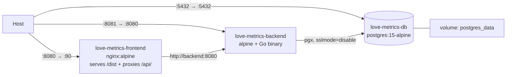

# 09 — Deployment & Containers

---

## 1. Compose topology

[`docker-compose.yml`](../docker-compose.yml) — three services, one named volume, one
implicit default network.



| Service | Container | Host → container | Image / build |
| :------ | :-------- | :--------------- | :------------ |
| `frontend` | `love-metrics-frontend` | **8080 → 80** | build `.` / [`Dockerfile`](../Dockerfile) |
| `backend` | `love-metrics-backend` | **8081 → 8080** | build `./backend` / [`backend/Dockerfile`](../backend/Dockerfile) |
| `postgres` | `love-metrics-db` | 5432 → 5432 | `postgres:15-alpine` |

```bash
docker-compose up --build     # start; open http://localhost:8080
docker-compose logs -f backend
docker-compose down           # keeps the volume
docker-compose down -v        # drops the database
```

**The application URL is `http://localhost:8080`**, not `:3000` as the root README says.
`:8081` is a direct line to the API, useful for `curl` but not usable from the SPA (no CORS).

Service discovery is by Compose service name: Nginx proxies to `http://backend:8080` and
the backend connects to `DB_HOST=postgres` — both resolve on the default network, so
renaming a service in `docker-compose.yml` requires updating `nginx.conf` and the
`DB_HOST` value too.

---

## 2. Frontend image

[`Dockerfile`](../Dockerfile) — two stages, node build → nginx serve:

```dockerfile
FROM node:22-alpine as build
WORKDIR /app
COPY package.json package-lock.json ./
RUN npm install
COPY . .
RUN npm run build

FROM nginx:alpine
COPY --from=build /app/dist /usr/share/nginx/html
COPY nginx.conf /etc/nginx/conf.d/default.conf
EXPOSE 80
CMD ["nginx", "-g", "daemon off;"]
```

The final image contains only static assets and Nginx — no Node runtime.

Two build-hygiene issues:

- **`npm install`, not `npm ci`.** The lockfile is copied but not honoured, so the image can
  resolve versions the repository never tested. Switch to `npm ci` for reproducibility.
- **No `.dockerignore` exists**, so `COPY . .` ships the host's `node_modules`,
  `playwright-report/`, `test-results/`, `.git/`, and `backend/` (including
  `alexithymia.db`) into the build context. This slows builds significantly and copies a
  committed dev database into the layer. A three-line `.dockerignore` fixes it:

  ```
  node_modules
  dist
  .git
  playwright-report
  test-results
  backend
  ```

  (Build output is unaffected — only `/app/dist` is copied into the final stage — but
  context transfer and layer size are.)

### Nginx configuration

[`nginx.conf`](../nginx.conf):

```nginx
location / {
    root   /usr/share/nginx/html;
    try_files $uri $uri/ /index.html;   # SPA fallback: /profile deep-links work
}

location /api/ {
    proxy_pass http://backend:8080;
    proxy_set_header Host $host;
    proxy_set_header X-Real-IP $remote_addr;
    proxy_set_header X-Forwarded-For $proxy_add_x_forwarded_for;
    proxy_set_header X-Forwarded-Proto $scheme;
}
```

`try_files … /index.html` is what makes a refresh on `/profile` work instead of 404ing —
the README's troubleshooting entry points here.

Absent: gzip/brotli, cache headers for hashed assets, HTTP/2, TLS, security headers
(`X-Frame-Options`, CSP, `X-Content-Type-Options`), and any request size limit. Fine for a
self-hosted personal tool; all worth adding before public exposure.

### `/uploads` is not proxied in the container setup

⚠️ There is **no `location /uploads/` block**. The Vite dev proxy has one
([`vite.config.js:16`](../vite.config.js#L16)), Nginx does not — so under Docker every
avatar request hits `location /` instead, falls through `try_files` to `/index.html`, and the
`` renders broken while returning HTTP 200 with HTML.

Fix — add alongside the `/api/` block:

```nginx
location /uploads/ {
    proxy_pass http://backend:8080;
    proxy_set_header Host $host;
}
```

Tracked in [Known Issues](11-known-issues.md#uploads-is-not-proxied-in-the-container-setup).

---

## 3. Backend image

[`backend/Dockerfile`](../backend/Dockerfile):

```dockerfile
FROM golang:1.24.1-alpine AS builder
WORKDIR /app
RUN apk add --no-cache git
COPY go.mod go.sum ./
RUN go mod download
COPY . .
RUN CGO_ENABLED=0 GOOS=linux go build -o main ./cmd/server

FROM alpine:latest
WORKDIR /root/
COPY --from=builder /app/main .
EXPOSE 8080
CMD ["./main"]
```

- `go.mod`/`go.sum` are copied before the source, so the dependency layer caches properly.
- **`CGO_ENABLED=0`** yields a static binary — and it works only because the SQLite driver
  is `glebarez/sqlite` (pure Go, via `modernc.org/sqlite`). Swapping to
  `gorm.io/driver/sqlite` (which wraps `mattn/go-sqlite3`) would require CGO and break this
  build.
- Runs as **root** with `WORKDIR /root/`, so `./uploads` resolves to `/root/uploads`.
- `alpine:latest` (not pinned) provides a shell for debugging; `scratch` or `distroless`
  would be smaller and safer since the binary is static.

### Uploaded files are lost on every container recreation

`/root/uploads` is written inside the container's writable layer and **no volume is
mounted**. `docker-compose down && up`, a rebuild, or any recreation discards every avatar,
while `users.profile_picture` keeps pointing at the vanished file. Fix:

```yaml
backend:
  volumes:
    - backend_uploads:/root/uploads
volumes:
  backend_uploads:
```

---

## 4. Database service

```yaml
postgres:
  image: postgres:15-alpine
  environment:
    - POSTGRES_USER=postgres
    - POSTGRES_PASSWORD=password
    - POSTGRES_DB=alexithymia
  ports: ["5432:5432"]
  volumes: [postgres_data:/var/lib/postgresql/data]
```

Data survives `down`/`up` via `postgres_data`. Schema creation is handled entirely by the
backend's `AutoMigrate` on boot — there are no init scripts. Since Phase 4 the same boot also
runs an idempotent data backfill; [§5](#5-the-phase-4-relationship-migration) covers what to
back up first and what the log should say.

**Port 5432 is published to the host** with the password `password`. On any non-isolated
network that is an open database. Drop the `ports` block unless you need external access;
the backend reaches Postgres over the Compose network regardless.

### No readiness gate for Postgres

`depends_on: [postgres]` only orders *container start*, not readiness — and there is no
`healthcheck` or `condition: service_healthy` anywhere. Meanwhile
`database.Connect()` calls `log.Fatalf` on failure with no retry
([`database.go:36-38`](../backend/internal/database/database.go#L36-L38)).

So on a cold `docker-compose up --build`, the backend frequently starts before Postgres
accepts connections and **exits immediately**. This is precisely the README's
*"Connection Refused to Database → restart the backend container"* symptom. Note the README
claims "the backend waits for Postgres" — it does not.

Two proper fixes, either sufficient:

```yaml
# A — gate on health at the Compose level
postgres:
  healthcheck:
    test: ["CMD-SHELL", "pg_isready -U postgres -d alexithymia"]
    interval: 5s
    timeout: 5s
    retries: 10
backend:
  depends_on:
    postgres: { condition: service_healthy }
  restart: on-failure
```

```go
// B — retry with backoff in Connect(), so the service is resilient outside Compose too
for i := 0; i < 10; i++ {
    DB, err = gorm.Open(postgres.Open(dsn), &gorm.Config{})
    if err == nil { break }
    log.Printf("postgres not ready (attempt %d/10): %v", i+1, err)
    time.Sleep(2 * time.Second)
}
```

B is preferable — it also helps Kubernetes, systemd, and bare-metal deployments. Adding
`restart: on-failure` to the backend is a reasonable stopgap either way.

---

## 5. The Phase 4 relationship migration

> ⚠️ **Back up the database before the first boot on this version.** This is the only
> structural migration in the project's history, and it does two things at once.

**Why a backup is not optional here.** The new `analysis_subjects.relationship_id` column
carries a foreign key, and GORM's SQLite migrator cannot express that as a plain
`ALTER TABLE ADD COLUMN` — it **recreates the table**: create `analysis_subjects__temp`,
copy every row across by column name, drop the original, rename. On Postgres it is an
ordinary `ALTER TABLE`. Either way, a startup backfill then rewrites `relationship_id` (and
normalizes `name`) on every existing row.

Take the backup:

```bash
# SQLite (no DB_HOST): the whole database is one file
cp backend/alexithymia.db backend/alexithymia.db.pre-phase-4

# Postgres under Compose
docker-compose exec -T postgres pg_dump -U postgres alexithymia > alexithymia.pre-phase-4.sql
```

**What a successful boot looks like.** `Connect()` migrates, then runs
`BackfillRelationships` and logs one line:

```
2026/07/26 03:47:38 Running migrations...
2026/07/26 03:47:38 Database migrated
2026/07/26 03:47:38 backfill: 3 relationships, 5 snapshots linked
```

Reboot and the same line reads `backfill: 0 relationships, 0 snapshots linked` — the pass is
idempotent, filtering on `relationship_id IS NULL`, which is what makes running it on every
boot safe. **If the counts are non-zero on a second boot, something is wrong** — stop and
investigate rather than restarting again.

**Verified against a real database**, not only in tests: a pre-Phase-1 SQLite file (no
`tags`, `uncertain`, or `guide_answers` columns at all) carrying 5 snapshots across 3 users
migrated to 3 relationships / 5 snapshots, reported `0, 0` on reboot, and served the full
API afterwards.

**Rolling back** is restoring the backup. There is no down-migration, but the phase is
deliberately cheap to reverse: `AnalysisSubject.Name` is still populated on every row, so an
older binary reads the migrated database correctly and simply ignores the extra column and
table.

**Count parity is the check that matters.** After the first boot, the number of stacks on
the dashboard and the number of cards in each must be exactly what they were before. The
backfill reproduces the browser's old grouping rule — one relationship per
`(user_id, TRIM(name))` — so any difference means the rule diverged, not that data was lost.

---

## 6. Configuration and secrets

Everything is inline in
[`docker-compose.yml:22-28`](../docker-compose.yml#L22-L28):

```yaml
- DB_PASSWORD=password
- JWT_SECRET=supersecretkey   # In production, this should be a real secret.
```

Both are committed to git. There is no `.env` file, no `env_file:` directive, and no
`godotenv` in the backend — so the only way to change them today is to edit the tracked
file. Minimum viable improvement:

```yaml
backend:
  environment:
    - DB_PASSWORD=${DB_PASSWORD:?set DB_PASSWORD}
    - JWT_SECRET=${JWT_SECRET:?set JWT_SECRET}
```

Compose interpolates from a local `.env` (git-ignored) or the shell, and `:?` fails fast
instead of silently defaulting.

**Since Phase 5 an absent `JWT_SECRET` is fatal at startup**: `main()` calls
`auth.LoadSecret()` before anything else and exits with an explanatory message. That closes
the old failure mode where an unset variable produced an empty signing key and the
application ran normally while every token was forgeable. Compose already sets the variable,
so containers are unaffected; a bare `go run ./cmd/server` now needs it
([Development §2](07-development.md#2-fastest-path--no-containers-no-database)).

The `${VAR:?}` form above is still worth adopting — failing at the Compose level names the
missing variable before a container is even created.

Also worth knowing: `docker-compose.yml` declares `version: '3.8'`, which current Compose
versions warn is obsolete. Harmless; deleting the line silences it.

---

## 7. CI

[`.github/workflows/playwright.yml`](../.github/workflows/playwright.yml) is the only
workflow. It runs Playwright on push/PR to `main`/`master` and uploads the HTML report.
Since neither server is started there, it cannot pass — see
[Testing §3.2](08-testing.md#32-why-it-currently-fails). No image is built, pushed, or
deployed by any automation; deployment is manual `docker-compose up`.

---

## 8. Production readiness checklist

Nothing here is required for personal self-hosting; all of it matters before exposing the
app to the internet.

**Blocking**
- [x] ~~Fail startup if `JWT_SECRET` is unset~~ — done in Phase 5.
- [ ] Move `JWT_SECRET` and `DB_PASSWORD` out of the repository (they are still committed in `docker-compose.yml`).
- [ ] Mount a volume for `/root/uploads`, or move storage to object storage.
- [ ] Add the `/uploads/` proxy block to `nginx.conf`.
- [ ] Add a Postgres readiness gate (healthcheck and/or connect retry).
- [ ] Terminate TLS in front of Nginx; enable `sslmode=require` to Postgres.
- [ ] Remove the published `5432:5432` mapping.
- [ ] Remove `backend/alexithymia.db` from git history if it ever held real credentials.

**Strongly recommended**
- [ ] Validate uploads by content, not by client-declared MIME; cap file size.
- [ ] Rate-limit `/api/login` and `/api/signup`.
- [ ] Pin the JWT signing method (`jwt.WithValidMethods`).
- [ ] Run the backend as a non-root user; pin the runtime base image.
- [ ] `npm ci` in the frontend build; add a `.dockerignore`.
- [ ] Add a `/healthz` endpoint for orchestrators and Playwright's `webServer.url`.
- [ ] Security headers and gzip in Nginx.
- [ ] Real migration files, since `AutoMigrate` cannot express destructive changes.
- [ ] Structured logging and an error tracker; today errors are `console.error` on the
      client and Gin's default logger on the server.
- [ ] Backups for `postgres_data` and the uploads volume.
