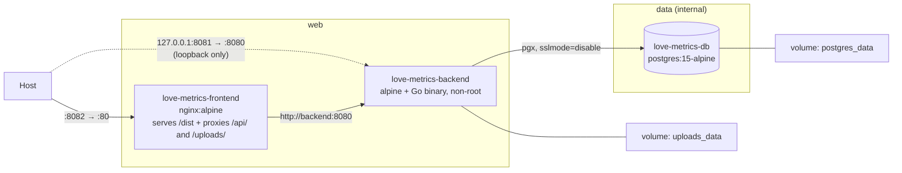

# 09 — Deployment & Containers

---

## 1. Compose topology

[`docker-compose.yml`](../docker-compose.yml) — three services, two named volumes, two
networks.



| Service | Container | Host → container | Networks | Image / build |
| :------ | :-------- | :--------------- | :------- | :------------ |
| `frontend` | `love-metrics-frontend` | **8082 → 80** | `web` | build `.` / [`Dockerfile`](../Dockerfile) |
| `backend` | `love-metrics-backend` | 127.0.0.1:8081 → 8080 | `web`, `data` | build `./backend` / [`backend/Dockerfile`](../backend/Dockerfile) |
| `postgres` | `love-metrics-db` | *none* — `expose: 5432` | `data` | `postgres:15-alpine` |

```bash
cp .env.example .env          # then fill in the two secrets; Compose refuses to start without them
docker compose up --build     # start; open http://localhost:8082
docker compose logs -f backend
docker compose down           # keeps the volumes
docker compose down -v        # drops the database
```

**The application URL is `http://localhost:8082`** (`FRONTEND_PORT` in `.env`), not `:3000`
as the root README says. It is also the *only* port published to the network: `:8081` is
still a direct line to the API for `curl`, but it is bound to `127.0.0.1`, so it is
reachable from the host and from nowhere else. Postgres is not published at all.

**The two networks are the trust boundary.** `frontend` is on `web`, `postgres` is on
`data`, and `backend` is the only member of both — so Nginx has no route to the database
and cannot acquire one. `data` is `internal: true`, which strips its gateway: the database
has no path off this host in either direction.

Service discovery is by Compose service name: Nginx proxies to `http://backend:8080` and
the backend connects to `DB_HOST=postgres`. Renaming a service in `docker-compose.yml`
requires updating `nginx.conf` and the `DB_HOST` value too — and keeping the renamed
service on the right network.

### Per-container hardening

Segmentation decides who can *reach* what; this decides what a compromise *is* once it
happens.

| | `frontend` | `backend` | `postgres` |
| :- | :- | :- | :- |
| `no-new-privileges` | yes | yes | yes |
| `cap_drop: ALL` | yes | yes | yes |
| capabilities added back | `CHOWN`, `SETGID`, `SETUID`, `NET_BIND_SERVICE`, `DAC_OVERRIDE` | **none** | `CHOWN`, `DAC_OVERRIDE`, `FOWNER`, `FSETID`, `SETGID`, `SETUID` |
| runs as | root master, `nginx` workers | `app` (non-root) | root entrypoint, `postgres` server |
| `read_only` root fs | no | yes | no |

The backend is the interesting column: a static Go binary on an unprivileged port, running
as a non-root user, with **no capabilities at all** and a read-only root filesystem — its
only writable paths are the uploads volume and a 64 MB `tmpfs` at `/tmp`. It is also the
service most exposed to user input, since it is the one parsing uploads and JSON.

The other two keep the capabilities their entrypoints genuinely use: Nginx's master binds
:80 and forks workers under another uid, and the Postgres entrypoint starts as root to fix
up the data directory before `su-exec`ing to `postgres`. Both are left writable because
their entrypoints write outside the volume — Nginx's `docker-entrypoint.d` scripts edit
`/etc/nginx/conf.d`, which a read-only root filesystem would break. `read_only: true` plus
`tmpfs` mounts for `/var/cache/nginx` and `/var/run` is a reasonable next step, but it is
one to make with a container to test it against.

`no-new-privileges` is the cheap one worth understanding: it makes `execve` unable to grant
privileges, so a setuid binary inside any of these images cannot be used to climb back up
after the capability drop.

---

## 2. Frontend image

[`Dockerfile`](../Dockerfile) — two stages, node build → nginx serve:

```dockerfile
FROM node:22-alpine as build
WORKDIR /app
COPY package.json package-lock.json ./
RUN npm install
COPY . .
RUN npm run build

FROM nginx:alpine
COPY --from=build /app/dist /usr/share/nginx/html
COPY nginx.conf /etc/nginx/conf.d/default.conf
EXPOSE 80
CMD ["nginx", "-g", "daemon off;"]
```

The final image contains only static assets and Nginx — no Node runtime.

Two build-hygiene issues:

- **`npm install`, not `npm ci`.** The lockfile is copied but not honoured, so the image can
  resolve versions the repository never tested. Switch to `npm ci` for reproducibility.
- **No `.dockerignore` exists**, so `COPY . .` ships the host's `node_modules`,
  `playwright-report/`, `test-results/`, `.git/`, and `backend/` (including
  `alexithymia.db`) into the build context. This slows builds significantly and copies a
  committed dev database into the layer. A three-line `.dockerignore` fixes it:

  ```
  node_modules
  dist
  .git
  playwright-report
  test-results
  backend
  ```

  (Build output is unaffected — only `/app/dist` is copied into the final stage — but
  context transfer and layer size are.)

### Nginx configuration

[`nginx.conf`](../nginx.conf):

```nginx
limit_req_zone $binary_remote_addr zone=auth:10m rate=20r/m;   # http context

server_tokens off;
client_max_body_size 8m;

resolver 127.0.0.11 ipv6=off valid=10s;
set $upstream http://backend:8080;

location / {
    root   /usr/share/nginx/html;
    try_files $uri $uri/ /index.html;   # SPA fallback: /profile deep-links work
}

location ~ ^/api/(login|signup)$ {      # regex wins over the /api/ prefix below
    limit_req zone=auth burst=10 nodelay;
    proxy_pass $upstream$request_uri;
}

location /api/     { proxy_pass $upstream$request_uri; }
location /uploads/ { proxy_pass $upstream$request_uri; }   # + a sandbox CSP
```

`try_files … /index.html` is what makes a refresh on `/profile` work instead of 404ing —
the README's troubleshooting entry points here.

Three things in there are less obvious than they look:

**The upstream goes through a variable.** `proxy_pass http://backend:8080` resolves the
name once, when the config loads, and caches that address for the process's lifetime — so
recreating the backend container, which gives it a new IP, leaves Nginx proxying into the
void and every `/api` call 502s until Nginx is restarted too. A variable forces per-request
resolution against Docker's DNS at `127.0.0.11`. `$request_uri` then supplies the path and
query string that the literal form passed implicitly.

**`/uploads/` is proxied but sandboxed.** It has to be proxied — without the block, avatar
requests fell through to `try_files` and returned HTTP 200 of `index.html`, so the ``
broke with no error status to diagnose. But those files are user-supplied and validated
only against the client's own `Content-Type` header, so the location also sends
`Content-Security-Policy: default-src 'none'; … sandbox`. An HTML file smuggled in as an
image is then inert if anyone navigates to it, while real images still render — CSP on a
subresource response does not restrict the image itself.

**The rate limit is on the two endpoints that gate accounts.** bcrypt at cost 14 makes each
guess expensive for the *server* too (about a second of CPU), so the limit is as much about
denial of service as it is about brute force.

Still absent: gzip/brotli, cache headers for hashed assets, HTTP/2, and TLS.

---

## 3. Backend image

[`backend/Dockerfile`](../backend/Dockerfile):

```dockerfile
FROM golang:1.24.1-alpine AS builder
WORKDIR /app
RUN apk add --no-cache git
COPY go.mod go.sum ./
RUN go mod download
COPY . .
RUN CGO_ENABLED=0 GOOS=linux go build -o main ./cmd/server

FROM alpine:latest
RUN addgroup -S app && adduser -S -D -H -G app app
WORKDIR /app
COPY --from=builder --chown=app:app /app/main /app/migrate ./
RUN install -d -o app -g app /app/uploads
USER app
EXPOSE 8080
CMD ["./main"]
```

- `go.mod`/`go.sum` are copied before the source, so the dependency layer caches properly.
- **`CGO_ENABLED=0`** yields a static binary — and it works only because the SQLite driver
  is `glebarez/sqlite` (pure Go, via `modernc.org/sqlite`). Swapping to
  `gorm.io/driver/sqlite` (which wraps `mattn/go-sqlite3`) would require CGO and break this
  build.
- Runs as **non-root** in `/app`, so `./uploads` resolves to `/app/uploads`. It was
  `WORKDIR /root/` and uid 0 until the container hardening pass; the process binds an
  unprivileged port and writes one directory, so root bought nothing.
- `uploads/` is created **in the image**, not by the server at runtime, so the named volume
  Compose mounts there inherits `app`'s ownership — Docker seeds a fresh volume from the
  image directory's contents *and* its owner and mode. Against a path that does not exist,
  the volume would be created root-owned and the first upload would fail with `EACCES`.
- `alpine:latest` (not pinned) provides a shell for debugging; `scratch` or `distroless`
  would be smaller and safer since the binary is static. The mutable tag is still a
  reproducibility hole — it errs toward *patched*, which is why it has not been changed.

### Uploaded files survive container recreation

`/app/uploads` is a named volume (`uploads_data`). It used to be the container's writable
layer, so `down`/`up`, a rebuild, or any recreation discarded every avatar while
`users.profile_picture` kept pointing at the vanished file.

It is also what makes `read_only: true` possible on this service: with the root filesystem
mounted read-only, the volume and a 64 MB `tmpfs` at `/tmp` (for Gin's multipart spill) are
the only writable paths in the container.

⚠️ **If you are upgrading an existing deployment, the avatars currently in the container
are not in a volume yet.** Copy them out before the first `up` that recreates the backend:

```bash
docker cp love-metrics-backend:/root/uploads ./uploads-backup
# after the stack is up again:
docker cp ./uploads-backup/. love-metrics-backend:/app/uploads
```

---

## 4. Database service

```yaml
postgres:
  image: postgres:15-alpine
  environment:
    - POSTGRES_USER=${POSTGRES_USER:?...}
    - POSTGRES_PASSWORD=${POSTGRES_PASSWORD:?...}
    - POSTGRES_DB=${POSTGRES_DB:?...}
  expose: ["5432"]
  networks: [data]
  volumes: [postgres_data:/var/lib/postgresql/data]
```

Data survives `down`/`up` via `postgres_data`. Schema creation is handled entirely by the
backend's `AutoMigrate` on boot — there are no init scripts. Since Phase 4 the same boot also
runs an idempotent data backfill; [§5](#5-the-phase-4-relationship-migration) covers what to
back up first and what the log should say.

**Nothing on the host can reach Postgres.** `expose` publishes to the Compose network and
not to the host, and the `data` network is `internal`, so the only process that can open a
socket to 5432 is a container attached to that network — which is `backend`, alone. The
`psql` targets in the Makefile work by `docker compose exec`, i.e. from inside the
container, so none of them needed the old `5432:5432` mapping either.

Credentials come from a git-ignored `.env` ([§6](#6-configuration-and-secrets)).

**Rotating the password is two steps, not one.** `POSTGRES_*` is read by `initdb`, which
runs exactly once, against an empty data directory. Editing `.env` therefore changes what
the backend *presents* and not what Postgres *expects*, and the symptom is a backend that
cannot connect to a database that is running fine. `make db-password` applies the value in
`.env` to the live database (over the container's unix socket, so it needs no old
password); restart the backend afterwards.

### Postgres readiness gate

`depends_on: [postgres]` on its own only orders *container start*, not readiness, while
`database.Connect()` calls `log.Fatalf` on failure with no retry
([`database.go:36-38`](../backend/internal/database/database.go#L36-L38)) — so a cold start
used to race, and the backend frequently exited before Postgres accepted connections. That
was the README's *"Connection Refused to Database → restart the backend container"*
symptom.

Closed: `postgres` now declares a `pg_isready` healthcheck and `backend` waits on
`condition: service_healthy`. The README's claim that "the backend waits for Postgres" is
finally true, though by Compose's doing rather than the backend's — a connect-retry loop in
`Open()` would still be worth having, since a database that restarts *later* is not covered
by a start-time gate.

Two proper fixes, either sufficient:

```yaml
# A — gate on health at the Compose level
postgres:
  healthcheck:
    test: ["CMD-SHELL", "pg_isready -U postgres -d alexithymia"]
    interval: 5s
    timeout: 5s
    retries: 10
backend:
  depends_on:
    postgres: { condition: service_healthy }
  restart: on-failure
```

```go
// B — retry with backoff in Connect(), so the service is resilient outside Compose too
for i := 0; i < 10; i++ {
    DB, err = gorm.Open(postgres.Open(dsn), &gorm.Config{})
    if err == nil { break }
    log.Printf("postgres not ready (attempt %d/10): %v", i+1, err)
    time.Sleep(2 * time.Second)
}
```

B is preferable — it also helps Kubernetes, systemd, and bare-metal deployments. Adding
`restart: on-failure` to the backend is a reasonable stopgap either way.

---

## 5. The Phase 4 relationship migration

> ⚠️ **Back up the database before the first boot on this version.** This is the only
> structural migration in the project's history, and it does two things at once.

**Why a backup is not optional here.** The new `analysis_subjects.relationship_id` column
carries a foreign key, and GORM's SQLite migrator cannot express that as a plain
`ALTER TABLE ADD COLUMN` — it **recreates the table**: create `analysis_subjects__temp`,
copy every row across by column name, drop the original, rename. On Postgres it is an
ordinary `ALTER TABLE`. Either way, a startup backfill then rewrites `relationship_id` (and
normalizes `name`) on every existing row.

Take the backup:

```bash
# SQLite (no DB_HOST): the whole database is one file
cp backend/alexithymia.db backend/alexithymia.db.pre-phase-4

# Postgres under Compose
docker-compose exec -T postgres pg_dump -U postgres alexithymia > alexithymia.pre-phase-4.sql
```

**What a successful boot looks like.** `Connect()` migrates, then runs
`BackfillRelationships` and logs one line:

```
2026/07/26 03:47:38 Running migrations...
2026/07/26 03:47:38 Database migrated
2026/07/26 03:47:38 backfill: 3 relationships, 5 snapshots linked
```

Reboot and the same line reads `backfill: 0 relationships, 0 snapshots linked` — the pass is
idempotent, filtering on `relationship_id IS NULL`, which is what makes running it on every
boot safe. **If the counts are non-zero on a second boot, something is wrong** — stop and
investigate rather than restarting again.

**Verified against a real database**, not only in tests: a pre-Phase-1 SQLite file (no
`tags`, `uncertain`, or `guide_answers` columns at all) carrying 5 snapshots across 3 users
migrated to 3 relationships / 5 snapshots, reported `0, 0` on reboot, and served the full
API afterwards.

**Rolling back** is restoring the backup. There is no down-migration, but the phase is
deliberately cheap to reverse: `AnalysisSubject.Name` is still populated on every row, so an
older binary reads the migrated database correctly and simply ignores the extra column and
table.

**Count parity is the check that matters.** After the first boot, the number of stacks on
the dashboard and the number of cards in each must be exactly what they were before. The
backfill reproduces the browser's old grouping rule — one relationship per
`(user_id, TRIM(name))` — so any difference means the rule diverged, not that data was lost.

---

## 6. Configuration and secrets

`DB_PASSWORD=password` and `JWT_SECRET=supersecretkey` used to be inline in
`docker-compose.yml` and therefore committed. They now come from a git-ignored `.env`:

```yaml
backend:
  environment:
    - DB_PASSWORD=${POSTGRES_PASSWORD:?set POSTGRES_PASSWORD in .env}
    - "JWT_SECRET=${JWT_SECRET:?set JWT_SECRET in .env, generate with: openssl rand -hex 32}"
```

`:?` is the part that matters: an unset or empty variable stops Compose *before a container
is created* and names the variable it wanted, instead of starting the stack with a
placeholder. [`.env.example`](../.env.example) is the committed template and lists how to
generate each value; [`.gitignore`](../.gitignore) ignores `.env` and `.env.*` while
un-ignoring the example.

This is **interpolation, not `env_file:`** — deliberately. `env_file:` injects every
variable in the file into the service, which would hand `JWT_SECRET` to Postgres and the
database password to anything else that grew an `env_file:` line later. Naming each
variable under each service keeps a secret visible only to the containers that need it: the
database password to `backend` and `postgres`, the JWT key to `backend` alone.

Note that `docker compose config` prints the resolved values in clear — it is a debugging
command, not something to paste into an issue.

**Since Phase 5 an absent `JWT_SECRET` is fatal at startup**: `main()` calls
`auth.LoadSecret()` before anything else and exits with an explanatory message. That closes
the old failure mode where an unset variable produced an empty signing key and the
application ran normally while every token was forgeable. With `${JWT_SECRET:?}` the same
mistake is now caught one layer earlier still. A bare `go run ./cmd/server` needs the
variable in the shell ([Development §2](07-development.md#2-fastest-path--no-containers-no-database)).

**Rotating `JWT_SECRET` logs everyone out** — every issued token fails verification against
the new key. Rotating `POSTGRES_PASSWORD` needs `make db-password` as well as the `.env`
edit ([§4](#4-database-service)).

### What is still missing: TLS

Nginx speaks cleartext HTTP on `${FRONTEND_PORT}`. Passwords, JWTs and every answer in the
vault cross the network in the open, and nothing above changes that — a strong database
password does not help if the token authorising the request was readable in transit. On a
LAN that is a judgement call; on a public address it is the largest remaining hole.

Terminate TLS in front of this stack (Caddy or Traefik with an ACME certificate is the
least work — point it at `frontend` and stop publishing `${FRONTEND_PORT}` to the world),
and set `sslmode=require` on the Postgres DSN if the database ever moves off this host.

---

## 7. CI

[`.github/workflows/playwright.yml`](../.github/workflows/playwright.yml) is the only
workflow. It runs Playwright on push/PR to `main`/`master` and uploads the HTML report.
Since neither server is started there, it cannot pass — see
[Testing §3.2](08-testing.md#32-why-it-currently-fails). No image is built, pushed, or
deployed by any automation; deployment is manual `docker-compose up`.

---

## 8. Production readiness checklist

Nothing here is required for personal self-hosting; all of it matters before exposing the
app to the internet.

**Blocking**
- [x] ~~Fail startup if `JWT_SECRET` is unset~~ — done in Phase 5.
- [x] ~~Move `JWT_SECRET` and `DB_PASSWORD` out of the repository~~ — `.env` + `${VAR:?}` interpolation ([§6](#6-configuration-and-secrets)).
- [x] ~~Mount a volume for `/root/uploads`~~ — `uploads_data:/app/uploads`. Object storage is still the answer if this ever runs on more than one host.
- [x] ~~Add the `/uploads/` proxy block to `nginx.conf`~~ — with a `sandbox` CSP over it, since the stored files are user-supplied and validated only by client-declared MIME.
- [x] ~~Add a Postgres readiness gate~~ — `pg_isready` healthcheck + `condition: service_healthy`. A connect retry in `Open()` is still worth having for mid-life restarts.
- [ ] Terminate TLS in front of Nginx; enable `sslmode=require` to Postgres. **The largest remaining hole** — see [§6](#what-is-still-missing-tls).
- [x] ~~Remove the published `5432:5432` mapping~~ — `expose` only, on an `internal` network ([§4](#4-database-service)).
- [ ] Remove `backend/alexithymia.db` from git history if it ever held real credentials.

**Strongly recommended**
- [ ] Validate uploads by content, not by client-declared MIME. *(Size is now capped at 8 MB by `client_max_body_size`, but the type check is still `file.Header.Get("Content-Type")`; the `sandbox` CSP on `/uploads/` contains the consequence rather than fixing the cause.)*
- [x] ~~Rate-limit `/api/login` and `/api/signup`~~ — `limit_req` zone `auth`, 20 r/m with a burst of 10, returning 429.
- [ ] Pin the JWT signing method (`jwt.WithValidMethods`).
- [x] ~~Run the backend as a non-root user~~ — plus `cap_drop: ALL`, `read_only`, and `no-new-privileges` on all three services. The runtime base image is still the mutable `alpine:latest`.
- [ ] `npm ci` in the frontend build.
- [x] ~~Add a `.dockerignore`~~ — and it now excludes `.env`, so a secret cannot reach an image layer.
- [ ] Add a `/healthz` endpoint for orchestrators and Playwright's `webServer.url`. *(Would also let `frontend` wait on `condition: service_healthy` instead of `service_started`.)*
- [x] ~~Security headers in Nginx~~ — CSP, `nosniff`, `X-Frame-Options`, `Referrer-Policy`, `Permissions-Policy`, `server_tokens off`. gzip is still off.
- [ ] Real migration files, since `AutoMigrate` cannot express destructive changes.
- [ ] Structured logging and an error tracker; today errors are `console.error` on the
      client and Gin's default logger on the server.
- [ ] Backups for `postgres_data` and the uploads volume. *(`make db-backup` covers the
      database; `uploads_data` has nothing.)*
- [ ] Give the backend a non-superuser Postgres role. It connects as the `postgres`
      superuser today; `AutoMigrate` needs DDL rights, but not `SUPERUSER`. Needs an initdb
      script, so it only takes effect on a fresh volume.
