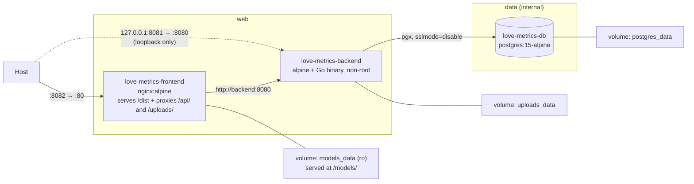

# 09 — Deployment & Containers

---

## 1. Compose topology

[`docker-compose.yml`](../docker-compose.yml) — three services, three named volumes, two
networks.



| Service | Container | Host → container | Networks | Image / build |
| :------ | :-------- | :--------------- | :------- | :------------ |
| `frontend` | `love-metrics-frontend` | **8082 → 80** | `web` | build `.` / [`Dockerfile`](../Dockerfile) |
| `backend` | `love-metrics-backend` | 127.0.0.1:8081 → 8080 | `web`, `data` | build `./backend` |
| `postgres` | `love-metrics-db` | *none* — `expose: 5432` | `data` | `postgres:15-alpine` |

```bash
cp .env.example .env          # then fill in the two secrets; Compose refuses to start without them
docker compose up --build     # start; open http://localhost:8082
docker compose down           # keeps the volumes;  down -v drops the database
```

**`http://localhost:8082`** (`FRONTEND_PORT` in `.env`) is the application URL, and the *only*
port published to the network: `:8081` is a direct line to the API for `curl` but is bound to
`127.0.0.1`, and Postgres is not published at all.

**The two networks are the trust boundary.** `frontend` is on `web`, `postgres` on `data`, and
`backend` is the only member of both — so Nginx has no route to the database and cannot acquire
one. `data` is `internal: true`, which strips its gateway: the database has no path off this
host in either direction.

Service discovery is by Compose service name. Renaming a service requires updating `nginx.conf`
and `DB_HOST` too — and keeping the renamed service on the right network.

### Per-container hardening

Segmentation decides who can *reach* what; this decides what a compromise *is* once it happens.

| | `frontend` | `backend` | `postgres` |
| :- | :- | :- | :- |
| `no-new-privileges` | yes | yes | yes |
| `cap_drop: ALL` | yes | yes | yes |
| capabilities added back | `CHOWN`, `SETGID`, `SETUID`, `NET_BIND_SERVICE`, `DAC_OVERRIDE` | **none** | `CHOWN`, `DAC_OVERRIDE`, `FOWNER`, `FSETID`, `SETGID`, `SETUID` |
| runs as | root master, `nginx` workers | `app` (non-root) | root entrypoint, `postgres` server |
| `read_only` root fs | no | yes | no |

The backend is the interesting column: a static Go binary on an unprivileged port, non-root,
**no capabilities at all**, read-only root filesystem, with only the uploads volume and a 64 MB
`tmpfs` at `/tmp` writable. It is also the service most exposed to user input.

The other two keep the capabilities their entrypoints genuinely use, and are left writable
because those entrypoints write outside the volume — Nginx's `docker-entrypoint.d` scripts edit
`/etc/nginx/conf.d`, which a read-only root filesystem would break.

`no-new-privileges` makes `execve` unable to grant privileges, so a setuid binary inside any of
these images cannot be used to climb back up after the capability drop.

---

## 2. Frontend image

[`Dockerfile`](../Dockerfile) — two stages, `node:22-alpine` build → `nginx:alpine` serve. The
final image contains only static assets and Nginx, no Node runtime.

One build-hygiene issue remains: **`npm install`, not `npm ci`** — the lockfile is copied but
not honoured, so the image can resolve versions the repository never tested.

### Nginx configuration

```nginx
limit_req_zone $binary_remote_addr zone=auth:10m rate=20r/m;   # http context
types { text/javascript mjs; }                                 # see below

server_tokens off;
client_max_body_size 8m;

resolver 127.0.0.11 ipv6=off valid=10s;
set $upstream http://backend:8080;

location / { root /usr/share/nginx/html; try_files $uri $uri/ /index.html; }   # SPA fallback

location ~ ^/api/(login|signup|refresh)$ {   # regex wins over the /api/ prefix below
    limit_req zone=auth burst=10 nodelay;
    proxy_pass $upstream$request_uri;
}
location /api/     { proxy_pass $upstream$request_uri; }
location /uploads/ { proxy_pass $upstream$request_uri; }        # + a sandbox CSP, + CORP
location /models/  { alias /srv/models/; try_files $uri =404; } # the models_data volume
```

Four things there are less obvious than they look.

**The upstream goes through a variable.** `proxy_pass http://backend:8080` resolves the name
once, when the config loads, and caches that address for the process's lifetime — so recreating
the backend container leaves Nginx proxying into the void and every `/api` call 502s until Nginx
restarts too. A variable forces per-request resolution against Docker's DNS at `127.0.0.11`, and
`$request_uri` supplies the path and query the literal form passed implicitly.

**`/uploads/` is proxied but sandboxed.** It has to be proxied — without the block, avatar
requests fell through to `try_files` and returned HTTP 200 of `index.html`, so the `` broke
with no error status to diagnose. But those files are validated only against the client's own
`Content-Type`, so the location also sends
`Content-Security-Policy: default-src 'none'; … sandbox`: an HTML file smuggled in as an image
is inert if anyone navigates to it, while real images still render.

**`try_files $uri =404` on `/models/` is load-bearing.** Without it a missing weight falls
through to the SPA and is answered with HTTP 200 and a page of HTML, which arrives at a runtime
as a *corrupt* model rather than a missing one.

**`.mjs` needs a MIME type and nginx does not ship one.** Checked against nginx 1.31.4: `.mjs`
is absent from the bundled `mime.types`, so it is served as `application/octet-stream` — and a
module script with that type is **refused** by strict MIME checking. ONNX Runtime's WebAssembly
loader is a `.mjs`, so without the `types { text/javascript mjs; }` block the Light-tier
transcriber cannot start at all, and the error it reports is the unhelpful *"no available
backend found"*. `.wasm` needs no such line. **A browser that already cached the pre-fix
response keeps the wrong type**, because `/assets/` is served immutable; one hard reload is
needed after deploying this fix.

Still absent: gzip/brotli, cache headers for hashed assets, and HTTP/2.

### Cross-origin isolation, and why `/uploads/` needed a header for it

Running a transcriber in WebAssembly took four header changes, one with a blast radius wider
than the feature:

| Header | Was | Is | Why |
| :----- | :-- | :- | :-- |
| `Permissions-Policy` | `microphone=()` | `microphone=(self)` | A policy denial rejects `getUserMedia` before the browser asks anyone, so the voice check-in could not even show its consent prompt. `geolocation` and `camera` stay denied |
| CSP `script-src` | `'self'` | `'self' 'wasm-unsafe-eval'` | A bare `script-src 'self'` blocks WebAssembly compilation outright. `'wasm-unsafe-eval'` permits WASM **without** re-enabling `eval()` or `new Function()` |
| CSP `worker-src` | *(inherited)* | `'self'` | Already resolved through the `default-src` fallback; stated because the transcriber runs in a Worker |
| `Cross-Origin-Opener-Policy` / `Cross-Origin-Embedder-Policy` | *(absent)* | `same-origin` / `require-corp` | Together they make the document *cross-origin isolated*, the only way a browser hands out `SharedArrayBuffer` — i.e. the only way a WASM build uses more than one core |

`connect-src` is unchanged and must stay that way: model weights come from this origin, never
from a public model hub, and the Vault page tells the user exactly that.

**COEP is the one to understand.** `require-corp` means every *cross-origin* subresource must
carry a `Cross-Origin-Resource-Policy` header of its own, or the browser blocks it — with no
HTTP error to read, because the response arrives and is then discarded. Avatars under
`/uploads/` are cross-origin whenever the SPA and the API are on different hostnames, so that
location sends `Cross-Origin-Resource-Policy: cross-origin`.

`cross-origin` rather than `same-site`, because `same-site` would still block the Android
WebView, whose document is served from `https://localhost` by Capacitor. It grants nothing new
either: with no CORP header at all — what this location sent before — any origin could already
embed these images.

Two things measured on 2026-08-25 that are easy to get wrong later:

- **A same-origin deployment does not exercise CORP at all.** On the web `getServerUrl()`
  returns `''`, so avatars resolve as same-origin paths and COEP never applies. Verifying
  "avatars still load" on a stock Compose stack proves nothing about CORP. It was verified
  separately against a second cross-origin-isolated document: `/uploads/` (CORP present) loaded,
  and `/vite.svg` from the same origin (no CORP) was blocked with
  `net::ERR_BLOCKED_BY_RESPONSE.NotSameOriginAfterDefaultedToSameOriginByCoep`.
- **The app's own CSP blocks cross-origin subresources before COEP is consulted.** `img-src`
  lists `'self'` plus the two production hostnames over https and nothing else, which keeps
  COEP's blast radius small.

---

## 3. Backend image

Multi-stage `golang:1.24.1-alpine` → `alpine:latest`.

- `go.mod`/`go.sum` are copied before the source, so the dependency layer caches properly.
- **`CGO_ENABLED=0`** yields a static binary — and works only because the SQLite driver is
  `glebarez/sqlite` (pure Go). Swapping to `gorm.io/driver/sqlite` would require CGO and break
  this build.
- Runs as **non-root** in `/app`, so `./uploads` resolves to `/app/uploads`.
- `uploads/` is created **in the image**, not at runtime, so the named volume Compose mounts
  there inherits `app`'s ownership — Docker seeds a fresh volume from the image directory's
  contents *and* its owner and mode. Against a path that does not exist, the volume would be
  root-owned and the first upload would fail with `EACCES`.
- `alpine:latest` (not pinned) provides a shell for debugging; `scratch` or `distroless` would
  be smaller and safer since the binary is static. The mutable tag errs toward *patched*, which
  is why it has not been changed.

### The model channel: `/models/` and `make models-fetch`

On-device inference needs weights, and weights are large. They are **not** baked into the
frontend image — a layer carrying either would have to be rebuilt and re-pushed on every
frontend change — and **not** fetched from a public model hub, because `connect-src 'self'` and
the Vault page both say every request goes to this app's own origin.

They live in a named volume, `models_data`, mounted **read-only** into the frontend container at
`/srv/models` and served at `/models/`. Nginx is the only reader; nothing in the stack can write
there. **An empty volume is the normal state of a fresh deployment** — `/models/` simply 404s
until the operator opts a model in.

```bash
make models-fetch                                  # default set
make models-fetch MODELS="whisper-tiny gemma-4-e2b-onnx gemma-4-e2b-litertlm embeddinggemma"
```

It creates the volume if needed, downloads every file of the selected sets, and verifies each
against a SHA-256 pinned in the [`Makefile`](../Makefile). Idempotent: a file already present
and correct is left alone, so re-running it is also the integrity check. A set name the manifest
does not describe is refused before anything downloads.

| Set | What it is for | Size |
| :-- | :------------- | :--- |
| `whisper-tiny` (default) | The Light tier's transcriber, on both platforms | **45,245,009 B**, 13 files |
| `gemma-4-e2b-onnx` | The proposal model **in a browser**, through transformers.js | **3,401,460,010 B**, 16 files |
| `gemma-4-e2b-litertlm` | The proposal model **on Android**, as one LiteRT-LM bundle | **2,588,159,070 B**, 2 files |
| `embeddinggemma` | The similar-entry index (§5.8), **in a browser only** | **218,739,216 B**, 8 files — 7 fetched, 1 installed from this repository |

**Fetch only the sets your clients need.** The two Gemma sets are the same model in two
packagings; an operator serving only phones has no use for the 3.4 GB of ONNX, nor a
browser-only deployment for the 2.6 GB bundle. Both together is 6 GB.

**`embeddinggemma` is not part of any tier.** A device that transcribes and proposes has no use
for a vector; the index is a separate switch, off by default.

**A browser without a WebGPU adapter never asks for the Gemma files at all**, and neither does a
phone below 6 GB or without a 64-bit ABI — those devices are on the Light tier, which needs
`whisper-tiny` and, for its proposals, the 3.1 GB text-only subset of `gemma-4-e2b-onnx`.

**The browser verifies the same sums again.** `src/journal/inference/models.js` carries a second
copy of the manifest and re-hashes every file it is served before caching it, and a unit test
reads the Makefile to keep the two identical. That catches a truncated volume, a half-written
file and a proxy that answered with a page of HTML — none of which a check at one end would see.

| | |
| :-- | :-- |
| Where the pins live | `MODEL_MANIFEST` in the Makefile: one `set\|path\|url\|sha256` row per file |
| Where the logic lives | [`scripts/models-fetch.sh`](../scripts/models-fetch.sh) |
| How it runs | a one-off `alpine:3.20` container with the volume mounted — so it works before the stack has ever been up, and needs no `curl` or `sha256sum` on the host |
| Licences | placed **beside** the weights and pinned like any other row. Whisper tiny is Apache 2.0. **EmbeddingGemma is not**: it is under the [Gemma Terms of Use](https://ai.google.dev/gemma/terms), whose §3.1 requires a copy of the terms to accompany any Distribution — and serving these weights from your own machine is Distribution |
| The one file that is not fetched | Google publishes the Gemma terms as an **HTML page that is not byte-stable**, so they cannot be pinned by URL. The copy in [`licences/gemma-terms-of-use.txt`](../licences/gemma-terms-of-use.txt) is installed by `models-install-terms`, which `models-fetch` runs when `embeddinggemma` is among the sets. A unit test hashes that file against the sum the app carries, so the two cannot drift |

**A mismatch fails and does not repair itself.** A file already in the volume that does not match
its pin is either corruption or tampering, and silently re-downloading it would erase the
evidence of which. The run stops, names the file, prints expected and actual, and tells the
operator how to delete it and try again. A freshly downloaded file that fails its pin has its
partial deleted and the run stops the same way. Verified on 2026-08-25 by flipping a single byte
in the 10 MB encoder file — same length, different hash — and confirming the next run refused
it, exited non-zero, and left it in place.

> ⚠️ Running `make models-fetch` **before** the first `make up` makes Compose print
> `volume "love-metrics-models" already exists but was not created by Docker Compose` on every
> subsequent `up`. It is a warning and nothing more.

### Uploaded files survive container recreation

`/app/uploads` is a named volume (`uploads_data`). It used to be the container's writable layer,
so any recreation discarded every avatar while `users.profile_picture` kept pointing at the
vanished file. It is also what makes `read_only: true` possible on this service.

⚠️ **Upgrading an existing deployment:** the avatars currently in the container are not in a
volume yet. Copy them out before the first `up` that recreates the backend:

```bash
docker cp love-metrics-backend:/root/uploads ./uploads-backup
# after the stack is up again:
docker cp ./uploads-backup/. love-metrics-backend:/app/uploads
```

---

## 4. Database service

`postgres:15-alpine`, credentials from a git-ignored `.env`
([§6](#6-configuration-and-secrets)), `expose: ["5432"]` on the `data` network,
`postgres_data:/var/lib/postgresql/data`.

Schema creation is handled entirely by the backend's `AutoMigrate` on boot — there are no init
scripts — and the same boot runs an idempotent data backfill
([§5](#5-the-phase-4-relationship-migration)).

**Nothing on the host can reach Postgres.** `expose` publishes to the Compose network and not to
the host, and `data` is `internal`, so the only process that can open a socket to 5432 is
`backend`. The `psql` targets in the Makefile work by `docker compose exec`.

**Rotating the password is two steps, not one.** `POSTGRES_*` is read by `initdb`, which runs
exactly once against an empty data directory. Editing `.env` therefore changes what the backend
*presents* and not what Postgres *expects*, and the symptom is a backend that cannot connect to
a database that is running fine. `make db-password` applies the value in `.env` to the live
database over the container's unix socket, so it needs no old password; restart the backend
afterwards.

### Postgres readiness gate

`depends_on` on its own only orders *container start*, not readiness, while `database.Connect()`
calls `log.Fatalf` with no retry — so a cold start used to race and the backend frequently
exited before Postgres accepted connections.

Closed: `postgres` declares a `pg_isready` healthcheck and `backend` waits on
`condition: service_healthy`. A connect-retry loop in `Open()` would still be worth having,
since a database that restarts *later* is not covered by a start-time gate, and it would also
help Kubernetes, systemd and bare-metal deployments. `restart: on-failure` on the backend is a
reasonable stopgap either way.

---

## 5. The Phase 4 relationship migration

> ⚠️ **Back up the database before the first boot on this version.** The only structural
> migration in the project's history, and it does two things at once.

**Why a backup is not optional here.** `analysis_subjects.relationship_id` carries a foreign key,
and GORM's SQLite migrator cannot express that as a plain `ALTER TABLE ADD COLUMN` — it
**recreates the table**: create temp, copy every row by column name, drop, rename. On Postgres it
is an ordinary `ALTER TABLE`. Either way a startup backfill then rewrites `relationship_id` (and
normalizes `name`) on every existing row.

```bash
# SQLite (no DB_HOST): the whole database is one file
cp backend/alexithymia.db backend/alexithymia.db.pre-phase-4
# Postgres under Compose
docker-compose exec -T postgres pg_dump -U postgres alexithymia > alexithymia.pre-phase-4.sql
```

**What a successful boot looks like:**

```
Running migrations...
Database migrated
backfill: 3 relationships, 5 snapshots linked
```

Reboot and the same line reads `backfill: 0 relationships, 0 snapshots linked` — the pass is
idempotent, filtering on `relationship_id IS NULL`. **If the counts are non-zero on a second
boot, something is wrong** — stop and investigate rather than restarting again.

**Verified against a real database**, not only in tests: a pre-Phase-1 SQLite file (no `tags`,
`uncertain` or `guide_answers` columns at all) carrying 5 snapshots across 3 users migrated to
3 relationships / 5 snapshots, reported `0, 0` on reboot, and served the full API afterwards.

**Rolling back** is restoring the backup. There is no down-migration, but the phase is cheap to
reverse: `AnalysisSubject.Name` is still populated on every row, so an older binary reads the
migrated database correctly and ignores the extra column and table.

**Count parity is the check that matters.** After the first boot, the number of stacks on the
dashboard and the number of cards in each must be exactly what they were before. The backfill
reproduces the browser's old grouping rule, so any difference means the rule diverged.

---

## 6. Configuration and secrets

Secrets come from a git-ignored `.env`, interpolated per service:

```yaml
backend:
  environment:
    - DB_PASSWORD=${POSTGRES_PASSWORD:?set POSTGRES_PASSWORD in .env}
    - "JWT_SECRET=${JWT_SECRET:?set JWT_SECRET in .env, generate with: openssl rand -hex 32}"
```

`:?` is the part that matters: an unset or empty variable stops Compose *before a container is
created* and names the variable it wanted, instead of starting the stack with a placeholder.
[`.env.example`](../.env.example) is the committed template.

This is **interpolation, not `env_file:`** — deliberately. `env_file:` injects every variable in
the file into the service, which would hand `JWT_SECRET` to Postgres and the database password
to anything else that grew an `env_file:` line later. Naming each variable under each service
keeps a secret visible only to the containers that need it.

Note that `docker compose config` prints the resolved values in clear — a debugging command, not
something to paste into an issue.

**An absent `JWT_SECRET` is fatal at startup**: `main()` calls `auth.LoadSecret()` before
anything else and exits with an explanatory message, which closes the old failure mode where an
unset variable produced an empty signing key and the application ran normally while every token
was forgeable. With `${JWT_SECRET:?}` the same mistake is caught one layer earlier still.

**Rotating `JWT_SECRET` logs everyone out.** Rotating `POSTGRES_PASSWORD` needs
`make db-password` as well as the `.env` edit ([§4](#4-database-service)).

### What is still missing: TLS

Not in the Compose stack: the container Nginx speaks HTTP on `127.0.0.1:${FRONTEND_PORT:-8082}`.

In the production deployment a **host** Nginx reverse proxy terminates TLS (Let's Encrypt /
Certbot) for `alexithymialovequantifier.voglerprojekte.com` and
`api.alexithymialovequantifier.voglerprojekte.com`, forwarding to `127.0.0.1:8082`. Any other
deployment needs the same thing in front of it, and `sslmode=require` to Postgres if the
database ever leaves this host.

---

## 7. CI

Three workflows. Only one runs without being asked.

| Workflow | Trigger | What it does |
| :------- | :------ | :----------- |
| [`playwright.yml`](../.github/workflows/playwright.yml) | push/PR to `main`/`master` | Runs Playwright and uploads the HTML report. **It cannot pass** — neither server is started there; see [Testing §3.2](08-testing.md#32-why-it-currently-fails) |
| [`android-release.yml`](../.github/workflows/android-release.yml) | tag `v*`, or manual | Builds the APK and attaches it to a GitHub Release |
| [`deploy.yml`](../.github/workflows/deploy.yml) | manual only | Deploys to the production host over SSH |

### The Android release

`android-release.yml` runs the frontend suite and a `vite build` first, then builds the APK
through [`Dockerfile.android`](../Dockerfile.android) — the same file `make build-android` uses,
with the same build arguments. That is on purpose: `android/` is regenerated from the Capacitor
template inside the image on every run, so the artefact depends on `package-lock.json` and the
Dockerfile rather than on any machine's local state. If the Makefile's recipe grows a third
build argument, the workflow needs it too.

The APK carries the journal's native plugin, a `file:` dependency at `plugins/alq-journal/`.
`Dockerfile.android` copies `plugins/` **before** `npm ci` in both stages, because a lockfile
naming a path the build context does not yet hold fails the install with an unhelpful `ENOENT`.
The plugin's ONNX Runtime dependency adds roughly 15 MB of native libraries, and the 27 MB of
ONNX Runtime WebAssembly in `dist/` is bundled into the APK too without ever running there — a
recorded follow-up, not a deliberate choice.

`VITE_ANDROID_API_URL` has a default in three places that must agree: `ANDROID_API_URL` in the
[Makefile](../Makefile), `DEFAULT_NATIVE_URL` in
[`src/mobile/serverUrl.js`](../src/mobile/serverUrl.js), and the workflow's `api_url` input. It
is only a default — the in-app Server settings screen writes `localStorage` and wins, which is
what makes one APK usable by anyone self-hosting.

The APK is **debug-signed**, which installs from a browser download and cannot be uploaded to
the Play Store. `make bundle-android KEYSTORE=...` is the path when someone decides otherwise.
Tagging (`git tag v1.0.0 && git push origin v1.0.0`) is the normal route; a manual run with
`release_tag` empty attaches the APK to the workflow run instead of publishing anything.

### The deployment

`deploy.yml` automates the host-side update and **nothing else**. It does not provision the
host: Docker, the host Nginx site, the Certbot certificates and `.env` are set up once by hand.
`.env` can never come from CI — it is git-ignored precisely so the database password and the JWT
signing key live only on the host.

On the host it updates the checkout, takes a database dump, runs `make up` — database first,
schema second, app third, so a failed migration stops the deploy instead of leaving a server
answering 500s — then probes the stack twice: once on `127.0.0.1:8082` and once over TLS from
the runner. Two checks rather than one because they fail differently: the first says the stack
is broken, the second says the host Nginx, DNS or the certificate is.

There is no `/healthz` yet, so the API probe asks an unauthenticated `GET /api/me` and expects
**401** — the backend answering correctly. A `502` is Nginx unable to reach it.

It **refuses to run against a dirty checkout** on the server unless `force_dirty` is set. A file
edited by hand on the host is usually a fix made in a hurry, and discarding it silently is how
it gets lost and rediscovered.

Manual dispatch only, deliberately: the default branch is not green-gated, so deploying on push
would be deploying on an unchecked signal.

**What it needs configured.** Secrets: `DEPLOY_SSH_KEY` (private half of a dedicated key) and
`DEPLOY_HOST_KEY` (from `ssh-keyscan`, so the runner pins the host rather than trusting whatever
answers on port 22). Optional variables `DEPLOY_HOST`, `DEPLOY_USER` and `DEPLOY_PATH` default
to the production host, `root`, and `/root/projects/AlexithymiaLoveQuantifier` — **not** the
`/opt` the Setup Guide suggests.

The login needs Docker, `make`, `git` and `curl`, and its `git` must reach GitHub — the
checkout's `origin` is an SSH remote, so the host has its own key for that, separate from the
one CI logs in with. Verified present 2026-08-29: Docker 29.1.3, Compose 2.40.3, GNU Make 4.4.1,
git 2.53.0. Also verified, because the health checks assume them: the host Nginx serves both
hostnames from one TLS server block with a 301 from port 80, the certificate covers both names,
`GET /` answers **200** and an unauthenticated `GET /api/me` answers **401** — on the loopback
port and over TLS alike.

**This host runs other projects** — a second app on `127.0.0.1:8083` behind the same Nginx —
which is why the deploy's `docker image prune` carries an `until=168h` filter rather than
collecting every dangling image on the box.

The workflow declares the `production` environment, so required reviewers can be attached to it.
A branch deploys as a branch (`git checkout -B`), so a plain `git pull` on the server still works
for whoever administers it by hand.

---

## 8. Production readiness checklist

Nothing here is required for personal self-hosting; all of it matters before exposing the app to
the internet.

**Blocking**
- [x] ~~Fail startup if `JWT_SECRET` is unset~~
- [x] ~~Move `JWT_SECRET` and `DB_PASSWORD` out of the repository~~ — `.env` + `${VAR:?}`
- [x] ~~Mount a volume for uploads~~ — `uploads_data:/app/uploads`. Object storage is still the answer if this ever runs on more than one host
- [x] ~~Add the `/uploads/` proxy block~~ — with a `sandbox` CSP over it
- [x] ~~Add a Postgres readiness gate~~ — a connect retry in `Open()` is still worth having for mid-life restarts
- [x] ~~Remove the published `5432:5432` mapping~~ — `expose` only, on an `internal` network
- [ ] Terminate TLS in front of Nginx wherever this is deployed; enable `sslmode=require` to Postgres if it ever leaves the host ([§6](#what-is-still-missing-tls))
- [ ] Remove `backend/alexithymia.db` from git history if it ever held real credentials

**Strongly recommended**
- [ ] Validate uploads by content, not by client-declared MIME. *(Size is capped at 8 MB; the `sandbox` CSP contains the consequence rather than fixing the cause.)*
- [x] ~~Rate-limit `/api/login`, `/api/signup` and `/api/refresh`~~ — 20 r/m, burst 10, returning 429
- [ ] Pin the JWT signing method (`jwt.WithValidMethods`)
- [x] ~~Run the backend as a non-root user~~ — plus `cap_drop: ALL`, `read_only` and `no-new-privileges` on all three services. The runtime base image is still the mutable `alpine:latest`
- [ ] `npm ci` in the frontend build
- [x] ~~Add a `.dockerignore`~~ — and it excludes `.env`, so a secret cannot reach an image layer
- [ ] Add a `/healthz` endpoint for orchestrators and Playwright's `webServer.url`
- [x] ~~Security headers in Nginx~~ — CSP, `nosniff`, `X-Frame-Options`, `Referrer-Policy`, `Permissions-Policy`, `server_tokens off`. gzip is still off
- [ ] Real migration files, since `AutoMigrate` cannot express destructive changes
- [ ] Structured logging and an error tracker
- [ ] Backups for the uploads volume. *(`make db-backup` covers the database; `uploads_data` has nothing.)*
- [ ] Give the backend a non-superuser Postgres role. Needs an initdb script, so it only takes effect on a fresh volume
