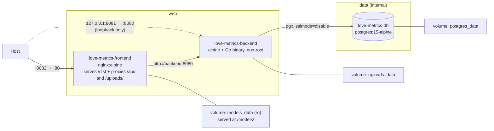

# 09 — Deployment & Containers

---

## 1. Compose topology

[`docker-compose.yml`](../docker-compose.yml) — three services, three named volumes, two
networks.



| Service | Container | Host → container | Networks | Image / build |
| :------ | :-------- | :--------------- | :------- | :------------ |
| `frontend` | `love-metrics-frontend` | **8082 → 80** | `web` | build `.` / [`Dockerfile`](../Dockerfile) |
| `backend` | `love-metrics-backend` | 127.0.0.1:8081 → 8080 | `web`, `data` | build `./backend` / [`backend/Dockerfile`](../backend/Dockerfile) |
| `postgres` | `love-metrics-db` | *none* — `expose: 5432` | `data` | `postgres:15-alpine` |

```bash
cp .env.example .env          # then fill in the two secrets; Compose refuses to start without them
docker compose up --build     # start; open http://localhost:8082
docker compose logs -f backend
docker compose down           # keeps the volumes
docker compose down -v        # drops the database
```

**The application URL is `http://localhost:8082`** (`FRONTEND_PORT` in `.env`), not `:3000`
as the root README says. It is also the *only* port published to the network: `:8081` is
still a direct line to the API for `curl`, but it is bound to `127.0.0.1`, so it is
reachable from the host and from nowhere else. Postgres is not published at all.

**The two networks are the trust boundary.** `frontend` is on `web`, `postgres` is on
`data`, and `backend` is the only member of both — so Nginx has no route to the database
and cannot acquire one. `data` is `internal: true`, which strips its gateway: the database
has no path off this host in either direction.

Service discovery is by Compose service name: Nginx proxies to `http://backend:8080` and
the backend connects to `DB_HOST=postgres`. Renaming a service in `docker-compose.yml`
requires updating `nginx.conf` and the `DB_HOST` value too — and keeping the renamed
service on the right network.

### Per-container hardening

Segmentation decides who can *reach* what; this decides what a compromise *is* once it
happens.

| | `frontend` | `backend` | `postgres` |
| :- | :- | :- | :- |
| `no-new-privileges` | yes | yes | yes |
| `cap_drop: ALL` | yes | yes | yes |
| capabilities added back | `CHOWN`, `SETGID`, `SETUID`, `NET_BIND_SERVICE`, `DAC_OVERRIDE` | **none** | `CHOWN`, `DAC_OVERRIDE`, `FOWNER`, `FSETID`, `SETGID`, `SETUID` |
| runs as | root master, `nginx` workers | `app` (non-root) | root entrypoint, `postgres` server |
| `read_only` root fs | no | yes | no |

The backend is the interesting column: a static Go binary on an unprivileged port, running
as a non-root user, with **no capabilities at all** and a read-only root filesystem — its
only writable paths are the uploads volume and a 64 MB `tmpfs` at `/tmp`. It is also the
service most exposed to user input, since it is the one parsing uploads and JSON.

The other two keep the capabilities their entrypoints genuinely use: Nginx's master binds
:80 and forks workers under another uid, and the Postgres entrypoint starts as root to fix
up the data directory before `su-exec`ing to `postgres`. Both are left writable because
their entrypoints write outside the volume — Nginx's `docker-entrypoint.d` scripts edit
`/etc/nginx/conf.d`, which a read-only root filesystem would break. `read_only: true` plus
`tmpfs` mounts for `/var/cache/nginx` and `/var/run` is a reasonable next step, but it is
one to make with a container to test it against.

`no-new-privileges` is the cheap one worth understanding: it makes `execve` unable to grant
privileges, so a setuid binary inside any of these images cannot be used to climb back up
after the capability drop.

---

## 2. Frontend image

[`Dockerfile`](../Dockerfile) — two stages, node build → nginx serve:

```dockerfile
FROM node:22-alpine as build
WORKDIR /app
COPY package.json package-lock.json ./
RUN npm install
COPY . .
RUN npm run build

FROM nginx:alpine
COPY --from=build /app/dist /usr/share/nginx/html
COPY nginx.conf /etc/nginx/conf.d/default.conf
EXPOSE 80
CMD ["nginx", "-g", "daemon off;"]
```

The final image contains only static assets and Nginx — no Node runtime.

Two build-hygiene issues:

- **`npm install`, not `npm ci`.** The lockfile is copied but not honoured, so the image can
  resolve versions the repository never tested. Switch to `npm ci` for reproducibility.
- **No `.dockerignore` exists**, so `COPY . .` ships the host's `node_modules`,
  `playwright-report/`, `test-results/`, `.git/`, and `backend/` (including
  `alexithymia.db`) into the build context. This slows builds significantly and copies a
  committed dev database into the layer. A three-line `.dockerignore` fixes it:

  ```
  node_modules
  dist
  .git
  playwright-report
  test-results
  backend
  ```

  (Build output is unaffected — only `/app/dist` is copied into the final stage — but
  context transfer and layer size are.)

### Nginx configuration

[`nginx.conf`](../nginx.conf):

```nginx
limit_req_zone $binary_remote_addr zone=auth:10m rate=20r/m;   # http context

server_tokens off;
client_max_body_size 8m;

resolver 127.0.0.11 ipv6=off valid=10s;
set $upstream http://backend:8080;

location / {
    root   /usr/share/nginx/html;
    try_files $uri $uri/ /index.html;   # SPA fallback: /profile deep-links work
}

location ~ ^/api/(login|signup)$ {      # regex wins over the /api/ prefix below
    limit_req zone=auth burst=10 nodelay;
    proxy_pass $upstream$request_uri;
}

location /api/     { proxy_pass $upstream$request_uri; }
location /uploads/ { proxy_pass $upstream$request_uri; }   # + a sandbox CSP, + CORP
location /models/  { alias /srv/models/; try_files $uri =404; }   # the models_data volume
```

`try_files … /index.html` is what makes a refresh on `/profile` work instead of 404ing —
the README's troubleshooting entry points here.

Three things in there are less obvious than they look:

**The upstream goes through a variable.** `proxy_pass http://backend:8080` resolves the
name once, when the config loads, and caches that address for the process's lifetime — so
recreating the backend container, which gives it a new IP, leaves Nginx proxying into the
void and every `/api` call 502s until Nginx is restarted too. A variable forces per-request
resolution against Docker's DNS at `127.0.0.11`. `$request_uri` then supplies the path and
query string that the literal form passed implicitly.

**`/uploads/` is proxied but sandboxed.** It has to be proxied — without the block, avatar
requests fell through to `try_files` and returned HTTP 200 of `index.html`, so the ``
broke with no error status to diagnose. But those files are user-supplied and validated
only against the client's own `Content-Type` header, so the location also sends
`Content-Security-Policy: default-src 'none'; … sandbox`. An HTML file smuggled in as an
image is then inert if anyone navigates to it, while real images still render — CSP on a
subresource response does not restrict the image itself.

**The rate limit is on the two endpoints that gate accounts.** bcrypt at cost 14 makes each
guess expensive for the *server* too (about a second of CPU), so the limit is as much about
denial of service as it is about brute force.

Still absent: gzip/brotli, cache headers for hashed assets, HTTP/2, and TLS.

### Cross-origin isolation, and why `/uploads/` needed a header for it

Phase 6 runs a transcriber on the user's own device, in WebAssembly. Four header changes make
that possible, and one of them has a blast radius wider than the feature:

| Header | Was | Is | Why |
| :----- | :-- | :- | :-- |
| `Permissions-Policy` | `microphone=()` | `microphone=(self)` | A policy denial rejects `getUserMedia` before the browser asks anyone, so the voice check-in could not even show its consent prompt. `(self)` restores the default; the user's answer still decides. `geolocation` and `camera` stay denied. |
| CSP `script-src` | `'self'` | `'self' 'wasm-unsafe-eval'` | A bare `script-src 'self'` blocks WebAssembly compilation outright. `'wasm-unsafe-eval'` permits WASM **without** re-enabling `eval()` or `new Function()`. |
| CSP `worker-src` | *(inherited)* | `'self'` | Already resolved to `'self'` through the `default-src` fallback; stated because the transcriber runs in a Worker and that should not have to be derived. |
| `Cross-Origin-Opener-Policy` / `Cross-Origin-Embedder-Policy` | *(absent)* | `same-origin` / `require-corp` | Together they make the document *cross-origin isolated*, which is the only way a browser hands out `SharedArrayBuffer` — i.e. the only way a WASM build uses more than one core. |

`connect-src` is unchanged and must stay that way: model weights come from this origin, never
from a public model hub, and the Vault page tells the user exactly that.

**`.mjs` needs a MIME type, and nginx does not ship one.** Checked against nginx 1.31.4 on
2026-08-31: `.mjs` is absent from the bundled `mime.types`, so it is served as
`application/octet-stream` — and a module script with that type is **refused** by strict MIME
checking (*"Expected a JavaScript-or-Wasm module script…"*). ONNX Runtime's WebAssembly
loader is a `.mjs`, so without the `types { text/javascript mjs; }` block now at the top of
[`nginx.conf`](../nginx.conf) the Light-tier transcriber cannot start at all, and the error it
reports is the thoroughly unhelpful *"no available backend found"*. `.wasm` needs no such
line — nginx has mapped it to `application/wasm` since 1.21. **A browser that already cached
the pre-fix response keeps the wrong type**, because `/assets/` is served immutable; a hard
reload or a cleared cache is needed once after deploying this fix.

**COEP is the one to understand.** `require-corp` means every *cross-origin* subresource the
page loads must carry a `Cross-Origin-Resource-Policy` header of its own, or the browser
blocks it — with no HTTP error to read, because the response arrives and is then discarded.
Avatars under `/uploads/` are cross-origin whenever the SPA and the API are on different
hostnames, so that location now sends:

```nginx
add_header Cross-Origin-Resource-Policy "cross-origin" always;
```

`cross-origin` rather than `same-site`, because `same-site` would still block the Android
WebView, whose document is served from `https://localhost` by Capacitor and shares no
registrable domain with the server. It grants nothing new either: with no CORP header at all —
which is what this location sent before — any origin could already embed these images. The
containment for the real risk here (files validated only by the client's declared MIME type)
is the `sandbox` CSP, and that is unchanged.

Two things measured on 2026-08-25 that are easy to get wrong later:

- **A same-origin deployment does not exercise CORP at all.** On the web `getServerUrl()`
  returns `''`, so avatars resolve as same-origin relative paths and COEP never applies to
  them. Verifying "avatars still load" on a stock Compose stack therefore proves nothing about
  CORP. It was verified separately, against a second cross-origin-isolated document with no
  CSP of its own: `/uploads/` (CORP present) loaded, and `/vite.svg` from the same origin
  (no CORP) was blocked with
  `net::ERR_BLOCKED_BY_RESPONSE.NotSameOriginAfterDefaultedToSameOriginByCoep`. The only
  difference between those two responses is the header.
- **The app's own CSP blocks cross-origin subresources before COEP is consulted.** `img-src`
  lists `'self'` plus the two production hostnames over https and nothing else, which is what
  keeps COEP's blast radius small: there is almost nothing cross-origin for it to break.

---

## 3. Backend image

[`backend/Dockerfile`](../backend/Dockerfile):

```dockerfile
FROM golang:1.24.1-alpine AS builder
WORKDIR /app
RUN apk add --no-cache git
COPY go.mod go.sum ./
RUN go mod download
COPY . .
RUN CGO_ENABLED=0 GOOS=linux go build -o main ./cmd/server

FROM alpine:latest
RUN addgroup -S app && adduser -S -D -H -G app app
WORKDIR /app
COPY --from=builder --chown=app:app /app/main /app/migrate ./
RUN install -d -o app -g app /app/uploads
USER app
EXPOSE 8080
CMD ["./main"]
```

- `go.mod`/`go.sum` are copied before the source, so the dependency layer caches properly.
- **`CGO_ENABLED=0`** yields a static binary — and it works only because the SQLite driver
  is `glebarez/sqlite` (pure Go, via `modernc.org/sqlite`). Swapping to
  `gorm.io/driver/sqlite` (which wraps `mattn/go-sqlite3`) would require CGO and break this
  build.
- Runs as **non-root** in `/app`, so `./uploads` resolves to `/app/uploads`. It was
  `WORKDIR /root/` and uid 0 until the container hardening pass; the process binds an
  unprivileged port and writes one directory, so root bought nothing.
- `uploads/` is created **in the image**, not by the server at runtime, so the named volume
  Compose mounts there inherits `app`'s ownership — Docker seeds a fresh volume from the
  image directory's contents *and* its owner and mode. Against a path that does not exist,
  the volume would be created root-owned and the first upload would fail with `EACCES`.
- `alpine:latest` (not pinned) provides a shell for debugging; `scratch` or `distroless`
  would be smaller and safer since the binary is static. The mutable tag is still a
  reproducibility hole — it errs toward *patched*, which is why it has not been changed.

### The model channel: `/models/` and `make models-fetch`

On-device inference needs weights, and weights are large: the Light-tier transcriber is 41 MB
and the Full-tier model is around 2.6 GB. They are **not** baked into the frontend image —
an image layer carrying either would have to be rebuilt and re-pushed on every frontend
change — and they are **not** fetched by the app from a public model hub, because
`connect-src 'self'` and the Vault page both say every request goes to this app's own origin.

Instead they live in a named volume, `models_data` (`love-metrics-models`), mounted **read-only**
into the frontend container at `/srv/models` and served by Nginx at `/models/`. Nginx is the
only reader; nothing in the stack can write there.

**An empty volume is the normal state of a fresh deployment.** `/models/` simply 404s until
the operator opts a model in. Nothing else in the app is affected.

#### The operator step

```bash
make models-fetch
```

That is the whole thing. It creates the volume if needed, downloads every file of the selected
model sets into it, and verifies each one against a SHA-256 pinned in the
[`Makefile`](../Makefile). It is idempotent: a file already present and correct is left alone,
so re-running it is also the integrity check.

To opt into more than the default:

```bash
make models-fetch MODELS="whisper-tiny gemma-4-e2b-onnx gemma-4-e2b-litertlm"
```

The default is `whisper-tiny` — **45,245,009 bytes over 13 files**, the Light-tier floor.
Larger sets are opt-in by name, and a name the manifest does not describe is refused before
anything downloads.

| Set | What it is for | Size |
| :-- | :------------- | :--- |
| `whisper-tiny` (default) | The Light tier's transcriber, on both platforms | **45,245,009 B**, 13 files |
| `gemma-4-e2b-onnx` | The proposal model **in a browser**, through transformers.js | **3,401,460,010 B**, 16 files |
| `gemma-4-e2b-litertlm` | The proposal model **on Android**, as one LiteRT-LM bundle | **2,588,159,070 B**, 2 files |

**Fetch only the sets your clients need.** The two Gemma sets are the same model in two
packagings, and an operator serving only phones has no use for the 3.4 GB of ONNX (nor a
browser-only deployment for the 2.6 GB bundle). Both together is 6 GB, and it is the right
answer only where both kinds of client exist. All three numbers above are what `make
models-fetch` reported on 2026-09-02, not estimates.

**A browser without a WebGPU adapter never asks for the Gemma files at all**, and neither does
a phone below 6 GB or without a 64-bit ABI — those devices are on the Light tier, which needs
`whisper-tiny` and, for its proposals, the 3.1 GB text-only subset of `gemma-4-e2b-onnx`
(the same rows; a Light-tier browser fetches twelve of the sixteen).

**The browser verifies the same sums again.** `src/journal/inference/models.js` carries a
second copy of the manifest and re-hashes every file it is served before caching it, and a
unit test reads this Makefile to keep the two identical. That is not belt-and-braces for its
own sake: it is what catches a truncated volume, a half-written file, and a proxy that
answered with a page of HTML — none of which a check at only one end would see.

| | |
| :-- | :-- |
| Where the pins live | `MODEL_MANIFEST` in the Makefile: one `set\|path\|url\|sha256` row per file |
| Where the logic lives | [`scripts/models-fetch.sh`](../scripts/models-fetch.sh) |
| How it runs | a one-off `alpine:3.20` container with the volume mounted — so it works before the stack has ever been up, and needs no `curl` or `sha256sum` on the host |
| Licences | fetched and pinned like any other row, and placed **beside** the weights. Whisper tiny is an ONNX export of `openai/whisper-tiny` and is **Apache 2.0**, so `LICENSE.txt` lands next to it. EmbeddingGemma, when a later session adds it, is under the Gemma Terms of Use, which must accompany redistribution. |

#### What a mismatch does

It **fails, and does not repair itself.** A file already in the volume that does not match its
pin is either corruption or tampering, and silently re-downloading it would erase the evidence
of which. The run stops, names the file, prints expected and actual, and tells the operator how
to delete it and try again. Nothing is overwritten. A freshly downloaded file that fails its
pin has its partial deleted and the run stops the same way — with the pointed reminder that
either the pin is wrong or the URL is no longer serving what it served when it was pinned, and
that updating the pin without finding out which is not an option.

Verified on 2026-08-25 by flipping a single byte in the 10 MB encoder file — same length,
different hash — and confirming the next run refused it, exited non-zero, and left it in place.

> ⚠️ Running `make models-fetch` **before** the first `make up` makes Compose print
> `volume "love-metrics-models" already exists but was not created by Docker Compose` on every
> subsequent `up`. It is a warning and nothing more: the volume is used, mounted and served
> correctly either way. Running `make up` first avoids it, because Compose then creates the
> volume with its own labels.

### Uploaded files survive container recreation

`/app/uploads` is a named volume (`uploads_data`). It used to be the container's writable
layer, so `down`/`up`, a rebuild, or any recreation discarded every avatar while
`users.profile_picture` kept pointing at the vanished file.

It is also what makes `read_only: true` possible on this service: with the root filesystem
mounted read-only, the volume and a 64 MB `tmpfs` at `/tmp` (for Gin's multipart spill) are
the only writable paths in the container.

⚠️ **If you are upgrading an existing deployment, the avatars currently in the container
are not in a volume yet.** Copy them out before the first `up` that recreates the backend:

```bash
docker cp love-metrics-backend:/root/uploads ./uploads-backup
# after the stack is up again:
docker cp ./uploads-backup/. love-metrics-backend:/app/uploads
```

---

## 4. Database service

```yaml
postgres:
  image: postgres:15-alpine
  environment:
    - POSTGRES_USER=${POSTGRES_USER:?...}
    - POSTGRES_PASSWORD=${POSTGRES_PASSWORD:?...}
    - POSTGRES_DB=${POSTGRES_DB:?...}
  expose: ["5432"]
  networks: [data]
  volumes: [postgres_data:/var/lib/postgresql/data]
```

Data survives `down`/`up` via `postgres_data`. Schema creation is handled entirely by the
backend's `AutoMigrate` on boot — there are no init scripts. Since Phase 4 the same boot also
runs an idempotent data backfill; [§5](#5-the-phase-4-relationship-migration) covers what to
back up first and what the log should say.

**Nothing on the host can reach Postgres.** `expose` publishes to the Compose network and
not to the host, and the `data` network is `internal`, so the only process that can open a
socket to 5432 is a container attached to that network — which is `backend`, alone. The
`psql` targets in the Makefile work by `docker compose exec`, i.e. from inside the
container, so none of them needed the old `5432:5432` mapping either.

Credentials come from a git-ignored `.env` ([§6](#6-configuration-and-secrets)).

**Rotating the password is two steps, not one.** `POSTGRES_*` is read by `initdb`, which
runs exactly once, against an empty data directory. Editing `.env` therefore changes what
the backend *presents* and not what Postgres *expects*, and the symptom is a backend that
cannot connect to a database that is running fine. `make db-password` applies the value in
`.env` to the live database (over the container's unix socket, so it needs no old
password); restart the backend afterwards.

### Postgres readiness gate

`depends_on: [postgres]` on its own only orders *container start*, not readiness, while
`database.Connect()` calls `log.Fatalf` on failure with no retry
([`database.go:36-38`](../backend/internal/database/database.go#L36-L38)) — so a cold start
used to race, and the backend frequently exited before Postgres accepted connections. That
was the README's *"Connection Refused to Database → restart the backend container"*
symptom.

Closed: `postgres` now declares a `pg_isready` healthcheck and `backend` waits on
`condition: service_healthy`. The README's claim that "the backend waits for Postgres" is
finally true, though by Compose's doing rather than the backend's — a connect-retry loop in
`Open()` would still be worth having, since a database that restarts *later* is not covered
by a start-time gate.

Two proper fixes, either sufficient:

```yaml
# A — gate on health at the Compose level
postgres:
  healthcheck:
    test: ["CMD-SHELL", "pg_isready -U postgres -d alexithymia"]
    interval: 5s
    timeout: 5s
    retries: 10
backend:
  depends_on:
    postgres: { condition: service_healthy }
  restart: on-failure
```

```go
// B — retry with backoff in Connect(), so the service is resilient outside Compose too
for i := 0; i < 10; i++ {
    DB, err = gorm.Open(postgres.Open(dsn), &gorm.Config{})
    if err == nil { break }
    log.Printf("postgres not ready (attempt %d/10): %v", i+1, err)
    time.Sleep(2 * time.Second)
}
```

B is preferable — it also helps Kubernetes, systemd, and bare-metal deployments. Adding
`restart: on-failure` to the backend is a reasonable stopgap either way.

---

## 5. The Phase 4 relationship migration

> ⚠️ **Back up the database before the first boot on this version.** This is the only
> structural migration in the project's history, and it does two things at once.

**Why a backup is not optional here.** The new `analysis_subjects.relationship_id` column
carries a foreign key, and GORM's SQLite migrator cannot express that as a plain
`ALTER TABLE ADD COLUMN` — it **recreates the table**: create `analysis_subjects__temp`,
copy every row across by column name, drop the original, rename. On Postgres it is an
ordinary `ALTER TABLE`. Either way, a startup backfill then rewrites `relationship_id` (and
normalizes `name`) on every existing row.

Take the backup:

```bash
# SQLite (no DB_HOST): the whole database is one file
cp backend/alexithymia.db backend/alexithymia.db.pre-phase-4

# Postgres under Compose
docker-compose exec -T postgres pg_dump -U postgres alexithymia > alexithymia.pre-phase-4.sql
```

**What a successful boot looks like.** `Connect()` migrates, then runs
`BackfillRelationships` and logs one line:

```
2026/07/26 03:47:38 Running migrations...
2026/07/26 03:47:38 Database migrated
2026/07/26 03:47:38 backfill: 3 relationships, 5 snapshots linked
```

Reboot and the same line reads `backfill: 0 relationships, 0 snapshots linked` — the pass is
idempotent, filtering on `relationship_id IS NULL`, which is what makes running it on every
boot safe. **If the counts are non-zero on a second boot, something is wrong** — stop and
investigate rather than restarting again.

**Verified against a real database**, not only in tests: a pre-Phase-1 SQLite file (no
`tags`, `uncertain`, or `guide_answers` columns at all) carrying 5 snapshots across 3 users
migrated to 3 relationships / 5 snapshots, reported `0, 0` on reboot, and served the full
API afterwards.

**Rolling back** is restoring the backup. There is no down-migration, but the phase is
deliberately cheap to reverse: `AnalysisSubject.Name` is still populated on every row, so an
older binary reads the migrated database correctly and simply ignores the extra column and
table.

**Count parity is the check that matters.** After the first boot, the number of stacks on
the dashboard and the number of cards in each must be exactly what they were before. The
backfill reproduces the browser's old grouping rule — one relationship per
`(user_id, TRIM(name))` — so any difference means the rule diverged, not that data was lost.

---

## 6. Configuration and secrets

`DB_PASSWORD=password` and `JWT_SECRET=supersecretkey` used to be inline in
`docker-compose.yml` and therefore committed. They now come from a git-ignored `.env`:

```yaml
backend:
  environment:
    - DB_PASSWORD=${POSTGRES_PASSWORD:?set POSTGRES_PASSWORD in .env}
    - "JWT_SECRET=${JWT_SECRET:?set JWT_SECRET in .env, generate with: openssl rand -hex 32}"
```

`:?` is the part that matters: an unset or empty variable stops Compose *before a container
is created* and names the variable it wanted, instead of starting the stack with a
placeholder. [`.env.example`](../.env.example) is the committed template and lists how to
generate each value; [`.gitignore`](../.gitignore) ignores `.env` and `.env.*` while
un-ignoring the example.

This is **interpolation, not `env_file:`** — deliberately. `env_file:` injects every
variable in the file into the service, which would hand `JWT_SECRET` to Postgres and the
database password to anything else that grew an `env_file:` line later. Naming each
variable under each service keeps a secret visible only to the containers that need it: the
database password to `backend` and `postgres`, the JWT key to `backend` alone.

Note that `docker compose config` prints the resolved values in clear — it is a debugging
command, not something to paste into an issue.

**Since Phase 5 an absent `JWT_SECRET` is fatal at startup**: `main()` calls
`auth.LoadSecret()` before anything else and exits with an explanatory message. That closes
the old failure mode where an unset variable produced an empty signing key and the
application ran normally while every token was forgeable. With `${JWT_SECRET:?}` the same
mistake is now caught one layer earlier still. A bare `go run ./cmd/server` needs the
variable in the shell ([Development §2](07-development.md#2-fastest-path--no-containers-no-database)).

**Rotating `JWT_SECRET` logs everyone out** — every issued token fails verification against
the new key. Rotating `POSTGRES_PASSWORD` needs `make db-password` as well as the `.env`
edit ([§4](#4-database-service)).

### What is still missing: TLS

The container Nginx speaks HTTP internally on `127.0.0.1:${FRONTEND_PORT:-8082}`. In production on the Linux server, the host Nginx reverse-proxy terminates TLS (via Let's Encrypt / Certbot) for:
- `alexithymialovequantifier.voglerprojekte.com` (WebApp)
- `api.alexithymialovequantifier.voglerprojekte.com` (API Subdomain)

and forwards traffic to `127.0.0.1:8082`. This provides complete end-to-end TLS encryption and CORS security. See `Setup Guide.md` for the full host Nginx site configuration.

---

## 7. CI

Three workflows. Only one of them runs without being asked.

| Workflow | Trigger | What it does |
| :------- | :------ | :----------- |
| [`playwright.yml`](../.github/workflows/playwright.yml) | push/PR to `main`/`master` | Runs Playwright and uploads the HTML report. **It cannot pass** — neither server is started there; see [Testing §3.2](08-testing.md#32-why-it-currently-fails). |
| [`android-release.yml`](../.github/workflows/android-release.yml) | tag `v*`, or manual | Builds the APK and attaches it to a GitHub Release. |
| [`deploy.yml`](../.github/workflows/deploy.yml) | manual only | Deploys to the production host over SSH. |

### The Android release

`android-release.yml` runs the frontend suite and a `vite build` first, then builds the APK
through [`Dockerfile.android`](../Dockerfile.android) — the same file `make build-android`
uses, with the same two build arguments. That is on purpose: `android/` is regenerated from
the Capacitor template inside the image on every run, so the artefact depends on
`package-lock.json` and the Dockerfile rather than on any machine's local state, and a CI
build that took a different path would give that up. If the Makefile's `build-android` recipe
grows a third build argument, the workflow needs it too.

Since Phase 6 (C4) the APK carries the journal's native plugin, a `file:` dependency at
`plugins/alq-journal/`. `Dockerfile.android` copies `plugins/` **before** `npm ci` in both
stages, because a lockfile naming a path the build context does not yet hold fails the install
with an unhelpful `ENOENT`; a workflow that ever stops using the Dockerfile would need the same
order. The plugin's ONNX Runtime dependency adds roughly 15 MB of native libraries to the APK,
and the 27 MB of ONNX Runtime WebAssembly in `dist/` (C3) is bundled into the APK too without
ever running there — a recorded follow-up, not a deliberate choice.

`VITE_ANDROID_API_URL` defaults to `https://api.alexithymialovequantifier.voglerprojekte.com`
in three places that must agree: `ANDROID_API_URL` in the [Makefile](../Makefile),
`DEFAULT_NATIVE_URL` in [`src/mobile/serverUrl.js`](../src/mobile/serverUrl.js), and the
workflow's `api_url` input. It is only a default — the in-app Server settings screen writes
`localStorage` and wins, which is what makes one APK usable by anyone self-hosting.

The APK is **debug-signed**, which installs from a browser download and cannot be uploaded to
the Play Store. A release keystore is deliberately not in the repository or in an Actions
secret; `make bundle-android KEYSTORE=...` is the path when someone decides otherwise.

Tagging is the normal route:

```bash
git tag v1.0.0 && git push origin v1.0.0
```

A manual run with `release_tag` empty attaches the APK to the workflow run instead of
publishing anything, which is how to test a build.

### The deployment

`deploy.yml` automates [`Setup Guide.md`](../Setup%20Guide.md) §4 and **nothing else**. It
does not provision the host: Docker, the host Nginx site, the Certbot certificates and `.env`
are set up once by hand. `.env` can never come from CI — it is git-ignored precisely so the
database password and the JWT signing key live only on the host ([§6](#6-configuration-and-secrets)).

On the host it updates the checkout, takes a database dump, runs `make up` — database first,
schema second, app third, so a failed migration stops the deploy instead of leaving a server
answering 500s — and then probes the stack twice: once on `127.0.0.1:8082` and once over TLS
from the runner. Two checks rather than one because they fail differently: the first says the
stack is broken, the second says the host Nginx, DNS or the certificate is.

There is no `/healthz` yet ([§8](#8-production-readiness-checklist)), so the API probe asks an
unauthenticated `GET /api/me` and expects **401** — the backend answering correctly. A `502`
is Nginx unable to reach it.

It **refuses to run against a dirty checkout** on the server unless `force_dirty` is set. A
file edited by hand on the host is usually a fix made in a hurry, and discarding it silently is
how it gets lost and rediscovered.

Manual dispatch only, deliberately: the default branch is not a green-gated branch — the
Playwright workflow that runs on it cannot pass — so deploying on push to `main` would be
deploying on an unchecked signal.

#### What it needs configured

Repository **secrets**:

| Name | What it is |
| :--- | :--------- |
| `DEPLOY_SSH_KEY` | Private half of a key whose public half is in the deploy user's `~/.ssh/authorized_keys`. Generate a dedicated one: `ssh-keygen -t ed25519 -C github-actions-deploy -f deploy_key -N ''` |
| `DEPLOY_HOST_KEY` | The server's host key, so the runner pins it rather than trusting whatever answers on port 22: `ssh-keyscan -t ed25519 85.215.233.90` |

Repository **variables** (optional; the defaults are in the workflow):

| Name | Default | Verified on the host, 2026-08-29 |
| :--- | :------ | :------------------------------- |
| `DEPLOY_HOST` | `85.215.233.90` | Ubuntu 26.04, `ufw` allowing OpenSSH and Nginx Full |
| `DEPLOY_USER` | `root` | There is no separate deploy user; the host is administered as root |
| `DEPLOY_PATH` | `/root/projects/AlexithymiaLoveQuantifier` | **Not** the `/opt` that `Setup Guide.md` §4.1 suggests |

The login needs Docker, `make`, `git` and `curl`, and its `git` needs to be able to reach
GitHub — the checkout's `origin` is an SSH remote, so the host has its own key for that,
separate from the one CI logs in with. All of that was verified present on 2026-08-29:
Docker 29.1.3, Compose 2.40.3, GNU Make 4.4.1, git 2.53.0, and `git ls-remote origin`
answering.

Also verified, because the workflow's health checks assume them: the host Nginx serves both
hostnames from a single TLS server block with a 301 from port 80, the Let's Encrypt
certificate covers both names, `GET /` answers **200** and an unauthenticated `GET /api/me`
answers **401** — on the loopback port and over TLS alike.

**This host runs other projects.** There is a second app on `127.0.0.1:8083` behind the same
Nginx. That is why the deploy's `docker image prune` carries an `until=168h` filter rather
than collecting every dangling image on the box.

The workflow declares the `production` environment, so required reviewers can be attached to it
in the repository settings if a deploy should ever need approval.

A branch deploys as a branch — `git checkout -B` — so a plain `git pull` on the server still
works for whoever administers it by hand. A tag or a raw SHA detaches, having no branch to be on.

---

## 8. Production readiness checklist

Nothing here is required for personal self-hosting; all of it matters before exposing the
app to the internet.

**Blocking**
- [x] ~~Fail startup if `JWT_SECRET` is unset~~ — done in Phase 5.
- [x] ~~Move `JWT_SECRET` and `DB_PASSWORD` out of the repository~~ — `.env` + `${VAR:?}` interpolation ([§6](#6-configuration-and-secrets)).
- [x] ~~Mount a volume for `/root/uploads`~~ — `uploads_data:/app/uploads`. Object storage is still the answer if this ever runs on more than one host.
- [x] ~~Add the `/uploads/` proxy block to `nginx.conf`~~ — with a `sandbox` CSP over it, since the stored files are user-supplied and validated only by client-declared MIME.
- [x] ~~Add a Postgres readiness gate~~ — `pg_isready` healthcheck + `condition: service_healthy`. A connect retry in `Open()` is still worth having for mid-life restarts.
- [ ] Terminate TLS in front of Nginx; enable `sslmode=require` to Postgres. **The largest remaining hole** — see [§6](#what-is-still-missing-tls).
- [x] ~~Remove the published `5432:5432` mapping~~ — `expose` only, on an `internal` network ([§4](#4-database-service)).
- [ ] Remove `backend/alexithymia.db` from git history if it ever held real credentials.

**Strongly recommended**
- [ ] Validate uploads by content, not by client-declared MIME. *(Size is now capped at 8 MB by `client_max_body_size`, but the type check is still `file.Header.Get("Content-Type")`; the `sandbox` CSP on `/uploads/` contains the consequence rather than fixing the cause.)*
- [x] ~~Rate-limit `/api/login` and `/api/signup`~~ — `limit_req` zone `auth`, 20 r/m with a burst of 10, returning 429.
- [ ] Pin the JWT signing method (`jwt.WithValidMethods`).
- [x] ~~Run the backend as a non-root user~~ — plus `cap_drop: ALL`, `read_only`, and `no-new-privileges` on all three services. The runtime base image is still the mutable `alpine:latest`.
- [ ] `npm ci` in the frontend build.
- [x] ~~Add a `.dockerignore`~~ — and it now excludes `.env`, so a secret cannot reach an image layer.
- [ ] Add a `/healthz` endpoint for orchestrators and Playwright's `webServer.url`. *(Would also let `frontend` wait on `condition: service_healthy` instead of `service_started`.)*
- [x] ~~Security headers in Nginx~~ — CSP, `nosniff`, `X-Frame-Options`, `Referrer-Policy`, `Permissions-Policy`, `server_tokens off`. gzip is still off.
- [ ] Real migration files, since `AutoMigrate` cannot express destructive changes.
- [ ] Structured logging and an error tracker; today errors are `console.error` on the
      client and Gin's default logger on the server.
- [ ] Backups for `postgres_data` and the uploads volume. *(`make db-backup` covers the
      database; `uploads_data` has nothing.)*
- [ ] Give the backend a non-superuser Postgres role. It connects as the `postgres`
      superuser today; `AutoMigrate` needs DDL rights, but not `SUPERUSER`. Needs an initdb
      script, so it only takes effect on a fresh volume.
