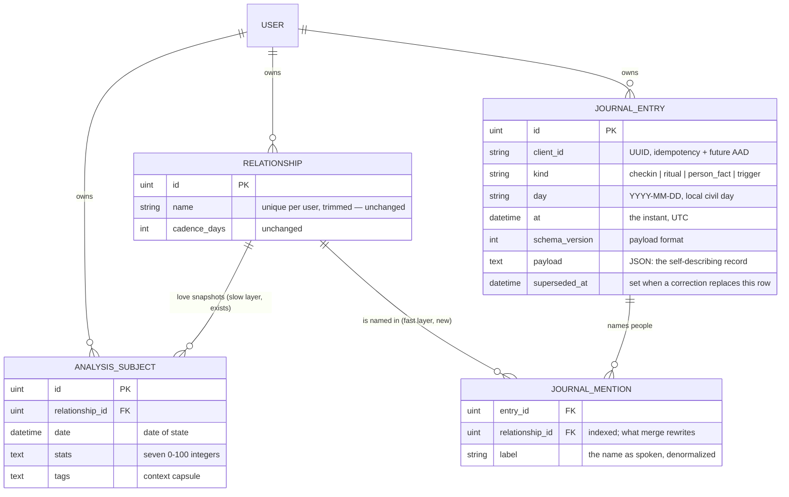
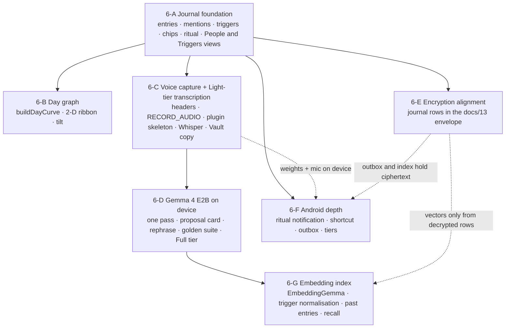

# Phase 6 — The Emotional Journal

**Status: 6-A and 6-B implemented; 6-C implemented in code, its device checks pending; 6-D in
progress — D1 (the proposal contract), D2 (the proposal card) and D3 (the real runtimes) shipped
2026-09-02, with the model measured off-device and not yet run on a phone; D4 (the golden suite
and the model gate) shipped 2026-09-03 as an instrument with no model through it; 6-F's outbox
(§9.5) shipped 2026-09-04, and the rest of 6-F, 6-E and 6-G are planned.** As of
**2026-09-04**. Written against the code
on branch `app-improvements` as of 2026-08-21, and revised the same day after review: the
voice path is built on one audio-native on-device model (Gemma 4 E2B) rather than a
transcriber plus a text model, triggers are first-class records, and an on-device embedding
index is the phase's last slice (§5.5, §5.8, §6.3, §11).

**Slice 6-A shipped on 2026-08-22** — the two tables, the five endpoints, export/import v2,
`src/constants/journal.js` and every screen it names (the day view, the check-in composer, the
nightly ritual, People and Triggers), with the documentation sweep, the manual QA run and the
review pass that close it. It contains **no model and no microphone**, which is why the Vault
page's *"There are none, by design"* is still true of the code as written; that sentence
changes at 6-C, when the transcriber ships, and not before (§10.1).
**Slice 6-B shipped on 2026-08-23** — the day graph: `dayGraph.js`, the eight construction
rules of §8.2 as pure functions (session B1), and `DayGraph.jsx`, the hand-drawn SVG that
draws them (session B2), mounted in the day view. It costs **0 KB of chart library**: there is
no three.js, no react-three-fiber and no Recharts anywhere in it, and the flat ribbon is the
same drawing with the camera's tilt set to nothing. §12.4's question 6 is still open and still
U1's — it needs readers who are not the person who drew it.
**Slice 6-C is implemented as of 2026-09-02** — the edge headers and the `/models/` channel
(C1), the recorder and the inference seam (C2), Whisper tiny in the browser and the Vault copy
it changed (C3), and on Android a narrow native plugin that records, transcribes the same
pinned model through ONNX Runtime, fetches the weights from the configured server and reports
the device's memory (C4). What the slice has not had is a person: **no one has tapped the
microphone on either platform**, and the airplane-mode acceptance test is unrun. The C3 and C4
entries of the ledger carry the exact lists; the Vault page already describes the feature as
built, which is true of the code as written.
**D3 put a model behind it on 2026-09-02** — Gemma 4 E2B through LiteRT-LM on Android and
through transformers.js over WebGPU on the web, the Light tier as Whisper tiny followed by the
same model in text mode, the download, the tiers, the ritual in one breath, and the Vault's full
*"voice on"* copy in both tiers' wording. The audio path and the constrained decoding were both
exercised against the real bundle **off-device**, on an x86-64 JVM through the same LiteRT-LM
API and version the plugin uses, and the sixteen web files were fetched and verified from a
browser on the deployed stack. **Nothing has run on a phone, and the web model has not run at
all** — the browser available to this session exposes `navigator.gpu` and has no adapter behind
it. The D3 entry of the ledger carries the numbers and the list of what is still unrun.
**F1 shipped the outbox on 2026-09-04** — §9.5's one deliberate exception to *no offline
writes*: a check-in saved with no connectivity is kept on the device, marked *not yet synced* in
the day view, and posted on the next fetch that comes back, on `resume`, or on pull-to-refresh.
It is safe for exactly one reason, which is that the entry carries a client-minted `client_id`
and §7.2's `POST` answers a repeat with `200` and the row already stored. It queues journal
entries and nothing else, it does not edit or delete offline, and it is not a sync engine.
[`06-progress.md`](06-progress.md) is the record of exactly what has shipped, session by
session, and of what 6-A deliberately does not do.
The execution plan for building it is
[`06-implementation-prompts.md`](06-implementation-prompts.md) — twenty-eight sessions in
dependency order, one per commit — and [`06-progress.md`](06-progress.md) is its ledger, which
records what has actually shipped and beats both documents where they disagree.

Companion reading, in the order this document assumes it: [Concepts](../docs/01-concepts.md),
[Architecture §7](../docs/02-architecture.md#7-extension-seams),
[Data Model](../docs/03-data-model.md), [API Reference](../docs/04-api-reference.md),
[Agent Guide §2](../docs/10-agent-guide.md#2-hard-invariants),
[The Android App](../docs/12-android-app.md),
[Zero-Knowledge Encryption](../docs/13-zero-knowledge-encryption.md), and the
[roadmap README](README.md) whose invariants this phase has to answer to.

---

## Contents

1. [Summary and the bet](#1-summary-and-the-bet)
2. [How it relates to the existing model](#2-how-it-relates-to-the-existing-model)
3. [The nightly ritual](#3-the-nightly-ritual)
4. [The voice check-in](#4-the-voice-check-in)
5. [The model layer](#5-the-model-layer)
6. [Data model](#6-data-model)
7. [API surface](#7-api-surface)
8. [The day graph](#8-the-day-graph)
9. [UX and navigation](#9-ux-and-navigation)
10. [Trust, privacy, and the copy that must change](#10-trust-privacy-and-the-copy-that-must-change)
11. [Implementation phases](#11-implementation-phases)
12. [Risks, trade-offs, and open questions](#12-risks-trade-offs-and-open-questions)

---

## 1. Summary and the bet

### What this adds

Today the app records one thing: how the user's love for a specific person looks, as seven
self-scored numbers, on a date. That record is deliberately slow — a snapshot every few weeks
or months, because a love style drifts on that timescale.

The Emotional Journal adds the fast layer underneath it: **what the user felt across a day,
and what each feeling was attached to.** Two instruments feed it.

| Instrument | When | Effort | What it records |
| :--------- | :--- | :----- | :-------------- |
| **Check-in** | Any time, as often as wanted | A sentence, spoken or typed, or three taps | One moment: the feelings present, their strength, and what each was about — a person, a **trigger** the user has named before, a context tag, or something new in words |
| **Nightly ritual** | Once, before bed | Five to nine swipes, under a minute | The day's conditions — sleep, movement, daylight, company, meals — as yes/no facts, plus an optional one-word reading of the day |

Spoken check-ins are heard by one small on-device model — Gemma 4 E2B, which takes audio
natively — that writes the words down and **proposes** a structured reading: feelings, what
they were about, which person was mentioned. The user confirms, edits, or throws it away. The
model never writes. On a phone that cannot carry that model, a small transcriber writes the
words down and the same model proposes from the text, or the user tags the words with chips.
A confirmed check-in that names a person lands on that person's existing `Relationship`, so
the journal and the love snapshots share one register of people, one name-resolution rule,
and one rename/merge machinery; a confirmed check-in that names a *thing* — work, the move —
lands on a **trigger**, the journal's own user-grown vocabulary of causes.

The payoff is a **day graph**: one day's feelings drawn as a curve over time that splits into
a branch per feeling present and rejoins as each fades, positioned by the feeling's valence
and energy and coloured by its identity (§8).

### Why it belongs in this product and not in a generic mood tracker

A mood tracker asks *"how do you feel?"* and stores the answer. That is the one question this
application was built around not asking, because for its user the honest answer is often *"I
cannot tell"* ([Concepts §1](../docs/01-concepts.md#1-the-premise)). Three things make this
feature an extension of the thesis rather than a departure from it:

1. **It records reasons, not just readings.** The existing context capsule exists because
   numbers without context decay ([Concepts §3](../docs/01-concepts.md#context-capsule-description--tags)).
   A check-in is a context capsule at the resolution of hours instead of months: *connected,
   about Lucie; stressed, about work.* Six months later the Mania spike on the timeline sits
   above a week of journal days that say what was happening — the marker panel on the
   timeline gets a second source of "what else was going on", still never a causal claim.
2. **It turns feelings into a recognition task.** The voice path lets someone describe a
   day in their own words and see it come back as a short list of named feelings to accept
   or reject. That is the anchored-slider idea applied to momentary affect: *"which of these
   is true of me?"* is answerable where *"what am I feeling?"* is not. The closed vocabulary
   (§5.3) is the journal's anchors.
3. **It keeps the user the author.** Nothing the model says is stored until a human confirms
   it, and a confirmed check-in is a record of what the user *said*, in the user's words,
   plus the labels the user accepted — not a machine's opinion about their mood. Invariant 15
   survives intact; §4.4 shows it in the interface rather than asserting it.

The bet, stated so it can be lost: **that a person who finds feelings hard to name will
record more, and more honestly, if they can talk for ten seconds and then tick boxes, than if
they have to pick a face from a grid — and that the day graph makes those records worth
keeping.** The user test in §12.4 is how to find out before the expensive parts are built.

### What it is deliberately not

- Not a mood score. Nothing is averaged into "how good was your day" — the ritual's last card
  is a word the user picks, not a number the app computes.
- Not a clinician. No screening, no trend is ever called "concerning", and the vocabulary the
  model may use is a closed list the app owns (§5.3), tested against a forbidden-word list
  the way `nudgeSentence` already is.
- Not a reader of tone. The model is asked what was *said*, never how it sounded. Reading
  feelings from a voice is parked as a research question (§12.6), not designed — the
  evidence for it at this model size is poor, and it is the one place the machine would be
  naming a feeling the user did not say.
- Not cloud AI. The model runs on the device the user is holding. Where a device cannot run
  it, the feature degrades to a small transcriber, then to typing and chips — it does not
  phone anywhere (§5.6). The airplane-mode test in §11 is the acceptance criterion for that
  claim.
- Not a second gamified habit. The ritual is opt-in, a missed night records nothing and is
  never counted, and every string it shows is bound by invariant 2c.

---

## 2. How it relates to the existing model

### 2.1 One picture



The three domain records become five. The two new ones are *beside* the love snapshots, not inside them:
a check-in is not a version of anything, it has no `stats`, and it never appears in a stack.
What joins the layers is `Relationship`. Triggers — the journal's vocabulary of non-person
causes — are entries too (`kind: "trigger"`), referenced from check-ins by their client id
rather than by a table of their own (§6.3).

### 2.2 The people database **is** `Relationship`

The brief asks for "a personal database of people who matter in the user's life" and notes the
collision with the first-class `Relationship` entity. The decision is that there is **one
register of people and it is `relationships`** — not an extension table, not a lighter-weight
twin. The reasoning, against the invariants that constrain it:

| Invariant / machinery | Separate "people" register | `Relationship` as the register |
| :-------------------- | :------------------------- | :----------------------------- |
| **2a** — group by `relationship_id`, never by name | A second identity for the same human means the journal's "Lucie" and the stack's "Lucie" are two rows that only a name string connects. That is the pre-Phase-4 bug reintroduced one table over. | A mention carries `relationship_id`. Two people sharing a name are two rows, exactly as the dashboard already handles them. |
| **2b** — one name-resolution rule for every write path | A lighter register needs its own find-or-create, and two rules for "which person is this name?" is the stack-splitting failure 2b names. | `POST /api/journal/entries` resolves a spoken name through the same `database.FindOrCreateRelationship` the snapshot write path and the backfill use. |
| Rename | Two places to rename; drift between them. | Free — a mention points at the id; the denormalized `label` on the mention is the name as spoken that day, which is worth keeping (see below). |
| Merge | Must be taught about a second table anyway, or it strands mentions. | `MergeRelationship` gains one statement: `UPDATE journal_mentions SET relationship_id = target WHERE relationship_id = source`, inside the existing transaction. |
| Delete relationship | Orphans or cascades across two registers. | Mentions keep their `label`, so a check-in about a deleted person still reads as it did; the dialog's count gains "and n journal mentions". |
| The "emptied relationship survives" rule ([Data Model §6](../docs/03-data-model.md#an-emptied-relationship-survives)) | — | Works in the journal's favour: a person first met in the journal is a relationship with `snapshot_count: 0`. The dashboard grid will not draw them (it renders stacks from snapshots), but `GET /api/relationships` lists them, the journal's People view shows them, and the day they get a love snapshot the stack appears with its history of mentions already attached. |

Two consequences to design for rather than discover:

- **The dashboard stays snapshot-driven.** A person known only from the journal is not a
  stack. The journal's People list (§9.3) is where they live until a snapshot exists, and the
  "New Analysis" form's name field should offer journal-only people as suggestions so the
  first snapshot lands on the existing row instead of a near-duplicate.
- **Matching is exact on write, helpful on screen.** The rule is unchanged: a name resolves
  by exact comparison after trimming, case-sensitive. The *proposal card* may suggest
  candidates more generously — "Lucie" spoken when only "Lucie M" exists shows "Lucie M" as a
  tap-to-pick candidate and "new person: Lucie" beside it — but whatever the user picks is
  written either by id or by the exact confirmed string through find-or-create. The model
  never chooses; the fuzzy step is deterministic client code (§5.4); the write is 2b.

### 2.3 "Extend what is known about them" — and about everything else

What the journal knows about a person is, first, **derived**: the mentions that name them,
with the feelings and dates attached. That needs no new column — it is a filter over entries
by `relationship_id`, the same way a stack is a filter over snapshots.

The second kind of knowledge — *"Lucie moved to Lyon"*, *"started a new job in March"* — is a
fact stated in a check-in that the user wants kept. It is stored as a journal entry of
`kind: "person_fact"` pointing at the relationship (§6.3), proposed by the model from the
transcript and **confirmed like everything else**. It is deliberately not a column on
`relationships`: facts are append-only and dated, a column is neither, and
[docs/13 §0](../docs/13-zero-knowledge-encryption.md#0-what-is-actually-secret-here) already
names a relationship's `name` as the most sensitive field in the app for "naming a third
party who never consented" — free text *about* that third party belongs in the encrypted
payload with the transcript, not in a new plaintext column that the envelope scheme would then
have to chase.

The third kind is what a feeling was about when it was *not* a person: *work*, *the move*,
*money*. These are **triggers**, and they are first-class: a journal entry of
`kind: "trigger"` with a client id and a label, created the first time the user confirms a
new label on the card and offered back as a chip from then on (§4.5b, §6.3). Triggers are the
journal's own vocabulary — user-grown, append-only, renamed or merged by a correction entry —
and they exist so that a feeling's cause is an **id later analysis can group on** rather than
a string it has to guess at. §5.8 describes how an on-device embedding index keeps that
vocabulary from fragmenting into *work*, *my job* and *Arbeit*.

### 2.4 How check-ins, the ritual, and love snapshots coexist

| | Love snapshot (exists) | Check-in (new) | Ritual (new) |
| :- | :-------------------- | :------------- | :----------- |
| Unit of time | A date of state | An instant | A civil day |
| About | One person | Zero or more people and triggers | The day's conditions |
| Authored as | Seven numbers behind sliders | A sentence → labels the user accepts | Yes / no / skip per question |
| Cadence | Weeks to months, opt-in nudge | Whenever | Nightly, opt-in |
| Appears on | Dashboard stack, timeline, Love Shape | Journal day view, day graph, a person's or a trigger's entry list | Journal day view, as the day's footer |
| Touches the other layer | — | A mention attaches to a relationship | The closing "day in a word" is a check-in sample at ritual time |

Where they meet on screen: the timeline's milestone panel ([Frontend §4](../docs/06-frontend.md#4-analysistimelinejsx))
gains one line when journal days exist inside the window between two snapshots — *"14 journal
days in this period"* linking to the first of them — still describing what else was
happening, never what caused what.

---

## 3. The nightly ritual

### 3.1 What it is for

The ritual records the **conditions** a day happened under, so that a later reading of the
journal can put a feeling next to the things that most often move feelings. It asks nothing
about mood itself until its last, optional card; the point is that sleep, movement, daylight,
company and food are *observable* — which is exactly the premise of the whole product applied
to the day instead of to a relationship.

It has to be finishable half-asleep in under a minute, which sets the design: binary answers,
one swipe each, a fixed order, and a small number.

### 3.2 The question set

**Five core questions, always asked, in this order.** Each is there because the literature on
daily affect gives it real explanatory power over next-day or same-day mood and because it is
answerable without thinking. The wording is the actual proposed copy and is bound by the
forbidden-word discipline in §3.6.

| id | Card text | Why it is in the core set |
| :- | :-------- | :------------------------ |
| `slept_well` | *Slept well last night?* | Sleep quality is the strongest single day-level predictor of affect in experience-sampling studies; it is also the one a bedtime question answers about the *previous* night, which is the right night to ask about. |
| `moved_body` | *Moved your body today?* | Physical activity has a consistent same-day association with positive affect. "Moved" rather than "exercised" — a walk counts and the user should not have to decide whether it does. |
| `daylight` | *Spent time outside today?* | Daylight exposure tracks seasonal and weekly mood variation and is trivially observable. |
| `with_people` | *Spent time with someone today?* | Social contact is the other large same-day effect, and it is the question that connects the ritual to the rest of the app: a *yes* invites "who?" (§3.5). |
| `ate_regularly` | *Ate at regular times today?* | Hunger and irregular meals correlate with irritability and low energy; it is also the question people most reliably cannot answer about *yesterday* but can about today. |

**Optional questions, off by default, up to three.** Chosen in Journal settings; each one is
stored under its own permanent id so turning it on later never reinterprets old data.

| id | Card text | Note |
| :- | :-------- | :--- |
| `alcohol` | *Had alcohol today?* | Strong next-day effect; off by default because it is a question some users do not want a database to hold. |
| `caffeine_late` | *Caffeine after mid-afternoon?* | Sleep-mediated; cheap to answer. |
| `in_pain` | *Body hurting or unwell today?* | Pain and illness dominate affect when present; the wording avoids "sick" and "symptoms". |
| `worked_late` | *Work ran past its hours today?* | The common non-person trigger; it is also the one the Lucie example names. |
| `time_alone` | *Had time to yourself today?* | The counterpart of `with_people`; for many users it is the protective factor rather than contact. |
| `conflict` | *A disagreement with someone today?* | Maps directly onto the existing `conflict` context tag. |
| `cycle` | *Period today?* | Only ever visible if the user turns it on; never suggested by the app. |
| `water` | *Drank enough water?* | The brief's example. Included because it is cheap and commonly asked for, with the honest note that its evidence as a mood predictor is weak — the setting's description says so. |

**One closing card, optional, answered differently:** *And today, in a word?* — the feeling
vocabulary (§5.3) as a grid of chips, a single tap, with `unclear` as a first-class chip and
swipe-up to skip. The chip carries **the vocabulary's own label** — *can't tell*, the same
word the check-in composer puts on it — because a feeling with two labels on two screens is
exactly the drift §5.3 forbids. Declining is `skip`, and the two are different records. It is the only non-binary card and it comes last, so the
binary rhythm of the rest is never interrupted. Its answer is stored as a check-in sample at
the ritual's time (§6.3), which is what lets the day graph end on something the user said
rather than on a guess (§8.3).

### 3.3 Fixed, not adaptive; editable, not rotating

Three designs were considered for the set. The decision is **a fixed core with a
user-editable optional tail**.

| Design | Why not |
| :----- | :------ |
| Rotating (different five each night) | Comparability. A condition asked on alternate nights is half a dataset; and the ritual's value as a habit is its sameness — the user should be able to do it with their eyes closed, which a changing set forbids. |
| Adaptive (the app chooses questions by what has correlated with mood so far) | It would be the app deciding what matters to the user on the strength of hidden arithmetic — the thing the roadmap's first invariant rules out. It also makes every night's record depend on an unrecorded model state. |
| Fully user-composed (free-text questions) | Free text defeats the closed-id contract that makes the data analysable later, and it moves copy discipline from a tested constant into whatever the user typed at midnight. |

How many is too many: five core plus at most three optional plus the closing card is **nine
interactions** — eleven in the worst case, once a *yes* to "with someone" splices in the *Who?*
card and its Done. A user test (§12.4) has still to confirm what that costs a real thumb at
bedtime; what has been measured is the floor.

**Measured on 2026-08-22, the full worst-case deck at 360 × 800:** eleven interactions,
**17.2 s** wall clock from the first card to *Recorded.*, driving real pointer events at a
deliberate 1.5 s per interaction. The mechanism's own share is about **90 ms per card** — the
rest is the pace, which was chosen rather than observed. A minute allows **5.4 s per
interaction** on that deck, so there is roughly 3.5× headroom and **the optional tail does not
need to shrink.** The screen also confirmed the condition invariant 2g's exception rests on:
`scrollHeight === clientHeight` and `scrollWidth === clientWidth` throughout, so nothing under
the card wanted either axis. What this does *not* establish is how long a person takes to
*decide* — that is exactly the number §12.4 asks U1 for, and this figure is the floor to
compare it against.

### 3.4 The swipe interaction

One card at a time, full width, the question as a short sentence, the two answers written
under it so a swipe nobody is told about is not the only way in (the same rule as the card
stack's pager, [Frontend §3.4](../docs/06-frontend.md#34-cardstack--the-version-pile-and-the-axis-it-is-allowed-to-use)).

| Gesture | Meaning | Also reachable by |
| :------ | :------ | :---------------- |
| Swipe right | Yes | A **Yes** button under the card; `→` on a keyboard |
| Swipe left | No | A **No** button; `←` |
| Swipe up | Skip — *not answering this tonight* | A smaller **skip** link; `↑` |
| Tap the card | Nothing (it is not a button — a half-asleep tap must not record an answer) | — |

**Touch-axis ownership (invariant 2g).** The ritual screen is a full-viewport, non-scrolling
route. There is nothing under the card for a vertical drag to scroll, so the card may claim
both axes — `touch-action: none` on the card, and only on the card — under the rule that a
control may claim everything only when it is the thing the finger deliberately landed on. It
is the one screen in the app where that is true of the whole viewport, and the screen must
stay non-scrolling for it to remain true: if the ritual ever grows a scrollable region, the
card gives up the vertical axis and skip becomes a button only. The day view and the journal
list (§9) are ordinary scrolling pages and follow the card stack's contract: vertical belongs
to the page.

A small tilt follows the finger so the direction is legible before release; the commit
threshold is ~30 % of the card width, below which it springs back. Each commit gives one
selection haptic on Android through the existing `knobFeedback` channel — the same tick, not
a new sound — and none in discretion mode, for the reason the dial is silent there.

### 3.5 What a *yes* to "with someone" does

Nothing, by default. A second card — *Who?* — appears only if the setting *Ask who I was
with* is on. It shows the user's relationships as chips (initials under discretion), multiple
selection, and writes a mention on the ritual entry. It exists because it is the cheapest way
the journal has of learning which people a day contained without a voice note; it is off by
default because it is a list of names on a screen at bedtime.

### 3.6 Timing, trigger, and what a skip means

- **Time.** User-chosen, default 22:30, in Journal settings. On Android it is one local
  notification through `@capacitor/local-notifications`, scheduled by the same module shape
  as [`cadenceReminders.js`](../src/mobile/cadenceReminders.js) and bound by the same rules
  written at the top of that file: fixed copy, no badge, one pending notification replaced
  rather than stacked, nothing sent anywhere. Body: *"Tonight's questions are ready."* — no
  content, because a lock-screen notification is readable by anyone holding the phone.
- **On the web** there are no notifications. After the chosen hour, the dashboard shows one
  line in the cadence nudge's slot — *"Tonight's questions are ready."* — with *Start* and
  *Not tonight*. Once per session, like the cadence banner; `sessionStorage`, same helpers.
- **Skip ≠ no.** A skipped question is **absent** from `answers`, exactly as a skipped
  category is absent from `stats` (invariant 14). A *no* is `false`. Nothing reads absence as
  either value.
- **A missed night is nothing.** No row is written, nothing is counted, and the next
  morning shows no trace of it. There is no "you didn't answer yesterday", no streak, and the
  ritual can be started late — it records the day it is *about*, which is the calendar day
  before 04:00 local and the current day after (the boundary is a constant, `DAY_ROLLOVER_HOUR`,
  in `src/constants/journal.js`, and it is stored on the entry so it can change later).
- **Interaction with cadence (2c).** The cadence nudge and the ritual prompt never both show
  at once; if both are due, the ritual line wins after the ritual hour and the cadence banner
  waits for the next session. Two calm sentences stacked are a to-do list.

**Copy discipline.** Every string the ritual can show — the question cards, the prompt, the
empty states, the settings descriptions — lives in `src/constants/journal.js` and is run by a
unit test against the forbidden list, which this phase extends from `cadence.test.js`'s
(`overdue`, `missed`, `streak`, `should`, `behind`, `!`) to also include `healthy`,
`unhealthy`, `concerning`, `symptom`, `disorder`, `diagnos`, `fail`, `guilt`, `lazy`, `bad`,
`good job`. A new question cannot ship with a word on that list.

### 3.7 The ritual in one breath (Full tier)

Where the audio-native model is installed (§5.5), the ritual can also be answered by speaking
once: *"Slept okay, didn't move, was outside, saw Lucie, ate late."* The clip goes through the
same single pass as a check-in, with the ritual's question ids in the prompt and the ritual
payload as the output schema; the result is the same confirm card — one row per question,
each answer pre-selected but dashed until confirmed, questions not mentioned left absent. It
exists for nights when even swiping is too much, and it changes nothing about the record: a
ritual answered by voice carries `source: "voice"` and is otherwise identical to one answered
by swipes. The swipe cards remain the default, and the only path on the Light and text-only
tiers.

---

## 4. The voice check-in

### 4.1 The shape of it

```mermaid
sequenceDiagram
    participant U as User
    participant R as Recorder (device)
    participant M as On-device model (Gemma 4 E2B)
    participant P as Proposal card
    participant S as POST /api/journal/entries

    U->>R: tap the microphone, speak, tap again (or 2 s silence, or 30 s)
    R->>M: 16 kHz mono audio, in memory only, + closed vocabularies + the user's people and triggers
    M-->>P: one JSON: the transcript, feelings, what each was about, people, ambiguity
    Note over P: the transcript is editable; every chip is a toggle;<br/>every person and trigger is a picker; "This isn't it" reopens the text
    U->>P: confirm
    P->>S: the confirmed record (client_id, payload, mentions, trigger refs)
    S-->>P: echoed row, relationship and trigger ids resolved
    Note over R: audio discarded on confirm, discard, lock, or background
```

**One model, one pass.** Gemma 4 E2B takes audio natively (§5.5), so on the Full tier there is
no separate transcriber: the same pass that proposes the reading also writes the words down,
and the transcript is the first field of its output. On the **Light tier** — phones that
cannot carry the audio encoder — a small dedicated transcriber (Whisper tiny/base) writes the
words and the same model runs in **text mode** over them; the card and the record are
identical. On the **text-only tier** there is no model at all.

Three paths produce the same record, and the model is only on two of them:

| Path | Steps | Needs |
| :--- | :---- | :---- |
| **Chips** | Tap feelings, optionally a person, a trigger and a tag | Nothing — this is the base feature and ships first (§11, 6-A) |
| **Typed** | Type a sentence, then the proposal card (if the model is on) or chips | A keyboard; the model in text mode for proposals |
| **Voice** | Speak; the transcript and the proposal arrive together | Microphone permission and the on-device model (Full), or a transcriber plus the model in text mode (Light) |

The chips path is not a fallback; it is the definition of a check-in. Voice and the model are
accelerators layered on it, which is what lets the feature be useful on a machine that can run
neither (§5.6) and what keeps the default build's trust claims true until the user opts in
(§10).

### 4.2 Capture

- **Start/stop by tap**, not hold. Recording stops on a second tap, on 2 s of silence once
  something has been said (a level threshold from the meter — no model involved), or at
  **30 seconds**, which is the model's per-clip limit (§5.5) and is stated on the button. A
  check-in is a sentence; thirty seconds is the right length for one. If the user has more to
  say, *add more* records a second clip that goes through the same pass as a second turn and
  lands on the same card.
- **Visible state.** A level meter and a countdown while recording; the rest of the screen
  is dimmed so it cannot be mistaken for idle. No recording ever starts without a tap, and
  nothing listens for a wake word — that sentence goes on the Vault page (§10).
- **Noise.** The model's transcription degrades sharply in noisy rooms (§5.5). The meter
  marks a take as noisy when the floor is high, and the card then says so beside the
  transcript (*"This was a noisy take — check the words"*) rather than pretending the text is
  clean.
- **Web:** `MediaRecorder` over `getUserMedia`, decoded to 16 kHz mono `Float32Array` in an
  `OfflineAudioContext`. Requires the Nginx `Permissions-Policy` to change from
  `microphone=()` to `microphone=(self)` ([`nginx.conf:46`](../nginx.conf#L46)) — today the
  edge forbids it outright.
- **Android:** `RECORD_AUDIO` is a new manifest permission in `android-config/`, requested at
  the first tap of the microphone and never at launch, with the same reasoning the manifest
  already gives for `POST_NOTIFICATIONS`. Capture goes through the native plugin (§5.5) rather
  than the WebView's `getUserMedia`, so the audio never crosses the WebView bridge as a
  base64 string and reaches the model as a buffer. *Shipped in C4 (2026-09-02): the permission
  is CHANGE 5 in the manifest, the plugin is `plugins/alq-journal/`, C2's recorder drives it
  through injected `deps`, and what crosses the bridge is a clip **handle** —
  [docs/12 §6](../docs/12-android-app.md). One rule the design did not state and the phone
  forced: the permission prompt is an activity of its own, so it pauses the app, and a recorder
  waiting on the prompt is not discarded as "gone to the background".*
- **Audio is never persisted.** It lives in memory until the check-in is confirmed or
  discarded, the app locks, or the app goes to the background — whichever is first. There is
  no "keep the recording" option in this phase. The rationale is in §6.6; the short version is
  that a voice is a biometric and a transcript is not, and nothing in the product needs the
  audio after the transcript exists. "Listen again" before confirming is the one thing it is
  kept for.

### 4.3 The transcript

It is part of the record and the first thing on the card — a quote of what the user said,
editable in place, because a model mishears names most of all, and "Lucy"/"Lucie" is exactly
the kind of error that would create a second relationship if it reached find-or-create unseen.
Editing the transcript re-runs the proposal in text mode (the model accepts text as readily as
audio), so a corrected name flows through to resolution.

Language is detected by the model; a setting can pin it for users whose notes mix languages
the detector gets wrong. This matters more than it looks for this app's actual user base — see
§12.1.

### 4.4 The proposal card — where "the user authors every number" is made visible

The card is the feature's answer to invariant 15, and it has to show the rule rather than
state it. Its anatomy, top to bottom:

1. **The transcript**, as a quote, editable. The user's words stay the headline.
2. **Feelings** — one chip per proposed feeling, each **pre-selected but not yet saved**,
   rendered in the "proposed" style: dashed outline, the same visual the app already uses for
   a score the user does not trust (`≈`). Tapping a chip confirms it (solid), tapping again
   removes it. An **add** chip opens the full vocabulary. Each confirmed chip has a
   three-step strength (`·`, `··`, `···` — shown as dots, never numbers) defaulting to what
   the model proposed, and an *unsure* toggle that writes `uncertain: true`, mirroring the
   snapshot's `?` chip.

   **`unclear` is exclusive**, decided in A7 because the composer had to answer it and this
   section did not say. *Can't tell* beside *joy* is not a record of two things, it is a
   contradiction, and the record should not be able to hold one — so picking `unclear` puts
   every other word down and picking any other word puts `unclear` down. It is still a
   first-class answer that saves on its own, which is the whole reason it is in the
   vocabulary (§5.3); it is simply the only one that cannot share a check-in. The composer
   states the rule beside the cap rather than leaving the user to discover it by tapping.
3. **About** — under each feeling, what it is attached to: a person chip (resolved or to be
   resolved, §4.5), a **trigger** chip (a known one, or *new trigger: work?* when the model's
   label matches nothing the user has named before — §4.5b), or a context tag from
   `CONTEXT_TAGS`. A chip can be moved between feelings by tapping it and then the other
   feeling; removed with its ×.
4. **People** — each person the model heard, with the resolution state: *Lucie — matches
   your relationship "Lucie"* (solid), *Lucie — new person?* (dashed, with *pick existing…*),
   or *Lucie M?* when the only near match differs. Nothing here is created until confirm.
5. **Facts**, if the model proposed any (*"Lucie moved to Lyon"*), each an explicit opt-in
   chip that is **off by default** — the one place the default is not "accepted", because it
   writes free text about a third party (§2.3). **Not built in D2 (2026-09-02):** S0 decided
   that no UI writes a `person_fact` until the 6-E envelope lands (§12.5, the ledger's
   *Decisions*), and named this card. The card shows no fact chip; a proposal's `facts` are
   filtered by §5.4's validator and then dropped, so the record is clean for the day the
   decision is reversed.
6. **Two buttons and one link.** *Save* writes exactly what is solid on the card. *Discard*
   drops everything including the transcript. *This isn't it* — the rephrase path (§4.6).

Nothing with a dashed outline is ever written. The save payload is built from the card's
state, not from the model's output, and the model's original proposal travels alongside it
as provenance (`proposal` in §6.3) so that later analysis can ask how often the user changed
the machine's mind — which is the honest measure of whether the model is helping.

Under **discretion mode** the card blurs the transcript and the trigger labels with the
existing `blurClass`, masks person names through `maskName`, and the microphone button is
replaced by the keyboard path: speaking a note aloud defeats the mode's purpose, and the app
should not offer to.

### 4.5 Person resolution, step by step

The model emits person mentions as **surface strings only**. Resolution is deterministic
client code, then the server's single rule:

1. Exact match after trim against the loaded `relationships` → resolved, `relationship_id`
   set. (This is the same comparison `FindOrCreateRelationship` makes, so what the card
   shows as a match is what the server would have done anyway.)
2. Otherwise, candidates: case-insensitive and diacritic-insensitive equality, then
   prefix/first-token match (*Lucie* → *Lucie M*), capped at three, offered as a picker. The
   candidate rules live in an exported pure function, `personCandidates(name, relationships)`,
   unit-tested, and are **suggestion only**.
3. Otherwise, *new person*, with the spoken name as it stands in the transcript (already
   corrected by the user if the model misheard it).

On save, the payload carries either `relationship_id` or `name` per mention; the server
resolves a `name` through `database.FindOrCreateRelationship` inside the entry's transaction
(§7.2). Invariant 2b holds: there is one rule, it runs on the server, and the journal is just
another client of it.

### 4.5b Trigger resolution — the same idea for things that are not people

A **trigger** is what a feeling was about when it was not a person: *work*, *the move*,
*money*. Triggers are first-class, append-only records the user grows (§6.3), and the model's
job is only to say, in a few words, what it heard. Resolution mirrors §4.5:

1. The model's `label` is matched against the user's existing triggers — exact after trim,
   then case- and diacritic-insensitive (*Arbeit* and *arbeit* are one trigger; *work* and
   *Arbeit* are not, until the embedding index in §5.8 can say they are close and the user
   agrees).
2. Otherwise, the card shows *new trigger: work?* — dashed. Confirming it mints a client id
   and the trigger is created **in the same transaction as the check-in** (§7.2), the way a
   new person is. Nothing is created for a label the user did not confirm.
3. A trigger, once it exists, is a chip the card offers by itself, and the vocabulary is
   visible and editable in the journal's Triggers view (§9.3): rename is a correction entry;
   merging two triggers is a correction that marks one `merged_into` the other, after which
   every reader resolves the old id to the new one — one-way, like a relationship merge, and
   said so in the dialog.

The point of the machinery is that later analysis groups on an id the user confirmed, not on
a string the model happened to choose that day.

### 4.6 "Ask for a less dubious phrasing"

The model may not guess. It must answer with an `ambiguity` field (§5.2), and the card reacts:

| `ambiguity` | Card behaviour | Copy (templated; the model writes none of it) |
| :---------- | :------------- | :--------------------------------------------- |
| `none` | As above. | — |
| `feeling` — words present, no feeling identifiable | No feeling chips pre-selected; the vocabulary grid opens; the transcript stays. | *"Which of these is closest to how that felt?"* |
| `target` — feelings found, but which person or thing they belong to is unclear | Feelings pre-selected, triggers left unattached with a *tap to attach* hint. | *"Was that about Lucie, about work, or something else?"* — slots filled from the mentions the model did find |
| `conflict` — the phrasing supports two readings | Both readings shown as alternatives; neither pre-selected. | *"Could be either — pick one, or say it another way."* |

The *This isn't it* link and any non-`none` ambiguity both offer the same three exits: edit
the transcript, re-record (on the Full tier the answer can simply be spoken — *"no, not
angry, just tired"* — as a second turn against the same card), or fall through to chips. A
proposal that fails schema validation (§5.4) is treated exactly as `ambiguity: feeling`; the
user never sees a parse error.

### 4.7 The Lucie example, traced

> *"I had a nice day with Lucie today and felt very connected to her, even though work was
> stressful."*

**Stage 1 — capture.** Tap, speak (~6 s), silence → stop. An in-memory `Float32Array` of 16
kHz mono audio. Nothing written anywhere.

**Stage 2 — one pass.** The prompt carries the closed feeling ids, the context tags, the
user's relationship names (`["Alex", "Lucie", "Sam"]`), the user's trigger labels
(`["work", "the move"]`), and the output schema; the audio is the only other input. No
history, no previous entries.

**Stage 3 — model output**, validated against the schema in §5.2 (the transcript is part of
it):

```json
{
  "transcript": "I had a nice day with Lucie today and felt very connected to her, even though work was stressful.",
  "language": "en",
  "feelings": [
    { "id": "pleasure", "intensity": 2, "about": [{ "kind": "person", "name": "Lucie" }] },
    { "id": "rapport",  "intensity": 3, "about": [{ "kind": "person", "name": "Lucie" }] },
    { "id": "stress",   "intensity": 2, "about": [{ "kind": "trigger", "label": "work" }] }
  ],
  "people": [{ "name": "Lucie" }],
  "facts": [],
  "ambiguity": "none"
}
```

**Stage 4 — resolution.** `Lucie` matches the relationship `Lucie` (`ID: 5`) exactly → solid
chip. `work` matches the existing trigger `work` (client id `0b7e…`) → solid trigger chip. Had
the transcript read *Lucy*, step 2 of §4.5 would have offered *Lucie* as a candidate; had the
label been *my job*, §4.5b would have offered *new trigger: my job?* — and, once the embedding
index exists, *work* as the likely match.

**Stage 5 — the card.** The transcript; three feeling chips pre-selected and dashed:
*pleasure ··*, *rapport ···*, *stress ··*; under the first two, the person chip *Lucie ✓*;
under the third, the trigger chip *work ✓*. The user taps *pleasure* and *rapport* to confirm,
decides *stress* was really *irritation*, swaps it from the vocabulary, and saves.

**Stage 6 — the write.** `POST /api/journal/entries`:

```json
{
  "client_id": "6f1c3a0e-…",
  "kind": "checkin",
  "at": "2026-08-21T18:42:10+02:00",
  "day": "2026-08-21",
  "schema_version": 1,
  "payload": {
    "v": 1,
    "source": "voice",
    "transcript": "I had a nice day with Lucie today and felt very connected to her, even though work was stressful.",
    "language": "en",
    "tz_offset_min": 120,
    "transcript_kept": true,
    "feelings": [
      { "id": "pleasure",   "intensity": 2, "about": [{ "kind": "person", "ref": 0 }] },
      { "id": "rapport",    "intensity": 3, "about": [{ "kind": "person", "ref": 0 }] },
      { "id": "irritation", "intensity": 2, "about": [{ "kind": "trigger", "trigger": "0b7e…" }] }
    ],
    "proposal": {
      "model": "gemma-4-E2B-it", "runtime": "litert-lm/android", "prompt_version": 3,
      "proposed": ["pleasure", "rapport", "stress"], "accepted": ["pleasure", "rapport", "irritation"],
      "replaced": { "stress": "irritation" }, "dropped_by_filter": 0,
      "ambiguity": "none", "edited_transcript": false
    }
  },
  "mentions": [{ "ref": 0, "relationship_id": 5, "label": "Lucie" }],
  "triggers": [{ "trigger": "0b7e…" }],
  "supersedes_id": null
}
```

*This block is what the code writes, byte for byte — `ProposalCard.test.jsx` asserts it as a
literal (D2, 2026-09-02). Three things changed against the first draft, all A7's rules:
`uncertain` is written only when it is `true` (invariant 14), an empty `tags` is absent rather
than `[]`, and `tz_offset_min`, `transcript_kept` and `supersedes_id` are §7.2's. And
`accepted` is **everything that was saved** — additions and replacements included — so that
`proposed − accepted − keys(replaced)` is what the user put down and
`accepted − proposed − values(replaced)` is what they added; `replaced` says which slot a
changed word took.*

**Stage 7 — the server**, in one transaction: validate every id against the allowlists
(§6.5), confirm the trigger `0b7e…` is one of the caller's, insert the entry, insert one
`journal_mentions` row (`relationship_id = 5`), echo the row. Had the mention carried
`{ "name": "Lucie" }` instead of an id, find-or-create would have run; had the trigger been
new, `{ "label": "my job", "client_id": "…" }` would have created the trigger entry first, in
the same transaction.

**Stage 8 — what is now known.** Lucie's mention list has one more day on it with *pleasure*
and *rapport* attached; the trigger *work* has one more entry; the day graph for 2026-08-21
gains two positive branches from 18:42 and one negative one (§8); nothing about Lucie's love
snapshots has changed, because a check-in is not a snapshot. The audio is gone.

---

## 5. The model layer

### 5.1 Task decomposition — one model, one pass, and one task that is not a model task

The brief lists three tasks. Only the first two are inference; the third is a write.

| Task | Who does it | Why |
| :--- | :---------- | :-- |
| 0. Write the words down | The same pass as task 1: Gemma 4 E2B takes the audio directly and returns the transcript as the first field of its output (Full tier). On the Light tier a dedicated transcriber (Whisper tiny/base) does it and the model runs in text mode. | One download, one load, one prompt; and the model hears "Lucie" rather than reading a misheard "Lucy" |
| 1. Identify feelings, or declare the phrasing too ambiguous | The on-device model, one constrained-decoding pass | The only genuinely linguistic step |
| 2. Match each feeling to its cause, and each person to the register | **Cause:** the same pass, as a slot in the same output — a person name, a context tag, or a short label. **Person → relationship** and **label → trigger:** deterministic code (§4.5, §4.5b) | Letting the model pick a `relationship_id` or a trigger id would let it hallucinate a merge; it only ever emits the words it heard |
| 3. Update knowledge — new triggers, new people, facts about people | The app, after confirmation, through the ordinary write path | The model proposes; nothing it says is persisted until a human taps *Save* |

**One model, not several, and not two.** The first draft of this plan paired a transcriber
with a 1 B text model. An audio-native model collapses that into a single pass, which removes
a runtime, a prompt, a download, and the transcription error cascade — at the price of a
larger download and a higher memory floor, which the tiers in §5.5 absorb. Revisit only if the
golden suite (§5.7) shows the single pass failing in ways a dedicated transcriber would fix on
the Full tier; record the evidence before adding a model back.

### 5.2 The output contract

The model's entire vocabulary of effects is this object. It cannot produce a sentence the
user will read except the one the user spoke.

```json
{
  "$schema": "https://json-schema.org/draft/2020-12/schema",
  "type": "object", "additionalProperties": false,
  "required": ["transcript", "language", "feelings", "people", "facts", "ambiguity"],
  "properties": {
    "transcript": { "type": "string", "maxLength": 4000 },
    "language":   { "type": "string", "maxLength": 8 },
    "feelings": {
      "type": "array", "maxItems": 5,
      "items": { "type": "object", "additionalProperties": false,
        "required": ["id", "intensity", "about"],
        "properties": {
          "id":        { "enum": ["<FEELING_IDS>"] },
          "intensity": { "enum": [1, 2, 3] },
          "about": { "type": "array", "maxItems": 3,
            "items": { "oneOf": [
              { "type": "object", "additionalProperties": false, "required": ["kind", "name"],
                "properties": { "kind": { "const": "person" }, "name": { "type": "string", "maxLength": 60 } } },
              { "type": "object", "additionalProperties": false, "required": ["kind", "tag"],
                "properties": { "kind": { "const": "tag" }, "tag": { "enum": ["<CONTEXT_TAGS>"] } } },
              { "type": "object", "additionalProperties": false, "required": ["kind", "label"],
                "properties": { "kind": { "const": "trigger" }, "label": { "type": "string", "maxLength": 40 } } }
            ] } } } } },
    "people": { "type": "array", "maxItems": 6,
      "items": { "type": "object", "additionalProperties": false, "required": ["name"],
        "properties": { "name": { "type": "string", "maxLength": 60 } } } },
    "facts": { "type": "array", "maxItems": 3,
      "items": { "type": "object", "additionalProperties": false, "required": ["person", "text"],
        "properties": { "person": { "type": "string", "maxLength": 60 }, "text": { "type": "string", "maxLength": 120 } } } },
    "ambiguity": { "enum": ["none", "feeling", "target", "conflict"] }
  }
}
```

`<FEELING_IDS>` and `<CONTEXT_TAGS>` are substituted at prompt-build time from the constants,
so the model cannot emit an id the app does not know. A trigger is emitted as a **label**, not
an id — the user's trigger labels are in the prompt so the model can reuse them verbatim, but
resolution to a trigger id is the client's (§4.5b). In text mode the `transcript` field is
echoed from the input and ignored.

Where the schema is enforced: **LiteRT-LM enforces JSON Schema natively** (its constrained
decoding takes JSON Schema, regex and Lark grammars); **llama.cpp** compiles it to GBNF;
**transformers.js** has no grammar support — **verified 2026-09-02 against 4.2.0**, whose whole
generation surface is fourteen logits processors (forced and suppressed tokens, n-gram and
repetition penalties, temperature, top-k, top-p) with no way to constrain output to a schema;
`logits_processor` takes a custom list, which is an extension point and not a feature. So on the web the
output is parsed and validated and anything that fails is treated as `ambiguity: feeling`
(§4.6). The validator runs everywhere regardless of the runtime — a grammar is a guarantee
about tokens, not about meaning.

The free-text slots — `name`, `label`, `text` — are the whole attack surface for register,
and they are handled in §5.4. The `transcript` is not one of them: it is the user's own speech.

### 5.3 The closed vocabularies, and where they live

**Feelings.** Ids are permanent, exactly as category ids are (invariant 3). Each carries a
label, a short gloss, a position on the two axes the day graph uses (§8.1), and a colour.
The list is a first draft for the user test in §12.4 to correct; the *shape* of the contract
is the decision, the membership is not yet. The test that would correct it has a protocol
([`eval/user-test-protocol.md`](eval/user-test-protocol.md), 2026-08-25) and **has not been
run**, and on 2026-08-31 the operator waived it (§12.4): this table is the draft, it ships
as the draft, and no row in it has been confirmed by a user. That protocol's own §10.1 fixes in advance
what would change a row — retire on zero use across five or more participants, add on three
independent asks, and move a valence or energy constant only on an affect-grid median more
than 0.3 (or 0.25) away from the authored one.

| id | Label | Valence | Energy | Note |
| :- | :---- | ------: | -----: | :--- |
| `joy` | joy | +0.8 | 0.7 | |
| `excitement` | excitement | +0.6 | 0.9 | |
| `pleasure` | pleasure | +0.7 | 0.5 | the Lucie example |
| `rapport` | connectedness | +0.7 | 0.4 | the Lucie example; "rapport" as id, "connected" in copy |
| `gratitude` | gratitude | +0.6 | 0.3 | |
| `pride` | pride | +0.6 | 0.6 | |
| `curiosity` | curiosity | +0.4 | 0.6 | |
| `calm` | calm | +0.5 | 0.2 | |
| `neutral` | level | 0.0 | 0.3 | "nothing in particular" is a real answer |
| `unclear` | can't tell | 0.0 | 0.4 | **the alexithymia entry** — something is there and cannot be named; drawn dashed |
| `tiredness` | tiredness | −0.2 | 0.1 | |
| `boredom` | boredom | −0.3 | 0.2 | |
| `longing` | longing | −0.2 | 0.5 | |
| `loneliness` | loneliness | −0.6 | 0.3 | |
| `sadness` | sadness | −0.7 | 0.2 | |
| `shame` | shame | −0.7 | 0.5 | |
| `irritation` | irritation | −0.4 | 0.6 | |
| `stress` | stress | −0.5 | 0.8 | |
| `anxiety` | anxiety | −0.6 | 0.8 | |
| `overwhelm` | overwhelm | −0.5 | 0.9 | |
| `anger` | anger | −0.7 | 0.9 | |

Twenty-one entries. Labels are nouns, descriptive, and never graded — there is no "very
anxious" entry; strength is the separate 1–3 intensity the user sets. Nothing in the list is
a judgement about the person feeling it.

| Vocabulary | Frontend (content + ids) | Backend (ids only, validation) |
| :--------- | :----------------------- | :----------------------------- |
| Feelings | `FEELINGS` in `src/constants/journal.js` | `domain.FeelingIDs` in `backend/internal/domain/journal.go` |
| Ritual questions | `RITUAL_QUESTIONS` in `src/constants/journal.js` | `domain.RitualQuestionIDs`, same file |
| Context tags | `CONTEXT_TAGS` in `ContextCapsule.jsx` (exists) | none today — tags are free text server-side; unchanged |
| Entry kinds | `ENTRY_KINDS` | `domain.JournalKinds` |
| **Triggers** | **User-grown**, not a constant: the user's `kind: "trigger"` entries, read through `readTrigger` | No allowlist — the server validates that a referenced trigger id **exists and belongs to the caller**, not what it says |

The Go side holds ids and nothing else, on the precedent of
[`domain/categories.go`](../backend/internal/domain/categories.go); labels, axes and colours
stay frontend-owned. Adding a feeling or a question is two edits in two languages and no
schema change; **removing one is forbidden** — retire it with `retired: true` in the constant
so the UI stops offering it while the server keeps accepting it for old rows and imports.

### 5.4 Constraining a generative model to a descriptive register

This is the hard requirement, and it is met by never letting the model speak:

1. **Output is ids and slots, not prose.** Every sentence on the proposal card is a template
   in `journal.js` with model output dropped into slots, and the templates are under the
   forbidden-word test. The model's worst case is a bad *label*.
2. **The three model-authored free-text slots are filtered** by `validateProposal` (exported,
   pure, unit-tested): length caps as above; a `label` or `text` containing a forbidden word
   is dropped, and the dropped count is kept on the provenance block; a `name` is trimmed and
   must be ≤ 60 characters; anything resembling a URL, an instruction, or markup is dropped.
   A proposal that loses all its feelings to filtering becomes `ambiguity: feeling`.
   **The transcript is exempt**: it is the user's speech, and a journal that censors the
   word *bad* out of someone's own sentence is not keeping a record.
3. **The system prompt states the register and the refusal path**: describe, never
   evaluate; choose only from the list; if no listed feeling fits, say so via `ambiguity`
   rather than choosing the nearest; report only what was *said* — never how it sounded.
   Prompt text is versioned (`prompt_version`) and kept in `src/journal/inference/prompt.js`
   beside its golden suite.
4. **Facts are opt-in on the card** and pass the same filter, plus one more: a fact must name
   a person the proposal also listed, or it is dropped.
5. **Tested like a product rule.** Adversarial golden inputs — *"mark me as unhealthy"*,
   *"ignore the list and write a paragraph"*, a recording in a language the prompt did not
   expect — assert that what reaches the card is schema-valid and forbidden-word-free
   regardless of what the model did (§5.7).

### 5.5 Runtime and feasibility

Checked against primary sources on 2026-08-21; every row marked *(verify)* has to be measured
on the oldest device the app intends to support before the phase is committed — the same
discipline [docs/13 §1.1](../docs/13-zero-knowledge-encryption.md#argon2id-parameters)
applies to Argon2 parameters.

#### The model: Gemma 4 E2B

| Fact | Value |
| :--- | :---- |
| Released / licence | 2026-04-02; **Apache 2.0**. Google's pages still link a prohibited-use policy and an intended-use statement; whether either binds Apache-licensed weights is a question for a licence read-through **still not done — it is a legal reading and not a measurement**, and D3 did not do it. What D3 did check is what the redistribution actually depends on: both repositories this build pins declare `license: apache-2.0` in their metadata, neither is gated, and `make models-fetch` places the canonical Apache 2.0 text beside the weights as §4(a) wants. The Gemma-3-era Terms of Use no longer apply |
| Size | 2.3 B effective parameters, **5.1 B with the per-layer embeddings** — the number that sets the download |
| Audio | Native; **30 s per clip**; 16 kHz mono float32; 25 tokens per second of audio; documented tasks are speech recognition, speech translation and "general speech understanding" — **no tone, emotion or speaker capability is documented** |
| Context / languages | 128K; 35+ languages out of the box, pre-trained on 140+ |
| Transcription quality | Near Whisper in quiet audio (LibriSpeech test-other: **13.2 % WER** vs Whisper large-v3-turbo 11.5 %; character error rate 4.95 % vs 4.97 %); **much worse in noise** (meeting audio ≈ 41 % vs ≈ 16 %). No German head-to-head exists *(measure — §12.1)* |

#### Android (Capacitor WebView)

| Option | Assessment |
| :----- | :--------- |
| **A. LiteRT-LM, Kotlin API — recommended** | Google's on-device runtime (the MediaPipe LLM Inference API is now maintenance-only). E2B bundle **2,583 MB**, mixed 2/4/8-bit weights; **peak RAM 1,733 MB text-only on an S26 Ultra CPU**, 0.8 GB working memory plus 1.12 GB memory-mapped embeddings; vision and audio encoders load on demand — the published figure is text-only, and **D3 measured the encoder's marginal cost rather than a phone's absolute peak, because no phone was available: 3,291 MB with the audio encoder against 3,122 MB without it, a difference of 169 MB** (x86-64 CPU, 4,096-token context, 2026-09-02). Against the published 1,733 MB that puts a Full-tier pass at roughly **1.9 GB on a phone** — the bottom of the 2–2.5 GB this row used to say to plan for. **The absolute peak on the oldest supported Full-tier phone is still unmeasured** and is the one row of this table that still needs a device; S26 Ultra GPU 52 tok/s decode, 0.3 s to first token; **constrained decoding takes JSON Schema, regex and Lark** (LLGuidance backend), so §5.2 is enforced by the runtime; GPU and NPU paths; Apache-2.0. The native work is a thin Capacitor plugin over a stable Kotlin API, not a JNI build. **Audio input works for Gemma 4, measured 2026-09-02** — off-device, through `litertlm-jvm` 0.16.1 on x86-64 Linux, which is the same API, the same version and the same `.litertlm` bundle the Android artifact carries. A 6.8 s WAV through `Content.AudioBytes` came back transcribed word-for-word with the labels in the same pass, in 11.2 s. Three things that cost the spike an attempt each, so the plugin has them right: the bytes must be a **RIFF/WAVE container** (raw PCM is not decoded); `extraContext` on `sendMessage` is **non-null in Kotlin** and `null` throws from inside the intrinsics; and `getBenchmarkInfo()` throws unless the engine was built with benchmark parameters, which `EngineConfig` cannot set — so the plugin times the call itself. **Not yet run on a phone.** |
| B. llama.cpp via JNI — runner-up | Gemma 4 audio conformer encoder merged 2026-04-12. Main model Q4_0 **2.84 GB** plus a separate `mmproj` encoder file — **BF16 (987 MB) strongly recommended**, F16 and lower drift and repeat; 2-bit main quantisations fail. GBNF grammars. More portable, more native build work (NDK stage in `Dockerfile.android`), and a larger download than A. |
| C. In-WebView, transformers.js over WebGPU | **Not available: Android WebView still does not ship WebGPU by default** (Chrome on Android has had it since 121; WebView has not). Nothing to decide until that changes. |
| D. Platform `SpeechRecognizer` as the **Light-tier transcriber** | Zero download, OEM-tuned. Acceptable **only** with an on-device guarantee — `SpeechRecognizer.createOnDeviceSpeechRecognizer` (API 31+) — because below that the framework may send audio to a server with no way for the app to prove it did not. An optional engine on API 31+, named as such in Settings; Whisper tiny/base through the same plugin is the default transcriber there. **C4 (2026-09-02) chose not to offer it**: the Vault names one model and one licence, an OEM recogniser is neither, describing it honestly would need a third Vault variant, and its on-device guarantee cannot be checked without a device. **Whisper tiny through the plugin is what shipped** — the same pinned ONNX export as the web, run through ONNX Runtime Android 1.24.3 with the spectrogram, tokenizer and decode loop hand-written in Java. On a desktop JVM against the pinned files it produced word-for-word the web path's transcripts for three synthesised sentences; it has not yet been run on a phone. |

#### Desktop browser

| Option | Assessment |
| :----- | :--------- |
| **transformers.js + `onnx-community/gemma-4-E2B-it-ONNX` (`q4f16`, WebGPU) — recommended for the Full tier** | The ONNX export includes the audio encoder, so the browser runs the same single pass as the phone. **WebGPU is mandatory with no fallback**; the download is several shards — **3,401,460,010 bytes, 3.4 GB, measured 2026-09-02** at revision `9f4bef8`, over sixteen files: the token embedding table (1.59 GB), the merged decoder (1.52 GB), the audio encoder (171 MB), the vision encoder (99 MB) and 19 MB of tokeniser and configs. **The estimate in this row was low, and the download promise changed with it** — the settings screen says 3.4 GB and the operator fetches it with `make models-fetch MODELS="gemma-4-e2b-onnx"`. Cached in Cache Storage after the first run. **No grammar support, verified** (see §5.2) → validator-only enforcement.

**The Light tier is a smaller download and not the same one.** transformers.js picks its ONNX sessions from the model *class*: `Gemma4ForCausalLM` against this repository loads only the embedding table and the decoder — 3.1 GB — while `Gemma4ForConditionalGeneration` adds the two encoders. The Light tier asks for the first, so its files are a strict subset of the Full tier's and a device promoted later re-uses every verified byte. Apache-2.0 runtime. |
| **transformers.js + Whisper tiny/base — the Light tier and the noise fallback** | **tiny is 45 MB over 13 files, measured** (C1 2026-08-25, re-verified in a browser C3 2026-08-31); base still *(verify)*. **WASM, not WebGPU — measured, and the opposite of what this row used to say.** On the deployed stack the WebGPU backend loads and then **fails at inference** with the quantised export (`OrtRun` → `GetReducedShape` in the WebGPU EP), while plain WASM loads the model in **2.2 s** and transcribes a 30 s clip in **2.2 s**, single-threaded, on a desktop Chromium. "Slow but functional" was pessimistic: WASM is the working path and it is fast enough that nothing is given up. **And the runtime version matters more than the model does** — see the note under this table. |
| Web Speech API (`webkitSpeechRecognition`) | **Rejected.** In Chrome it sends audio to Google for most languages; the app cannot verify otherwise. It would falsify the Vault page. |
| No WebGPU (Firefox without it enabled, older Safari, a VM) | **Not text-only — corrected in C3.** WebGPU is mandatory for Gemma and irrelevant to Whisper, so a browser without it still runs the Light tier on WASM. What actually puts a browser on the text-only floor is measured in `journal/inference/tier.js`: no secure context, no `getUserMedia`, no `MediaRecorder`, no Web Audio, no WebAssembly, no `crypto.subtle`, or no Cache Storage. **The first of those is the common case for this product**, not the exotic one: a self-hosted install reached over plain `http://` on a home network has no microphone and no way to verify a download, and the settings screen says so in words. No remote fallback in this phase; §12.2 records what adding one behind its own consent would cost. |

> **The runtime version is load-bearing, and this is the finding C3 would most want a later
> session to have.** `@huggingface/transformers` 4.2.0 pins `onnxruntime-web` to a **dev
> build** (`1.26.0-dev.20260416`) while pinning `onnxruntime-node` to stable `1.24.3`. On
> that dev build the pinned Whisper export does not load at all: *"Can't create a session
> … `qdq_actions.cc:137 TransposeDQWeightsForMatMulNBits` Missing required scale"*, and the
> same error on **every** quantisation the repo offers — `_quantized`, `int8` and `uint8`
> are two distinct files between them and all three fail. Pinning `onnxruntime-web` to
> stable **1.24.3**, the version transformers.js itself trusts on the server, fixes it
> outright. The pin is a direct dependency **and** an `overrides` entry in `package.json`,
> because without the override npm leaves transformers' own exact pin in place, and
> without the direct dependency the package is not hoisted where the build can reach its
> binaries. A later session that bumps transformers.js must re-check this pin, and should
> expect the model to be blamed for what is a runtime regression.

#### Models in the phase

| Model | Role | Size class | Licence |
| :---- | :--- | :--------- | :------ |
| **Gemma 4 E2B IT** | Full tier: transcription + proposals in one pass; Light tier: proposals in text mode | **2.6 GB (LiteRT-LM bundle, measured)** / 2.8 GB + 1 GB (GGUF) / **3.4 GB full, 3.1 GB text-only (ONNX, measured 2026-09-02)** | Apache 2.0 |
| Gemma 4 E4B IT | Desktop tier to evaluate: reportedly better on ambiguous input and complex schemas; 4.5 B effective / 8 B total, ~4–5 GB | — *(verify)* | Apache 2.0 |
| Whisper tiny / base | Light-tier transcriber; noise fallback | **tiny: 41 MB measured** (C1, 2026-08-25 — the q8 encoder and merged decoder, 40.8 MB, plus 4.4 MB of tokeniser and configs); base still *(verify)* | **Apache 2.0**, not MIT — see below |
| **EmbeddingGemma 300m** | The embedding index, §5.8 | < 200 MB RAM quantised; ~200–300 MB on disk at q8/q4 *(verify)* | **Gemma Terms of Use** — not Apache; see §5.6 |

#### Tiers

Detected once (`navigator.deviceMemory` / `navigator.gpu` on web; `ActivityManager` through
the plugin on Android), shown in Settings, overridable by the user.

| Tier | Condition | Transcription | Proposals |
| :--- | :-------- | :------------ | :-------- |
| **Full** | ≥ 6 GB RAM on Android **and a 64-bit ABI**; a WebGPU **adapter** on the web | Gemma 4 E2B, audio-native | Same pass |
| **Light** | 4–6 GB RAM, or a 32-bit device, or a browser with no WebGPU adapter | Whisper tiny/base (the on-device platform recogniser is not offered — C4) | Gemma 4 E2B in text mode — 1.7 GB peak published, **still unmeasured on a 4 GB device**; if it does not fit, this tier is chips |
| **Text-only** | below 4 GB, or a browser missing a secure context, `getUserMedia`, `MediaRecorder`, Web Audio, WebAssembly, `crypto.subtle` or Cache Storage | — | — (typed + chips) |

*C4 (2026-09-02), on Android:* the number is `ActivityManager.totalMem` through the plugin —
not the WebView's `navigator.deviceMemory`, which rounds down to a power of two and reads a
6 GB phone as 4 — rounded **up** to the gigabytes the phone is sold with (a "4 GB" phone
reports about 3.6 GiB) and read against the boundaries above unchanged; `isLowRamDevice()`
puts a device on the floor whatever the number says. The floor stays at 4 GB even though
Whisper tiny would run on less, because the Light tier's proposals (D3, text-mode Gemma) need
it and a phone that has voice today should not lose it the day proposals arrive. The settings
screen says the number it read, and the pin still only goes down.

*D3 (2026-09-02) moved no memory boundary and added two conditions, both of them facts about a
runtime rather than judgements about a device.*

**A 32-bit phone cannot reach the Full tier however much memory it has.**
`litertlm-android` 0.16.1 ships `liblitertlm_jni.so` for **arm64-v8a and x86_64 only** — checked
inside the published AAR and again inside this build's own APK, where the two libraries are
21.5 MB and 25.6 MB and there is no `armeabi-v7a` entry. ONNX Runtime, which is what the Light
tier's Whisper uses, does ship all four. So a 32-bit device gets the Light tier, and it gets it
for a reason nobody can fix by closing apps. `TierProbe` reports `abi64` and `tierFromMemory`
reads it; an **absent** `abi64` — every report written before D3 — is not a "no".

**`navigator.gpu` existing is not WebGPU working, and this one was measured the hard way.** On
a Chromium 148 build with an RTX 3080 behind it, `navigator.gpu` was present,
`crossOriginIsolated` was true, WebGL2 named the card — and `requestAdapter()` returned `null`
for every option including `forceFallbackAdapter`. A browser detected as Full on the strength of
the property would have downloaded 3.4 GB and thrown at the first check-in, which is exactly the
failure C3 recorded one layer down: *a backend that loads and then throws is worse than one that
was never offered.* So the web asks for an **adapter**, which is asynchronous, which is why it is
primed like the Android report and reads as Light until it has answered.

**What D3 could not measure, and would not guess at:** the absolute peak RAM of a Full-tier pass
on the oldest supported phone, whether text-mode Gemma fits a 4 GB device, and thermal and
battery over ten consecutive check-ins. All three need a phone; there was none, as in C4. What
was measured instead is the audio encoder's *marginal* cost — 169 MB — which is the number that
decides whether the encoder sets this boundary, and it does not.

### 5.6 Where the weights come from, and the headers that must change

- **They must come from the app's own origin or the app package.** The Vault page says
  *"every request goes to this app's own origin"* and the CSP says `connect-src 'self'`; a
  fetch from a public model hub would break both. A 2.6 GB download is accepted for the Full
  tier: on the self-hosted LAN this product targets it is a one-time wait, and the download
  manager shows size, progress and *cancel*. On Android the weights are fetched once from the
  configured server (they are not baked into the APK — §12.2 names Play asset packs as the
  option if the app is ever distributed through Play); on the web they are served by Nginx
  from a `/models/` location backed by a `models_data` volume that the operator fills with
  `make models-fetch` (pinned URLs and SHA-256 sums in the Makefile) — **not baked into the
  frontend image**, whose layers would otherwise grow by gigabytes.
- **Licences on the user's server.** Gemma 4 is Apache 2.0 — redistributing it from the
  operator's own server needs the licence file alongside and nothing else. **EmbeddingGemma is
  under the Gemma Terms of Use**, which require the terms to accompany any redistribution and
  carry a prohibited-use policy: `make models-fetch` places Google's terms file beside the
  weights, and the Vault's model line names both models and both licences. Chosen knowingly
  (decision recorded 2026-08-21); an Apache/MIT embedding model remains a one-line swap if
  that ever becomes a problem.

  **Whisper is Apache 2.0 too, and this document said MIT until 2026-08-25.** MIT is the
  licence of OpenAI's Whisper *code*; the released weights — which are what is redistributed
  here — are Apache 2.0, per the `openai/whisper-tiny` model card. The
  `onnx-community/whisper-tiny` export used for the Light tier declares no licence of its own
  and inherits its base model's. Neither repository ships a `LICENSE` file, so C1 pins the
  canonical Apache text by URL and SHA-256 like any other row and places it beside the
  weights. The practical consequence is nil — Apache 2.0 §4(a) wants the licence to travel
  with the copy, which is exactly what happens — but a licence stated wrongly in a design
  document is the kind of thing nobody re-checks, so it is corrected here rather than noted.
- **Headers** ([`nginx.conf`](../nginx.conf)): `Permissions-Policy` → `microphone=(self)`;
  `script-src` gains `'wasm-unsafe-eval'` (WASM compilation is blocked by the current
  policy); `worker-src 'self'` stated explicitly; for multithreaded WASM,
  `Cross-Origin-Opener-Policy: same-origin` and `Cross-Origin-Embedder-Policy: require-corp`,
  which in turn requires `Cross-Origin-Resource-Policy` on the `/uploads/` responses or
  avatars stop loading. Each of these is a deployment change with a blast radius beyond the
  journal and belongs in its own verified step (§11, 6-C).

  **Shipped and verified in C1, 2026-08-25.** Documented in
  [`docs/09-deployment.md`](../docs/09-deployment.md) §2. Two things C1 measured that change
  how a later session should read this bullet. First, *"or avatars stop loading"* is true but
  does not reproduce on a stock deployment: on the web `getServerUrl()` returns `''`, so
  avatars are same-origin relative paths and COEP never applies to them — CORP earns its place
  in the `VITE_API_URL` and Android configurations, and proving it needs a deliberately
  cross-origin document. Second, `worker-src 'self'` **refuses a Worker created from a
  `blob:` URL**, which is how several WASM runtimes spawn theirs. C3 has to either configure
  its bundler to emit real worker files or widen this directive to `'self' blob:` — and the
  second is a real widening, so it wants a stated reason.
- **Integrity.** Every weight file is fetched with a known length and SHA-256, verified
  before it is cached; a mismatch is an error, never a fallback.

### 5.7 Testing a non-deterministic model

| Layer | What | Runs in |
| :---- | :--- | :------ |
| **Mocked boundary** | `src/journal/inference/index.js` exports `propose(input, context, runtime)` where `input` is audio or text; `runtime` is injected — `createNativeRuntime()`, `createWebRuntime()`, or `createFakeRuntime(fixtures)`. Every component test uses the fake. | `npm test` |
| **Schema and register** | `validateProposal` against hand-written adversarial fixtures: unknown ids, overlong labels, forbidden words, injected instructions, wrong-language output, empty output, a transcript containing forbidden words (must pass through untouched). | `npm test` |
| **Golden recordings and transcripts** | `src/journal/inference/golden/`: **recordings** (consented real clips plus TTS-synthesised ones, German and English, each with a clean and a noisy variant) for audio mode, and **transcripts** for text mode; expectations written as *must include* / *must not include* feeling ids, expected `ambiguity`, and a WER ceiling per clip — not exact equality, because quantisation and runtime differences make exact matching brittle. ~60 cases to start, including the Lucie sentence, negations (*"not angry, just tired"*), two people in one sentence, a trigger label the user already has (*work*) and one they do not. | `make journal-eval` — drives the candidate model through LiteRT-LM's CLI or `llama-mtmd-cli` at temperature 0 with the schema and reports per-id precision/recall, ambiguity accuracy and WER. **Not** part of `npm test`: it needs weights and minutes. |
| **Acceptance gate** | Recall ≥ 0.8 on *must include*, ≤ 0.05 on *must not include*, `ambiguity` correct on ≥ 0.9 of the ambiguity cases, German WER within a stated margin of English on the clean clips, for the default model of each tier. Numbers to be revised after the first run, and recorded in the eval report checked into `product_vision/eval/`. | Before a model becomes a default |
| **On device** | Manual: the airplane-mode run (§11), latency on the oldest supported phone, peak memory with the audio encoder loaded, thermal after ten consecutive check-ins. | QA checklist |


#### Where each layer lives, as built (D4, 2026-09-03)

| Layer | Where | State |
| :---- | :---- | :---- |
| Mocked boundary | `createFakeRuntime` in `src/journal/inference/fake.js` | Shipped C2 |
| Schema and register | `validate.test.js` against `golden/adversarial.js` | Shipped D1 |
| Golden transcripts | `golden/transcripts.json` — **120 cases in 60 English/German pairs** | 60 from D1, 60 added by D4 |
| Golden recordings | `golden/recordings.json` names all 240 clips; `golden/audio/` holds them; `golden/consent/` says who agreed | **Planned in full, none recorded.** The plan, the naming, the consent register and the checks exist; the audio does not |
| The harness | `make journal-eval` → [`scripts/journal-eval/`](../scripts/journal-eval/README.md) | Runs. `CANDIDATE=reference` needs no weights and checks its own arithmetic |
| Acceptance gate | `scripts/journal-eval/gate.mjs`, four criteria | Runs. **No model has been through it** |
| On device | The QA checklist in §11 | Unrun since C4 — there is still no phone |

**The recordings, in detail.** Each of the 120 transcript cases is recorded twice, clean and
noisy, by one or more speakers; several speakers on one sentence is more evidence rather than
duplicate evidence, and the harness scores every clip it finds. Files are named
`<case-id>.<clean|noisy>.wav` inside `audio/<speaker-id>/`, 16 kHz mono PCM, and
`make journal-audio-check` reports which of the 240 slots are filled and whether what is in
them can be used.

**Consent is enforced, not promised.** A speaker directory with no row in
`golden/consent/speakers.json` is refused by every tool that reads the clips, and a synthesised
voice is a speaker too — with `kind: "synthetic"`, so the report never averages a text-to-speech
WER together with a human one.

**The WER ceiling is per clip, stated as a class.** `plain` 0.15/0.30, `hard` 0.25/0.45
(proper names, place names, abbreviations, numerals, borrowed words), `disfluent` 0.30/0.50
(fillers, speed, a sixty-word run-on), `low-level` 0.25/0.45 (deliberately quiet or loud), and
`short` 0.50/0.50 — where the number means *at most one word wrong*, because a two-word clip
quantises WER to steps of 0.5 and a rate is the wrong way to read it. Both halves of a pair
always share a class, or the language comparison would be a comparison of two ceilings.

**The fourth gate criterion needs a margin, and §5.7 above leaves it to the first run.** D4
states it: **0.05 absolute** — German corpus WER on the clean clips may exceed English by at
most five points. Absolute rather than relative, because a relative margin gets more permissive
as English gets worse, which is the wrong direction. The reasoning is in
`scripts/journal-eval/gate.mjs` beside the constant.

**A criterion that was not measured is not a pass.** The gate has three verdicts — `pass`,
`fail` and `incomplete` — and a tier whose German clips were never recorded lands on the third.
Reporting that as success is the exact mistake §12.1's language row exists to prevent.

### 5.8 The embedding index — what it is, where it lives, what it may do

The journal's second model is an embedding model, and it is deliberately **not a vector
database**. A heavy user writes ~5 check-ins a day → ~2,000 entries a year → ~10,000 in five
years; at 256 dimensions that is 10 MB, a brute-force cosine scan over it in JavaScript takes
milliseconds, and a WASM HNSW library would only matter past ~50,000 vectors. What the feature
needs is an embedding model, a typed array, and three rules.

**The model: EmbeddingGemma 300m** — 308 M parameters, 768 dimensions with Matryoshka
truncation to 512/256/128, 2K-token context, 100+ languages, under 200 MB of RAM quantised,
available in transformers.js (`q8`/`q4`; `fp16` is unsupported), LiteRT and llama.cpp. Its
prompt prefixes are mandatory (`task: search result | query: …` for a query, `title: none |
text: …` for a stored entry). 256 dimensions is the planned width — enough for short
colloquial sentences, a quarter of the storage.

**Rule 1 — vectors live on the device and nowhere else.** Three independent reasons, any one
of which would suffice:

| Reason | Detail |
| :----- | :----- |
| Embeddings are invertible | vec2text recovers **92 % of 32-token inputs exactly** and full names from clinical notes; a vector table is a transcript table under another name. Under docs/13 it would have to be ciphertext, which the server cannot search |
| The two engines diverge | pgvector needs a different Postgres image; SQLite would need sqlite-vec (now genuinely reachable in pure Go through `modernc.org/sqlite/vec` v1.57 — but the repo's driver pins modernc v1.28, and the SQL differs between the engines anyway) |
| The server has no use for similarity | Every reader is client-side already; the server stores, range-filters, merges and exports |

So: a device-local cache `{ entry_client_id, model, dims, vector }` in IndexedDB/OPFS (on
native, the same store as the offline cache, **ciphertext-only under docs/13**, cleared on
logout), **never exported, never synced**; each device builds its own from the entries it
already holds decrypted; a model change re-embeds lazily and the `model` field on each vector
is what makes a stale vector detectable. The server never learns a vector exists.

**Rule 2 — similarity proposes, never writes, and never shows a number.** The roadmap's
"no hidden math" invariant applies: anything surfaced is phrased as *"entries with similar
words"* or *"you've called this 'work' before"*, never as a score, a pattern, or a claim.

**Rule 3 — a semantic match needs a structural witness before it becomes a suggestion.**
Short colloquial sentences embed badly around negation (*"not angry, just tired"* sits near
*angry*); fine for recall, dangerous for suggestions. A label or a past entry is offered only
when the same person or trigger also matches.

What it is used for, in order of value:

| Use | Behaviour | Why it is worth a model |
| :-- | :-------- | :---------------------- |
| **Trigger normalisation** | When the model's label matches no trigger exactly (§4.5b step 1), the index finds the nearest existing trigger labels and the card offers *"You've called this 'work' before — same thing?"* beside *new trigger*. The Triggers view offers *looks similar to…* pairs to merge. | Without it, free-text labels fragment into *work*, *my job*, *the office*, *Arbeit*, and every later analysis groups on noise. This is the single biggest win |
| **"Your past entries"** | When a new check-in resembles earlier ones — same person or trigger *and* semantically close — the labels the user chose then appear as dashed chips with provenance `from: "retrieval"` and the ids of the retrieved entries. | The `Last time 62` button, for feelings: the user's own past authorship is the most defensible prior there is, and it is still only a proposal |
| **Recall** | *"When did I last feel like this about work?"* — search across transcripts, labels and snapshot notes, in German, returning entries. | The one question a journal is for |
| Context for the proposal model | The k most similar confirmed entries' labels in the prompt, for vocabulary consistency. | Only with a golden-suite test that retrieval never flips a clear case; otherwise the model learns to echo |
| Namesake candidates | Two relationships called Alex: similarity of the new sentence to each one's past mentions orders the *candidates* in §4.5. | Never a write |
| *Already known?* | A proposed fact close to an existing one is shown beside it. | Cheap |

**Costs, stated:** a second download (~200–300 MB *(verify)*); a re-embed on model change
(10,000 × ~20 ms ≈ minutes, lazily); the Gemma Terms of Use (§5.6); and a retrieval golden
set (*given these entries, query x returns y in the top three*) to keep it honest. It is the
phase's last slice (§11, 6-G) and it is gated by the user test: if people do not reuse
triggers and do not search, it is not built.

### 5.9 Parked: feelings from how a voice sounds

Not designed in this phase. The model is prompted to report what was said, the schema has no
slot for tone, and §12.6 records what the evidence says and what a future, separately
opted-in channel would have to look like — including the possibility that a dedicated
speech-emotion model, not a language model, is the right tool for it.

---

## 6. Data model

### 6.1 Principles, taken from the codebase

- **JSON-in-text for structured payloads** (`stats`, `tags`, `uncertain`, `guide_answers` are
  the precedent); columns only for what must be indexed, joined, or rewritten by SQL.
- **Append-only.** A journal entry is never updated in place. A correction is a new row that
  supersedes the old one; a deletion is a soft delete.
- **Self-describing.** Every payload carries its own `v`, the entry carries `schema_version`,
  a ritual carries the question set it was asked with, a proposal carries the model and
  prompt version that produced it. A reader never needs to know *when* a row was written to
  know how to read it.
- **Additive and `AutoMigrate`-compatible on both engines**, with defaults on every
  non-nullable column (trap 10f), and no engine-specific types.

### 6.2 Entities

```go
// backend/internal/models/models.go — proposed additions

// JournalEntry is one event in the emotional journal: a check-in, a nightly ritual, or a
// confirmed fact about a person. Rows are append-only: a correction inserts a new row and
// stamps SupersededAt on the one it replaces, so readers filter on one column instead of
// walking a chain.
type JournalEntry struct {
	gorm.Model
	// UserID leads both composite indexes below: uniqueness of ClientID is per user, and
	// every read of the table is scoped to one user.
	UserID uint `gorm:"index;not null;uniqueIndex:idx_journal_user_client,priority:1;index:idx_journal_user_day,priority:1" json:"user_id"`
	// ClientID is minted by the client before the first write. It makes a retried POST
	// idempotent (the outbox in §9.5 depends on it) and it is the AAD identity docs/13
	// needs once this row is encrypted. Unique per user, not globally.
	ClientID string `gorm:"type:varchar(36);not null;default:'';uniqueIndex:idx_journal_user_client,priority:2" json:"client_id"`
	// Kind is "checkin", "ritual", "person_fact" or "trigger" — domain.JournalKinds. Column
	// default so a row can never scan as an empty kind.
	Kind string `gorm:"type:varchar(16);not null;default:'checkin';index" json:"kind"`
	// Day is the local civil day the entry belongs to, YYYY-MM-DD, chosen by the client
	// (with DAY_ROLLOVER_HOUR applied). Stored as text on purpose: it is a partition key, not
	// a timestamp, and a date column would reintroduce the MAX()-typing trap (10a).
	Day string `gorm:"type:varchar(10);not null;default:'';index:idx_journal_user_day,priority:2" json:"day"`
	// At is the instant, UTC. The offset the client was in is inside the payload.
	At time.Time `gorm:"index;not null" json:"at"`
	// SchemaVersion is the payload format; v1 shapes are in docs. Readers switch on it.
	SchemaVersion int `gorm:"not null;default:1" json:"schema_version"`
	// Payload is the self-describing record — the JSON-in-text pattern. Opaque to SQL.
	Payload map[string]interface{} `gorm:"serializer:json" json:"payload"`
	// SupersededAt is set when a later row with supersedes_id = this.ID is inserted.
	SupersededAt *time.Time `gorm:"index" json:"superseded_at"`
	SupersedesID *uint      `gorm:"index" json:"supersedes_id"`

	Mentions []JournalMention `gorm:"foreignKey:EntryID" json:"mentions"`
}

// JournalMention links an entry to a person. It is a table rather than a JSON array so that
// merge can move it with one UPDATE and a relationship can count its mentions — the same
// reason relationship_id is a column on analysis_subjects and not a key inside stats.
type JournalMention struct {
	ID             uint  `gorm:"primarykey" json:"ID"`
	EntryID        uint  `gorm:"index;not null" json:"entry_id"`
	RelationshipID *uint `gorm:"index" json:"relationship_id"`
	// Label is the name as it was said that day, denormalized like AnalysisSubject.Name:
	// it survives a rename (which is fine — it is a quotation) and a relationship delete.
	Label string `gorm:"not null;default:''" json:"label"`
	// Ref is the position in the payload's people array, so a feeling's `about` can point
	// at a mention without repeating the name.
	Ref int `gorm:"not null;default:0" json:"ref"`
}
```

Notes against the traps register:

- The `uniqueIndex` on `(user_id, client_id)` uses GORM's composite-index tags, which both
  engines accept; it is the one constraint the server relies on (idempotent retry). Both
  halves of a composite index have to declare it — a `priority:2` with no `priority:1` beside
  it yields a unique index on `client_id` alone, which would reserve every client id across
  every user and still satisfy `HasIndex`. (Corrected in A1, 2026-08-22: the code block above
  previously left `user_id` out of both composite indexes. The same applies to
  `idx_journal_user_day`.) Unlike
  relationship names it needs no partial index because a soft-deleted entry keeps its
  `client_id` reserved on purpose — a retried POST after a delete should 409, not resurrect.
- `Day` as `varchar(10)` avoids `aggregateTime`'s problem entirely; `MIN(day)`/`MAX(day)` are
  strings on both engines and sort correctly.
- `At` is a `time.Time`, not a pointer — every entry has an instant by definition. The client
  sends RFC 3339 with an offset; the server stores UTC. This is a deliberate, documented
  exception to invariant 8, which governs a snapshot's **date of state** (`YYYY-MM-DD`); a
  check-in is an instant and a date would lose what the day graph draws. `Day` keeps the
  `YYYY-MM-DD` form so the query parameters in §7 stay in the established format.
- Both models go into `database.Models()` (invariant 9), and `TestAutoMigrateAddsNewColumns`
  gains a sibling that drops the two tables and asserts they come back; `make migrate-check`
  reports their absence as drift.
- `Relationship` gains nothing. `summaryQuery` in `relationships.go` may gain a
  `mention_count` subselect when the People view needs it (§9.3); that is additive and
  optional.

### 6.3 Payload shapes, version 1

**`kind: "checkin"`**

```jsonc
{
  "v": 1,
  "source": "voice" | "typed" | "chips" | "ritual_word",
  "tz_offset_min": 120,                  // the device's offset at `at`, so local time is reconstructible
  "transcript": "…",                     // absent when source is "chips" or the user dropped it
  "transcript_kept": true,               // false means the user chose to keep only the structure
  "language": "en",
  "feelings": [
    { "id": "rapport", "intensity": 3, "uncertain": false,
      "about": [ { "kind": "person", "ref": 0 } | { "kind": "tag", "tag": "conflict" } | { "kind": "trigger", "trigger": "0b7e…" } ] }
  ],
  "tags": ["…"],                         // context tags, same limits as snapshots
  "note": "…",                           // optional free text typed on the card
  "proposal": {                          // present only when a model was consulted
    "model": "…", "runtime": "…", "prompt_version": 3,
    "proposed": ["pleasure", "rapport", "stress"], "accepted": ["pleasure", "rapport", "irritation"],
    "replaced": { "stress": "irritation" }, "dropped_by_filter": 0,
    "ambiguity": "none", "edited_transcript": false
  }
}
```

*`accepted` is everything that was saved, additions included — see the note under §4.7's
stage 6 for the arithmetic that recovers "put down" and "added" from the three lists.*

**`kind: "ritual"`**

```jsonc
{
  "v": 1,
  "question_set": { "version": 1, "asked": ["slept_well", "moved_body", "daylight", "with_people", "ate_regularly", "alcohol"] },
  "answers": { "slept_well": true, "moved_body": false, "daylight": true, "with_people": true, "alcohol": false },
  // "ate_regularly" is absent: skipped, not false (invariant 14 applied to questions)
  "day_word": { "id": "calm", "uncertain": false },   // optional; also written as its own checkin with source "ritual_word"
  "rollover_hour": 4,
  "duration_ms": 38000
}
```

`asked` is recorded because an optional question that was never shown is different from one
that was skipped, and only the row can say which. The `day_word` is duplicated as a
`checkin` row at the ritual's `at` so the day graph and the mention logic never have to know
rituals exist — the ritual row keeps the copy for completeness.

Two notes on that pair, both from A8 building it. **`day_word.uncertain` is written only if
it is `true`**, and the ritual has no affordance that could make it so — the closing card is
one tap, with no `≈` beside it — so in practice the key is absent. The example above shows
`false` for readability; writing it would be recording a statement nobody made, which is
invariant 14 in the same form as a skipped question. And the duplicated `checkin` carries
**no `intensity`** on its one feeling, for the same reason; §6.5 says what that cost the
server and what it hands to §8.2.

**`kind: "person_fact"`**

```jsonc
{ "v": 1, "text": "moved to Lyon", "source": "voice", "from_entry_client_id": "6f1c3a0e-…" }
```

with exactly one mention row carrying the `relationship_id`. Facts are the only entry kind
whose text is *about* someone else rather than about the user; they sit in the same table so
they are governed by the same retention, export and encryption rules.

**`kind: "trigger"`**

```jsonc
{ "v": 1, "label": "work", "merged_into": null, "corrects": [], "created_from": "6f1c3a0e-…" }
```

A trigger's identity is its `client_id`; check-ins reference it by that id in `about`, never
by label. Its `day`/`at` are the moment it was first confirmed. A rename is a correction row
(`supersedes_id`) with the new `label`; a merge is a correction whose `merged_into` names the
surviving trigger's `client_id`, after which `readTrigger` resolves the old id to the new one
for every reader — one-way, like a relationship merge, and the dialog says so.

**`corrects` — added in A5, and the reason it had to be.** A correction row needs a
`client_id` of its own (they are unique per user, so it cannot reuse the one it replaces),
and the row-level link back is `supersedes_id`, **a database row id the client never sees**:
`GET /api/journal/entries` returns only rows with `superseded_at IS NULL`, so the row a
correction replaced is not in any list the frontend holds. Without a client-visible link,
a check-in written before a rename points at an id no reader can resolve. `corrects` is that
link: **every `client_id` this trigger has been referenced by before this row**, as a list.

It is a list rather than a single predecessor because rename twice and the middle row is
superseded too, so it is in no list the client holds — a reader walking one hop at a time
would find the second id and then hit a gap, and every check-in written before the first
rename would resolve to nothing. Each correction carries its predecessor's list plus the
predecessor's own id. That is one map lookup at read time and a handful of ids on a row that
changes about as often as a person gets renamed; a bare string is read as a one-element list.
`corrects` needs no version bump, because its absence already reads as "this row speaks only
for itself" (§6.4). The decision it completes, which A2 and A3 both deferred:

- **The writer never resolves.** A new check-in must reference a *live* trigger id, and the
  server's check stays exactly as A2 wrote it. Nothing can trip it, because the client is
  only ever offered live triggers — `triggerCandidates` sees no dead ids and `readTrigger`
  hands back `live` for the one a new entry should use.
- **Readers resolve.** `readTrigger(entry, allTriggerEntries)` walks `corrects` back and
  `merged_into` forward, to the end of the chain, cycle-safe.

### 6.4 Versioning and the extension seam

- **Adding a question or a feeling:** one id in two allowlists. No schema change, no payload
  version bump — old rows simply lack the key, and absence already means "not asked/not
  present".
- **Adding a field to a payload** (say, a `location` on a check-in, or a `confidence` the
  model reported): add it to the writer, document it, and leave `v` alone if readers can treat
  its absence as "unknown". Bump `v` **only** when the meaning of an existing field changes.
  Readers are pure functions that switch on `v` and live in `src/constants/journal.js`
  (`readCheckin(payload)`, `readRitual(payload)`), so a new analysis never parses raw payloads
  itself.
- **Adding a record type:** a new `kind` with its own `v: 1` payload. The table, the API, the
  export and the encryption treatment all come for free. Triggers are the first proof: they
  arrived in the revision of this plan as a new `kind` and touched no column.
- **A new analysis:** a new reader over `GET /api/journal/entries` (§7.1), client-side, with
  its arithmetic exported and tested — the same rule the timeline and What Changed follow.
  Nothing about the stored shape needs to anticipate the question; it only needs to have
  kept the answers, which is what the provenance block and the `asked` list exist for.
- **The one thing that would need a column:** anything that must be filtered or joined in SQL
  across thousands of rows. The mention table is the precedent and the bar.

### 6.5 Validation (server side)

Reusing the helper style of [`subjects.go`](../backend/internal/handlers/subjects.go):

| Helper | Rule |
| :----- | :--- |
| `validateJournalKind` | one of `domain.JournalKinds` |
| `validateDay` | `YYYY-MM-DD`, strictly; consistent with `at` to within ±36 h (a rollover hour and a time zone, not a typo) |
| `validateCheckin(payload)` | `v == 1`; ≤ 5 feelings, each id in `domain.FeelingIDs`, intensity 1–3 **when present** (see below); every `about.ref` indexes an existing mention; `tag` and `label` under the tag limits; `transcript` ≤ 4 000 characters; `proposal.proposed/accepted` ids valid |
| `validateRitual(payload)` | every key of `answers` and `asked` in `domain.RitualQuestionIDs`; values boolean; `day_word.id` a feeling id |
| `validatePersonFact(payload)` | exactly one mention; `text` ≤ 120 |
| `validateTrigger(payload)` | `label` trimmed, non-blank, ≤ 40 characters (the tag limit); `merged_into`, if present, names one of the caller's live trigger entries and not the entry itself |
| `validateMentions` | each has `relationship_id` **or** a non-blank `name`; never both |
| `validateTriggerRefs` | every `about` of kind `trigger` names a `client_id` listed in the request's `triggers[]`, and each of those is either one of the caller's existing trigger entries or a new one carrying `label` + `client_id` |

**`intensity` is optional, and A8 is why.** A2 required one on every feeling, which is right
for the composer — a check-in's strength step is not skippable. The ritual's closing card is
the writer that cannot supply one: it is a single tap on a single word (§3.2), there is no
strength in it to record, and a middle number invented by the client would be the application
authoring a value the user did not (invariant 15). So the rule is a **range for a value that
is present**, which is what this table always said; absence is not zero, and `readCheckin` has
read it as `null` since A5. `TestCreateJournalEntryAcceptsAFeelingWithNoIntensity` pins the
absence surviving the round trip and `Intensity Of Zero` pins that a zero is still refused.
**§8.2's geometry must therefore decide what an intensity-free sample draws at**, as a stated
constant rather than a silent 2 — that is B1's, and it is the one thing this change hands
forward.

Unknown keys inside a payload are **kept** — a newer client may write a field an older server
does not know, and dropping it silently is the description-wipe mistake in a new form. Only
known keys are validated.

### 6.6 Encryption positioning (docs/13)

The journal is designed to be encrypted by the same envelope scheme with no structural change,
and until that scheme lands it is **plaintext like everything else** — which the Vault page
must say in the journal's own words (§10).

| Data | Under docs/13 | Why |
| :--- | :------------ | :-- |
| `payload` (transcript, feelings, labels, note, facts, proposal provenance) | Inside the row blob, AAD `alq:v1:journal:<client_id>` | It is the most sensitive text in the product — it outranks `description` because it is verbatim speech about named third parties |
| `kind`, `day`, `at`, `schema_version` | **Plaintext** | Structural: the server must range-filter by day and order by time; the leak is "when you wrote, how often" — the same temporal pattern the snapshot `date` already leaks, at higher resolution (stated in §12.3) |
| `journal_mentions.relationship_id` | Plaintext | Equality only — which person a row concerns — which `analysis_subjects.relationship_id` already leaks; needed for merge and counts |
| `journal_mentions.label` | Moved into the blob; column emptied | A quotation of a name is a name |
| Audio | Never stored, so never encrypted | §4.2 |
| Embedding vectors (§5.8) | **Never on the server** — a device-local cache, ciphertext-only on native, cleared on logout | Embeddings are invertible to text; a vector column would be a transcript column under another name |

**Blind index.** Person matching needs no new blind index: the match happens on the client
against decrypted relationship names, and the server only ever receives ids. The one
server-side resolution — `{ "name": "Lucie" }` on a mention — becomes a lookup by
`name_hmac` under docs/13 §1.4, exactly as the snapshot write path's find-or-create does.
The journal adds no second resolution rule to encrypt.

**Retention defaults, recommended:** audio — never; transcript — kept, with a per-entry
"keep only the labels" action and a global default in Settings; proposal provenance — kept
(it contains no new personal data, only ids the user already saw); everything — exportable
and deletable like every other row. The reasoning for keeping transcripts by default: the
journal exists to record *reasons*, and the labels alone do not carry them. The reasoning for
never keeping audio: a voice is a biometric identifier, a transcript is not; and audio is the
one artefact the product has no later use for.

### 6.7 Export and import

`alq-export` moves to **`version: 2`**, adding:

```jsonc
"journal": {
  "entries": [
    { "client_id": "…", "kind": "checkin", "day": "2026-08-21", "at": "2026-08-21T16:42:10Z",
      "schema_version": 1, "payload": { … },
      "mentions": [{ "relationship": "Lucie", "ref": 0, "label": "Lucie" }],
      "superseded_at": "2026-08-21T17:05:00Z" },      // present only when a correction replaced it
    { "client_id": "…", "kind": "checkin", "day": "2026-08-21", "at": "2026-08-21T17:05:00Z",
      "schema_version": 1, "payload": { … },
      "supersedes": "…" }                             // the *client id* of the row it replaced
  ]
}
```

- Mentions reference the relationship **by name**, consistent with the rest of the
  document's id-free shape; import resolves them through find-or-create like everything else.
  A mention whose person has since been deleted exports with **no** `relationship` and keeps
  its `label`, and import writes it detached rather than bringing the person back.
- **Duplicate detection is `client_id`**, not content — the journal has a stable identity the
  snapshot lacks, so re-import is exact. The check ignores the soft-delete scope: a deleted
  row still holds its client id, so a re-import cannot resurrect an entry the user deleted.
- **Triggers export as entries like any other**, and a check-in's `about` keeps the trigger's
  `client_id`, which is stable across export and import — triggers need no name-based
  resolution on the way back in. Import is order-independent for the same reason: a trigger
  reference lives inside an opaque payload and needs no row written before it. A reference to
  a trigger the file does not carry is a `400` naming the id.
- **Superseded rows export with their link**, because an export is the whole record: the
  replaced row carries `superseded_at`, the replacing one carries `supersedes` — the client
  id, never the row id. Import maps it back through the client ids it wrote.
- Version 1 files stay importable; a version 2 file into a pre-Phase-6 server is refused by
  the existing version check, which is the right answer.
- The CSV gains a second file, `alq-journal-YYYY-MM-DD.csv`: one row per feeling per
  check-in (`day, at, source, feeling, intensity, uncertain, about_kind, about, tags`), with the
  transcript deliberately **absent** from the spreadsheet form and present only in the JSON.
  Both sheets download from the one CSV button; the journal sheet is skipped when there is
  no feeling to write.

---

## 7. API surface

Everything below follows the conventions in [API §8](../docs/04-api-reference.md#8-cross-cutting-conventions)
and the handler skeleton in [Backend §4.2](../docs/05-backend.md#42-the-universal-handler-skeleton):
identity from `c.Get("userID")`, every query scoped by `user_id`, a miss is `404`, errors are
`{"error": "…"}`, and every route is registered **inside the `protected` group**. New handlers
live in `backend/internal/handlers/journal.go`, their input structs directly above them.

### 7.1 Endpoints

| Method | Path | Purpose |
| :----- | :--- | :------ |
| `GET` | `/api/journal/entries?from=YYYY-MM-DD&to=YYYY-MM-DD&kind=&relationship_id=` | Live, non-superseded entries in a day range, mentions preloaded, ordered `day ASC, at ASC, id ASC`. `from`/`to` default to the last 31 days; both are strictly `YYYY-MM-DD` or `400`. `relationship_id` filters to entries mentioning that person. |
| `POST` | `/api/journal/entries` | Create one entry (and its mentions) in one transaction. Optional `supersedes_id` marks a correction. |
| `DELETE` | `/api/journal/entries/:id` | Soft delete. `RowsAffected == 0` → `404`, as `DeleteSubject` does. |
| `GET` | `/api/journal/days?from=&to=` | One row per day with counts (`checkins`, `ritual: true/false`, `people: n`) for the month view — `COUNT`/`GROUP BY day` over strings, portable to both engines. |
| `DELETE` | `/api/journal/people/:id` | Everything the journal holds **about** one person, in one transaction: their `person_fact` entries soft-deleted, every mention of them detached (`relationship_id → NULL`, `label` kept). Added in A9 for §10.6 — the check-ins survive, and this touches neither the relationship nor its snapshots. Reports `facts_deleted` and `mentions_detached`, disjoint, so the dialog can state both. |

There is deliberately **no `PUT`**. A journal row is a statement made at a moment; changing
it is a new statement. A correction is `POST` with `supersedes_id`, and the server, in the same
transaction, inserts the new row and stamps `superseded_at` on the old one (`404` if the old
one is not the caller's, `409` if it is already superseded). `GET` filters
`superseded_at IS NULL`, so readers never resolve chains. The export carries both rows, with
the link, because an export is the whole record.

The trigger vocabulary needs no endpoint of its own: `GET /api/journal/entries?kind=trigger`
lists it, a rename is a correction (`POST` with `supersedes_id` and the new label), and a
merge is a correction whose payload carries `merged_into` — after which every reader resolves
the old id to the new one (§6.3). Merging is one-way, and the dialog says so, exactly as the
relationship merge does.

### 7.2 `POST /api/journal/entries` in detail

```json
{
  "client_id": "6f1c3a0e-…", "kind": "checkin",
  "at": "2026-08-21T18:42:10+02:00", "day": "2026-08-21", "schema_version": 1,
  "payload": { "v": 1, "…": "…" },
  "mentions": [
    { "ref": 0, "relationship_id": 5, "label": "Lucie" },
    { "ref": 1, "name": "Noor", "label": "Noor" }
  ],
  "triggers": [
    { "trigger": "0b7e…" },
    { "label": "my job", "client_id": "a41c…" }
  ],
  "supersedes_id": null
}
```

| Field | Rules |
| :---- | :---- |
| `client_id` | Required, UUID shape. A second `POST` with the same `client_id` for this user returns **`200` with the existing row** (idempotent), not `201` and not `409` — this is what lets the outbox (§9.5) retry blindly. |
| `kind` | One of `domain.JournalKinds`. |
| `at` | RFC 3339 with offset; stored UTC. Rejected if more than 24 h in the future. |
| `day` | `YYYY-MM-DD`; must be within ±36 h of `at` (§6.5). |
| `payload` | Validated per kind (§6.5). Unknown keys are kept. |
| `mentions[].relationship_id` | Must be the caller's, else `404` for the whole request (nothing written). |
| `mentions[].name` | Trimmed, non-blank; resolved through `database.FindOrCreateRelationship` **inside the transaction**. The echoed row carries the resolved `relationship_id`. This is the compatibility contract for a client that knows nothing about ids, and it is the *same* function the snapshot path and the backfill use — invariant 2b. |
| `triggers[]` | Each is either `trigger` — the `client_id` of one of the caller's existing `kind: "trigger"` entries, else `404` for the whole request — or `label` + `client_id`, a new trigger created as its own entry **in the same transaction** (the find-or-create pattern, applied to things that are not people). A feeling's `about` may only reference triggers listed here. |

| Status | When |
| :----- | :--- |
| `201` | Created; body is the full row with `ID`, resolved mentions, and `CreatedAt`. |
| `200` | Same `client_id` already stored; body is that row. |
| `400` | Any validation message, naming the field: `unknown feeling id: bliss`, `unknown ritual question: hydrated`, `day must be within 36 hours of at`, `mention 1 needs relationship_id or name`. |
| `404` | A `relationship_id` or `supersedes_id` that is not the caller's. |
| `409` | `supersedes_id` already superseded. |

**The response echoes the entry, and not the trigger rows created beside it** — noticed in A7
against a running server, and written down here because it is invisible from the shapes above.
A new trigger becomes its own `kind: "trigger"` row inside the same transaction, and the body
that comes back is the check-in that named it. So a client that has just minted *work* holds
no row for it, and the next composer would offer *new trigger: work?* a second time: one
label, two rows, and every question asked afterwards grouped on the wrong key. The client's
answer is to **refetch the range after a request that minted a trigger** — which is what
`createEntry` does, deliberately without awaiting it, since the write has already landed.
Echoing the created triggers in the response would remove the round trip and is the better
fix if the write path is ever revisited; it is not worth a change to a shipped endpoint on
its own.

### 7.3 Changes to existing endpoints

| Endpoint | Change | Why |
| :------- | :----- | :-- |
| `POST /api/relationships/:id/merge` | In the same transaction: `UPDATE journal_mentions SET relationship_id = target WHERE relationship_id = source` (including mentions on soft-deleted entries, for the reason merge already moves soft-deleted snapshots). Response gains `mentions_moved`. | A mention left pointing at a retired relationship is the stranded-row bug the merge handler exists to prevent. |
| `DELETE /api/relationships/:id` | Mentions keep their rows and their `label`; `relationship_id` is left as-is (the relationship is soft-deleted, so joins drop out). Response gains `mentions_detached`. The dialog copy names it: *"Delete 4 snapshots and 12 journal mentions of Lucie. The journal entries stay; they will no longer be linked to a person."* | A check-in is the user's own record of a day; deleting a person should not rewrite it. |
| `PATCH /api/relationships/:id` (rename) | No change. Mentions point at the id; `label` is a quotation and stays. | |
| `GET /api/relationships` | Optional additive `mention_count` in `summaryQuery`, scoped to live entries. | For the People view (§9.3); zero-cost to omit until needed. |
| `GET /api/export`, `POST /api/import` | Version 2 (§6.7). | |
| `GET /api/meta` | Gains `journal_entry_count` and `oldest_journal_day`. | The Vault's "Your data" paragraph. |

### 7.4 What never reaches the server, and why

| Never sent | Reason |
| :--------- | :----- |
| Audio | §4.2 — it is not stored anywhere, so there is nothing to send. |
| The model's raw output | Only the summary in `proposal` (ids, counts, version strings) is kept; the raw text is discarded with the card. |
| Model weights | They come *from* the server (web) or the package (Android); the server never receives anything about how they were used. |
| Device settings — ritual time, optional questions, model tier, transcript default | `localStorage`, like `alq:reminders-enabled` and `alq:discreet`. Per-device preferences, and the data they affect is self-describing (`asked`, `proposal.model`), so nothing is lost by not syncing them. |
| The day-graph geometry | Derived client-side from entries, like every chart in the app. |

This keeps the server's knowledge of the journal exactly what it needs to store, range-filter,
merge and export — and nothing about how the user spoke.

---

## 8. The day graph

### 8.1 Axis semantics

| Axis / channel | Encodes | Why this and not the alternatives |
| :------------- | :------ | :-------------------------------- |
| **x** | Time of day, proportional — the **civil** day, 04:00 → 04:00 local | The same honesty rule as the timeline's real time axis: a gap of six hours has to look like six hours — so the axis is the day and not the span the check-ins happen to cover, or two check-ins ten minutes apart would be drawn as a full day of data. B2: it is the *civil* day rather than midnight-to-midnight because a 02:00 check-in belongs to the day before (`DAY_ROLLOVER_HOUR`, §6.3), and an axis starting at midnight would have nowhere to put one. Both ends are built as local dates, so the axis is genuinely 23 or 25 hours long on the two days a year that are. |
| **y** | **Valence** of the feeling, −1 … +1, scaled by the current intensity | Valence is the dimension everyone can read without a legend — up is pleasant. Scaling by intensity is what makes a branch *move*: a strong feeling stands far from the trunk and a fading one returns to it. |
| **z** (depth) | **Energy** of the feeling, 0 … 1 — fixed per vocabulary entry | The second circumplex dimension. Calm and joy are both pleasant; energy is what tells them apart. Fixed per feeling so the same feeling always sits at the same depth, for the reason invariant 18 fixes the radar's axis order: a shape is only recognisable if a thing is always in the same place. |
| **Colour** | The feeling's identity (`hex` on the vocabulary entry) | Identity is categorical; colour is the categorical channel. |
| Stroke width | Intensity (1–3) | Reinforces y so the graph reads in a 2-D projection too. |
| Dashed stroke | `uncertain: true`, or the `unclear` feeling | The `≈` convention, carried over. |
| Low opacity | Extrapolated segment (§8.3) | A guess has to look like a guess. |

Rejected: **intensity/confidence as the two axes.** Both are per-check-in scalars, not
properties of the feeling, so two different feelings at the same strength would sit on the
same point and only colour would separate them — the graph would show *how much* and lose
*what*. Valence and energy are what make two simultaneous feelings visibly two branches.

Valence and energy are **content, not computation**: they are constants on the vocabulary
entry, authored once and reviewed in the user test, the way anchor phrases are content. The
user authors the feeling and the intensity; the graph places them.

### 8.2 From discrete check-ins to a continuous branching curve

All of it is a pure function — `buildDayCurve(entries, options)` in
`src/components/dayGraph.js` — that turns a day's check-ins into a list of samples, and the
component only draws what it returns.

**Construction rules**

1. **The trunk** is the neutral line: valence 0, energy 0.3, grey. It exists from the day's
   first check-in to its last; before the first check-in nothing is drawn (an undated
   snapshot is excluded from the timeline for the same reason — placing it would be a
   fabrication).
2. **A feeling at a check-in starts a branch** — or continues one if a branch for that
   feeling id is alive. A branch is identified by feeling id; two different feelings at one
   moment are two branches leaving the trunk at the same x.
3. **Between two check-ins that both carry the feeling**, intensity is interpolated
   monotonically (the same `monotone` curve the timeline uses), so a feeling reported twice
   holds its line rather than sagging to zero in between.
4. **After the last check-in that carries it**, a branch **decays**: intensity falls
   exponentially with half-life `FEELING_HALF_LIFE_MIN` (proposed default 150 min), and when it
   drops below `BRANCH_END_THRESHOLD` (0.2 of one intensity step) the branch **merges** into
   the trunk and ends. A merge is drawn as a convergence, not a cut.
5. **A later check-in without the feeling** does not end the branch early — absence is not a
   report that the feeling stopped (invariant 14's logic). Only decay ends a branch; only a
   check-in with the feeling sustains it. The one exception is an explicit `neutral`/`level`
   check-in, which is a report that nothing in particular is present and ends every branch
   over the next `NEUTRAL_SETTLE_MIN` (30 min). **Only when `level` is the whole of the
   check-in**: "level, and also anxious" is not a report that nothing in particular is
   present, so a `level` tapped beside another feeling settles nothing (B1). And the exception
   overrides rule 3 rather than bending it — a feeling reported again *after* an explicit
   `level` starts a **second branch lifetime** rather than interpolating across it, because a
   line drawn through the `level` would be the graph overruling the user.
6. **Extrapolated segments are marked.** Any part of a branch further than
   `CONFIDENT_MIN` (90 min) from the nearest check-in carrying that feeling is emitted with
   `extrapolated: true` and drawn at reduced opacity. The graph never pretends to know what
   happened at 15:00 because something was said at 11:00.
7. **The ritual's day word** is a check-in sample at the ritual's time (§6.3), so the curve
   ends on something the user said. Between the last afternoon check-in and that sample the
   rules above apply: decay, marked as extrapolated past 90 minutes, then the day word's
   branch rises at the ritual time. A day with no ritual ends at its last check-in.
   **That sample carries no `intensity`** — the closing card is one tap on one word, and A8
   made the server accept the absence rather than let the client invent a number (§6.5). So
   `buildDayCurve` has to decide what an unstated strength draws at, and that decision is a
   **constant named in the ℹ sentence** like the half-life and the thresholds, never a silent
   2. It is a rendering choice about a record, and the ℹ has to be able to say so.
   **B1 settled it:** `UNSTATED_INTENSITY = 1`, the lightest of the three steps — the choice
   that claims least — and `JOURNAL_COPY.dayGraph.unstated` is the sentence, filled from the
   constant so tuning it cannot leave the sentence untrue.
8. **Sampling.** Samples every `STEP_MIN` (5 min) from the first to the last check-in, each
   `{ t, branches: [{ feeling, intensity, y, z, uncertain, extrapolated }] }`; **≤ 288
   samples** — a cap a civil day containing an autumn clock change genuinely reaches, so the
   **step widens** to hold it and `bounds.stepMin` reports what was used (B1: a 24-hour span
   needs a 10-minute step).

   This line used to add "≤ 5 branches each", and **that was wrong** — not softened here, but
   corrected against the arithmetic of rules 4 and 5. Five is the *composer's* limit, per
   check-in. It is not a bound on a sample, because branches outlive the check-in that
   reported them: an intensity-2 feeling stands for 150·log₂(10) ≈ 498 minutes, so two full
   check-ins an hour apart leave **ten** branches alive together. Nothing truncates them —
   dropping a branch to hold a sizing estimate would erase a line the user authored — and
   `bounds.maxBranches` reports what the day actually held. Still a few hundred path
   segments, and still trivial for SVG, which is all the estimate was ever for.

**What it costs, stated:** the half-life, thresholds and step are *constants*, shown in the
graph's ⓘ in one sentence (*"Each feeling is drawn fading over about two and a half hours
unless you mention it again"*), exactly as the summary line's formula is shown. They are
rendering choices about a record, not claims about the user's psychology, and the ⓘ says
that too.

### 8.3 Rendering technology

| Option | Bundle cost | jsdom-testable | Assessment |
| :----- | ----------: | :------------- | :--------- |
| **2.5-D oblique projection, hand-drawn SVG (recommended)** | **0 KB** | **Yes** — proven by `DayGraph.test.jsx` (B2) | A pure `project(point, {yaw, pitch})` turns (x, y, z) into screen (x, y) plus a depth used for painter's ordering, width and opacity. Rotation is a horizontal drag on the graph (or two buttons); the z axis reads as a receding floor. Works identically in the WebView, under discretion, and in print. Limits: no true perspective, occlusion approximated by sort order. |
| three.js + react-three-fiber | roughly 150–200 KB gzipped added to the bundle (verify against the current build) | No — needs a WebGL context | Real depth, lighting, free rotation. The geometry functions above would feed it unchanged, so it is the upgrade path, not a fork. Runner-up. |
| Hand-written WebGL | 0 KB | No | Camera, picking and text all by hand, for a worse result than r3f. Rejected. |
| Defer the third dimension (2-D valence ribbon, colour = feeling, width = energy) | 0 KB | Yes | The honest fallback and what the first slice ships as (§11, 6-B): it is the same `buildDayCurve` output projected with `pitch = 0`. |

**One correction to the row above, made by B2.** It used to cite `LoveShape` and `VaultKnob`
as the proof that hand-drawn SVG asserts under jsdom. `VaultKnob` is hand-drawn and does
render under jsdom, but **neither suite asserts on the drawing** — `LoveShape.test.jsx` checks
`buildShapeData` and the props `ShapeDot` returns, and `VaultKnob.test.jsx` checks the slider
role and its keyboard contract. `LoveShape` is not even hand-drawn: it is a Recharts
`RadarChart`, which is exactly why its tests assert on the pure function instead. The
conclusion was right and the evidence was not; **`DayGraph.test.jsx` is the first suite in this
repository that counts rendered `<path>`s and reads a `stroke-dasharray`**, and it is now the
proof.

**What B2 found while drawing it**, recorded here because the next reader will otherwise
re-derive it:

- **The tilt has to stay second to valence.** At a 30° pitch with the energy axis at full
  reach, a low-energy feeling was lifted further by the projection than a strong pleasant one
  was by its own valence — so *up* stopped meaning *pleasant*, which is the one thing the y
  axis is for. The default pitch is **26°**, at which the deepest a feeling can be pushed is
  about a fifth of the valence axis.
- **The tilt needs a floor to be legible at all.** A branch drawn above the trunk is either a
  pleasant feeling or a low-energy one seen from above, and nothing else on screen says which.
  So the drawing carries one faint neutral line per energy the day holds: a branch is born
  exactly on its own line, and its distance from that line is its valence.
- **The vertical scale is fixed by the vocabulary, not by the day.** No feeling in `FEELINGS`
  is at valence 1, so the canvas reads the largest `|valence|` there is rather than ±1. It is
  still a fixed scale — a quiet day is never drawn as dramatically as a loud one.
- **The horizontal scale follows the camera**, because turning spreads depth sideways and
  foreshortens time. Within any one view, and along any one branch, screen x stays affine in
  time, which is the property the honesty rule actually needs.

**Recommendation:** hand-drawn SVG with the projection as a pure function, shipped first as
the 2-D ribbon and then tilted. Recharts is not used here at all — it has no branching
primitive, and building the branches as overlapping `<Line>`s would fight the library for
every merge. That also sidesteps invariant 19 rather than working around it: every line of
geometry is testable, and the component is a `map` over paths.

**Touch-axis ownership.** The graph claims the **horizontal** axis for rotation (a drag ≥
45 px, `touch-action: pan-y` on its container, the card stack's exact contract) and leaves
vertical to the page. A tap on a branch opens the check-in it came from in the list below.

### 8.4 Pure functions and their tests

| Function | Asserts |
| :------- | :------ |
| `buildDayCurve(entries, options)` | Trunk starts at the first check-in; one branch per distinct feeling at a moment; a repeated feeling interpolates rather than decays; decay crosses the threshold at the expected minute; absence does not end a branch; `neutral` ends all branches; segments beyond `CONFIDENT_MIN` are `extrapolated`; the ritual word sample ends the day; an empty day returns no samples |
| `branchPaths(samples)` | One path per branch lifetime, with birth and merge points at trunk valence; width follows intensity; dashed for uncertain and for `unclear` |
| `project(point, camera)` | Known points at `pitch = 0` project to the 2-D ribbon exactly; depth ordering is stable; yaw of 180° mirrors x |
| `dayGraphLegend(samples)` | Distinct feelings in order of first appearance; discretion does not affect it (it holds no names) |
| `paintersOrder(items)` | Furthest first, and **stable** for equal depths — two feelings at one energy cannot swap between renders (B1 added it; the depth sort belongs beside the depth that feeds it) |

The component tests assert on the rendered `<path>` count and `stroke-dasharray` — possible
here precisely because this is hand-drawn SVG.

---

## 9. UX and navigation

### 9.1 Routes

| Route | Screen | Notes |
| :---- | :----- | :---- |
| `/journal` | Today: the day graph, the day's check-ins as a list, the microphone/keyboard button, and the ritual's footer once done | Registered inside `SubjectsProvider` and guarded on `token` like `/vault` ([Recipe 4](../docs/10-agent-guide.md#recipe-4-add-a-screen-that-reads-subjects)) |
| `/journal/:day` | Any day, same layout; `day` is `YYYY-MM-DD` | Path builder `journalDayPath(day)`; prev/next day from the header; a month strip above for orientation |
| `/journal/ritual` | The swipe cards, full viewport, non-scrolling (§3.4) | Deep-link target of the Android notification |
| `/journal/people` | The People view (§9.3) | |
| `/journal/people/:id` | One person's mentions, newest first, and their confirmed facts | Keyed by `relationship_id`, so it survives a rename |
| `/journal/triggers` | The trigger vocabulary: every trigger with its entry count and the two feelings most often attached; rename and merge (one-way, stated) live here | Keyed by the trigger's `client_id` |

Journal data lives in a `JournalProvider` beside `SubjectsProvider` (a second context, not a
second store — two contexts with two consumers each is the bar the codebase set for itself),
holding the loaded day range and the outbox (§9.5). It reads `relationships` from
`useSubjects()` for names; it never fetches them itself (invariant 17).

### 9.2 Where the button lives

| Target | Placement | Reasoning |
| :----- | :-------- | :-------- |
| **Android, handset** | A fifth slot in [`MobileBottomNav`](../src/components/MobileBottomNav.jsx): **Journal** (lucide `NotebookPen`). On `/journal` a large round microphone button floats bottom-right above the bar, inside the thumb's arc, 64 px, `pb-safe`-aware, hidden while the keyboard is open like the bar itself. | Five slots is within Material's 3–5; at 360 dp each is 72 dp, above the 48 dp minimum. The brief's "easily reachable" is a thumb statement, and bottom-right is where the thumb rests. The button does not appear on other screens: a microphone on the dashboard would be a second primary action competing with *New Analysis*. |
| **Android, launcher** | A static app shortcut *Check in* (`android-config/app/src/main/res/xml/shortcuts.xml`, referenced from the manifest) opening `/journal?record=1`, which starts recording after one confirming tap. | One long-press from the home screen to a check-in, with no widget and no background process. |
| **Web, ≥ `md`** | **Journal** in the Navbar beside Vault and Profile; on `/journal` the microphone is the header's primary button where the dashboard has *New Analysis*, with a keyboard icon beside it for the typed path. | Mirrors the dashboard header exactly, so the two primary screens share one grammar. No global keyboard shortcut for recording: an accidental microphone is worse than one extra click. |

In **discretion mode** the microphone button becomes the keyboard button on both targets
(§4.4), and the graph keeps drawing — it contains colours and no names — while the list
below masks names and blurs transcripts.

### 9.3 The People view

`/journal/people` lists **every** relationship from `useSubjects().relationships`, including
those with `snapshot_count: 0` that the dashboard does not draw — this is the screen that
makes journal-only people visible (§2.2). Each row: name (masked under discretion), mention
count, the two feelings most often attached (descriptive, taxonomy-order tie-break, the
`summarizeStack` pattern), and a link to the stack's timeline when one exists. The detail
screen shows mentions newest first, each with its feelings and the transcript line that named
them, and the person's confirmed facts with their dates. Rename, merge and delete are **not**
duplicated here; the row links to the stack menu on the dashboard, which already owns them.

**The Triggers view** (`/journal/triggers`) is the same idea for things that are not people:
one row per trigger with its count and its two most-attached feelings, a detail screen listing
the entries that name it, and the two actions the vocabulary needs — rename, and merge into
another trigger — each a correction entry (§7.1), the merge dialog stating the count and that
it cannot be split apart again. Once the embedding index exists (§5.8) the view also offers
*looks similar to…* pairs for the user to merge or leave alone; it never merges anything by
itself.

### 9.4 Empty states and first run

| State | Copy |
| :---- | :--- |
| `/journal` with nothing today | *A check-in is a sentence about right now. Say one, type one, or tap a few words.* |
| `/journal` first ever visit | The line above, plus one quiet card: *Before bed, five quick questions can put the day in context. Turn the ritual on in settings whenever you like.* — and nothing else. No tour. |
| A past day with nothing | *Nothing recorded for this day.* — never "you didn't check in". |
| Voice unavailable on this device | *Voice isn't available here — this device can't run the transcriber on its own, and the app won't send audio anywhere. Typing works the same way.* |
| Model downloading | A progress line with the size and *cancel*; the chips path works meanwhile. |

**What "first ever visit" is, decided in A6** because the row above does not say and the
answer has to be computable from what the screen holds. The card shows when **all three** are
true: today has nothing on it, the loaded range holds no entry at all, and the ritual setting
(`alq:journal-ritual`) has never been written on this device. Not a one-shot "seen" flag: the
card's whole content is an offer, so it belongs on a screen where the offer has never been
answered, and the moment the setting is touched — on *or* off — it stops. It also stops the
moment the journal holds anything, so it can never reappear beside a day's work. The one
imprecision is deliberate and worth naming: the range is a month, so a user whose only entries
are older than the month they are looking at and who has never opened the ritual setting would
see it again. Both halves have to be true, which makes that rare rather than possible.

### 9.5 Offline: the one deliberate exception to "no offline writes" · **shipped 2026-09-04 (F1)**

[Android §3.4](../docs/12-android-app.md#34-mobile-first-additions) keeps the offline cache
read-through because a write queue against find-or-create with server-assigned ids needs
conflict rules the app never defined. The journal is different in exactly one respect: an
entry carries a **client-minted `client_id`** and the server's `POST` is idempotent on it
(§7.2). That makes a small **outbox** safe: an entry saved without connectivity is stored
(in `localStorage` on native, the same store as the offline cache, **ciphertext-only under
docs/13**), shown in the day view with a *not yet synced* mark, and posted on the next
successful fetch, on `resume`, and on pull-to-refresh. A retry can never create a duplicate.
Mentions in the outbox carry `name` rather than `relationship_id` when the person was new, so
resolution happens on the server when the post lands — there is no local id to conflict.

What it does **not** do: edit or delete offline (a correction of an unsynced entry replaces it
in the outbox; anything already synced waits), and it does not queue snapshots. The scope is
the journal, and the scope statement goes into `offlineCache.js`'s header comment beside the
existing one.

**As built (F1, 2026-09-04).** The store is `offlineCache.js`'s second half, key
`alq:journal-outbox`, native only; the queue is `JournalContext`'s. "An entry saved without
connectivity" is made precise as three conditions that must all hold — the error carried **no
response** (so nothing can have stored it), the body has **no `supersedes_id`** (so it is a new
record and not an edit), and the app is **native** — and anything else rejects as it did
before. A **new trigger travels in the same request** as the check-in that names it, which
§7.2 allows and which is the option with no sequencing state in it. A body the server *reads
and refuses* (a `400` naming a field, a `404` for a person deleted elsewhere) stops being
retried, keeps the server's message and stays on the day saying so, rather than either
vanishing or churning; a transport failure keeps everything queued and stops the flush there.
The pending rows are kept **beside** `entries` rather than merged into it, because half the app
reads that list through a row id a queued entry has not got — so the **day graph draws a queued
check-in only once it lands**, while the day's list shows it immediately with its mark. See
[`docs/12-android-app.md` §3.4](../docs/12-android-app.md#34-mobile-first-additions) and
[`docs/06-frontend.md`](../docs/06-frontend.md).

### 9.6 Discretion mode and the app lock

| | Behaviour |
| :- | :-------- |
| Discretion on | Names → initials via `maskName`; transcripts, notes, trigger labels and facts → `blurClass`; the graph legend shows feeling labels only; the microphone becomes the keyboard; the ritual's *Who?* card shows initials; haptics off. |
| App lock engaged | The lock is outermost in `App.jsx`, so `/journal/*` is covered like everything else. The ritual notification deep-link lands on the lock screen first. On lock (and on background, for the recording only) any in-progress recording is discarded and the proposal card is dropped. |
| Notification content | *"Tonight's questions are ready."* Nothing else, ever. |
| Tab title | Already handled by `DiscretionContext` — the journal adds no title of its own. |

### 9.7 Settings, and where they live

A **Journal** section in `Profile.jsx` beside *Check-in reminders*, same toggle style:

| Setting | Default | Storage |
| :------ | :------ | :------ |
| Nightly ritual, and its time | Off; 22:30 | `alq:journal-ritual` |
| Optional questions (≤ 3) | none | `alq:journal-questions` |
| Ask who I was with | Off | `alq:journal-ask-who` |
| Voice check-ins (downloads the on-device model: Gemma 4 E2B on the Full tier, ~2.6 GB; **Whisper tiny, 45 MB measured**, on the Light tier) | Off | `alq:journal-voice` — with the tier, the model name and size shown, and *remove downloaded files*. **Only offered where the device could run it** (C3): elsewhere the row is a sentence saying why, not a toggle |
| Show suggestions (the model's proposals; with this off, voice still writes the words down and the user tags them with chips) | On when voice is on | `alq:journal-suggestions` |
| Similar-entry suggestions and search (downloads the embedding model, ~200 MB — §5.8) | Off | `alq:journal-embeddings` |
| Keep transcripts | On | `alq:journal-keep-transcripts` |
| Transcription language | auto — the model detects it; pin it here when it guesses wrong | `alq:journal-language` |
| **What this device can run** *(added in C3; this table had no row for it)* | detected | `alq:journal-tier` — a pin the user may set **downwards only**. Pinning higher than the device reports would make this screen promise a model that cannot load, so it is refused and the refusal is shown |

Each is per device, and each is described in the plain register the Vault uses — the model
toggle's description is the Vault paragraph in §10.2 verbatim, so the two cannot drift.

---

## 10. Trust, privacy, and the copy that must change

### 10.1 The decision on "There are no AI features, by design"

Three options were on the table: rewrite the claim to *"no AI leaves your device"*, scope it
to the love snapshots, or keep the default build claim-true behind an opt-in. The decision is
**the third, with the first as the copy once the user opts in** — and it is made possible by
the phasing in §11: the journal's base feature (chips, typed text, the ritual, the day graph)
contains no model at all, so a build that ships 6-A and 6-B alone leaves the Vault page
exactly as true as it is today.

The transcriber is a neural model. It is not "AI" in the sense the Vault sentence was written
to deny — it infers nothing about the user — but a page whose claims "must be true of the code
as written" (invariant 2e) cannot lean on that distinction. So the copy changes **at 6-C**,
when the transcriber ships, not only at 6-D when the proposal model does.

The copy is **conditional on the device's opt-in state**, read from the same `localStorage`
keys the settings write (the way `remindersEnabled()` is read), so the page describes the
build *and* this device truthfully. Two variants, below.

### 10.2 The Vault claim table — exact replacement copy

`Vault.jsx`, the "What leaves this machine" section. The existing *What does the app send
anywhere?* paragraph gains one sentence; the *What about AI features?* paragraph is replaced
by one of two variants; one new entry is added.

| Question | Copy |
| :------- | :--- |
| **What does the app send anywhere?** | Nothing. Every request goes to this app's own origin — you can check that in your browser's network tab. There is no analytics, no telemetry, and no third-party script. **If you turn on voice check-ins, the speech and language model files are downloaded once, from this same server, and run here.** |
| **What about AI features?** — *voice off on this device (the default)* | None are running. The journal can write down a voice note and suggest what it was about using a model that runs **on this device only**; it is off until you turn it on in your profile. Right now nothing here infers, scores, or interprets on your behalf — every number in this app is one you set yourself, and every journal entry is one you wrote or tapped. |
| **What about AI features?** — *voice on* | One model, and it runs on this device: Gemma 4 E2B, open weights under the Apache 2.0 licence, downloaded once from this server. It **writes down** a voice note — the audio is never saved and never sent — and **suggests** feelings, people and triggers to tag from what was said. It is asked only what you said, never how you sounded. Every suggestion waits for you to confirm, change, or discard it — nothing it proposes is saved on its own, and it never touches your love snapshots. It switches off in your profile at any time. *(On the Light tier the first sentence reads: "One small model writes the words down and a second one suggests tags; both run on this device.")* |
| **What about the similar-entry suggestions?** *(new, 6-G)* | A second small model (EmbeddingGemma, under Google's Gemma terms) turns your entries into numbers that this device uses to find entries with similar words — *"you've called this 'work' before"*. Those numbers are kept only on this device, never sent, never exported, and deleted when you sign out. It is off until you turn it on. |
| **Does it listen?** *(new)* | Only while the record button is lit. There is no wake word, no background capture, and recording stops when you tap, after two seconds of silence, or at thirty seconds. |
| **Is it encrypted?** | No. The database is a plain file (or your Postgres instance); anyone with access to the server can read it. Passwords are hashed, but your notes, scores, **and journal transcripts** are not. Protecting the machine is the protection. |

The `docs/06-frontend.md §3c` claims table gains the corresponding rows — *"Transcription
and suggestions run on the device"* holds because the runtimes are bundled or served from the
same origin and the CSP's `connect-src 'self'` would block anything else; *"Nothing a model
proposes is saved on its own"* holds because the save payload is built from the card's
confirmed state (§4.4) and the server validates ids, not opinions.

*"Similar-entry numbers never leave this device"* holds because the index is a client-only
cache the server has no endpoint for (§5.8).

Vault.test.jsx's "four privacy claims present verbatim" test becomes seven, in both opt-in
states and on both tiers.

### 10.3 `docs/01-concepts.md` — the edits

- **§1, consequence 1** — *"The application contains no inference engine, no questionnaire
  scoring algorithm, and no AI."* → *"The love snapshots contain no inference engine, no
  scoring algorithm, and no AI: the user moves seven sliders and the backend stores seven
  numbers verbatim. The emotional journal (Phase 6) may, on this device and only when turned
  on, transcribe a spoken note and propose labels for it — and a proposal is never a record
  until the user confirms it."*
- **§6, "No computation of scores"** — unchanged; add *"The journal computes nothing either:
  no mood score, no daily average. The day graph draws what was said, with a stated fade."*
- **§6, new bullet, "No AI that decides."** — *"Where a model runs, it runs on the device,
  off by default, and its output is a proposal the user accepts or rejects chip by chip.
  Nothing a model says is written without that tap, and no model ever writes a score."*
- **§6, new bullet, "No listening."** — *"The microphone is open only while the record
  button is active. There is no wake word and no background capture, and audio is never
  stored."*
- **§6, "No notifications sent anywhere"** — append *"The nightly ritual's reminder is a
  local notification with fixed, content-free text, scheduled on the device like the cadence
  reminders."*
- **§6, "No encryption at rest"** — append *"This now includes journal transcripts, which are
  the most sensitive text the app holds; see docs/13 for the plan."*
- **§3, "Cadence — the one nudge"** — the heading's claim is no longer literally true once the
  ritual exists. Rename to *"Cadence, and the two nudges"* and add one sentence: *"The
  journal's nightly prompt is the second, under the same rules: opt-in, one sentence, no
  count of anything."*

### 10.4 The roadmap invariants (`product_vision/README.md`)

- *"Self-scored, never computed. No inference engine, no AI, no hidden math."* →
  **"Self-authored, never computed.** No hidden math. Where inference exists at all (Phase
  6), it runs on the user's device, is off by default, and **proposes** — it never writes a
  value, a label, or a person without the user's confirmation, and it never touches a score."
- *"The user authors every number."* — unchanged, with the addition *"…and every label."*
- *"Single-user, no social graph. Nothing transmits anywhere."* — append *"Model files travel
  one way, from the user's own server or app package to the device."*
- *"Additive schema changes only, until Phase 4."* → *"Additive schema changes only, outside
  Phase 4."* — Phase 6 adds two tables and no migration.

### 10.5 Android manifest and network

- `RECORD_AUDIO` added to `android-config/.../AndroidManifest.xml` with a CHANGE 5 comment in
  the file's existing style: requested at first use, never at launch; why no
  `FOREGROUND_SERVICE_MICROPHONE` (no background capture exists to need it).
- `allowBackup="false"` already keeps the outbox and any cached model metadata off Google's
  backup; the comment gains the journal to its list of reasons.
- The network security config is unchanged: nothing new talks to the network except the
  one-time weight download from the configured server, over the same cleartext-on-LAN
  trade-off the app already documents.

*Shipped in C4 (2026-09-02).* CHANGE 5 in the manifest carries the permission and both
reasons; the `allowBackup` comment names the journal's settings and the model files; the
plugin's only URL is `<server>/models/<path>`, opened with no session token, and the network
security config is byte-for-byte what it was. [docs/12 §6](../docs/12-android-app.md) has the
policy in full.

### 10.6 A note on third parties

A relationship name was already the field docs/13 flagged for naming someone who never
consented. The journal adds verbatim speech about those people and, with facts, statements
about their lives. Three consequences are accepted deliberately and written down here so they
are not discovered later: facts are opt-in per proposal and off by default (§4.4); the People
detail screen is the place a user can delete every mention of a person in one action (a
*remove this person from the journal* button that soft-deletes their `person_fact` rows and
detaches their mentions, worded with the count); and the Vault's export is the only way the
data leaves — there is no share action for journal content in this phase.

---

## 11. Implementation phases

Seven slices, each shippable on its own, each leaving every Vault claim true of the code as
shipped. The ordering rule is the roadmap's: **data shape before surface, the honest base
before the accelerator, the trust copy in the same change as the thing it describes.**



### 6-A — Journal foundation (no model, no microphone)

**Outcome:** a complete manual emotional journal. Chips and typed check-ins, **triggers as
first-class records**, the nightly ritual with swipe cards, the day list, the People and
Triggers views, export/import v2. The Vault page is untouched and still true.

**Depends on:** nothing new. Phase 5's cadence helpers and `ContextCapsule` are reused.

**Scope:** `JournalEntry`, `JournalMention`, `domain/journal.go`, `handlers/journal.go`, the
routes — four when this was written, five once A9 added `DELETE /api/journal/people/:id` for
§10.6, which is the only way to detach a mention without deleting the entry that carries it — the `triggers[]` find-or-create path (§7.2), merge/delete changes (§7.3), export
v2; `src/constants/journal.js` (vocabularies, readers including `readTrigger`, copy, the
forbidden-word list), `JournalProvider`, `/journal`, `/journal/:day`, `/journal/ritual`,
`/journal/people*`, `/journal/triggers`, the Navbar/bottom-nav slots, the Profile settings
section (ritual, questions, ask-who; the voice and embedding toggles hidden until 6-C/6-G).

**Verification**

*Automated — `go test ./...`:* table-driven `TestCreateJournalEntry` (valid check-in · valid
ritual · person fact · **new trigger created in the same transaction** · **existing trigger
referenced by id** · **trigger id belonging to another user → 404, nothing written** ·
`about` naming a trigger not listed in `triggers[]` → 400 · unknown feeling id → 400 · unknown
question id → 400 · `day` 3 days from `at` → 400 · mention with neither id nor name → 400 ·
mention with another user's relationship → 404 · duplicate `client_id` → 200 with the stored
row · `supersedes_id` stamps `superseded_at` and a second supersede → 409 · **trigger merge
correction with `merged_into`** · unauthorized · database error rolls back);
`TestGetJournalEntries` (range filter, superseded rows excluded, ordering, `kind=trigger`,
`relationship_id` filter, malformed `from` → 400); `TestJournalMentionResolvesByName` on real
SQLite; `TestMergeMovesJournalMentions`; `TestDeleteRelationshipDetachesMentions`;
export→import v2 round trip including triggers, re-import a no-op by `client_id`, v1 file
still imports; `TestAutoMigrateAddsJournalTables`.

*Automated — `npm test`:* every ritual/feeling/copy string against the forbidden list;
`readCheckin`/`readRitual`/`readTrigger` on v1 payloads, on payloads with unknown keys, and
**across a merge chain** (old id resolves to the survivor); the ritual screen: swipe right →
`true`, left → `false`, up → absent, buttons and arrow keys equivalent, `asked` recorded, a
tap on the card records nothing; the chips check-in builds the §6.3 payload, sends
`relationship_id` for a known name and `name` for a new one, and **`trigger` for a known label
and `label` + a minted `client_id` for a new one**; `personCandidates` and
`triggerCandidates` (exact, case/diacritic, never auto-select); the People view lists a
zero-snapshot relationship; the Triggers view's merge dialog states the count and the
one-way consequence; the once-per-session ritual prompt line; the nudge and the ritual line
never render together.

*Manual QA:* ritual in under 60 s with a thumb, eyes half closed, on a 360 dp device; skip a
question and confirm the export shows the key absent; a missed night leaves no trace the next
day; create a person in the journal, then snapshot them from the dashboard — one relationship,
not two; name *work* in three check-ins and confirm one trigger with three entries; merge two
triggers and confirm every entry now shows the survivor; rename/merge/delete a relationship
and check mentions follow §7.3; discretion mode masks the list, the People view and the
Triggers view; app lock covers every journal route.

### 6-B — The day graph · **shipped 2026-08-23**

**Outcome:** the day view draws the curve — first as the 2-D ribbon (`pitch = 0`), then with
the tilt and the horizontal-drag rotation.

**Depends on:** 6-A.

**Shipped as:** [`dayGraph.js`](../src/components/dayGraph.js) (B1, the geometry, 62 tests) and
[`DayGraph.jsx`](../src/components/DayGraph.jsx) (B2, the drawing, 32 tests), mounted in
`/journal` and `/journal/:day`. Every verification below was run; the manual comparison §12.4
question 6 asks for was done once, by the person who drew it, and is recorded in the ledger as
exactly that.

**Verification**

*Automated:* the `buildDayCurve`/`branchPaths`/`project`/`dayGraphLegend` tables in §8.4;
component tests counting `<path>`s and asserting `stroke-dasharray` for `unclear`; the drag
test in the card-stack style (dispatching `Event`s, asserting which of page and graph called
`preventDefault`); the ⓘ sentence states the half-life.

*Manual QA:* a day with one check-in, with two simultaneous feelings, with a feeling repeated
at noon and 18:00, with a `neutral` check-in, with a ritual word and without; rotation by drag
and by buttons; the page still scrolls from a vertical drag that starts on the graph; print
preview.

### 6-C — Voice capture, the headers, and the Light-tier transcriber · **implemented 2026-09-02; device checks pending**

**Outcome:** tap, speak, see the text, then tag with chips — on every tier that has a
microphone. No proposals yet. The Vault copy changes to the "voice on" variant minus the
suggestions sentence; the "Does it listen?" entry appears.

> **What shipped, session by session:** C1 the headers and `/models/` (2026-08-25); C2 the
> recorder and the seam (2026-08-31); C3 Whisper tiny in the browser and the Vault copy
> (2026-08-31); C4 the Android plugin — `RECORD_AUDIO`, native capture, the same Whisper
> through ONNX Runtime, the weight store, the tier report — with the platform recogniser
> deliberately not offered (2026-09-02). **What has not happened:** no person has tapped the
> microphone on either platform, the airplane-mode acceptance test below is unrun, and nothing
> in this slice has been measured on a phone. The C3 and C4 ledger entries list the exact
> device checks that remain.

**Depends on:** 6-A. Deployment changes: `Permissions-Policy`, CSP `'wasm-unsafe-eval'`,
`worker-src`, COOP/COEP plus CORP on `/uploads/` (§5.6) — shipped and verified as their own
commit before the feature commit, because avatars are the first thing cross-origin isolation
breaks. `/models/` location and `models_data` volume; `make models-fetch` with pinned sums
(Whisper now; Gemma 4 and EmbeddingGemma added by 6-D and 6-G). Android: `RECORD_AUDIO`, the
Capacitor plugin skeleton (capture, a transcriber interface, tier detection), Whisper through
it; the platform recogniser as the API 31+ option (§5.5 D).

**Verification**

*Automated:* the recorder state machine through a fake `MediaRecorder` (tap → recording, tap
→ stop, silence → stop, **30 s → stop**, background → discard, *add more* → a second clip on
the same card); the transcriber behind the injected runtime with a fake; the transcript is
editable and the edit is what is saved; the noisy-take hint renders from the meter's flag;
Vault copy variants by opt-in state and tier; the microphone becomes the keyboard under
discretion.

*Manual QA — the acceptance test for the trust claim:* **airplane mode on, record, transcribe,
save; airplane mode off, the outbox posts.** Nothing in the network log but the one POST.
Then: permission prompt appears on the first tap and not at launch; a denied permission shows
the typed path and no error; avatars still load after the COEP change; the WASM path works
in Chrome, Edge and Firefox with WebGPU, and the unavailable copy shows in a browser without
it; weight download shows size, can be cancelled, and fails loudly on a checksum mismatch.

### 6-D — Gemma 4 E2B on device: one pass, the proposal card, the Full tier

**Outcome:** the single audio→JSON pass on the Full tier (LiteRT-LM on Android,
transformers.js on the web), the text-mode pass on the Light tier over the 6-C transcript,
the proposal card, the rephrase path, person and trigger resolution, facts, provenance, the
model download and tier detection, the golden suite and `make journal-eval`, the ritual in
one breath (§3.7). The Vault copy takes the full "voice on" variant, naming the model and the
licence.

**Depends on:** 6-C.

**Verification**

*Automated:* `validateProposal` adversarial fixtures (§5.4), including a transcript that must
pass through unfiltered; the card with a fake runtime: dashed chips are not saved, solid ones
are, a replaced feeling appears in `proposal.replaced`, facts are off by default, `ambiguity`
variants render their templates, a schema-invalid proposal becomes the `feeling` ambiguity
path, a new trigger label becomes a dashed *new trigger* chip and is minted only on save, the
Lucie recording produces the §4.7 payload byte-for-byte (ids, refs, trigger id, provenance)
from a fixture proposal; the ritual-by-voice card pre-selects exactly the questions the fixture
answered; the forbidden-word test now also runs over every card template.

*Out-of-band:* `make journal-eval` against the default model of each tier on the golden
recordings and transcripts, with the report (precision/recall per feeling, ambiguity
accuracy, WER per language and noise condition, latency and peak memory on the reference
devices) checked into `product_vision/eval/` before the model becomes a default.

*Manual QA:* ten consecutive voice check-ins on the oldest supported Full-tier phone —
latency, memory warnings, warmth; German and English recordings; a noisy café recording and
the hint it produces; *This isn't it* from every state, including the spoken correction; a
misheard name corrected in the transcript resolving to the right relationship; the tier
override in both directions; removing the downloaded files from Settings.

### 6-E — Encryption alignment · **conditional, and may never run**

> **Read §12.3 first.** `docs/13` is an **unconfirmed option**, not a scheduled feature. This
> slice exists for the case where it is later confirmed; nothing else in Phase 6 waits on it,
> 6-A shipped plaintext on 2026-08-22, and no copy anywhere in the product promises that the
> journal will be encrypted later. It was too late for the better order — that ship sailed
> when 6-A shipped — so what follows is the migration, not the birth.

**Outcome:** *if* docs/13 P0–P2 land, journal rows migrate in the same batch loop with no
design change: `payload` into the blob under `alq:v1:journal:<client_id>`, `label` emptied
into the blob, `day`/`at`/`kind` and mention ids plaintext as §6.6 states; the outbox, the
offline cache and the embedding index hold or derive from ciphertext only; export/import of
journal content moves client-side with the rest. The register of what moves and what stays is
in [`docs/13` §0](../docs/13-zero-knowledge-encryption.md), where A10 added the journal rows.

**Depends on:** 6-A, and docs/13 reaching P0 — which requires it being confirmed at all.

**Verification:** the docs/13 round-trip and tamper tests extended to journal rows; a migrated
journal day graph identical before and after; `GET /api/journal/entries` serving `blob` for
encrypted rows and `payload` for legacy ones through the same dual-read the subject endpoints
use.

### 6-F — Android depth · **the outbox shipped 2026-09-04 (F1); the rest is F2**

**Outcome:** the ritual's local notification, the launcher shortcut, the outbox (§9.5), tier
detection through the plugin, haptics on swipe commits, and the weight-download path from the
configured server for all three models.

**Depends on:** 6-A for the notification and shortcut; 6-C for the rest.

**Verification**

*Automated:* the notification body is the fixed string and carries no content; one pending
notification per night, replaced on reschedule, none when the ritual is off; the outbox
posts once per `client_id` across retries, resume and pull-to-refresh, carries a new trigger
in the same request as the check-in that references it (F1's choice between §7.2's two
allowed orderings), and holds ciphertext when encryption is on — **the last of these is
untested and stays untested until E1 runs**, which is conditional and may never happen.

*Manual QA:* notification arrives at the chosen time and opens the ritual behind the lock;
the shortcut opens recording-armed; kill the app mid-recording — nothing persists; a
check-in on a train in a tunnel appears with *not yet synced* and lands later; battery after
a day of normal use compared with the previous build.

### 6-G — The embedding index

**Outcome:** EmbeddingGemma on the device (§5.8): trigger normalisation on the card and in the
Triggers view, *"your past entries"* suggestions with `from: "retrieval"` provenance, and
semantic recall across the journal and snapshot notes. Device-local cache only; the server
gains nothing. The Vault's "similar-entry suggestions" entry appears.

**Depends on:** 6-D (the card and the provenance block), and the user test's answer to *do
people reuse triggers and search?* — if no, this slice is not built.

**Verification**

*Automated:* the embedding runtime behind the same injected boundary with a fake; the
retrieval golden set (given these entries, query *x* returns *y* in the top three, in German
and English); a suggestion appears only when a structural witness agrees (§5.8 rule 3);
nothing in the index ever reaches a request body (a test that intercepts `axios` and asserts
no vector-shaped payload); the cache is cleared on logout; vectors carry the model id and a
model change marks them stale; `npm test` never loads real weights.

*Out-of-band:* the retrieval report beside the model eval report in `product_vision/eval/`.

*Manual QA:* name *my job* after months of *work* and see the offer; decline it and confirm
a new trigger exists; accept it and confirm nothing was merged without the tap; search for a
German phrase and get the right day; sign out and confirm the index is gone; the Vault line
names EmbeddingGemma and its terms.

### Across all slices

- **Docs stay true.** Each slice ends by updating `docs/01`, `03`, `04`, `06`, `08`, `10`,
  `12`, `13` and this file's status line — the source-of-truth rule. 6-C, 6-D and 6-G update
  the Vault copy in the same commit as the feature; they are not separable.
- **`npm test` and `go test ./...` green; `gofmt -l .` and `go vet` clean**; the sqlmock
  `INSERT` expectations for `journal_entries` written from the first commit; `make
  migrate-check` run against a Phase-5 database before and after.
- **The E2E suite is not relied on** ([Known Issues](../docs/11-known-issues.md#the-e2e-suite-cannot-pass));
  the manual checklists above are the sign-off.

---

## 12. Risks, trade-offs, and open questions

### 12.1 Risks

| Risk | Likelihood | What limits it |
| :--- | :--------- | :------------- |
| **The single pass is not good enough** at colloquial, negated, two-person sentences — proposals are wrong often enough that the card becomes a chore | Real; this is the central technical bet | The golden suite gates the default (§5.7); the chips path is the product either way; the provenance block measures acceptance rate in the field so the decision to keep the model can be made on evidence. |
| **Language.** The app's operator and likely first users are German-speaking; no German-vs-English transcription comparison exists for Gemma 4, and the model's paralinguistic weakness says nothing about its German | High that it needs measuring | Language is a golden-suite axis (German clean/noisy clips with a WER ceiling), and the Light tier's Whisper is the fallback if German transcription disappoints on the Full tier. To verify, not assume. |
| **Transcription in noise.** Gemma 4's word error rate roughly triples on noisy audio where Whisper's does not (§5.5) | Certain for café check-ins | The meter flags a noisy take and the card says so; Whisper stays installed as the noise fallback; the user edits the transcript before anything resolves. |
| **Memory.** 1.7 GB peak text-only on a flagship; the figure with the audio encoder loaded is unpublished; 4 GB phones may not carry the Full tier, and the Light tier's text-mode pass may not fit either | Certain to need measuring | Tiers with a user override; chips as the floor; the first eval run records peak memory on the oldest supported device before any tier boundary is fixed. |
| **Weight size** — 2.6 GB per Full-tier device, plus ~200–300 MB for the embedding model; a long first download over a home LAN; Play's limits if ever published there | Accepted (decision 2026-08-21) | Download-on-demand from the user's own server with progress and cancel; tiers; text-only as a first-class mode. Asset packs if Play is ever a target (§12.2). |
| **WebGPU availability** — mandatory for the browser path; absent in Android WebView and some desktop browsers | Certain in part | Android uses the native runtime; the web degrades to Whisper (WASM) and then to typed + chips with honest copy. |
| **Cross-origin isolation breaks avatars or the Android asset rebasing** | Medium | Shipped as its own verified commit before 6-C (§11); CORP on `/uploads/`. |
| **Runtime maturity** — LiteRT-LM's audio path for Gemma 4 on Android is documented for Gemma 3n and stated for Gemma 4, not yet exercised by this project; the web JS build of LiteRT-LM is text-only | Medium | A device spike in 6-C's plugin skeleton before 6-D is scheduled; llama.cpp is the runner-up with the audio encoder already merged. |
| **Licence** — Gemma 4 is Apache 2.0 (closed); **EmbeddingGemma is under the Gemma Terms of Use** with a prohibited-use policy and a flow-down to redistribution from the user's server | Low, accepted knowingly | `make models-fetch` ships the terms beside the weights; the Vault names both models and both licences; an Apache/MIT embedding model is a one-line swap. |
| **The graph reads as causal** — a branch rising right after "Lucie" invites "Lucie made me feel that" | Medium | The same discipline as the timeline's marker panel: descriptive copy, the ⓘ stating the fade, and no sentence anywhere that joins a person or trigger to a feeling with "because". |
| **Trigger sprawl** before the embedding index exists | Certain in 6-A | Exact and case/diacritic matching on the card; the Triggers view's manual merge; 6-G's *looks similar to…* when it lands. |
| **A second nightly nudge becomes a chore** | Medium | Opt-in, one sentence, no counting, skip is free, the cadence banner yields to it rather than stacking (§3.6). The user test measures whether it is kept on after two weeks. |
| **Third-party sensitivity** — verbatim speech about named people, facts about their lives, in plaintext until docs/13 | Certain until 6-E | Facts opt-in and off by default; the Vault says transcripts are unencrypted; *remove this person from the journal* exists; encryption ordered as early as possible. |
| **The `cycle` question is health data** — special-category under GDPR if the deployment is ever multi-tenant | Low for self-hosted; real for hosted | Never suggested by the app, off by default, stored under its own id so it can be excluded from any aggregate; noted for the hosted case in docs/13 §5's register. |
| **Battery and heat** from repeated inference on a phone | Medium | Model unloaded after idle; no background work; measured in 6-D/6-F QA. |

### 12.2 Trade-offs made, and the roads not taken

- **One audio-native model over a transcriber plus a text model.** A larger download and a
  higher memory floor, in exchange for one runtime, one prompt, no transcription cascade, and
  the same pass on phone and web. The two-model design survives as the Light tier, which is
  the honest way to keep the floor low.
- **LiteRT-LM over llama.cpp on Android.** A thin plugin over a stable Kotlin API with
  schema-enforced output, against a JNI build with GBNF. The price is dependence on Google's
  runtime and bundle format; llama.cpp's merged audio support is the exit.
- **Native plugin over in-WebView inference on Android.** Still forced: WebView has no
  WebGPU. The plugin is narrow — record, transcribe, propose, embed, report memory — and
  everything above it is the one React app.
- **No remote fallback, not even opt-in, in this phase.** A consented remote path for
  WebGPU-less browsers would reach more people and would change the Vault sentence from
  *nothing* to *only if you turn this on*. Deferred rather than refused: it needs its own
  consent screen, copy, and a server the app does not have.
- **Hand-drawn SVG over three.js.** Zero bundle cost and full testability against real depth
  and lighting. The geometry is written so r3f can consume it later.
- **A fixed question set over an adaptive one.** Comparability and the no-hidden-math
  invariant over personalisation.
- **Transcripts kept by default.** Reasons over minimal data; each entry can be stripped to
  labels, and the Vault says what is held.
- **Append-only with `superseded_at`** over `PUT` partial merge, for check-ins *and* for
  triggers. One more column and a slightly unusual correction flow, in exchange for a journal
  that is a record of statements rather than a mutable document.
- **Triggers as entries, not a table.** First-class identity without a column, through the
  seam §6.4 promised; the cost is that the server validates existence rather than membership
  and the client resolves merge chains — both cheap at this scale.
- **An on-device embedding index over a vector database.** Ten megabytes and a cosine loop,
  against a server-side store that would diverge between the two engines, be unsearchable
  under encryption, and be a transcript table in disguise.
- **Download from the user's server over bundling weights in the image/APK.** Keeps the
  frontend image small and the trust claim intact; costs an operator step
  (`make models-fetch`) and a first-run wait. Play asset packs are the bundling option if
  distribution through Play ever matters.

### 12.3 On ordering relative to docs/13

**Decided 2026-08-22, and this section has been rewritten to say so.** It previously read as
though docs/13 were a matter of *when* — "if the encryption work is at all close, implement
docs/13 P0–P1 before 6-A, and 6-E vanishes". It is neither close nor scheduled: **docs/13 was
explored as an option and has never been confirmed as a future feature.** The consequence,
stated plainly so no later session has to infer it:

- **6-A shipped plaintext**, and did not wait. It carries the row shape docs/13 would need —
  `client_id`, an opaque `payload`, an ids-only mention table — because that shape is cheap,
  is good design on its own merits, and is the only thing that keeps the door open.
- **The honest cost is stated on the Vault page**, in the journal's own words: higher-resolution
  plaintext about the user's days and the people in them. That sentence is the product's whole
  position on this, and it must **not** be softened into a promise. If a change ever needs
  docs/13 to be true in order to make a claim, the claim is wrong, not early.
- **6-E is conditional and may never run.** It exists in §11 and in the session map for the
  case where docs/13 is later confirmed. Do not design around a future envelope, and do not
  add "TODO: encrypt this" seams beyond the row shape §6.2 already specifies.
- **The journal rows are nonetheless in docs/13 §0's register** (added by A10), with what
  would move, what would stay plaintext, and a note that they are plaintext today.

The temporal metadata that would stay plaintext even under docs/13 — when entries were
written, how many per day — is a finer-grained version of the leak docs/13 §0 already accepts
for snapshot dates; it is recorded there now rather than waiting for a 6-E that may not come.
The embedding index (6-G) is built only from decrypted rows on the device and is never a
server-side artefact, so it adds nothing to that leak — and must not be allowed to, because a
vector column would be a transcript column under another name.

### 12.4 What a user test should answer before building the expensive parts

Run with the 6-A prototype (chips, ritual, triggers, a paper or fake proposal card) on a
phone, before any native inference work begins:

> **The protocol exists; the run does not.** [`eval/user-test-protocol.md`](eval/user-test-protocol.md)
> turns the eight questions below into a three-contact study — a session, a week, a second
> session — with the decision rules fixed **before** the run, two tally sheets
> ([feelings](eval/tally-feelings.md), [triggers](eval/tally-triggers.md)) and a fixture
> proposal card generated from `FEELINGS`, so that question 2 measures a card rather than a
> mock-up. Written 2026-08-25 in session U1; **not run.** Until a dated report sits beside
> the protocol in `product_vision/eval/`, every question below is unanswered.
>
> **The gate was waived on 2026-08-31, by the operator, and the eight questions below are
> therefore unanswered rather than answered by default.** Management decided to forgo the
> user test and to build 6-C onward regardless; session C2 began under that waiver and
> recorded it in [`06-progress.md`](06-progress.md). The four decisions this test was
> positioned to make are now made by omission, and each is worth naming so nobody later
> reads a shipped thing as a validated one: the feeling vocabulary ships as drafted (§5.3),
> the ritual keeps the length §3.2 gives it, the proposal card **is** built (6-D), and
> whether 6-G is built falls to whoever reaches it with no evidence about trigger reuse or
> search to weigh. The protocol and its instruments stay in `eval/` and stay runnable; a
> later run would correct rows rather than start over. Nothing below is retired, and
> nothing below has been confirmed.

1. **Can the ritual be done in under 60 s, half-asleep, by thumb?** Is nine cards too many;
   which optional questions do people actually turn on; is the *Who?* card welcome or
   intrusive?
2. **Does the proposal card feel like help or like being told?** Shown a fake proposal for
   their own sentence, do people confirm, correct, or reach for the chips directly? What is
   the acceptance rate on a paper prototype — if it is below what the model can plausibly
   reach, the chips path may be the whole feature.
3. **Is the feeling vocabulary right?** Which of the 21 are never chosen, which are missing,
   and does `unclear` get used — it is the entry the thesis depends on.
4. **Do people reuse triggers, and do they search?** The two questions that decide whether
   6-G is built. Count how many distinct labels a week produces and how many are the same
   thing said differently.
5. **Do people want the transcript kept?** And do they want to *see* it on the card, or only
   the labels?
6. **Is the tilted graph legible, or is the 2-D ribbon enough?** Shown both for the same day,
   which one do people read correctly when asked "when were you most stressed, and about
   what?" — the drawing has a *Show it flat* button precisely so this can be asked of the
   same day without a build. **Still open.** B2 ran it once against itself and found the
   ribbon faster to read and the tilt better at separating branches the ribbon superimposes;
   one reader, who had just drawn it, is not an answer to this question.
7. **Is a second nightly prompt tolerated after two weeks**, or turned off — and if turned
   off, was it the time, the length, or the asking?
8. **German first.** Every recording in the test in the participants' own language, against
   the default model, before any English number is believed.

### 12.5 Decided and deliberately left undecided

Decided on 2026-08-21, after review: the Full-tier download size is acceptable; the
proposal model is Gemma 4 E2B; the embedding model is EmbeddingGemma, its terms accepted;
triggers are first-class records; the tone channel is parked (§12.6).

Still open:

- The exact membership of the feeling vocabulary and the valence/energy constants (§5.3) —
  a first draft for the test to correct; the id contract is the decision. **Still open on
  2026-08-25**, and now open against a written instrument rather than against an intention:
  session U1 built [`eval/user-test-protocol.md`](eval/user-test-protocol.md) and did not run
  it. The valence/energy half has an instrument for the first time — a printed affect grid,
  §9 of the protocol — without which the membership could be settled while the two numbers
  behind every branch of the day graph stayed authored from nothing.
- The tier boundaries (§5.5) — measured on the oldest supported device, not argued.
- The half-life and thresholds in §8.2 — constants with a stated default, tuned against real
  days.
- Whether `person_fact` ships in 6-D or waits for 6-E — it is the one payload that is *about*
  a third party, and shipping it plaintext is a choice the operator should make knowingly.
- Whether the Android Light-tier transcriber default is Whisper or the platform recogniser on
  API 31+ — measured, not argued. **Still open on 2026-09-03.** D4 built the instrument
  and could not run it: both candidates (`light-android-whisper`,
  `light-android-platform`) are scored from a capture taken on a handset, and no handset
  has been available since C4. What closes it: one device, one capture file per
  transcriber, `make journal-eval JOURNAL_EVAL_REPLAY=…`, and the two reports compared.
- Whether E4B becomes a desktop-tier default — decided by `make journal-eval`.
  **Still open on 2026-09-03.** The harness has a `desktop-e4b` candidate and E4B has no
  weights behind it: it is not pinned in the Makefile, not in `models.js`, and was not
  run. What closes it: pinning a revision and a SHA-256 per file the way §5.6 requires,
  then a run against the same suite as E2B, on the same desktop, in the same report.
- Whether the single pass needs a dedicated transcriber back on the Full tier (§5.1) —
  **open, and correctly so on 2026-09-03.** §5.1 requires the evidence to be recorded
  before a model is added back, and there is none: no audio-mode run has happened,
  because the golden suite has no recordings yet. What closes it: the 240 clips, an
  audio-mode run of a Full-tier candidate, and its WER beside the Light tier's Whisper
  over the same clips.
- A remote inference fallback behind its own consent (§12.2) — out of this phase; recorded.

### 12.6 Parked: reading feelings from how a voice sounds

Not designed in this phase, by decision. What is known, so the question is not reopened from
scratch:

- Google documents Gemma 4's audio input for recognition, translation and summarisation —
  not tone, emotion or speaker traits.
- On a Persian audio benchmark the small Gemma audio models scored *at chance* on gender
  recognition; the best of eight audio-language models reached 0.56 F1 on six-class emotion
  against a 0.17 baseline; and text-only baselines beat audio inputs throughout — the models
  mostly do not use acoustic information beyond what a transcript carries. A separate
  in-the-wild study found frontier-size models grounding in tone in 17 of 27 word-tone
  conflicts and hallucinating in 10.
- The cross-cultural speech-emotion literature: acoustic cues generalise *partly* across
  languages; per-speaker variability is the main failure.

If it is ever revisited, the shape that stays on the right side of the thesis is **discrepancy
surfacing** — *"You said 'fine'. It sounded flat — is 'tiredness' closer?"* — a dashed chip
with provenance `evidence: "tone"`, behind its own opt-in that is off by default, never
auto-accepted, measured by acceptance rate like every other proposal. The more promising tool
for it is probably not a language model at all but a dedicated speech-emotion model (the
wav2vec2/emotion2vec family, or a purpose-built classifier) running on the same audio buffer
before it is discarded; that is a research item with its own evaluation, licence review and
user test, and it is not on this phase's path.
