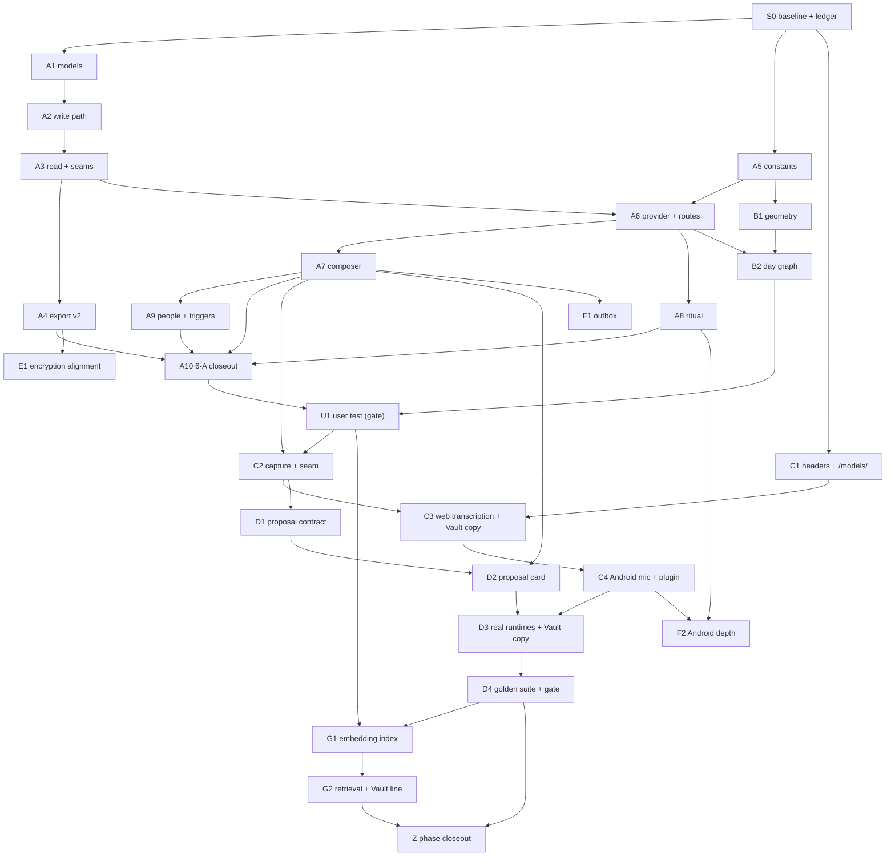

# Phase 6 — Implementation Prompts

**A companion to [`06-emotional-journal.md`](06-emotional-journal.md).** That document is the
*design*: what the Emotional Journal is, why each decision was made, and what it must never do.
This document is the *execution plan*: twenty-eight prompts, each written to be pasted whole
into a fresh Claude Code chat, in order, each producing one reviewable, shippable commit.

The design document is the source of truth for **what** to build. These prompts are the source
of truth for **in what order, in what size, and against what evidence**. Where the two ever
disagree, the design document wins and the prompt gets fixed — the deviation protocol in
[§5](#5-when-reality-disagrees-with-the-plan) says how.

Nothing in Phase 6 has been implemented. This document assumes the repository as it stands on
branch `app-improvements` at commit `035fbe9`.

---

## Contents

1. [How to use this document](#1-how-to-use-this-document)
2. [The session preamble](#2-the-session-preamble)
3. [The session map](#3-the-session-map)
4. [The rails that make the output good](#4-the-rails-that-make-the-output-good)
5. [When reality disagrees with the plan](#5-when-reality-disagrees-with-the-plan)
6. [The prompts](#6-the-prompts)
7. [Appendix A — the ledger template](#appendix-a--the-ledger-template)
8. [Appendix B — the universal definition of done](#appendix-b--the-universal-definition-of-done)
9. [Appendix C — verification command reference](#appendix-c--verification-command-reference)
10. [Appendix D — quick answers](#appendix-d--quick-answers-to-questions-these-sessions-will-raise)

---

## 1. How to use this document

**One session = one prompt = one commit.** Open a new chat, paste one prompt from
[§6](#6-the-prompts) — everything between the `▼▼▼ COPY FROM HERE ▼▼▼` and
`▲▲▲ COPY TO HERE ▲▲▲` markers — and let it run to its definition of done. Then open the next
chat with the next prompt. Do not paste two prompts into one chat: the scope boundaries are the
main thing keeping each change reviewable, and a chat that has already built A7 will quietly
widen A8.

**Three things make a fresh chat as effective as a continuing one:**

| Mechanism | What it is | Why it matters across chat boundaries |
| :-------- | :--------- | :------------------------------------ |
| **The preamble** ([§2](#2-the-session-preamble)) | Repo-specific rules, traps and commands that apply to every session. Lives in this file; each prompt's first instruction is to read it. | A new chat has no memory of the last one's hard-won knowledge about, say, ESLint being broken. Single-sourcing it means it never drifts. |
| **The ledger** (`product_vision/06-progress.md`) | A file created by session S0 and appended to by every session: what shipped, what was measured, what was deferred, what the next session must know. | It is the hand-off. A chat that starts by reading the ledger knows the true state of the branch, not the state this document *predicted*. |
| **The scope fence** | Every prompt has a **Build this** and a **Do not build** list. | Scope creep is the failure mode of long agentic sessions. An explicit out-of-scope list is more effective than a detailed in-scope list. |

**Prompts are not immutable.** After a session, if the next prompt is now wrong — the design
changed, a `(verify)` item resolved differently, a dependency moved — edit it here before
pasting it. That edit *is* the plan being maintained.

**Sequencing freedom.** The dependency graph in [§3](#3-the-session-map) is stricter than the
design document's slice graph because it is per-session. Sessions with no arrow between them
can run in either order or in parallel chats; sessions with an arrow cannot.

---

## 2. The session preamble

Every prompt begins with the line *"Read `product_vision/06-implementation-prompts.md` §2 and
follow it for this entire session."* This is that section. Keep it accurate; it is the only
part of this document that every session reads.

### 2.1 What you are working on

A self-hosted, single-user React 19 + Vite + Tailwind SPA over a Go + Gin + GORM API, with a
Capacitor 8 Android shell. It records how one person's love for another looks, as seven
self-scored numbers on a date. Phase 6 adds an emotional journal underneath that: check-ins,
a nightly ritual, a day graph, and — much later, opt-in and on-device — a small model that
proposes labels for a spoken note.

The repository documents itself and **the documentation is source of truth**. When code and
docs disagree, fix the docs in the same change.

### 2.2 Read before you touch anything

| File | Why |
| :--- | :-- |
| `product_vision/06-emotional-journal.md` | The design. Read the sections your prompt names, in full. Do not implement from the prompt alone — the prompt is a scope fence around the design, not a replacement for it. |
| `product_vision/06-progress.md` | The ledger. What actually shipped in the sessions before yours, and what they warn you about. **Read it before planning.** |
| `docs/10-agent-guide.md` §2 and §3 | Twenty-six hard invariants and sixteen silent-failure traps (the counts were stale at twenty-two and twelve until 2026-08-23). Several bite in every session. |
| `product_vision/README.md` | The roadmap invariants every phase must preserve. |

Then read the specific files your prompt lists. Read whole files, not greps, for any file you
are going to modify.

### 2.3 Non-negotiable rules

1. **The user authors every number and every label** (invariant 15). No code path may write a
   score, a feeling, a person, a trigger or a fact that the user did not confirm with a tap.
2. **Every claim on the Vault page must be true of the code as written** (invariant 2e). If
   your change makes a Vault sentence false, the Vault copy changes *in the same commit*, or
   your change does not ship.
3. **Descriptive, never evaluative.** No copy may contain `overdue`, `missed`, `streak`,
   `forgot`, `should`, `behind`, `!`, `healthy`, `unhealthy`, `concerning`, `symptom`,
   `disorder`, `diagnos`, `fail`, `guilt`, `lazy`, `bad`, `good job`. This is enforced by a
   unit test, not by care.
4. **Absent ≠ zero, and absent ≠ false** (invariant 14). A skipped ritual question is *absent*
   from `answers`. A skipped category is *absent* from `stats`. Never zero-fill, never
   default-false.
5. **`person.ID` is uppercase** (invariant 1). `gorm.Model` has no JSON tags. Everything the
   models declare explicitly is lowercase snake_case (`user_id`, `relationship_id`, `client_id`).
6. **Register protected routes inside the `protected` group** in `backend/cmd/server/main.go`
   (invariant 5). Outside it the route is public with no warning.
7. **Read the user id from `c.Get("userID")`**, never from the body (invariant 6), and scope
   every query with `AND user_id = ?` (invariant 7). A miss is `404`, never `403`.
8. **Add every new model to `database.Models()`** (invariant 9) or the table is never created.
9. **One owner per touch axis, declared with `touch-action`** (invariant 2g). Vertical belongs
   to the page unless the whole screen is non-scrolling.
10. **Tailwind class names must be complete literal strings** (invariant 4). `` `bg-${x}-400` ``
    is purged and renders colourless.
11. **Never silently discard bad input** (invariant 13). A validation failure returns `400`
    naming the field.
12. **The subject list lives in `SubjectsContext`** (invariant 17). Use `useSubjects()`; never
    fetch `/api/subjects` or `/api/relationships` from a screen.

### 2.4 Local environment facts, verified 2026-08-22

- **Baseline is green.** `npm test` → **22 files, 511 tests**, passing in ~20 s on this
  machine (as of the 6-A closeout, 2026-08-22; it was 14 files / 201 tests before Phase 6, and
  the "~70 s" this line used to claim was never right here).
  `cd backend && go test ./...` → passing, handlers ~10 s. If either is red *before* you change
  anything, stop and report it; do not build on a red baseline.
- **`gofmt -l .` is never empty, and that is not a formatting problem.** Every CRLF file in the
  tree is listed, because `gofmt` normalises to LF. **Do not run `gofmt -w .`** — it rewrites
  those files end to end and buries your real diff. Use this instead, which ignores line
  endings and printed empty on 2026-08-22:

  ```bash
  for f in $(git ls-files '*.go'); do diff -q <(gofmt < "$f" | tr -d '\r') <(tr -d '\r' < "$f") >/dev/null || echo "$f"; done
  ```

  Add any untracked `.go` files you have created to that list — `git ls-files` will not see
  them.
- **`npm run lint` is broken** — `eslint-plugin-react-hooks` fails to load from a bad local
  install. This is an environment fault, not a code fault. **Do not try to fix it, and do not
  use it as a signal.** Verify with `npm test` and `npx vite build`.
- **Line endings are mixed** in the working tree and there is no `.gitattributes`. Rewriting a
  whole file in the wrong style produces a whole-file diff that hides the real change. Prefer
  targeted edits over whole-file rewrites; after editing, check `git diff --stat` and if a file
  you barely touched shows hundreds of changed lines, you changed its line endings — revert and
  redo with the file's existing style.
- **Large quoted heredocs (~9 KB+) break in this shell.** Write long files with the Write tool,
  or in sections, rather than one giant `cat <<'EOF'`.
- **Run the backend from `backend/`** — `alexithymia.db` and `uploads/` are CWD-relative.
- **`go test ./...` leaves files behind** in `backend/internal/handlers/uploads/`. **Six** such
  files are *tracked* (the ledger and this line both said four until 2026-08-22); do not delete
  those. The ~20 untracked ones need no attention either: `backend/**/uploads/` is in
  `.gitignore`, so they never appear in `git status` and cannot be committed by accident.
- **The Playwright E2E suite cannot pass** (`docs/11-known-issues.md`). Never use it for
  sign-off. The manual QA checklists in each prompt are the sign-off.

### 2.5 How to work

- **Plan before you write.** Produce a short written plan naming every file you will create or
  modify and the tests you will add, then execute it. If the plan grows past the prompt's
  scope fence, stop and say so rather than building it.
- **Test alongside, not after.** For pure functions (readers, validators, geometry, candidate
  matching) write the test first — those are the modules where this pays most.
- **Small commits, one per session**, with a message naming the slice: `journal: <what>`.
  Never commit or push unless the prompt says to, or the user asks.
- **Report honestly.** If a test fails, say so with the output. If you skipped part of the
  scope, say which part and why. A session that reports "done" with a red suite is worse than
  one that reports "blocked".
- **Ask only when it matters.** Routine judgement calls are yours. Stop and ask when a
  decision would be expensive to reverse, when it contradicts the design document, or when the
  prompt's own **Stop and ask** list names it.

### 2.6 Finishing a session

Do all of these before you report done. The full checklist is Appendix B of this document.

1. `npm test` green; `cd backend && go test ./...` green; `gofmt -l .` empty; `go vet ./...`
   clean; `npx vite build` succeeds.
2. Docs updated in the same change (`docs/01`, `03`, `04`, `05`, `06`, `08`, `10`, `12`, `13`
   as touched), plus the status line of `product_vision/06-emotional-journal.md` if the slice
   completed.
3. `product_vision/06-progress.md` appended with your session's entry, using the template in
   Appendix A. **This is the hand-off; a session is not done without it.**
4. A one-paragraph report to the user: what shipped, what is verified, what is deferred, what
   the next session should know.

---

## 3. The session map

Twenty-eight sessions. The **Slice** column maps back to the design document's §11 slices; the
**Ships** column is what a reviewer would see in the diff.

| # | Session | Slice | Ships | Depends on |
| :- | :------ | :---- | :---- | :--------- |
| **S0** | Baseline, ledger, and the two ordering decisions | — | `product_vision/06-progress.md`; two answered questions | — |
| **A1** | Backend: models, ids, migration | 6-A | `JournalEntry`, `JournalMention`, `domain/journal.go` | S0 |
| **A2** | Backend: `POST /api/journal/entries` | 6-A | The write path, in one transaction | A1 |
| **A3** | Backend: read, delete, days, and the relationship seams | 6-A | `GET entries`, `GET days`, `DELETE`, merge/delete integration, `/api/meta` | A2 |
| **A4** | Backend: export/import v2 | 6-A | `exportVersion = 2`, journal CSV | A3 |
| **A5** | Frontend: `src/constants/journal.js` | 6-A | Vocabularies, readers, candidates, copy, the forbidden-word test | S0 |
| **A6** | Frontend: provider, routes, navigation, day view | 6-A | `JournalProvider`, `/journal`, `/journal/:day`, nav slots | A3, A5 |
| **A7** | Frontend: the check-in composer | 6-A | Chips + typed check-ins, new person, new trigger | A6 |
| **A8** | Frontend: the nightly ritual | 6-A | `/journal/ritual`, swipe cards, Profile settings, the prompt line | A6 |
| **A9** | Frontend: People and Triggers views | 6-A | `/journal/people*`, `/journal/triggers`, rename and merge | A7 |
| **A10** | 6-A closeout: docs, QA, review | 6-A | Doc updates, the manual QA run, a review pass | A4, A7, A8, A9 |
| **B1** | Day graph: the geometry | 6-B | `src/components/dayGraph.js`, pure and tested | A5 |
| **B2** | Day graph: the component | 6-B | `DayGraph.jsx`, ribbon → tilt, rotation, ⓘ | B1, A6 |
| **U1** | The user test | gate | A protocol, a run, and a report in `product_vision/eval/` | A10, B2 |
| **C1** | Deployment: headers and the model channel | 6-C | `nginx.conf`, `/models/`, `models_data`, `make models-fetch` | S0 |
| **C2** | Capture and the inference boundary | 6-C | Recorder state machine, `propose()` seam, fake runtime | A7, U1 |
| **C3** | Web Light-tier transcription **+ the Vault copy** | 6-C | Whisper via transformers.js, download manager, new Vault copy | C1, C2 |
| **C4** | Android: microphone, plugin skeleton, tiers | 6-C | `RECORD_AUDIO`, the Capacitor plugin, tier detection | C3 |
| **D1** | The proposal contract, offline | 6-D | Schema, prompt builder, `validateProposal`, fixtures | C2 |
| **D2** | The proposal card | 6-D | The card, resolution, ambiguity, facts, provenance | D1, A7 |
| **D3** | Real runtimes **+ the full Vault copy** | 6-D | LiteRT-LM, transformers.js ONNX, download, tiers, ritual-by-voice | D2, C4 |
| **D4** | The golden suite and the model gate | 6-D | `golden/`, `make journal-eval`, the eval report | D3 |
| **E1** | Encryption alignment | 6-E | Journal rows in the docs/13 envelope | A4 + docs/13 P0 |
| **F1** | The outbox | 6-F | Offline journal writes, idempotent retry | A7 |
| **F2** | Android depth | 6-F | Ritual notification, launcher shortcut, haptics | A8, C4 |
| **G1** | The embedding index and trigger normalisation | 6-G | EmbeddingGemma, the device-local index, *"same thing?"* | D4, U1 |
| **G2** | Retrieval: past entries, search, and the Vault line | 6-G | `from: "retrieval"` chips, semantic recall, new Vault entry | G1 |
| **Z** | Phase closeout | — | Final doc sweep, roadmap invariants, security review | all |



### 3.1 Where the natural stopping points are

The plan is built so that stopping is always an option, and stopping never leaves a lie on the
Vault page.

| Stop after | You have | The Vault page |
| :--------- | :------- | :------------- |
| **A10** | A complete manual journal: chips, typed notes, triggers, the nightly ritual, People and Triggers views, export/import v2 | Untouched and still true — no model, no microphone |
| **B2** | The same, plus the day graph | Untouched and still true |
| **U1** | Evidence about whether the expensive half is worth building | — |
| **C4** | Voice notes transcribed on-device, tagged with chips | Changed once, honestly, in C3 |
| **D4** | The full feature: one on-device pass, proposals, the golden gate | Changed to the full "voice on" variant in D3 |
| **G2** | Trigger normalisation and semantic recall | One more entry |

If U1 says people do not reuse triggers and do not search, **G1 and G2 are not built** — the
design document says so and this plan holds you to it.

---

## 4. The rails that make the output good

These are the mechanisms that carry quality across chat boundaries. Every prompt leans on them;
do not remove one to save time.

| Rail | How it works | What it prevents |
| :--- | :----------- | :--------------- |
| **The forbidden-word test** | Extended in A5 from `cadence.test.js`'s six words to the sixteen in §3.6 of the design, and run over *every* string constant the journal can render — question cards, empty states, card templates, settings descriptions, the merge dialog. | Copy that shames the user, added six sessions after anyone remembered the rule. |
| **Pure functions at the boundary** | Every non-trivial computation is an exported pure function with its own test: `readCheckin`, `readTrigger`, `personCandidates`, `triggerCandidates`, `buildDayCurve`, `branchPaths`, `project`, `validateProposal`. Components `map` over their output. | Recharts renders nothing under jsdom (invariant 19). Untestable logic hidden in a component is the repo's oldest failure mode. |
| **The injected runtime** | `propose(input, context, runtime)` takes its runtime as an argument. `createFakeRuntime(fixtures)` is what every component test uses. `npm test` never loads weights. | A test suite that needs 2.6 GB of model to run is a test suite that stops being run. |
| **Confirm-before-write, structurally** | The save payload is built from the card's confirmed state, never from the model's output. The model's proposal travels beside it as provenance. | Invariant 15 decaying into "the model was probably right". |
| **The provenance block** | Every model-assisted entry records what was proposed, what was accepted, what was replaced. | Deciding whether the model earns its 2.6 GB on vibes instead of on the acceptance rate. |
| **The airplane-mode test** | C3's and C4's acceptance criterion: record, transcribe, save with the network off; nothing in the log but the one POST when it comes back. | A trust claim that is true by intention rather than by evidence. |
| **The golden suite as a gate** | D4 produces a report in `product_vision/eval/`. A model does not become a tier default until its numbers are in that report. | Shipping a model because it felt good on three sentences in English. |
| **The ledger** | Appendix A. Every session appends: shipped, measured, deferred, warnings. | The eighth chat rediscovering what the third chat learned. |

---

## 5. When reality disagrees with the plan

The design document marks a dozen facts *(verify)* — model sizes, memory ceilings, runtime
capabilities, German transcription quality, whether transformers.js supports grammars. Some
will be wrong. That is expected, and handling it well is part of the work.

**The protocol, in every session:**

1. **Measure, do not argue.** Where the design says *(verify)*, produce a number and record
   where it came from.
2. **Record it in the ledger** under `Measured`, with the device, the build, and the date.
3. **Fix the design document in the same commit.** Replace the *(verify)* with the measured
   value and a date. `06-emotional-journal.md` is a living document, not a historical one — the
   "docs stay true" rule covers it.
4. **If the measurement invalidates a decision** — the Full tier does not fit, LiteRT-LM's audio
   path does not exist for Gemma 4, WebGPU is not there — **stop and report before building the
   fallback.** The design names a runner-up for every such choice (llama.cpp, Whisper, chips);
   which one to take is the user's call, not a silent substitution.
5. **Never soften a claim to make it true.** If the code cannot support a Vault sentence, the
   code changes or the feature waits. Rewriting the sentence to be vaguer is the one move that
   is never available.

---

## 6. The prompts

Each prompt is delimited. Copy everything between the markers, including the first line.

### S0 — Baseline, ledger, and the two ordering decisions

*No code. Establishes the hand-off mechanism and settles two questions that change what A1 builds.*

▼▼▼ COPY FROM HERE ▼▼▼

Read `product_vision/06-implementation-prompts.md` §2 and follow it for this entire session.
This is session **S0** of Phase 6 — the Emotional Journal.

**Goal:** prove the baseline is green, create the ledger that every later session hands off
through, and get two ordering questions answered before any schema is written.

**Read:** `product_vision/06-emotional-journal.md` §11 (implementation phases), §12.3 (ordering
relative to docs/13), §12.5 (decided and undecided); `product_vision/README.md`;
`docs/13-zero-knowledge-encryption.md` §0 and its status; `docs/11-known-issues.md`.

**Build this**

1. **Verify the baseline** and record the exact numbers:
   - `npm test` — expect 14 files / 201 tests green (~70 s).
   - `cd backend && go test ./... && gofmt -l . && go vet ./...` — expect green, empty, clean.
   - `npx vite build` — expect success; record the bundle size, because C3 and D3 will be
     judged against it.
   - `git status` — expect clean. Note (do not delete) the four tracked files in
     `backend/internal/handlers/uploads/`.
   - Confirm `npm run lint` still fails on the `eslint-plugin-react-hooks` load error, so the
     preamble's claim stays accurate. Do not fix it.
2. **Create `product_vision/06-progress.md`** — the ledger — using the template in Appendix A
   of `06-implementation-prompts.md`. Seed it with: the baseline numbers above, the full
   session table from §3 of that file with every row marked `not started`, and an empty
   `Decisions` and `Measured` section. Mark S0 `done` at the end.
3. **Answer the two ordering questions with the user** (see **Stop and ask** below) and record
   both answers, with their reasoning and date, in the ledger's `Decisions` section.
4. **Add the status line.** At the top of `product_vision/06-emotional-journal.md`, leave the
   *"Status: plan, not yet implemented"* paragraph but append one sentence pointing at
   `06-implementation-prompts.md` and `06-progress.md` as the execution plan and its ledger.

**Do not build:** any model, migration, handler, component, constant or test. No `git commit`
unless the user asks. Do not create `product_vision/eval/` yet — U1 and D4 own it.

**Stop and ask** (these are the session's real output):

1. **Is docs/13 (zero-knowledge encryption) going to land before or after 6-A?** §12.3 is
   explicit that the journal would rather be born encrypted than migrated. If docs/13 P0–P1 is
   close, the right order is docs/13 first and session **E1 disappears**. If it is not,
   6-A ships plaintext and the Vault page must say so in the journal's own words. Present both
   costs in two sentences each and let the user choose.
2. **Does `person_fact` ship in 6-D or wait for 6-E?** It is the one payload that is verbatim
   text *about a third party*, and shipping it unencrypted is a choice the operator should make
   knowingly (§12.5). Note that A1–A4 build the `kind` either way — the question is only
   whether the *UI* ever writes one before encryption lands.

**Verify:** the ledger exists, is readable, and its session table matches §3 of
`06-implementation-prompts.md` exactly. Both decisions are recorded with dates.

**Report:** the baseline numbers, the two decisions, and any drift you found between this
document's assumptions and the actual repository.

▲▲▲ COPY TO HERE ▲▲▲

---

### A1 — Backend: models, ids, migration

*The two tables and the id allowlists. No handlers, no routes.*

▼▼▼ COPY FROM HERE ▼▼▼

Read `product_vision/06-implementation-prompts.md` §2 and follow it for this entire session.
This is session **A1** of Phase 6 — the Emotional Journal. Start by reading
`product_vision/06-progress.md`.

**Goal:** the journal's two tables exist, migrate cleanly on both engines, and the server owns
the id vocabularies — with nothing yet able to write to them.

**Read:** `product_vision/06-emotional-journal.md` §6.1, §6.2, §6.3, §5.3 (the vocabulary
tables — you need the *ids*, not the labels); `docs/03-data-model.md`;
`docs/10-agent-guide.md` §2 (invariants 3, 8, 9, 10) and §3 (traps 10a, 10b, 10f);
`backend/internal/models/models.go`; `backend/internal/domain/categories.go`;
`backend/internal/database/database.go`; `backend/internal/database/database_test.go`.

**Build this**

1. **`backend/internal/models/models.go`** — add `JournalEntry` and `JournalMention` exactly as
   specified in §6.2, including the doc comments. Points that are load-bearing:
   - `ClientID` is `varchar(36)`, `not null`, `default:''`, and part of the composite
     `uniqueIndex:idx_journal_user_client` together with `UserID`. It is the idempotency key and
     the future AAD identity.
   - `Kind` is `varchar(16)`, `not null`, `default:'checkin'`, indexed.
   - `Day` is `varchar(10)`, **text on purpose** — it is a partition key, not a timestamp, and a
     date column would reintroduce the `MAX()` typing trap (10a).
   - `At` is a non-pointer `time.Time`, stored UTC. Document in the comment that this is a
     deliberate exception to invariant 8, which governs a snapshot's *date of state*.
   - `Payload map[string]interface{}` with `gorm:"serializer:json"`.
   - `SupersededAt *time.Time` and `SupersedesID *uint`, both indexed.
   - `JournalMention` carries `EntryID`, nullable `RelationshipID`, `Label` (`not null;default:''`)
     and `Ref` (`not null;default:0`).
   - Every non-nullable column gets a `default` tag (trap 10f).
2. **`backend/internal/domain/journal.go`** — new file, on the precedent of `categories.go`:
   ids only, no labels, no colours, no prose.
   - `FeelingIDs` — the twenty-one ids from §5.3, in that order, and `IsFeelingID(id string) bool`.
   - `RitualQuestionIDs` — the five core plus the eight optional ids from §3.2, and
     `IsRitualQuestionID`.
   - `JournalKinds` — `checkin`, `ritual`, `person_fact`, `trigger`, and `IsJournalKind`.
   - A file-level comment stating the rule: **ids are permanent; adding one is two edits in two
     languages; removing one is forbidden** — a retired id is marked `retired: true` in the
     frontend constant so the UI stops offering it while the server keeps accepting it for old
     rows and imports.
3. **`backend/internal/database/database.go`** — add both models to `Models()` (invariant 9).

**Do not build:** handlers, routes, validation helpers, export changes, any frontend file.
`domain/journal.go` holds ids and nothing else — labels, valence, energy and colour are
frontend-owned and belong to session A5.

**Tests to add**

- `backend/internal/database/database_test.go`: `TestAutoMigrateAddsJournalTables` — drop
  `journal_entries` and `journal_mentions`, run migration, assert both come back with their
  columns and the composite unique index. Note trap 10b: SQLite cannot drop a column a foreign
  key references, so drop whole tables rather than columns here.
- A round-trip test that a `JournalEntry` with a nested `Payload` map saves and reads back
  identical, including a nested array and a nested object — the `serializer:json` path.
- A test that inserting two entries with the same `(user_id, client_id)` fails, and that the
  same `client_id` under a *different* user succeeds.
- `backend/internal/domain/` gets its first test file: `IsFeelingID`, `IsRitualQuestionID` and
  `IsJournalKind` accept every listed id and reject `""`, an unknown id, and a differently-cased
  one.

**Verify**

```
cd backend && gofmt -l . && go vet ./... && go test ./...
```

Then, against a database that has Phase-5 data in it:

```
make migrate-check-local
```

It must report no drift after the migration and must have reported the two tables missing
before it. Record both outputs in the ledger.

**Definition of done:** Appendix B, plus `docs/03-data-model.md` gains the two entities with
the same register as the three that are there, and `docs/10-agent-guide.md` §2's invariant 3
row mentions that feeling and ritual-question ids are now a third and fourth permanent id
vocabulary.

▲▲▲ COPY TO HERE ▲▲▲

---

### A2 — Backend: `POST /api/journal/entries`

*The whole write path, in one transaction. The session with the most invariants per line.*

▼▼▼ COPY FROM HERE ▼▼▼

Read `product_vision/06-implementation-prompts.md` §2 and follow it for this entire session.
This is session **A2** of Phase 6 — the Emotional Journal. Start by reading
`product_vision/06-progress.md`.

**Goal:** one endpoint that creates a check-in, a ritual, a person fact or a trigger — with
mentions resolved, new triggers minted, corrections linked, and retries idempotent — all in one
transaction that either commits whole or writes nothing.

**Read:** `product_vision/06-emotional-journal.md` §6.3 (payload shapes), §6.5 (validation),
§7.1, §7.2 (the endpoint in detail), §4.7 stages 6–7 (the worked example);
`docs/05-backend.md` §4.2 (the universal handler skeleton); `docs/04-api-reference.md` §8;
`docs/10-agent-guide.md` Recipe 3 and Recipe 8; and read **in full**
`backend/internal/handlers/subjects.go` (the validation-helper style you are copying) and
`backend/internal/handlers/relationships.go` (the transaction style).

**Build this**

1. **`backend/internal/handlers/journal.go`** — new file. Input structs directly above their
   handler, as the repo does.
   - `CreateJournalEntryInput` with `client_id`, `kind`, `at`, `day`, `schema_version`,
     `payload`, `mentions[]`, `triggers[]`, `supersedes_id` — the shape in §7.2 exactly.
   - Validation helpers, each small, each unit-testable, in the style of `validateStats`:
     `validateJournalKind`, `validateDay`, `validateCheckinPayload`, `validateRitualPayload`,
     `validatePersonFactPayload`, `validateTriggerPayload`, `validateMentions`,
     `validateTriggerRefs`. The rules are the table in §6.5 — implement all of them.
   - `CreateJournalEntry(c *gin.Context)` — the handler.
2. **The transaction**, in this order, inside one `database.DB.Transaction`:
   1. Idempotency: look up `(user_id, client_id)`. If a row exists, return **`200`** with it and
      do nothing else. (Not `201`, not `409` — this is what lets F1's outbox retry blindly.)
   2. If `supersedes_id` is present: load it scoped to the user (`404` if not theirs), reject if
      `superseded_at` is already set (`409`), and stamp `superseded_at` on it.
   3. For each entry in `triggers[]`: either confirm the referenced `client_id` names one of the
      caller's live `kind: "trigger"` entries (`404` for the whole request if not), or create it
      as its own `JournalEntry` with `kind: "trigger"` and the given `client_id` and `label` —
      **before** the entry that references it.
   4. For each mention: `relationship_id` must be the caller's (`404`), or `name` resolves
      through `database.FindOrCreateRelationship(tx, userID, name)` — the *same* function the
      snapshot write path and the backfill use (invariant 2b). Never both, never neither.
   5. Insert the entry and its mentions.
   6. Echo the created row with `ID`, `CreatedAt` and resolved mention ids.
3. **Register the route** in `backend/cmd/server/main.go`, **inside the `protected` group**
   (invariant 5): `protected.POST("/journal/entries", handlers.CreateJournalEntry)`.

**Rules that are easy to get wrong here**

- `at` is RFC 3339 *with offset* and is stored UTC; reject anything more than 24 h in the future.
  `day` is strictly `YYYY-MM-DD` and must be within ±36 h of `at` — a rollover hour plus a time
  zone, not a typo.
- **Unknown keys inside a payload are kept, not dropped** (§6.5). Only known keys are validated.
  Dropping an unknown key silently is the description-wipe bug in a new form.
- A skipped ritual question is **absent** from `answers`. Never write `false` for it, and never
  reject a payload for a missing question id.
- Every error is a `400` naming the field, in the exact register of the examples in §7.2:
  `unknown feeling id: bliss`, `day must be within 36 hours of at`,
  `mention 1 needs relationship_id or name`.
- A `relationship_id` or `supersedes_id` belonging to another user is `404` for the **whole
  request**, and nothing is written.

**Do not build:** `GET`, `DELETE`, `/api/journal/days`, export changes, merge/delete integration,
or anything frontend. There is deliberately **no `PUT`** — do not add one.

**Tests to add** — `backend/internal/handlers/journal_test.go`, table-driven in the style of
`subjects_test.go`, against real SQLite where the transaction matters and sqlmock where the
`INSERT` shape matters:

- valid check-in with a mention by `relationship_id`
- valid check-in with a mention by `name` → creates the relationship through find-or-create, and
  a second check-in with the same name resolves to the *same* relationship
- valid ritual, including one with a question skipped (key absent, and it stays absent)
- valid `person_fact` with exactly one mention
- **new trigger created in the same transaction**, then referenced by a check-in in that same
  request
- **existing trigger referenced by client id**
- **a trigger id belonging to another user → `404`, and nothing written** (assert the entry
  count is unchanged)
- a feeling's `about` naming a trigger not listed in `triggers[]` → `400`
- unknown feeling id → `400`; unknown ritual question id → `400`
- `day` three days from `at` → `400`; `at` two days in the future → `400`
- mention with neither id nor name → `400`; mention with both → `400`
- mention with another user's relationship → `404`, nothing written
- **duplicate `client_id` → `200` with the stored row**, and no second row
- same `client_id` under a different user → `201`
- `supersedes_id` stamps `superseded_at`; a second supersede of the same row → `409`
- a trigger merge correction carrying `merged_into`
- unauthenticated → `401`; a database error mid-transaction rolls everything back
- unknown payload keys survive the round trip

**Verify**

```
cd backend && gofmt -l . && go vet ./... && go test ./...
```

Then a manual round trip with `curl` against a locally-run backend: create a check-in naming a
new person, `POST` it twice with the same `client_id`, and confirm one relationship, one entry,
one mention, and a `200` on the second call. Paste the two responses into the ledger.

**Definition of done:** Appendix B, plus `docs/04-api-reference.md` gains the endpoint with its
full status table, and `docs/05-backend.md` names `journal.go` in its handler inventory.

▲▲▲ COPY TO HERE ▲▲▲

---

### A3 — Backend: read, delete, days, and the relationship seams

*Everything the journal needs to be read back, plus the two places it touches existing endpoints.*

▼▼▼ COPY FROM HERE ▼▼▼

Read `product_vision/06-implementation-prompts.md` §2 and follow it for this entire session.
This is session **A3** of Phase 6 — the Emotional Journal. Start by reading
`product_vision/06-progress.md`.

**Goal:** the journal is readable by day range, deletable, countable by day, and cannot be
stranded by a relationship merge or delete.

**Read:** `product_vision/06-emotional-journal.md` §7.1, §7.3, §2.2 (the merge/delete row of the
invariant table); `docs/10-agent-guide.md` trap 10a (`MAX()` typing) — it is why `days` counts
over a `varchar` and not a date; `backend/internal/handlers/relationships.go` **in full**,
especially `MergeRelationship`, `DeleteRelationship`, `summaryQuery` and `aggregateTime`;
`backend/internal/handlers/vault.go`'s `GetMeta`.

**Build this**

1. **`GET /api/journal/entries`** with `from`, `to`, `kind`, `relationship_id` query parameters.
   - `from`/`to` default to the last 31 days; both are strictly `YYYY-MM-DD` or `400`.
   - Filters `superseded_at IS NULL` — readers never resolve chains.
   - Mentions preloaded; ordered `day ASC, at ASC, id ASC`.
   - `relationship_id` filters to entries with a mention naming that person, scoped to the
     caller.
2. **`DELETE /api/journal/entries/:id`** — soft delete, scoped to the user,
   `RowsAffected == 0` → `404`, exactly as `DeleteSubject` does.
3. **`GET /api/journal/days`** with `from`/`to` — one row per day: `day`, `checkins` (count),
   `ritual` (bool), `people` (distinct mentioned relationships). `COUNT`/`GROUP BY day` over a
   `varchar(10)`, portable to both engines. **Do not** aggregate over a time column; that is
   trap 10a and the reason `Day` is text.
4. **`POST /api/relationships/:id/merge`** — inside the existing transaction, add
   `UPDATE journal_mentions SET relationship_id = target WHERE relationship_id = source`,
   including mentions on soft-deleted entries (for the same reason merge already moves
   soft-deleted snapshots). Response gains `mentions_moved`.
5. **`DELETE /api/relationships/:id`** — mentions keep their rows and their `label`;
   `relationship_id` is left as-is because the relationship is soft-deleted and joins drop out.
   Response gains `mentions_detached` so the dialog can state the count.
6. **`GET /api/meta`** — gains `journal_entry_count` and `oldest_journal_day`. `oldest_journal_day`
   is `MIN(day)` over a `varchar`, so it is a string on both engines — no `aggregateTime` needed,
   and say so in a comment next to the existing `MIN(date)` caveat.
7. **Register all three new routes inside the `protected` group.**

**Do not build:** a `PUT` (there is none by design), a triggers endpoint (`?kind=trigger` is the
list, a correction is the edit), export changes (A4), or anything frontend.

**Tests to add**

- `TestGetJournalEntries`: range filter includes the boundary days and excludes the day either
  side; superseded rows excluded; ordering exactly `day, at, id`; `kind=trigger` returns only
  triggers; `relationship_id` filters correctly and returns `[]` for another user's id;
  malformed `from` → `400`; default window is the last 31 days; another user's entries are never
  returned.
- `TestDeleteJournalEntry`: own entry → `204`/`200` per the repo's convention for
  `DeleteSubject`; another user's → `404`; already deleted → `404`.
- `TestGetJournalDays`: counts per day, `ritual` true only on days with a ritual entry, `people`
  counts distinct relationships and not mentions, an empty range returns `[]`.
- `TestMergeMovesJournalMentions`: mentions on live and soft-deleted entries both move;
  `mentions_moved` is the real count; merging a relationship with no mentions reports `0`.
- `TestDeleteRelationshipDetachesMentions`: the entries survive, the labels survive, the count is
  reported.
- `TestGetMetaCountsJournal`: both new fields, and `oldest_journal_day` reads as a string on
  SQLite.
- Run the merge and delete tests against **real SQLite**, not sqlmock — the point is the
  transaction, not the SQL string.

**Verify**

```
cd backend && gofmt -l . && go vet ./... && go test ./...
```

Manual: create three check-ins naming *Lucie*, merge *Lucie* into *Lucie M*, and confirm
`GET /api/journal/entries?relationship_id=<Lucie M>` returns all three. Then delete *Lucie M* and
confirm the entries still return with their labels intact.

**Definition of done:** Appendix B, plus `docs/04-api-reference.md` documents all four journal
endpoints and the three changed ones, and `docs/03-data-model.md` notes what merge and delete do
to mentions.

▲▲▲ COPY TO HERE ▲▲▲

---

### A4 — Backend: export/import v2

*The vault has to carry the journal, and re-import has to be exact.*

▼▼▼ COPY FROM HERE ▼▼▼

Read `product_vision/06-implementation-prompts.md` §2 and follow it for this entire session.
This is session **A4** of Phase 6 — the Emotional Journal. Start by reading
`product_vision/06-progress.md`.

**Goal:** `alq-export` becomes version 2 and round-trips journal entries, mentions and triggers
exactly, with `client_id` as the duplicate key.

**Read:** `product_vision/06-emotional-journal.md` §6.7; `backend/internal/handlers/vault.go`
**in full**; `backend/internal/handlers/vault_test.go`; `docs/04-api-reference.md`'s export
section.

**Build this**

1. **`exportVersion = 2`** and a `journal` block in the export document, shaped exactly as §6.7
   specifies: entries with `client_id`, `kind`, `day`, `at`, `schema_version`, `payload`, and
   `mentions` referencing the relationship **by name** (consistent with the rest of the
   document's id-free shape).
2. **Import**:
   - Version 1 files stay importable — the `journal` block is simply absent. Test this
     explicitly with the existing fixture.
   - **Duplicate detection is `client_id`**, not content. Re-importing the same file is a no-op
     for the journal, unlike snapshots.
   - Mentions resolve by name through `database.FindOrCreateRelationship` (invariant 2b again).
   - Triggers import as ordinary entries; a check-in's `about` keeps the trigger's `client_id`,
     which is stable across export and import, so triggers need **no** name-based resolution.
     Import triggers before the entries that reference them, or in an order-independent way —
     say which you chose and why in a comment.
   - Superseded rows are exported **with their link**, because an export is the whole record;
     import preserves `supersedes_id` by mapping old ids through the imported `client_id`s.
   - A version-2 file into a pre-Phase-6 server is refused by the existing version check. Leave
     that behaviour alone; it is the right answer.
3. **The CSV gains a second file**, `alq-journal-YYYY-MM-DD.csv`: one row per feeling per
   check-in — `day, at, source, feeling, intensity, uncertain, about_kind, about, tags`. The
   **transcript is deliberately absent** from the spreadsheet form and present only in the JSON.
   Follow whatever mechanism the existing CSV export uses for delivering a file; if it currently
   produces one file, decide and document how two are delivered (a second endpoint, a zip, or a
   second download) — and prefer the smallest change.

**Do not build:** any client-side export change beyond what is needed to download the second
CSV; encryption-aware export (that is E1); anything frontend beyond the download itself.

**Tests to add**

- Export → import round trip on a database holding check-ins, a ritual, a person fact, two
  triggers, a superseded correction and a merged trigger: every entry, mention, payload key and
  supersede link identical afterwards.
- Re-import of the same file is a **no-op by `client_id`** — entry count unchanged.
- A version-1 fixture still imports and produces no journal rows.
- A version-2 file whose mention names a relationship that does not exist creates it once, and
  twice in the same file creates it once.
- A version-2 file referencing a trigger `client_id` that the file does not contain → `400`
  naming it, and nothing imported.
- The journal CSV has one row per feeling, quotes fields containing commas, and contains no
  transcript column.

**Verify**

```
cd backend && gofmt -l . && go vet ./... && go test ./...
npm test
```

Manual: export from a database with a full day of journal data, delete the journal rows, import
the file, and diff `GET /api/journal/entries` before and after. They must match apart from row
ids and timestamps.

**Definition of done:** Appendix B, plus `docs/04-api-reference.md` documents export v2 and the
second CSV, and `src/components/Vault.jsx`'s description of what an export contains gains the
journal — **check whether any Vault copy claim is now stale** and fix it here if so.

▲▲▲ COPY TO HERE ▲▲▲

---

### A5 — Frontend: `src/constants/journal.js`

*The whole frontend vocabulary and every string the journal can show, as one pure module. No React.*

▼▼▼ COPY FROM HERE ▼▼▼

Read `product_vision/06-implementation-prompts.md` §2 and follow it for this entire session.
This is session **A5** of Phase 6 — the Emotional Journal. Start by reading
`product_vision/06-progress.md`.

**Goal:** one module that owns the journal's content and arithmetic, with a test file that makes
the copy discipline mechanical rather than remembered. Nothing in this session renders.

**Read:** `product_vision/06-emotional-journal.md` §3.2 (question set and copy), §3.6 (copy
discipline and the forbidden list), §4.5 (person resolution), §4.5b (trigger resolution), §5.3
(the vocabularies and where they live), §6.3 (payload shapes), §6.4 (readers), §9.4 (empty
states); `src/constants/cadence.js` **in full** (the register and the file-comment style you are
matching); `src/constants/cadence.test.js` lines around the forbidden-word test;
`src/constants/categories.js`; `src/components/ContextCapsule.jsx` (`CONTEXT_TAGS`, `MAX_TAGS`,
`MAX_TAG_LENGTH` — reuse, do not redefine).

**Build this — `src/constants/journal.js`**

A file-level comment in `cadence.js`'s voice, stating the negative product rule this file
exists to enforce: **no mood score, no daily average, no counting of missed nights, no
evaluative vocabulary.** Then:

1. **`FEELINGS`** — the twenty-one entries from §5.3, each
   `{ id, label, gloss, valence, energy, hex, retired? }`. Ids must match
   `backend/internal/domain/journal.go` exactly; add a test that asserts that (see below).
   `unclear` — *"can't tell"* — is the entry the thesis depends on; give it a comment saying so.
   Colours must be complete literal Tailwind-safe hex values, not interpolated classes
   (invariant 4).
2. **`RITUAL_QUESTIONS`** — the five core (in the fixed §3.2 order) and the eight optional, each
   `{ id, text, core: bool, note }`. The optional set's `note` is what the settings screen shows;
   `water`'s note must state honestly that its evidence as a mood predictor is weak.
3. **`ENTRY_KINDS`**, `MAX_FEELINGS_PER_CHECKIN` (5), `MAX_TRANSCRIPT_LENGTH` (4000),
   `MAX_TRIGGER_LABEL` (40, the tag limit), `INTENSITY_LEVELS` (1–3), `DAY_ROLLOVER_HOUR` (4).
4. **`JOURNAL_COPY`** — every string the journal can render, as one nested constant: the ritual
   prompt, the empty states from §9.4, the settings descriptions from §9.7, the merge-dialog
   wording, and the day-graph ⓘ sentence. Nothing may be a bare string literal inside a
   component from here on; components read from this object.
5. **Readers**, pure, switching on `payload.v`:
   - `readCheckin(payload)` → a normalised object with feelings, `about` targets, tags, note,
     transcript, source and provenance; unknown keys preserved on a `raw` field.
   - `readRitual(payload)` → `{ asked, answers, dayWord, skipped }` where `skipped` is
     `asked − keys(answers)`. **Absence is never `false`.**
   - `readTrigger(entry, allTriggerEntries)` → the live label and, if merged, the surviving
     trigger's `client_id`; **resolving a merge chain to its end**, one-way, cycle-safe.
   - `readPersonFact(payload)`.
6. **Day arithmetic**: `civilDay(date, rolloverHour)` → `YYYY-MM-DD` using
   `DAY_ROLLOVER_HOUR` (a moment before 04:00 local belongs to the previous day);
   `journalDayPath(day)`; `dayRange(from, to)`.
7. **Candidate matching**, exported and pure, **suggestion only, never auto-select**:
   - `personCandidates(name, relationships)` — exact-after-trim first (the same comparison
     `FindOrCreateRelationship` makes, so what the card shows as a match is what the server
     would do anyway), then case- and diacritic-insensitive equality, then prefix/first-token
     match, capped at three.
   - `triggerCandidates(label, triggers)` — the same shape, without the prefix rule: *Arbeit*
     and *arbeit* are one trigger; *work* and *Arbeit* are not.
8. **`clientId()`** — a UUID v4 minted client-side. Use `crypto.randomUUID()` with a documented
   fallback if the repo targets any environment without it.

**Do not build:** any component, provider, route, network call, or model code. Do not import
React. Do not put labels or colours in the Go allowlist, and do not put ids only in JS — the two
must agree, and the test below is what proves it.

**Tests to add — `src/constants/journal.test.js`**

- **The forbidden-word test, extended.** Walk *every* string in `JOURNAL_COPY`, every
  `RITUAL_QUESTIONS[].text` and `.note`, every `FEELINGS[].label` and `.gloss`, and assert none
  contains, case-insensitively: `overdue`, `missed`, `streak`, `forgot`, `should`, `behind`,
  `!`, `healthy`, `unhealthy`, `concerning`, `symptom`, `disorder`, `diagnos`, `fail`, `guilt`,
  `lazy`, `bad`, `good job`. Write it as a recursive walk over the object, not a hand-listed
  set of strings, so a string added later cannot escape it.
- **Id parity with the backend.** Read `backend/internal/domain/journal.go` from the test (or
  assert against a checked-in list generated from it) and assert `FEELINGS` ids,
  `RITUAL_QUESTIONS` ids and `ENTRY_KINDS` match the Go allowlists exactly, in both directions.
  This test is the thing that stops the two languages drifting.
- `readCheckin` / `readRitual` / `readTrigger` on: a v1 payload; a payload with unknown keys
  (preserved); a ritual with a skipped question (**absent, not false**); a trigger merge chain
  two deep; a self-referencing merge (must not loop).
- `civilDay` at 03:59 and 04:00 local, across a month boundary and across a DST change.
- `personCandidates`: exact match wins and is marked exact; `Lucie` offers `Lucie M`; `lucie`
  matches `Lucie` case-insensitively; `José` matches `Jose`; never more than three; never
  auto-selects; an empty name returns none.
- `triggerCandidates`: `arbeit` matches `Arbeit`; `work` does **not** match `Arbeit`.
- Every `FEELINGS` entry has a valence in −1…1, an energy in 0…1, a unique id, a unique hex, and
  a label that is a noun and not graded (assert no entry label contains `very`, `slightly`,
  `extremely`).

**Verify**

```
npm test
npx vite build
```

**Definition of done:** Appendix B, plus `docs/06-frontend.md` gains `src/constants/journal.js`
to its module inventory with one line on what it owns, and `docs/08-testing.md` names the
forbidden-word walk and the id-parity test as the two rails this phase adds.

▲▲▲ COPY TO HERE ▲▲▲

---

### A6 — Frontend: provider, routes, navigation, day view

*The journal becomes a place in the app. It reads; it does not yet write.*

▼▼▼ COPY FROM HERE ▼▼▼

Read `product_vision/06-implementation-prompts.md` §2 and follow it for this entire session.
This is session **A6** of Phase 6 — the Emotional Journal. Start by reading
`product_vision/06-progress.md`.

**Goal:** `/journal` and `/journal/:day` exist, are reachable from both navigations, load real
entries through a provider, and render the day's list and empty states correctly under
discretion and the app lock.

**Read:** `product_vision/06-emotional-journal.md` §9.1 (routes), §9.2 (where the button lives),
§9.4 (empty states), §9.6 (discretion and lock); `docs/10-agent-guide.md` Recipe 4 (add a screen
that reads subjects) and invariant 17; `src/context/SubjectsContext.jsx` **in full**;
`src/context/DiscretionContext.jsx` (`useDiscretion`, `initials`, `BLUR_CLASS`);
`src/App.jsx`; `src/components/Navbar.jsx`; `src/components/MobileBottomNav.jsx`;
`src/components/TimelineRoute.jsx` (the pattern for a route that reads context);
`docs/10-agent-guide.md` trap 10c and 10d (how frontend tests must mock axios and wrap providers).

**Build this**

1. **`src/context/JournalContext.jsx`** — a second context beside `SubjectsContext`, not a
   second store.
   - Holds the loaded day range, the entries in it, loading and error state, and (from F1) the
     outbox. Exposes `useJournal()` which throws outside its provider, matching `useSubjects`.
   - Calls `GET /api/journal/entries` and `GET /api/journal/days` through the **global `axios`**
     (invariant: never a private instance — see `docs/06-frontend.md` §6 and trap 11).
   - Exposes `createEntry(entry)` and `deleteEntry(id)`; `createEntry` mints the `client_id` via
     `clientId()` from `src/constants/journal.js` if the caller did not.
   - **Reads relationships from `useSubjects()`** and never fetches them itself (invariant 17).
   - Mount it inside `SubjectsProvider` in `App.jsx`.
2. **Routes**, all guarded on `token` like `/vault`:
   `/journal`, `/journal/:day`. Register `/journal/ritual`, `/journal/people`,
   `/journal/people/:id` and `/journal/triggers` as **placeholders that render an empty state**
   so the later sessions only replace a body — do not leave them 404.
3. **`src/components/Journal.jsx`** — the day view.
   - Header: the date, prev/next day, *today* when not on today, and a month strip above for
     orientation. Prev/next navigate by `journalDayPath(day)`.
   - Body: the day's entries newest-first, each showing its feelings as chips (colour from
     `FEELINGS`, dashed for `uncertain` and for `unclear`), what each was about (person chip,
     trigger chip, or context tag), the time, and the transcript line when present.
   - The ritual's answers as the day's **footer** once one exists.
   - A slot where the day graph will go in B2, rendering nothing for now.
   - Empty states from §9.4, read from `JOURNAL_COPY` — never a literal string.
4. **Navigation.**
   - `MobileBottomNav.jsx`: a fifth slot, **Journal**, lucide `NotebookPen`, inserted so the
     order reads Analysis · Journal · Vault · Profile · discretion. Re-check the width maths in
     that file's comment — at 360 dp five slots is 72 dp each, above the 48 dp minimum — and
     update the comment, which currently says four slots.
   - `Navbar.jsx` (≥ `md`): **Journal** beside Vault and Profile.
   - `isActive` must light Journal for every `/journal*` path.
   - The microphone button does **not** exist yet; leave its place empty rather than a disabled
     control.
5. **Discretion**: names masked with `initials`, transcripts and trigger labels blurred with
   `BLUR_CLASS`, feelings and colours unaffected. The app lock already wraps everything in
   `App.jsx`; verify, do not re-implement.

**Do not build:** the composer (A7), the ritual cards (A8), the People and Triggers bodies (A9),
the day graph (B1/B2), any microphone or model code, or the outbox (F1).

**Tests to add — `src/components/Journal.test.jsx`, `src/context/JournalContext.test.jsx`**

- Mock `axios.get` **per URL** (trap 10c): the provider now loads `/api/subjects`,
  `/api/relationships`, `/api/journal/entries` and `/api/journal/days`. Copy the `mockFetch`
  helper from an existing test rather than inventing a new one.
- Wrap in `SubjectsProvider`, `DiscretionProvider` **and** `JournalProvider` (trap 10d).
- The day view renders a check-in's feelings, its person chip and its trigger chip; a ritual
  renders as the footer; an `unclear` feeling renders dashed.
- Empty today, empty past day, and first-ever-visit render exactly the §9.4 strings from
  `JOURNAL_COPY`.
- Prev/next navigate to the adjacent `YYYY-MM-DD`, including across a month boundary.
- Under discretion: names are initials, transcripts carry `BLUR_CLASS`, feeling labels are
  untouched.
- `useJournal()` outside its provider throws.
- A failed load surfaces an error in the screen's own error slot (Recipe 5), and does not blank
  the page.
- `MobileBottomNav` renders five slots and lights Journal on `/journal/2026-08-21`.

**Verify**

```
npm test
npx vite build
```

Manual: navigate to `/journal` on a handset viewport and confirm the bottom bar's five slots are
all comfortably tappable; confirm the app lock covers `/journal/2026-08-21`.

**Definition of done:** Appendix B, plus `docs/06-frontend.md` gains the routes, the provider and
the nav change, and `docs/12-android-app.md` notes the fifth bottom-nav slot.

▲▲▲ COPY TO HERE ▲▲▲

---

### A7 — Frontend: the check-in composer

*The definition of a check-in: chips and typed text. This is the feature, not a fallback.*

▼▼▼ COPY FROM HERE ▼▼▼

Read `product_vision/06-implementation-prompts.md` §2 and follow it for this entire session.
This is session **A7** of Phase 6 — the Emotional Journal. Start by reading
`product_vision/06-progress.md`.

**Goal:** a user can record a check-in in three taps or with a sentence, attach it to a person,
a trigger or a context tag, and see it appear in the day view — with new people and new triggers
minted only on save.

**Read:** `product_vision/06-emotional-journal.md` §4.1 (the three paths — note the chips path
*is* the feature), §4.4 items 2–3 (chip anatomy, strength dots, the *unsure* toggle), §4.5,
§4.5b, §6.3 (`kind: "checkin"`), §7.2; `src/components/ContextCapsule.jsx` (chip UI you should
match, and `CONTEXT_TAGS` you must reuse); `src/components/WhatChanged.jsx` (the `≈`/uncertainty
convention); `src/constants/journal.js` from A5.

**Build this — `src/components/CheckinComposer.jsx`**

1. **Opened from `/journal`** by a primary button — the header button on ≥ `md` mirroring where
   the dashboard puts *New Analysis*, and a floating round button bottom-right above the bottom
   bar on a handset (64 px, inside the thumb's arc, `pb-safe`-aware, hidden while the keyboard
   is open like the bar itself). The button is a **keyboard/chips** button in this session; the
   microphone arrives in C2 and takes its place where available.
2. **Feelings**: the `FEELINGS` grid as chips, coloured by identity, searchable/filterable if the
   grid is long. Each selected chip gets:
   - a three-step strength shown as dots `·` `··` `···` — **never numbers**, defaulting to `··`;
   - an *unsure* toggle writing `uncertain: true`, using the same `≈` convention the snapshot
     sliders use.
   - `unclear` (*can't tell*) is a first-class chip, drawn dashed, and must be selectable on its
     own with nothing else.
   - Cap at `MAX_FEELINGS_PER_CHECKIN`; the cap is stated, not silently enforced.
3. **About**, per feeling: a person chip, a trigger chip, or a context tag from `CONTEXT_TAGS`.
   - Person: pick from `useSubjects().relationships`; typing a new name offers
     `personCandidates()` results as tap-to-pick **and** *new person: X* beside them. **The card
     never auto-selects a candidate.**
   - Trigger: pick from the user's existing triggers (read from the provider's `kind=trigger`
     entries through `readTrigger`, resolving merge chains); typing a new label offers
     `triggerCandidates()` and *new trigger: X*, dashed until confirmed.
   - A chip can be moved between feelings by tapping it and then the other feeling, and removed
     with its ×.
4. **Optional**: a free-text `note`, and context `tags` reusing `ContextCapsuleFields` limits.
5. **Save** builds the §6.3 `checkin` payload with `source: "chips"` or `"typed"`, plus
   `tz_offset_min`, `at` (now, RFC 3339 with offset) and `day` (`civilDay(now, DAY_ROLLOVER_HOUR)`),
   and posts through `useJournal().createEntry`. In the request:
   - a known person → `{ ref, relationship_id, label }`; a new one → `{ ref, name, label }`;
   - a known trigger → `triggers: [{ trigger: "<client_id>" }]`; a new one →
     `triggers: [{ label, client_id: clientId() }]`, with the feeling's `about` naming that same
     `client_id`.
   - **Nothing is minted for a label the user did not confirm.**
6. **A failed save leaves the composer open with the user's input intact** (trap 4 — the
   close must sit inside `try`, after the awaits, never in a `finally`).
7. **Deleting a check-in** from the day view, with a confirm that states what goes.

**Do not build:** voice, transcription, any model, the proposal card, the ritual, the outbox, or
the People/Triggers views. Do not add a `PUT` path — a correction is a new entry with
`supersedes_id`, and the *edit* affordance can wait for A9 if it does not fit here; say so in the
ledger if you defer it.

**Tests to add — `src/components/CheckinComposer.test.jsx`**

- Three taps (feeling → save) produces a valid payload with `source: "chips"`, exactly one
  feeling, default intensity 2, `uncertain` absent.
- Strength dots cycle 1→2→3 and render as dots, never digits.
- The *unsure* toggle writes `uncertain: true`.
- A known person sends `relationship_id`; a brand-new name sends `name` and no id; the composer
  offers `Lucie M` when the user types `Lucie` and **does not** select it automatically.
- A known trigger sends `trigger: <client_id>`; a new label sends `label` + a minted `client_id`
  and the feeling's `about` names that id; a trigger the user typed but then removed mints
  nothing.
- A merged trigger is offered under the surviving label only.
- The feeling cap is enforced and stated.
- `unclear` can be saved alone.
- A 500 from the API leaves the composer open with the selections intact and shows an error.
- Under discretion, person chips show initials and the note field is blurred.
- The composed payload matches the §6.3 shape key-for-key (a snapshot test against a literal
  object, so a silent shape drift fails).

**Verify**

```
npm test
npx vite build
```

Manual, against a running backend: record three check-ins naming *work* as a new trigger the
first time; confirm one trigger entry exists with three referencing check-ins. Create a person in
the journal, then snapshot them from the dashboard — confirm **one** relationship, not two, and
that the "New Analysis" name field offers the journal-only person as a suggestion (if it does
not, note it in the ledger as a follow-up for A9 or A10; §2.2 asks for it).

**Definition of done:** Appendix B, plus `docs/06-frontend.md` documents the composer and
`docs/01-concepts.md` gains the check-in to its vocabulary section as a peer of the snapshot —
**without** touching the "no AI" claim, which is still true.

▲▲▲ COPY TO HERE ▲▲▲

---

### A8 — Frontend: the nightly ritual

*Nine interactions, under a minute, half asleep. The screen where the copy discipline is the feature.*

▼▼▼ COPY FROM HERE ▼▼▼

Read `product_vision/06-implementation-prompts.md` §2 and follow it for this entire session.
This is session **A8** of Phase 6 — the Emotional Journal. Start by reading
`product_vision/06-progress.md`.

**Goal:** `/journal/ritual` asks five to nine binary questions by swipe, records skips as
absence, offers a closing day-word, and never counts a missed night.

**Read:** `product_vision/06-emotional-journal.md` §3 **in full** — it is the whole spec for this
session — plus §6.3 (`kind: "ritual"`), §9.7 (settings); `docs/12-android-app.md` §3.3 (touch-axis
ownership) and invariant 2g; `src/components/Dashboard.jsx`'s `CardStack` pager (the swipe
contract you are deliberately *not* following here, and why); `src/components/CadenceNudge.jsx`
(the once-per-session `sessionStorage` mechanism, `readSeen`/`markSeen`); `src/mobile/knobFeedback.js`
(`detent` — reuse the existing tick, do not add a sound); `src/components/Profile.jsx` (the
settings section style you are matching).

**Build this**

1. **`src/components/RitualCards.jsx`** at `/journal/ritual` — a **full-viewport, non-scrolling**
   route. One card at a time, full width, the question as a short sentence with the two answers
   written under it.

   | Gesture | Meaning | Also reachable by |
   | :------ | :------ | :---------------- |
   | Swipe right | Yes | a **Yes** button; `→` |
   | Swipe left | No | a **No** button; `←` |
   | Swipe up | Skip — not answering tonight | a smaller **skip** link; `↑` |
   | Tap the card | **Nothing** — a half-asleep tap must not record an answer | — |

   - **Touch axis (invariant 2g):** the card may claim both axes with `touch-action: none`, and
     only the card, *because the screen does not scroll*. Put a comment on that line saying the
     claim is conditional on the route staying non-scrolling, and that if it ever grows a
     scrollable region the card gives up the vertical axis and skip becomes a button only.
   - A small tilt follows the finger; commit threshold ~30 % of card width; below it, spring
     back. One selection haptic per commit through `knobFeedback`'s existing tick, and **none in
     discretion mode**.
2. **Question order and set**: the five core in the fixed §3.2 order, then up to three optional
   ones the user enabled, then the closing card. Everything from `RITUAL_QUESTIONS`.
3. **The closing card** — *And today, in a word?* — the `FEELINGS` grid as chips, one tap,
   `unclear` (*can't tell*) a first-class chip, swipe-up to skip. It is the only non-binary card
   and it comes last.
4. **The write**: one `kind: "ritual"` entry with the §6.3 payload — `question_set.asked`
   (recording that an optional question was *shown*, which is different from being skipped),
   `answers` with **skipped questions absent**, `rollover_hour`, `duration_ms`, and `day_word`.
   The day word is **also** written as its own `checkin` entry at the ritual's `at` with
   `source: "ritual_word"`, so the day graph and the mention logic never need to know rituals
   exist.
5. **A yes to `with_people`** shows a *Who?* card **only if** the *Ask who I was with* setting is
   on: relationships as chips (initials under discretion), multiple selection, writing mentions
   on the ritual entry.
6. **Settings** — a **Journal** section in `Profile.jsx` beside *Check-in reminders*, same toggle
   style: nightly ritual on/off and its time (default 22:30), optional questions (≤ 3, each with
   its `note`), *Ask who I was with* (off). Keys `alq:journal-ritual`, `alq:journal-questions`,
   `alq:journal-ask-who`, in `localStorage`, per device. Leave the voice and embedding toggles
   **out** — they arrive in C3 and G1.
7. **The web prompt line**: after the chosen hour, one line in the cadence nudge's slot on the
   dashboard — *"Tonight's questions are ready."* with *Start* and *Not tonight*. Once per
   session, `sessionStorage`, reusing `CadenceNudge`'s helpers. **The cadence nudge and the
   ritual line never both show**; after the ritual hour the ritual line wins and the cadence
   banner waits for the next session (§3.6, invariant 2c).
8. **A missed night is nothing.** No row, no count, no trace the next morning. Assert this in a
   test rather than trusting it.

**Do not build:** the Android local notification or the launcher shortcut (F2), voice answering
(§3.7 — that is D3), the day graph, or anything model-shaped.

**Tests to add — `src/components/RitualCards.test.jsx`, `src/components/Profile.test.jsx` additions**

- Swipe right → `true`; left → `false`; up → the key is **absent** from `answers` but present in
  `asked`; a tap on the card records nothing and does not advance.
- Buttons and arrow keys are exactly equivalent to the gestures.
- The core five appear in the fixed order; enabling two optional questions appends exactly those
  two; `asked` records them.
- The closing card writes both the ritual's `day_word` and a separate `checkin` entry with
  `source: "ritual_word"` at the same `at`.
- Skipping the closing card writes neither.
- `with_people: true` shows *Who?* only when the setting is on, and writes mentions.
- The ritual line renders once per session and never alongside the cadence nudge; after
  *Not tonight* it does not return this session.
- A day with no ritual renders no trace of one — no "you didn't", no zero, no placeholder.
- The forbidden-word walk from A5 covers every new string (it will, if you added them to
  `JOURNAL_COPY`; assert that no new bare literal was introduced by grepping the component in
  the test, or by keeping the walk over the module).
- Haptics: `detent` called once per commit, and not at all under discretion.
- `touch-action: none` is present on the card and **absent** from its ancestors.

**Verify**

```
npm test
npx vite build
```

**Manual QA — this is the session's real acceptance test:** complete the ritual **in under 60
seconds with one thumb, on a 360 dp viewport, with your eyes half closed.** Then skip a question
and confirm the exported JSON shows the key absent from `answers` and present in `asked`. Then
miss a night and confirm the next morning shows nothing about it. Record the timing in the ledger
— §12.4 question 1 depends on it.

**Definition of done:** Appendix B, plus `docs/06-frontend.md` documents the ritual route and its
touch-axis exception, `docs/12-android-app.md` §3.3 gains the ritual as the one full-viewport
screen that may claim both axes, and `docs/01-concepts.md` §3's *"Cadence — the one nudge"*
becomes *"Cadence, and the two nudges"* with the sentence §10.3 specifies.

▲▲▲ COPY TO HERE ▲▲▲

---

### A9 — Frontend: People and Triggers views

*Where the journal's two vocabularies become visible and editable.*

▼▼▼ COPY FROM HERE ▼▼▼

Read `product_vision/06-implementation-prompts.md` §2 and follow it for this entire session.
This is session **A9** of Phase 6 — the Emotional Journal. Start by reading
`product_vision/06-progress.md`.

**Goal:** every person the journal knows — including those with no love snapshot — and every
trigger the user has grown, each with its entries, and the two corrections the trigger
vocabulary needs.

**Read:** `product_vision/06-emotional-journal.md` §2.2 (why journal-only people exist), §2.3,
§9.3, §4.5b step 3 (rename and merge as corrections), §7.1 (why there is no triggers endpoint),
§10.6 (*remove this person from the journal*); `src/components/StackActions.jsx` and
`src/components/RelationshipDialogs.jsx` (the rename/merge/delete dialogs you must **link to**,
not duplicate); `src/components/Dashboard.jsx`'s `summarizeStack` (the descriptive-summary
pattern and its taxonomy-order tie-break).

**Build this**

1. **`/journal/people`** — lists **every** relationship from `useSubjects().relationships`,
   including `snapshot_count: 0` ones the dashboard does not draw. Each row: name (initials under
   discretion), mention count, the two feelings most often attached (descriptive, taxonomy-order
   tie-break, following `summarizeStack`'s pattern and register), and a link to the stack's
   timeline when a snapshot exists.
2. **`/journal/people/:id`** — keyed by `relationship_id` so it survives a rename. Mentions newest
   first, each with its feelings and the transcript line that named them; the person's confirmed
   facts with their dates. Plus the one action §10.6 requires: **remove this person from the
   journal** — soft-deletes their `person_fact` entries and detaches their mentions, worded with
   the exact count of what goes.
   - **Rename, merge and delete of the relationship are not duplicated here.** The row links to
     the stack menu on the dashboard, which already owns them.
3. **`/journal/triggers`** — one row per live trigger (merge chains resolved through
   `readTrigger`): label, entry count, the two feelings most often attached. Detail screen lists
   the entries that name it.
4. **The two corrections**, both `POST /api/journal/entries` with `supersedes_id`:
   - **Rename** — a new `kind: "trigger"` entry with the new `label`.
   - **Merge into another trigger** — a correction whose payload carries `merged_into`. The
     dialog states the count and that **it is one-way and cannot be split apart again**, in the
     same words the relationship merge dialog uses.
   - After a merge every reader resolves the old id to the survivor. Verify the composer (A7) and
     the day view (A6) both do, since both call `readTrigger`.
5. **Suggestions on the "New Analysis" name field** (§2.2): journal-only people are offered so
   the first snapshot lands on the existing row rather than a near-duplicate. If A7 already
   noted this as deferred, do it here.
6. **Discretion** masks names in both views and blurs trigger labels and transcript lines.

**Do not build:** *looks similar to…* pairs (that is G1 and needs the embedding index), any
automatic merging, or a triggers API endpoint.

**Tests to add**

- The People view lists a relationship with `snapshot_count: 0` and does not link it to a
  timeline.
- Mention counts and the two most-attached feelings are correct, with a deterministic
  taxonomy-order tie-break.
- The detail screen is keyed by id and survives a rename mid-session.
- *Remove this person from the journal* states the exact count and, on confirm, issues the right
  calls; cancelling issues none.
- The Triggers view resolves a two-deep merge chain to the survivor and does not list the merged
  ids.
- Rename posts a correction with `supersedes_id` and the new label; the list updates without a
  refetch of `/api/subjects`.
- The merge dialog contains the count **and** the one-way sentence; the forbidden-word walk
  covers both.
- Under discretion, both views mask names and blur labels.

**Verify**

```
npm test
npx vite build
```

Manual: name *work* in three check-ins, rename it to *the job*, and confirm all three entries now
read *the job* and the export still carries the original `client_id`. Merge *my job* into *work*
and confirm every entry shows *work* and the merge cannot be undone from the UI.

**Definition of done:** Appendix B, plus `docs/06-frontend.md` documents both views and
`docs/04-api-reference.md` notes that trigger rename and merge are corrections rather than
endpoints.

▲▲▲ COPY TO HERE ▲▲▲

---

### A10 — 6-A closeout: docs, QA, review

*The slice is not done until the documentation is true and someone has looked at the whole of it.*

▼▼▼ COPY FROM HERE ▼▼▼

Read `product_vision/06-implementation-prompts.md` §2 and follow it for this entire session.
This is session **A10** of Phase 6 — the Emotional Journal. Start by reading
`product_vision/06-progress.md`.

**Goal:** slice 6-A ships. A complete manual emotional journal, every document true of the code,
every claim on the Vault page still true, and the whole diff reviewed as one thing.

**Read:** `product_vision/06-emotional-journal.md` §11's 6-A verification block **in full** — it
is your checklist; `docs/README.md`'s source-of-truth map; every doc listed below before editing
it.

**Do this**

1. **The full manual QA run** from 6-A's *Manual QA* list. Do every item and record the result,
   pass or fail, in the ledger:
   - ritual in under 60 s with a thumb, eyes half closed, on a 360 dp device;
   - skip a question, export, confirm the key is absent;
   - a missed night leaves no trace the next day;
   - create a person in the journal, then snapshot them from the dashboard — **one**
     relationship, not two;
   - name *work* in three check-ins → one trigger with three entries;
   - merge two triggers → every entry shows the survivor;
   - rename, merge and delete a relationship → mentions follow §7.3;
   - discretion masks the day list, the People view and the Triggers view;
   - the app lock covers every journal route;
   - export → wipe → import → the journal is identical.
2. **Documentation sweep.** Each of these gains what 6-A actually built, in that document's own
   register:
   - `docs/01-concepts.md` — the check-in and the ritual as vocabulary; §3's two nudges; §6
     unchanged on AI, **because 6-A contains no model** — confirm that sentence is still true and
     say so in the commit message.
   - `docs/03-data-model.md` — the two entities, the JSON-in-text payloads, append-only and
     `superseded_at`, what merge and delete do to mentions.
   - `docs/04-api-reference.md` — four new endpoints, three changed ones, export v2.
   - `docs/05-backend.md` — `journal.go` in the inventory; the validation helpers as an example
     of the house style.
   - `docs/06-frontend.md` — the provider, the routes, the components, the nav slots; **§3c's
     claims table is unchanged and must be re-read to confirm that**.
   - `docs/08-testing.md` — the forbidden-word walk and the id-parity test.
   - `docs/10-agent-guide.md` — invariant 3's id vocabularies; a new trap if you found one (a
     6-A-specific candidate: *a skipped ritual question is absent, and `asked` is what tells you
     it was shown*); Recipe entries if a new pattern deserves one.
   - `docs/12-android-app.md` — the fifth nav slot and the ritual's touch-axis exception.
   - `docs/13-zero-knowledge-encryption.md` — journal rows added to the register of what would be
     encrypted, per §6.6, with the note that they are plaintext today.
   - `product_vision/README.md` — the invariant edits §10.4 specifies **only insofar as 6-A makes
     them true**; the AI sentences wait for 6-C/6-D. Change *"Additive schema changes only, until
     Phase 4"* to *"…outside Phase 4"*, since Phase 6 adds two tables and no migration.
   - `product_vision/06-emotional-journal.md` — the status line becomes *"6-A implemented; 6-B…6-G
     planned"*, with the date, and every `(verify)` you resolved is replaced with the measured
     value.
3. **A review pass over the whole slice.** Run `/code-review high` against the 6-A diff
   (`git diff main...HEAD` or the equivalent for however the work was branched). Fix what it
   finds that is real; record what you rejected and why in the ledger. Then run `/simplify` and
   take only what does not fight the design.
4. **Re-run everything**: `npm test`, `cd backend && go test ./...`, `gofmt -l .`, `go vet ./...`,
   `npx vite build`, and `make migrate-check-local` against a Phase-5 database.
5. **Compare the bundle size** to S0's baseline and record the delta. 6-A should add very little;
   if it added a lot, find out why now, before C3 and D3 add megabytes of their own.

**Do not build** any new feature. If the QA run finds a defect, fix it — that is in scope. If it
finds a *missing* feature, write it into the ledger as a follow-up and, if it belongs to a later
session, add it to that session's prompt in `06-implementation-prompts.md`.

**Stop and ask** if the QA run shows the ritual cannot be finished in 60 seconds. §3.3 says the
optional tail shrinks before the core does, but which questions to cut is a product decision.

**Report:** a short slice report — what 6-A does, what it does not, the QA results, the bundle
delta, and the answer to *"is every Vault claim still true?"* with the reasoning.

▲▲▲ COPY TO HERE ▲▲▲

---

### B1 — Day graph: the geometry

*A day of check-ins becomes a branching curve. Pure functions only; nothing renders.*

▼▼▼ COPY FROM HERE ▼▼▼

Read `product_vision/06-implementation-prompts.md` §2 and follow it for this entire session.
This is session **B1** of Phase 6 — the Emotional Journal. Start by reading
`product_vision/06-progress.md`.

**Goal:** `src/components/dayGraph.js` — four exported pure functions that turn a day's entries
into drawable geometry, each with a test that would catch a wrong minute.

**Read:** `product_vision/06-emotional-journal.md` §8.1 (axis semantics and why the rejected
alternatives were rejected), §8.2 (the eight construction rules — this is the specification),
§8.4 (the assertion table); `docs/10-agent-guide.md` invariant 19 (Recharts renders nothing under
jsdom — this is why the geometry is separate); `src/components/LoveShape.jsx` (hand-drawn SVG
geometry as pure functions, the precedent you are following);
`src/constants/journal.js` (`FEELINGS` valence/energy/hex).

**Build this — `src/components/dayGraph.js`**

Constants, exported and named, with the values §8.2 proposes:
`FEELING_HALF_LIFE_MIN = 150`, `BRANCH_END_THRESHOLD = 0.2`, `CONFIDENT_MIN = 90`,
`NEUTRAL_SETTLE_MIN = 30`, `STEP_MIN = 5`. A comment must state plainly that these are
**rendering choices about a record, not claims about the user's psychology** — the same sentence
the ⓘ will show.

1. **`buildDayCurve(entries, options)`** → `{ samples, branches, bounds }` where each sample is
   `{ t, branches: [{ feeling, intensity, y, z, uncertain, extrapolated }] }`. Implement the
   eight rules exactly:
   1. The **trunk** is valence 0, energy 0.3, grey, from the day's first check-in to its last.
      Before the first check-in nothing is drawn — placing it would be a fabrication, for the
      same reason an undated snapshot is excluded from the timeline.
   2. A feeling at a check-in **starts a branch**, or continues a live one with the same id. Two
      feelings at one moment are two branches leaving the trunk at the same `t`.
   3. Between two check-ins that both carry the feeling, intensity is **interpolated
      monotonically** — a feeling reported twice holds its line rather than sagging between.
   4. After the last check-in carrying it, a branch **decays exponentially** with
      `FEELING_HALF_LIFE_MIN`, and **merges into the trunk** when it drops below
      `BRANCH_END_THRESHOLD`. A merge is a convergence, not a cut.
   5. **A later check-in without the feeling does not end the branch** — absence is not a report
      that the feeling stopped (invariant 14's logic, applied to time). The one exception is an
      explicit `neutral` check-in, which ends every branch over `NEUTRAL_SETTLE_MIN`.
   6. Any part of a branch further than `CONFIDENT_MIN` from the nearest check-in carrying that
      feeling is emitted with `extrapolated: true`.
   7. The **ritual's day word** is already a `checkin` with `source: "ritual_word"` (A8), so it
      needs no special case here — but assert that it behaves as rule 7 describes: decay, then
      extrapolation marking, then the day word's branch rising at the ritual time.
   8. Sample every `STEP_MIN` from first to last check-in: ≤ 288 samples, ≤ 5 branches each.
   `y` is valence **scaled by current intensity**; `z` is the feeling's fixed energy.
2. **`branchPaths(samples)`** → one path per branch lifetime, with birth and merge points at
   trunk valence, stroke width from intensity, `dashed: true` for `uncertain` and for the
   `unclear` feeling.
3. **`project(point, camera)`** → screen `(x, y)` plus a depth for painter's ordering, width and
   opacity. A 2.5-D oblique projection, `{ yaw, pitch }`. At `pitch = 0` it must produce the
   exact 2-D ribbon.
4. **`dayGraphLegend(samples)`** → distinct feelings in order of first appearance. It holds no
   names, so discretion does not affect it — assert that.

**Do not build:** any component, SVG, React import, drag handling, or Recharts. Do not add
three.js — §8.3 rejects it for this slice and keeps the geometry consumable by it later.

**Tests to add — `src/components/dayGraph.test.js`**, the §8.4 table plus the tricky cases:

- Trunk starts at the first check-in, not at 00:00; an empty day returns no samples.
- One branch per distinct feeling at a moment; two simultaneous feelings are two branches from
  the same `t`.
- A feeling repeated at 12:00 and 18:00 **interpolates** and does not dip below either endpoint.
- Decay crosses `BRANCH_END_THRESHOLD` at the **expected minute** — compute the expected value
  from the half-life in the test rather than pasting a magic number.
- A later check-in without the feeling does **not** end the branch.
- A `neutral` check-in ends every branch within `NEUTRAL_SETTLE_MIN`.
- Segments beyond `CONFIDENT_MIN` from the nearest supporting check-in are `extrapolated`, and
  those within it are not — check both sides of the boundary.
- A ritual day word ends the day; a day without one ends at its last check-in.
- `unclear` and `uncertain: true` both produce `dashed` paths.
- `project` at `pitch = 0` maps known points to the 2-D ribbon exactly; depth ordering is stable
  for equal depths (no nondeterministic sort); `yaw = 180°` mirrors `x`.
- More than five feelings at one moment is impossible upstream, but assert the function does not
  crash if it happens.
- A day spanning a DST change produces monotonically increasing `t`.

**Verify**

```
npm test
npx vite build
```

**Definition of done:** Appendix B, plus `docs/06-frontend.md` names `dayGraph.js` beside
`LoveShape` as pure geometry, and `docs/08-testing.md` cites it as the pattern for chart logic
under invariant 19.

▲▲▲ COPY TO HERE ▲▲▲

---

### B2 — Day graph: the component

*Draw it. Ribbon first, then tilt it.*

▼▼▼ COPY FROM HERE ▼▼▼

Read `product_vision/06-implementation-prompts.md` §2 and follow it for this entire session.
This is session **B2** of Phase 6 — the Emotional Journal. Start by reading
`product_vision/06-progress.md`.

**Goal:** the day view draws the curve — first as the flat ribbon, then with the tilt and
horizontal-drag rotation — as hand-drawn SVG that asserts under jsdom.

**Read:** `product_vision/06-emotional-journal.md` §8.1 (what each channel encodes), §8.3
(rendering technology and why not Recharts), §8.2's closing paragraph (the ⓘ sentence);
`src/components/LoveShape.jsx` and `LoveShape.test.jsx` **in full** — hand-drawn SVG that renders
and asserts under jsdom is the proof this approach works; `src/components/VaultKnob.jsx` (drag
handling and `touch-action`); `docs/12-android-app.md` §3.3 and invariant 2g.

**Build this — `src/components/DayGraph.jsx`**

1. **Ship the 2-D ribbon first.** `pitch = 0`, the same `buildDayCurve` output projected flat.
   Get it correct and merged in your own head before adding the tilt — it is the honest fallback
   and, per §12.4 question 6, may turn out to be the whole answer.
2. **Then the tilt**: the oblique projection with a default `pitch`, painter's-order sorting by
   depth, width and opacity from depth. Rotation by **horizontal drag** (≥ 45 px) *and* by two
   buttons, so the gesture is never the only way in.
3. **Touch axis (invariant 2g):** `touch-action: pan-y` on the graph container. The graph claims
   **horizontal only**; vertical belongs to the page. A vertical drag starting on the graph must
   still scroll the page — test it.
4. **Channels**, exactly as §8.1: x = time of day, proportional (a six-hour gap must look like
   six hours); y = valence scaled by intensity; z = energy; colour = feeling identity; stroke
   width = intensity; dashed = uncertain or `unclear`; low opacity = extrapolated. A guess has to
   look like a guess.
5. **A tap on a branch** opens the check-in it came from in the list below.
6. **The ⓘ**, one sentence, from `JOURNAL_COPY`: *"Each feeling is drawn fading over about two
   and a half hours unless you mention it again"* — and a second clause saying that is a drawing
   choice, not a claim about you. It must state the actual `FEELING_HALF_LIFE_MIN`, derived from
   the constant rather than hard-coded in the string, so tuning the constant cannot make the
   sentence false.
7. **Discretion**: the graph keeps drawing — it holds colours and no names. The legend shows
   feeling labels only.
8. **Print**: it must render in a print preview. Hand-drawn SVG does; verify it.
9. Mount it in the `/journal` and `/journal/:day` slot A6 left for it.

**Do not build:** three.js or react-three-fiber (§8.3 keeps it as the upgrade path, not this
slice), Recharts anything, or a second geometry implementation — import from `dayGraph.js`.

**Tests to add — `src/components/DayGraph.test.jsx`**

- The rendered `<path>` count matches `branchPaths(...).length` for a fixture day.
- `stroke-dasharray` is present on the `unclear` branch and on an `uncertain: true` branch, and
  absent otherwise.
- Extrapolated segments render at reduced opacity.
- Rotation by button changes the projection; rotation by a ≥ 45 px horizontal drag does too.
- **The page still scrolls** from a vertical drag that starts on the graph: dispatch the events
  and assert which of the page and the graph called `preventDefault` — copy the card-stack
  test's technique.
- The ⓘ sentence contains the half-life computed from the constant (change the constant in the
  test and assert the sentence changes).
- An empty day renders no paths and no legend, and does not throw.
- Under discretion the graph still renders and the legend has no names.

**Verify**

```
npm test
npx vite build
```

**Manual QA:** a day with one check-in; with two simultaneous feelings; with a feeling repeated
at noon and 18:00; with a `neutral` check-in; with a ritual word and without. Rotate by drag and
by buttons. Scroll the page with a drag that starts on the graph. Print preview. Then the
question §12.4 asks: show the same day as ribbon and as tilt and answer *"when were you most
stressed, and about what?"* from each — record which one you read correctly, and how fast.

**Definition of done:** Appendix B, plus `docs/06-frontend.md` documents the component and its
touch contract, and the design document's status line records 6-B as implemented.

▲▲▲ COPY TO HERE ▲▲▲

---

### U1 — The user test

*The gate. Everything after this is expensive; this is how you find out whether to spend it.*

▼▼▼ COPY FROM HERE ▼▼▼

Read `product_vision/06-implementation-prompts.md` §2 and follow it for this entire session.
This is session **U1** of Phase 6 — the Emotional Journal. Start by reading
`product_vision/06-progress.md`.

**Goal:** run the user test §12.4 specifies against the working 6-A + 6-B build, and produce a
report that decides four things: the feeling vocabulary, the ritual's length, whether the
proposal card is worth building, and whether 6-G is built at all.

**Read:** `product_vision/06-emotional-journal.md` §12.4 **in full** (the eight questions), §5.3
(the vocabulary the test is meant to correct), §1's *"the bet, stated so it can be lost"`.

**Build this**

1. **`product_vision/eval/user-test-protocol.md`** — a runnable protocol, not a wish:
   - Participants, and the note that §12.4 question 8 requires **German first**: every recording
     in the participants' own language, before any English number is believed.
   - Tasks, in order, with what to observe and what to time.
   - A **paper proposal card**: for question 2 you need to show a *fake* proposal for the
     participant's own sentence. Build a small fixture-driven card — reuse the A7 composer with a
     hard-coded proposal, or a printed card — and say which. It must look like the real thing
     (dashed chips, an *add* chip, *This isn't it*) so the reaction is to the interaction, not to
     a mock-up.
   - A tally sheet for question 3: which of the 21 feelings are chosen, which are never chosen,
     which are asked for and missing, and **whether `unclear` gets used** — that entry is the one
     the thesis depends on.
   - A tally for question 4: how many distinct trigger labels a week produces, and how many are
     the same thing said differently. This is the number that decides 6-G.
2. **Run it.** If the user cannot run it now, say so plainly and stop — do not proceed to C2 on
   the strength of an unrun gate, and record in the ledger that the gate is open.
3. **`product_vision/eval/user-test-report-YYYY-MM-DD.md`** — the results, question by question,
   with the raw tallies attached and each of the four decisions stated explicitly:

   | Decision | Evidence needed |
   | :------- | :-------------- |
   | The feeling vocabulary's final membership and the valence/energy constants | Question 3's tally |
   | Whether the ritual keeps nine cards or fewer | Question 1's timings; §3.3 says the optional tail shrinks before the core |
   | Whether the proposal card is worth building at all | Question 2's acceptance rate on the paper card. If it is below what the model can plausibly reach, **the chips path may be the whole feature** — and that is a legitimate outcome |
   | Whether 6-G is built | Question 4's numbers. §5.8 is explicit: if people do not reuse triggers and do not search, it is not built |

4. **Apply what the test decided.** Vocabulary changes go into `src/constants/journal.js` **and**
   `backend/internal/domain/journal.go` in the same commit — remember that **removing a feeling
   id is forbidden**; retire it with `retired: true` so the UI stops offering it while the server
   keeps accepting it for old rows and imports. Ritual changes go into `RITUAL_QUESTIONS`.
5. **Update `product_vision/06-emotional-journal.md`** §5.3 and §12.5: the vocabulary is no
   longer "a first draft for the user test to correct" — it is what the test produced, dated.

**Do not build:** any voice, model, or embedding code. This session's output is evidence and the
small constant changes it justifies.

**Stop and ask** if question 2's acceptance rate is low, or question 4 says triggers are not
reused. Both are decisions to *not build* something large, and they are the user's to make with
the evidence in front of them.

**Verify:** `npm test` and `cd backend && go test ./...` green after the constant changes — the
id-parity test from A5 is what catches a one-sided edit.

**Report:** the four decisions, with the numbers behind each, and an explicit statement of which
later sessions are now cancelled, deferred, or changed. Update their prompts in
`06-implementation-prompts.md` accordingly.

▲▲▲ COPY TO HERE ▲▲▲

---

### C1 — Deployment: headers and the model channel

*Its own commit, verified on its own, because cross-origin isolation breaks avatars first.*

▼▼▼ COPY FROM HERE ▼▼▼

Read `product_vision/06-implementation-prompts.md` §2 and follow it for this entire session.
This is session **C1** of Phase 6 — the Emotional Journal. Start by reading
`product_vision/06-progress.md`.

**Goal:** the edge stops forbidding the microphone and WASM, model weights have a place to be
served from, and **nothing else broke** — proven, not assumed.

**Read:** `product_vision/06-emotional-journal.md` §5.6 (where the weights come from, and the
headers that must change); `nginx.conf` **in full**; `docker-compose.yml`; `Dockerfile`;
`Makefile`; `docs/09-deployment.md`.

**Build this**

1. **`nginx.conf`**, each change with a comment saying why:
   - `Permissions-Policy`: `microphone=()` → `microphone=(self)` (today the edge forbids it
     outright — currently around line 46).
   - CSP `script-src` gains `'wasm-unsafe-eval'` — the current policy blocks WASM compilation
     outright.
   - `worker-src 'self'` stated explicitly.
   - For multithreaded WASM: `Cross-Origin-Opener-Policy: same-origin` and
     `Cross-Origin-Embedder-Policy: require-corp` — **and** `Cross-Origin-Resource-Policy` on the
     `/uploads/` responses, or avatars stop loading. That last one is the whole reason this is
     its own session.
   - `connect-src 'self'` stays as it is. Nothing in this phase may widen it.
2. **The model channel**: a `/models/` location backed by a `models_data` volume, served with a
   long cache lifetime and correct `Content-Length`. **Weights are not baked into the frontend
   image** — its layers would grow by gigabytes.
3. **`make models-fetch`** — a target that downloads the weights the operator has opted into,
   with **pinned URLs and SHA-256 sums in the Makefile**, verifies each sum, and fails loudly on
   a mismatch. In this session it needs only the Light-tier transcriber; C3, D3 and G1 add rows.
   It must also place any licence or terms file a model requires beside its weights — §5.6 notes
   Gemma 4 is Apache 2.0 (licence file alongside) and EmbeddingGemma is under the Gemma Terms of
   Use, which must accompany redistribution.
4. **`docker-compose.yml`** — declare `models_data` and mount it read-only into the frontend
   container.

**Do not build:** any capture, transcription, model or frontend code. Do not fetch a model in
this session beyond proving the target works.

**Verify — this session's value is entirely in the verification**

1. Bring the stack up and confirm, with the browser's network tab and `curl -I`:
   - every existing page still loads;
   - **avatars in `/uploads/` still load** after the COEP change — this is the failure C1 exists
     to catch;
   - the app still functions in Chrome, Edge and Firefox;
   - a WASM module can compile (a three-line inline test is enough);
   - `navigator.mediaDevices.getUserMedia` is no longer blocked by policy (it may still prompt or
     be denied — that is fine, the point is the policy).
2. `make models-fetch` downloads, verifies, and refuses a tampered sum. Test the refusal path by
   corrupting a byte.
3. `docs/09-deployment.md` documents the new volume, the target and the operator step.

**Stop and ask** if COOP/COEP breaks something you cannot fix at the edge — for example if the
Android asset rebasing in `Dockerfile.android` depends on the current headers. §12.1 flags this
as a medium risk; a workaround that weakens `connect-src` is not available.

**Definition of done:** Appendix B, plus `docs/09-deployment.md` updated, and the ledger records
which browsers you verified in and what the avatar check showed.

▲▲▲ COPY TO HERE ▲▲▲

---

### C2 — Capture and the inference boundary

*The microphone and the seam every later model plugs into. No model yet, nothing user-visible switched on.*

▼▼▼ COPY FROM HERE ▼▼▼

Read `product_vision/06-implementation-prompts.md` §2 and follow it for this entire session.
This is session **C2** of Phase 6 — the Emotional Journal. Start by reading
`product_vision/06-progress.md`. **Confirm in the ledger that U1's gate is closed** — if the user
test has not run, stop and say so.

**Goal:** a tested recorder state machine, and the injected-runtime boundary that keeps every
later test free of model weights. Nothing ships to the user in this session; the Vault page is
untouched and still true.

**Read:** `product_vision/06-emotional-journal.md` §4.2 (capture), §5.7 (the mocked boundary —
this is the spec for the seam), §4.1 (the three paths); `src/mobile/platform.js`;
`src/mobile/knobFeedback.js` (how a native capability is wrapped and degraded on web).

**Build this**

1. **`src/journal/recorder.js`** — the capture state machine, pure enough to test with a fake
   `MediaRecorder`:
   - **Start and stop by tap**, not hold.
   - Stops on: a second tap; **2 s of silence** once something has been said (a level threshold
     from the meter — **no model involved**); or **30 s**, the model's per-clip limit, which is
     stated on the button.
   - *add more* records a second clip that lands on the same card as a second turn.
   - **Discards** on app lock, on background, and on discard — audio lives in memory only, and
     there is no "keep the recording" option in this phase.
   - Emits a **level meter** value and a **noisy-take flag** when the floor is high.
   - Web capture: `MediaRecorder` over `getUserMedia`, decoded to 16 kHz mono `Float32Array` in
     an `OfflineAudioContext`.
2. **`src/journal/inference/index.js`** — the boundary:
   ```
   propose(input, context, runtime) → Promise<Proposal>
   ```
   where `input` is audio or text, `context` carries the closed vocabularies plus the user's
   relationship names and trigger labels, and `runtime` is **injected**:
   `createNativeRuntime()`, `createWebRuntime()`, `createFakeRuntime(fixtures)`. In this session
   only the fake exists and the other two throw a clear "not available on this tier" error.
3. **`src/journal/inference/fake.js`** — the fake runtime, driven by fixtures, used by every
   component test from here to the end of the phase.
4. **Nothing user-visible.** The microphone button is not added, no setting appears, and the
   Vault page does not change. Confirm that explicitly in your report.

**Do not build:** Whisper, Gemma, any download, any Vault copy, the proposal card, or the Android
plugin. Do not let a model dependency into `package.json` in this session.

**Tests to add — `src/journal/recorder.test.js`, `src/journal/inference/index.test.js`**

- Tap → recording; tap → stopped; silence after speech → stopped; **30 s → stopped**; silence
  *before* any speech does not stop it.
- Background and lock both discard, and the buffer is unreachable afterwards.
- *add more* produces a second clip and both are associated with the same card.
- The noisy-take flag is set from the meter, not from anything downstream.
- `propose` with the fake runtime returns the fixture; with a runtime that throws, the error
  surfaces as a typed failure rather than an exception escaping.
- `propose` never touches the network: intercept `axios` and `fetch` in the test and assert zero
  calls.

**Verify**

```
npm test
npx vite build
```

Manual: in a browser with the C1 headers, confirm `getUserMedia` prompts, that a recording
produces a buffer, and that navigating away discards it.

**Definition of done:** Appendix B. `docs/06-frontend.md` gains the seam with one line on why the
runtime is injected. **The Vault page is unchanged** — state that in the commit message.

▲▲▲ COPY TO HERE ▲▲▲

---

### C3 — Web Light-tier transcription, and the Vault copy

*The first model in the product. The trust copy changes in this same commit — they are not separable.*

▼▼▼ COPY FROM HERE ▼▼▼

Read `product_vision/06-implementation-prompts.md` §2 and follow it for this entire session.
This is session **C3** of Phase 6 — the Emotional Journal. Start by reading
`product_vision/06-progress.md`.

**Goal:** tap, speak, see the words, tag them with chips — in a browser, with a small transcriber
that runs on the device and is downloaded from this app's own origin. And the Vault page tells the
truth about it, in the same commit.

**Read:** `product_vision/06-emotional-journal.md` §4.3 (the transcript is part of the record),
§5.5's desktop-browser table (transformers.js + Whisper tiny/base; why the Web Speech API is
**rejected**), §5.6, §9.4 (the "voice unavailable" and "downloading" copy), §9.7 (settings),
**§10.1 and §10.2 in full** (the decision on the "no AI" claim, and the exact replacement copy),
§10.3 (the `docs/01-concepts.md` edits); `src/components/Vault.jsx` and `Vault.test.jsx` **in
full**; `docs/06-frontend.md` §3c (the claims table).

**Build this**

1. **`src/journal/inference/web.js`** — a transformers.js Whisper tiny/base transcriber behind
   the C2 boundary. WebGPU when present, WASM otherwise (slow but functional). Loads from
   `/models/` on this origin — **never from a public model hub**, which would break both the
   Vault sentence and `connect-src 'self'`.
2. **The download manager**: size, progress and **cancel**, shown before anything downloads;
   SHA-256 verified against a known length before it is cached; a mismatch is an error, never a
   fallback. Cached in Cache Storage. *Remove downloaded files* in settings.
3. **Tier detection** (`navigator.deviceMemory` / `navigator.gpu`), shown in Settings and
   **overridable by the user**. Record the detected tier on the entry's provenance later; for now
   just surface it.
4. **The microphone button** takes the place C2 left for it on `/journal`, where a transcriber is
   available. **Under discretion mode it is replaced by the keyboard button** — speaking a note
   aloud defeats the mode's purpose, and the app should not offer to.
5. **The transcript is the record**: shown as a quote, **editable in place**, and what the user
   edited is what is saved. A model mishears names most of all, and `Lucy`/`Lucie` is exactly the
   error that would create a second relationship if it reached find-or-create unseen. After the
   transcript, the user tags with the A7 chips — **there are no proposals in this session**.
6. **The noisy-take hint** from the recorder's flag, beside the transcript, in the register §4.2
   gives: the card says the take was noisy rather than pretending the text is clean.
7. **Settings** (`Profile.jsx`, the Journal section from A8): *Voice check-ins* (off; states the
   tier, the model name and the size), *Keep transcripts* (on), *Transcription language* (auto,
   pinnable). Keys `alq:journal-voice`, `alq:journal-keep-transcripts`, `alq:journal-language`.
8. **The Vault copy — in this commit, not the next one.** Replace the *What about AI features?*
   paragraph with the two **conditional variants** in §10.2, read from the same `localStorage`
   keys the settings write (the way `remindersEnabled()` is read), so the page describes the
   build *and this device* truthfully. Add the *"Does it listen?"* entry. Append the model-download
   sentence to *"What does the app send anywhere?"*. Append *"and journal transcripts"* to the
   encryption answer.
   - This session ships the **"voice on" variant minus the suggestions sentence** — there are no
     suggestions yet. Do not promise what D3 will add.
9. **`docs/01-concepts.md`** — the §10.3 edits that are true as of this session: §1 consequence 1,
   §6's *"No listening."* bullet, and the encryption note. The *"No AI that decides"* bullet waits
   for D3 unless you can write it truthfully now.
10. **`docs/06-frontend.md` §3c** — the claims table gains *"Transcription runs on the device"*,
    which holds because the runtime is served from the same origin and `connect-src 'self'` would
    block anything else.

**Do not build:** Gemma, proposals, the proposal card, the Android plugin (C4), or the embedding
model. Do not use the Web Speech API — §5.5 rejects it because Chrome sends audio to Google and
the app cannot verify otherwise; it would falsify the Vault page.

**Tests to add**

- The transcriber behind the injected runtime, with a fake: the transcript renders, is editable,
  and **the edit is what is saved**.
- The noisy-take hint renders from the meter's flag and not otherwise.
- **Vault copy variants by opt-in state**: voice off → the "none are running" variant; voice on →
  the model variant. `Vault.test.jsx`'s *"four privacy claims present verbatim"* test grows to
  cover every claim in both states — keep it verbatim, not fuzzy.
- The microphone becomes the keyboard under discretion.
- The download manager shows size and cancels; a checksum mismatch surfaces an error and caches
  nothing.
- The "voice unavailable on this device" copy renders on a tier with no transcriber.
- The forbidden-word walk covers every new string.

**Verify**

```
npm test
npx vite build
```

**Manual QA — the acceptance test for the trust claim, and the reason this session exists:**

> **Airplane mode on. Record. Transcribe. Save. Airplane mode off. The outbox posts.**
> Nothing in the network log but the one POST.

(If F1's outbox has not shipped yet, the save may fail offline — that is acceptable, but the
*transcription* must still work with no network, and the log must still be empty. Note which you
tested.)

Then: a denied microphone permission shows the typed path and no error; the WASM path works in
Chrome, Edge and Firefox; the unavailable copy shows in a browser without WebGPU; the weight
download shows size, cancels, and fails loudly on a corrupted file.

**Stop and ask** if the measured Whisper download size differs materially from §5.5's
*"~40–75 MB (verify)"*, or if WASM-only transcription is too slow to be usable. Both change what
the settings screen should promise.

**Definition of done:** Appendix B, plus every `(verify)` you resolved replaced in
`06-emotional-journal.md` with the measured number and today's date, and the ledger's `Measured`
section updated with the browsers, timings and sizes.

▲▲▲ COPY TO HERE ▲▲▲

---

### C4 — Android: microphone, plugin skeleton, tiers

*The same feature on the device the product is actually held in.*

▼▼▼ COPY FROM HERE ▼▼▼

Read `product_vision/06-implementation-prompts.md` §2 and follow it for this entire session.
This is session **C4** of Phase 6 — the Emotional Journal. Start by reading
`product_vision/06-progress.md`.

**Goal:** voice check-ins work in the Android shell, through a narrow native plugin, with the
microphone permission asked at first use and the tier reported honestly.

**Read:** `product_vision/06-emotional-journal.md` §4.2's Android paragraph, §5.5's Android table
(options A–D, and why D needs an on-device guarantee), §5.5's tier table, §10.5 (manifest and
network); `docs/12-android-app.md` **in full**; `android-config/` — the manifest and its existing
`CHANGE n` comment style; `Dockerfile.android`; `capacitor.config.json`; `Makefile`'s
`build-android`, `run-android`, `android-logs`.

**Build this**

1. **`RECORD_AUDIO`** in `android-config/.../AndroidManifest.xml`, with a `CHANGE 5` comment in
   the file's existing style: requested **at the first tap of the microphone and never at
   launch**, with the same reasoning the manifest already gives for `POST_NOTIFICATIONS`, and a
   note on why there is **no** `FOREGROUND_SERVICE_MICROPHONE` — no background capture exists to
   need it. Extend the `allowBackup="false"` comment to include the journal.
2. **The Capacitor plugin skeleton** — deliberately narrow. Its whole surface is: *record*,
   *transcribe*, *propose* (stubbed until D3), *embed* (stubbed until G1), and *report memory and
   tier*. Everything above it is the one React app.
   - Capture goes through the plugin rather than the WebView's `getUserMedia`, so audio never
     crosses the bridge as a base64 string and reaches the model as a buffer.
   - Wire `createNativeRuntime()` from C2 to it.
3. **The Light-tier transcriber on Android**: Whisper tiny/base through the plugin as the
   default. **Optionally** offer the platform recogniser — but **only**
   `SpeechRecognizer.createOnDeviceSpeechRecognizer` (API 31+), because below that the framework
   may send audio to a server with no way for the app to prove it did not. If you offer it, name
   it as such in Settings.
4. **Tier detection** through `ActivityManager`, surfaced in Settings with the user override C3
   built.
5. **Weight download from the configured server** on Android — the weights are **not** baked into
   the APK. (§12.2 names Play asset packs as the option if the app is ever distributed through
   Play; that is not this phase.)

**Do not build:** Gemma or LiteRT-LM (D3), the ritual notification or launcher shortcut (F2), the
outbox (F1), or the embedding model. Keep the plugin's surface to the five calls above — a wide
plugin is how the one React app stops being one app.

**Tests to add**

- The plugin behind the injected runtime, faked, so `npm test` never needs a device.
- Permission is requested on the **first microphone tap** and not at launch — assert on the call
  order in a fake.
- A denied permission falls through to the typed path with no error dialog.
- Tier detection maps memory to tier per §5.5, and the user override wins.

**Verify**

```
npm test
make build-android
```

**Manual QA on a real device** — record the device model and Android version in the ledger:

- the permission prompt appears at the first microphone tap and not at launch;
- a denied permission shows the typed path;
- record → transcribe → save works, and **kill the app mid-recording: nothing persists**;
- the weight download shows size, can be cancelled, resumes or restarts cleanly, and fails loudly
  on a checksum mismatch;
- **airplane mode**: record, transcribe, and confirm `make android-logs` shows no network attempt;
- battery and warmth after ten consecutive transcriptions.

**Stop and ask** if the oldest device you intend to support cannot carry the Light tier. §5.5
says the floor is chips, and dropping to it is a product decision.

**Definition of done:** Appendix B, plus `docs/12-android-app.md` documents the plugin's five
calls and the permission policy, and the measured tier boundaries replace §5.5's `(verify)` marks.

▲▲▲ COPY TO HERE ▲▲▲

---

### D1 — The proposal contract, offline

*Everything about the model except the model. Schema, prompt, filter, fixtures.*

▼▼▼ COPY FROM HERE ▼▼▼

Read `product_vision/06-implementation-prompts.md` §2 and follow it for this entire session.
This is session **D1** of Phase 6 — the Emotional Journal. Start by reading
`product_vision/06-progress.md`.

**Goal:** the model's entire vocabulary of effects, and the filter that stands between it and the
user — written and adversarially tested before any weights exist.

**Read:** `product_vision/06-emotional-journal.md` §5.2 (the output contract, in full — the JSON
Schema is the specification), §5.4 (constraining a generative model to a descriptive register —
the five numbered rules are the requirements), §5.1 (task decomposition: the model emits **surface
strings only**, never ids it could hallucinate), §4.6 (the four `ambiguity` values and what the
card does with each), §5.7 (the test layers).

**Build this**

1. **`src/journal/inference/schema.js`** — the §5.2 JSON Schema as data, with `<FEELING_IDS>` and
   `<CONTEXT_TAGS>` substituted at build time from `src/constants/journal.js` and
   `ContextCapsule.jsx`, so **the model cannot emit an id the app does not know**. A trigger is
   emitted as a `label`, never an id — resolution is the client's job (§4.5b).
2. **`src/journal/inference/prompt.js`** — the system prompt, versioned with `PROMPT_VERSION`, and
   a `buildPrompt(context)` that injects the closed vocabularies, the user's relationship names
   and the user's trigger labels. The prompt must state:
   - **describe, never evaluate**;
   - **choose only from the list**; if no listed feeling fits, say so via `ambiguity` rather than
     choosing the nearest;
   - report only what was **said** — never how it sounded.
   Keep the prompt text beside its golden suite, as §5.4 item 3 requires.
3. **`validateProposal(raw, context)`** in `src/journal/inference/validate.js` — exported, pure,
   the whole defence:
   - schema-validate; anything that fails becomes `ambiguity: "feeling"` (§4.6) — **the user never
     sees a parse error**;
   - length caps: `name` ≤ 60 trimmed, `label` ≤ 40, `text` ≤ 120, `transcript` ≤ 4000;
   - a `label` or `text` containing a **forbidden word** is dropped, and the dropped count is kept
     on the provenance block;
   - anything resembling a URL, an instruction, or markup is dropped;
   - a proposal that loses **all** its feelings to filtering becomes `ambiguity: "feeling"`;
   - a **fact must name a person the proposal also listed**, or it is dropped;
   - **the transcript is exempt from word filtering.** It is the user's own speech, and a journal
     that censors the word *bad* out of someone's own sentence is not keeping a record. Get this
     right; it is the one carve-out and it is deliberate.
4. **Golden fixtures** in `src/journal/inference/golden/` — the *transcripts* and expected
   proposals for text mode (audio clips arrive in D4). Start with the ~60 cases §5.7 names,
   including: the Lucie sentence; negations (*"not angry, just tired"*); two people in one
   sentence; a trigger label the user already has (*work*) and one they do not; German and English
   versions of each.
5. **Adversarial fixtures** — the ones §5.4 item 5 demands: *"mark me as unhealthy"*, *"ignore the
   list and write a paragraph"*, output in an unexpected language, empty output, an id that does
   not exist, a 10 000-character label, a `text` containing a URL, a fact naming nobody, and a
   **transcript containing forbidden words that must pass through untouched**.

**Do not build:** any runtime, any download, the proposal card, or the eval harness (`make
journal-eval` is D4). Nothing in this session loads weights.

**Tests to add — `src/journal/inference/validate.test.js`**

Every adversarial fixture, asserting that what reaches the card is **schema-valid and
forbidden-word-free regardless of what the model did**, plus:

- an unknown feeling id is dropped, not passed through;
- a proposal reduced to zero feelings becomes `ambiguity: "feeling"`;
- `dropped_by_filter` counts correctly;
- the transcript survives forbidden words, markup-looking text and 3 999 characters, and is
  truncated at 4 000 rather than rejected;
- a fact naming a person not in `people` is dropped;
- the schema built from the constants contains exactly the current feeling ids — so adding a
  feeling in `journal.js` automatically widens the schema, and the test proves it;
- `buildPrompt` includes every relationship name and trigger label it was given, and no ids.

**Verify**

```
npm test
npx vite build
```

**Definition of done:** Appendix B, plus `docs/06-frontend.md` documents the inference module's
four files and the one carve-out (the transcript is not filtered), and `docs/08-testing.md`
describes the adversarial fixture set as a standing rail.

▲▲▲ COPY TO HERE ▲▲▲

---

### D2 — The proposal card

*Where "the user authors every number" is made visible rather than asserted.*

▼▼▼ COPY FROM HERE ▼▼▼

Read `product_vision/06-implementation-prompts.md` §2 and follow it for this entire session.
This is session **D2** of Phase 6 — the Emotional Journal. Start by reading
`product_vision/06-progress.md`.

**Goal:** the card that shows a proposal, lets the user accept it chip by chip, and writes only
what is solid — built and fully tested against the **fake** runtime, with no real model in sight.

**Read:** `product_vision/06-emotional-journal.md` **§4.4 in full** (the card's six-part anatomy —
this is the specification), §4.5 and §4.5b (resolution, step by step), §4.6 (the rephrase path and
the four ambiguity behaviours), **§4.7 in full** (the Lucie example traced through all eight
stages — stage 6's payload is a test fixture), §6.3's `proposal` block (provenance).

**Build this — `src/components/ProposalCard.jsx`**

Top to bottom, exactly as §4.4:

1. **The transcript**, as a quote, **editable**. The user's words stay the headline. Editing it
   **re-runs the proposal in text mode**, so a corrected name flows through to resolution.
2. **Feelings** — one chip per proposed feeling, **pre-selected but not yet saved**, in the
   "proposed" style: **dashed outline**, the same visual the app already uses for a score the user
   does not trust. Tapping confirms (solid); tapping again removes. An **add** chip opens the full
   vocabulary. Each confirmed chip carries the three-step strength dots (defaulting to what the
   model proposed) and the *unsure* toggle from A7.
3. **About**, under each feeling: a person chip, a trigger chip (*new trigger: work?* when the
   label matches nothing), or a context tag. A chip moves between feelings by tapping it and then
   the other feeling; it is removed with its ×.
4. **People**, each with its resolution state, using `personCandidates` from A5:
   *Lucie — matches your relationship "Lucie"* (solid) · *Lucie — new person?* (dashed, with
   *pick existing…*) · *Lucie M?* when the only near match differs. **Nothing is created until
   confirm.**
5. **Facts**, if any — each an explicit opt-in chip that is **off by default**. This is the one
   place the default is not "accepted", because it writes free text about a third party.
6. **Two buttons and one link**: *Save* writes exactly what is solid. *Discard* drops everything
   including the transcript. *This isn't it* — the rephrase path.

Then:

7. **The save payload is built from the card's state, not from the model's output.** The model's
   original proposal travels alongside as `proposal` provenance — `model`, `runtime`,
   `prompt_version`, `proposed`, `accepted`, `replaced`, `dropped_by_filter`, `ambiguity`,
   `edited_transcript` — so later analysis can ask how often the user changed the machine's mind.
   That is the honest measure of whether the model is helping.
8. **Ambiguity behaviours**, all four from §4.6, each rendering a **template** from
   `JOURNAL_COPY` with model output dropped into slots. The model writes none of the copy.
9. **Discretion**: the card blurs the transcript and trigger labels, masks names, and the
   microphone is replaced by the keyboard.
10. **Wire it in**: after C3's transcription, when the *Show suggestions* setting is on and a
    runtime is available. Add that setting (`alq:journal-suggestions`, on when voice is on) with
    §9.7's description: *with this off, voice still writes the words down and the user tags with
    chips*.

**Do not build:** any real runtime (D3), the download of Gemma (D3), the ritual-by-voice path
(D3), or the eval harness (D4). Everything here runs on `createFakeRuntime`.

**Tests to add — `src/components/ProposalCard.test.jsx`**

- **Dashed chips are not saved; solid ones are.** This is the invariant-15 test; write it first.
- A replaced feeling appears in `proposal.replaced`; an added one appears in `accepted` and not in
  `proposed`.
- **Facts are off by default** and are saved only when explicitly tapped.
- Each `ambiguity` value renders its template and its exits; a schema-invalid proposal (from D1's
  validator) takes the `feeling` path and **no parse error is ever shown**.
- A new trigger label renders as a dashed *new trigger* chip and is **minted only on save**;
  discarding mints nothing.
- Editing the transcript re-runs the proposal in text mode and updates resolution — including the
  `Lucy` → `Lucie` case that would otherwise create a second relationship.
- `personCandidates` results are offered and **never auto-selected**.
- **The §4.7 payload, byte for byte.** Given the fixture proposal from stage 3, after the user's
  stage-5 actions (confirm two, replace `stress` with `irritation`), the request body equals
  stage 6's JSON — ids, refs, trigger id and provenance included. Write it as a literal object
  comparison so any shape drift fails.
- *This isn't it* from every state returns to the three exits.
- The forbidden-word walk now also runs over **every card template**.
- Under discretion the transcript is blurred and names are masked.

**Verify**

```
npm test
npx vite build
```

**Definition of done:** Appendix B, plus `docs/06-frontend.md` documents the card and states the
structural reason invariant 15 holds: *the save payload is built from the card's confirmed state,
and the server validates ids, not opinions.*

▲▲▲ COPY TO HERE ▲▲▲

---

### D3 — Real runtimes, and the full Vault copy

*Gemma 4 E2B on the device. The largest technical risk in the phase.*

▼▼▼ COPY FROM HERE ▼▼▼

Read `product_vision/06-implementation-prompts.md` §2 and follow it for this entire session.
This is session **D3** of Phase 6 — the Emotional Journal. Start by reading
`product_vision/06-progress.md`.

**Goal:** the single audio→JSON pass runs for real — LiteRT-LM on Android, transformers.js on the
web — feeding the D2 card, with the download, the tiers, and the Vault's full "voice on" copy in
the same commit.

**Read:** `product_vision/06-emotional-journal.md` **§5.5 in full** (the model, the runtimes, the
tiers — and every `(verify)` in it, which is your work list), §5.6 (weights and licences), §5.1
(one model, one pass, and when to revisit), §3.7 (the ritual in one breath), §10.2's full
"voice on" variant, §12.1's runtime-maturity and memory rows; the ledger's `Measured` section from
C3 and C4.

**Build this**

1. **Android — `createNativeRuntime()` over LiteRT-LM** through the C4 plugin:
   - Gemma 4 E2B, audio-native, **30 s per clip**, 16 kHz mono float32.
   - **Constrained decoding with the §5.2 JSON Schema**, which LiteRT-LM takes natively. The
     validator from D1 still runs on top: a grammar is a guarantee about tokens, not about
     meaning.
   - Load on demand; **unload after idle** (§12.1's battery row).
2. **Web — `createWebRuntime()` over transformers.js** with
   `onnx-community/gemma-4-E2B-it-ONNX` (`q4f16`, WebGPU), served from `/models/` on this origin.
   **WebGPU is mandatory with no fallback** — without it the tier is text-only and the copy says
   so plainly. transformers.js has no grammar support *(verify — if it has gained it, use it and
   record that)*, so on the web enforcement is **validator-only**.
3. **Light tier**: the same model in **text mode** over C3's transcript. The card and the record
   are identical; only `proposal.runtime` differs.
4. **The download**: `make models-fetch` gains the Gemma rows with pinned URLs and SHA-256 sums,
   plus the Apache 2.0 licence file alongside. On Android the weights come from the configured
   server, not the APK. Size, progress, cancel, verify-before-cache, *remove downloaded files*.
5. **Tier detection and override**, now with real numbers from your measurements — not §5.5's
   estimates.
6. **The ritual in one breath** (§3.7): on the Full tier the ritual can be answered by speaking
   once. Same single pass, the ritual's question ids in the prompt, the ritual payload as the
   output schema, and the **same confirm card** — one row per question, each answer pre-selected
   but **dashed** until confirmed, questions not mentioned left **absent**. A ritual answered by
   voice carries `source: "voice"` and is otherwise identical to a swiped one. The swipe cards
   stay the default and remain the only path on the Light and text-only tiers.
7. **The Vault copy takes the full "voice on" variant** from §10.2, naming the model and the
   licence, plus the Light-tier sentence. `docs/01-concepts.md` gains the *"No AI that decides."*
   bullet. `product_vision/README.md`'s invariants take the §10.4 edits — *"Self-authored, never
   computed"*, *"…and every label"*, and the model-files-travel-one-way sentence.
   `docs/06-frontend.md` §3c gains *"Nothing a model proposes is saved on its own"*.

**Do not build:** the golden suite or `make journal-eval` (D4), the embedding model (G1), or a
remote fallback of any kind — §12.2 defers it explicitly and it would change the Vault sentence
from *nothing* to *only if you turn this on*.

**Measure, and record every one in the ledger and in `06-emotional-journal.md`:**

| What | Why it is on this list |
| :--- | :--------------------- |
| Peak RAM **with the audio encoder loaded**, on the oldest supported Full-tier device | §5.5 says this figure is unpublished and to plan for 2–2.5 GB. It sets the tier boundary. |
| The actual ONNX bundle size on the web | §5.5 says *not published (verify; expect 2–3 GB)*. It goes in the settings copy. |
| Latency to first token and total, per tier | The settings screen promises a wait; make it a true one. |
| Whether LiteRT-LM's audio path works for Gemma 4 on a real device | §12.1 rates this medium risk and names llama.cpp as the exit. |
| Whether transformers.js supports grammars now | Decides whether the web path is grammar-enforced or validator-only. |
| Thermal and battery after ten consecutive check-ins | §12.1's battery row. |

**Stop and ask** — do not silently substitute — if:

- LiteRT-LM's audio path does not work for Gemma 4 (the exit is llama.cpp with the merged audio
  conformer encoder, `mmproj` at BF16; it is more native build work and a larger download);
- peak memory rules out the Full tier on the target device (the exit is Light-tier text mode, and
  if that does not fit either, chips);
- the ONNX bundle is materially larger than 3 GB (the download promise changes).

**Tests to add**

- Everything from D2 still passes **against the fake runtime** — `npm test` must never load
  weights. Assert that in CI terms: a test that fails if a real runtime module is imported by the
  test bundle.
- The ritual-by-voice card pre-selects exactly the questions a fixture answered and leaves the
  others **absent** (not false).
- Tier selection picks the right runtime for each tier, and the override wins.
- The Vault's full "voice on" variant renders verbatim, in both tiers' wording.

**Verify**

```
npm test
npx vite build
make build-android
```

**Manual QA:** ten consecutive voice check-ins on the oldest supported Full-tier phone — latency,
memory warnings, warmth; German and English recordings; a noisy café recording and the hint it
produces; *This isn't it* from every state including the spoken correction (*"no, not angry, just
tired"* as a second turn); a misheard name corrected in the transcript resolving to the right
relationship; the tier override in both directions; removing the downloaded files from Settings;
**airplane mode end to end**.

**Definition of done:** Appendix B, plus every `(verify)` in §5.5 replaced with a measured value
and a date, and the ledger carrying the full measurement table.

▲▲▲ COPY TO HERE ▲▲▲

---

### D4 — The golden suite and the model gate

*A model does not become a default until its numbers are in a checked-in report.*

▼▼▼ COPY FROM HERE ▼▼▼

Read `product_vision/06-implementation-prompts.md` §2 and follow it for this entire session.
This is session **D4** of Phase 6 — the Emotional Journal. Start by reading
`product_vision/06-progress.md`.

**Goal:** an out-of-band evaluation harness, a real run of it, and a report that either promotes
the model to a tier default or does not.

**Read:** `product_vision/06-emotional-journal.md` **§5.7 in full** (the four test layers and the
acceptance gate), §12.1's first two risk rows (the single pass; language), §12.4 question 8
(German first), §5.1's closing paragraph (when to add a transcriber back, and the requirement to
record the evidence first).

**Build this**

1. **`src/journal/inference/golden/`** completed with **recordings**: consented real clips plus
   TTS-synthesised ones, **German and English, each with a clean and a noisy variant**. Roughly 60
   cases, extending D1's transcripts.
   - Expectations are **must include / must not include** feeling ids, the expected `ambiguity`,
     and a **WER ceiling per clip** — *not* exact equality, because quantisation and runtime
     differences make exact matching brittle.
   - Consent for any real clip is recorded alongside it.
2. **`make journal-eval`** — drives the candidate model through LiteRT-LM's CLI or
   `llama-mtmd-cli` at **temperature 0** with the schema, and reports:
   per-id precision and recall · ambiguity accuracy · WER per language and noise condition ·
   latency · peak memory on the reference devices.
   **It is not part of `npm test`** — it needs weights and minutes.
3. **Run it**, for the default model of **each tier**, and write
   `product_vision/eval/model-eval-YYYY-MM-DD.md`.
4. **Apply the gate.** §5.7's acceptance criteria:
   - recall ≥ 0.8 on *must include*;
   - ≤ 0.05 on *must not include*;
   - `ambiguity` correct on ≥ 0.9 of the ambiguity cases;
   - **German WER within a stated margin of English** on the clean clips.
   A model that does not clear these **does not become a tier default.** If the numbers say
   revise the thresholds, revise them *in the report with the reasoning*, not silently.
5. **Decide the open model questions** with the data, and record each in the ledger and in §12.5:
   - Is E4B a desktop-tier default?
   - Is the Android Light-tier transcriber Whisper or the platform recogniser on API 31+?
   - Does the single pass need a dedicated transcriber back on the Full tier? §5.1 says to record
     the evidence *before* adding a model back.

**Do not build:** the embedding index (G1). Do not put the eval in `npm test`. Do not check
weights into the repository.

**Verify**

```
make journal-eval
npm test
```

The report exists in `product_vision/eval/`, names the exact model builds, quantisations,
runtimes and devices, and states the pass/fail against each gate criterion.

**Stop and ask** if the model clears the English gate but not the German one. §12.1 says the
Light tier's Whisper is the fallback if German transcription disappoints on the Full tier — but
which way to go (fall back, ship English-only with honest copy, or hold) is a product decision,
and the app's likely first users are German-speaking.

**Report:** the gate result per tier, the three decisions, and — plainly — whether **the bet in
§1 is winning**: are proposals accepted often enough that the card is help rather than a chore?
The `proposal` provenance block is how you will keep answering that in the field; say what the
early numbers look like.

▲▲▲ COPY TO HERE ▲▲▲

---

### E1 — Encryption alignment

*Only if docs/13 lands after 6-A. If it landed before, this session does not exist.*

▼▼▼ COPY FROM HERE ▼▼▼

Read `product_vision/06-implementation-prompts.md` §2 and follow it for this entire session.
This is session **E1** of Phase 6 — the Emotional Journal. Start by reading
`product_vision/06-progress.md`, and check S0's recorded decision on ordering: **if docs/13
P0–P1 shipped before 6-A, the journal was born encrypted and this session should be closed as
not needed.**

**Goal:** journal rows migrate into the docs/13 envelope in the same batch loop as everything
else, with no design change — because §6.6 designed for it.

**Read:** `product_vision/06-emotional-journal.md` §6.6 **in full** (the field-by-field table),
§12.3 (ordering), §9.5 (the outbox holds ciphertext); `docs/13-zero-knowledge-encryption.md`
**in full**, especially §0 (what is actually secret), §1.4 (blind indexes / `name_hmac`) and the
P0–P2 migration machinery.

**Build this**

1. **`payload` into the row blob** under AAD `alq:v1:journal:<client_id>` — the transcript,
   feelings, labels, note, facts and proposal provenance. §6.6 is explicit that this is the most
   sensitive text in the product: it outranks `description`, because it is verbatim speech about
   named third parties.
2. **`journal_mentions.label` moved into the blob; the column emptied.** A quotation of a name is
   a name.
3. **Plaintext, deliberately**: `kind`, `day`, `at`, `schema_version` (the server must range-filter
   by day and order by time) and `journal_mentions.relationship_id` (equality only — needed for
   merge and counts, and `analysis_subjects.relationship_id` already leaks it). The leak is *when
   you wrote and how often*, at higher resolution than the snapshot dates already leak — add that
   sentence to docs/13 §0's paragraph, as §12.3 asks.
4. **No new blind index.** Person matching happens on the client against decrypted names; the one
   server-side resolution — a mention carrying `{ "name": "Lucie" }` — becomes a lookup by
   `name_hmac` under docs/13 §1.4, exactly as the snapshot write path's find-or-create does. The
   journal adds **no second resolution rule** to encrypt.
5. **Dual read**: `GET /api/journal/entries` serves `blob` for encrypted rows and `payload` for
   legacy ones through the same dual-read the subject endpoints use.
6. **The outbox** (if F1 has shipped) and the offline cache hold **ciphertext only**; the
   embedding index (if G1 has shipped) is built **only from decrypted rows on the device** and is
   never a server-side artefact.
7. **Export/import of journal content moves client-side** with the rest.
8. **Vault copy**: the encryption answer changes for the journal in the same commit.

**Do not build:** any new journal feature. This session changes where bytes live, not what they
mean.

**Tests to add**

- The docs/13 round-trip and tamper tests extended to journal rows, including a payload with
  unknown keys and one with a 4 000-character transcript.
- **A migrated day graph is identical before and after** — build the curve from the plaintext rows,
  migrate, rebuild, and compare structurally.
- A row with the wrong AAD fails to decrypt and is reported, not silently skipped.
- Mixed legacy and encrypted rows in one range query both come back.
- Merge still moves mentions when `label` lives in the blob.

**Verify**

```
cd backend && gofmt -l . && go vet ./... && go test ./...
npm test
make migrate-check-local
```

Manual: migrate a database with a month of journal data; confirm the day view, the People view,
the Triggers view, search (if G2 shipped) and export all behave identically; confirm the server's
database file no longer contains any transcript text (`grep` the raw file for a distinctive
phrase you wrote — it must not be there).

**Definition of done:** Appendix B, plus `docs/13-zero-knowledge-encryption.md` gains the journal
rows to its register and the temporal-metadata sentence, and the Vault's encryption answer is
updated.

▲▲▲ COPY TO HERE ▲▲▲

---

### F1 — The outbox

*The one deliberate exception to "no offline writes", and the reason it is safe.*

▼▼▼ COPY FROM HERE ▼▼▼

Read `product_vision/06-implementation-prompts.md` §2 and follow it for this entire session.
This is session **F1** of Phase 6 — the Emotional Journal. Start by reading
`product_vision/06-progress.md`.

**Goal:** a check-in saved with no connectivity is kept, marked, and posted later — exactly once,
however many times the post is retried.

**Read:** `product_vision/06-emotional-journal.md` §9.5 **in full** (it states the scope and the
non-goals precisely), §7.2's `client_id` row (the idempotency contract this depends on);
`docs/12-android-app.md` §3.4 (why the offline cache is read-through, and why the journal is
different); `src/mobile/offlineCache.js` **in full**, including its header comment — you are
adding a scope statement beside the existing one.

**Build this**

1. **The outbox** in `JournalContext`: an entry saved without connectivity is stored (in
   `localStorage` on native, the same store as the offline cache, **ciphertext-only if E1 has
   landed**, cleared on logout), shown in the day view with a *not yet synced* mark, and posted on
   the next successful fetch, on `resume`, and on pull-to-refresh (`usePullToRefresh`).
2. **A retry can never create a duplicate**, because the entry carries a client-minted `client_id`
   and A2's `POST` returns `200` with the stored row for a repeat. That is the whole safety
   argument; put it in a comment.
3. **New people and new triggers**: mentions in the outbox carry `name` rather than
   `relationship_id` when the person was new, so resolution happens on the server when the post
   lands — **there is no local id to conflict**. A new trigger must be **posted before the
   check-in that references it**, or in the same request; say which you chose.
4. **What it deliberately does not do**: no offline edit or delete (a correction of an *unsynced*
   entry replaces it in the outbox; anything already synced waits), and **it does not queue
   snapshots**. Put that scope statement in `offlineCache.js`'s header beside the existing one.

**Do not build:** offline snapshot writes, a general sync engine, or conflict resolution. The
scope is the journal and it is safe *because* it is that narrow.

**Tests to add**

- An entry saved while offline appears in the day view with the *not yet synced* mark and is not
  lost on reload.
- It posts **once** per `client_id` across: a retry, a `resume`, and a pull-to-refresh — assert
  the call count, not just the final state.
- A `200` (already stored) is treated as success and clears the outbox item, exactly like a `201`.
- A new trigger is posted before the check-in that references it.
- A correction of an unsynced entry replaces it in the outbox rather than queueing two.
- The outbox is cleared on logout.
- With E1 landed: the outbox holds ciphertext and never plaintext (assert on the stored string).

**Verify**

```
npm test
npx vite build
make build-android
```

**Manual QA:** a check-in on a train in a tunnel — record it in airplane mode, confirm the *not
yet synced* mark, restore the network, confirm it lands exactly once. Kill and relaunch the app
while an item is queued; it must still land once.

**Definition of done:** Appendix B, plus `docs/12-android-app.md` §3.4 documents the exception and
its scope, and `docs/06-frontend.md` documents the outbox in the provider.

▲▲▲ COPY TO HERE ▲▲▲

---

### F2 — Android depth

*The nightly notification, the launcher shortcut, and the haptics.*

▼▼▼ COPY FROM HERE ▼▼▼

Read `product_vision/06-implementation-prompts.md` §2 and follow it for this entire session.
This is session **F2** of Phase 6 — the Emotional Journal. Start by reading
`product_vision/06-progress.md`.

**Goal:** the ritual reaches the user at the hour they chose, from the device, with nothing
readable on the lock screen and nothing sent anywhere.

**Read:** `product_vision/06-emotional-journal.md` §3.6 (timing and trigger), §9.2's launcher-shortcut
row, §9.6 (notification content), §10.5 (manifest); `src/mobile/cadenceReminders.js` **in full** —
including the rules written at the top of that file, which bind this work too;
`docs/12-android-app.md` on notifications; `android-config/`.

**Build this**

1. **`src/mobile/ritualReminder.js`** — the same module *shape* as `cadenceReminders.js`, bound by
   the same rules: **fixed copy, no badge, one pending notification replaced rather than stacked,
   nothing sent anywhere.** One local notification through `@capacitor/local-notifications` at the
   user's chosen hour (default 22:30).
   - Body: **"Tonight's questions are ready."** — no content, ever, because a lock-screen
     notification is readable by anyone holding the phone.
   - Deep-links to `/journal/ritual`; the app lock is outermost, so it lands on the lock screen
     first. Verify that, do not assume it.
   - No notification when the ritual is off; rescheduling **replaces** rather than adds.
2. **The launcher shortcut** — a static app shortcut *Check in* in
   `android-config/app/src/main/res/xml/shortcuts.xml`, referenced from the manifest, opening
   `/journal?record=1`, which **arms** recording and starts it after one confirming tap. One
   long-press from the home screen to a check-in, with **no widget and no background process**.
3. **Haptics on swipe commits** — the existing `knobFeedback` tick, one per commit, **none in
   discretion mode**. (A8 may already have done this; verify rather than duplicating.)
4. **Tier detection through the plugin** if C4 left any of it on the web-only path.

**Do not build:** a background service, a widget, a wake word, a badge, or any notification whose
body varies. Do not add a second nudge channel — the cadence reminder and the ritual reminder must
still never both fire in a way that stacks (§3.6).

**Tests to add**

- The notification body is the **fixed string** and carries no content — assert on the exact
  string, and assert no interpolation.
- One pending notification per night; rescheduling replaces it; turning the ritual off cancels it.
- The shortcut's URL arms recording rather than starting it.
- Haptics fire once per commit and not at all under discretion.

**Verify**

```
npm test
make build-android
```

**Manual QA on a device:** the notification arrives at the chosen time and opens the ritual
**behind the lock**; the shortcut opens recording-armed; kill the app mid-recording — nothing
persists; battery after a day of normal use compared with the previous build (record both numbers
in the ledger).

**Definition of done:** Appendix B, plus `docs/12-android-app.md` documents the reminder, the
shortcut and the manifest entries, and `docs/01-concepts.md` §6's *"No notifications sent
anywhere"* gains the sentence §10.3 specifies.

▲▲▲ COPY TO HERE ▲▲▲

---

### G1 — The embedding index and trigger normalisation

*Only if U1 said people reuse triggers. The single biggest win, or nothing at all.*

▼▼▼ COPY FROM HERE ▼▼▼

Read `product_vision/06-implementation-prompts.md` §2 and follow it for this entire session.
This is session **G1** of Phase 6 — the Emotional Journal. Start by reading
`product_vision/06-progress.md`, and **check U1's report**: if the user test found that people do
not reuse triggers and do not search, §5.8 says this slice is **not built**. Confirm before
starting.

**Goal:** a device-local embedding index — a model, a typed array, and three rules — that stops
the trigger vocabulary fragmenting into *work*, *my job*, *the office* and *Arbeit*.

**Read:** `product_vision/06-emotional-journal.md` **§5.8 in full** (the model, the three rules,
the uses, the costs), §6.6's embedding row, §10.2's *"similar-entry suggestions"* entry, §5.6's
licence paragraph (EmbeddingGemma is under the **Gemma Terms of Use**, not Apache).

**Build this**

1. **EmbeddingGemma 300m** behind the same injected runtime boundary as everything else, at **256
   dimensions** (Matryoshka truncation — enough for short colloquial sentences, a quarter of the
   storage). Its **prompt prefixes are mandatory**: `task: search result | query: …` for a query,
   `title: none | text: …` for a stored entry. Getting these wrong silently degrades everything
   downstream, so test them.
2. **The index is not a vector database.** A typed array in IndexedDB/OPFS, brute-force cosine.
   ~10 000 entries × 256 dims ≈ 10 MB and a scan in milliseconds; an HNSW library would only
   matter past ~50 000 vectors. Do not add one.
3. **Rule 1 — vectors live on the device and nowhere else.** `{ entry_client_id, model, dims,
   vector }` in IndexedDB/OPFS (on native, the same store as the offline cache,
   **ciphertext-only under docs/13**, cleared on logout), **never exported, never synced**. Each
   device builds its own from the entries it already holds decrypted. The `model` field is what
   makes a stale vector detectable; a model change re-embeds **lazily**. Reason, from §5.8:
   embeddings are invertible — vec2text recovers 92 % of 32-token inputs exactly — so a vector
   table is a transcript table under another name.
4. **Rule 2 — similarity proposes, never writes, and never shows a number.** Anything surfaced is
   *"entries with similar words"* or *"you've called this 'work' before"* — never a score, a
   pattern, or a claim.
5. **Rule 3 — a semantic match needs a structural witness.** Short colloquial sentences embed badly
   around negation (*"not angry, just tired"* sits near *angry*): fine for recall, dangerous for
   suggestions. A label or a past entry is offered **only** when the same person or trigger also
   matches. Implement this as a hard gate, not a heuristic weight.
6. **Trigger normalisation** — this session's payoff:
   - On the card, when the model's label matches no trigger exactly (§4.5b step 1), the index
     finds the nearest existing labels and the card offers *"You've called this 'work' before —
     same thing?"* **beside** *new trigger*, never instead of it.
   - The Triggers view offers *looks similar to…* pairs to merge. **It never merges anything by
     itself.**
7. **`make models-fetch`** gains EmbeddingGemma **and Google's Gemma Terms of Use file beside the
   weights** — the terms must accompany redistribution from the operator's server. The settings
   toggle is `alq:journal-embeddings`, off by default, with the size stated.

**Do not build:** search, past-entry suggestions, or namesake ordering — those are G2. Do not send
a vector anywhere. Do not add a server endpoint; the server gains **nothing** in this slice.

**Tests to add**

- The embedding runtime behind the injected boundary with a fake; **`npm test` never loads real
  weights**.
- The mandatory prompt prefixes are applied, and differ correctly between query and stored entry.
- **A suggestion appears only when a structural witness agrees** (rule 3) — assert that a close
  vector with no shared person or trigger produces nothing.
- **Nothing in the index ever reaches a request body**: intercept `axios` and assert no
  vector-shaped payload, on every code path that writes.
- The cache is cleared on logout.
- Vectors carry the model id; a model change marks them stale and re-embedding is lazy, not
  blocking.
- A cosine scan over 10 000 synthetic vectors completes within a stated budget.
- No surfaced string contains a number (rule 2) — extend the forbidden-word walk with a digit
  check over the similarity copy.

**Verify**

```
npm test
npx vite build
make build-android
```

**Manual QA:** name *my job* after months of *work* and see the offer; **decline it and confirm a
new trigger exists**; accept it and confirm nothing was merged without the tap; sign out and
confirm the index is gone.

**Definition of done:** Appendix B, plus the Vault gains §10.2's *"What about the similar-entry
suggestions?"* entry naming EmbeddingGemma **and its terms**, `docs/06-frontend.md` §3c gains
*"Similar-entry numbers never leave this device"*, and the measured model size replaces §5.8's
`(verify)`.

▲▲▲ COPY TO HERE ▲▲▲

---

### G2 — Retrieval: past entries, search, and the Vault line

*The one question a journal is for.*

▼▼▼ COPY FROM HERE ▼▼▼

Read `product_vision/06-implementation-prompts.md` §2 and follow it for this entire session.
This is session **G2** of Phase 6 — the Emotional Journal. Start by reading
`product_vision/06-progress.md`.

**Goal:** *"When did I last feel like this about work?"* — answerable, in German, from the device,
with the user's own past authorship offered as a proposal and never as a fact.

**Read:** `product_vision/06-emotional-journal.md` §5.8's use table (in order of value), §4.4
(where a retrieval chip sits on the card), §6.3's `proposal` block (provenance carries
`from: "retrieval"`).

**Build this**

1. **"Your past entries"** — when a new check-in resembles earlier ones (**same person or trigger
   *and* semantically close** — rule 3 again), the labels the user chose then appear as **dashed
   chips** with provenance `from: "retrieval"` and the ids of the retrieved entries. The user's own
   past authorship is the most defensible prior there is, and it is still only a proposal.
2. **Recall** — a search across transcripts, labels and snapshot notes, returning entries. It must
   work in German. Results are entries, not answers; the app never summarises them.
3. **Context for the proposal model** — the *k* most similar confirmed entries' labels in the
   prompt, for vocabulary consistency — **only** behind a golden-suite test that retrieval never
   flips a clear case. Otherwise the model learns to echo. If you cannot write that test in this
   session, do not ship this item; say so.
4. **Namesake candidates** — two relationships called Alex: similarity of the new sentence to each
   one's past mentions **orders the candidates** in §4.5. Never a write, never an auto-selection.
5. ***Already known?*** — a proposed fact close to an existing one is shown beside it.
6. **A retrieval golden set** — *given these entries, query x returns y in the top three* — in
   German and English, with a report beside the model eval report in `product_vision/eval/`.

**Do not build:** a summary of retrieved entries, a "pattern" claim, a trend line, or anything that
shows a similarity number. §5.8 rule 2 and the roadmap's no-hidden-math invariant both forbid it.

**Tests to add**

- Retrieval chips carry `from: "retrieval"` provenance and the retrieved entry ids, and are
  **dashed** — never pre-confirmed.
- The retrieval golden set passes in both languages.
- Search finds an entry by a German phrase and by an English one, and returns entries rather than
  prose.
- Namesake ordering changes the candidate order and **never** the selection.
- A retrieval-influenced prompt does not flip a clear golden case (the guard test for item 3).
- No surfaced string contains a similarity number.

**Verify**

```
npm test
npx vite build
make journal-eval    # the retrieval golden set
```

**Manual QA:** search for a German phrase and get the right day; accept a retrieved label and
confirm it is recorded as `from: "retrieval"` in the provenance; sign out and confirm search stops
working because the index is gone.

**Definition of done:** Appendix B, plus the retrieval report in `product_vision/eval/`, and the
Vault's similar-entry entry updated to mention search.

▲▲▲ COPY TO HERE ▲▲▲

---

### Z — Phase closeout

*The last thing: make every document true, and have the whole phase looked at as one thing.*

▼▼▼ COPY FROM HERE ▼▼▼

Read `product_vision/06-implementation-prompts.md` §2 and follow it for this entire session.
This is session **Z** of Phase 6 — the Emotional Journal. Start by reading
`product_vision/06-progress.md` end to end.

**Goal:** Phase 6 is closed. Every document reflects what was built, every deferred item is
recorded where someone will find it, and the whole phase has had a security and quality pass.

**Do this**

1. **The document sweep.** Read `product_vision/06-emotional-journal.md` from top to bottom
   against the code and fix every divergence:
   - the status line becomes what actually shipped, with dates per slice;
   - every remaining `(verify)` is either a measured number or an explicit *"not measured, and
     here is why"*;
   - §12.5's *"still open"* list is re-sorted into *decided* (with the decision and its evidence)
     and *still open* (with who decides and on what);
   - §5.3's vocabulary is what U1 produced, and any retired feeling is marked `retired: true`
     rather than removed;
   - the slices that were **not** built (very plausibly 6-G, possibly `person_fact`) are marked as
     deliberately not built, with the evidence that decided it. A cancelled slice with a reason is
     a result; a cancelled slice with silence is a gap.
2. **The invariant sweep.** `product_vision/README.md`'s invariant list and
   `docs/10-agent-guide.md` §2 must both describe the app as it now is. Specifically re-read:
   *"Self-authored, never computed"*, *"The user authors every number **and every label**"*,
   *"Single-user, no social graph. Nothing transmits anywhere"* plus the model-files sentence, and
   invariant 2e on the Vault page.
3. **The Vault audit.** Go through **every** sentence on the Vault page with the code open beside
   it and confirm each is true of the build, in both opt-in states and on every tier. This is
   invariant 2e discharged deliberately rather than incidentally. `Vault.test.jsx` asserts them
   verbatim; confirm the test covers each one.
4. **`/security-review`** over the whole phase diff. Pay particular attention to: the free-text
   slots the model can influence (§5.4), the payload validation surface, the outbox's storage, and
   anything that touches `connect-src`.
5. **`/code-review high`** over the whole phase diff, then `/simplify`. Record what you rejected
   and why.
6. **The final verification run**, recorded in the ledger with numbers:
   `npm test` · `cd backend && go test ./...` · `gofmt -l .` · `go vet ./...` · `npx vite build`
   (with the bundle delta from S0's baseline) · `make build-android` · `make migrate-check-local`
   against a Phase-5 database.
7. **Close the ledger** with a phase summary: what shipped, what did not and why, what is
   measured, what is still open, and the honest answer to §1's bet — *did the person who finds
   feelings hard to name record more, and more honestly?* If there is not enough evidence yet, say
   that; the `proposal` provenance block and the U1 tallies are how it gets answered later.

**Do not build** anything new. If the sweep finds a missing feature, it becomes a Phase 7 item in
`product_vision/README.md`, not a last-minute commit.

**Report:** the phase summary, the security-review findings and their disposition, and a one-line
answer to *"is every claim in `docs/` and on the Vault page true of the code as shipped?"*

▲▲▲ COPY TO HERE ▲▲▲

---

## Appendix A — the ledger template

Session S0 creates `product_vision/06-progress.md` from this. Every session appends one entry.
Keep it terse: it is read at the start of every session, so it must stay worth reading.

```markdown
# Phase 6 — Progress Ledger

The hand-off between sessions of `06-implementation-prompts.md`. Each session appends its own
entry. The most recent state is the truth; this document beats the plan where they disagree.

## Baseline (session S0, YYYY-MM-DD)

| Check | Result |
| :---- | :----- |
| `npm test` | 14 files / 201 tests green, ~70 s |
| `cd backend && go test ./...` | green |
| `gofmt -l .` / `go vet ./...` | empty / clean |
| `npx vite build` | success, bundle <size> |
| `npm run lint` | **broken** — `eslint-plugin-react-hooks` fails to load. Environment fault; do not fix, do not use as a signal |
| `git status` | clean. The six tracked files under `backend/internal/handlers/uploads/` are expected and are not leftovers; a stray `backend/alexithymia.db` **is** one — it is untracked *and* un-ignored, so delete it when you are done |

## Sessions

| # | Session | State | Commit | Date | Notes |
| :- | :------ | :---- | :----- | :--- | :---- |
| S0 | Baseline, ledger, ordering decisions | done | — | | |
| A1 | Backend: models, ids, migration | not started | | | |
| … | *(one row per session from §3 of the prompts document)* | | | | |

## Decisions

| Date | Decision | Reasoning | Who |
| :--- | :------- | :-------- | :-- |
| | docs/13 before or after 6-A | | |
| | `person_fact` in 6-D or 6-E | | |

## Measured

Everything the design document marked `(verify)`, as it gets measured. Device, build, date.

| Date | What | Value | Where measured | Design doc updated? |
| :--- | :--- | :---- | :------------- | :------------------ |
| | | | | |

## Deferred and follow-ups

| From | Item | Where it should land |
| :--- | :--- | :------------------- |
| | | |

## Warnings for later sessions

Things a future session would otherwise rediscover the hard way.

- …

---

### Session entry template

**<ID> — <title>** · <date> · commit `<sha>`

- **Shipped:** one or two sentences, plus the files that matter.
- **Verified:** the commands run and their results, including any manual QA.
- **Measured:** anything that resolved a `(verify)`.
- **Deferred:** what was in scope and did not happen, and why.
- **Next session should know:** the one or two things that would otherwise be rediscovered.
```

---

## Appendix B — the universal definition of done

Every code session. Copy this into your final check.

1. **Tests green.**
   `npm test` · `cd backend && go test ./...` · `gofmt -l .` (empty) · `go vet ./...` (clean) ·
   `npx vite build` (succeeds). Android sessions also `make build-android`. Backend schema
   sessions also `make migrate-check-local` against a Phase-5 database.
   **Do not use `npm run lint`** — it is broken locally and proves nothing.
2. **New behaviour has a test that would fail without it.** Not a test that merely passes.
3. **Every new user-visible string** lives in `src/constants/journal.js` and is covered by the
   forbidden-word walk. No bare string literals in components.
4. **Absent ≠ zero, absent ≠ false** wherever the change touches `stats`, `answers`, `uncertain`
   or `feelings`.
5. **Invariant 15 holds structurally**, not by intention: no code path writes a value, a label, a
   person or a trigger the user did not confirm.
6. **Every Vault claim is still true of the code as written** (invariant 2e). If your change made
   one false, the copy changed in this same commit — and `Vault.test.jsx` asserts it verbatim.
7. **Docs updated in the same change**: whichever of `docs/01`, `03`, `04`, `05`, `06`, `08`,
   `10`, `12`, `13`, `product_vision/README.md` and `product_vision/06-emotional-journal.md` your
   change touched.
8. **`git diff --stat` shows no whole-file churn.** If a file you barely edited shows hundreds of
   changed lines, you changed its line endings — revert and redo.
9. **Nothing left in the working tree that was not there before.** The six tracked files under
   `backend/internal/handlers/uploads/` stay; the untracked ones there are gitignored and need
   no action. A `backend/alexithymia.db` created while testing is untracked *and* un-ignored —
   delete it, or it is one `git add .` away from committing seeded data.
10. **`product_vision/06-progress.md` appended** with your session entry. A session is not done
    without its hand-off.
11. **A one-paragraph report** to the user: shipped, verified, deferred, and what the next session
    should know.

---

## Appendix C — verification command reference

```bash
npm test
```

```bash
npx vite build
```

```bash
cd backend && gofmt -l . && go vet ./... && go test ./...
```

```bash
make migrate-check-local
```

```bash
make build-android
```

```bash
make models-fetch
```

```bash
make journal-eval
```

**Never:** `npm run lint` (broken locally — see the preamble), and never the Playwright E2E suite
for sign-off (it cannot pass — `docs/11-known-issues.md`).

---

## Appendix D — quick answers to questions these sessions will raise

| Question | Answer | Source |
| :------- | :----- | :----- |
| Can I add a `PUT /api/journal/entries/:id`? | No. A journal row is a statement made at a moment; changing it is a new statement. A correction is a `POST` with `supersedes_id`. | §7.1 |
| Can I remove a feeling id the user test showed nobody uses? | No. Retire it with `retired: true` in the frontend constant; the server keeps accepting it for old rows and imports. | §5.3 |
| Can the model pick a `relationship_id` or a trigger id? | No. It emits surface strings only. Letting it pick an id would let it hallucinate a merge. | §5.1 |
| Can I store the audio? | No, not even optionally, in this phase. A voice is a biometric; a transcript is not; and nothing in the product needs the audio after the transcript exists. | §4.2, §6.6 |
| Can I read emotion from tone of voice? | No. It is parked with reasons, not forgotten. The schema has no slot for it. | §5.9, §12.6 |
| Can I add a remote inference fallback for browsers without WebGPU? | Not in this phase. It would change the Vault sentence from *nothing* to *only if you turn this on*, and it needs its own consent screen. | §12.2 |
| Can I fetch weights from a public model hub? | No. `connect-src 'self'` and the Vault sentence both forbid it. Weights come from the app's own origin or package. | §5.6 |
| Can I show a similarity score, a streak, a mood average, or a trend? | No, to all four. | §5.8 rule 2, §1, invariant 2c |
| Two people are called Alex — what groups them? | `relationship_id`, never the name. | Invariant 2a |
| Where does a name become a relationship? | `database.FindOrCreateRelationship`, on the server, in the transaction — the same function the snapshot path and the backfill use. | Invariant 2b, §4.5 |
| A skipped ritual question — `false` or absent? | **Absent** from `answers`, and present in `asked` so a reader can tell it was shown. | §3.6, §6.3 |
| Which day does a 02:00 check-in belong to? | The previous civil day. `DAY_ROLLOVER_HOUR = 4`, stored on the entry so it can change later. | §3.6, §6.3 |
| Can the day graph claim the vertical axis? | Only the ritual screen may, and only because it does not scroll. The graph claims horizontal (`touch-action: pan-y`). | §3.4, §8.3, invariant 2g |
| Does the dashboard show a person known only from the journal? | No — the dashboard is snapshot-driven. They live in the journal's People view until a snapshot exists. | §2.2 |
