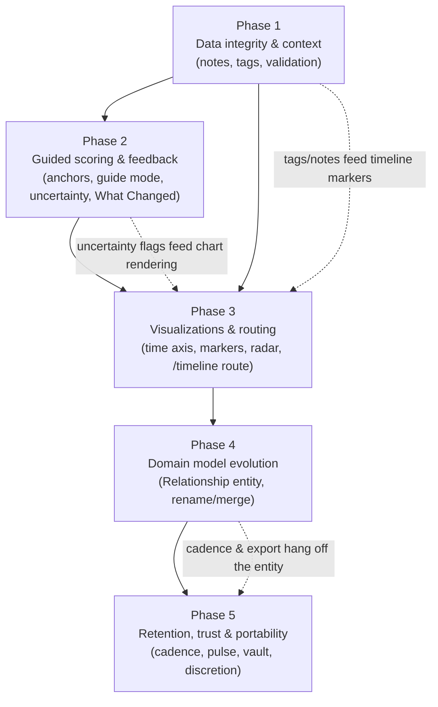

# Product Vision — Execution Roadmap

This folder translates [`Product_Vision.md`](Product_Vision.md) into five sequentially ordered
implementation phases. Each phase file is a self-contained specification that a developer or
coding agent can execute step-by-step. **Read this file first**; it defines the order, the
dependencies between phases, and the invariants that no phase may violate.

The specs assume familiarity with the reference documentation in [`docs/`](../docs/) —
particularly [Concepts](../docs/01-concepts.md), [Frontend](../docs/06-frontend.md), and
[Known Issues](../docs/11-known-issues.md). Where a spec touches a known defect, it cites it.

---

## The five phases

| # | File | Theme | Depends on |
| :- | :--- | :---- | :--------- |
| 1 | [`01-data-integrity-and-context.md`](01-data-integrity-and-context.md) | Stop silent data loss; make snapshots carry context (notes + tags); validate what the server stores. | — (baseline) |
| 2 | [`02-guided-scoring-and-feedback.md`](02-guided-scoring-and-feedback.md) | Anchored sliders, metric-first guided scoring, honest uncertainty, and the "What Changed" post-snapshot payoff. | Phase 1 |
| 3 | [`03-visualizations-and-routing.md`](03-visualizations-and-routing.md) | Time-proportional timeline with context markers, Love Shape radar profiles, deep-linkable timeline routes, glanceable card summaries. | Phases 1–2 |
| 4 | [`04-domain-model-evolution.md`](04-domain-model-evolution.md) | Promote the name-grouped "stack" into a first-class `Relationship` entity: rename, merge, referential integrity, server-side ordering. | Phases 1–3 |
| 5 | [`05-retention-trust-and-portability.md`](05-retention-trust-and-portability.md) | Gentle cadence nudges, quick-pulse snapshots, full export/import vault, trust page, discretion mode. | Phases 1–4 |

## Dependency graph

## Why this order

1. **Safety before surface.** Phase 1 fixes the `description` wipe bug
   ([Known Issues](../docs/11-known-issues.md#description-is-silently-erased-on-edit)) and adds
   server-side validation *before* any phase starts writing richer data. Every later phase
   stores more per snapshot (tags, uncertainty flags, guide answers, pulse markers); building
   those on an API that silently destroys and accepts garbage would compound the damage.
2. **Reward loop before decoration.** Phase 2 installs the missing habit payoff ("What
   Changed") and makes scores trustworthy (anchors, guided mode). It needs Phase 1's notes/tags
   so the payoff screen can prompt "add a note about what drove this," and needs Phase 1's
   validation so uncertainty semantics (absent key = not scored) are honored server-side.
3. **Visualization after semantics.** Phase 3's timeline markers render Phase 1's tags; its
   charts must render Phase 2's skipped/uncertain states correctly. Doing charts first would
   mean re-doing them twice.
4. **Structural refactor after UX validation, before retention.** Phase 4 is the only phase
   with a data migration. It is deliberately *late* (the name-grouping model, while fragile, is
   sufficient for Phases 1–3) but *before* Phase 5, because cadence preferences, rename/merge,
   and coherent export all need a real entity to hang off — per-relationship settings cannot be
   attached to an emergent string grouping.
5. **Retention last.** Cadence nudges are only defensible once snapshotting is low-friction
   (Phase 2) and rewarding (Phases 2–3). Inviting users back into a chore is churn; inviting
   them back into a payoff is retention.

## Invariants — every phase must preserve these

- **Self-scored, never computed.** No inference engine, no AI, no hidden math. Any arithmetic
  shown to the user (suggestion bands, deltas, volatility) must be transparent, explainable in
  one sentence in the UI, and never overwrite a user-authored value.
- **The user authors every number.** Suggestion bands never constrain the slider; deltas
  describe, never prescribe.
- **Non-clinical posture.** Descriptive vocabulary only ("dominant," "most changed") — never
  evaluative ("healthy," "concerning") and no diagnostic claims. "Alexithymia" names the
  motivating problem, not a screening feature.
- **The seven category ids are the stable contract.** `eros`, `ludus`, `storge`, `pragma`,
  `mania`, `agape`, `selflessness` — the JSON keys in `stats`, the chart `dataKey`s, and (from
  Phase 1 on) the server-side validation allowlist. Prose/taxonomy content stays frontend-only.
- **Single-user, no social graph.** Nothing transmits anywhere. Sharing exists only as
  deliberate local export (Phase 5).
- **Additive schema changes only, until Phase 4.** Phases 1–3 may only add nullable columns
  compatible with `AutoMigrate` on both SQLite and Postgres. Phase 4 owns the one structural
  migration and its backfill.

## Working conventions for implementers

- **Docs stay true.** Each phase ends by updating the affected files in `docs/`
  (the [source-of-truth map](../docs/README.md#source-of-truth-map) rule applies: when code and
  docs disagree, fix the docs in the same change).
- **Tests per phase.** Backend: extend the existing handler tests (`go test ./...`).
  Frontend: Vitest + Testing Library (`npm test`); each phase's verification section lists the
  minimum new coverage. The Playwright E2E suite is currently non-functional
  ([Known Issues](../docs/11-known-issues.md#the-e2e-suite-cannot-pass)) — do not rely on it
  for phase sign-off; manual QA checklists are provided instead.
- **Follow the majority axios convention** (global `axios` with the default header from
  `App.jsx`), not `Profile.jsx`'s private instance
  ([Frontend §6](../docs/06-frontend.md#6-profilejsx)).
- **Mind the `ID` casing trap** (`person.ID`, uppercase, from `gorm.Model`) and the Tailwind
  JIT rule (complete literal class strings only).
- **Security hardening is out of scope here.** The register in
  [Known Issues §Security](../docs/11-known-issues.md#security) (JWT secret fail-fast, upload
  validation, rate limiting) should be scheduled in parallel; these phases neither depend on
  nor replace it. Exception: Phase 5's trust page assumes `JWT_SECRET` fail-fast has landed —
  it is dishonest to ship a "your data is safe" page while tokens are forgeable by default.
