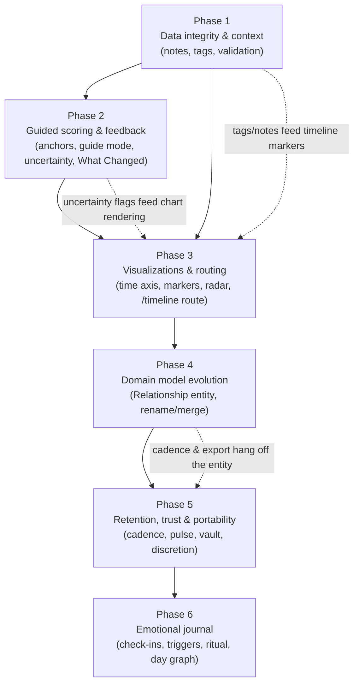

# Product Vision — Execution Roadmap

This folder translates [`Product_Vision.md`](Product_Vision.md) into sequentially ordered
implementation phases. Each phase file is a self-contained specification that a developer or
coding agent can execute step-by-step. **Read this file first**; it defines the order, the
dependencies between phases, and the invariants that no phase may violate.

*Phases 1–5 shipped, and their spec files — along with `Product_Vision.md` — are no longer on
disk; they live in git history at commit `fcd28b4`. **Phase 6 closed on 2026-09-04**: six of
its seven slices are built, 6-E was deliberately not built (encryption is not on the roadmap),
and **everything from 6-C onward is code that no person has yet used** — no one has tapped the
microphone, no model has run on a phone, and the embedding weights have never been loaded. Its
spec is [`06-emotional-journal.md`](06-emotional-journal.md), its execution plan is
[`06-implementation-prompts.md`](06-implementation-prompts.md), and the true state of the
branch is [`06-progress.md`](06-progress.md), which beats both where they disagree and carries
the closing summary. What Phase 6 did not do, and who has to do it, is [below](#carried-into-phase-7).*

The specs assume familiarity with the reference documentation in [`docs/`](../docs/) —
particularly [Concepts](../docs/01-concepts.md), [Frontend](../docs/06-frontend.md), and
[Known Issues](../docs/11-known-issues.md). Where a spec touches a known defect, it cites it.

---

## The phases

| # | File | Theme | Depends on |
| :- | :--- | :---- | :--------- |
| 1 | [`01-data-integrity-and-context.md`](01-data-integrity-and-context.md) | Stop silent data loss; make snapshots carry context (notes + tags); validate what the server stores. | — (baseline) |
| 2 | [`02-guided-scoring-and-feedback.md`](02-guided-scoring-and-feedback.md) | Anchored sliders, metric-first guided scoring, honest uncertainty, and the "What Changed" post-snapshot payoff. | Phase 1 |
| 3 | [`03-visualizations-and-routing.md`](03-visualizations-and-routing.md) | Time-proportional timeline with context markers, Love Shape radar profiles, deep-linkable timeline routes, glanceable card summaries. | Phases 1–2 |
| 4 | [`04-domain-model-evolution.md`](04-domain-model-evolution.md) | Promote the name-grouped "stack" into a first-class `Relationship` entity: rename, merge, referential integrity, server-side ordering. | Phases 1–3 |
| 5 | [`05-retention-trust-and-portability.md`](05-retention-trust-and-portability.md) | Gentle cadence nudges, quick-pulse snapshots, full export/import vault, trust page, discretion mode. | Phases 1–4 |
| 6 | [`06-emotional-journal.md`](06-emotional-journal.md) | An emotional journal underneath the snapshots: check-ins, triggers, a nightly ritual, a day graph, and — much later, opt-in and on-device — a small model that proposes labels for a spoken note. | Phases 1–5 |

## Dependency graph

## Why this order

1. **Safety before surface.** Phase 1 fixes the `description` wipe bug
   ([Known Issues](../docs/11-known-issues.md#description-is-silently-erased-on-edit)) and adds
   server-side validation *before* any phase starts writing richer data. Every later phase
   stores more per snapshot (tags, uncertainty flags, guide answers, pulse markers); building
   those on an API that silently destroys and accepts garbage would compound the damage.
2. **Reward loop before decoration.** Phase 2 installs the missing habit payoff ("What
   Changed") and makes scores trustworthy (anchors, guided mode). It needs Phase 1's notes/tags
   so the payoff screen can prompt "add a note about what drove this," and needs Phase 1's
   validation so uncertainty semantics (absent key = not scored) are honored server-side.
3. **Visualization after semantics.** Phase 3's timeline markers render Phase 1's tags; its
   charts must render Phase 2's skipped/uncertain states correctly. Doing charts first would
   mean re-doing them twice.
4. **Structural refactor after UX validation, before retention.** Phase 4 is the only phase
   with a data migration. It is deliberately *late* (the name-grouping model, while fragile, is
   sufficient for Phases 1–3) but *before* Phase 5, because cadence preferences, rename/merge,
   and coherent export all need a real entity to hang off — per-relationship settings cannot be
   attached to an emergent string grouping.
5. **Retention last.** Cadence nudges are only defensible once snapshotting is low-friction
   (Phase 2) and rewarding (Phases 2–3). Inviting users back into a chore is churn; inviting
   them back into a payoff is retention.

## Invariants — every phase must preserve these

- **Self-authored, never computed.** No hidden math. Any arithmetic shown to the user
  (suggestion bands, deltas, volatility) must be transparent, explainable in one sentence in
  the UI, and never overwrite a user-authored value. **Where inference exists at all (Phase 6),
  it runs on the user's device, is off by default, and *proposes* — it never writes a value, a
  label, or a person without the user's confirmation, and it never touches a score.**
  *"Authored" rather than "scored" since Phase 6:* a journal check-in has no score in it — the
  user picks words from a closed vocabulary and a strength for each — and the rule is the same
  one. Nothing is written that the user did not confirm with a tap, including a person, a
  trigger label, or a feeling.
  *"No hidden math" reaches similarity too, since 6-G:* the journal can compare the words you
  have used before and say *"you've called this 'work' before"*, and it may **never** show a
  number for how alike they are — not a score, not a percentage, not a count. The numbers live
  on the one device that made them, are never sent or exported, and are deleted at sign-out;
  and a suggestion is only offered when something the user actually confirmed agrees with it,
  meaning the same person or the same trigger. It proposes; the merge is still a tap.
  *And it reaches **search**, since G2:* the journal can be searched on the device, and what
  comes back is **entries** — a day, a time, your own words. The app does not summarise them,
  does not say what they have in common, draws no trend across them, and shows no number for
  how well any of them matched. Words that were **found** are kept in a separate list from
  entries that merely **look alike**, because the first is a fact the reader can check and the
  second is a guess. The same rule governs the three smaller things similarity may do on the
  check-in card: it may offer a word you chose before, it may put two people with the same name
  in an order, and it may move your own words to the front of a list — never a write, never a
  selection, and never a word you have not confirmed.
- **The user authors every number, and every label.** Suggestion bands never constrain the
  slider; deltas describe, never prescribe. A model's proposal arrives dashed and is discarded
  unless it is tapped.
- **Non-clinical posture.** Descriptive vocabulary only ("dominant," "most changed") — never
  evaluative ("healthy," "concerning") and no diagnostic claims. "Alexithymia" names the
  motivating problem, not a screening feature.
- **The seven category ids are the stable contract.** `eros`, `ludus`, `storge`, `pragma`,
  `mania`, `agape`, `selflessness` — the JSON keys in `stats`, the chart `dataKey`s, and (from
  Phase 1 on) the server-side validation allowlist. Prose/taxonomy content stays frontend-only.
- **Single-user, no social graph.** Nothing transmits anywhere. Sharing exists only as
  deliberate local export (Phase 5). **Model files travel one way, from the user's own server
  or app package to the device** — there is no path in the other direction, and no request to
  anywhere but this app's own origin. *Three consequences the code has to keep, all added in
  Phase 6.* **Audio is never stored and never sent**: the microphone is open only while the
  record button is lit, the buffer is transcribed in memory and released, and there is no
  upload path for it — the Vault page says this in writing and the recorder's own constants
  fill in the numbers. **Weights are pinned and verified, not merely fetched**: every model
  file is a revision plus a SHA-256 per file, checked before it is cached on the web and
  before it is renamed out of a `.part` on Android, which is what makes a one-way download
  over a cleartext LAN safe. And **the embedding index has no way out** — no server endpoint,
  no export path, no field in any request body, enforced by a test that walks every request
  the two screens produce. The one thing Phase 6 added that is held on the device *before*
  transmitting is the offline outbox (§9.5), which queues journal entries and nothing else,
  posts them to the same origin as every other write, and is named on the Vault page rather
  than left for a user to discover.
- **Additive schema changes only, outside Phase 4.** A phase may only add nullable columns, or
  whole new tables, compatible with `AutoMigrate` on both SQLite and Postgres. Phase 4 owns the
  one structural migration and its backfill, and it is meant to stay the only one. *Restated
  from "until Phase 4" in Phase 6:* the journal adds two tables and touches no existing column,
  so `make migrate-check-local` against a Phase-5 database reports exactly `missing table
  "journal_entries"` and `missing table "journal_mentions"` and nothing else. The rule was
  never about a deadline; it was about which phase is allowed to move data.

## Carried into Phase 7

Written at the Phase 6 closeout, 2026-09-04. **These are not a backlog of nice-to-haves — the
first four are the reason Phase 6 shipped verified by construction rather than by use**, and
until they are done the phase's central bet (does someone who finds feelings hard to name
record more, and more honestly?) cannot be answered in either direction. Each row says who
has to do it, because most of them cannot be closed by writing code.

| # | Item | Who | Why it is here |
| :- | :--- | :-- | :------------- |
| 1 | **Run U1, the user test.** | The operator | The instrument has existed since 2026-08-25 and was waived on 2026-08-31. Five or six participants, four of them German-first, over eight days. It is the only thing that can correct §5.3's twenty-one feelings and, more urgently, the **valence and energy constants that position every branch of the day graph** — those have no evidence of any kind behind them. It is also the only source that can answer the bet |
| 2 | **Put a phone on the project.** | The operator | Every manual checklist from 6-C onward is unrun, and all but 6-G's need hardware: nobody has tapped the microphone, no model has run on a phone, the airplane-mode acceptance test is unrun, the nightly reminder has never fired, the launcher shortcut has never been long-pressed, and the outbox has never queued anything in a tunnel. Three tier `(verify)` rows in §5.5 close with it too |
| 3 | **Load a real model, once, on any machine.** | Any session with the disk for it | `make journal-eval` exists, has four criteria in code, and **has passed nothing** — so no model is a tier default. EmbeddingGemma's 219 MB has never been fetched, `createWebEmbedder` has never been exercised, and `SIMILARITY_FLOOR = 0.65` is a guess with a reason. The retrieval golden set's eight semantic cases are the instrument that moves it |
| 4 | **Record the 240 golden clips.** | The operator | 120 cases × clean and noisy, German and English, read by consented speakers. Everything around them is built — the sentences, the per-clip WER ceilings, the naming, the consent register and its refusal path. Without them there is no German WER figure, and §5.1's question about a dedicated transcriber on the Full tier cannot be answered |
| 5 | **Decide `person_fact`.** | The operator | Either confirm docs/13 and let 6-E run, or decide knowingly to store verbatim text about a named third party in plain text. The decision is one line of consequence in the code — `alreadyKnown` is built, tested and wired to nothing — and it is the sixth of §5.8's six uses |
| 6 | **Empty the embedding index when the *toggle* is turned off, not only at sign-out.** | Engineering | Found by the closeout sweep. `writeEmbeddings(false)` writes a flag and drops the in-memory map; the IndexedDB rows stay. No copy anywhere is false — the Vault and the settings row both bind deletion to signing out — but embeddings are invertible, which is the whole reason rule 1 exists, and a user who switches the feature off has reason to expect the numbers to go with it |
| 7 | **A native embedding runtime.** | Engineering | The Android plugin's `embed()` rejects `unavailable`, so the phone shows a disabled toggle and **the Android shell has no recall and no search at all**. Written as a missing runtime behind an existing seam, not as a missing feature |
| 8 | **A *Suggest* button on the typed path.** | Engineering | §4.1 says a typed sentence gets the proposal card too if the model is on. Both runtimes take text now; D2 deferred it and D3 did not fit it. One button on the note field and one `propose` call |
| 9 | **Stream the weight download's hash.** | Engineering | The download manager reads a whole file into memory before hashing it — measured fine for a 1.59 GB file on a 32 GB desktop, and a 1.59 GB `ArrayBuffer` on a 6 GB phone is the failure this has not met yet |
| 10 | **Encryption, if docs/13 is ever confirmed.** | The operator | 6-E is written and never started. Nothing in the code has to change for it to become possible — the row shape, the opaque payload, the ids-only mention table and an outbox that never inspects what it holds were all built to keep the door open |

Two smaller ones the closeout's `/code-review` and `/simplify` passes found and left, recorded
so they are not rediscovered: the retrieval golden set's harness embeds **snapshot notes that
the shipped index deliberately excludes**, so its semantic half scores an index the app never
builds; and `payload.retrieval` **drops the record of an accepted trigger suggestion** — the
one interaction the provenance block exists to count. Both are in the Phase 6 ledger's
*Deferred and follow-ups* with what would close them.

## Working conventions for implementers

- **Docs stay true.** Each phase ends by updating the affected files in `docs/`
  (the [source-of-truth map](../docs/README.md#source-of-truth-map) rule applies: when code and
  docs disagree, fix the docs in the same change).
- **Tests per phase.** Backend: extend the existing handler tests (`go test ./...`).
  Frontend: Vitest + Testing Library (`npm test`); each phase's verification section lists the
  minimum new coverage. The Playwright E2E suite is currently non-functional
  ([Known Issues](../docs/11-known-issues.md#the-e2e-suite-cannot-pass)) — do not rely on it
  for phase sign-off; manual QA checklists are provided instead.
- **Follow the majority axios convention** (global `axios` with the default header from
  `App.jsx`), not `Profile.jsx`'s private instance
  ([Frontend §6](../docs/06-frontend.md#6-profilejsx)).
- **Mind the `ID` casing trap** (`person.ID`, uppercase, from `gorm.Model`) and the Tailwind
  JIT rule (complete literal class strings only).
- **Security hardening is out of scope here.** The register in
  [Known Issues §Security](../docs/11-known-issues.md#security) (JWT secret fail-fast, upload
  validation, rate limiting) should be scheduled in parallel; these phases neither depend on
  nor replace it. Exception: Phase 5's trust page assumes `JWT_SECRET` fail-fast has landed —
  it is dishonest to ship a "your data is safe" page while tokens are forgeable by default.
